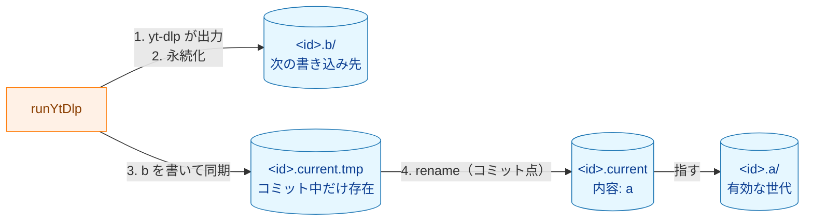

# キャッシュの一貫性と耐障害性

`internal/transcript` の字幕キャッシュが**何を保証し、何を保証しないか**と、その保証の根拠をまとめる。対象は、キャッシュへの書き込み（`Fetch` のキャッシュミス・強制再取得）、読み込み（キャッシュヒット）、削除（`RemoveCache`）、掃除（`PruneCache`）である。

キャッシュの構成と手順の定義（何をするか）は、タスク 0002 のアーキテクチャ設計書 [§3.5](../tasks/0002_ytdlp_transcript_source/02_architecture.md#35-キャッシュ) と [§6.3](../tasks/0002_ytdlp_transcript_source/02_architecture.md#63-キャッシュ更新の状態と中断時の残留) にある。本書は、その手順が**なぜ安全か**を説明する。セキュリティ上の規則は [security.md](security.md) の §5 にある。

キャッシュのコードを変更するときは、§7 のチェックリストで、本書の保証が崩れていないことを確認する。

## 1. 構成の要約

動画 ID ごとに、次の固定名のエントリだけを使う。

| エントリ | 名前 | 役割 |
|---|---|---|
| スロット | `<id>.a`・`<id>.b` | 1 回の `yt-dlp` の出力（`<id>.ja.json3`・`<id>.info.json`）を入れるディレクトリ |
| ポインタ | `<id>.current` | どちらのスロットが有効かを示す。内容は `a` または `b` の 1 バイト |
| ポインタの一時ファイル | `<id>.current.tmp` | ポインタを置き換える前に内容を書くファイル |

**Legend:** 青の円柱はディスク上のエントリ、橙はそれを操作する関数を表す。矢印の番号は書き込みの順序である。

有効な世代を切り替える操作は、ポインタの `rename` の 1 回だけである。書き込みは常に、ポインタが**指していない**側のスロットに行う。

## 2. 保証すること

以下の保証は、§3 の前提が成り立つ場合に限る。

- **G1 世代の単一性:** `Fetch` が返す `Transcript` は、1 回の `yt-dlp` の出力だけから組み立てられる。新旧の世代が混ざることはない。
- **G2 失敗時の不変性:** 書き込みの途中で `Fetch` がエラーを返した場合、既存の有効なキャッシュ（ポインタと、それが指すスロットの中身）は変わらない。
- **G3 クラッシュ一貫性:** 書き込み・削除・掃除のどの時点でプロセスが終了しても、電源が落ちても、再起動後の状態は次のいずれかである。
  - 旧世代が有効（ヒット）
  - 新世代が有効（ヒット）
  - 有効な世代が無い（キャッシュミス。次の `Fetch` で再取得する）

  どの場合も、壊れた内容や新旧が混ざった内容を有効な世代として読むことはない。
- **G4 成功の永続性（条件付き）:** `Fetch` が成功を返した時点で、新世代のスロットの中身とポインタの一時ファイルの中身はディスクに確定している。ポインタのリネーム自体の確定は、キャッシュディレクトリの同期に成功した場合に限られる（§5.3）。確定していない場合、電源断の後は旧世代に戻ることがあるが、G3 の範囲に収まる。
- **G5 残留物の回収:** 中断で残った不要なエントリ（dangling なエントリ）は、同じ動画の次の `Fetch`、`RemoveCache`、または `PruneCache` で削除される。
- **G6 触れる範囲:** 作成・変更・削除するのは、検証済みの動画 ID から組み立てた §1 の固定名のエントリだけである。期待する種別と異なるエントリ（シンボリックリンクを含む）は辿らず、変更しない。

## 3. 前提

保証は次の前提に依存する。前提が崩れる環境での動作は保証しない。

- **P1 単一ライター:** 同じキャッシュディレクトリに対する `Fetch`・`RemoveCache`・`PruneCache` を同時に実行しない。呼び出し側が直列化する（設計書 §3.5「単一ライターの前提」）。
- **P2 利用者専用のディレクトリ:** キャッシュディレクトリには、利用者本人（と、本人が起動した `yt-dlp`）以外は書き込まない（設計書 §5.2・§5.3）。
- **P3 ローカルのファイルシステム:** 同じディレクトリ内の `rename(2)` が atomic に置き換わり、クラッシュの後も「置き換え前」か「置き換え後」のどちらかになる。ext4・XFS・Btrfs・APFS などのジャーナル付き、または copy-on-write のファイルシステムを想定する。NFS・SMB などのネットワークファイルシステムは想定しない。
- **P4 同期の正直さ:** `fsync`（macOS では `F_FULLFSYNC`）が成功を返したら、そのデータは電源断を越えて残る。ストレージが書き込みキャッシュの内容を失う場合（電源保護の無いディスクキャッシュを無効化できない構成など）は対象外である。

## 4. 理論的な裏付け

### 4.1. 世代を複製して切り替える（shadow paging）

書き込みは有効でない側のスロットだけに行い、切り替えはポインタの置き換え 1 回で行う。データベースの shadow paging や、ファームウェアの A/B 更新と同じ構造である。

- 有効な世代のファイルには、読み込み以外で一度も触れない。したがって、ポインタを置き換えるまでのどこで失敗しても、有効な世代は変わらない（G2）。
- 置き換える前の失敗を元に戻す操作（ロールバック）が要らない。書きかけのスロットは、ポインタから指されない dangling なエントリになるだけである。
- 書き込み先のスロットは、`prepareWriteSlot` が一度削除して空で作り直す。前回の出力の残りを今回の出力と取り違えることはない。

### 4.2. `rename(2)` による atomic な置き換え

POSIX は、`rename` の置き換え先が既に存在する場合、他のプロセスから見て、置き換え先が「存在しない瞬間」を持たずに旧から新へ切り替わることを定めている。これにより、実行中の他のプロセスは旧ポインタか新ポインタのどちらかしか見ない。

POSIX が定めるのは実行中の atomicity であり、クラッシュの後の atomicity ではない。後者は P3 のファイルシステムが、ディレクトリの変更をジャーナルまたは copy-on-write の単位でまとめて確定させることによって得られる。

### 4.3. リネームの前に中身を同期する

`commitCache` は、一時ファイルに `a` または `b` を書き、`Sync` してから `rename` する。

同期しないと、ファイルシステムによっては、リネーム（メタデータ）だけが確定し、ファイルの中身が確定しないまま電源が落ちることがある。ext4 の遅延割り当てで知られる「リネーム後のファイルが 0 バイトになる」問題がその例である。先に同期することで、リネームが確定していれば、ポインタの中身も確定していることが保証される。

スロットの中身についても同じ順序を守る。`persistSlot` が字幕ファイル・info.json・スロットのディレクトリを同期してから、`commitCache` がポインタを置き換える。したがって、新しいポインタが確定していれば、それが指すスロットの中身も確定している。

### 4.4. ディレクトリの同期

ファイルを `fsync` しても、そのファイルを指すディレクトリのエントリ（作成やリネームの結果）が確定するとは限らない。ディレクトリのエントリを確定させるには、ディレクトリ自体を開いて `fsync` する。

- `persistSlot` は、スロットの中のファイルのエントリを確定させるため、スロットのディレクトリを同期する。失敗はエラーとして返し、コミットしない。
- `commitCache` は、リネームを確定させるため、リネームの後にキャッシュディレクトリを同期する。こちらはベストエフォートで、失敗しても成功を返す（§5.3）。

### 4.5. macOS での同期

macOS の `fsync(2)` は、データをドライブに渡すだけで、ドライブの書き込みキャッシュからの書き出しまでは待たない。Go の `(*os.File).Sync` は darwin では `fcntl(F_FULLFSYNC)` を呼び、ドライブのキャッシュまで書き出す（`F_FULLFSYNC` が使えない SMB などでは `fsync` にフォールバックする。Go の `internal/poll/fd_fsync_darwin.go`）。本実装は `(*os.File).Sync` だけを使うので、macOS でも P4 の意味での同期になる。

### 4.6. 読み込み側の厳密な検証

書き込み側の順序に加えて、読み込み側が内容を厳密に検証する。書き込み側の保証が何らかの理由で崩れた場合も、壊れた内容を正しい内容として返さないための多重防御である。

- **ポインタ:** `readPointer` は、サイズがちょうど 1 バイトで内容が `a` か `b` の場合だけを有効とする。それ以外は「内容がそれ以外」としてキャッシュミスにし、読み取り中に短くなっていれば「存在しない」とする。書きかけのポインタを有効と誤認しない。
- **スロットの中身:** 両方のファイルが揃っていない場合はキャッシュミスとする。存在するファイルは、json3 と info.json のパーサで構文と型を検証し、info.json の `id` が要求した動画 ID と一致することも確認する。途中で切れた JSON は構文エラーになり、`ErrParseSubtitles` / `ErrParseInfo` として報告され、正しい字幕としては返らない。
- **サイズの上限:** 読み込みは `readFileBounded` で上限を設ける。壊れて巨大になったファイルを全体として読み込まない。

この検証が検出できるのは、構文として壊れた内容である。構文として正しいまま中身だけが変わる破損（ビット化けなど）は検出しない（§6）。

## 5. 中断・電源断の場合の分析

### 5.1. 書き込み（`runYtDlp`）

旧世代がスロット `a` にある場合を示す（初回の取得ではポインタが存在しない）。「残る状態」の列は設計書 §6.3 の表の行を示す。

| 中断した時点 | 再起動後のポインタ | 読み込みの結果 | 残る状態 |
|---|---|---|---|
| `prepareWriteSlot`（スロット `b` の削除・作成）の途中 | `a` | 旧世代（ヒット） | S1 |
| `yt-dlp` の実行中・出力の検証中 | `a` | 旧世代（ヒット） | S1 |
| `persistSlot`（`0o600` 化・同期）の途中 | `a` | 旧世代（ヒット） | S1 |
| `commitCache` の、一時ファイルの作成・書き込み・同期・クローズの途中 | `a` | 旧世代（ヒット）。一時ファイルは空または書きかけでも読まれない | S2 |
| `rename` の後、キャッシュディレクトリの同期の前 | `a` または `b` | `a` なら旧世代、`b` なら新世代。どちらのスロットも完全 | S2 または S3 |
| キャッシュディレクトリの同期の後 | `b` | 新世代（ヒット） | S3 |
| 終了時の dangling なエントリの削除（スロット `a` の削除）の途中 | `b` | 新世代（ヒット）。削除途中のスロット `a` は読まれない | S3 |

どの行も G3 の 3 つの状態のいずれかであり、残ったエントリは G5 によって後で削除される。

### 5.2. 削除（`RemoveCache`）と掃除（`PruneCache`）

`RemoveCache` は、最初にポインタを削除する。ポインタの削除がキャッシュの無効化の点であり、その後にスロットを削除する。

- ポインタの削除の前に中断した場合は、削除前の有効なキャッシュがそのまま残る。
- ポインタの削除の後に中断した場合は、ポインタの無いキャッシュミスになる（S6）。残ったスロットは dangling なエントリとして後で削除される。

`PruneCache` と `Fetch` の終了時の削除は、ポインタが**指していない**エントリだけを削除する。ポインタにも、それが指すスロットにも触れない。そのため、途中で中断しても有効な世代は変わらない。

### 5.3. 残る弱点（データは壊れない）

以下は、厳密に言えば保証に穴がある箇所である。どれもキャッシュミス（再取得）または旧世代への巻き戻りで済み、壊れた内容を読むことにはならない。

1. **リネームの後のディレクトリの同期を無視する:** `commitCache` はリネームの後の `syncDir` の失敗を無視して成功を返す。この時点でポインタはすでに置き換わっているので、エラーを返すと「コミットに失敗した」と誤って伝えることになる。同期に失敗した後に電源が落ちると、旧世代に戻りうる（G4 が条件付きである理由）。旧スロットには触れていないので、矛盾は生じない。
2. **スロットの作成をキャッシュディレクトリに確定させていない:** `prepareWriteSlot` の `os.Mkdir`（とキャッシュディレクトリ自体の `os.MkdirAll`）の後に、親ディレクトリを同期していない。ジャーナル付きのファイルシステムは、同じディレクトリの変更を順に確定させるので、リネームが確定していればスロットの作成も確定している。順序を保証しないファイルシステムでは、ポインタが存在しないスロットを指すことがありうる。その場合は `readCached` がスロット無しと判定し、キャッシュミスになる。
3. **削除の確定:** 終了時の dangling なエントリの削除は同期しない。電源断で削除が取り消されても、エントリは dangling のまま残り、G5 によって後で削除される。

## 6. 保証しないこと

- **同時実行:** 同じキャッシュディレクトリに対する複数のプロセスからの同時の書き込み・削除・掃除（P1）。掃除が実行中の `Fetch` の書き込み先スロットを削除しうる。
- **他者による変更:** 利用者以外がキャッシュディレクトリに書き込める環境（P2）。検証とその後の操作の間にエントリがシンボリックリンクに置き換えられる、などの競合は防がない。
- **ネットワークファイルシステム:** NFS・SMB など、`rename` や `fsync` の意味が異なるファイルシステム（P3）。
- **ストレージの故障:** `fsync` の成功を守らないストレージ（P4）、およびビット化けなど、構文として正しいまま中身が変わる破損。
- **大文字と小文字を区別しないファイルシステムでの ID の衝突:** 大文字と小文字だけが異なる 2 つの動画 ID が同じエントリに対応する（設計書 §3.5「既知の制限」）。info.json の `id` の照合で `ErrParseInfo` になり、別の動画の字幕を返すことはない。

## 7. 変更時のチェックリスト

キャッシュのコード（`internal/transcript/cache.go` と `ytdlp.go` のキャッシュ関連部分）を変更するときに確認する。

- [ ] 有効な世代を切り替える操作が、ポインタの `rename` の 1 回だけのままである（§4.1・§4.2）。
- [ ] ポインタが指すスロットに、読み込み以外の操作をしていない（§4.1）。
- [ ] コミットの前に、スロットのファイル・スロットのディレクトリ・ポインタの一時ファイルを同期している（§4.3・§4.4）。
- [ ] 同期に `(*os.File).Sync` を使っている（§4.5）。
- [ ] 削除では、ポインタを最初に削除するか、ポインタが指していないエントリだけを削除している（§5.2）。
- [ ] 読み込み側の検証（ポインタの 1 バイト判定、ペアの揃い、パーサ、サイズの上限）を緩めていない（§4.6）。
- [ ] 新しい中断点を加えた場合、再起動後の状態が設計書 §6.3 の表のいずれかの行に収まり、その状態を直接作るテストがある。

## 8. コードとの対応

| 関数（`internal/transcript`） | 本書の節 |
|---|---|
| `readPointer` | §4.6 |
| `writeSlot`・`prepareWriteSlot` | §4.1・§5.3 |
| `persistSlot`・`syncFile`・`syncDir` | §4.3・§4.4・§4.5 |
| `commitCache` | §4.2・§4.3・§4.4・§5.3 |
| `readCached`・`readFileBounded` | §4.6 |
| `danglingEntries`・`removeDangling`・`RemoveCache`・`PruneCache` | §5.2 |
