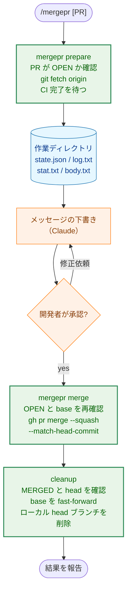

# mergepr 利用ガイド

`mergepr` は、PR を squash merge し、マージ後のローカルブランチを片付けるための開発者向けツールである。Claude Code の `/mergepr` コマンドから使うことを想定している。本書では、前提となる環境、使い方、ツールが保証すること・しないこと、止まったときの対処を説明する。

本リポジトリでは、すべての PR を squash merge する（`.claude/commands/_context.md` の「PR merge method」）。`main` に残るのは squash commit だけなので、そのコミットメッセージには、CLAUDE.md がコミットメッセージに記録するよう求める内容（実装を壊してテストが失敗することを確認した記録など）を引き継ぐ必要がある。`/mergepr` は、そのメッセージを PR の材料から下書きし、承認を得てからマージする。

本文は、PR の最終的な状態を簡潔にまとめたものとする。コミット済みの文書（タスクの `03_implementation_plan.md` など）に既に記録されている詳細は、その文書を参照し、そこに定められた手順（実装を壊してテストが失敗することを確認する手順など）を実施したこと、および名前の挙がった各テストが失敗することを確認したことを書く。リポジトリのどこにも記録されていない検証の記録、正当化の理由、義務、カバレッジの確認は、本文に 1 行程度の記録として残す。squash merge の後は、PR のコミットも `log.txt` も `main` から辿れなくなるためである。下書きの詳しい規則は `.claude/commands/mergepr.md` の手順 2 にある。

## 1. 位置付け

`mergepr` は、PR を作成した本人が自分の PR をマージするための内部ツールである。悪意のある利用者・設定・PR 内容に対する防御は行わない。標準的な環境で使うことを前提とし、その前提を 2 章に示す。

役割分担は次のとおり。

| 担当 | 内容 |
|---|---|
| `mergepr` バイナリ（`cmd/mergepr`、`internal/mergepr`） | PR 情報と材料の取得、CI 待ち、マージ、マージ後の片付け |
| `/mergepr` コマンド（`.claude/commands/mergepr.md`） | 上記の呼び出し順の制御、コミットメッセージの下書き、ユーザーへの承認依頼 |
| 開発者 | メッセージの確認と承認、ツールが止まったときの対処 |

## 2. 前提条件

| 項目 | 内容 |
|---|---|
| `git`、`gh` | `PATH` 上にあり、`gh auth login` 済みであること |
| `origin` | GitHub 上の本リポジトリを指していること |
| gh のデフォルトリポジトリ | `gh` がプロンプトなしで `origin` を選ぶこと。リモートが複数あるときは `gh repo set-default` で設定する |
| リモートブランチの自動削除 | GitHub のリポジトリ設定「Automatically delete head branches」が有効であること。`mergepr` はリモートの head ブランチを削除しない |
| merge queue | 使用しないこと |
| CI | PR に CI のチェックが 1 つ以上あること。チェックが無い PR では `gh pr checks` が失敗するため、`prepare` が止まる |

リモートブランチの自動削除が有効かどうかは、次のコマンドで確認できる（`true` なら有効）。

```sh
gh api repos/isseis/yt2column --jq .delete_branch_on_merge
```

## 3. インストール

最新の `main` をチェックアウトした状態で、次を実行する。

```sh
make install-mergepr
```

`$(go env GOPATH)/bin` に `PATH` が通っていることを確認する。ツール自体を変更した PR がマージされたら、`main` を更新してから再インストールする。

`mergepr` を導入する PR そのものは、まだ `main` にツールが無いため `/mergepr` ではマージできない。`gh pr merge --squash` など、別の手段でマージする。

## 4. 処理の流れ



| 段階 | 実行者 | ネットワーク操作 | 取り消し |
|---|---|---|---|
| `prepare` | ツール | `gh pr view`、`git fetch`、`gh pr checks` | 不要（読み取りのみ） |
| 下書き・承認 | Claude と開発者 | なし | 何度でもやり直せる |
| `merge` | ツール | `gh pr merge` | **不可** |
| `cleanup` | ツール | `git fetch --prune` | ローカル操作のみ |

`/mergepr` を実行すると、`prepare` と `cleanup` のネットワーク操作は許可したものとして扱われる。マージは許可に含まれず、必ず承認の段階で開発者の明示的な yes を必要とする（CLAUDE.md の「Tool Execution Safety」）。

## 5. 使い方

### 5.1 `/mergepr` から使う（推奨）

Claude Code で次のように実行する。

```text
/mergepr          # 現在のブランチの PR
/mergepr 42       # PR 番号で指定
/mergepr https://github.com/isseis/yt2column/pull/42
```

Claude は `prepare` を実行してメッセージを下書きし、PR の URL、base ブランチ、CI の結果、件名と本文を示して承認を求める。修正したい点があれば指示する。yes と答えるとマージと片付けが行われ、マージコミットと片付けの結果が報告される。

### 5.2 手動で使う

各サブコマンドは単独でも実行できる。`merge`、`cleanup`、`discard` は `state.json` を入力に取るため、位置引数を渡すと usage エラーで止まる。

```sh
mergepr prepare [PR]
mergepr merge --state FILE --subject-file FILE --body-file FILE
mergepr cleanup --state FILE
mergepr discard --state FILE
```

#### `prepare [PR]`

PR を引数なし（現在のブランチ）、番号、URL のいずれかで指定する。引数はそのまま `gh pr view` に渡す。処理内容は次のとおり。

1. PR が OPEN であることを確認する。
2. `git fetch origin` を実行する。
3. `gh pr checks --watch --fail-fast` で CI の完了を待つ。失敗したチェックがあれば止まる。
4. 作業中のチェックアウト内に新しい作業ディレクトリを作成し、次のファイルを書き出す。本体のチェックアウトではリポジトリの git ディレクトリ配下（`.git/mergepr-*`）に、git ディレクトリが本体側にある worktree では worktree のルートに `mergepr-*` ディレクトリを作る。材料をチェックアウト内に保つことで、作業ツリーの外に触れずに済む。

| ファイル | 内容 |
|---|---|
| `state.json` | PR 番号、head ブランチ名と OID、base ブランチ名、タイトル、URL、準備した作業ディレクトリのパス。後続の `merge` と `cleanup` はこの値を使う |
| `log.txt` | `origin/<base>..<headOID>` の全コミットメッセージ |
| `stat.txt` | `origin/<base>...<headOID>` の diff stat |
| `body.txt` | PR の説明文 |

出力例:

```text
PR #42: feat(writer): add column heading
url:   https://github.com/isseis/yt2column/pull/42
head:  feature/foo at 2222222222222222222222222222222222222222
base:  main
CI:    all checks passed
dir:   /repo/.git/mergepr-123456 (state.json, log.txt, stat.txt, body.txt)
state: /repo/.git/mergepr-123456/state.json
```

材料で足りないときは、リポジトリのルートで次を実行して個別ファイルの差分を見る。

```sh
git diff origin/<base>...<headOID> -- <path>
```

#### `merge --state FILE --subject-file FILE --body-file FILE`

件名ファイルは空でない 1 行でなければならない（末尾の改行は除去される）。本文ファイルは内容をそのまま使う。処理内容は次のとおり。

1. PR がまだ OPEN で、base が `state.json` と同じであることを確認する。
2. `gh pr merge --squash --match-head-commit <headOID>` でマージする。
3. 続けて `cleanup` と同じ片付けを行う。

#### `cleanup --state FILE`

マージ後の片付けだけを行う。`merge` が片付けの途中で止まったときや、マージ自体は済んだのに `merge` がエラーを返したときに使う。処理内容は次のとおり。

1. PR が MERGED であり、マージされた head の OID が `headOID` と同じであることを確認する。異なれば、ローカルのブランチには触れずに止まる。
2. `git fetch --prune origin` を実行する。
3. base ブランチの扱いを決める。
   - 現在のブランチが base なら、そのまま進む。
   - base が別の worktree でチェックアウトされているなら、ローカルのブランチには触れず、note を表示して正常終了する（5.3 節）。
   - それ以外なら、`git switch <base>` で切り替える。
4. `git merge --ff-only origin/<base>` で base を最新にする。
5. ローカルの head ブランチが `headOID` を指しているときだけ `git branch -D` で削除する。ブランチが無ければ何もしない。
6. 片付けが終わったら、準備した作業ディレクトリを削除する。エラーで止まった場合は、`cleanup` を再実行できるようディレクトリを残す。

結果の出力例:

```text
merge commit:         3333333333333333333333333333333333333333
base branch updated:  true
local branch deleted: true
```

#### `discard --state FILE`

PR のマージを必要とせず、PR やローカルのブランチにも触れずに、準備した作業ディレクトリを削除する。head がマージ前に動いた場合など、準備を使えなくなったときに使う。材料をチェックアウト内に残さないためのコマンドである。`merge` と `cleanup` と同様に、削除するのは `state.json` が記録しているディレクトリだけであり、それは state ファイルを収めているディレクトリでもある。state ファイルを別の場所へ移動・コピーしていると別のディレクトリを指すため、`discard` は何も削除せずエラーで止まる。

### 5.3 worktree で使う場合

`main` を本体のチェックアウトで開いたまま、別の worktree で作業していることがある。この場合、作業中の worktree では `main` に切り替えられない。`mergepr` はマージを行ったうえで、ローカルのブランチには触れずに次の note を表示する。

```text
note: main is checked out in another worktree; update it there and remove this worktree (or delete feature/foo) yourself
```

その後の作業は次のとおり。

1. `main` をチェックアウトしている worktree で `git merge --ff-only origin/main` を実行する。
2. 不要になった worktree を削除する。worktree を残すなら、別のブランチに切り替えてから head ブランチを削除する。

`/runplan` の次の PR に進むときは、更新した `main` から新しいブランチを作る。マージ済みのブランチから分岐してはならない。squash merge 後のブランチのコミットは `main` の祖先にならないため、分岐すると前の PR のコミットが次の PR に混入する。

## 6. ツールが保証すること・しないこと

### 6.1 保証すること

| 保証 | 仕組み |
|---|---|
| CI が通った head だけをマージする | `prepare` で CI を待ち、`merge` は `--match-head-commit` でその head の OID を指定する。`prepare` の後に head へ push があると、GitHub がマージを拒否する |
| 承認したメッセージでマージする | 件名と本文はファイルから読み、そのまま `gh pr merge` に渡す |
| 準備した base にマージする | マージ直前に、base が `state.json` と同じことを確認する |
| ローカルの未マージコミットを消さない | ローカル head ブランチは、`headOID` を指しているときだけ削除する。マージされた head が `headOID` と異なるときは、ローカルのブランチに触れない |

### 6.2 保証しないこと

前提条件（2 章）を満たさない環境での動作は保証しない。特に次の点に注意する。

- 特殊な git 設定（hooks、`push.*` 設定など）や、`origin` 以外を向いた gh の設定には対応しない。
- リモートの head ブランチは削除しない。GitHub の自動削除設定に任せる。
- PR の作業ツリーの未コミット変更は確認しない。`git switch` が衝突すれば、git 自身のエラーで止まる。
- 大きすぎる PR の材料も切り詰めずにそのまま書き出す。

## 7. 止まったときの対処

`mergepr` は、問題を見つけると理由と対処を表示して止まる。止まった場合はシェルコマンドで回避せず、原因を取り除いてから再実行する。

| メッセージ（抜粋） | 段階 | 原因 | 対処 |
|---|---|---|---|
| `PR is not open` | `prepare` | PR がクローズまたはマージ済み | 対象の PR を確認する |
| `CI checks failed` | `prepare` | 失敗したチェックがある、またはチェックが無い | CI を直して push し、`prepare` からやり直す |
| `squash subject is not a non-empty single line` | `merge` | 件名ファイルが空、または複数行 | 件名ファイルを直して `merge` を再実行する |
| `PR is not open: ... run mergepr cleanup` | `merge` | 前回の実行で既にマージされている | 表示された `mergepr cleanup --state ...` を実行する |
| `PR base changed after prepare` | `merge` | PR の base が変更された | `prepare` からやり直す |
| `merge PR: ...` | `merge` | head が `prepare` 後に動いた、ブランチ保護に引っかかった、など | head が動いたなら、使えなくなった準備を `mergepr discard --state ...` で破棄してから `prepare` からやり直す。PR がマージ済みなら表示された `cleanup` を実行する |
| `PR is not merged` | `cleanup` | まだマージされていない | マージを確認してから再実行する |
| `switch to <base>: ...` | `cleanup` | 未コミット変更が衝突した、など | 作業ツリーを整理して `cleanup` を再実行する |
| `fast-forward <base>: ...` | `cleanup` | ローカルの base に `origin` に無いコミットがある | base のコミットを整理して `cleanup` を再実行する |
| `local head branch moved after prepare; not deleted` | `cleanup` | `prepare` 後にローカル head ブランチへコミットした | そのコミットが必要か確認し、不要ならブランチを手動で削除する |
| `PR merged a different head than prepared` | `cleanup` | `prepare` 後に head が force-push され、その head がマージされた | ローカル head ブランチに PR に含まれなかったコミットが無いか確認し、base の更新とブランチの削除を手動で行う |
| `invalid state` | `merge`、`cleanup`、`discard` | `--state` に `prepare` が書いたファイル以外を指定した | `prepare` が表示したパスを指定する |
| `state file does not name the directory it lives in` | `discard` | `--state` が、`prepare` が作ったディレクトリの外へ移動・コピーされた state ファイルを指している | `prepare` が表示したパスを指定する。安全と分かっているなら準備したディレクトリを自分で削除する |

`merge` は取り消せない段階である。その後に止まっても、マージ自体は完了していることがある。GitHub で PR の状態を確認し、マージ済みなら `cleanup` で片付けを再開する。`state.json` はチェックアウト内の作業ディレクトリ（本体のチェックアウトでは `.git/mergepr-*`、worktree では `mergepr-*`）にあるため、片付けが終わるまで削除しない。片付けが成功すると、ツールがディレクトリを削除する。使えなくなった準備（head がマージ前に動いた場合など）は、チェックアウト内に残さず `discard` で削除する。

## 8. ツールを変更する場合

- 実装は `internal/mergepr`、CLI は `cmd/mergepr` にある。外部コマンドは `Runner` インターフェース越しに呼び出す。テストでは、期待するコマンド列を順に再生する `fakeRunner`（`internal/mergepr/test_helpers.go`）を使い、`git` や `gh` を実行しない。
- 6.1 節の保証を変更する場合は、対応する実装を壊してテストが失敗することを確認し、そのことをコミットメッセージに書く（CLAUDE.md の「Testing Strategy」）。
- 手順や前提を変更したら、本書と `.claude/commands/mergepr.md` を合わせて更新する。
