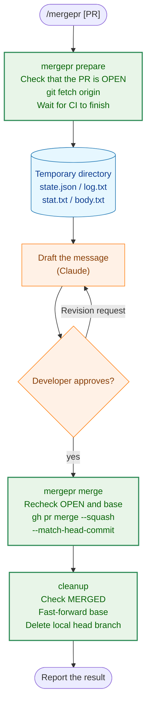

# mergepr Usage Guide

`mergepr` is a developer tool for squash-merging a PR and cleaning up the local branches after the merge. It is intended to be used from Claude Code's `/mergepr` command. This document explains the required environment, usage, what the tool guarantees and does not guarantee, and what to do when it stops.

This repository squash-merges every PR (`.claude/commands/_context.md`, "PR merge method"). Only the squash commit remains on `main`, so its commit message must carry forward what CLAUDE.md requires a commit message to record (such as the record of confirming that a test fails when the code it covers is broken). `/mergepr` drafts that message from the PR's material and merges after obtaining approval.

## 1. Role of the Tool

`mergepr` is an internal tool for the author of a PR to merge their own PR. It does not defend against malicious users, configuration, or PR contents. It assumes use in a standard environment, and those assumptions are listed in Section 2.

The division of responsibilities is as follows.

| Responsible party | Responsibilities |
|---|---|
| `mergepr` binary (`cmd/mergepr`, `internal/mergepr`) | Retrieving PR information and material, waiting for CI, merging, post-merge cleanup |
| `/mergepr` command (`.claude/commands/mergepr.md`) | Controlling the order of the calls above, drafting the commit message, requesting approval from the user |
| Developer | Reviewing and approving the message, handling cases where the tool stops |

## 2. Prerequisites

| Item | Requirement |
|---|---|
| `git`, `gh` | On `PATH`, with `gh auth login` completed |
| `origin` | Points to this repository on GitHub |
| gh default repository | `gh` selects `origin` without prompting. When there are multiple remotes, set it with `gh repo set-default` |
| Automatic deletion of remote branches | The GitHub repository setting "Automatically delete head branches" is enabled. `mergepr` does not delete the remote head branch |
| Merge queue | Must not be used |
| CI | The PR has at least one CI check. For a PR with no checks, `gh pr checks` fails, so `prepare` stops |

You can check whether automatic deletion of remote branches is enabled with the following command (`true` means enabled).

```sh
gh api repos/isseis/yt2column --jq .delete_branch_on_merge
```

## 3. Installation

With the latest `main` checked out, run the following.

```sh
go install ./cmd/mergepr
```

Make sure `$(go env GOPATH)/bin` is on `PATH`. When a PR that changes the tool itself is merged, update `main` and then reinstall.

The PR that introduces `mergepr` itself cannot be merged with `/mergepr`, because `main` does not yet contain the tool. Merge it by other means, such as `gh pr merge --squash`.

## 4. Processing Flow



| Stage | Performed by | Network operations | Undo |
|---|---|---|---|
| `prepare` | Tool | `gh pr view`, `git fetch`, `gh pr checks` | Not needed (read-only) |
| Drafting and approval | Claude and the developer | None | Can be redone any number of times |
| `merge` | Tool | `gh pr merge` | **Not possible** |
| `cleanup` | Tool | `git fetch --prune` | Local operations only |

Running `/mergepr` is treated as authorizing the network operations of `prepare` and `cleanup`. The merge is not included in that authorization and always requires the developer's explicit yes at the approval stage (CLAUDE.md, "Tool Execution Safety").

## 5. Usage

### 5.1 Using it from `/mergepr` (recommended)

Run it in Claude Code as follows.

```text
/mergepr          # PR for the current branch
/mergepr 42       # Specify by PR number
/mergepr https://github.com/isseis/yt2column/pull/42
```

Claude runs `prepare`, drafts the message, and requests approval, showing the PR URL, the base branch, the CI result, and the subject and body. If there is anything you want revised, say so. When you answer yes, the merge and cleanup are performed, and the merge commit and the cleanup result are reported.

### 5.2 Using it manually

Each subcommand can also be run on its own.

```sh
mergepr prepare [PR]
mergepr merge --state FILE --subject-file FILE --body-file FILE
mergepr cleanup --state FILE
```

#### `prepare [PR]`

Specify the PR with no argument (the current branch), a number, or a URL. The argument is passed to `gh pr view` as is. It does the following.

1. Checks that the PR is OPEN.
2. Runs `git fetch origin`.
3. Waits for CI to finish with `gh pr checks --watch --fail-fast`. It stops if any check failed.
4. Creates a temporary directory and writes the following files.

| File | Contents |
|---|---|
| `state.json` | PR number, head branch name and OID, base branch name, title, URL. The subsequent `merge` and `cleanup` use these values |
| `log.txt` | Every commit message in `origin/<base>..<headOID>` |
| `stat.txt` | The diff stat of `origin/<base>...<headOID>` |
| `body.txt` | The PR description |

Example output:

```text
PR #42: feat(writer): add column heading
url:   https://github.com/isseis/yt2column/pull/42
head:  feature/foo at 2222222222222222222222222222222222222222
base:  main
CI:    all checks passed
dir:   /var/folders/.../mergepr-123456 (state.json, log.txt, stat.txt, body.txt)
state: /var/folders/.../mergepr-123456/state.json
```

When the material is insufficient, run the following at the repository root to see the diff of an individual file.

```sh
git diff origin/<base>...<headOID> -- <path>
```

#### `merge --state FILE --subject-file FILE --body-file FILE`

The subject file must be a single non-empty line (trailing newlines are removed). The contents of the body file are used as is. It does the following.

1. Checks that the PR is still OPEN and that its base is the same as in `state.json`.
2. Merges with `gh pr merge --squash --match-head-commit <headOID>`.
3. Then performs the same cleanup as `cleanup`.

#### `cleanup --state FILE`

Performs only the post-merge cleanup. Use it when `merge` stopped partway through the cleanup, or when `merge` returned an error even though the merge itself completed. It does the following.

1. Checks that the PR is MERGED.
2. Runs `git fetch --prune origin`.
3. Decides how to handle the base branch.
   - If the current branch is the base, it proceeds as is.
   - If the base is checked out in another worktree, it leaves the local branches alone, prints a note, and exits normally (Section 5.3).
   - Otherwise, it switches to the base with `git switch <base>`.
4. Brings the base up to date with `git merge --ff-only origin/<base>`.
5. Deletes the local head branch with `git branch -D` only when it points at `headOID`. If the branch does not exist, it does nothing.

Example result output:

```text
merge commit:         3333333333333333333333333333333333333333
base branch updated:  true
local branch deleted: true
```

### 5.3 Using it in a worktree

You may be working in a separate worktree while `main` stays checked out in the primary checkout. In that case, the worktree you are working in cannot switch to `main`. `mergepr` performs the merge and then, without touching the local branches, prints the following note.

```text
note: main is checked out in another worktree; update it there and remove this worktree (or delete feature/foo) yourself
```

The follow-up work is as follows.

1. Run `git merge --ff-only origin/main` in the worktree that has `main` checked out.
2. Remove the worktree that is no longer needed. If you keep the worktree, switch it to another branch and then delete the head branch.

When moving on to the next PR in a `/runplan` sequence, create a new branch from the updated `main`. Do not branch from the merged branch. After a squash merge, the branch's commits are not ancestors of `main`, so branching from it carries the previous PR's commits into the next PR.

## 6. What the Tool Guarantees and Does Not Guarantee

### 6.1 What it guarantees

| Guarantee | Mechanism |
|---|---|
| Merges only a head that passed CI | `prepare` waits for CI, and `merge` specifies that head's OID with `--match-head-commit`. If anything is pushed to the head after `prepare`, GitHub refuses the merge |
| Merges with the approved message | The subject and body are read from files and passed to `gh pr merge` as is |
| Merges into the prepared base | Immediately before the merge, it checks that the base is the same as in `state.json` |
| Does not delete unmerged local commits | The local head branch is deleted only when it points at `headOID` |

### 6.2 What it does not guarantee

Behavior in an environment that does not meet the prerequisites (Section 2) is not guaranteed. Note the following in particular.

- It does not handle unusual git configuration (hooks, `push.*` settings, etc.) or gh configuration that points somewhere other than `origin`.
- It does not delete the remote head branch. That is left to GitHub's automatic deletion setting.
- It does not check for uncommitted changes in the PR's working tree. If `git switch` hits a conflict, it stops with git's own error.
- It writes out the material of an overly large PR as is, without truncating it.

## 7. What to Do When the Tool Stops

When `mergepr` finds a problem, it prints the reason and the remedy and stops. When it stops, do not work around it with shell commands; remove the cause and then rerun.

| Message (excerpt) | Stage | Cause | Remedy |
|---|---|---|---|
| `PR is not open` | `prepare` | The PR is closed or already merged | Check the target PR |
| `CI checks failed` | `prepare` | A check failed, or there are no checks | Fix CI, push, and start over from `prepare` |
| `squash subject is not a non-empty single line` | `merge` | The subject file is empty or has multiple lines | Fix the subject file and rerun `merge` |
| `PR is not open: ... run mergepr cleanup` | `merge` | It was already merged by a previous run | Run the displayed `mergepr cleanup --state ...` |
| `PR base changed after prepare` | `merge` | The PR's base was changed | Start over from `prepare` |
| `merge PR: ...` | `merge` | The head moved after `prepare`, branch protection blocked it, etc. | If the head moved, start over from `prepare`. If the PR is merged, run the displayed `cleanup` |
| `PR is not merged` | `cleanup` | It is not merged yet | Check that the PR has been merged, then rerun |
| `switch to <base>: ...` | `cleanup` | Uncommitted changes conflicted, etc. | Tidy up the working tree and rerun `cleanup` |
| `fast-forward <base>: ...` | `cleanup` | The local base has commits that `origin` does not | Sort out the base's commits and rerun `cleanup` |
| `local head branch moved after prepare; not deleted` | `cleanup` | You committed to the local head branch after `prepare` | Check whether those commits are needed, and delete the branch manually if not |
| `invalid state` | `merge`, `cleanup` | A file other than the one `prepare` wrote was given to `--state` | Specify the path `prepare` printed |

`merge` is the stage that cannot be undone. Even if the tool stops after it, the merge itself may have completed. Check the PR's state on GitHub, and if it is merged, resume the cleanup with `cleanup`. Because `state.json` is in a temporary directory, do not delete it until the cleanup is finished.

## 8. Changing the Tool

- The implementation is in `internal/mergepr`, and the CLI is in `cmd/mergepr`. External commands are called through the `Runner` interface. Tests use `fakeRunner` (`internal/mergepr/test_helpers.go`), which replays an expected sequence of commands in order, and do not run `git` or `gh`.
- When changing a guarantee in Section 6.1, confirm that the corresponding test fails when the code it covers is broken, and state that in the commit message (CLAUDE.md, "Testing Strategy").
- When you change the procedure or the prerequisites, update this document and `.claude/commands/mergepr.md` together.
