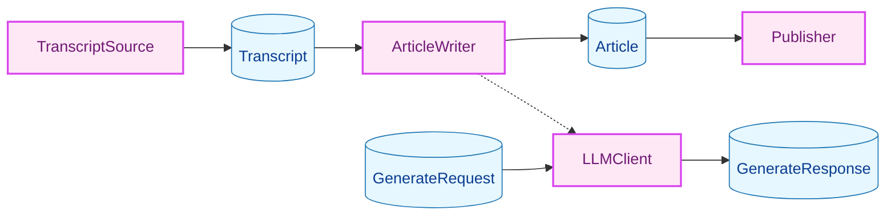
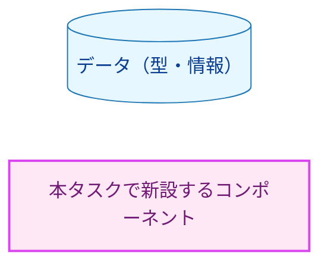
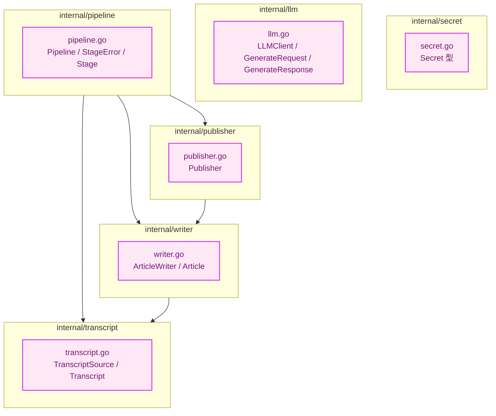
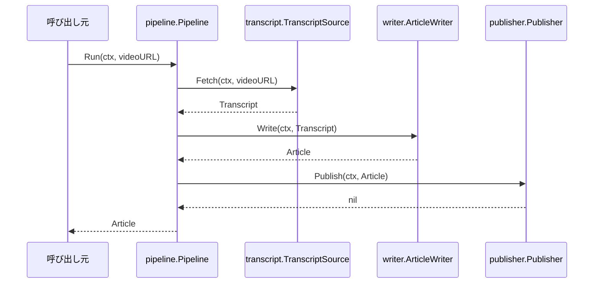
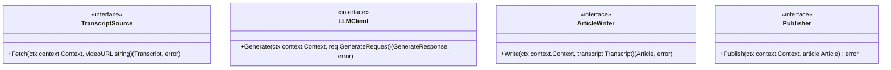
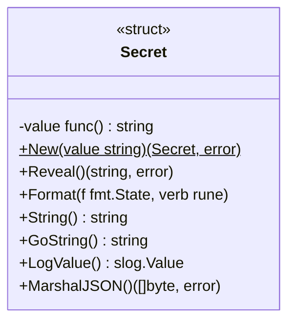
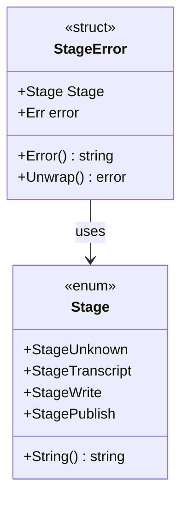
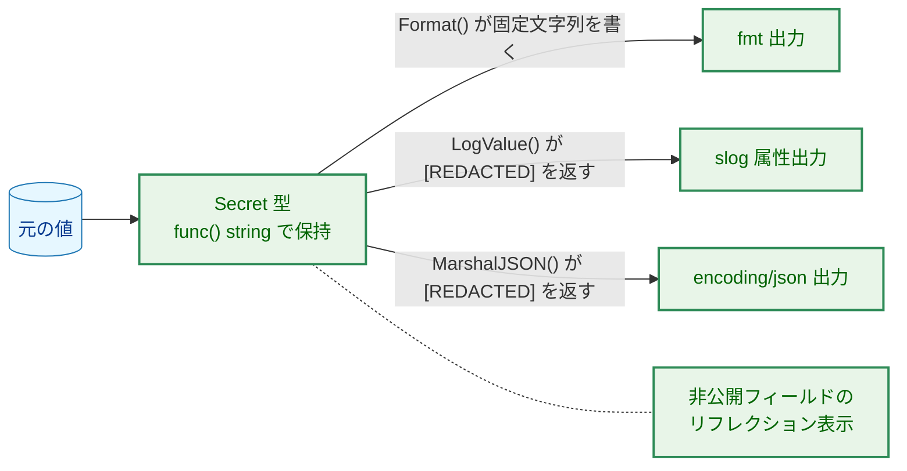
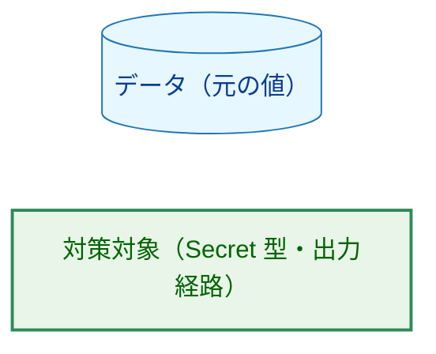
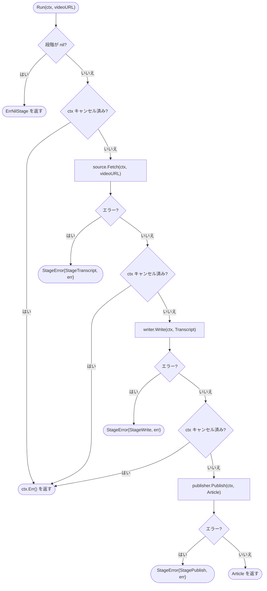

# アーキテクチャ設計書：パイプラインの骨格

## Document Status

| Item | Value |
|---|---|
| Status | `approved` |
| Created | 2026-09-29 |
| Review date | 2026-09-29 |
| Reviewer | isseis |
| Comments | - |

---

## 1. 設計の全体像 (Design Overview)

### 1.1. 設計原則

1. **段階の責務をパッケージに閉じ込める。** `TranscriptSource`・`ArticleWriter`・`Publisher` の 3 つの段階と、`ArticleWriter` の内部部品である `LLMClient` の interface と入出力データ型は、それぞれ対応するパッケージ（`internal/transcript`・`internal/writer`・`internal/publisher`・`internal/llm`）が所有する。パイプライン（`internal/pipeline`）は実装の詳細を知らず、interface だけに依存する。
2. **データ型そのものが契約である。** 段階間の受け渡しは構造化された値で行い、秘密情報の非開示は `Secret` 型の実装が保証する（§3.3）。
3. **プロバイダ固有の知識はパイプラインの外に置く。** 共通データ型と interface に、LLM プロバイダの SDK の型やプロバイダ固有の項目を一切持ち込まない（AC-05。受け入れ基準の一覧は 01_requirements.md 参照）。`internal/llm` は依存先を持たないリーフであり、`internal/llm/<provider>` を import できないため、共通型へのプロバイダ型の混入は依存の向き（常にプロバイダ実装 → 共通型の一方通行）で構造的に防がれる。加えて depguard の SDK 閉じ込めルール（`.golangci.yml:63-86`）が SDK の import を `internal/llm/<provider>` 以外から拒否する。ただし `deps` ルールは標準ライブラリと自モジュールだけを許可する厳格な設定（`.golangci.yml:53-59`）であり、SDK を実際に導入する変更では、同じ変更で `deps.allow` にその SDK を追加しない限り、閉じ込めルールの有無にかかわらず全パッケージで拒否される（§9 参照）。
4. **パイプラインは失敗時に段階を特定でき、元のエラーを保持する。** 段階の失敗は段階名つきの `StageError` に包んで伝播し、`Unwrap()` で元のエラーを辿れるようにする（AC-12）。
5. **「空はエラー」を interface の契約として宣言する。** 空の結果を正常として返す実装を許さない契約を、各 interface の英語のドキュメントコメントに書く（AC-08）。

### 1.2. 概念モデル



**図1 概念モデル**。実線の矢印 A → B は「データが A から B へ流れる」を表す。`Transcript`・`Article` は段階間の受け渡しデータで、パイプラインの進行方向（`TranscriptSource` → `ArticleWriter` → `Publisher`）に沿って流れる（AC-09）。`REQ` → `LLM` → `RESP` は `LLMClient` の入出力データの流れで、`ArticleWriter` の内部で完結する。点線の `WR -.-> LLM` は「利用関係」を表し、`LLMClient` はパイプラインが直接呼ぶ段階ではなく、`ArticleWriter` の内部部品である（01_requirements.md §6）。



**凡例（図1 概念モデル）**。

### 1.3. 既存コードとの関係

リポジトリの Go ソースは `cmd/yt2column/main.go` の空の `main()` だけであり（`cmd/yt2column/main.go:4`。執筆時点の HEAD `1ce67e5` で確認）、`docs/dev/developer_guide/package_reference.md:7` も「No packages exist yet」としている。テストファイル（`*_test.go`）も存在しない（同じ HEAD で `git ls-files '*.go'` が返すのは `cmd/yt2column/main.go` のみ）。したがって本タスクで再利用できる既存コンポーネントはなく、すべてのパッケージを新設する。既存の実装を置き換える設計はなく、更新が必要になる既存テストもない。

`cmd/yt2column/main.go` は本タスクのスコープ外（CLI 配線は #6）で変更しない。

**project_overview.md との差分。** [project_overview.md](../../dev/project_overview.md) は `LLMClient.Generate` の戻り値を `(string, error)` とする例を示している。本設計は、生成に使われたモデル名を記録する要件（AC-03）を満たすため、応答を `GenerateResponse`（テキストとモデル名）として返す。この意図的な差分は 01_requirements.md §5.1 に記載済みで、本タスクの完了時に project_overview.md の例を更新する。

---

## 2. システム構成 (System Structure)

### 2.1. パッケージ構成



**図2 パッケージ依存構造**。矢印 A → B は「A が B を import する」を表す。


**凡例（図2 パッケージ依存構造）**。

### 2.2. コンポーネント配置

各型と interface の置き場所は、循環 import が生じない次の向きで固定する。

- `internal/secret` はリーフ（依存先を持たない）。`Secret` 型は API キーと Webhook URL を保持する（#4・#7・#6 が import する）。
- `internal/transcript`・`internal/llm` はリーフ。それぞれ自パッケージの interface と入出力データ型を持つ。
- `internal/writer` は `internal/transcript` を import する（`ArticleWriter` が `Transcript` を入力として受け取るため）。
- `internal/publisher` は `internal/writer` を import する（`Publisher` が `Article` を入力として受け取るため）。
- `internal/pipeline` は `internal/transcript`・`internal/writer`・`internal/publisher` を import する。`internal/llm` は import しない（`LLMClient` は `ArticleWriter` が内部で使う部品であり、パイプラインが直接扱わないため）。

import の向きがこの順序どおりの一方通行になるため、循環 import は生じない。

補足を 2 点挙げる。

- **`internal/writer` → `internal/llm` の依存は本タスクでは生じない。** `ArticleWriter` interface のシグネチャは `LLMClient` の型を参照しない（§3.2）。`LLMClient` を呼び出すのは `ArticleWriter` の実装（#5）であり、その実装は `internal/writer` に置く（project_overview.md の想定ディレクトリ構成と同じ）。#5 の時点で `internal/writer` が `internal/llm` を import するが、`internal/llm` はリーフなので循環しない。
- **`internal/publisher` が `internal/writer` を import するのは `Article` 型のためだけである。** これは YAGNI の観点から許容する（`Article` は writer 段階の産物で、当面の利用者は publisher とパイプラインだけ）。将来 `Article` に別の消費者が増えた場合は、共通型を独立パッケージへ移す選択肢を検討する。

### 2.3. データフロー（成功時）



**図3 データフロー（成功時）**。矢印 `->>` はメソッド呼び出し、`-->>` は戻り値を表す。前の段階の出力がそのまま次の段階の入力になる（AC-09）。

---

## 3. コンポーネント設計 (Component Design)

### 3.1. 共通データ型

`internal/transcript`・`internal/llm`・`internal/writer` に、段階間の受け渡しに使うデータ型を定義する。プロバイダ固有の項目や SDK の型は含めない（AC-05）。

```go
// internal/transcript

// Segment is one subtitle segment.
type Segment struct {
    StartMs int64
    Text    string
}

// Transcript is the transcript body and video metadata.
type Transcript struct {
    VideoID     string
    VideoURL    string
    Title       string
    ChannelName string
    Description string
    Segments    []Segment
}
```

- `Segments` は字幕での出現順どおりに保持する（AC-01）。`StartMs` は動画内の開始時刻をミリ秒で表す（AC-01）。
- メタ情報は動画 ID・動画 URL・タイトル・チャンネル名・概要欄を持つ（AC-02）。`VideoURL` は記事の出典リンクの基になる（実際の出典付与は #5 の責務）。

```go
// internal/llm

// GenerateRequest is the provider-common request.
// It must not carry provider-specific fields (e.g. DeepSeek thinking).
type GenerateRequest struct {
    SystemPrompt    string
    UserPrompt      string
    MaxOutputTokens int
}

// GenerateResponse is the generated text and the model that produced it.
type GenerateResponse struct {
    Text  string
    Model string
}
```

- `GenerateResponse.Model` には、`deepseek-flash` のようなエイリアスが指し示すモデルが変わるため、応答に含まれる `model` の値をそのまま記録する（01_requirements.md §5.1、project_overview.md「前提・制約」）。これにより呼び出し元は生成モデルを追跡できる（AC-03）。
- 温度などの追加パラメータは、実際に必要になった時点でプロバイダ共通の項目として追加する（YAGNI）。

```go
// internal/writer

// Article is the generated column article.
type Article struct {
    Title     string
    Body      string // Markdown
    SourceURL string
    Model     string
}
```

- コラム記事（`Article`）はタイトル・Markdown 本文・出典リンクの URL・生成に使われたモデル名を保持する（AC-04）。`Model` には `GenerateResponse.Model` の値を写す（#5 の責務）。

### 3.2. 段階の interface



**図4 段階の interface とデータ型**。メソッドシグネチャは本設計で定めたものであり、実装時はこのシグネチャに従う（下記の Go 定義と対応する）。

4 つの interface は、実装側（#3・#4・#5・#7）とテスト側（fake）の両方が満たす契約である。すべてのメソッドは第 1 引数に `context.Context` を受け取り、キャンセルとタイムアウトに従う（AC-07）。

```go
// internal/transcript

// TranscriptSource fetches a transcript for a video URL.
// Implementations must return an error on failure and must not
// return an empty Transcript as a successful result.
type TranscriptSource interface {
    Fetch(ctx context.Context, videoURL string) (Transcript, error)
}
```

```go
// internal/llm

// LLMClient sends a provider-common request and returns the generated result.
// Implementations must not return an empty response without an error;
// a truncated generation is an error.
type LLMClient interface {
    Generate(ctx context.Context, req GenerateRequest) (GenerateResponse, error)
}
```

```go
// internal/writer

// ArticleWriter generates a column article from a transcript.
// Implementations must return an error on failure and must not
// return an empty Article as a successful result.
type ArticleWriter interface {
    Write(ctx context.Context, transcript Transcript) (Article, error)
}
```

```go
// internal/publisher

// Publisher outputs an article to the destination.
// Implementations must return an error on failure and must not
// publish incomplete content.
type Publisher interface {
    Publish(ctx context.Context, article Article) error
}
```

- 契約（失敗時にエラーを返す・空の結果を正常としない）を各 interface の英語のドキュメントコメントに明記する（AC-08）。
- `TranscriptSource`・`LLMClient`・`ArticleWriter` はデータ（`Transcript`・`GenerateResponse`・`Article`）を値で返す。値の正否判定に nil チェックは使えないため、空の場合は必ずエラーを返す契約とする。
- **空の結果を拒否する契約の強制方法（残余リスク）。** 空の結果を正常として返さない契約（AC-08）は、本タスクではドキュメントコメントで宣言するだけで、パイプラインはその遵守を実行時に検査しない。本タスクには `Transcript` の内容を生成するコードがなく、`Article` の空判定を共通の仕組みにする要件もないため、実行時の検査は追加しない。代わりに、各段階の実装タスク（#3・#5・#7）が「空または不完全な結果をエラーとして扱う」ことを受け入れ基準とテストで検証する（§5.2 の引き継ぎ）。
- **入力 URL の検証。** `TranscriptSource.Fetch` の実装（#3）は、受け取った `videoURL` を yt-dlp に渡す前に `docs/dev/security.md` §1 に従って検証する。本タスクのパイプラインは URL を検証せず、呼び出し元から渡された値をそのまま `Fetch` に渡す（§5.2 の引き継ぎ）。

### 3.3. 秘密情報型 `Secret`

API キーや Webhook URL など、ログ・エラーメッセージ・JSON 出力に現れてはならない値を保持する型を `internal/secret` に定義する。



**図5 `Secret` 型の構造**。`$` は静的メソッド（コンストラクタ）を表す。

```go
// internal/secret

// Secret holds a value that must never appear in output
// (API key, Webhook URL, ...).
type Secret struct {
    value func() string
}

// New returns a Secret built from a non-empty value.
func New(value string) (Secret, error)

// Reveal returns the original value. The zero value returns an error.
func (s Secret) Reveal() (string, error)

// Format writes a fixed string for every verb and never the original value.
func (s Secret) Format(f fmt.State, verb rune)

// String and GoString return a fixed string, never the original value.
func (s Secret) String() string
func (s Secret) GoString() string

// LogValue returns [REDACTED] for slog attributes.
func (s Secret) LogValue() slog.Value

// MarshalJSON returns "[REDACTED]".
func (s Secret) MarshalJSON() ([]byte, error)
```

**保持形式の固定（01_requirements.md §5 の制約）。** `Secret` は元の値を `func() string` のクロージャで保持する。これは要件の制約として必須であり、次の理由による。

- `fmt` と slog の TextHandler は、構造体の**非公開フィールド**に対して `Format`・`String()`・`GoString()` を呼ばず、リフレクションで内容を表示する（01_requirements.md §5）。公開フィールドなら `Format` が呼ばれて隠せるが、非公開フィールドでは `Secret` 型のメソッド実装だけでは隠せない。
- `func() string` で保持すれば、リフレクションが見られるのは関数ポインタのアドレスだけで、クロージャに閉じ込めた元の値には到達できない。これにより、`Secret` を非公開フィールドとして持つ構造体を `%v`・`%+v`・`%#v` や slog 属性で出力しても、元の値は現れない（AC-26・AC-19）。`encoding/json` は非公開フィールドを出力に含めないため、同様に漏れない（AC-20）。

各受け入れ基準は次のメカニズムで満たす。

- **AC-18（fmt）**: `fmt.Formatter` を実装し、`%s`・`%v`・`%+v`・`%#v`・`%q`・`%d`・`%x` など、`fmt` が `Formatter` に委譲する書式指定子では常に `[REDACTED]` を含む固定文字列を出力する（`%q` は引用符付きの表現になる）。`Secret` を公開フィールドとして含む構造体では、各フィールドの書式化に `Format` が使われるため元の値は出ない。
- **AC-24（直接呼び出し）**: `String()` と `GoString()` は、直接呼び出された場合も `[REDACTED]` を含む固定文字列を返す。
- **AC-25（委譲されない書式）**: `%p`（非ポインタ値）や非 error への `%w` など、`fmt` が `Formatter` に委譲しない指定子でも、クロージャ保持により元の値は出力に現れない。テストで確認する。
- **AC-26（非公開フィールド経由の fmt）**: クロージャ保持により、リフレクション経由でも元の値は現れない。
- **AC-19（slog）**: `slog.LogValuer` を実装し、属性として `[REDACTED]` を返す。非公開フィールド経由の漏れもクロージャ保持で防ぐ。
- **AC-20（JSON）**: `json.Marshaler` を実装し、`"[REDACTED]"` を返す。公開フィールドとして持つ構造体のエンコードでも同様。非公開フィールドは JSON が省略する。
- **AC-21（取り出し）**: 元の値を返す経路は `Reveal()` のみで、名前から秘密情報を取り出すメソッドであることが明らかである。
- **AC-22（空値拒否）**: `New("")` はエラーを返す。
- **AC-23（ゼロ値）**: `Secret{}` の `Reveal()` はエラーを返す（nil クロージャ）。

**使用上の注意（設計上の指針）。** `Secret` を保持する側（#6 の config 構造体など）は、公開フィールド・非公開フィールドどちらでも安全に持てる。ただし、利用側が注意すべき点が次の 2 つある。

- `Secret` は `func` フィールドを持つため非比較型である。`==` はコンパイルエラーになり、`reflect.DeepEqual` は同じ元の値を保持する 2 つの `Secret` を等しいと判定せず（func は両方が nil のときだけ等しい）、`map` のキーにもできない（なお `go-cmp` の `cmp.Equal` は非公開フィールドを持つ型に対して panic する。また `go-cmp` は depguard で許可されていない）。将来 #6 の設定検証やテストで `Secret` の等値判定が必要になった場合は、値を出力しない比較メソッド（例: `Matches(plaintext string) bool`）を追加する。本タスクのスコープには等値判定の要件がないため、YAGNI により現時点では追加しない（§9 参照）。
- `Reveal()` で取得した値は、呼び出し元が責任をもって秘密として扱う。非開示保証（fmt・slog・JSON の出力経路）は `Secret` 型に内在するが、`Reveal()` の結果は唯一、呼び出し側の規律に依存する面である（§5.1）。

### 3.4. パイプライン

`internal/pipeline` に、3 つの段階を順に呼び出す処理を定義する。

```go
// internal/pipeline

// Stage identifies the pipeline stage that failed.
// The zero value is StageUnknown: an unset Stage reports "unknown",
// never a wrong stage name.
type Stage int

const (
    StageUnknown  Stage = iota
    StageTranscript
    StageWrite
    StagePublish
)

// String returns the stage name. Unknown values return "unknown".
func (s Stage) String() string

// StageError wraps a stage failure. Unwrap returns the original error.
type StageError struct {
    Stage Stage
    Err   error
}

func (e *StageError) Error() string
func (e *StageError) Unwrap() error

// ErrNilStage is wrapped by New (and by Run on a zero-value Pipeline)
// when a stage is not set.
var ErrNilStage = errors.New("nil pipeline stage")

// Pipeline runs the three stages in order.
type Pipeline struct {
    source    transcript.TranscriptSource
    writer    writer.ArticleWriter
    publisher publisher.Publisher
}

// New validates the stages and constructs a Pipeline.
// It returns an error wrapping ErrNilStage and naming the stage
// when a stage is not set.
func New(source transcript.TranscriptSource, writer writer.ArticleWriter, publisher publisher.Publisher) (*Pipeline, error)

// Run takes a video URL, calls each stage in order, and returns the published article.
// It returns an error wrapping ErrNilStage if a stage is not set.
func (p *Pipeline) Run(ctx context.Context, videoURL string) (writer.Article, error)
```

- `New` は 3 つの段階のいずれかが nil の場合に、`ErrNilStage` をラップし、どの段階が未設定か（`transcript`・`write`・`publish`）を含むエラーを返す。呼び出し元は `errors.Is(err, ErrNilStage)` で判別できる。`New` は、interface 値が `== nil` の場合に加えて、interface が非 nil でもその動的値が nil である場合（nil ポインタ・map・func・slice・chan）も拒否する。nil ポインタを格納した interface（例: `var p *FilePublisher; New(src, w, p)`）は `== nil` を満たさないが、そのまま `Run` に渡すと該当段階のメソッド呼び出しでパニックになるため、これを構築時に拒否する。検出の実装方法（`reflect` の利用と、nil 判定できない Kind の扱い）は `03_implementation_plan.md` で定める。構築テストはこの typed-nil のケースも含めて検証する（AC-14）。
- **ゼロ値の fail-closed。** `Pipeline` はエクスポートされた構造体なので、`New` を通さずゼロ値（`var p pipeline.Pipeline`）で使うこともできる。`Run` は冒頭で 3 つの段階の nil を再確認し、いずれかが nil なら段階を呼び出さずに `ErrNilStage` をラップしたエラーを返す。これにより、`New` を経由しない利用でもパニックせず、構築時と同じエラーになる（AC-14a）。段階の nil 検査は「構築時」と「使用時」の両方で行う。
- `Stage.String()` は `"transcript"`・`"write"`・`"publish"` を返し、ゼロ値の `StageUnknown` と未知の値には `"unknown"` を返す。`StageUnknown`（= 0）をゼロ値に置くことで、`StageError` を `Stage` 未設定のまま構築した場合でも `Error()` は `"unknown: ..."` を出力し、誤った段階名を出力しない（fail-secure）。`Error()` は必ず `String()` を使う（整数をそのまま出力しない）。
- `Run` の動作は §6 の処理フローで定義する。
- `Stage` は失敗の段階を型で表す（switch で分岐し、`default` で未知の値に fail-secure する）。呼び出し元は `errors.AsType[*pipeline.StageError]` で段階を判別し、`errors.Is` で元のエラーを辿れる（AC-12）。

### 3.5. テスト用の fake

4 つの interface それぞれに、戻り値とエラーを指定でき、呼び出しを記録する fake を用意する（F-004）。配置は `docs/dev/developer_guide/test_organization.md` の分類 A（`testutil/` サブディレクトリ）に従い、interface を定義するパッケージの `testutil/mocks.go` に置く。

| interface | fake の置き場所 | パッケージ名 |
|---|---|---|
| `TranscriptSource` | `internal/transcript/testutil/mocks.go` | `transcripttestutil` |
| `LLMClient` | `internal/llm/testutil/mocks.go` | `llmtestutil` |
| `ArticleWriter` | `internal/writer/testutil/mocks.go` | `writertestutil` |
| `Publisher` | `internal/publisher/testutil/mocks.go` | `publishertestutil` |

各 fake は次の型定義の形をとる（例は `TranscriptSource` 用）。

```go
// internal/transcript/testutil (package transcripttestutil)

// FakeTranscriptSource has a configurable result and error, and records calls.
// It implements transcript.TranscriptSource with pointer receivers.
type FakeTranscriptSource struct {
    Result transcript.Transcript
    Err    error
    Calls  []FakeTranscriptSourceCall
}

// FakeTranscriptSourceCall records the arguments of one call.
type FakeTranscriptSourceCall struct {
    Ctx      context.Context
    VideoURL string
}

var _ transcript.TranscriptSource = (*FakeTranscriptSource)(nil)
```

- メソッドは**ポインタレシーバ**で定義する。値レシーバにすると `Calls` への追記がコピーに対して行われ、テストから呼び出しが見えなくなる（AC-16 を満たさない）。

- **AC-15**: テストから戻り値（`Result`）とエラー（`Err`）を指定できる。
- **AC-16**: 呼び出しごとに引数を `Calls` に追記し、呼ばれた回数（`len(Calls)`）と引数をテストから参照できる。
- **AC-17**: すべての fake ファイルは `//go:build test` を付け、本番バイナリに含めない。`testutil/` 配下のすべてのファイル（`mocks_test.go` を含む）にタグを付ける。テストファイルへのタグ付けを忘れると、タグを渡さない `go vet ./...` や IDE が `undefined:` で失敗する（`docs/dev/developer_guide/test_organization.md:91-93`）。

他の 3 つの fake も同じ形をとる（`LLMClient` は `GenerateRequest` を、`ArticleWriter` は `Transcript` を、`Publisher` は `Article` を記録する）。

### 3.6. コンポーネント責務表

| ファイル | 責務 | 状態 |
|---|---|---|
| `internal/secret/secret.go` | `Secret` 型（クロージャ保持・`Format`/`String`/`GoString`/`LogValue`/`MarshalJSON`/`New`/`Reveal`） | 新設 |
| `internal/secret/secret_test.go` | AC-18〜AC-26 のテスト | 新設 |
| `internal/transcript/transcript.go` | `Segment`・`Transcript` 型、`TranscriptSource` interface | 新設 |
| `internal/transcript/testutil/mocks.go` | `FakeTranscriptSource` | 新設 |
| `internal/transcript/testutil/mocks_test.go` | fake の振る舞いのテスト（AC-15・AC-16） | 新設 |
| `internal/llm/llm.go` | `GenerateRequest`・`GenerateResponse` 型、`LLMClient` interface | 新設 |
| `internal/llm/testutil/mocks.go` | `FakeLLMClient` | 新設 |
| `internal/llm/testutil/mocks_test.go` | fake の振る舞いのテスト（AC-15・AC-16） | 新設 |
| `internal/writer/writer.go` | `Article` 型、`ArticleWriter` interface | 新設 |
| `internal/writer/testutil/mocks.go` | `FakeArticleWriter` | 新設 |
| `internal/writer/testutil/mocks_test.go` | fake の振る舞いのテスト（AC-15・AC-16） | 新設 |
| `internal/publisher/publisher.go` | `Publisher` interface | 新設 |
| `internal/publisher/testutil/mocks.go` | `FakePublisher` | 新設 |
| `internal/publisher/testutil/mocks_test.go` | fake の振る舞いのテスト（AC-15・AC-16） | 新設 |
| `internal/pipeline/pipeline.go` | `Pipeline`・`New`・`Run`・`Stage`・`StageError`・`ErrNilStage` | 新設 |
| `internal/pipeline/pipeline_test.go` | AC-09〜AC-14 のテスト | 新設 |
| `docs/dev/developer_guide/package_reference.md` | 新設パッケージの登録（各パッケージを追加するコミットと同じコミットで更新する。package_reference.md 冒頭の規則） | 変更 |
| `docs/dev/project_overview.md` | 「パイプライン」の節の `LLMClient` 周り（戻り値・責務の記述・`GenerateRequest` のフィールド名・想定ディレクトリ構成の `internal/secret/`）を本設計に合わせて更新（01_requirements.md §5.1、付録A） | 変更 |

`cmd/yt2column/main.go` は本タスクでは変更しない（CLI 配線は #6）。既存テストの更新は不要（既存テストが存在しない。§1.3）。

---

## 4. エラーハンドリング設計 (Error Handling Design)

### 4.1. エラー型

パイプライン自身が定義するエラー型は次の 2 つに限定する。なお `Run` はキャンセルまたは期限切れのときに `ctx.Err()` をそのまま返す（§4.2）ため、`context.Canceled`・`context.DeadlineExceeded` はパイプラインが定義する型ではなく標準のエラー値として返る。

- `pipeline.StageError`（`Stage` と `Err` を持つ。`Unwrap()` で元のエラーを返す）
- `pipeline.ErrNilStage`（段階が未設定のときのセンチネル。`New` と、ゼロ値の `Pipeline` に対する `Run` がラップして返す）

各段階の実装が返すエラー（`yt-dlp` の失敗、LLM の空応答、Webhook の失敗など）は、`StageError.Err` に包まれてそのまま伝播する。パイプラインは元のエラーに段階情報を付与するだけで、エラーメッセージに秘密情報や動画 URL を付け加えない（01_requirements.md §4.2）。



**図6 パイプラインのエラー型**。`ErrNilStage` は型ではなくパッケージレベルの `var ErrNilStage = errors.New(...)` のセンチネル値であり、`errors.Is` で判別する。

### 4.2. エラーメッセージ設計パターン

- `StageError.Error()` は `"<段階名>: <元のエラーメッセージ>"` の形式で、`Stage.String()` を使って段階名を埋め込む。元のエラーメッセージ以外の情報（呼び出し元の引数、内部状態）は含めない。
- 段階が nil の場合のエラーは `ErrNilStage` をラップし、どの段階が未設定かを含める。呼び出し元は `errors.Is(err, ErrNilStage)` で判別でき、エラーメッセージからどの段階かを知れる。
- 段階の実装が返すエラーに秘密情報が含まれないことは、各段階タスク（#3・#4・#7）の責務である。本タスクのパイプラインは追加の情報を付けずに包むだけにする。この引き継ぎの具体的な要件は §5.2 で定義する。
- キャンセル（AC-13）は段階の失敗ではないため `StageError` で包まず、`ctx.Err()` をそのまま返す。キャンセル経路では `errors.Is(err, context.Canceled)` が成り立つ。期限切れ（`context.DeadlineExceeded`）はそのまま返し、`errors.Is(err, context.Canceled)` にはならない（標準の `context` の意味論に従う）。

### 4.3. サイドエフェクト契約

本タスクのスコープにはフラグ・モード・オプション（`--dry-run` など）が存在しない。パイプライン自身は外部 I/O を行わず、外部への影響はすべて各段階の実装タスク（#3・#4・#7）側にある。したがって本タスクの設計で抑制・許可を定義すべきサイドエフェクトはない（該当なし）。

---

## 5. セキュリティ考慮事項 (Security Considerations)

機能が `.claude/commands/_context.md` の条件付きガイドトリガー（API キー・Webhook URL を扱う）に該当するため、`docs/dev/security.md` §2 を参照する。

### 5.1. 脅威モデル：秘密情報の非開示



**図7 秘密情報の出力経路と対策**。実線 A → B は「A から B への出力経路」、点線 `SEC -.- RFL` は「`Secret` を非公開フィールドに持つ構造体を表示したとき、リフレクション経路が存在するが、クロージャ保持により元の値に到達できない」ことを表す。



**凡例（図7 秘密情報の出力経路と対策）**。

脅威の前提（01_requirements.md §5 と同様）: `fmt` と slog の TextHandler は構造体の非公開フィールドをリフレクションで表示し、`Format`・`String()`・`GoString()` を呼ばない。そのため、公開フィールドでの対策（`Format` 実装）は非公開フィールドには効かない。非公開フィールドはクロージャによる保持（§3.3）で防ぐ。fmt・slog・JSON の出力経路に対する非開示保証は `Secret` 型の実装に内在し、利用側の注意に依存しない。ただし `Reveal()` の結果（§3.3）は唯一、呼び出し側の規律に依存する面であり、その値は呼び出し元が秘密として扱う。

**非公開フィールド経路で運用者が実際に見る出力。** 非公開フィールド経路では元の値の代わりに、クロージャの関数アドレス（`0x...`）が出力される。これはプロセスごとに変わる値であり、`[REDACTED]` のようなマーカーは付かない（リフレクション表示を `Secret` 側から制御できないため）。将来の運用者がログでこの形式を見ても戸惑わないよう、本設計の指針として、`Secret` を非公開フィールドに持つ構造体に、フィールド値をそのまま出力する `String()` や `Format` を追加してはならない。追加すると `fmt` はリフレクション表示ではなくそのメソッドを呼ぶため、関数アドレスの埋め込みや、`Reveal()` を誤って呼ぶ実装によって元の値を出力する経路になりうる。

### 5.2. 段階タスクへの引き継ぎ事項

本タスクの境界の外側にある段階の実装（#3・#4・#5・#7）へ引き継ぐ、安全側の振る舞いの要件をまとめる。いずれも本タスクでは実装せず、各段階タスクの要件定義書で受け入れ基準として管理する。

**1. 秘密情報を含むエラー。** パイプラインは段階のエラーを包む際に秘密情報を付け加えない（§4.2）。しかし、段階の実装が返すエラー**そのもの**に秘密情報が含まれる経路は、`Secret` 型では防げない残余リスクである。具体的には、Slack 投稿（#7）で `http.Client` の送信が失敗したとき、`*url.Error` は URL 文字列を `Error()` に含む（security.md §2 がこの経路を明示している）。Webhook URL は URL 自体が秘密情報であるため、`fmt.Errorf("slack: %w", err)` のような包み方をするとそのまま漏れる。URL は `http.Client` 内部では `Secret` 型ではなく素の文字列であり、`Secret` の非開示保証はこの経路には効かない。

- 秘密情報を扱うか、ネットワーク送信を行う段階（#3・#4・#7）は、それぞれの要件定義書に「段階が返すエラーの文字列に秘密情報が含まれないこと」を受け入れ基準として含め、テストで検証する。
- 実装では、security.md §2 に従い、`*url.Error` などをそのまま返さず、URL 部分を除いたエラーに変換してから返す。

**2. 入力 URL の検証。** security.md §1 が要求する URL の検証（YouTube の URL 形式から動画 ID を抽出して正規化し、`-` で始まる値がオプションとして解釈されないよう URL の直前に `--` を置く）は、`TranscriptSource` の実装（#3）の責務とする。本タスクのパイプラインは URL を検証せず、呼び出し元から渡された値をそのまま `Fetch` に渡す。#3 の要件定義書は、不正な URL を拒否するテストを受け入れ基準に含める。

**3. 空の結果の拒否。** 「空の結果を正常として返さない」契約（AC-08）は、本タスクではドキュメントコメントによる宣言にとどまる（§3.2）。各段階の実装（#3・#5・#7）は、空または不完全な結果をエラーとして扱うことを受け入れ基準に含め、その振る舞いが欠けていれば失敗するテストで検証する。特に `Publisher` は、不完全な記事を外部へ投稿しないことを検証する。

### 5.3. 対象クライアント環境の検証

本タスクは外部サービスの新規機能（Slack の Block Kit 要素など）に依存しない。`Secret` 型は標準ライブラリの `fmt`・`log/slog`・`encoding/json` の既存の挙動だけを使うため、対象クライアント環境（Slack）に依存する検証は該当しない（N/A）。対象クライアント環境の検証が必要になるのは、Slack 投稿を実装する #7 である。

---

## 6. 処理フロー詳細 (Processing Flow Details)

### 6.1. パイプライン実行フロー



**図8 パイプライン実行フロー**。矢印 A → B は処理の順序（A の後に B を実行する）を表す。`{"..."}` は分岐条件、`(["..."])` は結果（エラーまたは成功の戻り値）を表す。

- `Run` は冒頭で 3 つの段階の nil を確認し、nil があれば段階を呼び出さずに `ErrNilStage` を返す（AC-14a、§3.4）。
- 各段階の呼び出しの前に `ctx.Err()` を確認し、キャンセル済みなら次の段階を呼ばずに `ctx.Err()` をそのまま返す（AC-13）。キャンセル経路では `errors.Is(err, context.Canceled)` が真になる（期限切れの場合は `context.DeadlineExceeded` がそのまま返る）。
- 段階がエラーを返した場合、以降の段階は呼ばれず、`StageError` を返す（AC-11）。特に `TranscriptSource`・`ArticleWriter` の失敗時は `Publisher` を呼ばない。
- すべて成功した場合、3 つの段階が 1 回ずつ順に呼ばれ、投稿した `Article` を呼び出し元へ返す（AC-09・AC-10）。

### 6.2. キャンセルの扱い

キャンセルは「どの段階で失敗したか」とは独立した事象として扱い、`StageError` で包まず `ctx.Err()` を直接返す（§4.2）。段階の実装が `context` のキャンセルをエラーとして返した場合（実装が `ctx.Err()` を返す場合）は、`StageError` に包まれても `Unwrap()` を通じて `errors.Is(err, context.Canceled)` は真になる。

`ctx.Err()` の事前確認（§6.1）は「確認してから呼び出す」方式であり、確認の直後にキャンセルされた場合、キャンセル済みの `ctx` で段階が呼ばれてしまう隙間が原理的に残る。この隙間は段階自身が `ctx` を尊重する（AC-07）ことで閉じるため、パイプラインの事前確認は「確認時点より前のキャンセルを検出して以降の段階を呼ばない」というベストエフォートとして設計する。

**タイムアウトの所有者。** `Run` は `context` に期限を設定しない。全体のタイムアウトは呼び出し元（#6 の CLI）が所有し、各段階は外部呼び出し（yt-dlp・LLM API・Webhook）ごとのタイムアウトを security.md §1・§3 に従って自分で設定する。段階は親の期限が存在することを前提にしてはならない。

---

## 7. テスト戦略 (Test Strategy)

### 7.1. ユニットテスト

外部コマンド・LLM API・Webhook を一切呼ばない。パイプラインのテストは各段階の fake（§3.5）を注入して行う。

- `internal/pipeline` のテストは、`transcripttestutil`・`writertestutil`・`publishertestutil` の fake を注入し、成功・失敗・キャンセル・nil 段階の各ケースを検証する。fake が記録した呼び出し（`Calls`）で「どの段階が何回、どんな引数で呼ばれたか」を検証する。
- `internal/secret` のテストは、`fmt.Sprintf`・`slog`・`encoding/json`・構造体への埋め込み（公開/非公開フィールド）・ゼロ値・空文字列の各経路を検証する。
  - `Secret` を直接出力する経路と、公開フィールドとして埋め込んだ構造体の出力は、**`[REDACTED]` が出力に現れること**を検証する（「元の値が現れない」ことだけの検証では、`Format` が空文字や値の長さ・ハッシュを出力しても通ってしまうため、AC-18・AC-19・AC-20 の基準を満たす検証にならない）。AC-18 のテーブルテストは、委譲される主な書式指定子（`%s`・`%v`・`%+v`・`%#v`・`%q`・`%d`・`%x`）に加え、あまり使われない指定子（`%c`・`%U`・`%b`・`%e` など）と未知の指定子を含め、`Format` がどの指定子でも元の値に委譲せず固定文字列を書く（fail-secure）ことを確認する。`String()`・`GoString()` の直接呼び出し（AC-24）も個別に検証する。
  - 非公開フィールド経路の出力は元の値の代わりにクロージャの関数アドレス（`0x...`）が現れる。この経路の検証は「元の値が出力に一切現れないこと」だけを確認し、関数アドレスそのものを検証しない（アドレスはプロセスごとに変わるため、スナップショットやゴールデンファイルの比較対象にしてはならない）。`Secret` を含む構造体の出力をゴールデンファイル化しない。
  - `Reveal()`（AC-21）・空文字列の `New`（AC-22）・ゼロ値の `Reveal()`（AC-23）もそれぞれ検証する。
- interface の定義（AC-06〜AC-08）は、各 `testutil/mocks.go` に置くコンパイル時アサーション（例: `var _ transcript.TranscriptSource = (*FakeTranscriptSource)(nil)`）で検証され、パイプラインのフローテストでデータの受け渡しと順序が検証される（AC-01・AC-02・AC-04）。構造体のフィールドに代入した値をそのまま読み返すだけのテストは、無条件に通り何も検証しないため書かない（CLAUDE.md「Testing Strategy」）。そのため `internal/transcript`・`internal/llm`・`internal/writer`・`internal/publisher` には、本タスクではパッケージ本体の `_test.go` を置かない。

**統合テスト**: 該当なし。本タスクの成果物は外部（yt-dlp・LLM API・Webhook）と接続する実装を持たない。外部接続を伴う統合は #3・#4・#7 の各タスクで検証する。

**セキュリティテスト**: `internal/secret` の AC-18〜AC-26 のテスト（上記）が、秘密情報が fmt・slog・JSON の各出力経路に現れないことを検証する。パイプラインがエラーに秘密情報を付け加えないこと（01_requirements.md §4.2）は、`StageError` が元のエラーをそのまま包むことのテストで確認する。

**AC-01〜AC-03 の検証方法**: AC-01（セグメントの並び順）と AC-02（メタ情報）は、段階間の受け渡しで値が保たれるという観測可能な振る舞いであり、`03_implementation_plan.md` のパイプラインのフローテスト（`TestPipelineSuccess`）で検証する。AC-03（LLM 応答のテキストとモデル名）を生成・消費するコードは本タスクにないため、挙動検証は #4（アダプタが実際に使われたモデル名を記録する）のテストと #5（`Article.Model` への引き継ぎ）に引き継ぐ。公開フィールドの配置は型の設計上の制約（§3.1）であり、AC の検証ではなく `TestCommonTypesFieldSets` で設計どおりに固定する。

### 7.2. 受け入れ基準と設計要素の対応

| AC | 設計要素 | テストの対象 |
|---|---|---|
| AC-01 | 段階間を渡る `Transcript` のセグメント（`[]Segment`・`StartMs int64`・`Text string`） | パイプラインのフローテスト（source fake が返した複数セグメントが writer fake に同じ並び・内容で届くことを確認） |
| AC-02 | 段階間を渡る `Transcript` のメタ情報 5 フィールド | 同上（writer fake が記録したメタ情報が一致することを確認） |
| AC-03 | `GenerateResponse` のテキストとモデル名 | #4 のアダプタテスト（実際に使われたモデル名の記録）と #5 の `Article.Model` への引き継ぎ。本タスクには生成・消費するコードがない |
| AC-04 | `Article{Title, Body, SourceURL, Model}` | パイプラインのフローテスト（`ArticleWriter` の fake が返した `Article` が `Publisher` の fake と `Run` の戻り値に同じ値で現れることを確認） |
| AC-05 | 共通型にプロバイダ固有の項目・SDK 型を含めない | `internal/llm` が `internal/llm/<provider>` を import できない構造（依存の一方通行）、depguard による SDK import の制限、型定義の目視 |
| AC-06 | 4 つの interface | fake が interface を満たすことのコンパイル時検証 |
| AC-07 | 全メソッドの第 1 引数が `context.Context` | コンパイル時検証 |
| AC-08 | interface の英語ドキュメントコメント | 静的確認 |
| AC-09 | 段階が順に 1 回ずつ呼ばれ出力が伝播 | `internal/pipeline` のフローテスト |
| AC-10 | 成功時に投稿した `Article` を返す | 同上 |
| AC-11 | 失敗時に以降の段階を呼ばない | 同上（fake の `Calls` で未呼び出しを確認） |
| AC-12 | `StageError` で段階を判別、`Unwrap` で元のエラーを辿る | `internal/pipeline` のエラーテスト |
| AC-13 | キャンセル時に次の段階を呼ばず `context.Canceled` を返す | 同上 |
| AC-14 | nil 段階（typed-nil を含む）の構築を拒否 | `internal/pipeline` の構築テスト（`errors.Is(err, ErrNilStage)` と、エラーに含まれる段階名を確認する） |
| AC-14a | ゼロ値の `Pipeline` の `Run` を拒否（段階を呼ばない） | `internal/pipeline` のゼロ値テスト（`Run` が `ErrNilStage` を返し、fake の `Calls` が空であることを確認する） |
| AC-15 | fake の戻り値・エラー指定 | 各 `testutil/mocks_test.go` とパイプラインの利用テスト |
| AC-16 | fake の呼び出し記録 | 同上 |
| AC-17 | fake が `//go:build test` でのみビルドされる | タグなしのビルドで `testutil` が含まれないことの確認（`go list` を用いる具体的なコマンドは `03_implementation_plan.md` で定める） |
| AC-18 | `fmt.Formatter` による全経路の隠蔽 | `internal/secret` のテーブルテスト |
| AC-19 | slog 属性の `[REDACTED]` | `internal/secret` のテスト |
| AC-20 | JSON エンコードの `"[REDACTED]"` | 同上 |
| AC-21 | `Reveal()` のみが元の値を返す | 同上 |
| AC-22 | `New("")` がエラー | 同上 |
| AC-23 | ゼロ値の `Reveal()` がエラー | 同上 |
| AC-24 | `String()`・`GoString()` の直接呼び出し | `internal/secret` のテスト |
| AC-25 | 委譲されない書式指定子でも元の値が出ない | 同上 |
| AC-26 | 非公開フィールド経由の fmt 出力 | 同上 |

テストの実装上の詳細（テスト関数名、ファイル内の位置）は `03_implementation_plan.md` で定める。

### 7.3. テスト用の fake の検証

fake 自体の振る舞い（指定した戻り値を返す・呼び出しを記録する）は、各 `testutil/mocks_test.go` で検証する。加えて、パイプラインのテストが fake を実際に利用し、呼び出しの記録（`Calls`）に基づいて AC-15・AC-16 を検証する。

---

## 8. 実装優先順位 (Implementation Priorities)

依存の向きに沿って下から順に実装し、各フェーズで `make test && make lint` を通す。

1. **フェーズ 1: `internal/secret`** — 他パッケージの依存先にならないリーフ。`Secret` 型と AC-18〜AC-26 のテスト。
2. **フェーズ 2: 構成要素パッケージの型と interface** — `internal/transcript`・`internal/llm`・`internal/writer`・`internal/publisher` のデータ型と interface。
3. **フェーズ 3: fake** — 4 つの `testutil/mocks.go`（`//go:build test`）。
4. **フェーズ 4: `internal/pipeline`** — `Stage`・`StageError`・`ErrNilStage`・`New`・`Run` と AC-09〜AC-14・AC-14a のテスト。fake を注入して検証する。
5. **フェーズ 5: ドキュメント更新** — `docs/dev/project_overview.md` の `LLMClient` 周りの更新（01_requirements.md §5.1 と付録A のとおり）。

各フェーズで `make fmt` → `make test` → `make lint` を実行する。`docs/dev/developer_guide/package_reference.md` への登録はフェーズ 5 にまとめず、各パッケージを新設するフェーズ（1・2・3・4）のコミットで行う（package_reference.md 冒頭の「パッケージを追加するコミットと同じコミットで更新する」規則）。

---

## 9. 将来の拡張性 (Future Extensibility)

- **プロバイダ追加（#4）**: `internal/llm/deepseek` などが `internal/llm` の `LLMClient` を実装する。共通データ型・interface・パイプラインは変更しない（AC-05、§1.1 の原則 3）。プロバイダ SDK の import は各実装パッケージに閉じ込める（`.golangci.yml:63-86`）。SDK を追加する変更では、同じ変更で `.golangci.yml` の `deps.allow` にその SDK を追加する（§1.1 の原則 3）。SDK を追加しない限り、閉じ込めルールの有無にかかわらず import できない。
- **段階の実装（#3・#5・#6・#7）**: `internal/transcript` の `YtDlpSource`（#3）、`internal/writer` の実装（#5）、`internal/publisher` の `FilePublisher`（#6）と `SlackWebhookPublisher`（#7）が、それぞれ本タスクの interface を満たす形で追加される。
- **設定読み込み（#6）**: `internal/config` が環境変数を読み、`internal/secret` の `New` を使って `Secret` を構築する。`Secret` を非公開フィールドとして保持する構造体でも、§3.3 のクロージャ保持により出力に漏れない。設定の検証やテストで `Secret` の等値判定が必要になった場合は、値を出力しない比較メソッド（例: `Matches(plaintext string) bool`）を `internal/secret` に追加する（YAGNI：本タスクでは要件がないため追加しない）。
- **タイムスタンプ活用（#10）**: `Transcript.Segments[].StartMs` が保持されているため、将来見出しごとの動画時刻リンクを付ける際に構造を変えずに使える。
- **YAGNI**: リトライ・並列実行・進捗表示・チャンク分割はスコープ外とし（01_requirements.md §2.3）、必要になった時点で追加する。

---

## 付録A: 決定履歴 (Decision History)

- **`LLMClient.Generate` の戻り値の変更**: `project_overview.md` の例は `(string, error)` だったが、要件 AC-03 と §5.1 により `(GenerateResponse, error)` に変更する。`GenerateResponse.Model` は `deepseek-flash` のようなエイリアスが指し示すモデルを追跡するために導入する。本タスク完了時に `project_overview.md` の次の箇所を更新する（§3.6・§8）。
  - `LLMClient` の例（`project_overview.md:35-40`）: 戻り値を `(GenerateResponse, error)` に更新し、`GenerateRequest` のフィールド名（`System` ではなく `SystemPrompt`・`UserPrompt`・`MaxOutputTokens`）も合わせて更新する。
  - `project_overview.md:33` の「テキストを返す」だけ、という責務の記述を、モデル名も返す記述に更新する。
  - 想定ディレクトリ構成（`project_overview.md:68-83`）に `internal/secret/` を追加する。
- **`Secret` の保持形式**: 非公開フィールド経由のリフレクション表示から元の値を隠すため、`func() string` クロージャで保持することを要件 §5 の制約として固定する。本設計書はその制約をそのまま設計に反映した（§3.3）。
