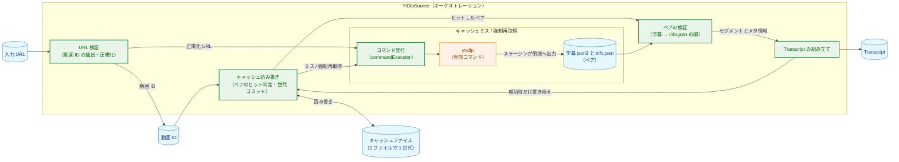
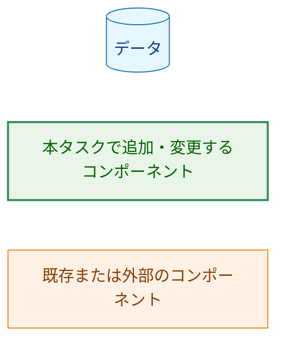
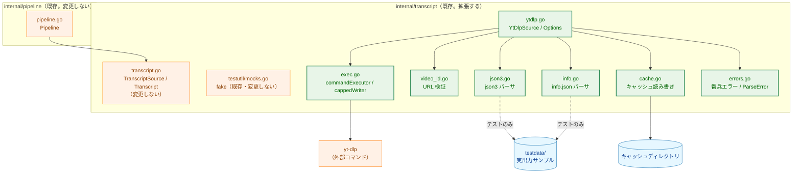
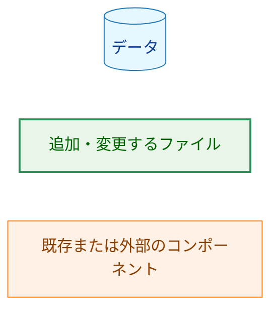
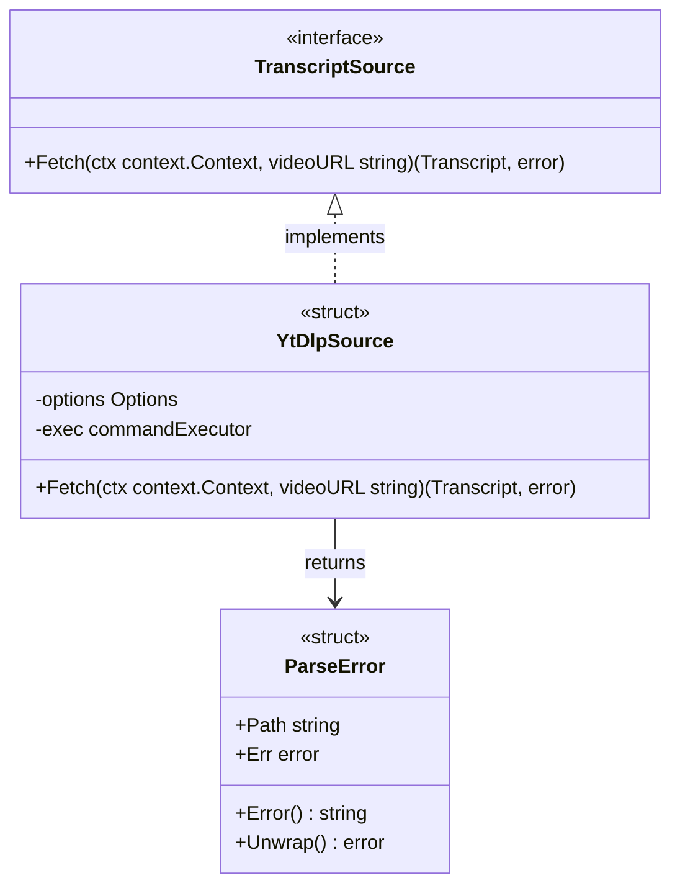
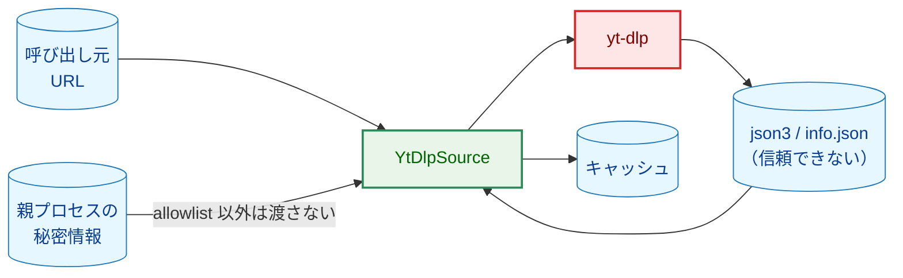
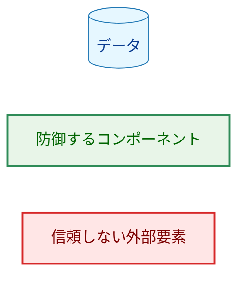
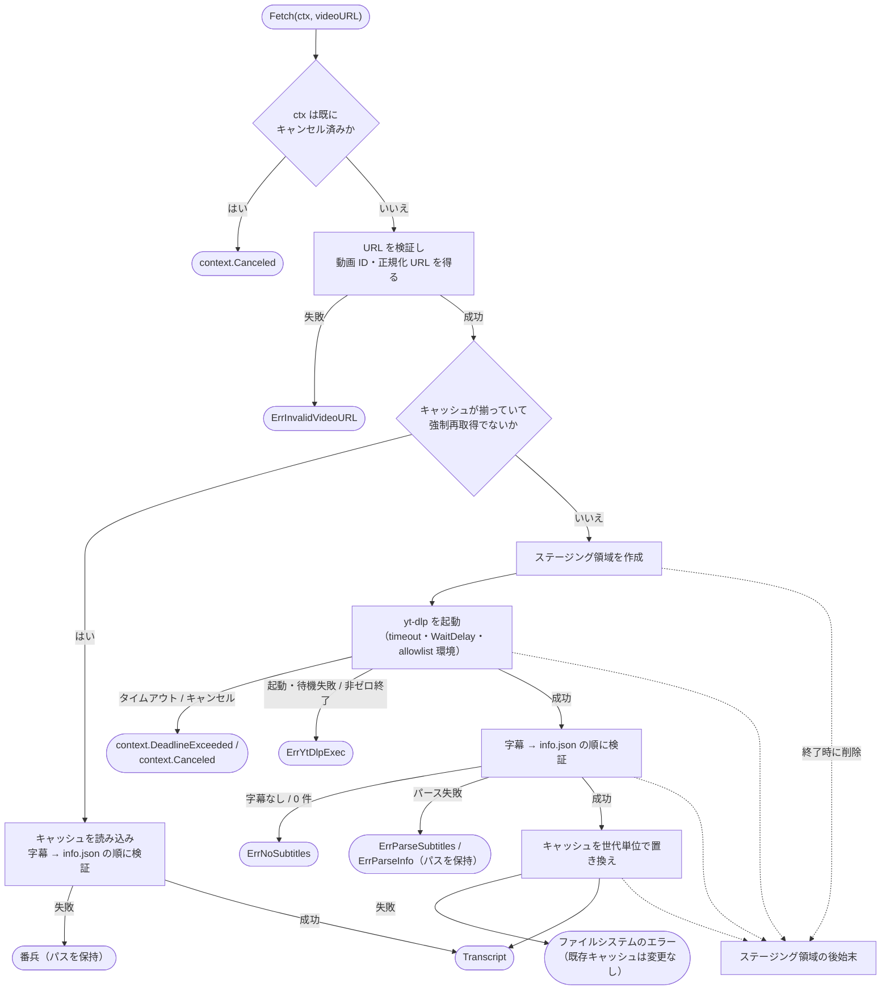
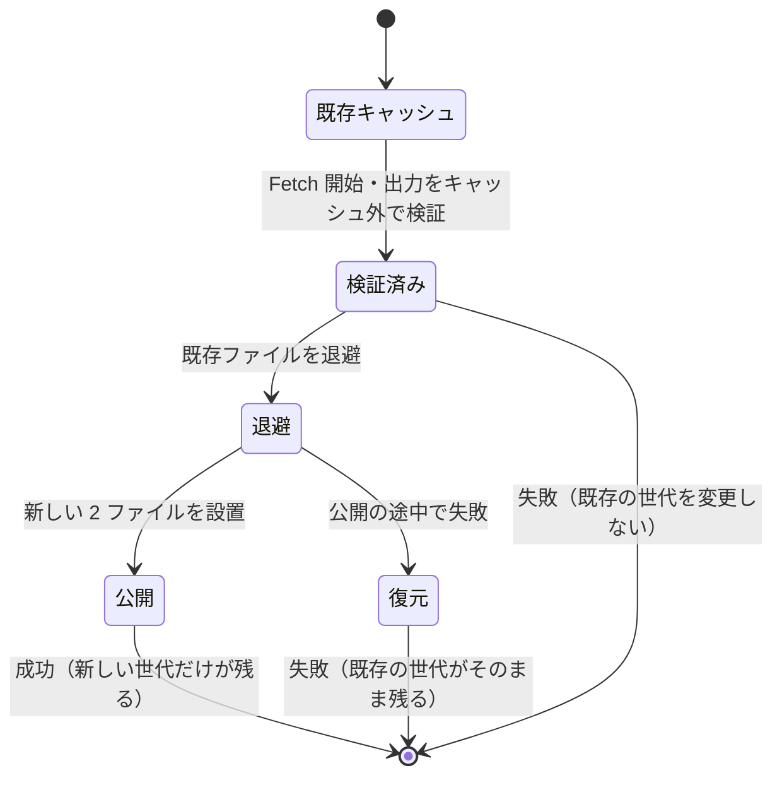

# アーキテクチャ設計書：yt-dlp による字幕取得

## Document Status

| Item | Value |
|---|---|
| Status | `draft` |
| Created | 2026-09-30 |
| Review date | - |
| Reviewer | - |
| Comments | - |

## 1. 設計の全体像 (Design Overview)

### 1.1. 設計原則

1. **信頼できない入力は境界で検証し、補正しない。** URL・json3・info.json・外部コマンドの出力は信頼できない入力として扱い（[security.md](../../dev/security.md)）、要件定義書 3.2 が定める受理の形式に合致しない入力は、正規化・切り詰め・置換をせず、対応する番兵エラー（`errors.Is` で判別できる固定のエラー値）で拒否する。部分的な結果を返さない。
2. **外部コマンドは薄い差し替え可能な境界の背後に置く。** `YtDlpSource` は `yt-dlp` の起動を内部 interface（`commandExecutor`）越しに行い、ユニットテストは実 `yt-dlp` を呼ばずに引数・環境変数・終了状態を検証できる（AC-07・AC-27・AC-44）。
3. **キャッシュの変更は成功時だけ、世代単位で行う。** `yt-dlp` にはキャッシュへ直接書かせず、実行ごとのステージング領域へ出力させる。`Transcript` を組み立てられた場合に限り、新旧のファイルが混在しない形でキャッシュを置き換える（AC-34・AC-58・AC-59、design_handoff H-07）。
4. **キャッシュはファイルだけとする。** プロセス内のメモリに保持しない。これにより利用者がキャッシュファイルを削除すると、次の `Fetch` がキャッシュミスとして再取得する（AC-35）。
5. **「空はエラー」を守る。** セグメント 0 件の結果や info.json の欠落を成功として扱わない（AC-23・AC-60）。判断は §3.7 で固定した決定的な検証順序で行う。
6. **既存の interface とデータ型に従う。** 実装は `0001_pipeline_skeleton` で定義済みの `transcript.TranscriptSource`・`Transcript`・`Segment` を変更せずに、要件を満たす（AC-25）。パイプライン（`internal/pipeline`）は本タスクの変更を受けない。

### 1.2. 概念モデル



**図1 概念モデル**。実線の矢印 A → B は「A の結果を B が入力として使う、または A の成功を受けて B を更新する」を表す。`YtDlpSource` は段階の入口と進行の制御を担うオーケストレータであり、URL 検証・キャッシュの読み書き・コマンド実行・ペアの検証・`Transcript` の組み立てを独立した責務として実装する（§3.3）。字幕 json3 と info.json は常にペアで処理し、キャッシュも 2 ファイルで 1 世代として扱う。キャッシュがヒットした場合はキャッシュしたペアを、ミス時は「キャッシュミス / 強制再取得」の処理（`yt-dlp` の起動とステージング領域への出力）で得たペアを、同じ「ペアの検証」に渡す。キャッシュを置き換えるのは、ペアの検証に成功して `Transcript` を組み立てられた場合だけである（`ASM --> CACHE`）。形式ごとの解析（json3 パーサ・info.json パーサ）は「ペアの検証」の内部にあり、詳細は §3.4 に示す。`CACHE <--> CF` はキャッシュの読み書きを表す。



**凡例（図1 概念モデル）**。

以降の図では、色分け（`classDef`）を使う図にだけ凡例を付ける。シーケンス図（図3）・クラス図（図4）・状態図（図8）は色分けを使わないため凡例を省略し、矢印の意味をキャプションに記す。

### 1.3. 既存コードとの関係

本タスクは、既存パッケージ `internal/transcript` に実装を追加する。既存の `transcript.TranscriptSource` interface（`internal/transcript/transcript.go:26`）と `Transcript` 型（同 `:14`）・`Segment` 型（同 `:8`）は変更しない（執筆時点の HEAD `421251e` で確認）。`internal/pipeline` は `transcript.TranscriptSource` をフィールドに持つだけで（`internal/pipeline/pipeline.go:69`）、本タスクの実装の詳細に依存しないため、変更しない。

`internal/transcript` は現在 `transcript.go` とテスト用 fake（`testutil/mocks.go`・`testutil/mocks_test.go`、いずれも `//go:build test`）だけを持つ。本タスクで `internal/transcript` が `internal/secret` など他パッケージを import することはない（標準ライブラリのみ）。既存テストのうち、本設計が振る舞いを変えるものはない（fake のテストはそのまま通る）。

事前調査（§1.4）のための実 `yt-dlp` の実行は、リポジトリの外の一時ディレクトリで行った。得られた実出力は `testdata/` に保存した。配置は、[project_overview.md](../../dev/project_overview.md) の想定ディレクトリ構成（リポジトリ直下の `testdata/`）と、pre-commit の `check-added-large-files` が `^testdata/` を除外していることに合わせ、リポジトリ直下の `testdata/` とする（パッケージ内には置かない）。

### 1.4. 事前調査の結果（実データ）

要件定義書 §5 の指示により、`02_architecture.md` の作成時（承認前）に実 `yt-dlp` で出力を確認した。`yt-dlp` のバージョンは `2026.08.19` である。

**保存する実データの条件。** 字幕・タイトル・概要欄は著作物でありうる。通常の YouTube 標準ライセンスの動画の全文字起こしをリポジトリに保存しない。リポジトリに保存するのは、再配布が許諾された Creative Commons Attribution（CC BY。YouTube の動画ページの表示は "Creative Commons Attribution license (reuse allowed)"）の動画からの出力に限り、出典（動画 URL・チャンネル名・ライセンス）を [`testdata/README.md`](../../../testdata/README.md) に明記する。

**保存したフィクスチャ。** CC BY の動画 `2tcCWM-sRBw`（チャンネル「日本語で☆話しまSHOW」、日本語スピーチコンテスト）から、自動字幕の実出力を保存した。取得コマンドは `yt-dlp --ignore-config --no-plugin-dirs --skip-download --write-auto-subs --sub-langs ja --sub-format json3 --write-info-json -P <dir> -o "%(id)s" -- <URL>` である。

- `testdata/2tcCWM-sRBw.ja.json3`（338,040 バイト）: 自動字幕。トップレベルに `events` のほか `pens`・`wireMagic`・`wpWinPositions`・`wsWinStyles` があった。`events` は 704 件で、内訳は次の 3 種類だった。
  - 本文を持つ内容イベント 352 件。すべて `tStartMs`（整数）と `segs` を持ち、`segs` の要素は `utf8` のほか未知メンバーを持っていた。
  - `aAppend` を持ち、連結した本文が空白だけのイベント 351 件。
  - `segs` を持たないメタ情報イベント 1 件。
- `testdata/2tcCWM-sRBw.info.json`（1,486,266 バイト）: 63 個のメンバーを持ち、`id`・`title`・`channel`・`description` はいずれも JSON 文字列だった（`id` は動画 ID と一致）。`license` メンバーが CC BY を示す。
- **重複:** 内容イベントの本文にローリング表示に由来する重複は無かった。包含関係にある組は 3 件あったが、いずれも時間的に離れた繰り返しだった。

**手動字幕と自動字幕の優先。** 同じ CC BY 動画で `--write-subs --write-auto-subs --sub-langs ja` を実行すると、`ja.json3` には手動字幕が書かれた（手動が優先される）。ただし、この動画の手動トラックは空白だけのイベントが大半を占める位置調整用とみられるトラックで、本文は 2 行しか無く、実用的な文字起こしは自動字幕にあった。したがって本設計は、読み込むファイルを `<id>.ja.json3` の 1 つに固定し、本文を持つイベントが 0 件なら `ErrNoSubtitles` とする。手動トラックが実質空の場合に自動字幕へ切り替える仕組みは、今回のスコープでは設けない（既知の制限。§9・付録A）。

**レート制限。** 調査の後半で YouTube の字幕取得が HTTP 429（Too Many Requests）を返すようになった。保存したフィクスチャは 429 の前に取得済みである。

**出力ファイル名と `-P`。** 出力は `<動画 ID>.ja.json3` と `<動画 ID>.info.json` で、`-o` の `%(id)s` が動画 ID に展開された。あわせて `-P` に `%(title)s` と `%%` を含むディレクトリ名を指定して実行し、`yt-dlp` がその名前を文字どおりのディレクトリとして扱い（展開せず）、出力をその下にだけ作ることを確認した（AC-06、design_handoff H-02）。

**統合テストの既定の動画。** 手動トラックが位置調整用でない CC BY の動画として、`EQCUZyB4DqE`（太田市日本語スピーチコンテスト）を使う。`info.json` で CC BY と `ja` 自動字幕の存在を確認済みである（手動字幕は無い）。字幕の実取得は 429 のため本調査では完了しておらず、最初の手動実行（F-008・AC-33）で行う。

この観測に基づき、§3.7 で次の 6 項目を固定する。字幕ファイル名と採用規則、重複判定の規則、サイズ・件数の上限、環境変数の allowlist、タイムアウト後の猶予、統合テストの既定の動画。

---

## 2. システム構成 (System Structure)

### 2.1. パッケージ構成



**図2 パッケージ依存構造**。矢印 A → B は「A が B を利用（import または起動・読み書き）する」を表す。変更しない `transcript.go`（既存の interface とデータ型）と `pipeline.go` はオレンジ、本タスクで追加するファイルは緑、データは青である。`internal/transcript` 内の追加ファイルは同じパッケージの型を共有し、相互に import しない。`testdata/` への点線の矢印はテストだけが読むことを表し、本番コードは `testdata/` に依存しない。



**凡例（図2 パッケージ依存構造）**。

### 2.2. コンポーネント配置

- `internal/transcript` に `YtDlpSource` とその部品（URL 検証・パーサ・キャッシュ・コマンド実行）を置く。`internal/transcript` はこれまでどおりリーフであり、標準ライブラリ以外を import しない（`.golangci.yml` の `deps` ルール）。パッケージを分けない理由は、機能が単一の段階（字幕取得）に閉じており、分けると interface と実装の往復 import か、公開範囲の不必要な拡大を招くためである（YAGNI）。
- `cmd/yt2column/main.go` は変更しない（CLI 配線は #6）。`internal/pipeline` も変更しない。

### 2.3. データフロー（成功時・キャッシュミス）


**図3 データフロー（キャッシュミス時の成功経路）**。矢印 `->>` は呼び出し、`-->>` は戻り値または書き込みを表す。キャッシュヒット時は `E`/`X` の呼び出しを行わず、キャッシュの読み込みと検証だけで `Transcript` を返す（§6.1）。

---

## 3. コンポーネント設計 (Component Design)

### 3.1. 公開データ型とエラー

既存の型（`Segment`・`Transcript`・`TranscriptSource`、`internal/transcript/transcript.go:8-28`）は変更しない。追加する公開型は次のとおり。

```go
// internal/transcript

// Options configures a YtDlpSource. CacheDir and Timeout are required.
type Options struct {
    CacheDir     string
    YtDlpPath    string // empty means "yt-dlp" on PATH
    Timeout      time.Duration
    ForceRefresh bool
}

// YtDlpSource implements TranscriptSource by invoking yt-dlp.
type YtDlpSource struct { /* unexported fields */ }

// ParseError keeps the path of the file that failed to parse.
// Unwrap returns ErrParseSubtitles or ErrParseInfo.
type ParseError struct {
    Path string
    Err  error
}
func (e *ParseError) Error() string
func (e *ParseError) Unwrap() error
```

番兵エラーはパッケージレベルの値として定義する。

```go
var (
    ErrInvalidVideoURL = errors.New("invalid video URL")
    ErrYtDlpExec       = errors.New("yt-dlp execution failed")
    ErrParseSubtitles  = errors.New("parse subtitles")
    ErrParseInfo       = errors.New("parse video info")
    ErrNoSubtitles     = errors.New("no subtitles")
)
```

### 3.2. interface

- `transcript.TranscriptSource`（既存）を実装する。`Fetch(ctx context.Context, videoURL string) (Transcript, error)`（`internal/transcript/transcript.go:27`）。
- 外部コマンドの実行は、パッケージ内の次の interface 越しに行う。テストはこれを差し替える。

```go
// internal/transcript

// commandExecutor runs an external command. Tests replace this.
type commandExecutor interface {
    Run(ctx context.Context, name string, args, env []string, stderr io.Writer) error
}
```

`Run` は生の実行結果を返す（`*exec.ExitError`・`*exec.Error`・context のエラーなど）。番兵への変換（context 以外に由来する起動・待機の失敗および非ゼロ終了 → `ErrYtDlpExec`、タイムアウト → `context.DeadlineExceeded`、キャンセル → `context.Canceled`）は `Fetch` が行う。テスト用の fake はこの契約に従う。

標準エラー出力の上限（4 KiB）とドレイン（上限を超えた分も読み続けて捨てること）は `cappedWriter` が担い、`Fetch` がこれを生成して `Run` に渡す。実装（`exec.go`）は受け取った `io.Writer` を子プロセスの標準エラー出力に接続するだけにする。この分担により、上限の切り詰めは fake を使う `Fetch` レベルのテストで検証でき、子プロセスのドレイン（読み取りを止めないこと）は実プロセスを使う `exec_test.go` で検証できる（§7.1）。

`YtDlpSource` のフィールドは非公開とし、構築は `NewYtDlpSource(opts Options) (*YtDlpSource, error)` だけを入口にする。構築時に `CacheDir` が空、または `Timeout` が 0 以下ならエラーを返す（AC-28、要件 §5 の「キャッシュディレクトリの指定がない場合の扱いは設計で決める」に対する決定）。実行パスが空の場合は `"yt-dlp"` を使い、実行時に見つからなければ `ErrYtDlpExec` になる。

### 3.3. `YtDlpSource` と内部の責務

`YtDlpSource` は段階の入口（`TranscriptSource` の実装）と進行の制御だけを担う。処理の実体は、次の独立した責務に分ける（図1）。いずれも同一パッケージ内の関数または小さな型で実装し、外部から差し替える必要があるのは外部コマンドの実行（`commandExecutor`、§3.2）だけである。

- **URL 検証**（`video_id.go`）: 入力 URL から動画 ID と正規化 URL を返す純粋な処理（§3.6）。
- **キャッシュの読み書き**（`cache.go`）: パスの組み立て、読み込み、ステージング、世代コミットとロールバック、後始末（§3.5）。
- **コマンド実行**（`exec.go`）: `yt-dlp` の起動、allowlist 環境、標準エラー出力の上限付きドレイン（§5.2）。
- **ペアの検証**（`json3.go`・`info.go`）: 字幕ファイルと info.json をペアとして、字幕 → info.json の決定的な順序で検証し、セグメントとメタ情報を返す純粋な処理（§3.4）。形式ごとの解析は json3 パーサ（`json3.go`）と info.json パーサ（`info.go`）が担い、ペアの順序と番兵の優先は `Fetch` が制御する（§6.2）。
- **`Transcript` の組み立て**: 動画 ID・正規化 URL・メタ情報・セグメントをまとめる。

`Fetch` の処理順は §6.1 に示す。`Fetch` は `ctx` のキャンセルに従い、開始前にキャンセル済みなら `yt-dlp` を起動せず `context.Canceled` を返す（AC-26）。

### 3.4. ペアの検証とパーサ

字幕 json3 と info.json は常にペアで処理する。キャッシュの完全性も 2 ファイルの存在で判定し（AC-29）、検証は字幕 → info.json の決定的な順序で行う（§6.2）。形式ごとの解析は json3 パーサと info.json パーサに分けるが、呼び出し側から見た責務は「ペアの検証」の 1 つであり、順序と番兵の優先は `Fetch` が制御する。

json3 と info.json のパーサは、外部コマンドの起動から分離した純粋な処理とし、`testdata/` の実出力でテストできる形にする（AC-13・AC-27、要件 §4.5）。両者は次の共通手段で「標準ライブラリが黙って補正する入力」を拒否する（design_handoff H-05・H-12）。

- デコードの前に生のバイト列を検証し、不正な UTF-8、および対になっていない UTF-16 サロゲートのエスケープを拒否する。
- トップレベルがちょうど 1 つの JSON 値であり、その後に空白以外のデータが残らないことを検証する。
- `null`、配列要素の `null`、型の不一致（例: `utf8` が `null`）、`int64` の範囲を超える数値を、値ごとに区別して拒否する。欠落（ゼロ値）と `0`・空文字列を区別できる中間表現を使って検証する。
- 上記は「消費するフィールド」に限定する。消費しない未知のメンバーは無視して受理する（AC-64・AC-67。消費するフィールドは F-003 と F-004 が定める）。`aAppend` などの未知メンバーの値によって挙動を変えない（要件 3.2 の「消費するフィールドだけを厳密に検証する」に従う）。
- 本文を持つイベントとは、`segs` を持ち、その `utf8` を連結した文字列に空白以外の文字を含むイベントをいう。`segs` を持たないイベントと、連結した本文が空白文字だけのイベント（行区切り）は、本文を持たないものとしてセグメントに含めない。この判定は `aAppend` の有無に依存しない。
- ファイルサイズと件数の上限（§3.7）を読み込みの時点で判定する（design_handoff H-09）。

失敗は、対象ファイルのパスを保持する `*ParseError`（`Err` は `ErrParseSubtitles` または `ErrParseInfo`）として返す。キャッシュ読み込み中の失敗はこの型でパスを保持し、利用者が破損ファイルを特定できる（AC-36）。

### 3.5. キャッシュ

キャッシュは動画 ID ごとの 2 ファイル（§3.7）で構成する。2 ファイルは 1 つの世代として扱い、キャッシュの完全性は両方の存在で判定する。`yt-dlp` にはキャッシュディレクトリへ直接書かせず、キャッシュディレクトリ内に作るステージング領域（`<cacheDir>/<動画 ID>.staging-*`、`0o700`）へ `-P` で出力させる（design_handoff H-07）。これにより前回の残存ファイルを今回の出力と誤認しない（AC-30）。

**所有権の規則。** キャッシュディレクトリ内で名前が `<動画 ID>.` で始まるエントリは、その動画のキャッシュ（2 ファイルと、実行中・中断時に作られるステージング領域・退避ファイル）として扱う。それ以外のエントリには触れない。動画 ID は一意であり、他の動画 ID がこの接頭辞に一致することはない（AC-20・AC-59）。

**コミットの順序。** 置き換え（コミット）は、`Transcript` を組み立てられた場合にだけ行う。順序は次のとおりとし、各時点で「新旧の正規ファイルが同時に揃わない」ことを保証する。

1. 既存の正規ファイル（`<id>.ja.json3`・`<id>.info.json`）を、退避名へ**リネーム**する。この時点で正規名のファイルは消える。
2. ステージング領域の新しい 2 ファイルを、正規名へリネームで設置する。
3. `<id>.` で始まり、今回の世代が設置しなかったエントリ（前回だけ存在した `<id>.ja-orig.json3` など、過去のステージング領域・退避ファイル）を削除する。

途中でファイルシステム操作が失敗した場合は、退避したファイルを正規名へ戻す（ロールバックする）。正規名はリネームで消えてから設置されるため、途中でプロセスが終了しても「新旧が混在した完全なキャッシュ」は残らない（片方だけ、または両方欠けた状態はキャッシュミスとして再取得される）。ロールバック自体が失敗した場合も、残るのは不完全なキャッシュであり、既存の世代が混在して受理されることはない。この方式により、`Fetch` が失敗したときは直前の有効なキャッシュが内容を変えずに残り（AC-58）、成功したときは今回の出力だけが残る（AC-34。design_handoff H-07 のコミット時失敗・混在世代）。

**単一ライターの前提。** 同じキャッシュディレクトリ・同じ動画に対する `Fetch` の同時実行はサポートしない。呼び出し側が直列化する（CLI は 1 回の実行で 1 本の動画を処理する。#6）。この前提の下で、上記の順序は混在を防ぐ。

**中断時の残留。** `Fetch` の終了時に `defer` でステージング領域を削除する（AC-59）。`SIGKILL` などで削除が走らなかった場合、`<id>.staging-*` や退避ファイルが残りうる。これらは上記の所有権の規則により、同じ動画の**次の成功した `Fetch` のコミット**で削除される。後始末の失敗はベストエフォートとし、`Fetch` の戻り値（成功・失敗）を変えない。

- キャッシュの読み書きに使うファイル名は、検証済みの動画 ID から組み立てる。ディレクトリ内の他のファイル名は信用しない（AC-20）。
- ステージング領域のファイルは、コミットの前に `0o600` にする。キャッシュディレクトリは `0o700` で作成する（AC-19、design_handoff H-08）。既存のキャッシュディレクトリ・ファイルのパーミッションは検査・変更しない（スコープ外、design_handoff H-11）。
- 他の動画のファイルや無関係なファイルには触れない（AC-59）。
- キャッシュが一部だけ存在する場合はキャッシュミスとして扱い、再取得する（AC-29）。
- **キャッシュ読み込み中の削除への追随。** キャッシュの完全性の確認とファイルの読み込みは別のシステムコールである。確認と読み込みの間に利用者がファイルを削除した場合（AC-35 の削除による無効化を含む）、読み込みが「存在しない」で失敗したらキャッシュミスとして扱い、再取得する。存在するが読み取れない場合だけを `ErrParseSubtitles` / `ErrParseInfo`（パスを保持）とする（AC-63）。

### 3.6. URL 検証

`video_id.go` が入力 URL を検証し、動画 ID と正規化 URL を返す（F-001）。スキーム・ホスト・パス形式・動画 ID の文字種・動画 ID の後の余分なパス要素を検証し、合致しなければ `ErrInvalidVideoURL` を返す。キャッシュのパスには動画 ID だけを使い、URL 文字列は使わない（AC-04）。正規化 URL は `Transcript.VideoURL` にも使う（§3.7、design_handoff H-15）。

### 3.7. 事前調査で固定した具体値

§1.4 の観測に基づき、次の値を固定する。いずれも、`02_architecture.md` の承認によって確定する決定事項である。

**字幕ファイル名と採用規則。** 字幕ファイルは `<cacheDir>/<動画 ID>.ja.json3`、info.json は `<cacheDir>/<動画 ID>.info.json` とする。`Fetch` が読む字幕ファイルは `<動画 ID>.ja.json3` ただ 1 つで、他の字幕ファイル（例: `<動画 ID>.ja-orig.json3`）は読まない。固定の起動オプション `--sub-langs ja` が `ja` の字幕を `ja.json3` に書くため、手動字幕と自動字幕の両方が利用できる場合も、読むファイルは `ja.json3` の 1 つに定まる。§1.4 のとおり、両方がある場合に `ja.json3` に書かれるのは手動字幕だった。ただしその動画の手動トラックは空白だけのイベントが大半で、本文が 2 行しかなかった。手動トラックが実質空の場合に自動字幕へ切り替える仕組みは設けず、既知の制限として記録する（§1.4・§9）。AC-31 は、両方のファイルがあるキャッシュでは `ja.json3` から採用することを検証する。

**重複判定の規則。** §1.4 のとおり、実データの json3 にはローリング表示に由来する重複イベントが無く、包含と時刻の重なりによる素朴な除去は実際の本文を含む行を削除した。したがって規則は次のとおりとする。

1. 本文を持たないイベント（`segs` を持たない、または連結した本文が空白文字だけ）は、行区切り・メタ情報としてセグメントに含めない。この判定は `aAppend` の有無に依存しない（§3.4）。
2. ローリング重複の自動除去は行わない。時間的に離れた同一本文は意図的な繰り返しとして本文に残す（AC-46）。実データに含まれる断片と完全な行の組（§1.4）もそのまま残す。
3. 将来の出力でローリング重複が観測された場合は、実データに基づく除去規則を追加する（§9）。現在の AC-32 は、実データに重複が無いため「パーサが重複を作らないこと」（同じ本文を二重に出力しないこと）の検証として扱う（§7.1）。

**サイズ・件数の上限。** 字幕ファイル 8 MiB（8,388,608 バイト）・イベント数 65,536 件、info.json 8 MiB。保存したフィクスチャは字幕 338 KB・704 件、info.json 1.49 MB で、別の約 56 分の動画の観測（字幕 0.9 MB・1,984 件、info.json 1.1 MB）を含めても十分な余裕がある。上限ちょうどの入力は受理し、超える入力は対応する番兵で拒否する（AC-48・AC-49・AC-50、design_handoff H-09）。

**環境変数の allowlist。** 子プロセスに渡す環境変数の集合は次で固定する（AC-66、design_handoff H-01）。

- `PATH`・`HOME`・`TMPDIR`
- `XDG_CONFIG_HOME`・`XDG_CACHE_HOME`
- `HTTP_PROXY`・`HTTPS_PROXY`・`NO_PROXY`・`ALL_PROXY` と、その小文字形（`http_proxy`・`https_proxy`・`no_proxy`・`all_proxy`）
- `LANG`・`LC_ALL`・`LC_CTYPE`
- `SSL_CERT_FILE`・`SSL_CERT_DIR`

秘密情報の変数名（`*_API_KEY`・Webhook URL など）は決して含めない。親の環境で設定されている変数だけを渡し、1 つも設定されていなくても空の（非 nil の）環境を渡す。

**タイムアウト後の猶予。** `yt-dlp` がタイムアウト・キャンセル時に終了させるのは直接の子プロセスだけであるため、子孫プロセスが標準エラー出力を開いたままでも `Fetch` が有界の時間で戻るように、猶予（`exec.Cmd.WaitDelay` 相当）を 5 秒で固定する（AC-08、design_handoff H-03）。

**統合テストの既定の動画。** `make test-integration` の既定値は、URL `https://www.youtube.com/watch?v=EQCUZyB4DqE`、動画 ID `EQCUZyB4DqE` とする（§1.4。CC BY で、手動トラックが位置調整用でない自動字幕のみの動画）。`YT2COLUMN_TEST_VIDEO_URL` と `YT2COLUMN_TEST_VIDEO_ID` で差し替えられる（F-008）。

### 3.8. コンポーネント責務表

| ファイル | 責務 | 状態 |
|---|---|---|
| `internal/transcript/ytdlp.go` | `Options`・`YtDlpSource`・`NewYtDlpSource`・`Fetch` の全体制御とキャッシュ判定。ペアの検証の順序制御 | 新設 |
| `internal/transcript/video_id.go` | URL 検証と動画 ID の抽出、正規化 URL の組み立て（F-001） | 新設 |
| `internal/transcript/exec.go` | `commandExecutor` interface、`os/exec` を使う実装、4 KiB 上限付きでドレインする `cappedWriter`、allowlist 環境の組み立て（F-002） | 新設 |
| `internal/transcript/json3.go` | json3 の解析（ペアの検証の一部。F-003） | 新設 |
| `internal/transcript/info.go` | info.json の解析（ペアの検証の一部。F-004） | 新設 |
| `internal/transcript/cache.go` | キャッシュのパス組み立て、読み込み、ステージング、世代単位のコミットとロールバック、後始末（F-005） | 新設 |
| `internal/transcript/errors.go` | 番兵エラーと `ParseError`（F-006・AC-24・AC-36） | 新設 |
| `internal/transcript/video_id_test.go` | AC-01〜AC-05・AC-03 のテスト | 新設 |
| `internal/transcript/json3_test.go` | AC-10〜AC-13・AC-32・AC-45・AC-46・AC-48・AC-49・AC-52・AC-54・AC-55・AC-57・AC-63・AC-67 のテスト | 新設 |
| `internal/transcript/info_test.go` | AC-14〜AC-16・AC-47・AC-50・AC-53・AC-60・AC-64・AC-65 のテスト | 新設 |
| `internal/transcript/ytdlp_test.go` | AC-06〜AC-09・AC-17〜AC-30・AC-34〜AC-36・AC-44・AC-51・AC-56・AC-58・AC-59・AC-61〜AC-63・AC-66・AC-68 のテスト（fake の `commandExecutor` と一時キャッシュ） | 新設 |
| `internal/transcript/exec_test.go` | `commandExecutor` の実装と `cappedWriter` のテスト。子プロセスを起動するヘルパーを使い、ドレインと `WaitDelay` の有界性を検証する（AC-08・AC-51・AC-56） | 新設 |
| `internal/transcript/cache_test.go` | キャッシュのコミット・ロールバック・後始末・パーミッションのテスト（AC-19・AC-29・AC-30・AC-34・AC-58・AC-59） | 新設 |
| `internal/transcript/integration_test.go` | F-008 の統合テスト（`//go:build integration`。AC-37〜AC-43） | 新設 |
| `testdata/2tcCWM-sRBw.ja.json3` | 実 `yt-dlp` 出力（CC BY 動画の自動字幕。§1.4） | 新設 |
| `testdata/2tcCWM-sRBw.info.json` | 実 `yt-dlp` 出力（CC BY 動画の info.json。§1.4） | 新設 |
| `testdata/README.md` | フィクスチャの出典（動画 URL・チャンネル名・ライセンス）と取得方法 | 新設 |
| `Makefile` | `test-integration` ターゲットの追加、lint のビルドタグを `test,integration` に変更（AC-38・AC-43） | 変更 |
| `.pre-commit-config.yaml` | golangci-lint フックのビルドタグを `test,integration` に変更（AC-43）。`trailing-whitespace`・`end-of-file-fixer` と `check-added-large-files` の対象から `^testdata/` を除外し、`testdata/` のバイト列を書き換えないようにする | 変更 |
| `.github/workflows/ci.yml` | lint ジョブのビルドタグを `test,integration` に変更（AC-43） | 変更 |
| `docs/dev/developer_guide/package_reference.md` | `internal/transcript` の責務の更新（実装追加） | 変更 |
| `docs/dev/developer_guide/requirements_process.md` | 境界チェックの「黙って無視する入力」の記述を、消費するフィールドに限定し、拡張可能な未消費メンバーを除外するよう整合（design_handoff H-13） | 変更 |

`internal/transcript/transcript.go` と `internal/pipeline` は変更しない。既存テストの更新は不要である。

### 3.9. design_handoff の各項目への対応

| ID | 本設計の対応 |
|---|---|
| H-01 | 環境変数は allowlist の変数だけを集めた非 nil のスライスとして `commandExecutor` に渡す（§3.7・§4.4）。 |
| H-02 | 起動オプションを固定し、出力先ディレクトリは `-P`、出力テンプレートは `-o "%(id)s"` で渡す（§3.7・§5.2）。 |
| H-03 | `WaitDelay` 相当の猶予を 5 秒で固定する（§3.7）。 |
| H-04 | 標準エラー出力は 4 KiB を上限に保持しつつ、読み取りを止めずドレインする `cappedWriter` で捕捉する（§3.8・§4.4）。 |
| H-05 | 生バイト列の検証、後続データの検出、`null` と型の不一致の区別、数値の範囲検証を §3.4 の手段で行う。 |
| H-06 | 重複判定の規則（§3.7）はローリング重複の除去を行わず、`tStartMs` 以外の数値フィールド（`dDurationMs` など）を読まないため、追加の数値検証は行わない（該当なし）。除去規則を将来追加する場合は、読むフィールドの検証とオーバーフロー対策をあわせて定める。 |
| H-07 | ステージング領域への出力、正規名を退避してから設置する世代単位のコミットとロールバック、`<動画 ID>.` 接頭辞による所有権の規則、中断時の残留の扱い、他動画のファイルに触れないことを §3.5 で定める。 |
| H-08 | ステージング領域は `0o700`、コミット前のファイルは `0o600` にする（§3.5）。 |
| H-09 | 上限値を §3.7 で固定する。 |
| H-10 | テストの組み立て方は §7.1・§7.2 の方針に従う（fake の executor、注入した失敗、実データ）。 |
| H-11 | 既存キャッシュのパーミッションは検査・変更しない（スコープ外、§2.3・§3.5）。 |
| H-12 | 境界の網羅チェックリストを §3.4・§3.7 の設計に反映した。 |
| H-13 | 消費するフィールドだけを厳密に検証し、未消費メンバーは無視する（§3.4）。あわせて `requirements_process.md` の文言を整合させる（§3.8）。 |
| H-14 | キャッシュ読み込み時も、字幕ファイルを info.json より先に検証する決定的な順序を適用する（§6.2）。 |
| H-15 | `Transcript.VideoURL` には常に正規化 URL を入れる（§3.6）。 |
| H-16 | 破棄するイベント（マーカー、`segs` なし）は `tStartMs` の検証対象にしない。検証対象は本文を持つイベントだけであり、順序は §6.1 で固定する。 |

---

## 4. エラーハンドリング設計 (Error Handling Design)

### 4.1. エラー型



**図4 主要な型と interface**。`<|..` は「左の型が右の interface を実装する」関係、`-->` は「左が右の型を返す」関係を表す。`ParseError` は `Unwrap()` で対応する番兵（`ErrParseSubtitles` または `ErrParseInfo`）を返す。他の番兵（`ErrInvalidVideoURL`・`ErrYtDlpExec`・`ErrNoSubtitles`）は、`ParseError` を介さずそのまま返る固定のエラー値である。

タイムアウトとキャンセルは本パッケージが定義する番兵ではなく、`context.DeadlineExceeded`・`context.Canceled` として返す（AC-08・AC-24・AC-26）。

### 4.2. エラーメッセージ設計パターン

- エラーには対象（動画 ID またはパス）を含め、字幕がないことはメッセージから分かるようにする（AC-22）。
- パースエラーのメッセージには対象ファイルのパスを含め、利用者が破損したファイルを特定できるようにする（AC-36）。`yt-dlp` の出力のパースに失敗した場合、パスはステージング領域を指す。ステージング領域は `Fetch` の終了時に削除されるため、メッセージは「そのファイルがまだ存在する」ことを前提にしない（利用者が再現するには同じ動画を強制再取得する）。
- `yt-dlp` の実行失敗（`ErrYtDlpExec`）のメッセージには、終了状態（非ゼロ終了のコード、または起動・待機の失敗の種別）と、解決した実行ファイルのパス（`Options.YtDlpPath`、空なら `"yt-dlp"`）を含める。誤った・古い `yt-dlp` を特定できるようにするためである。
- `yt-dlp` の標準エラー出力をメッセージに含める場合、メッセージには保持した先頭 4 KiB だけを含める（AC-51）。
- **秘密情報は本パッケージの入力にもエラーにも現れない。** 本パッケージは秘密情報を読まず、子プロセスへ渡す環境は allowlist で組み立て、親の値をエラーへ付けない（AC-44・AC-66 が検証するのはこの機構である）。

### 4.3. 失敗経路と番兵の対応

要件 3.2.1 の表をそのまま実装する。設計上の補足は次のとおり。

- **検証の実行フェーズ。** 番兵を返すのは、キャッシュが揃っている場合の読み込みと、`yt-dlp` の正常終了後の検証である。キャッシュが一部だけ存在する場合はどの失敗経路にも該当せず、キャッシュミスとして `yt-dlp` を起動する（AC-29）。
- **字幕優先の順序。** 実行後はもとより、キャッシュ読み込み時も、字幕ファイルを info.json より先に各段階で検証する。これにより、両方に失敗がある場合に返る番兵が実装の順序に依存しない（AC-68、design_handoff H-14）。
- **info.json 不在の扱い。** 「字幕ファイルは存在するが info.json が存在しない」は、キャッシュが揃っている場合には起こらない（揃っていない場合はキャッシュミス）。`yt-dlp` の正常終了後は `ErrParseInfo` とする（AC-60）。
- **破棄イベントの扱い。** 本文を持たないイベントは `tStartMs` の検証前に破棄する。同じ入力に対して返る番兵が実装の順序に依存しない（design_handoff H-16）。
- **キャッシュのファイルシステム操作の失敗。** ステージング領域の作成、パーミッションの変更、リネーム、ロールバックの失敗は要件 3.2.1 の表に無い。これらには番兵を定義せず、`*fs.PathError` などをラップしたエラーとして返す。失敗の時点で既存のキャッシュは変更されておらず（§3.5 の順序）、ステージング領域の削除はベストエフォートで行う。**後始末（ステージング領域の削除）だけの失敗は `Fetch` の戻り値を変えない**（成功は成功のまま、失敗はその失敗のまま）。呼び出し元はこれらをファイルシステムのエラーとして扱い、番兵では判別しない。
- **キャッシュ読み込み中のファイル消失。** 完全性の確認後にファイルが削除された場合は「存在しない」としてキャッシュミスに倒し、再取得する（§3.5）。「存在するが読み取れない」とは区別する。

### 4.4. サイドエフェクト契約

本タスクで外部への影響を変えるオプションは `Options.ForceRefresh` だけである。

| オプション | ネットワーク・外部コマンド | キャッシュの読み書き | ステージング領域 |
|---|---|---|---|
| `ForceRefresh = false`（既定） | キャッシュミス時だけ実行する | 読み込みは常に。書き込みは実行成功時だけ | 実行時だけ作成し、終了時に削除 |
| `ForceRefresh = true` | キャッシュが揃っていても実行する | 実行成功時だけ書き換える。失敗時は変更しない | 実行時だけ作成し、終了時に削除 |

いずれの場合も、`Fetch` がエラーを返したときはキャッシュの内容を変更せず、一時ファイル・一時ディレクトリを残さない（AC-58・AC-59）。

---

## 5. セキュリティ考慮事項 (Security Considerations)

本機能は、`.claude/commands/_context.md` の条件付きガイドのトリガー（外部コマンドの起動、キャッシュの読み書き、ネットワーク、信頼できないテキスト）のすべてに該当する。そのため [security.md](../../dev/security.md) §1・§3・§5 を参照する。

### 5.1. 脅威モデル：外部コマンドと信頼できない出力



**図5 脅威モデル**。実線の矢印 A → B は「A が B に影響を及ぼし、またはデータを渡す」ことを表す。`SECRETS` → `SRC` の矢印には「allowlist 以外は渡さない」という制約を付す。`YTDLP` と `OUT` は信頼しない。`YtDlpSource` は `yt-dlp` に引数を配列で渡してシェルを経由せず、環境は allowlist に限定し、出力は境界で検証してからキャッシュ・`Transcript` に取り込む。



**凡例（図5 脅威モデル）**。

### 5.2. 外部コマンド（`yt-dlp`）の起動

- 引数を配列で渡し、シェルを経由しない（AC-07）。URL は正規化 URL を 1 個の引数として渡し、直前の `--` でオプション解釈を止める（AC-06）。
- 子プロセスへ渡す環境は §3.7 の allowlist に限定する。allowlist の変数が 1 つも設定されていなくても、空の非 nil の環境を渡して親の環境を引き継がせない（AC-44・AC-66、design_handoff H-01）。
- `--ignore-config` と `--no-plugin-dirs` を常に渡し、利用者・システムの設定ファイルとプラグインを読み込ませない（AC-06）。設定ファイルからの `--exec` などのオプション注入や出力先の上書きを防ぐ。
- 出力先ディレクトリは `-P`、出力テンプレートは `-o "%(id)s"` で渡す。キャッシュディレクトリのパスを `-o` に含めないため、パス中の `%` が書式として解釈されない（AC-06、design_handoff H-02）。
- タイムアウトを設定し、タイムアウト・キャンセル後は 5 秒の猶予で有界に戻る（AC-08、§3.7）。
- 標準エラー出力は読み取りの時点で 4 KiB に制限しつつドレインし、子プロセスの出力量によらず親のメモリを消費しない。子プロセスが大量の標準エラー出力を出しても、その終了を妨げない（AC-51・AC-56、design_handoff H-04）。
- **ステージング領域でも読む名前は固定する。** `yt-dlp` には `-o "%(id)s"` で出力させるが、`YtDlpSource` が読むのは検証済みの動画 ID から組み立てた `<id>.ja.json3` と `<id>.info.json` だけである。`yt-dlp` が別の名前で出力したファイルは読まず、コミットもしない。したがって、出力名の展開が検証済みの ID と食い違っても、キャッシュに取り込まれることはない。
- **前提:** キャッシュディレクトリは利用者が用意したユーザー専用のディレクトリである（design_handoff H-11）。

**残余リスク（記録）。** タイムアウト・キャンセルで終了させるのは直接の子プロセスだけである。`yt-dlp` が起動した子孫プロセスは残りうる。`Fetch` は 5 秒の猶予で有界に戻るが（§3.7）、子孫プロセスが CPU やネットワークを使い続ける可能性は残る。プロセスグループの操作は行わない。この残余リスクを記録し、対処は問題になった時点で行う。

### 5.3. キャッシュ

- ディレクトリは `0o700`、ファイルは `0o600` で作成する（AC-19）。
- ファイル名は検証済みの動画 ID から組み立て、URL 文字列やディレクトリ内の任意のファイル名を信用しない（AC-04・AC-20）。
- 一時的な出力はステージング領域に閉じ込め、終了時に削除する（AC-59）。

### 5.4. 信頼できない出力の取り扱い

- 字幕・タイトル・概要欄は信頼できない入力として扱い、本タスクではキャッシュへの保存と `Transcript` としての受け渡しだけを行う。他のコマンドやコードとして実行しない。
- サイズ・件数の上限（§3.7）により、極端に大きな入力でもメモリを消費し尽くさない（AC-48〜AC-50）。
- 秘密情報は本パッケージの入出力に現れない（§4.2）。

### 5.5. 対象クライアント環境の検証

本タスクは外部サービスの新機能（Slack Block Kit など）を利用しない。対象クライアント環境（`_context.md` Domain-specific）に依存する新しい API 機能はない（該当なし）。

---

## 6. 処理フロー詳細 (Processing Flow Details)

### 6.1. `Fetch` の全体フロー



**図6 `Fetch` の全体フロー**。矢印 A → B は「A の次に B を行う」を表し、`-->|"条件"|` は条件分岐を表す。点線の矢印は、成功・失敗を問わず `Fetch` の終了時に後始末を行うことを表す。キャッシュの置き換えは、検証に成功して `Transcript` を組み立てられた場合にだけ行う。置き換えの途中で失敗した場合は、ファイルシステムのエラーを返し、既存のキャッシュを変更しない（§4.3）。

### 6.2. 検証順序（キャッシュ読み込みと実行後で共通）


**図7 検証順序**。矢印 A → B は「A の検証を通過したら B の検証へ進む」を表す。字幕ファイルを info.json より先に検証するため、両方に失敗がある場合の番兵は字幕側になる（AC-61・AC-68）。キャッシュが揃っている場合、2 ファイルは存在するが、読み取りは失敗しうる（AC-63）。ファイルが存在しない場合はキャッシュミスとして扱われ（§3.5）、番兵を返すのは実行後だけである。

### 6.3. キャッシュ更新の失敗時の状態



**図8 キャッシュ更新の状態**。遷移 A --> B は「A から B への状態変化」を表す。公開の途中で失敗しても、退避したファイルを復元するため、一部だけ置き換わった状態を残さない（AC-58、design_handoff H-07）。

---

## 7. テスト戦略 (Test Strategy)

### 7.1. ユニットテスト

実 `yt-dlp` を呼び出さず、ネットワークにも接続しない（AC-27）。`commandExecutor` をテスト用の fake に差し替え、`testdata/` の実出力と `t.TempDir` のキャッシュを使う。例外として、実装（`exec.go`）のテストは、標準エラー出力を大量に書く、標準エラー出力を開いたまま残る子孫プロセスを起動する、といった挙動を再現するために、`t.TempDir` に置いた小さなヘルパー実行ファイル（シェルスクリプト、またはテストバイナリの再実行）を起動する。これは実 `yt-dlp` でもネットワークでもない。

- **URL 検証:** AC-01〜AC-05 をテーブルテストで検証する。受理する形式と、拒否すべき入力（スキーム・ホスト・動画 ID・余分なパス要素・空白）を含める。
- **パーサ:** `testdata/2tcCWM-sRBw.ja.json3` と `testdata/2tcCWM-sRBw.info.json` を入力にする。正常系（AC-10・AC-11・AC-13・AC-14・AC-32・AC-46・AC-67）と、拒否系（AC-12・AC-15・AC-16・AC-45・AC-47〜AC-65）を検証する。拒否系の入力は、実データの一部を壊したもの（`null` への置換、型の変更、上限超過など）と、実データと同じ構造を持つ最小入力を組み合わせる。UTF-8・サロゲートのサンプルはバイト列で用意する。
- **`Fetch` の制御:** fake の executor が記録した引数・環境・標準エラー出力と、キャッシュの読み書きを検証する（AC-06〜AC-09・AC-17〜AC-30・AC-34〜AC-36・AC-44・AC-51・AC-56・AC-58〜AC-63・AC-66・AC-68）。
  - 引数の検証では、`-P` にキャッシュディレクトリが渡されること、`-o` が固定のテンプレートであること、`--` の直後に正規化 URL があることを確認する。キャッシュディレクトリ名に `%(title)s` と `%%` を含めて起動し、`-o` に現れないことを確認する（AC-06）。
  - 環境の検証では、親の環境に `YT2COLUMN_TEST_UNLISTED_MARKER`・`DEEPSEEK_API_KEY`・allowlist の各変数を設定し、渡された環境を確認する。allowlist を 1 つも設定しない場合に空の非 nil であることも確認する（AC-44・AC-66）。
  - 標準エラー出力の検証では、4 KiB を大きく超える出力を fake から書き、エラーに含まれるのが先頭 4 KiB だけであること、子が自分で終了して `ErrYtDlpExec` になることを確認する（AC-51・AC-56）。
  - 失敗時のキャッシュ保護は、成功後に各失敗を注入し、既存ファイルのバイト列が変わらないことと、一時ファイル・一時ディレクトリが残らないことを確認する（AC-58・AC-59）。コミット段階の失敗も注入する（§6.3）。ロールバックの失敗も注入し、不完全なキャッシュ（キャッシュミス）が残るだけで、新旧が混在した完全なキャッシュにならないことを確認する。
  - キャッシュ読み込み中にファイルを削除し、キャッシュミスとして再取得することを確認する（§3.5）。
  - キャッシュのファイルシステム操作（ステージング作成・リネーム・ロールバック）の失敗を注入し、番兵ではなくファイルシステムのエラーが返り、既存キャッシュが変わらないことを確認する（§4.3）。後始末だけの失敗は `Fetch` の結果を変えないことも確認する。
  - パーミッションは、作成後に `os.Stat` で確認する（AC-19）。
- **実プロセスを使う境界のテスト:** `exec_test.go` で、標準エラー出力を 4 KiB を大きく超えて書くヘルパーと、標準エラー出力を開いたまま残る子孫を起動するヘルパーを使い、ドレイン（読み取りを止めないこと）と `WaitDelay` による有界な待機を検証する（AC-08・AC-51・AC-56）。`cappedWriter` 自体も直接検証する。
- 各テストは、対象の仕組みを実際に壊して失敗することを確認してからコミットする（[CLAUDE.md](../../../CLAUDE.md) Testing Strategy）。

### 7.2. 統合テスト

実 `yt-dlp` とネットワークを使う（F-008）。`//go:build integration` で既定のテストから分離し、`make test-integration` で手動実行する（AC-37・AC-38）。`YT2COLUMN_TEST_VIDEO_URL` と `YT2COLUMN_TEST_VIDEO_ID` を使う。これらの `make` における既定値は §3.7 のとおり固定した。キャッシュは `t.TempDir` を使う（AC-42 を含む）。確認内容は、実際の動画からの `Transcript` 取得（AC-39）、キャッシュの再利用（AC-40）、強制再取得（AC-41）である。`yt-dlp` が見つからない場合やネットワークの失敗はスキップせず失敗として報告する。統合テストファイルは `make lint`・pre-commit・CI の lint の解析対象に含める（AC-43）。

### 7.3. セキュリティテスト

- 環境 allowlist により秘密情報が子プロセスへ渡らないこと（AC-44・AC-66）を §7.1 の環境検証で確認する。
- キャッシュのパスに URL 文字列が現れないこと（AC-04）を、`v` 以外のクエリパラメータに `../` を含む URL で確認する。
- サイズ・件数の上限により、極端に大きな入力が拒否されること（AC-48〜AC-50）を確認する。
- 標準エラー出力の保持量が上限を超えないこと（AC-51）を確認する。

### 7.4. 受け入れ基準と設計要素の対応

| AC | 設計要素 | テストの対象 |
|---|---|---|
| AC-01〜AC-05 | `video_id.go` の URL 検証 | URL 検証のテーブルテスト |
| AC-06 | 固定の起動オプションと `-P`/`-o`（§3.7・§5.2） | fake executor が記録した引数（`%` 入りのディレクトリ名を含む） |
| AC-07 | `commandExecutor` interface（§3.2） | fake executor への差し替えと引数・環境の観測 |
| AC-08 | タイムアウト・キャンセル・5 秒の猶予（§3.7） | fake によるタイムアウトと、ヘルパー実行ファイルの子孫プロセスが標準エラー出力を開いたまま残るケース（`exec_test.go`） |
| AC-09 | 非ゼロ終了・実行ファイル不在の番兵（§4.1） | fake が非ゼロ・起動不能を返すケース |
| AC-10・AC-11 | json3 のセグメント化（§3.4） | 実データと最小入力のパース |
| AC-12 | 受理しない形の拒否（§3.4） | `null`・非配列・後続データの入力 |
| AC-13 | `testdata/` の実出力（§1.4） | 実データのパース |
| AC-14〜AC-16 | info.json のメタ情報と必須項目（§3.4） | 実データと欠落・空の入力 |
| AC-17・AC-18 | キャッシュヒット・ミスの判定（§3.5・§6.1） | fake executor の呼び出し回数とキャッシュの有無 |
| AC-19 | ディレクトリ `0o700`・ファイル `0o600`（§3.5） | `os.Stat` による確認 |
| AC-20 | 動画 ID からのファイル名組み立て（§3.5） | キャッシュのパスと読み書き |
| AC-21〜AC-23 | 字幕なしの検出（§4.3・§6.2） | 字幕ファイルなし・0 件のケース |
| AC-24 | 番兵の判別（§4.1） | `errors.Is` による各番兵の判別 |
| AC-25 | `TranscriptSource` の実装（§3.2） | コンパイル時検証と `Fetch` の戻り値 |
| AC-26 | 開始前キャンセル・実行中キャンセル（§3.3・§6.1） | キャンセル済みの `ctx` と fake の実行中キャンセル |
| AC-27 | 外部を呼ばないテスト（§7.1） | fake executor と `testdata/` |
| AC-28 | タイムアウト 0 以下の拒否（§3.2） | 構築のエラー |
| AC-29 | 一部だけのキャッシュ（§3.5・§4.3） | 片方だけを置いたキャッシュ |
| AC-30 | 残存ファイルの誤認防止（§3.5） | 字幕を出力しない成功ケース |
| AC-31 | 採用する字幕ファイル（§3.7） | `ja.json3` と `ja-orig.json3` を置いたキャッシュ |
| AC-32・AC-46 | 重複判定の規則（§3.7） | 実データで重複を作らないこと、および断片と完全な行の組・時間的に離れた繰り返しが除去されずに残ること |
| AC-33 | 手動実行の完了条件（§7.2） | 03_implementation_plan.md に記録する（実装計画側） |
| AC-34 | 成功時の置き換え（§3.5・§6.3） | 強制再取得の成功と残存ファイルの削除 |
| AC-35 | 削除後の再取得（§3.5） | キャッシュ削除後の `Fetch` |
| AC-36 | `ParseError` のパスと番兵（§3.4・§4.1） | `errors.AsType` / `errors.Is` |
| AC-37〜AC-43 | 統合テスト（§7.2） | `make test-integration`・lint の解析対象 |
| AC-44・AC-66 | 環境 allowlist（§3.7・§5.2） | fake executor が観測した環境 |
| AC-45・AC-54 | `tStartMs` の必須・範囲（§3.4） | 欠落・負数・非整数・範囲外の入力 |
| AC-47 | info.json の `id` 一致（§3.4） | 不一致の入力 |
| AC-48・AC-49 | 字幕の上限（§3.7） | 上限ちょうど・超過の入力 |
| AC-50 | info.json の上限（§3.7） | 上限ちょうど・超過の入力 |
| AC-51・AC-56 | 標準エラー出力の捕捉（§3.7・§5.2） | fake executor が書く大量の出力 |
| AC-52・AC-53 | UTF-8・サロゲートの拒否（§3.4） | 不正バイト列のサンプル |
| AC-55・AC-57・AC-67 | 配列要素・入れ子・未知メンバー（§3.4） | `null` 要素・非オブジェクト要素・未知メンバーを含む入力 |
| AC-58・AC-59 | 失敗時のキャッシュ保護と後始末（§3.5・§6.3） | 各失敗の注入とファイルの比較 |
| AC-60・AC-61 | info.json 不在と字幕なしの優先（§4.3・§6.2） | 出力なし・info.json なしのケース |
| AC-62 | 起動・待機失敗の番兵（§4.1） | fake が権限拒否などを返すケース |
| AC-63 | 読み取り不能な字幕ファイル（§3.4・§4.3） | ディレクトリをパスに置くケース |
| AC-64・AC-65 | 未消費メンバーと消費フィールドの型（§3.4） | 実データと型を変えた入力 |
| AC-68 | 検証順序（§6.2） | 複合失敗のケース |

テストの実装上の詳細（テスト関数名、ファイル内の位置）は `03_implementation_plan.md` で定める。

---

## 8. 実装優先順位 (Implementation Priorities)

1. **フェーズ 1: 純粋な処理** — `errors.go`・`video_id.go`・`json3.go`・`info.go` と、`testdata/` を使うテスト。外部コマンドに依存しない。
2. **フェーズ 2: 外部コマンドの境界** — `exec.go`（`commandExecutor`・`cappedWriter`・allowlist 環境）と fake を使うテスト。
3. **フェーズ 3: キャッシュと `Fetch`** — `cache.go`・`ytdlp.go` と、fake executor を使う `Fetch` のテスト。
4. **フェーズ 4: 統合テストと lint 経路** — `integration_test.go`、`Makefile`・pre-commit・CI の lint ビルドタグ。
5. **フェーズ 5: ドキュメント** — `package_reference.md`・`requirements_process.md` の更新。

各フェーズで `make fmt && make test && make lint` を通す。各パッケージを追加・変更するコミットで `package_reference.md` を更新する。

---

## 9. 将来の拡張性 (Future Extensibility)

- **他の字幕言語・翻訳**: `-o`・ファイル名の言語部分を設定にすれば、同じ構造で別言語へ広げられる。#6 の設定追加で対応する。
- **手動・自動字幕の選択**: 現設計は読み込みファイルを `<id>.ja.json3` の 1 つに固定する。手動トラックが実質空の場合に `ja-orig` の自動字幕へ切り替える拡張を、必要になった時点で追加する（§1.4・付録A）。
- **ローリング重複への対応**: §3.7 のとおり、実データでは重複を観測していない。将来の出力形式で観測された場合は、`dDurationMs` など規則が読むフィールドの検証（範囲・オーバーフロー対策を含む）とあわせて除去規則を追加する。
- **長い動画（#13）**: チャンク分割はスコープ外。上限制御により、想定外に大きい入力は安全に拒否できる。
- **音声文字起こし（#12）**: 字幕がない動画へのフォールバックはスコープ外。`ErrNoSubtitles` を判別できるため、別段階として追加できる。
- **YAGNI**: リトライ・並列取得・メモリキャッシュは行わない。必要になった時点で追加する。

---

## 付録A: 決定履歴 (Decision History)

- **リポジトリに保存する実データを CC BY の動画に限定した。** 通常の YouTube 標準ライセンスの動画の全文字起こしは著作物であり、公開リポジトリへの保存は適切でない。フィクスチャは CC BY の動画からの出力に限り、出典とライセンスを `testdata/README.md` に明記する（§1.4）。
- **読み込む字幕ファイルを `<id>.ja.json3` に固定した。** §1.4 の調査で、`--sub-langs ja` が `ja.json3` だけを出力し、手動字幕と自動字幕の両方がある場合は手動字幕が `ja.json3` に書かれることを確認した。両方を含むキャッシュでは `ja.json3` を採用し、`ja-orig.json3` などは読まない（AC-31）。
- **手動トラックが実質空の場合を既知の制限とした。** 調査した CC BY 動画の手動トラックは空白だけのイベントが大半で、本文が 2 行しかなかった。本スコープでは自動字幕へのフォールバックを設けない。将来、`ja-orig` を追加で取得して本文を持つ方へ切り替える拡張を検討する（§1.4・§9）。
- **ローリング重複の除去を行わない。** 実データに重複が無く、文言の包含と時刻の重なりによる素朴な除去規則を適用すると実際の本文を含む行まで削除された。将来の出力形式で重複が観測された場合、読むフィールドの検証とオーバーフロー対策をあわせて規則を追加する。
- **上限値を 8 MiB / 65,536 件 / 8 MiB とした。** 保存したフィクスチャ（338 KB・704 件・1.49 MB）と、別の約 56 分の動画の観測（0.9 MB・1,984 件・1.1 MB）に対する余裕から決めた。
- **キャッシュディレクトリを必須とした。** 未指定を許す既定ディレクトリは、利用者の環境に依存するため設けない。`#6` が設定から渡す。
- **キャッシュの置き換えを「退避 → 公開 → 復元」の順で行う。** 正規名をリネームで消してから設置するため、新旧が混在した完全なキャッシュは残らず、途中終了はキャッシュミスとして再取得される。`<動画 ID>.` 接頭辞で当該動画のエントリを識別し、残存エントリを削除する。同じキャッシュへの同時実行はサポートしない（§3.5）。
- **`-P` の値はテンプレートとして展開されないことを実測した。** `%(title)s` と `%%` を含むディレクトリ名で `yt-dlp` を実行し、文字どおりのディレクトリへ出力されることを確認した（§1.4）。
- **`requirements_process.md` の文言を整合させる。** 「標準ライブラリが黙って無視する入力も拒否する」というチェックは、要件が拡張可能と宣言する未消費メンバーの受理と矛盾するため、消費するフィールドに限定する（design_handoff H-13）。
