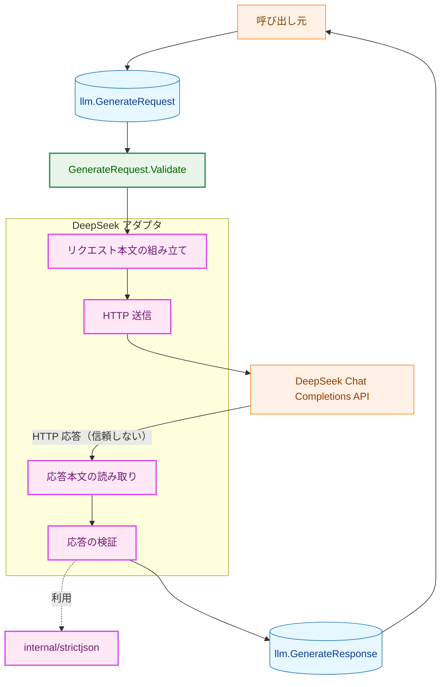
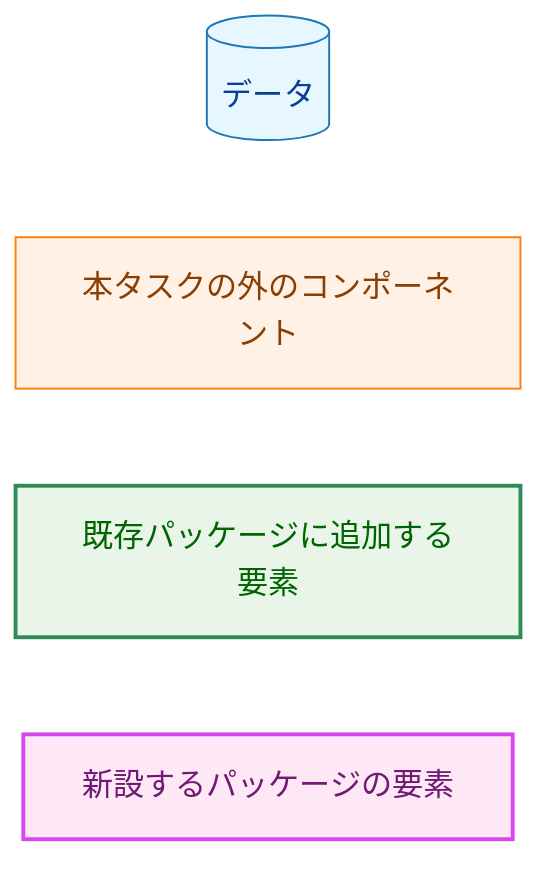
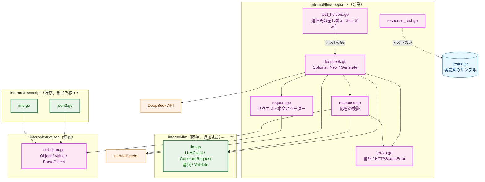
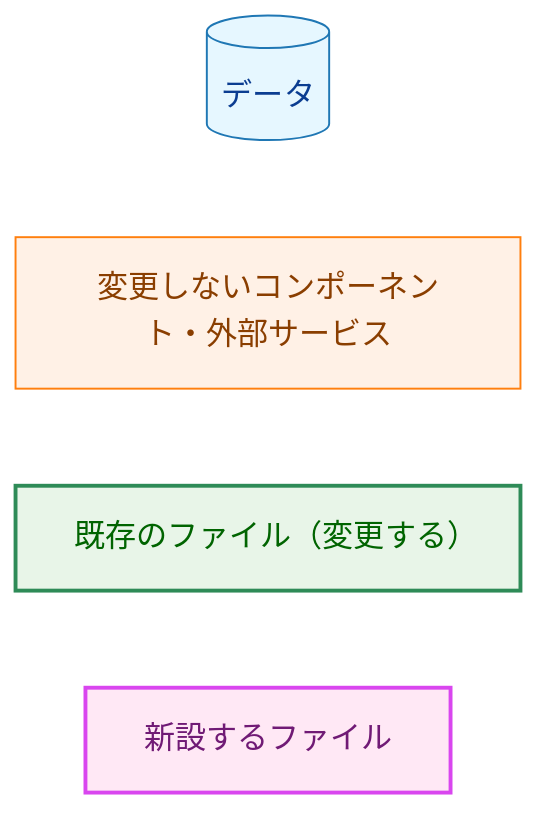
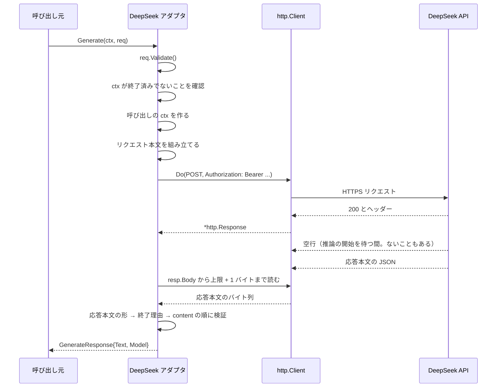
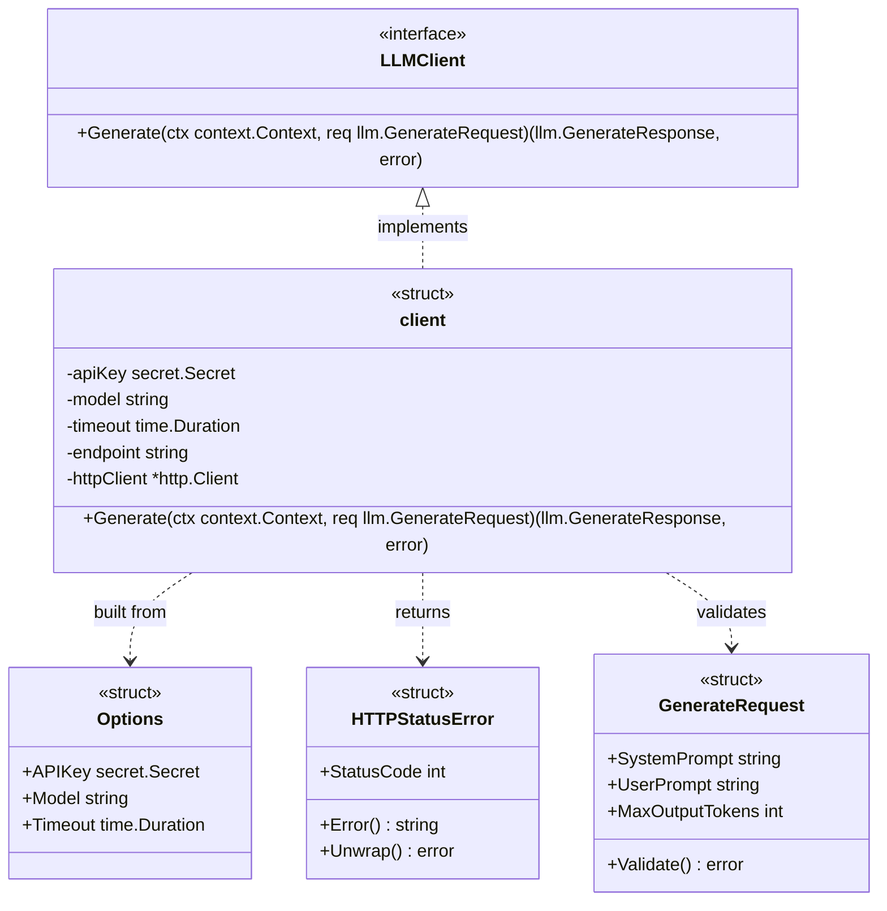
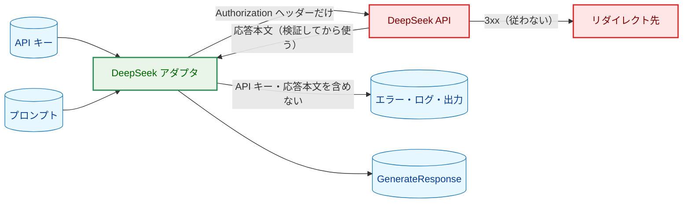
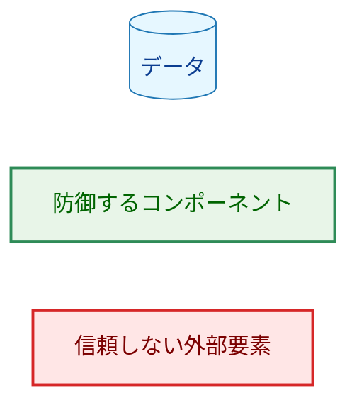
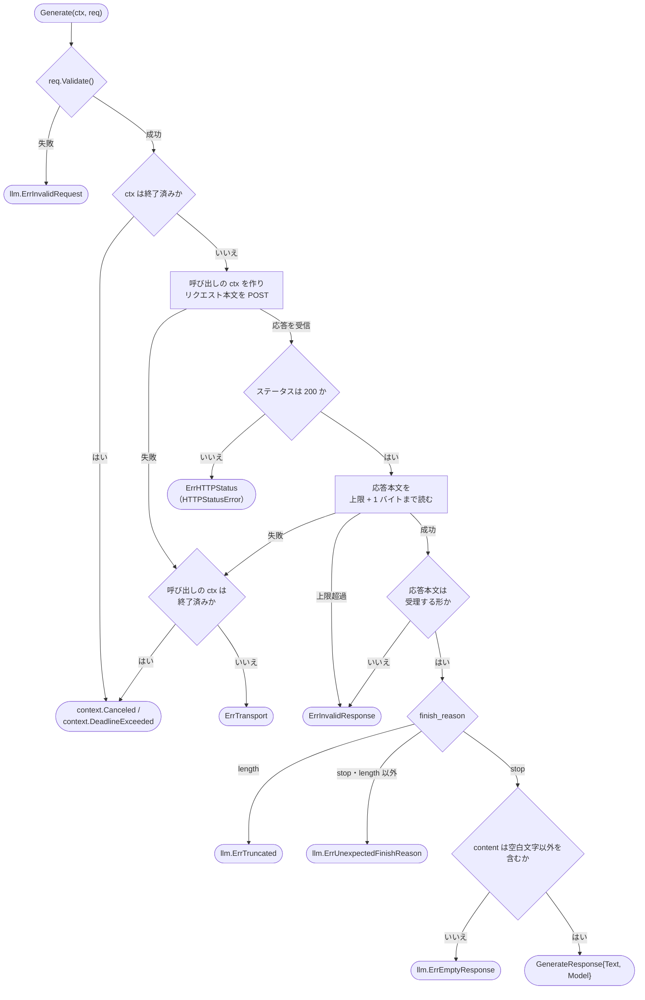

# アーキテクチャ設計書：DeepSeek アダプタ（LLMClient 実装）

## Document Status

| Item | Value |
|---|---|
| Status | `draft` |
| Created | 2026-10-02 |
| Review date | - |
| Reviewer | - |
| Comments | 事前調査（§1.4）は人間の承認を得て 2026-10-02 に実施し、結果を §1.4 に記録した。承認時に判断してほしい点: (1) 本設計は要件定義書に書かれていない次の 2 つを加えている。表示可能な ASCII 以外を含む API キーを構築時に拒否する（§3.1）。統合テストはオプトインの変数がなければスキップする（§7.2）。(2) 応答の `model` はエイリアス（`deepseek-flash`）のまま返り、要件定義書 §1 の「実際のモデルを追う」という目的は達成できない。`system_fingerprint` も記録するかどうかは要件の判断である（§1.4）。 |

## 1. 設計の全体像 (Design Overview)

### 1.1. 設計原則

1. **API の応答は信頼できない入力として境界で検証し、補正しない。** 要件定義書 3.2 の受理する形に合致しない応答本文は、正規化・切り詰め・置換をせず `ErrInvalidResponse` で拒否し、部分的な結果を返さない。標準ライブラリのデコーダが黙って補正する入力（不正な UTF-8、対になっていないサロゲートのエスケープ、後続データ、重複したメンバー、`null`、欠落）は、`0002_ytdlp_transcript_source` の json3・info.json パーサと同じ厳格な JSON の部品で検出する（§3.5）。
2. **厳格な JSON の部品は 1 か所に置いて共有し、検証済みであることを型で保証する。** その部品は現在 `internal/transcript` の中にある（`internal/transcript/json3.go:203-406`、HEAD `628b4ea` で確認）。これを新設の `internal/strictjson` へ移し、`internal/transcript` と `internal/llm/deepseek` の両方から使う。公開する API は、検証を通った文書から得た値だけを扱える不透明な型にする（§3.5、[design_handoff.md](design_handoff.md) の H-05。各項目への対応は §3.9）。
3. **API キーは型と 1 つのファイルで守る。** API キーは `secret.Secret` のまま保持し、`Reveal()` を呼ぶのは `request.go` のコードだけとする。呼ぶのは、構築時に API キーの形を検査する関数（`New` から呼ぶ。取り出した文字列は検査の後に捨てる）と、`Authorization` ヘッダーを設定する箇所の 2 つである。取り出した文字列を構造体のフィールドやエラーに保持しない（AC-20・AC-21、H-03）。
4. **アダプタは `New` を通してしか作れない。** `New` は非公開の型の値を `llm.LLMClient` として返す。パッケージの外からは未構築の値（ゼロ値）を作れないため、構築時の検証を通らない値で `Generate` が呼ばれることはない（CLAUDE.md「Enforce invariants with the type」）。
5. **送信先は利用者の設定から変えられない。** 送信先は非公開のフィールドに置き、`New` は常に本番の送信先を設定する。同じパッケージのテストだけが、非公開のヘルパーで送信先をループバックの `httptest` サーバーに差し替える（H-06）。
6. **アダプタが設定する期限は `context` の 1 本にする。** 構築時のタイムアウトを `context.WithTimeoutCause` で呼び出し元の `ctx` に重ね、HTTP リクエストの送信から応答本文の読み取りの終了までを 1 つの期限で覆う。`http.Client.Timeout` は使わない（AC-17、H-01）。`http.DefaultTransport` が内部に持つ接続確立・TLS ハンドシェイクの時間制限は残る（§3.3）。
7. **プロバイダに依存しない概念は `internal/llm` に置く。** 不正なリクエスト・打ち切り・想定外の終了理由・空の応答は、どのプロバイダでも起こる。これらの番兵とリクエストの検証は `internal/llm` に置く。HTTP・JSON の形に依存する失敗（HTTP ステータス・応答本文の形・通信の失敗）の番兵は `internal/llm/deepseek` に置く（H-09）。
8. **失敗はエラーメッセージだけで原因の見当がつくようにする。** アダプタはログを出さない。代わりに、どの手順で何が起きたかを、秘密情報と応答本文の値を含めずにメッセージへ書く（§4.2）。

### 1.2. 概念モデル



**図1 概念モデル**。実線の矢印 A → B は「A の結果を B が入力として使う」を表す。点線の矢印は「関数として利用する」を表す。呼び出し元は `ArticleWriter`（#5 で実装する）と統合テストである。`Generate` は、リクエストの検証 → リクエスト本文の組み立て → 送信 → 応答本文の読み取り → 応答の検証の順に進み、どこかで失敗したら以降へ進まずにエラーを返す（§6.1）。HTTP ステータスの判定は「応答本文の読み取り」に含めた（`200` 以外では応答本文を読まない。§3.4）。応答の検証は、要件 F-003 の順序（応答本文の形 → 終了理由 → `content`）で行う。



**凡例（図1 概念モデル）**。

以降の図では、色分け（`classDef`）を使う図にだけ凡例を付ける。シーケンス図（図3）・クラス図（図4）・フローチャートの図6は色分けを使わないため凡例を省略し、矢印の意味をキャプションに記す。

**用語。** 本書では次の用語を使い分ける。

- **リクエスト本文**: アダプタが送る HTTP リクエストのボディ（JSON）。
- **応答本文**: API から受け取る HTTP 応答のボディ（JSON）。
- **`content`（生成テキスト）**: 応答本文の `choices[0].message.content` の値。`GenerateResponse.Text` になる。
- **呼び出しの `ctx`**: `Generate` が呼び出し元の `ctx` に構築時のタイムアウトを重ねて作る `ctx`（§3.3）。
- **消費するメンバー**: アダプタが値を読み取り、検証や `GenerateResponse` の組み立てに使う応答本文のメンバー（要件定義書 3.2）。それ以外のメンバーは「消費しないメンバー」と呼ぶ。
- **番兵**: `errors.Is` で判別できる、あらかじめ定めたエラー値（番兵エラー。要件定義書 §1）。

### 1.3. 既存コードとの関係

執筆時点の HEAD `628b4ea` で次を確認した。

- `internal/llm/llm.go:9-26` は `GenerateRequest`（`SystemPrompt`・`UserPrompt`・`MaxOutputTokens`）、`GenerateResponse`（`Text`・`Model`）、`LLMClient` を定義し、番兵もメソッドも持たない。`internal/llm` は標準ライブラリの `context` だけを import するリーフである（`internal/llm/llm.go:5`）。本設計は番兵と `Validate` メソッドを追加するが、import するのは標準ライブラリだけであり、リーフのままである（`0001_pipeline_skeleton/02_architecture.md` §1.1 の原則 3）。
- `internal/secret/secret.go:22-45` の `Secret` は値をクロージャに閉じ込め、`fmt`・`log/slog`・`encoding/json` の出力を固定文字列にする。ゼロ値の `Reveal()` はエラーを返す（同 `:40-45`）。本設計はこれをそのまま使う。
- `internal/llm/testutil/mocks.go:30-33` の `FakeLLMClient` は設定した結果とエラーを返すだけで、`GenerateRequest` を検証しない。本設計は fake を変更しない。fake のテスト（`internal/llm/testutil/mocks_test.go`）の振る舞いは変わらない。
- 厳格な JSON の部品（`jsonMember`・`decodeJSONObject`・`collectMembers`・`newStrictDecoder`・`newRawDecoder`・`ensureNoTrailingJSON`・`decodeString`・`decodeInt64`・`validateJSONEncoding`・`validateSurrogates` と、その静的エラー）は `internal/transcript/json3.go:21-48,203-406` にあり、`json3.go` と `info.go` から使われている。`info.go:88-103` の `requiredString` は、必須の文字列メンバーの欠落・種類の不一致・空文字列を拒否する。`internal/transcript` のテスト（`json3_test.go`・`info_test.go`・`ytdlp_test.go`）はこれらの関数と静的エラーを直接参照せず、`parseSubtitles`・`parseInfo` と上限の定数を通じて検証し、失敗は `errors.Is`（`ErrParseSubtitles`・`ErrParseInfo`）と `errors.AsType[*ParseError]` だけで判定している（`json3_test.go:279-288`・`info_test.go:224-230`）。エラーの文言を比べるテストはない。

### 1.4. 事前調査（実 API）

要件定義書 §5 は、本書の承認を求める前に、実 API で調査を行い、結果を本節に記録し、秘密情報を除いた実応答を `testdata/` に保存することを求める。実 API を呼ぶため、人間の明示的な承認を得て（CLAUDE.md の Tool Execution Safety）、2026-10-02 16:37 JST に実施した。以下は、公開ドキュメントから分かったこと、調査の手順、観測結果である。

**公開ドキュメントから分かったこと（2026-10-02 に参照）。**

- [Create Chat Completion](https://api-docs.deepseek.com/api/create-chat-completion):
  - 非ストリーミングの応答本文のトップレベルは `id`・`object`・`created`・`model`・`system_fingerprint`・`choices`・`usage`。`choices[]` は `index`・`message`・`finish_reason`・`logprobs`。`message` は `role`・`content`・`reasoning_content`・`tool_calls`。
  - `content` と `reasoning_content` は **nullable** と記載されている。
  - `finish_reason` は `stop`・`length`・`content_filter`・`tool_calls`・`insufficient_system_resource`・`aborted`。
  - `max_tokens` の既定は thinking モードで 64K トークン。`reasoning_effort` が `max` のときは 128K トークンまで使える。`max_tokens` が推論過程のトークンを含むかどうかは書かれていない。
- [Error Codes](https://api-docs.deepseek.com/quick_start/error_codes): `400`（形式不正）・`401`（認証失敗）・`402`（残高不足）・`422`（パラメータ不正）・`429`（レート制限）・`500`・`503`（過負荷）。エラー応答の本文の形は書かれていない。
- [Rate Limit](https://api-docs.deepseek.com/quick_start/rate_limit): 非ストリーミングのリクエストでは、推論が始まるまでの待ち時間に**空行を送り続ける**。推論が 10 分以内に始まらなければ、サーバーが接続を閉じる。空行が送られる場合、HTTP ステータス（`200`）とヘッダーは推論の開始より前に確定していると考えられる。

**調査の手順。** リポジトリの外の一時ディレクトリで、`curl` を使って行った。

- `umask 077` の下で、`Authorization` ヘッダーを書いたファイルを作り、`curl -H @<file>` で渡した。API キーをコマンドラインに書かず、各リクエストの後でファイルを削除した。
- `curl` の `-v`・`--trace`・`--trace-ascii` は使わなかった（`Authorization` ヘッダーを出力するため）。
- 応答ヘッダーと応答本文を別々のファイルに、生のバイト列のまま保存した（`-D` と `-o`）。ステータスと HTTP のバージョンは `-w` で記録した。
- リクエスト本文は `model`（`deepseek-flash`）・`messages`・`stream: false` と、リクエストごとの `max_tokens` だけとし、`thinking` は送らなかった（本番と同じ）。プロンプトは固定の英文（system `You are a concise assistant.`、user `Explain in two sentences why the sky is blue.`）で、字幕・個人情報を含めない。

**観測結果。**

| # | リクエスト | ステータス | 観測 |
|---|---|---|---|
| 1 | `max_tokens` なし | `200` | `finish_reason` `stop`。`content` は 2 文の生成テキスト、`reasoning_content` は推論過程。`usage.completion_tokens` 85、うち `completion_tokens_details.reasoning_tokens` 30。応答本文 971 バイト |
| 2 | `max_tokens: 16` | `200` | `finish_reason` `length`、**`content` は空文字列 `""`（`null` ではない）**。`reasoning_content` は途中まで。`completion_tokens` 16、うち `reasoning_tokens` 16 |
| 3a | `max_tokens: 256` | `200` | `finish_reason` `stop`。`completion_tokens` 87、うち `reasoning_tokens` 37 |
| 3b | `max_tokens: 1024` | `200` | `finish_reason` `stop`。`completion_tokens` 135、うち `reasoning_tokens` 76 |
| 4 | 存在しないモデル名 | `400` | 応答本文は `{"error":{"message":…,"type":"invalid_request_error","param":null,"code":"invalid_request_error"}}`。`message` は受け付けるモデル名の一覧と `request_id` を含む |
| 5 | 不正な API キー | `401` | 応答本文は 4 と同じ形（`type` は `authentication_error`）。**`message` は送った API キーの末尾 4 文字を含む**（`****` に続けて末尾 4 文字） |

- **応答本文の形。** 1〜3 の応答本文のメンバーは、トップレベルが `id`・`object`・`created`・`model`・`choices`・`usage`・`system_fingerprint`、`choices[0]` が `index`・`message`・`logprobs`（`null`）・`finish_reason`、`message` が `role`・`content`・`reasoning_content` だった。`tool_calls` は現れなかった。`usage` は `prompt_tokens`・`completion_tokens`・`total_tokens`・`prompt_tokens_details`・`completion_tokens_details`・`prompt_cache_hit_tokens`・`prompt_cache_miss_tokens` を持つ。消費するメンバーはすべて期待する種類で、1 回ずつ現れた。
- **`max_tokens` は推論過程を含む。** 2 では `completion_tokens` と `reasoning_tokens` がともに 16 で、上限のすべてを推論過程が使い、`content` は空のまま打ち切られた。1・3a・3b でも `completion_tokens` は `reasoning_tokens` を含む値である。
- **`model` はエイリアスのまま返る。** 1〜3 の応答本文の `model` は、リクエストと同じ `deepseek-flash` だった。エイリアスが指す実際のモデル（project_overview.md によれば DeepSeek-V4.1-Flash）の名前は応答本文に現れない。`system_fingerprint` はバックエンドの構成を表す値として返る。
- **HTTP のバージョンと keep-alive。** すべて HTTP/2 だった。応答本文の先頭に空行はなかった（いずれも 2 秒以内に応答した）。混雑時の空行は観測できていない。
- **リクエスト ID。** 応答ヘッダー `x-ds-trace-id` があった。エラー応答では、本文の `message` にも `request_id` が入る。

**保存したフィクスチャ。** 1 と 2 の応答本文を、受け取ったバイト列のまま `testdata/deepseek_chat_completion_stop.json`・`testdata/deepseek_chat_completion_length.json` として保存した（AC-32）。保存前に、API キーとその末尾 4 文字が含まれないことを `grep` で確認した。`id` はリクエストの識別子で秘密情報ではないため、置き換えていない。出典は `testdata/README.md` に記した。生成テキストは固定のプロンプトに対するモデルの出力であり、第三者の著作物を含まない。3〜5 の応答と応答ヘッダーはコミットせず、一時ディレクトリごと削除した。

**調査で決まった事項。**

| 事項 | 結果 | 本設計への反映 |
|---|---|---|
| `max_tokens` が推論過程を含むか | 含む | 統合テストの「小さな `MaxOutputTokens`」は 16 で打ち切りを観測できたため、16 に確定する（§3.6）。#5 に申し送る（§9） |
| 打ち切り（`length`）時の `content` | 空文字列 | 要件どおりに `llm.ErrTruncated` になる。要件の変更は要らない |
| 消費しないメンバー | 上記の一覧 | AC-32 のフィクスチャは保存した実応答とする |
| 存在しないモデル名のステータス | `400` | §4.2 の案内文に反映する |
| `401` の応答本文 | API キーの末尾 4 文字を含む | `200` 以外の応答本文を読まない方針（§3.4・H-07）の根拠に加える |
| `model` の値 | エイリアスのまま | 要件の前提と異なる（下記） |

**要件の前提と異なる点（`model`）。** 要件定義書 §1 は「`deepseek-flash` は提供元が指す実際のモデルを入れ替えられるエイリアスであり、どのモデルで生成したかを追えるよう、応答に含まれるモデル名を返す」とする。観測では、応答の `model` はエイリアスのままで、実際のモデルを追う目的は応答の `model` だけでは達成できない。AC-09（`Model` は応答の `model` の値）は観測と矛盾せず、本設計はそのまま満たす。目的を達するために `system_fingerprint` も記録するかどうかは要件の変更にあたるため、本書では扱わず、人間の判断に委ねる。

**`stop` 以外の終了理由での `content`（残る確認事項）。** ドキュメントは `content` を nullable としている。`length` では空文字列を観測したが、`content_filter`・`insufficient_system_resource`・`aborted` は意図して起こせず、観測していない。これらの応答で `"content":null` が返ると、要件の検証順序（F-003。応答本文の形の検証が終了理由より先）と AC-27（`"content":null` は `ErrInvalidResponse`）により、その応答は `ErrUnexpectedFinishReason` ではなく `ErrInvalidResponse` になる。安全側には倒れる（記事は投稿されない）が、分類が変わる。本設計は要件どおりに実装し、`ErrInvalidResponse` のメッセージには読み取れた `finish_reason` を含めて、原因の見当がつくようにする（§4.2）。運用でこの場合を観測したら、要件定義書の F-003・AC-27 の改訂を検討する。

---

## 2. システム構成 (System Structure)

### 2.1. パッケージ構成



**図2 パッケージ依存構造**。実線の矢印 A → B は「A が B を利用（import・呼び出し・HTTP 送信）する」を表す。点線の矢印はテストのビルド（`-tags test`）またはテストの実行だけで生じる関係を表す。`internal/secret` の `Reveal()` を呼ぶのは `request.go` だけである（§3.7）。`deepseek.go` は `Options` と具体型のフィールドで `secret.Secret` 型を使うだけで、`Reveal()` を呼ばない。`internal/llm/deepseek` は `internal/llm`・`internal/secret`・`internal/strictjson` と標準ライブラリだけを import する。`internal/strictjson` は標準ライブラリだけを import するリーフであり、`internal/transcript` と `internal/llm/deepseek` のどちらにも依存しない。`internal/llm` は引き続きリーフである。テストファイルは `response_test.go` だけを代表として描いた。



**凡例（図2 パッケージ依存構造）**。

### 2.2. コンポーネント配置

- `internal/llm/deepseek` に DeepSeek アダプタを置く（[project_overview.md](../../dev/project_overview.md) の想定ディレクトリ構成）。DeepSeek 固有の形（`thinking` を送らないこと、`reasoning_content` を読まないこと、`finish_reason` の値の解釈）はこのパッケージに閉じ込める（要件 4.5）。
- `internal/strictjson` を新設し、厳格な JSON の部品を `internal/transcript` から移す（§3.5）。
- `internal/llm` に、プロバイダ共通の番兵と `GenerateRequest.Validate` を追加する（§3.2）。
- `cmd/yt2column`・`internal/pipeline`・`internal/writer` は変更しない。環境変数からの設定と、プロバイダの選択は #6 で行う（要件 2.3）。

### 2.3. データフロー（成功時）



**図3 データフロー（成功時）**。矢印 `->>` は呼び出しまたは送信、`-->>` は戻り値または受信を表す。呼び出しの `ctx` は送信から応答本文の読み取りの終了までを覆う（§3.3）。失敗時の分岐は §6.1 に示す。

---

## 3. コンポーネント設計 (Component Design)

### 3.1. `internal/llm/deepseek` の公開 API

```go
// internal/llm/deepseek

// Options configures the DeepSeek adapter. All fields are required.
type Options struct {
    APIKey  secret.Secret
    Model   string
    Timeout time.Duration
}

// New validates opts and returns an llm.LLMClient that sends to the
// production endpoint. It never reads environment variables. The concrete
// type is unexported, so a client can only be obtained through New.
func New(opts Options) (llm.LLMClient, error)
```

- **構築の検証（F-001・AC-01・AC-02）。** `New` は次のいずれかに当たる場合、nil とエラーを返す。
  - `APIKey` がゼロ値（`Reveal()` がエラー）。
  - `APIKey` の値に、表示可能な ASCII（`0x21`〜`0x7E`）以外の文字が含まれる。`.env` や `$(cat file)` から読んだ値に残りがちな末尾の改行・空白を、補正せずに拒否する。このような値のうち、改行などの制御文字を含むものは `net/http` が送信時にヘッダーの値として拒否し（通信の失敗に見える）、空白を含むものは `401` になる。どちらも原因が分かりにくいため、構築時に設定の誤りとして報告する。
  - `Model` が空文字列、前後に空白文字がある（`strings.TrimSpace` の結果が元と異なる）、または正しい UTF-8 でない。
  - `Timeout` が 0 以下。

  構築のエラーは、`internal/llm/deepseek` の非公開の静的エラーをラップして作る（`err113` に従う）。公開の番兵は定義しない。呼び出し元（#6）が種類で分岐する必要はなく、設定の誤りとしてメッセージを表示すれば足りるためである。メッセージには、どの項目が不正かだけを含め、`Model` の値も API キーも含めない。
- **非公開の型。** 具体型（以下、仮に `client`）は非公開で、API キー（`secret.Secret` のまま）・モデル名・タイムアウト・送信先 URL・`*http.Client` を持つ。`New` の外では作れないため、未構築の値を気にする必要がない。`llm.LLMClient` として出力した場合、`encoding/json` は公開フィールドがないため `{}` を出力する。`fmt` と `log/slog` の TextHandler はリフレクションで非公開のフィールドを表示するが、`Secret` は値をクロージャに閉じ込めているため関数のアドレスしか現れない（`internal/secret/secret.go:22-27`）。`Reveal()` で取り出した文字列はフィールドに保持しない（AC-21・H-03）。
- **並行呼び出し。** `client` のフィールドは `New` の後で変わらないため、`Generate` を複数のゴルーチンから同時に呼んでよい。
- **`*http.Client` の構成。** `New` は `CheckRedirect` が `http.ErrUseLastResponse` を返す `http.Client` を作る（AC-08・H-02）。`Timeout` フィールドは設定しない（§3.3）。`Transport` は既定（`http.DefaultTransport`）を使う。既定の Transport は proxy の環境変数に従い、`https` の送信先には HTTP/2 で接続しうる。
- **送信先（H-06）。** 送信先は定数 `https://api.deepseek.com/chat/completions` であり、`New` は常にこの値を非公開のフィールドに設定する。`Options` に送信先の項目を設けない。テストは、`internal/llm/deepseek` の `//go:build test` のファイル `test_helpers.go` にある**非公開の**関数で、`New` と同じ検証を通した値の送信先を差し替える。この関数はループバックアドレス（`127.0.0.1`・`::1`）以外の URL を拒否する。非公開であるため、`-tags test` のビルドでも他のパッケージ（#6 やパイプラインのテスト）からは呼べず、本番のビルドには含まれない。

### 3.2. `internal/llm` への追加

```go
// internal/llm

// Provider-independent sentinel errors. LLMClient implementations wrap these
// so that callers can identify a failure with errors.Is.
var (
    ErrInvalidRequest         = errors.New("invalid generate request")
    ErrTruncated              = errors.New("generation truncated by the output token limit")
    ErrUnexpectedFinishReason = errors.New("generation finished for an unexpected reason")
    ErrEmptyResponse          = errors.New("empty generation")
)

// GenerateRequest is the provider-common request.
// MaxOutputTokens == 0 leaves the output limit to the provider default;
// a negative value is invalid.
type GenerateRequest struct {
    SystemPrompt    string
    UserPrompt      string
    MaxOutputTokens int
}

// Validate reports whether the request can be sent: both prompts are
// non-empty valid UTF-8 and MaxOutputTokens is not negative. The returned
// error wraps ErrInvalidRequest.
func (r GenerateRequest) Validate() error
```

- **番兵の配置（H-09）。** 上の 4 つは、どのプロバイダでも同じ意味を持つ概念である。`ArticleWriter`（#5）や CLI（#6）は、プロバイダのパッケージを import せずに判別できる（例: 打ち切りなら `MaxOutputTokens` を増やすよう案内する）。`ErrHTTPStatus`・`ErrInvalidResponse`・`ErrTransport` は HTTP と JSON の形に依存し、将来の SDK ベースのプロバイダでは SDK のエラーから変換する別の形になるため、`internal/llm/deepseek` に置く（§4.1）。
- **`Validate` を `internal/llm` に置く理由。** `MaxOutputTokens` の 0 と負の値の意味は、要件 §5.1 がプロバイダ共通の意味として定め、`GenerateRequest` の doc コメントに書くことを求めている。その意味を検査するコードも同じ型に置けば、後続のプロバイダが同じ規則を使える。不正な UTF-8 を拒否する理由（JSON への変換で U+FFFD に置き換えられる）は、JSON で送る現行と将来のプロバイダに共通である。プロンプトの長さの上限は検査しない（モデルごとに異なり、超過は API が `400` 系で報告する。§4.2）。
- **`LLMClient` の doc コメント。** 既存の契約（空の応答や打ち切りを成功として返さない、`internal/llm/llm.go:21-23`）に加え、`Generate` が上の 4 つの番兵で報告することと、タイムアウト・キャンセルを `context.DeadlineExceeded`・`context.Canceled` で判別できることを書く（H-09）。fake（`FakeLLMClient`）はこの契約の対象外であり、設定したエラーをそのまま返す。

### 3.3. タイムアウト・キャンセル・通信の失敗

- **呼び出しの `ctx`。** `Generate` は、検証を通った後、呼び出し元の `ctx` に構築時のタイムアウトを `context.WithTimeoutCause` で重ねて、呼び出しの `ctx` を作る。cause には、アダプタのタイムアウトであることを示す非公開の静的エラーを渡す。HTTP リクエストは呼び出しの `ctx` で作り、応答本文の読み取りもその下で行う。ヘッダーが届いた後で応答本文の送信が止まった場合も、期限が来れば読み取りが中断される（AC-17・H-01）。
- `http.Client.Timeout` は設定しない。設定すると、打ち切りが `*url.Error`（`Timeout()` が真）として返り、`context.DeadlineExceeded` で判別できないことがある（H-01）。[security.md](../../dev/security.md) §3 と要件 4.2 の「タイムアウトを設定する」は、呼び出しの `ctx` の期限で満たす。
- **失敗の分類。** `Do` または応答本文の読み取りが失敗したら、先に呼び出しの `ctx` の `Err()` を確認する。非 nil ならそれ（`context.DeadlineExceeded` または `context.Canceled`）をラップして返す。nil の場合だけ、`ErrTransport` をラップして返す（AC-18・AC-19）。返り値の型や文言でタイムアウトを判別しない。
- **期限の出所。** `context.Cause` が上記の cause なら構築時のタイムアウト、そうでなければ呼び出し元の `ctx` の期限またはキャンセルである。メッセージにはどちらかを書き、構築時のタイムアウトの場合はその値を含める。どちらも `errors.Is(err, context.DeadlineExceeded)` は真である（ラップするのは `ctx.Err()` の値であるため）。
- **Transport の内部の時間制限。** `http.DefaultTransport` は接続確立（30 秒）と TLS ハンドシェイク（10 秒）に独自の時間制限を持つ。これらは呼び出しの `ctx` が終了していないときに発火するため、`ErrTransport` に分類される（要件 F-004 の「タイムアウトとキャンセル以外の通信の失敗」に当たる）。メッセージには下位のエラーの文言（`i/o timeout`・`TLS handshake timeout` など）が入る。
- **開始前の終了。** リクエストの検証を通った後、呼び出し元の `ctx` が既に終了していれば、HTTP リクエストを送らずに `ctx.Err()` をラップして返す（AC-18）。検証の失敗と `ctx` の終了が同時に当てはまる場合は、検証の失敗（`ErrInvalidRequest`）を返す。検証は純粋な処理であり、結果が `ctx` の状態に左右されないようにするためである。
- **応答本文の途中の切断。** HTTP/1.1 で `Content-Length` より前に接続が閉じられた場合、HTTP/2 でストリームがリセットされた場合のどちらも、応答本文の読み取りは `ctx` 以外のエラーで失敗するため `ErrTransport` になる。受け取った応答本文の一部は検証に使わない（AC-19）。
- **猶予時間（AC-17）。** 「構築時のタイムアウトが経過してから `Generate` が戻るまでの猶予」を **2 秒** に固定する。期限が来ると `net/http` は接続を閉じ、読み取りは直ちに失敗するため、実際の遅れはミリ秒単位である。2 秒は `-race` 付きの CI での揺らぎに対する余裕である。

### 3.4. 応答本文の読み取りと検証

検証は要件 F-003 の順序で行い、最初に失敗した手順の番兵を返す。どの拒否でも `GenerateResponse` のゼロ値を返す。

1. **HTTP ステータス。** `200` 以外なら、応答本文を読まずに閉じ、`*HTTPStatusError`（`ErrHTTPStatus` と判別できる。§4.1）を返す。応答本文を読まないため、「`200` 以外の応答本文も上限を超えて読まない」（要件 3.2）は自明に満たされ、不正な JSON が `ErrInvalidResponse` になることもない（AC-10・AC-15・H-07）。
2. **サイズ。** 応答本文を上限 + 1 バイトまで読み、上限を超えて読めたら `ErrInvalidResponse` とする。上限ちょうどの応答本文は受理する（AC-31・H-04）。上限は **8 MiB（8 × 1024 × 1024 バイト）** とする（§3.6）。
3. **応答本文の形。** `strictjson.ParseObject` で、次の 3 点を応答本文全体に対して検査する。正しい UTF-8 であること。対になっていないサロゲートのエスケープがないこと（消費しないメンバーも含む）。トップレベルがちょうど 1 つの JSON オブジェクトで、後続データがないこと。続いて、要件 3.2 の消費するメンバー（トップレベルの `model`・`choices`、`choices[0]` の `finish_reason`・`message`、`message` の `content`）を取り出す。取り出すときは、各オブジェクトの中で重複・欠落・`null`・種類の不一致がないことを確かめる。`choices` はちょうど 1 要素の配列で、その要素は JSON オブジェクトでなければならない。`model` は空でない文字列でなければならない。消費しないメンバーは、値の種類や重複を問わず無視する（拡張可能。AC-32）。以上の検査のどれかに反したら `ErrInvalidResponse` とする（AC-26〜AC-30）。メッセージに終了理由を含められるよう（§4.2）、`choices[0]` では `finish_reason` を `message`・`content` より先に取り出す。ただし、番兵の判定順序（F-003）は、この取り出しの順序に影響されない。
4. **終了理由。** `finish_reason` が `length` なら `llm.ErrTruncated`、`stop` でも `length` でもなければ `llm.ErrUnexpectedFinishReason` とする（AC-11・AC-12）。
5. **`content`。** `content` が空文字列、または `strings.TrimSpace` で空になる（空白文字だけの）場合は `llm.ErrEmptyResponse` とする（AC-13・AC-14）。`strings.TrimSpace` は Unicode の空白（全角空白 U+3000 を含む）を空白として扱う。
6. **組み立て。** `Text` に `content` を加工せずに入れ、`Model` に応答本文の `model` を入れる（AC-09）。`reasoning_content` は消費しないため、`Text` に混ざらない（AC-14）。

**keep-alive の空行。** 推論の開始を待つ間に API が送る空行（§1.4）は、JSON のトップレベルの値の前の空白（改行・復帰）であり、`encoding/json` のトークナイザは読み飛ばす。したがって追加の処理なしに受理される。この受理は実装の偶然に頼らず、§7.1 のテストで固定する。空行もサイズの上限に数えるが、待ち時間は最大 10 分であり、上限に比べて無視できる。

**`200` が確定した後の失敗。** 空行を送る API では、ステータスは推論の開始前に `200` で確定する（§1.4 で確認する）。その後に待ち時間の上限や過負荷でサーバーが処理をやめた場合、`429`・`503` としては届かず、次のいずれかとして届く。

| 届き方 | 番兵 | メッセージで示すこと（§4.2） |
|---|---|---|
| 空白だけを送って正常に閉じる | `ErrInvalidResponse` | 応答本文が空白だけだったこととそのバイト数 |
| 応答本文の途中で接続を切る | `ErrTransport` | 下位のエラーの文言 |
| 応答の形でない JSON（例: トップレベルに `error` を持つ）を送る | `ErrInvalidResponse` | 欠けていた消費するメンバーと、トップレベルに `error` メンバーがあったこと（値は含めない） |

いずれも安全側に倒れる（記事は投稿されない）。

**応答ヘッダー。** `Content-Type` など、ステータス以外の応答ヘッダーは検証しない（要件 3.2）。

### 3.5. `internal/strictjson`（厳格な JSON の部品）

`internal/transcript/json3.go` の部品と `info.go` の `requiredString` を移し、検証を通った文書から得た値だけを扱える不透明な型として公開する。

```go
// internal/strictjson

// Object is a JSON object taken from a document that passed ParseObject's
// checks. Its members keep document order. The zero value has no members.
type Object struct { /* unexported fields */ }

// Value is one JSON value inside a document that passed ParseObject's
// checks. It can only be obtained from an Object or another Value.
type Value struct { /* unexported fields */ }

// ParseObject rejects invalid UTF-8 and unpaired surrogate escapes anywhere in
// data, then decodes exactly one top-level JSON object with no trailing data.
func ParseObject(data []byte) (Object, error)

// Collect returns the consumed members by key, rejecting a consumed key that
// appears more than once. Members whose keys are not listed are ignored,
// duplicates among them included.
func (o Object) Collect(keys ...string) (map[string]Value, error)

// Has reports whether a member with the key exists. It is meant for
// diagnostics only and never rejects.
func (o Object) Has(key string) bool

// Required returns the named member, rejecting a missing one.
func Required(members map[string]Value, key string) (Value, error)

// RequiredString returns the named member as a non-empty string, rejecting a
// missing member, null, another kind, or the empty string.
func RequiredString(members map[string]Value, key string) (string, error)

func (v Value) AsString() (string, error)   // rejects null and other kinds
func (v Value) AsInt64() (int64, error)     // rejects non-numbers and out-of-range numbers
func (v Value) AsObject() (Object, error)   // rejects null and other kinds
func (v Value) AsArray() ([]Value, error)   // rejects null and other kinds
```

- **型による保証。** `Object` と `Value` はフィールドが非公開で、中身を持つ値は `ParseObject` からしか得られない。したがって、検証を経ていないバイト列を `AsString` などに渡して U+FFFD への置き換えを受ける経路は、パッケージの外からは作れない。ゼロ値の `Value` は中身を持たず、`As...` はエラーを返す（補正しない）。デコーダの構築や `json.RawMessage` を受け取る関数は公開しない。
- **静的エラー。** 部品の静的エラー（`errInvalidEncoding`・`errUnpairedSurrogate`・`errTrailingJSON`・`errNotJSONObject`・`errNonStringKey`・`errDuplicateMember`・`errValueNotString`・`errValueNotNumber`、`info.go` の `errMissingField`・`errEmptyField`）は `internal/strictjson` に移し、非公開のままにする。どの呼び出し元も個別に判別せず、それぞれの番兵（`ErrParseSubtitles`・`ErrParseInfo`・`ErrInvalidResponse`）にラップするためである。json3 固有のエラー（`errMissingEvents`・`errEventsNotArray`・`errTooManyEvents` など）、`errMissingID`・`errIDMismatch`、`errInputTooLarge` とサイズ・件数の上限は `internal/transcript` に残す。
- **`internal/transcript` の書き換え。** `json3.go` と `info.go` は上の API で書き換える。`events`・`segs` の読み取りは `AsArray` と `AsObject` を使う。件数の上限（`maxSubtitleEvents`）は `AsArray` で要素に分けた後に判定する。このため、件数が上限を超え、かつ上限内の要素にも不正がある入力では、エラーメッセージに現れる失敗理由が変わりうる。返る番兵（`ErrParseSubtitles`）と `*ParseError` は変わらず、既存テストは番兵と `*ParseError` だけで判定している（§1.3）。サイズの上限（8 MiB）は配列の分割の前に判定するが、分割で作る要素ごとの値に付く管理用の領域のため、小さな要素が大量に並ぶ入力では、使うメモリが入力の大きさを大きく上回りうる。実装時に 8 MiB の最悪の入力で測定し、問題になる場合にだけ件数の上限付きの分割を追加する（CLAUDE.md の Performance）。
- **独立したコミット。** この移動は `internal/transcript` の振る舞い（返る番兵とその条件）を変えないリファクタリングであり、DeepSeek アダプタとは別のコミットにする。`internal/transcript` の既存テスト（`json3_test.go`・`info_test.go`・`ytdlp_test.go`）は変更せずに通ることを、振る舞いが保たれた証拠とする。

**`0002_ytdlp_transcript_source` の方針との関係。** `0002_ytdlp_transcript_source/02_architecture.md` §2.2 は、パーサとその部品を `internal/transcript` の中に置き、パッケージを分けないと決めた。理由は、機能が字幕取得の段階に閉じており、分けると公開範囲が不必要に広がるため（YAGNI）であった。本設計はこの方針の例外として部品を `internal/strictjson` に移す。理由は、2 つ目の利用者（DeepSeek アダプタ）が生じ、機能が 1 つの段階に閉じなくなったためである。`internal/llm/deepseek` から `internal/transcript` を import すると LLM の段階が字幕取得の段階に依存し、部品を複製するとサロゲートの走査（`internal/transcript/json3.go:331-380`）のような細かいコードが 2 か所に分かれる（CLAUDE.md の DRY）。公開範囲の拡大は、上記の不透明な型によって「検証済みの値だけを扱う」という不変条件を保ったまま行う。部品の置き場所を検査する既存テストはなく、更新が要る既存テストはない。

### 3.6. 固定する具体値

| 項目 | 値 | 根拠 |
|---|---|---|
| 送信先 | `https://api.deepseek.com/chat/completions` | 要件 F-001 |
| 応答本文の上限 | 8 MiB | 下記 |
| AC-17 の猶予時間 | 2 秒 | §3.3 |
| リクエスト本文に含めるメンバー | `model`・`messages`・`stream`（常に `false`）・`max_tokens`（正の値のときだけ） | 要件 F-002・§3.7 |
| 統合テストのモデル名の既定値 | `deepseek-flash`（`make test-integration-deepseek` が与える） | 要件 F-006 |
| 統合テストの 1 回の `Generate` のタイムアウト | 5 分 | 短い固定のプロンプトの生成には十分である |
| 統合テストの `-timeout` | 15 分 | 2 回の `Generate`（各 5 分）の合計に余裕を足し、テストのバイナリの時間切れより先に `Generate` の期限が来るようにする |
| 統合テストの「小さな `MaxOutputTokens`」 | 16 | §1.4 の調査で、16 で `length` と空の `content` を観測した |

**応答本文の上限を 8 MiB とした根拠。** 想定する記事（40 分前後の動画のコラム）は数千〜1 万字程度で、UTF-8 で 30 KB 前後である。応答本文で大きいのは `reasoning_content` である。ドキュメントによれば、thinking モードの `max_tokens` の既定は 64K トークンで、最大 128K トークンまで使える（§1.4）。日本語 1 トークンを 1.5 文字、1 文字を `\uXXXX` のエスケープ（6 バイト）で送られると仮定すると、128K トークンで約 1.2 MB になる。8 MiB はこれに対して 6 倍以上の余裕があり、字幕のパーサの上限（`internal/transcript/json3.go:16`・`info.go:10`、いずれも 8 MiB）とも揃う。メモリの使用量は、1 回の `Generate` につき応答本文の 8 MiB と、解析で保持する部分のコピーが上限である。CLI は 1 回の実行で 1 回しか呼ばない。長時間動くサーバーから同時に呼ぶ場合は、同時実行数に比例して増える（§9）。

### 3.7. リクエスト本文とヘッダー

- リクエスト本文は、非公開の構造体を `json.Marshal` して作る。プロンプトを文字列連結で JSON に埋め込まない（H-10）。
- `max_tokens` は `MaxOutputTokens` が正の値のときだけ含め、0 のときは含めない（AC-05）。負の値は `Validate` が先に拒否している。
- `stream` は常に `false` として含める（「非ストリーミングの指定を含む」、AC-04）。
- `thinking`・`temperature`・`n` などのメンバーを表すフィールドは構造体に持たない。したがって送られない（AC-06）。
- `json.Marshal` は `<`・`>`・`&` を `<` などにエスケープする。JSON として等価なので API の解釈は変わらない。AC-04 のテストは、受け取ったリクエスト本文をデコードした文字列が元のプロンプトと一致することで確認する（H-10）。
- 不正な UTF-8 は `json.Marshal` の前に `Validate` が拒否しているため、`json.Marshal` による U+FFFD への置き換えは起こらない。モデル名は構築時に検査済みである（H-10）。
- ヘッダーは `Content-Type: application/json` と `Authorization: Bearer <API キー>` の 2 つを設定する。
- `Reveal()` を呼ぶのは `request.go` のコードだけである（H-03）。呼び出し箇所は、構築時に API キーの形（ゼロ値でないこと、表示可能な ASCII だけであること。§3.1）を検査する関数と、`Authorization` ヘッダーを設定する箇所の 2 つである。前者は `New` から呼ばれ、取り出した文字列を検査の後に捨てる。後者は取り出した文字列をヘッダーの値にだけ使う。後者の `Reveal()` は `New` が検査した `Secret` に対してしか呼ばれないため、エラーを返すことはない。それでもエラーを無視せず、HTTP リクエストを送らずにエラーを返す（到達しない防御的な分岐であり、テストで起こす手段はない）。

### 3.8. コンポーネント責務表

| ファイル | 責務 | 状態 |
|---|---|---|
| `internal/llm/llm.go` | 番兵 4 つ、`GenerateRequest.Validate`、`GenerateRequest`・`LLMClient` の doc コメントの更新（要件 §5.1・H-09） | 変更 |
| `internal/llm/llm_test.go` | `Validate` のテスト（AC-07 の検証規則） | 新設 |
| `internal/llm/deepseek/deepseek.go` | `Options`・`New`・非公開の具体型・`Generate`、送信先と上限の定数、呼び出しの `ctx`、失敗の分類（F-001・F-002・F-004） | 新設 |
| `internal/llm/deepseek/request.go` | リクエスト本文の構造体と組み立て、ヘッダーの設定、構築時の API キーの形の検査（`Reveal()` を呼ぶのはこのファイルだけ。F-001・F-002） | 新設 |
| `internal/llm/deepseek/response.go` | 応答本文の読み取り（上限）と検証、`GenerateResponse` の組み立て（F-003・3.2） | 新設 |
| `internal/llm/deepseek/errors.go` | `ErrHTTPStatus`・`ErrInvalidResponse`・`ErrTransport`・`HTTPStatusError`、非公開の静的エラー（§4.1） | 新設 |
| `internal/llm/deepseek/test_helpers.go` | `//go:build test`。ループバックの送信先に差し替えた値を作る非公開のヘルパー（H-06） | 新設 |
| `internal/llm/deepseek/deepseek_test.go` | 構築・リクエスト・リダイレクト・ステータス・タイムアウト・キャンセル・通信の失敗・秘密情報のテスト（AC-01〜AC-08・AC-10・AC-16〜AC-21・AC-25） | 新設 |
| `internal/llm/deepseek/response_test.go` | 応答の検証のテスト（AC-09・AC-11〜AC-15・AC-26〜AC-32） | 新設 |
| `internal/llm/deepseek/integration_test.go` | `//go:build integration`。実 API を使う統合テスト（F-006・AC-23・AC-24） | 新設 |
| `internal/strictjson/strictjson.go` | 厳格な JSON の部品（§3.5） | 新設 |
| `internal/strictjson/strictjson_test.go` | 部品のテスト（§7.1） | 新設 |
| `internal/transcript/json3.go` | 部品と共通の静的エラーを削除し、`internal/strictjson` を使う。返る番兵とその条件は変えない | 変更 |
| `internal/transcript/info.go` | `requiredString` と共通の静的エラーを削除し、`internal/strictjson` を使う。返る番兵とその条件は変えない | 変更 |
| `testdata/deepseek_chat_completion_stop.json`・`testdata/deepseek_chat_completion_length.json` | 事前調査で保存した実応答（§1.4・AC-32） | 新設 |
| `testdata/README.md` | 上記フィクスチャの出典（取得日・プロンプト・モデル名） | 変更 |
| `Makefile` | `test-integration-deepseek` ターゲットの追加（§7.2） | 変更 |
| `docs/dev/developer_guide/package_reference.md` | `internal/llm/deepseek`・`internal/strictjson` の追加、`internal/llm`・`internal/transcript` の責務の更新 | 変更 |
| `docs/dev/project_overview.md` | 想定ディレクトリ構成に `internal/strictjson/` を追加 | 変更 |
| `CLAUDE.md` | Architecture Overview のパッケージの説明に `internal/strictjson` を追加 | 変更 |
| `docs/dev/security.md` | §2 に、`GODEBUG=http2debug=2` で `Authorization` ヘッダーが標準エラー出力に出ることの注意を追加（§5.4） | 変更 |

**既存テストへの影響。** 本設計が振る舞いを変える既存テストはない。`internal/transcript` の `json3_test.go`・`info_test.go`・`ytdlp_test.go` は部品の移動の後も変更せずに通らなければならない（§3.5）。`internal/llm/testutil/mocks_test.go` は fake を変えないため影響を受けない。`.golangci.yml`・`.pre-commit-config.yaml`・`.github/workflows/ci.yml` は変更しない。lint は既にビルドタグ `test,integration` で解析し（`Makefile` の `GOLINT`、`.pre-commit-config.yaml:23`）、`go vet -tags integration ./...` も実行しているため、新しい統合テストも解析対象になる（コンパイルされるだけで、実行はされない）。`internal/strictjson` は標準ライブラリだけを使うため、`depguard` の `deps` ルールも変えない。

### 3.9. design_handoff の各項目への対応

| ID | 本設計の対応 |
|---|---|
| H-01 | 構築時のタイムアウトを `context.WithTimeoutCause` で呼び出し元の `ctx` に重ね、送信と応答本文の読み取りを同じ `ctx` で行う。`http.Client.Timeout` は併用しない。失敗時は先に `ctx.Err()` を確認する（§3.3）。 |
| H-02 | `CheckRedirect` で `http.ErrUseLastResponse` を返し、3xx をそのまま受けて `ErrHTTPStatus` にする（§3.1・§3.4）。 |
| H-03 | エラー型は `*http.Request`・`http.Header` を保持しない（`HTTPStatusError` はステータスコードと案内に使う値だけ）。`Reveal()` を呼ぶのは `request.go` のコード（構築時の検査とヘッダーの設定）だけである。送信先 URL はクエリもユーザー情報も持たない定数である。`ErrTransport` に添える下位のエラーの文言（`*url.Error` はメソッドと送信先 URL を含む）にも API キーは現れない。AC-20 のテストで 4 つの書式を確認する（§4.2・§7.3）。 |
| H-04 | 上限 + 1 バイトまで読み、超過を検出する。上限は 8 MiB（§3.4・§3.6）。`200` 以外の応答本文は読まずに閉じるため、その接続は再利用されない。CLI は 1 回の実行で 1 回しか呼ばないため、問題にならない（§9）。 |
| H-05 | 列挙された 7 種の入力（不正な UTF-8・対になっていないサロゲート・後続データ・重複・`null`・欠落・配列要素の `null`）を、`internal/transcript` から移した `internal/strictjson` の部品で検出する（§3.4・§3.5）。依存の向きを守るため、共通化は新設の共通パッケージへの移動で行う。 |
| H-06 | 候補 1（非公開のフィールド）を採る。送信先は `New` が常に本番の値に設定し、テストは同じパッケージの非公開のヘルパーだけが、ループバックの URL に限って差し替える（§3.1）。候補 2（`RoundTripper` で送信先を書き換える）は採らない。`http.Client` を差し替え可能にすると、#6 のコードからも差し替え口が見え、API キーを任意のホストへ送れる構成を作れてしまうためである。 |
| H-07 | `200` 以外では応答本文を読まない。エラーにはステータスコードと、ステータスごとの固定の案内を含める（§3.4・§4.2）。§1.4 の調査で、`401` の応答本文が送った API キーの末尾 4 文字を含むことを確認しており、応答本文をエラーに含めない理由はそれだけでも十分である。 |
| H-08 | 事前調査（§1.4）で、`max_tokens` が推論過程のトークンを含むことを確認した。#5 へ申し送る（§9）。AC-24 の値は 16 とする（§3.6）。 |
| H-09 | プロバイダ共通の 4 つを `internal/llm` に、HTTP と JSON に依存する 3 つを `internal/llm/deepseek` に置く。`LLMClient` の doc コメントに `internal/llm` の番兵で報告することを書く（§3.2・§4.1）。 |
| H-10 | 構造体の `json.Marshal`、`max_tokens` の省略、`Validate` による UTF-8 の事前検査、デコードした文字列での比較（§3.7）。 |

---

## 4. エラーハンドリング設計 (Error Handling Design)

### 4.1. エラー型

```go
// internal/llm/deepseek

// Sentinel errors for failures that depend on the HTTP and JSON shape of the
// DeepSeek API. Generate wraps them with context.
var (
    ErrHTTPStatus      = errors.New("unexpected HTTP status")
    ErrInvalidResponse = errors.New("invalid response body")
    ErrTransport       = errors.New("transport failure")
)

// HTTPStatusError reports a non-200 response. It never holds the response
// body, the request, or its headers.
type HTTPStatusError struct {
    StatusCode int
}

func (e *HTTPStatusError) Error() string
// Unwrap returns ErrHTTPStatus.
func (e *HTTPStatusError) Unwrap() error
```



**図4 主要な型と interface**。`<|..` は「左の interface を右の型が実装する」関係を表す。`..>` は「左の型が右の型を使う」関係で、ラベルがその使い方（`built from`: `New` が右の型の値から左の型を構築する、`returns`: 左が右の型のエラーを返す、`validates`: 左が右の型の値を検証する）を表す。`LLMClient`・`GenerateRequest` は `internal/llm`、それ以外は `internal/llm/deepseek` の型である。`client` とその非公開フィールドの名前は説明のための仮称であり、実装で変えてよい。

**番兵の一覧と判別の方法。** `Generate` は番兵そのものを返さず、文脈を付けてラップする（§4.2）。

| 失敗 | 判別の方法 | 定義するパッケージ | 主な AC |
|---|---|---|---|
| 不正なリクエスト | `errors.Is(err, llm.ErrInvalidRequest)` | `internal/llm` | AC-07 |
| `200` 以外のステータス | `errors.Is(err, deepseek.ErrHTTPStatus)`、`errors.AsType[*deepseek.HTTPStatusError](err)` でステータスコード | `internal/llm/deepseek` | AC-08・AC-10・AC-15 |
| 応答本文の形・サイズ | `errors.Is(err, deepseek.ErrInvalidResponse)` | `internal/llm/deepseek` | AC-26〜AC-31 |
| 打ち切り（`length`） | `errors.Is(err, llm.ErrTruncated)` | `internal/llm` | AC-11 |
| `stop`・`length` 以外の終了理由 | `errors.Is(err, llm.ErrUnexpectedFinishReason)` | `internal/llm` | AC-12 |
| 空の `content` | `errors.Is(err, llm.ErrEmptyResponse)` | `internal/llm` | AC-13・AC-14 |
| タイムアウト | `errors.Is(err, context.DeadlineExceeded)` | 標準ライブラリ | AC-17 |
| キャンセル | `errors.Is(err, context.Canceled)` | 標準ライブラリ | AC-18 |
| その他の通信の失敗 | `errors.Is(err, deepseek.ErrTransport)` | `internal/llm/deepseek` | AC-19 |

返すエラーは、7 つの番兵と 2 つの `context` のエラーのうち、ちょうど 1 つにだけ該当させる（AC-16）。そのため、`ErrTransport` にラップするときは、下位のエラーを `%w` でつながず、文言だけを添える。`%w` でつなぐと、下位のエラーの連鎖に `context` のエラーが含まれていた場合に、`ErrTransport` と `context.DeadlineExceeded` の両方に該当しうるためである。`context` のエラーを返す場合も、`ErrTransport` にはラップしない。

構築（`New`）のエラーには公開の番兵を定義しない（§3.1）。

### 4.2. エラーメッセージ設計パターン

- **接頭辞。** `New` と `Generate` が返すすべてのエラーのメッセージは、ラップの段階で `deepseek: ` を 1 回だけ先頭に付ける。番兵（`internal/llm` と `internal/llm/deepseek` の両方）の文言には接頭辞を含めない。
- **含めるもの。** 失敗した手順と理由。
  - `HTTPStatusError`: ステータスコードと、ステータスごとの固定の案内。`401` は API キー、`402` は残高、`429` はレート制限、`500`・`503` はサーバー側の問題、`400`・`422` はリクエストのパラメータ（モデル名・`max_tokens`・プロンプトの長さ）を確認するよう案内する。`Generate` がラップするときに、モデル名（`%q`）と送った `max_tokens`（送らなかった場合はその旨）を添える。いずれも利用者の設定であり、秘密情報ではない。§1.4 の調査で、存在しないモデル名は `400` になることを確認した。
  - `ErrInvalidResponse`: どの検査に失敗したか（例: 「上限を超えた」「`choices` が 1 要素でない」「消費するメンバー `model` が重複」）。応答本文が空白だけだった場合は、そのことと応答本文のバイト数。消費するメンバーが欠けていた場合に、トップレベルに `error` メンバーがあれば、その存在（値は含めない）。`finish_reason` を読み取れた後で検査に失敗した場合は、その値（下記の制限付き）。
  - `ErrUnexpectedFinishReason`: 受け取った `finish_reason` の値。
  - タイムアウト: 構築時のタイムアウトによるもの（その値を含める）か、呼び出し元の期限・キャンセルによるものか（§3.3）。
  - `ErrTransport`: 下位のエラーの文言（`*url.Error` の文言はメソッド・送信先 URL・下位の原因を含む）。
- **応答本文から得た値の表示。** `finish_reason` の値は信頼できない入力である。`%q` で制御文字をエスケープし、先頭 64 バイトまでに制限して含める。端末を汚さないためである。
- **含めないもの。** API キー、リクエストのヘッダー、プロンプト、応答本文、`content`・`reasoning_content` の値。`200` 以外の応答本文は読まないため、そもそも手元にない（AC-10）。
- **`ErrInvalidResponse` の下位の文言。** `internal/strictjson` の静的エラーの文言と、`encoding/json` の構文エラーの文言（例: `invalid character 'x' after top-level value`。入力の 1 文字を `%q` 形式で含む）を添える。重複の文言に入るメンバー名は、消費するメンバーの名前（コード中の定数）だけである。
- アダプタはログを出さない。失敗の説明は、呼び出し元（#6）がエラーを表示することで行う。上の情報により、利用者は API キー（`401`）・残高（`402`）・レート制限（`429`）・設定の誤り（`400`・`422`）・打ち切り（`MaxOutputTokens`）・タイムアウト（設定値）・サーバーが処理をやめた場合（§3.4 の表）をメッセージから区別できる。

### 4.3. サイドエフェクト契約

本タスクにサイドエフェクトを切り替えるオプション（`--dry-run` など）はない。`Generate` の外部への影響は、DeepSeek の API への `POST` である。アダプタはリトライせず、1 回の呼び出しで `Do` を最大 1 回だけ呼ぶ（要件 F-002）。ただし、HTTP/2 の接続でサーバーが `GOAWAY` などでリクエストを処理しなかったことを示した場合、`net/http` の Transport が同じリクエストを内部で送り直すことがある。これはサーバーが処理していないことが分かっている場合に限られ、アダプタの外の振る舞いである。次の場合は HTTP リクエストを 1 回も送らない。

- `Validate` が失敗した（AC-07）。
- 呼び出し元の `ctx` が既に終了している（AC-18）。

`New` はネットワークを使わず、環境変数もファイルも読まない。リダイレクトの応答を受けても、別の送信先へは送らない（AC-08）。

---

## 5. セキュリティ考慮事項 (Security Considerations)

本機能は、`.claude/commands/_context.md` の条件付きガイドのトリガーのうち、API キーの取り扱い、ネットワーク送信（LLM API）、信頼できないテキスト（LLM の応答）に該当する。[security.md](../../dev/security.md) §2・§3・§4・§6 に従う。

### 5.1. 脅威モデル



**図5 脅威モデル**。実線の矢印 A → B は「A から B へデータが渡る、または渡りうる」を表し、ラベルはその経路に課す制約である。API キーは `secret.Secret`、プロンプトは呼び出し元が与える。`REDIR` への矢印は、API が 3xx で別の送信先を示しうることを表す。アダプタはそれに従わないため、`REDIR` へは何も送らない。API の応答は信頼しない。



**凡例（図5 脅威モデル）**。

| 脅威 | 対策 | 検証 |
|---|---|---|
| API キーがエラー・ログ・出力に漏れる | `Secret` のまま保持し、`Reveal()` を呼ぶのは `request.go` のコードだけにする。エラー型はリクエスト・ヘッダーを保持しない（§3.1・§4.1） | AC-20・AC-21 |
| API キーが別のホストへ送られる | 送信先は定数で、利用者の設定から変えられない。テスト用の差し替えは非公開でループバックに限る。リダイレクトに従わない（§3.1） | AC-08 |
| 応答が巨大でメモリを使い尽くす | 8 MiB の上限。`DefaultTransport` の透過的な gzip 展開の後のバイト数に適用されるため、高圧縮ファイル爆弾（小さな圧縮データが巨大に展開される攻撃）への対策にもなる（§3.4） | AC-31 |
| 応答の形が不正・曖昧（重複・`null`・置換文字） | `internal/strictjson` による厳格な検証（§3.4・§3.5） | AC-26〜AC-30 |
| 打ち切り・空の応答が記事として投稿される | 終了理由と `content` の検証（§3.4） | AC-11〜AC-14 |
| 推論過程が記事に混ざる | `reasoning_content` を消費しない（§3.4） | AC-14 |
| `200` 以外の応答本文が端末に出力される | 応答本文を読まない（§3.4） | AC-10 |
| 応答を待ち続けて戻らない | 呼び出しの `ctx` の期限（§3.3） | AC-17 |
| 料金のかかる統合テストが意図せず実行される | ビルドタグと、`make` のターゲットだけが設定するオプトインの変数（§7.2） | AC-22・AC-23 |

### 5.2. 秘密情報

- API キーは `Options.APIKey`（`secret.Secret`）で受け取り、非公開のフィールドに `Secret` のまま保持する。`Reveal()` の戻り値は、構築時の検査とヘッダーの設定の中でだけ使い、フィールドやエラーに残さない（H-03・§3.7）。
- 統合テストは API キーを環境変数 `DEEPSEEK_API_KEY` から読み、`secret.New` で包んでから `New` に渡す。テストの出力（`t.Log`・失敗メッセージ）に API キーを含めない（要件 F-006）。

### 5.3. ネットワーク・送るデータ

- 送るのは、呼び出し元が与えたプロンプトとモデル名、および `stream`・`max_tokens` だけである（要件 4.2）。アダプタはプロンプトに情報を加えない。プロンプトに何を入れるかは #5 の責務であり、[security.md](../../dev/security.md) §4（API キー・ローカルのパス・個人情報を入れない）は #5 が守る。
- `http.DefaultClient` は使わない（§3.1）。

### 5.4. 信頼できない応答と残余リスク

- `GenerateResponse.Text` と `Model` は信頼できない文字列のまま呼び出し元へ渡る。アダプタは形だけを検証し、内容（プロンプトインジェクションの結果、制御文字、Markdown の構造）は検証しない。記事への埋め込みと投稿時の扱いは #5・#7 が担う（[security.md](../../dev/security.md) §6）。`Model` は空でない文字列であることだけを確かめる（§9 で申し送る）。
- **`GODEBUG=http2debug=2`。** Go の HTTP/2 の実装は、この設定でリクエストヘッダーを値ごと標準エラー出力に記録する。`Authorization` ヘッダーの API キーも出力される。アダプタの外の設定であり、HTTP/2 を無効にしてまで防ぐ価値はない。security.md §2 に「この設定で調査するときは無効な API キーを使う」旨を追記する（§3.8）。
- **proxy。** 既定の Transport は proxy の環境変数に従う。`https` の送信先では `CONNECT` のトンネルの中で TLS を張るため、`Authorization` ヘッダーは proxy から見えない。利用者が TLS を終端する proxy を設定した場合、その proxy は API キーを見られるが、これは利用者自身の構成である。
- **HTTP/1.0 形式の応答。** `Content-Length` も chunked の終端も持たず、接続を閉じて応答本文の終わりを示す応答では、途中の切断と正常な終わりを区別できず、途中で切れた応答本文は `ErrInvalidResponse` になる。DeepSeek の API はこの形で応答しないとみて、対策しない（§1.4 で HTTP のバージョンを記録する）。

### 5.5. 対象クライアント環境の検証

N/A。本タスクは Slack の機能を使わず、対象クライアント環境（`_context.md` Domain-specific）に依存する API 機能はない。

---

## 6. 処理フロー詳細 (Processing Flow Details)

### 6.1. `Generate` の全体フロー



**図6 `Generate` の全体フロー**。矢印 A → B は「A の次に B を行う」を表し、`-->|"条件"|` は条件分岐を表す。終端の番兵名は、返るエラーが `errors.Is` で判別できる番兵を表し、番兵そのものが返ることを意味しない（§4.1）。どの終端のエラーでも、`GenerateResponse` はゼロ値である。

---

## 7. テスト戦略 (Test Strategy)

### 7.1. ユニットテスト

DeepSeek の API もネットワーク上の外部ホストも呼ばない（AC-25）。`internal/llm/deepseek` のテストは同じパッケージ（`package deepseek`）に置く。送信先はループバックの `httptest` サーバーであり、すべてのテストは `test_helpers.go` の非公開のヘルパーを通して値を作る。本番の送信先のままの値で `Generate` を呼ぶテストは書かない。テストの API キーは実在しない固定の文字列を使う。

- **`internal/strictjson`:** パッケージ単位の網羅率を測れるよう、公開 API ごとに受理と拒否の最小入力を検証する。`internal/transcript` のパーサのテストと同じケース（`testdata/` の不正なバイト列のサンプルなど）は繰り返さず、パーサのテストでは表せない入力に絞る。例: ゼロ値の `Value`、`AsArray` の要素の種類、`Has` が拒否しないこと、`RequiredString` の空文字列、消費しないキーの重複の受理。`internal/transcript` の既存テストは変更せずに通す（§3.5）。
- **`internal/llm`（`Validate`）:** 空の `SystemPrompt`・`UserPrompt`、不正な UTF-8 のバイト列を含むプロンプト、負の `MaxOutputTokens` が `ErrInvalidRequest` になり、空白だけのプロンプト・`MaxOutputTokens` 0 は受理されることを確認する。
- **構築（AC-01・AC-02）:** 有効な `Options` で `llm.LLMClient` が返ること。ゼロ値の `Secret`、表示可能な ASCII 以外を含む API キー（末尾の改行・空白）、空・前後に空白（`" deepseek-flash"`・`"deepseek-flash\n"`）・不正な UTF-8 のモデル名、0 と負のタイムアウトがエラーになり、nil が返ること。
- **リクエスト（AC-03〜AC-07）:** サーバー側で受け取ったメソッド・ヘッダー・リクエスト本文を記録する。リクエストの回数が 1 であること、デコードしたメッセージ列とプロンプトの一致（前後の空白・改行・`<`・`&` を含むプロンプトで確認）、`max_tokens` の有無、`thinking` がないこと、`stream` が `false` であること、リクエスト本文と URL に API キーが現れないこと。AC-07 は、`Generate` 経由でサーバーへのリクエストが 0 回であることも確認する。
- **リダイレクト（AC-08）:** サーバーが `307` と `Location`（同じサーバーの別パス）を返し、別パスへのリクエストが 0 回であること、`HTTPStatusError.StatusCode` が 307 であること。
- **ステータス（AC-10・AC-15）:** `400`・`401`・`402`・`429`・`500`・`503`・`307` で、応答本文に目印の文字列と不正な JSON を入れ、エラーに目印が現れず `ErrInvalidResponse` に該当しないこと。
- **応答の検証（AC-09・AC-11〜AC-15・AC-26〜AC-32）:** `testdata/` の実応答（§1.4）を基に、1 か所だけを変えた入力を作る。各 AC の例に加え、次を含める。
  - §3.4 の各対象レベル（トップレベル・`choices` の要素・`message`）で消費するメンバーの重複（値が同じ場合も異なる場合も）と、消費しないメンバーの重複・種類の違い。
  - AC-30: `content` と `reasoning_content` のそれぞれに、不正なバイト列と `"\ud800"` を置く。
  - AC-31: 実応答の後ろに空白を足してちょうど 8 MiB にした応答本文と、8 MiB + 1 バイトの応答本文。
  - AC-15: `length` かつ空の `content`、`200` 以外かつ不正な JSON。
  - keep-alive の空行: 実応答の前に多数の `\n` と `\r\n` を置いた応答本文が受理されること。先頭の空行を含めてちょうど 8 MiB の応答本文も受理されること。空白だけの応答本文が `ErrInvalidResponse` になり、メッセージが空白だけだったことを示すこと（§3.4）。
  - トップレベルに `error` だけを持つ応答本文が `ErrInvalidResponse` になり、メッセージに `error` メンバーの存在が示され、その値が現れないこと（§4.2）。
- **タイムアウト（AC-17）:** タイムアウトを 100 ミリ秒程度にし、(a) ヘッダーを返さずに待つサーバー、(b) ヘッダーと応答本文の一部を送って止まるサーバーに対し、`Generate` が「タイムアウト + 2 秒」以内に戻り `context.DeadlineExceeded` になることを確認する。サーバーのハンドラはテストの終了時に解放する。呼び出し元の `ctx` の期限がタイムアウトより短い場合も `context.DeadlineExceeded` になり、メッセージが期限の出所を正しく示すことを確認する。
- **キャンセル（AC-18）:** ハンドラに入ったことをチャネルで通知させてから `ctx` をキャンセルし、`context.Canceled` を確認する。キャンセル済みの `ctx` では、サーバーへのリクエストが 0 回であることを確認する。
- **通信の失敗（AC-19）:** (a) 接続を受け付けてすぐ閉じるリスナー（閉じたサーバーのポートは他のテストに再利用されうるため、それに代えて使う）、(b) `Content-Length` を実際より大きく宣言し、有効な応答の JSON の前半を送ってから接続を閉じるサーバー。いずれも `ErrTransport` で、`context` のエラーにも `ErrInvalidResponse` にも該当せず、`GenerateResponse` がゼロ値であること。
- **番兵の区別（AC-16）:** 上の各ケースで、返るエラーが 7 つの番兵と 2 つの `context` のエラーのうちちょうど 1 つに該当することを、共通のアサーションで確認する。
- **エラーメッセージ:** すべてのケースで、メッセージが `deepseek: ` で始まり、2 回現れないこと。
- **秘密情報（AC-20・AC-21）:** AC-20 が列挙する各エラーケースで、`Error()`・`%v`・`%+v`・`%#v` の結果に API キーが現れないこと。`New` が返した値を `fmt` の 3 つの書式、`slog` の TextHandler と JSONHandler、`encoding/json` で出力し、API キーが現れないこと。
- **テスト用ヘルパー:** ループバック以外の URL を拒否すること。
- 各テストは、対象の仕組みを実際に壊して失敗することを確認してからコミットする（[CLAUDE.md](../../../CLAUDE.md) Testing Strategy）。

### 7.2. 統合テスト

- `internal/llm/deepseek/integration_test.go` に `//go:build integration` を付けて置く。`-tags test` のヘルパー（`test_helpers.go`）に依存せず、`New` で作った本番の送信先の値を使う。
- `make test-integration-deepseek` を追加する。このターゲットは、実 API を使い料金が発生することを表示してから、`go test -tags integration -count=1 -timeout 15m -v -run` で `./internal/llm/deepseek` の統合テストを実行する（AC-23）。`YT2COLUMN_MODEL` は、環境で定義されていなければ `deepseek-flash` を与え、このターゲットの実行時だけエクスポートする。定義されていればその値（空文字列を含む）を使う。テスト自身は既定値を持たない（要件 F-006）。
- **オプトインの変数。** このターゲットは、あわせて `YT2COLUMN_DEEPSEEK_INTEGRATION=1` をエクスポートする。テストはこの変数が `1` でなければ、変数名と `make test-integration-deepseek` を示すメッセージで `t.Skip` する。`.envrc` で `DEEPSEEK_API_KEY` を常にエクスポートしている開発環境で、`go test -tags integration ./...` や IDE のテスト実行から料金が発生しないようにするためである。判定の順序は、オプトイン（スキップ）→ `DEEPSEEK_API_KEY`（未設定・空ならスキップ）→ `YT2COLUMN_MODEL`（未設定・空なら失敗）とする。要件 F-006 はスキップの条件に API キーの未設定を挙げており、本設計はそれに加えてオプトインの欠如をスキップの条件にする。`make test-integration-deepseek` では常に設定されるため、AC-23 の振る舞いは変わらない。
- 既存の `make test-integration` は `./internal/transcript` だけを対象にしており（`Makefile` の `test-integration`）、DeepSeek の統合テストを実行しない。`make test`・`make test-ci` は `-tags test` だけでビルドするため、`integration` タグのテストを含まない（AC-22）。
- 確認内容（AC-24）: 短い固定のプロンプトでの正常な生成（エラーなし、`Text` が空白文字以外を含む、`Model` が空でない）と、`MaxOutputTokens` 16（§3.6）での `llm.ErrTruncated`。プロンプトは字幕・API キー・パス・個人情報を含まない英語の短い文とする。
- **結果の読み方。** API は混雑時に推論の開始まで最大 10 分待たせうる（§1.4）。統合テストの `context.DeadlineExceeded` は、それだけではアダプタの不具合を示さない。
- **方針の差分（`0002_ytdlp_transcript_source` との違い）。** `0002_ytdlp_transcript_source/02_architecture.md` §7.2 は、統合テストの対象の指定が欠けていてもスキップせず失敗させる方針をとる（スキップは成功と見分けにくいため）。本タスクは API キーが未設定の場合と、オプトインの変数がない場合にスキップする。API キーについては要件定義書 §5.1 で定めた意図的な例外であり、理由は、API キーが秘密情報で利用者ごとに設定の有無が異なることと、issue #4 の完了条件である。オプトインについては、料金の発生を `make` のターゲットからの明示的な実行に限るためである。スキップと成功の見分けは、AC-23 の `-v` 出力（`--- SKIP` と変数名を含むメッセージ）で付ける。モデル名の未設定は `0002` と同じく失敗にする。既存の `internal/transcript/integration_test.go` は変更しないため、更新が要る既存テストはない。

### 7.3. セキュリティテスト

- API キーの非漏洩（AC-03・AC-20・AC-21）を §7.1 の方法で確認する。
- リダイレクト先へ送らないこと（AC-08）を、同じサーバーの別パスへのリクエストが 0 回であることで確認する。
- サイズの上限（AC-31）と、`200` 以外の応答本文をエラーに含めないこと（AC-10）を確認する。
- 推論過程が `Text` に混ざらないこと（AC-14）を、`reasoning_content` に目印を入れて確認する。
- テスト用ヘルパーがループバック以外の送信先を拒否することを確認する。

### 7.4. 受け入れ基準と設計要素の対応

| AC | 設計要素 | テストの対象 |
|---|---|---|
| AC-01・AC-02 | `New` の検証（§3.1） | 有効・各種不正な `Options` |
| AC-03 | ヘッダーの設定と `Reveal()` を呼ぶファイルの限定（§3.7・§5.2） | サーバーが記録したヘッダー・リクエスト本文・URL |
| AC-04〜AC-06 | リクエスト本文の構造体（§3.7） | デコードしたリクエスト本文 |
| AC-07 | `GenerateRequest.Validate`（§3.2） | `Validate` の単体と、`Generate` の送信 0 回 |
| AC-08 | `CheckRedirect`（§3.1） | `307` とリダイレクト先への送信 0 回 |
| AC-09 | 応答の組み立て（§3.4）と keep-alive の空行 | 実応答、`model` を変えた応答、先頭に空行を置いた応答 |
| AC-10 | `HTTPStatusError`、応答本文を読まない（§3.4・§4.1） | 各ステータスと応答本文の目印 |
| AC-11〜AC-14 | 終了理由と `content` の検証（§3.4） | `finish_reason`・`content`・`reasoning_content` を変えた応答 |
| AC-15 | 検証の順序（§3.4・§6.1） | 複合した失敗 |
| AC-16 | 番兵の配置とラップの規則（§4.1） | 全ケース共通のアサーション |
| AC-17 | 呼び出しの `ctx`、猶予 2 秒（§3.3） | 待ち続けるサーバー、応答本文の途中で止まるサーバー |
| AC-18 | 開始前の確認と `ctx` による中断（§3.3） | 実行中のキャンセル、キャンセル済みの `ctx` |
| AC-19 | 失敗の分類（§3.3） | 接続をすぐ閉じるリスナー、応答本文の途中での切断 |
| AC-20・AC-21 | `Secret` の保持、エラー型の制限（§3.1・§4.1・§5.2） | 各エラーと `New` が返した値の出力 |
| AC-22・AC-23 | ビルドタグ、オプトインの変数と `make test-integration-deepseek`（§7.2） | `make test` の対象と `-v` 出力 |
| AC-24 | 統合テスト（§7.2） | 実 API |
| AC-25 | `test_helpers.go` による送信先の差し替え（§3.1・§7.1） | すべてのユニットテスト |
| AC-26〜AC-30 | `internal/strictjson` と消費するメンバーの検証（§3.4・§3.5） | 実応答を 1 か所変えた入力 |
| AC-31 | 8 MiB の上限（§3.4・§3.6） | ちょうど上限と上限 + 1 バイト（先頭の空行を含む場合も） |
| AC-32 | 拡張可能なオブジェクト（§3.4）と実応答のフィクスチャ（§1.4） | `testdata/` の実応答と未知のメンバーを足した応答 |

テスト関数名とファイル内の位置は `03_implementation_plan.md` で定める。

---

## 8. 実装優先順位 (Implementation Priorities)

0. **事前調査（実施済み）** — §1.4 の調査を人間の承認を得て実施し、結果を §1.4 に記録し、フィクスチャを `testdata/` に保存した（出典は `testdata/README.md`）。
1. **フェーズ 1: 厳格な JSON の部品の移動** — `internal/strictjson` の新設と、`internal/transcript` の `json3.go`・`info.go` の書き換え。返る番兵を変えないリファクタリングとして独立したコミットにする（§3.5）。
2. **フェーズ 2: `internal/llm` の追加** — 番兵、`Validate`、doc コメント、`llm_test.go`。
3. **フェーズ 3: アダプタの構築と送信** — `errors.go`・`deepseek.go`・`request.go`・`test_helpers.go` と、構築・リクエスト・リダイレクト・ステータス・タイムアウト・キャンセル・通信の失敗・秘密情報のテスト。
4. **フェーズ 4: 応答の検証** — `response.go` と、`testdata/` を使う応答の検証のテスト。
5. **フェーズ 5: 統合テスト** — `integration_test.go` と `Makefile` の `test-integration-deepseek`。
6. **フェーズ 6: ドキュメント** — `package_reference.md`・`project_overview.md`・`CLAUDE.md`・`security.md` の更新。

各フェーズで `make fmt && make test && make lint` を通す。パッケージを追加・変更するコミットで `package_reference.md` を更新する。

---

## 9. 将来の拡張性 (Future Extensibility)

- **#5（`ArticleWriter`）への申し送り。** §1.4 の調査で、`max_tokens` は推論過程のトークンを含むことが分かった。`MaxOutputTokens` を小さくすると、推論過程が上限を使い切り、`content` が空のまま打ち切られる（`llm.ErrTruncated`）。`MaxOutputTokens` は記事の長さだけでなく推論過程の分も見込んで決めるか、0（API の既定）にする。#5 は `llm.ErrTruncated` を判別して、利用者に `MaxOutputTokens` の見直しを案内できる。`GenerateResponse.Model` は空でないことだけが保証された信頼できない文字列であり、DeepSeek ではエイリアス（`deepseek-flash`）のまま返る（§1.4・§5.4）。
- **#6（設定と CLI）への申し送り。**
  - `deepseek.New` に `Options` を渡す。送信先は変えられない（§3.1）。`HTTPStatusError.StatusCode` で `401`・`402`・`429` を判別して案内できる。
  - タイムアウトの既定値は #6 が決める（要件 2.3）。API は推論の開始まで最大 10 分待たせうる（§1.4）うえに、thinking モードの `max_tokens` の既定は 64K トークンであり、生成にも時間がかかる。既定値はこの合計を目安にする。短すぎると、API 側では処理が進んで料金が発生しうるのに、アダプタがタイムアウトで打ち切ることになる。
- **長時間動くサーバーからの利用。** 製品の方向として、CLI 以外に、ローカルで長時間動くサーバーから呼ぶ形が検討されている。その場合も `Generate` は同時に呼んでよい（§3.1）。ただし、メモリは同時実行数 × 8 MiB 程度まで増え、`200` 以外の応答本文を読まずに閉じた接続は再利用されない。必要になった時点で見直す。
- **thinking モードの切り替え。** `Options` に項目を追加し、リクエスト本文の構造体に `thinking` を加える。`internal/llm` の型は変えない（要件 4.5）。
- **他のプロバイダ。** `internal/llm/gemini`・`internal/llm/claude` は `internal/llm` の 4 つの番兵で同じ失敗を報告し、`GenerateRequest.Validate` を使える。HTTP・SDK に固有の失敗は各パッケージで定義する。
- **リトライ・使用量の記録・ストリーミング。** スコープ外（要件 2.3）。`usage` は消費しないメンバーとして無視しているため、記録が必要になれば消費するメンバーに加える。
- **YAGNI。** `http.Client` の差し替え口、送信先の設定、HTTP/2 の個別の設定は設けない。

---

## 付録A: 決定履歴 (Decision History)

- **厳格な JSON の部品を `internal/strictjson` へ移した。** 代案は、(a) `internal/llm/deepseek` に複製する、(b) `internal/transcript` で公開して import する、の 2 つだった。(a) はサロゲートの走査などの細かいコードが 2 か所になる。(b) は LLM の段階が字幕取得の段階に依存する。移動は既存テストで振る舞いの保存を確認できるため、採った（§3.5）。
- **`internal/strictjson` の API を不透明な型にした。** 当初の案は、`internal/transcript` の非公開の関数（デコーダや `json.RawMessage` を受け取る関数）をそのまま公開するものだった。それでは、検証を経ていないバイト列を渡して U+FFFD への置き換えを受ける呼び出しが、規約でしか防げない。値を `ParseObject` からしか得られない型にして、不変条件を型で保証した（§3.5）。
- **`New` が `llm.LLMClient` を返すようにした。** 具体型を公開すると、パッケージの外でゼロ値を作れ、`Generate` に未構築の値を検出する分岐とそのテストが要る。具体型を非公開にすると、その分岐自体が不要になる（§3.1）。
- **番兵を `internal/llm` と `internal/llm/deepseek` に分けた。** すべてを `internal/llm/deepseek` に置くと、#5 が打ち切りを判別するためにプロバイダのパッケージを import することになる。すべてを `internal/llm` に置くと、SDK ベースのプロバイダが HTTP ステータスや応答本文の形の番兵に合わせる必要が生じる。概念がプロバイダに依存するかどうかで分けた（§3.2・§4.1）。
- **送信先の差し替えに非公開のフィールドを使い、`http.Client` の差し替え口を設けなかった（H-06 の候補 1）。** 差し替え口を公開すると、API キーを任意のホストへ送れる構成を本番のコードから作れる（§3.9）。
- **`200` 以外の応答本文を読まない。** 読んでもエラーに含めないため、読む理由がない。原因の見当は、ステータスごとの固定の案内と、送ったパラメータで付ける（§3.4・§4.2）。
- **`http.Client.Timeout` を使わない。** `context` の期限と併用すると、どちらが先に発火したかで返るエラーの型が変わる（H-01・§3.3）。
- **`ErrTransport` に下位のエラーを `%w` でつながない。** 番兵の相互排他（AC-16）を連鎖の中身に依存させないためである。下位のエラーの型での判別は失うが、要件はそれを求めていない（§4.1）。
- **統合テストにオプトインの変数を加えた。** ビルドタグだけでは、`DEEPSEEK_API_KEY` を常にエクスポートしている開発環境で、`go test -tags integration ./...` から料金が発生する（§7.2）。
