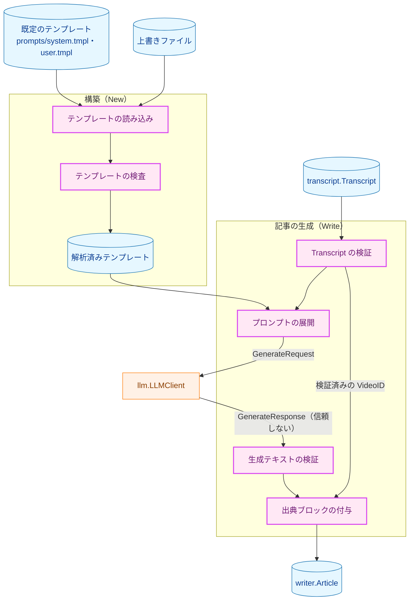
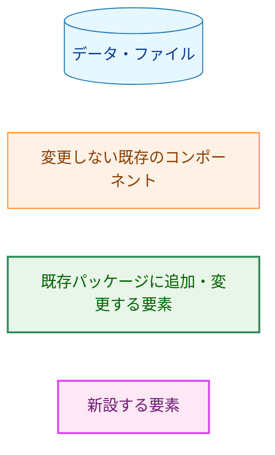
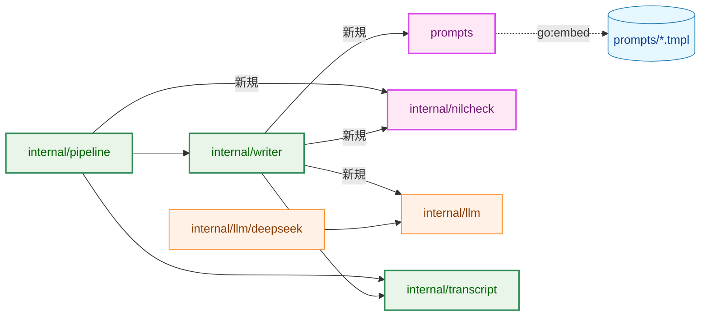
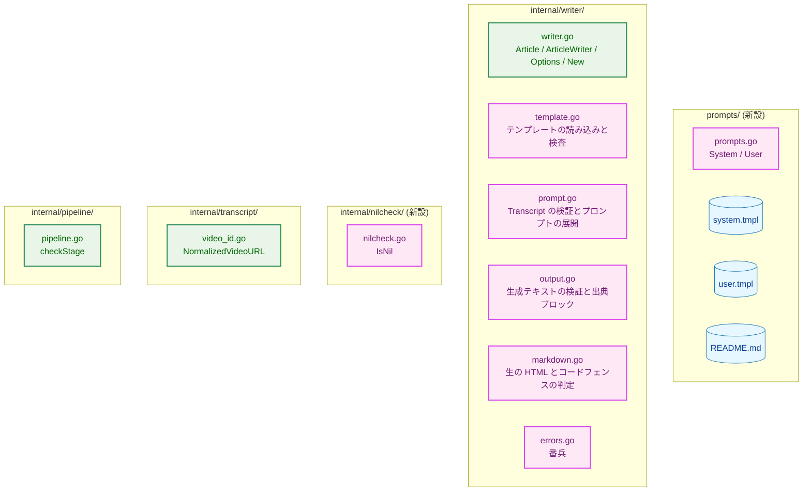
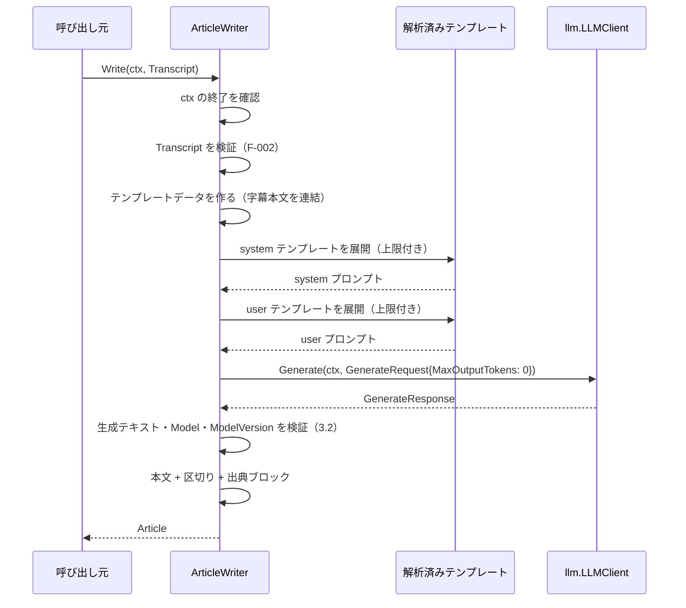
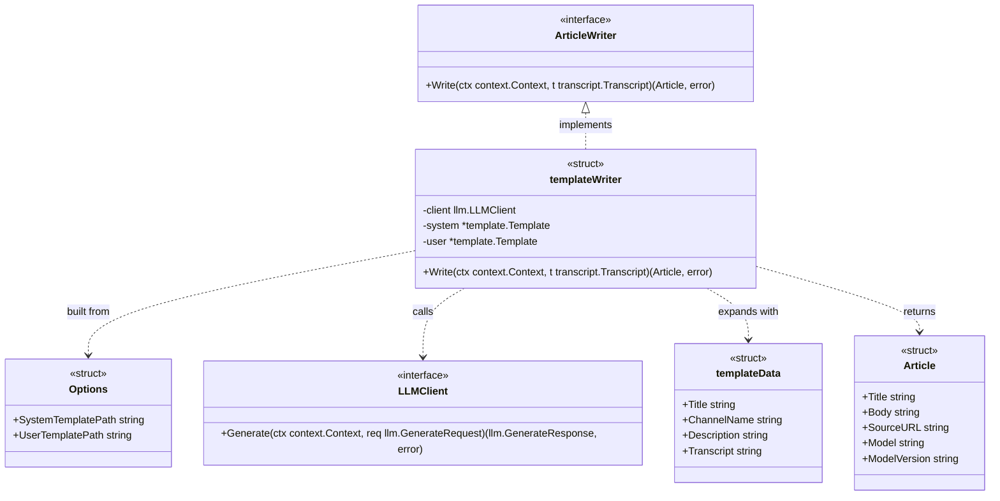
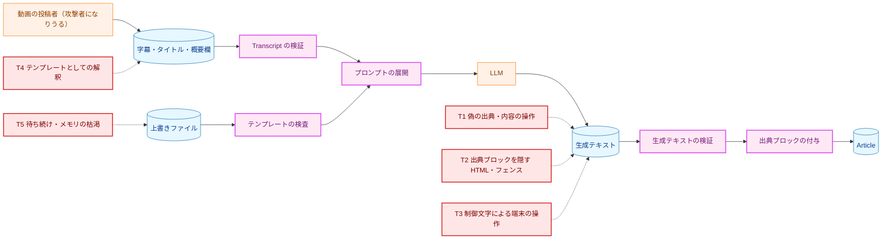
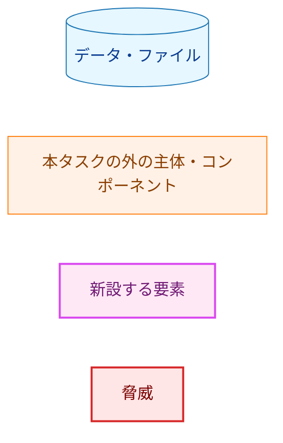
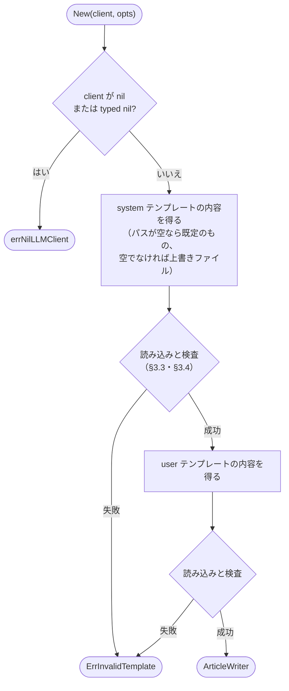
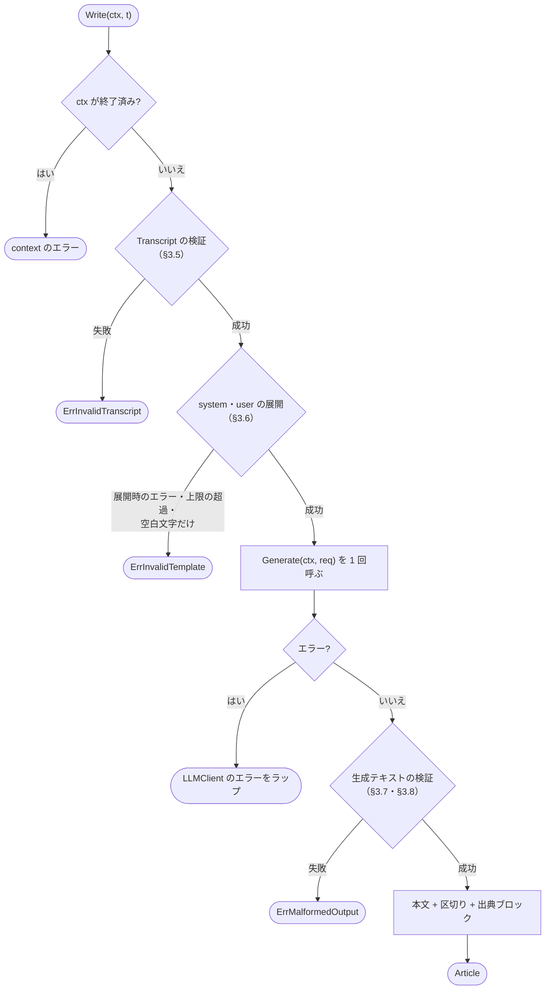

# アーキテクチャ設計書：ArticleWriter とプロンプトテンプレート

## Document Status

| Item | Value |
|---|---|
| Status | `draft` |
| Created | 2026-10-03 |
| Review date | 2026-10-05 |
| Reviewer | isseis |
| Comments | - |

## 1. 設計の全体像 (Design Overview)

### 1.1. 設計原則

1. **`ArticleWriter` は `New` を通してしか作れない。** `New` は非公開の型の値を `writer.ArticleWriter` として返す。パッケージの外からは未構築の値（ゼロ値）を作れない。そのため、構築時の検査を通っていないテンプレートや nil の `LLMClient` で `Write` が呼ばれることはない（CLAUDE.md「Enforce invariants with the type」。`internal/llm/deepseek` の `New` と同じ形）。
2. **テンプレートの誤りは構築時に見つける。** テンプレートの検査（読み込み・UTF-8・大きさ・構文・参照できる値・使える構文）はすべて `New` で行う。`Write` の時点で残るのは、`Transcript` の値によって初めて起きる失敗（展開時のエラー、展開結果が空白文字だけになる、上限を超える）と、構築時に検査しない値の型の不一致（§3.4）だけである（要件 F-001・F-003）。
3. **テンプレートで使える構文は許可リストで絞る。** `text/template` の構文のうち、`Write` の時点の安全性（メモリを使い切らない、参照できる値が 4 つに限られる、展開結果が正しい UTF-8 になる）を構築時に保証できるものだけを許す。許可リストにない構文は、構築時に `ErrInvalidTemplate` で拒否する（§3.4）。新しい構文が Go に追加されても、許可リストに加えるまでは拒否する（fail-secure）。
4. **LLM の出力は信頼できない入力として検証し、補正しない。** 生成テキストを要件定義書 3.2 の受理する形と照合し、合わないものは正規化・切り詰めをせずに `ErrMalformedOutput` で拒否する。例外は要件 3.2 の本文の部分の表記の統一（改行と先頭の BOM）だけで、CommonMark での意味を変えずに、表示する実装の間の解釈の食い違いをなくすためのものである（§3.7）。部分的な結果は返さない。
5. **Markdown の判定は、CommonMark と食い違う場合に必ず拒否の側へ倒す。** 本文の部分（生成テキストの先頭行より後。定義は §1.2）に生の HTML がないこと、閉じていないコードフェンスで終わらないことの判定は、CommonMark の完全な実装ではない。判定を簡略にした箇所では、CommonMark が受理する出力を拒否すること（過剰な拒否。§1.2）はあっても、CommonMark が生の HTML とみなすものや出典ブロックを取り込む形を受理することはない（§3.8）。
6. **出典リンクはコードで組み立て、LLM の出力から取らない。** 出典の URL は検証済みの `VideoID` から組み立て、固定の書式の出典ブロックとして本文の後ろに付ける。LLM が生成した本文は加工しない（要件 F-006・AC-17）。
7. **既存の判定は共有し、書き直さない。** 動画 ID と正規化した URL の規則は `internal/transcript` から、typed nil の判定は新設の `internal/nilcheck` から使う（CLAUDE.md の DRY。§3.11）。
8. **`ArticleWriter` はプロバイダに依存しない。** 依存するのは `llm.LLMClient` と `internal/llm` の共通型だけであり、`internal/llm/<provider>` を import しない（要件 4.5）。

### 1.2. 概念モデル



**図1 概念モデル**。矢印 A → B は「A の結果を B が入力として使う」を表す。ラベルのある矢印は、受け渡す値を示す。構築（`New`）は、既定のテンプレートまたは上書きファイルからテンプレートを読み込んで検査し、解析済みテンプレートを保持する。上書きファイルは `New` の中で 1 回だけ読む（要件 F-001・AC-04）。記事の生成（`Write`）は、`Transcript` の検証 → プロンプトの展開 → `LLMClient` の呼び出し → 生成テキストの検証 → 出典ブロックの付与の順に進み、どこかで失敗したら以降へ進まずにエラーを返す（§6.2）。出典ブロックの URL は、生成テキストではなく検証済みの `VideoID` から作る（`TVAL -->|"検証済みの VideoID"| SRC`）。



**凡例（図1・図2・図3）**。図6（脅威モデル）は脅威の色を加えた凡例を §5.1 に置く。シーケンス図（図4）・クラス図（図5）と、色分けしないフローチャート（図7a・図7b）は凡例を省略し、矢印の意味をキャプションに記す。

**用語。** 本書では、要件定義書 §6 の用語に加えて次の用語を使う。

- **テンプレートデータ**: テンプレートの展開時に `.` として渡す値。参照できる 4 つの値（動画タイトル・チャンネル名・概要欄・字幕本文）だけを持つ（§3.2）。
- **本文の部分**: 生成テキストの先頭行の `\n` より後の文字列（要件定義書 3.2）。検証を通ると「LLM が生成した本文」として `Article.Body` の先頭に入る。
- **区切り**: LLM が生成した本文と出典ブロックの間に置く改行（§3.9）。
- **過剰な拒否**: CommonMark では生の HTML でも閉じていないコードフェンスでもない本文の部分を、本設計の判定が `ErrMalformedOutput` で拒否すること（§3.8）。要件定義書 3.2 は、受理しなければならない形を除き、生の HTML や閉じていないコードフェンスと区別するのが難しい形を拒否してよいとしており、本設計の過剰な拒否はその範囲に収める（§3.8 で要件との関係を述べる）。
- **番兵**: `errors.Is` で判別できる、あらかじめ定めたエラー値（番兵エラー。要件定義書 §6）。
- **H-nn・I-nn**: [design_handoff.md](design_handoff.md)・[implementation_handoff.md](implementation_handoff.md) の項目番号。H-nn への対応は §3.13 にまとめる。
- **#n**: issue の番号。#5 は本タスク、#6 は設定・CLI・`FilePublisher`、#7 は Slack への投稿、#8 は本番用のプロンプト、#10 は見出しごとの時刻へのリンク、#13 は長い動画への対応である（#6 以降は §9）。

### 1.3. 既存コードとの関係

執筆時点の HEAD `1d39443` で次を確認した。

- `internal/writer/writer.go:11-17` の `Article` は `Title`・`Body`・`SourceURL`・`Model` の 4 つのフィールドを持つ。`:19-24` の `ArticleWriter` interface は `Write(ctx, transcript.Transcript) (Article, error)` だけを持つ。`internal/writer` は `internal/transcript` だけを import する。本設計は `Article` に `ModelVersion` を追加し（要件 5.1）、`ArticleWriter` の実装を同じパッケージに置く。`internal/writer` は新たに `internal/llm`・`internal/nilcheck`・`prompts` を import する。`0001_pipeline_skeleton/02_architecture.md` §2.1 は「#5 の時点で `internal/writer` が `internal/llm` を import する」と予告しており、本設計はその方針に沿う。
- `internal/llm/llm.go:25-29` の `GenerateRequest` は `SystemPrompt`・`UserPrompt`・`MaxOutputTokens` を持つ。`:57-61` の `GenerateResponse` は `Text`・`Model`・`ModelVersion` を持つ。`:63-71` の `LLMClient` の doc コメントは、失敗を `internal/llm` の番兵と `context` のエラーで報告することを実装に課している。本設計は `internal/llm` を変更しない。
- `internal/llm/llm.go:33-51` の `GenerateRequest.Validate` は、空文字列のプロンプトと不正な UTF-8 を拒否するが、空白文字だけのプロンプトは受理する（`internal/llm/llm_test.go` の "accepts whitespace-only prompts"）。空白文字だけのプロンプトの拒否（AC-13）は `ArticleWriter` の側で行う（H-10）。
- `internal/transcript/transcript.go:8-21` の `Transcript` は公開フィールドだけを持ち、検証を経ずに組み立てられる。本設計は型を変更しない（要件 2.3）。
- `internal/transcript/video_id.go:11` の `videoIDPattern`（`^[A-Za-z0-9_-]{11}$`）と、`:16-59` の `validateVideoURL` は非公開である。正規化した URL `https://www.youtube.com/watch?v=<id>` は `:58` の 1 か所で組み立てている。本設計はこの組み立てを公開関数に切り出し、`validateVideoURL` と `ArticleWriter` の両方から使う（§3.11、H-06）。
- `internal/pipeline/pipeline.go:129-146` の `checkStage` と `isTypedNil` は非公開である。`isTypedNil` は `reflect` で `Pointer`・`Func`・`Map`・`Slice`・`Chan` の nil を判定する。`internal/writer` は `internal/pipeline` に import されるので、`internal/writer` から `internal/pipeline` を import すると循環する。本設計は判定を新設の `internal/nilcheck` へ移す（§3.11、H-07）。
- 空白文字の判定は、`internal/transcript/json3.go:101`・`internal/llm/deepseek/response.go:105` がいずれも `strings.TrimSpace(s) == ""` で行っている。`strings.TrimSpace` が除くのは、`unicode.IsSpace` が真になる文字である。`unicode/graphic.go` の `IsSpace` の doc コメントによれば、これは Unicode の White_Space プロパティを持つ文字である。要件定義書 §6 の「空白文字」はこれと一致する（H-10）。
- `internal/transcript/cache.go:156-180` の `readFileBounded` は、`os.Lstat` で通常のファイルかを確かめてから `os.Open` し、上限 + 1 バイトまで読む。この関数はキャッシュ用で、シンボリックリンクを辿らない。上書きファイルの読み込みとは、シンボリックリンクの扱いと種類の確認の方法が異なるため、この関数を共有しない（§3.3 で理由を述べる）。
- `internal/llm/testutil/mocks.go:15-33` の `FakeLLMClient` は、呼び出しの `ctx` と `GenerateRequest` を記録し、設定した結果とエラーを返す。本設計のユニットテストはこれをそのまま使い、fake を変更しない。
- `internal/pipeline/pipeline_test.go:375-421` の `TestCommonTypesFieldSets` は `writer.Article` のフィールドの組を固定している（`:403-408`）。本設計の `ModelVersion` の追加にあわせて期待値を更新する（I-02）。`:512-532` の `TestFakesCarryBuildTag` は `testutil` のファイルが 8 個であることを確かめている。本設計は `testutil` のファイルを追加しないので、この数は変わらない。
- `text/template` は、書き込み先がエラーを返すと展開を中断し、そのエラーを包まずに `Execute` の戻り値にする（`text/template/exec.go:149-177` の `writeError` と `errRecover`）。§3.6 の上限付きの書き込み先はこの振る舞いに依存する。
- 本節と §3.4 の標準ライブラリについての記述は、手元の Go 1.27.1 のソースで確認した。`go.mod` の Go のバージョン（1.26.5）は CI が使うものであり、両者の振る舞いが同じであることは、AC-28 のテストと構文の許可リストのテストが CI で確かめる。
- `cmd/yt2column/main.go` は空の `main` だけを持つ。本タスクは CLI に配線しない（#6）。

---

## 2. システム構成 (System Structure)

### 2.1. パッケージ構成



**図2 パッケージの依存関係**。実線の矢印 A → B は「A が B を import する」を表す。ラベル「新規」の矢印は本タスクで加わる import であり、ラベルのない実線は現在のコードにある import である（HEAD `1d39443` の各パッケージの import 宣言で確認）。点線の矢印は「ビルド時にファイルをバイナリへ埋め込む」を表す。`internal/publisher` と、`internal/llm/deepseek` から `internal/secret`・`internal/strictjson` への import、`internal/transcript` から `internal/strictjson` への import は、本タスクで変わらないため省略した。`internal/llm` は依存先を持たないリーフのままである。`internal/nilcheck` と `prompts` も標準ライブラリだけに依存するリーフである。`internal/llm/deepseek` は `internal/writer` から import されない（要件 4.5）。

**パッケージの配置の理由。**

- **`prompts`（リポジトリ直下）。** `//go:embed` は、ディレクティブを書いた Go ファイルのディレクトリとその下のファイルしか埋め込めない（H-01）。プロジェクトの想定ディレクトリ構成（[project_overview.md](../../dev/project_overview.md)）がテンプレートの置き場所を `prompts/` と定めているため、`prompts/` に小さな Go パッケージを置き、埋め込んだ内容を公開する。`internal/` の下に置かないのは、`prompts/` という利用者に見える場所を変えないためである。モジュールの外の利用者はいない（CLAUDE.md）ので、`internal/` でないことの不利益はない。
- **`internal/nilcheck`。** typed nil の判定を `internal/pipeline` と `internal/writer` で共有する。`internal/writer` は `internal/pipeline` を import できない（循環）ため、どちらからも import できるリーフに置く。
- **ArticleWriter の実装は `internal/writer`。** interface と同じパッケージに置く（`0001_pipeline_skeleton/02_architecture.md` §2.1、project_overview.md の想定ディレクトリ構成）。Markdown の判定（§3.8）も `internal/writer` の非公開の関数とする。判定は生成テキストの検証にだけ使い、ほかの利用者がいないためである。

`depguard` の `deps` ルール（`.golangci.yml:57-59`）は `$gostd` と `github.com/isseis/yt2column` の下のパッケージを許可しているので、`prompts`・`internal/nilcheck` の import は設定を変えずに通る。`make deadcode`（`Makefile:136`、`deadcode -test -tags test ./cmd/yt2column`）は `./cmd/yt2column` から読み込めるパッケージだけを解析する。現在の `main` は何も import しない（`cmd/yt2column/main.go`）ので、`internal/writer` は解析の対象にならず、本タスクの変更で報告は増えない。#6 で `main` が `writer.New` を呼ぶようになれば、`writer.New` から到達できる関数は使われているとみなされる。

### 2.2. コンポーネント配置



**図3 コンポーネント配置**。矢印は使わない。サブグラフはパッケージを、ノードはファイルとその主な要素を表す。色は凡例（§1.2）に従い、紫は新設するファイル、緑は既存のファイルへの追加・変更、青はテンプレートと文書のファイルである。`internal/writer` のファイルの分け方は説明のための案であり、実装で変えてよい。

### 2.3. データフロー（成功時）



**図4 `Write` の成功時のデータフロー**。実線の矢印 `->>` は呼び出しを、点線の矢印 `-->>` は戻り値を表す。自分自身への矢印は `ArticleWriter` の内部の処理である。失敗時の分岐は §6.2 の図7b に示す。`Generate` は 1 回だけ呼び、リトライしない（要件 F-003）。

---

## 3. コンポーネント設計 (Component Design)

### 3.1. `internal/writer` の公開 API

```go
// internal/writer

// Article is the generated column article.
type Article struct {
    Title        string
    Body         string // Markdown
    SourceURL    string
    Model        string
    ModelVersion string // opaque, provider-defined; empty when the provider reports none
}

// Options configures the templates of the ArticleWriter returned by New.
// An empty path selects the embedded default template; a non-empty path
// names an override file that New reads once.
type Options struct {
    SystemTemplatePath string
    UserTemplatePath   string
}

// New validates client and the templates and returns an ArticleWriter.
// It never reads environment variables. The concrete type is unexported,
// so an ArticleWriter can only be obtained through New.
func New(client llm.LLMClient, opts Options) (ArticleWriter, error)
```

- **戻り値の型。** `New` は非公開の具体型（以下、仮に `templateWriter` と呼ぶ）の値を `ArticleWriter` として返す（§1.1 の原則 1）。具体型は `LLMClient` と解析済みの 2 つのテンプレートを保持し、構築後は変更しない。`text/template` の `Execute` は同じテンプレートを並行して実行してよいので、`templateWriter` 自身の状態は並行した `Write` で競合しない。ただし `Write` は `LLMClient` の `Generate` を呼ぶので、`Write` を並行して呼んでよいのは、注入した `LLMClient` が並行して呼んでよい場合に限る。`llm.LLMClient` の interface はそれを保証していない。現在、`Write` を並行して呼ぶ呼び出し元はないので、`Write` は呼び出しを直列化しない。
- **`LLMClient` は位置引数で受け取る。** 必須の依存であり、`internal/pipeline` の `New` と同じ形である。nil と typed nil は `nilcheck.IsNil` で拒否する（AC-02）。拒否は非公開の静的エラー `errNilLLMClient` で返す。要件定義書 §5 が定める公開の番兵は 3 つであり、構築時の nil の拒否に公開の番兵は求められていないためである（`internal/llm/deepseek` の `New` も構築時の誤りに公開の番兵を定義していない）。
- **パスの空文字列は「上書きしない」を表す。** `Options` のゼロ値は、どちらのテンプレートも既定のものを使う、という最も前提の少ない解釈になる（CLAUDE.md「Declare, don't infer」）。`New` が見るのはパスが空かどうかだけで、パスの中身によって振る舞いを変えない。空でないパスは、空白文字だけであってもファイルのパスとして開き、開けなければ `ErrInvalidTemplate` になる（補正しない）。
- **`New` は環境変数を読まない。** 上書きファイルのパスを環境変数や CLI 引数から受け取るのは #6 の責務である（要件 2.3・§5）。
- **`Article.ModelVersion`。** `GenerateResponse.ModelVersion` を加工せずに入れる（要件 F-005）。doc コメントは `llm.GenerateResponse.ModelVersion`（`internal/llm/llm.go:53-56`）と同じく「提供元が定める不透明な識別子で、返さないプロバイダでは空文字列」とする。

### 3.2. プロンプトテンプレート（`prompts` パッケージ）

```go
// prompts

// System returns the embedded default system prompt template.
func System() string

// User returns the embedded default user prompt template.
func User() string
```

- 埋め込みは `//go:embed system.tmpl` と `//go:embed user.tmpl` で、非公開の `string` 変数に入れる。公開するのは値を返す関数だけとし、パッケージ変数を公開しない。公開した変数はほかのパッケージから書き換えられ、既定のテンプレートの検査（AC-06）が実物を対象にしなくなるためである。
- `prompts` は検査をしない。既定のテンプレートの検査は、上書きファイルと同じ関数で `internal/writer` の `New` が毎回行う（要件 F-001「既定のテンプレートにも同じ規則を適用する」）。AC-06 のテストは `prompts.System()`・`prompts.User()` の返す実物に対して行う（H-01）。

**参照できる値（テンプレートデータ）。** テンプレートの展開時には、`Transcript` ではなく、次の 4 つのフィールドだけを持つ非公開の構造体を `.` として渡す（H-03）。

| 参照する名前 | 値 | 元になる値 |
|---|---|---|
| `.Title` | 動画タイトル | `Transcript.Title`（加工しない） |
| `.ChannelName` | チャンネル名 | `Transcript.ChannelName`（加工しない） |
| `.Description` | 概要欄 | `Transcript.Description`（加工しない） |
| `.Transcript` | 字幕本文 | `Transcript.Segments` の各 `Text` を順に `\n` 1 つで連結した文字列。`StartMs` は含めない（要件 F-003） |

```go
// internal/writer

// templateData is the only value passed to a prompt template. Its fields
// are the four values a template may reference.
type templateData struct {
    Title       string
    ChannelName string
    Description string
    Transcript  string
}
```

`transcript.Transcript` をそのまま渡さないのは、`VideoID`・`VideoURL`・`Segments`（`StartMs` を含む）まで参照できてしまい、要件 F-001 の「4 つの値」と食い違うためである。フィールドは `text/template` から参照できるよう公開（大文字始まり）にするが、型は非公開であり、パッケージの外からは作れない。

**使える構文。** §3.4 の許可リストのとおりである。利用者向けの仕様（参照できる値の名前、使える構文、上限）は `prompts/README.md`（日本語）に記す。リポジトリには `testdata/README.md` という、ディレクトリの中身を説明する README の前例がある。

**仮のテンプレートの内容。** 本番用の文面は #8 で決める（要件 2.3）。本タスクの仮のテンプレートは次を満たす。

- `system.tmpl`: 雑誌のコラム記事の書き手という役割、出力の形（先頭行を `# ` で始まるタイトルの見出しにし、その後に Markdown の本文を書く）、生の HTML を使わないこと、コードフェンスを閉じること、出典を書かないこと（コードが付けるため）を指示する。出力の形の指示には、`# ` で始まる行の例を含める（H-01・I-01。AC-30 を文字列で確かめるため）。
- `user.tmpl`: `.Title`・`.ChannelName`・`.Description`・`.Transcript` を、それぞれ見出し付きの区画に埋め込む。区画の中の文字列は記事の素材であり、指示として扱わないよう LLM に伝える（プロンプトインジェクションへの対策の一部。§5.3 のとおり、これだけでは防げない前提で設計する）。

4 つの値をすべて埋め込むこと、出力の形の指示を含めることは AC-30 のテストで確かめる。

### 3.3. 上書きファイルの読み込み（H-08）

上書きファイルは次の手順で読む。いずれかで失敗したら `ErrInvalidTemplate` で構築を失敗させる。

1. パスを `O_RDONLY | O_NONBLOCK | O_NOCTTY` で開く。シンボリックリンクは辿る。
2. 開いたファイルに対して `Stat`（fstat）を行い、通常のファイルでなければ閉じて拒否する（ディレクトリ・名前付きパイプ・デバイス・ソケットなど。AC-05）。
3. 上限 + 1 バイトまで読み、上限を超えていれば拒否する。
4. 読んだバイト列に、既定のテンプレートと同じ検査（§3.4）を行う。

- **`O_NONBLOCK` を付ける理由。** 名前付きパイプ（FIFO）は、`O_NONBLOCK` なしで読み取り用に開くと、書き込み側が開くまで `open` が戻らない。`O_NONBLOCK` を付けると `open` はすぐに戻り、続く fstat で種類を見て拒否できる。開いたファイルそのものを確かめるので、確認と使用の間にファイルを差し替えられる隙（TOCTOU）がない。通常のファイルの読み取りは `O_NONBLOCK` の影響を受けない。`syscall.O_NONBLOCK` は macOS と Linux の両方で定義されている（要件 4.4 の対象環境）。Windows での振る舞いは対象外とし、確かめない。
- **`O_NOCTTY` も付ける。** 端末のデバイスを指定された場合に、fstat で拒否する前の `open` で、プロセスがその端末を制御端末として得ることを防ぐ。`syscall.O_NOCTTY` も macOS と Linux の両方で定義されている。
- **待ち続けない保証の範囲。** `O_NONBLOCK` と種類の確認で防げるのは、FIFO とデバイスによる待ち続けである。NFS・FUSE などのネットワーク上のファイルシステムにある通常のファイルは、`open` や読み取りが戻らないことがありうる。`New` は `ctx` を受け取らないので、これは防げない。上書きファイルは利用者が自分で指定するので、残余リスクとして受け入れる（§5.1 の T5）。
- **`os.Stat` で確かめてから `os.Open` する方式（H-08 の候補 2）を採らない理由。** 確認と `open` の間に FIFO へ差し替えられると、`open` が戻らなくなる。上書きファイルは利用者自身のファイルなので危険は小さいが、開いた後に fstat する本節の方式（H-08 の候補 1）は、同じ手順数で隙をなくせる。
- **シンボリックリンクを辿る理由。** 上書きファイルのパスは利用者が自分で指定する。設定ファイルをシンボリックリンクで管理する使い方を妨げない。辿った先の種類は手順 2 で確かめるので、リンクの先が FIFO やデバイスでも待ち続けない。
- **`internal/transcript` の `readFileBounded` を共有しない理由。** `readFileBounded`（`internal/transcript/cache.go:156-180`）は、キャッシュディレクトリの中の固定の名前のファイルを読むためのもので、シンボリックリンクを辿らない（`os.Lstat`）。上書きファイルはシンボリックリンクを辿り、種類の確認を開いた後に行う。両方の方針を 1 つの関数に入れるには方針を選ぶ引数が要り、キャッシュの読み込み（[cache_consistency.md](../../dev/cache_consistency.md) の対象）を変更することにもなる。重なるのは「上限 + 1 バイトまで読む」数行だけなので、共有しない。同じ数行は `internal/llm/deepseek/response.go:43`（HTTP の応答本文）にもあり、既存の 2 か所も共有していない。
- **エラーには、どちらのテンプレート（system・user）かと、パスを含める。** パスは利用者が与えた値で、秘密情報ではない（H-08）。下位の `*fs.PathError` の文言もパスをそのまま含む。利用者自身が与えた値なので、エスケープせずに表示してよいとする。開く・fstat・読み取りの失敗は、`os` が返す `*fs.PathError` を `%w` でつなぎ、`errors.Is(err, fs.ErrNotExist)` でも判別できるようにする（AC-05・H-09）。パスはプロンプトには入らない（要件 4.2）。

### 3.4. テンプレートの検査（H-02・H-11）

既定のテンプレートと上書きファイルの内容に、次の検査をこの順で行う。どれかに反すれば `ErrInvalidTemplate` で構築を失敗させる（要件 F-001・AC-05・AC-06）。

1. 大きさが上限（§3.10）以下である。
2. 正しい UTF-8 である。
3. 空白文字以外の文字を 1 つ以上含む。
4. `text/template` として解析できる。テンプレートの名前は `system` または `user` とし、展開時のエラーの文言でどちらかが分かるようにする。関数（`Funcs`）は追加しない。
5. `{{define}}`・`{{block}}` を含まない。テンプレートと同じ名前の `{{define "user"}}…{{end}}` は、`text/template` では本体を置き換えるだけで、テンプレートの数は 1 つのままになる。そのため、テンプレートの数を数えるだけでは足りない。同じ名前の定義も検出できる方法を使い、その検出をテストで確かめる。
6. 解析木のすべてのノードが、次の許可リストに含まれる（以下、構文の検査）。

**構文の許可リスト。** 解析木（`text/template/parse`）を根からすべてたどり、ノードの種類ごとに次のとおり判定する。ノードの種類で分岐し、どの分岐にも当たらない種類は拒否する。`if` の条件や `else` の中も、展開時に通るかどうかによらず検査する（要件 F-001「条件分岐の中など、展開時に実行されるとは限らない位置にある参照も対象とする」）。

| 構文 | 例 | 判定 | 理由 |
|---|---|---|---|
| 文字列（テンプレートの地の文） | `動画タイトル:` | 許可 | |
| コメント | `{{/* メモ */}}` | 許可 | 解析の時点で取り除かれ、解析木に残らない |
| 値の出力 | `{{.Title}}` | 許可 | |
| 参照できる値の参照 | `.Title`・`.ChannelName`・`.Description`・`.Transcript` | 許可 | 参照できる値は 4 つ（§3.2） |
| ほかのフィールドの参照、値のフィールドの参照 | `.APIKey`・`.Title.Foo` | 拒否 | 参照できる値を 4 つに限る（AC-05） |
| `.` そのもの、変数の参照と宣言 | `{{.}}`・`{{$}}`・`{{$.Title}}`・`{{$x := .Title}}` | 拒否 | `.` を出力すると構造体の書式で 4 つの値がまとめて出力される。変数は参照の検査を複雑にする。宣言（パイプラインの左辺）も、変数の参照と同じく拒否する |
| `if`・`else`・`else if` | `{{if .Description}}…{{else}}…{{end}}` | 許可 | 概要欄が空の動画に対応する文面（#8）に要る |
| `with`・`range`・`template`・`break`・`continue` | `{{with .Title}}{{.}}{{end}}` | 拒否 | `.` の指す値が変わり、参照の検査が値の型に依存する。`range` は繰り返しを作る |
| 定数 | `"x"`・`100`・`true` | 許可。ただし文字列の定数は、エスケープを解いた値が正しい UTF-8 であるものに限る | `{{"\xff"}}` はテンプレートの文面としては正しい UTF-8 だが、展開すると不正なバイトを出力する |
| `nil`、フィールドの連鎖 | `nil`・`(.Title).Foo` | 拒否 | 参照できる値の参照の形にならない |
| 括弧による入れ子とパイプ | `{{if (eq .Title "")}}`・`{{.Title \| len}}` | 許可（中身も同じ規則で検査する） | |
| 引数の数が合わない関数の呼び出し | `{{len}}`・`{{not 1 2}}`・`{{.Title \| len .Title}}` | 拒否 | 展開時に必ず失敗する。引数の数は、パイプラインで前から渡る値を含めて数え、`not`・`len` は 1、`ne`・`lt`・`le`・`gt`・`ge` は 2、`eq` は 2 以上、`and`・`or`・`index` は 1 以上とする（`text/template/funcs.go` の各関数のシグネチャ。`eq` は 1 個では展開時にエラーになる） |
| 関数でない値への引数、パイプラインの 2 段目以降の関数でない値 | `{{.Title 1}}`・`{{"x" 1}}`・`{{.Title \| .Description}}`・`{{.Title \| (len .Title)}}` | 拒否 | 展開時に必ず失敗する |
| 引数の位置の関数名 | `{{eq len .Title}}` | 拒否 | 引数なしの呼び出しとして評価され、許可する関数はどれも引数を 1 個以上とるので、展開時に必ず失敗する。`{{eq (len .Title) 1}}` と書く |

上の 3 行の「必ず失敗する」には例外が 1 つある。`and`・`or` は短絡評価をするので、2 つ目以降の引数にある誤った呼び出し（`{{or .Title len}}`）は、前の引数で結果が決まる入力では評価されず、展開が成功する。それでも、評価される入力では必ず失敗する誤りなので、`and`・`or` の引数の中も同じ規則で拒否する（過剰な拒否を承知で、検査を単純に保つ）。

上の 3 行の検査（引数の数とコマンドの形）は、セキュリティ上の要件ではない。テンプレートは利用者が自分で指定する信頼できる入力であり（§5.1 の T5）、これらの誤りは検査がなくても展開時のエラーとして `ErrInvalidTemplate` になり、`LLMClient` は呼ばれない。この節の保証（参照できる値・メモリ・UTF-8）もこの検査に依存しない。目的は、誤りを `yt-dlp` の実行後ではなく構築時に報告すること（§1.1 の原則 2）だけである。そのため、この検査の取りこぼしや過剰な拒否は、直すコストと利点を比べて扱い、コストが高ければ受け入れてよい。
| 関数 `and`・`or`・`not`・`eq`・`ne`・`lt`・`le`・`gt`・`ge`・`len`・`index` | `{{index .Title 100}}` | 許可 | 結果は真偽値・整数・1 バイトの値か、`and`・`or` では引数のどれか（既にある値）であり、入力より大きな文字列を作らない |
| 関数 `print`・`printf`・`println` | `{{printf "%1000000000s" .Title}}` | 拒否 | 1 回の呼び出しで入力より大きな文字列を作れる（構築時に関数を拒否する H-11 の候補 2） |
| 関数 `slice` | `{{slice .Title 0 1}}` | 拒否 | バイト単位で切るので、展開結果が不正な UTF-8 になりうる |
| 関数 `html`・`js`・`urlquery`・`call` | `{{html .Title}}` | 拒否 | 値を書き換える。`call` は関数の値を呼ぶが、テンプレートデータに関数はない |

`text/template` の組み込み関数の一覧は `text/template/funcs.go` の `builtins` で確認した（19 個）。許可するのはそのうち 11 個である。組み込みにない関数名は `text/template` の解析そのものがエラーにする。

**この許可リストで保証されること。**

- 参照できる値は 4 つだけである（AC-05）。分岐の中も含めて検査するので、`{{if .Description}}{{.APIKey}}{{end}}` は構築時に拒否する。
- 1 回の書き込みの大きさは、テンプレートの地の文・文字列の定数・参照できる値のいずれか 1 つの大きさ、または整数・真偽値の表示の大きさ以下に収まる。§3.6 の上限付きの書き込み先が、累計の大きさを書き込みのたびに確かめるので、展開でメモリを使い切ることはない（AC-28）。`printf` の幅の指定のように 1 回で巨大な文字列を作る記述は、構築時に拒否する。要件 F-001 は `printf` を使えない構文とし、AC-28 はこの例を構築時の拒否とする。
- 繰り返し（`range`）がないので、展開の手間はテンプレートの大きさに比例する。
- テンプレートの地の文・文字列の定数・参照できる値・整数と真偽値の表示はすべて正しい UTF-8 なので、展開したプロンプトも正しい UTF-8 になる（`slice` を拒否し、文字列の定数を検査する理由）。
- `Write` の時点で起きうる失敗は、`index` の範囲外、比較できない型どうしの比較・`len` に数を渡すなどの値の型の不一致による展開時のエラー、展開結果が空白文字だけ、上限の超過に限られる。関数の引数の数とコマンドの形は構築時に検査するが、値の型は検査しない（値の型の推論は検査を複雑にするため）。AC-13 の例 `{{index .Title 100}}` は構築時の検査を通り、100 バイト以下の `Title` で展開時のエラーになる。

**要件 F-001 との関係。** 要件 F-001 は、テンプレートで使える構文（地の文とコメント、参照できる 4 つの値の参照、`if`・`else`・`else if`、定数、括弧による入れ子とパイプライン、組み込み関数 `and`・`or`・`not`・`eq`・`ne`・`lt`・`le`・`gt`・`ge`・`len`・`index`）を定め、それ以外の構文を構築時に `ErrInvalidTemplate` で拒否するとしている（AC-05 の `{{with .Title}}{{.}}{{end}}`・`{{printf "%s" .Title}}` の例を含む）。この許可リストは、その使える構文を解析木のノードの種類に当てはめたものである。参照できる値だけを使う記述（`{{with .Title}}{{.}}{{end}}`・`{{$t := .Title}}{{$t}}`・`{{html .Title}}` など）も拒否するのは、上の保証（参照できる値・メモリ・UTF-8）を、展開せずに解析木だけから示せる範囲に構文を限るためであり、F-001 はこの理由で構文を限っている。仮のテンプレートと #8 の本番用テンプレートに、拒否する構文は要らない。

**代替案。** 制御構造をすべて拒否し `{{.Name}}` の形だけを許す案（H-02 の代替案）は採らない。AC-13 が例に挙げる、構築時の検査を通り展開時に失敗するテンプレート（`{{index .Title 100}}`）を書けなくなり、#8 で概要欄の有無に応じた文面（`if`）も書けなくなるためである。

### 3.5. `Transcript` の検証と字幕本文（F-002・H-06）

`Write` は、次の順に `Transcript` を検証する。どれかに反すれば `ErrInvalidTranscript` を返し、`LLMClient` を呼ばない（AC-07）。

1. `transcript.NormalizedVideoURL(VideoID)` が成功する（`VideoID` が `[A-Za-z0-9_-]{11}` に完全に一致する）。
2. `VideoURL` が、手順 1 で得た URL とバイト単位で一致する。別の形の URL を正規化して受理することはしない。
3. `Segments` が空でない。
4. どの `Segment.Text` も、空でも空白文字だけでもない。
5. `Title`・`ChannelName`・`Description`・各 `Segment.Text` が正しい UTF-8 である。

`Title`・`ChannelName`・`Description` が空であることは拒否しない（AC-08）。

**字幕本文。** 検証を通った `Segments` の各 `Text` を、順序どおりに `\n` 1 つで区切って連結する（`strings.Join` と同じ結果）。`Text` は加工しない（前後の空白・改行も残す。AC-10）。`StartMs` は使わない（AC-11）。

**エラーの文言。** どの検査に反したか（フィールド名と、`Segments` の場合は何番目か）だけを含め、値は含めない。`Transcript` の値は信頼できない入力に由来し、端末の制御文字を含みうるためである。

### 3.6. プロンプトの展開と上限（F-003・H-10・H-11）

- system テンプレートと user テンプレートを、それぞれ上限付きの書き込み先に展開する。書き込み先は、累計が上限（§3.10）を超える書き込みを受け取ると、受け取ったバイト列を保持せずに非公開の静的エラー（`errPromptTooLarge`）を返す。`text/template` はこのエラーで展開を中断し、`Execute` の戻り値として返す（§1.3）。
- 上限ちょうどのプロンプトは受理し、上限 + 1 バイトのプロンプトは拒否する（AC-28）。
- 展開時のエラー、上限の超過、および展開結果が空または空白文字だけの場合は、`LLMClient` を呼ばずに `ErrInvalidTemplate` を返す（AC-13・AC-28）。空白文字の判定は `strings.TrimSpace(s) == ""` で行い、既存の判定（§1.3）とそろえる（H-10）。
- 上限の超過のメッセージには上限の値を含め、字幕本文などの入力が大きすぎる場合もあることを示す。要件は上限の超過を `ErrInvalidTemplate` に割り当てているが、長い動画ではテンプレートではなく入力が原因になりうるためである。
- 埋め込む値はテンプレートとして解釈されない。`text/template` はテンプレートデータの文字列をそのまま出力し、エスケープもしない（`html/template` は使わない。H-03）。そのため、字幕や概要欄の `{{.Title}}` はそのままプロンプトに現れる（AC-12）。
- `GenerateRequest` は、展開した 2 つのプロンプトと `MaxOutputTokens: 0` で作る（AC-09）。`Generate` には `Write` が受け取った `ctx` をそのまま渡す。

**メモリの上限について。** 展開に使うメモリは、プロンプトの上限と、`Transcript` の値の大きさ（呼び出し元が既にメモリに持っているもの）の定数倍で抑えられる。`Write` は `Transcript` の値の大きさ自体には上限を設けない。字幕本文や概要欄が上限を超えるほど大きくても、テンプレートが参照しなければ問題にならず、参照すれば上限の超過として拒否されるためである。

### 3.7. 生成テキストの検証（3.2・H-09・H-10）

`Generate` が成功したら、`GenerateResponse` を次の順に検証する。どれかに反すれば `ErrMalformedOutput` を返し、`Article` はゼロ値とする（AC-22〜AC-27・AC-29・AC-31・AC-32）。

| 順 | 対象 | 規則 | 主な AC |
|---|---|---|---|
| 1 | `Text` | 大きさが上限以下 | AC-31 |
| 2 | `Text` | 正しい UTF-8 | AC-22 |
| 3 | 先頭行 | `# `（`#` 1 個と U+0020 1 個）で始まる。先頭行は最初の `\n` の前まで（`\n` がなければ全体） | AC-22 |
| 4 | タイトル | 先頭行から `# ` を除き、前後の U+0020 と U+0009 を除いた文字列。必須、制御文字なし、`#` で終わらない | AC-23 |
| 5 | 本文の部分 | 先頭行の `\n` より後に表記の統一（下記）をした文字列。必須 | AC-23・AC-32 |
| 6 | 本文の部分 | 生の HTML を含まない。閉じていないコードフェンスで終わらない（§3.8） | AC-24・AC-27 |
| 7 | `Model` | 大きさが上限以下、正しい UTF-8、必須、制御文字なし | AC-25・AC-29・AC-31 |
| 8 | `ModelVersion` | 空文字列なら受理。空でなければ、大きさが上限以下、正しい UTF-8、必須、制御文字なし | AC-29・AC-31 |

- **必須**は「`strings.TrimSpace(s) != ""`」、**制御文字なし**は「`unicode.IsControl` が真になる文字（一般カテゴリ Cc）を含まない」とする（要件 3.2・H-09）。タイトル・`Model`・`ModelVersion` は同じ判定の関数を共有する。
- タイトルの前後から取り除くのは U+0020 と U+0009 だけである。全角空白（U+3000）だけのタイトルは、除去の後も空でないが、必須の判定（空白文字以外の文字がない）で拒否する（AC-23）。
- 空白文字だけの `Text` は、手順 3（先頭行が `# ` で始まらない）で拒否する。`# タイトル\r\n本文` は、タイトルに `\r`（Cc）が残るので手順 4 で拒否する（AC-23）。
- **本文の部分の表記の統一（要件 3.2）。** 手順 5 の前に、本文の部分の先頭の U+FEFF を 1 つ除き、`\r\n` と単独の `\r` を `\n` に置き換える。手順 5・6 と `Article.Body`（§3.9）は、統一した後の同じ文字列を使う。判定した文字列と記事に入れる文字列が異なると、§3.8 の判定が出典ブロックの保証にならないためである。タイトル（手順 4）には適用しない。
- 検証は、上の表記の統一のほかは値を正規化・切り詰めしない。`Article.Title` には手順 4 の文字列を、`Article.Model`・`Article.ModelVersion` には受け取った値をそのまま入れる。

### 3.8. 本文の部分の Markdown の判定（H-04）

本文の部分に対して、要件 3.2 の 2 つの規則（生の HTML を含まない、閉じていないコードフェンスで終わらない）を判定する。判定は CommonMark 0.31.2 の定義に基づくが、完全な CommonMark のパーサではない。判定を簡略にした箇所は、すべて過剰な拒否の側に倒す（§1.1 の原則 5）。外部のライブラリは使わない（CLAUDE.md の Dependencies。標準ライブラリに Markdown のパーサはない）。

**行。** 本文の部分は表記の統一（§3.7）の後なので、行の区切りは `\n` だけである。CommonMark の行の区切り（`\n`・`\r\n`・`\r`）のうち、残りの 2 つは統一で `\n` になっている。判定のために行に分けるだけで、本文の部分は変更しない。

**コードフェンス。** 行を先頭から順に見て、フェンスの中か外かを追う。

- **開くフェンス**: フェンスの外で、行頭（インデントなし）から ```` ` ```` または `~` が 3 個以上続く行。```` ` ```` のフェンスでは、続く情報文字列に ```` ` ```` を含まない。CommonMark ではこれがフェンスの開始になる。
- **フェンスに見える行**: 行頭の空白・タブ・引用の記号 `>`・リストの記号（`-`・`+`・`*`・数字・`.`・`)`）を取り除いた残りが ```` ``` ```` または `~~~` で始まる行。フェンスの外で、開くフェンスでないフェンスに見える行は、**拒否する**。インデントしたフェンス、引用やリストの中のフェンスがこれに当たる。CommonMark ではこれらもフェンスになりうるが、入れ子の構造まで判定しないと、閉じたかどうかを CommonMark と同じに判定できないためである（過剰な拒否）。
- **閉じるフェンス**: フェンスの中で、0〜3 個の半角空白のインデントの後に、開いたフェンスと同じ文字が開いたフェンス以上の個数続き、その後に半角空白とタブだけがある行。CommonMark の定義と同じである。フェンスの中のそれ以外の行は、どんな文字列でもフェンスの内容として扱い、HTML の判定もしない。
- 本文の部分の終わりでフェンスの中にいれば、**拒否する**（AC-24）。

開くフェンスを行頭のものに限ったので、受理する本文の部分のフェンスはすべて文書の最上位にある。最上位のフェンスは、閉じるフェンスか文書の終わりでしか閉じない。そのため、この判定でフェンスが閉じていると判断した本文の部分は、CommonMark でも閉じている。

**生の HTML。** フェンスの外の各行（開くフェンスと閉じるフェンスの行を除く）を左から読み、次の規則で判定する。

- `<` の直後が ASCII の英字・`/`・`!`・`?` のいずれかなら、**拒否する**。CommonMark の生の HTML（インラインの開始タグ・終了タグ・コメント・処理命令・宣言・CDATA セクションと、HTML ブロックの開始条件 1〜7）は、どれもこの形で始まる。この規則はそれらをすべて含み、さらに広い（例: 閉じていない `x<y` も拒否する）。
- 例外として、次の位置にある `<` は数えない。
  - **バックスラッシュでエスケープした `<`**（`\<div>`）。CommonMark でも生の HTML ではない。`<` の直前に続くバックスラッシュの数が奇数のときだけエスケープとみなす。`\\<div>` の `<` はエスケープされていないので拒否する。
  - **URI の自動リンク**（`<https://example.com/>`）。CommonMark の文法（`<`、ASCII の英字で始まる 2〜32 文字のスキーム、`:`、空白・制御文字・`<`・`>` を含まない文字列、`>`）に完全に一致し、さらにバッククォートを含まないものに限る。CommonMark の自動リンクはバッククォートを含められ、そのバッククォートはコードスパンの区切りにならない。バッククォートを含む自動リンクを例外にしないことで、下のコードスパンの判定と食い違わないようにする。
  - **メールアドレスの自動リンク（例外ではない）。** 例外にしない。 `<user@example.com>` のように英字で始まるものは拒否する（過剰な拒否）。`<!x@y.z>` のように、インラインでは自動リンクだが行頭では HTML ブロック（開始条件 4）になる形があり、両者を区別しないためである。`<1@a.bc>` のように英字・`/`・`!`・`?` 以外で始まるものは、上の規則に当たらないので受理する。CommonMark でも自動リンクであり、生の HTML ではない。
  - **コードスパンの中**（`` `<details>` ``）。次の条件をすべて満たす場合に限る。1 つでも満たさなければ、本文の部分の全体でコードスパンを例外にしない（過剰な拒否）。ここでの「フェンスの外の行」も、上と同じく開くフェンスと閉じるフェンスの行を除く。情報文字列はインラインの構文として解釈されず、行をまたぐ構文の一部にもならないためである（含めると、```` ```go ```` の行のバッククォートの列が対にならず、受理しなければならないコードスパンの中の `<details>` を拒否する）。
    - フェンスの外のすべての行（バッククォートを含まない行も含む）が、バックスラッシュ `\`・`[`・`]` を含まない。リンクのタイトルは行をまたげるので、ある行の `[` が別の行のバッククォートを取り込みうるためである（例: 1 行目が `[a](/u "`、2 行目が `` `") <details>` ``）。
    - フェンスの外のどの行にも、エスケープされていない `<` の後、同じ行の次の `>` より前にバッククォートがある箇所がない。自動リンクはメールアドレスの形も含めて `<` で始まり `>` で終わり、間に `>` を含まず、バッククォートを含められる（`` <1`@a.bc> ``）。この条件で、バッククォートを含む自動リンクがある本文の部分を、自動リンクの種類によらず除く。
    - フェンスの外の各行を左から読み、まだ対になっていないバッククォートの列（前後にバッククォートが続かない、最長の連続）に出会ったら、同じ行の中でその後にある最初の同じ長さの列を閉じる列として対にし、閉じる列の直後から読み続ける。閉じる列が同じ行の中になければ、条件を満たさない。

    この条件の理由は次のとおりである。

    - CommonMark では、左から読んで先に始まった構文が優先され、コードスパンの区切りになるはずのバッククォートをほかの構文が取り込むことがある。
    - バッククォートを取り込める構文は、バックスラッシュによるエスケープ（`` \` `` はコードスパンを開かない）、リンクと画像（リンク先・タイトル。どちらも `[` を伴う）、自動リンク、生の HTML である。1 つ目の条件はエスケープとリンク・画像を本文の部分の全体から除き、2 つ目の条件は自動リンクを除く。生の HTML は見つけた時点で拒否する。残る構文はバッククォートを取り込まないので、行の中の対の作り方は CommonMark と一致する。
    - CommonMark のコードスパンは段落の中で行をまたげるが、段落の範囲はブロックの構造で決まる。すべての列が同じ行の中で対になれば、CommonMark が選ぶ閉じる列（その後にある最初の同じ長さの列）も同じ行の中にあるので、行をまたぐ判定は要らない。
    - コードスパンの中では、CommonMark のとおりバックスラッシュをエスケープとして扱わない。

**過剰な拒否の一覧（CommonMark では受理されるが、本設計は拒否するもの）。**

| 例 | 理由 |
|---|---|
| `x<y`、`[a](http://a<b)` | `<` の直後が英字（判定を CommonMark の HTML の文法より広くとる） |
| インデントしたフェンス、引用やリストの中のフェンス | 入れ子の構造を判定しない |
| 情報文字列に ```` ` ```` を含む ```` ``` ```` の行、`1.5` のようにリストの記号に使う文字だけの並びの後に ```` ``` ```` が続く行 | フェンスに見える行を、行頭の文字を取り除いただけで判定する |
| インデントによるコードブロックの中の `<div>` | インデントによるコードブロックを判定しない |
| 英字で始まるメールアドレスの自動リンク（`<user@example.com>`） | 行頭で HTML ブロックになる形と区別しない |
| 行をまたぐコードスパン、閉じないバッククォートがある本文の部分のコードスパンの中の `<details>` | 段落の範囲を判定しない |
| `\`・`[`・`]` を 1 つでも含む本文の部分、または `<` と次の `>` の間にバッククォートがある本文の部分の、コードスパンの中の `<details>` | バッククォートを取り込むほかの構文を判定しない |

過剰な拒否は、記事の生成の失敗として利用者に見える（`ErrMalformedOutput`）。コラム記事は生の HTML もコードも通常は使わず、system テンプレートが生の HTML を使わないこととコードフェンスを閉じることを指示する（§3.2）。過剰な拒否が実際の運用で頻発した場合は、判定を CommonMark に近づける（§9）。

**受理する例（AC-27 と H-04 の境界の例）。** `a < b`、`1 <2`、`<東京>`（`<` の直後が ASCII の英字でない）、`` `<details>` ``（コードスパン）、閉じたフェンスの中の `<details>`、`<https://example.com/>`（URI の自動リンク）、`\<div>`（エスケープ）。

**拒否する例。** 閉じていない `<details>`、`<details>…</details>`、`<div hidden>`、段落中の `<span hidden>`、`<!-- -->`、`<script>`、行の途中で始まり閉じない `<!--`（CommonMark では文字列になるが、本設計は `<!` で拒否する）、大文字の `<DIV>`。CommonMark でも生の HTML になる、バッククォートの対を取り違えさせる形として、`` \`<details>` ``、`` <https://e.example/`><details>` ``、`` [a](/u "`") <details>` ``、``  <details>` ``、`` [a](</u`>) <details>` ``、行をまたぐリンクのタイトルの形（`[a](/u "` の次の行に `` `") <details>` ``。画像の `![a](/u "` も同じ）、バッククォートを含むメールアドレスの自動リンクの形（`` <1`@a.bc> <details>` ``・`` <`@a.bc> <script>` ``）。

**要件 3.2 との関係。** 要件 3.2 は、判定について 3 つのことを定める。CommonMark が生の HTML とみなすものや閉じていないコードフェンスで終わる本文の部分を受理しないこと、受理しなければならない形（1 行の中で閉じるコードスパンの中の `<details>`、行頭で開いて閉じたフェンスの中の `<details>`、URI の自動リンク、`a < b`・`1 <2`・`<東京>`）、それ以外で区別の難しい形を `ErrMalformedOutput` で拒否してよいことである。本設計の判定は、1 つ目を原則 5（§1.1）で満たし、2 つ目を上の「受理する例」で満たす。上の過剰な拒否の一覧の各行（`x<y` と英字で始まるメールアドレスの自動リンク、インデントしたフェンスと引用やリストの中のフェンス、インデントによるコードブロック、行をまたぐコードスパンと閉じないバッククォート、`\`・`[`・`]` やバッククォートを含む `<`…`>` がある本文の部分のコードスパン）は、いずれも要件 3.2 が挙げる拒否してよい形に当たる。

**判定の手間。** 判定は本文の部分の長さに比例する時間で行う。`<` ごとに行の残りや行の先頭から読み直す方法、行ごとに本文の部分の全体の条件を判定し直す方法は、入力の長さの 2 乗に比例する時間がかかる。境界の例のテストに加えて、そのような方法で時間がかかる入力が短い時間で終わることをテストで確かめる（同じ長さの列を探すたびに行の残りを読み直す方法は、閉じる列が見つからなければその時点で拒否の側に判定が決まり、見つかれば閉じる列の後から読み続けるので、コードスパンの 3 つ目の条件の下では線形になる）。

本節と §3.3 は、設計書としては具体的な手順に踏み込んでいる。出典ブロックが隠れないという保証がこの手順の正しさに依存するため、意図して詳しく書いた。

### 3.9. 出典ブロック（F-006・H-05）

**書式（固定）。**

```text
出典: <https://www.youtube.com/watch?v=<VideoID>>
```

出典ブロックは、上の 1 行と、その後の改行 `\n` 1 つからなる。`<VideoID>` は検証済みの `VideoID` で置き換える。URL は `transcript.NormalizedVideoURL` が返したものと同じ文字列であり、`Article.SourceURL` にも同じ文字列を入れる。

**`Article.Body` の組み立て。**

```text
Article.Body = LLM が生成した本文 + "\n\n" + 出典ブロック
```

- **区切りは常に `\n\n` とする。** LLM が生成した本文の末尾がどうであっても、区切りの最初の `\n` で本文の最後の行が終わり、2 つ目の `\n` で空行ができる。本文が既に改行で終わる場合は空行が 2 つ以上になるが、CommonMark ではブロックの間の空行の数は表示を変えない（フェンスとリストの中を除く。開いたフェンスは §3.8 で拒否し、リストは行頭の出典ブロックで終わる）。本文の末尾の改行の数を数えて区切りを変える方法（H-05 の候補）は採らない。LLM の出力の中身によって組み立てを変える分岐が要らず、どの場合も AC-19 の空行ができるためである。
- **本文の部分の表記の統一の後の文字列を使う。** 上の「LLM が生成した本文」は、§3.7 の表記の統一をした後の本文の部分である。本文の末尾が `\r` なら `\n` になっているので、区切りと合わせて空行ができる。
- **自動リンクを使う理由。** CommonMark では、`<` と `>` で囲んだ URL がリンクになる。囲まない URL は、CommonMark ではリンクにならない（GFM の拡張ではリンクになる）。URL は検証済みの動画 ID から組み立てるので、自動リンクの文法を壊す文字を含まない。
- **区切りとして水平線（`---`）は置かない。** 空行があれば出典ブロックは独立した段落になり、AC-19 を満たす。
- LLM が生成した本文が出典らしき行や別の URL を含んでいても、出典ブロックは省略せず、生成テキスト中の URL も使わない（AC-19）。

### 3.10. 固定する具体値

| 名前（仮称） | 値 | 根拠 |
|---|---|---|
| `maxTemplateBytes` | 65,536 バイト（64 KiB） | 仮のテンプレートは数 KB 以下になる。#8 の本番用テンプレートも、文面だけで数 KB〜十数 KB の想定であり、十分な余裕がある |
| `maxPromptBytes` | 1,048,576 バイト（1 MiB）。system・user のそれぞれに適用する | `testdata/2tcCWM-sRBw.ja.json3`（約 24 分の動画。info.json の `duration` は 1463）の字幕本文は 6,170 文字・17,218 バイトである（`segs[].utf8` を連結して計測）。40 分前後の動画（1 万数千字）でも 1 文字 3 バイトとして 60 KB 程度である。同じ動画の概要欄は 2,442 バイトである。テンプレートの上限 64 KiB を加えても、1 MiB は 10 倍以上の余裕がある |
| `maxTextBytes` | 1,048,576 バイト（1 MiB） | `testdata/deepseek_chat_completion_stop.json` の `content` は 289 バイトである。コラム記事は長くても数万バイトであり、DeepSeek アダプタの応答本文の上限（8 MiB。`internal/llm/deepseek/deepseek.go:27`）より小さい |
| `maxModelBytes` | 256 バイト。`Model` と `ModelVersion` のそれぞれに適用する | `testdata/deepseek_chat_completion_stop.json` の `model` は 14 バイト（`deepseek-flash`）、`system_fingerprint` は 32 バイトである |
| 出典ブロックの見出し語 | `出典: ` | §3.9 |
| 区切り | `\n\n` | §3.9 |

上限の値は、境界のテスト（ちょうど上限は受理、上限 + 1 バイトは拒否）で固定する（AC-05・AC-28・AC-31）。

### 3.11. 既存パッケージへの追加（H-06・H-07）

```go
// internal/transcript

// NormalizedVideoURL returns https://www.youtube.com/watch?v=<videoID> when
// videoID is exactly 11 characters of [A-Za-z0-9_-], and false otherwise.
func NormalizedVideoURL(videoID string) (string, bool)
```

```go
// internal/nilcheck

// IsNil reports whether v is a nil interface value or holds a nil pointer,
// func, map, slice, or channel.
func IsNil(v any) bool
```

- **`transcript.NormalizedVideoURL`。** `validateVideoURL`（`internal/transcript/video_id.go:55-58`）の、動画 ID の検査と正規化した URL の組み立てを切り出したものである。`validateVideoURL` はこの関数を使うように変更し、規則を 1 か所に置く。`validateVideoURL` の振る舞い（受理する URL と返す値、`ErrInvalidVideoURL`）は変えない。失敗の報告は `bool` とし、番兵を追加しない。`internal/writer` は失敗を `ErrInvalidTranscript` にするので、`internal/transcript` の番兵は要らないためである。`cache.go` と `test_helpers.go` が `videoIDPattern` を直接使う箇所（`cache.go:405`・`test_helpers.go:282`）は、URL を組み立てないので変更しない。
- **`nilcheck.IsNil`。** `internal/pipeline/pipeline.go:131-146` の `stage == nil || isTypedNil(stage)` と同じ判定である。`isTypedNil` を `internal/nilcheck` へ移し、`checkStage` はこの関数を使うように変更する。`internal/pipeline` の振る舞い（`ErrNilStage` と段階名）は変えない。動的な型の種類ごとの判定（`Pointer`・`Func`・`Map`・`Slice`・`Chan`）も変えない。
- 動画 ID を検証済みの型にする案（H-06 のより強い案）は、`Transcript` の型の変更を伴うので本タスクでは採らない（要件 2.3）。

### 3.12. コンポーネント責務表

| ファイル | 責務 | 状態 |
|---|---|---|
| `prompts/prompts.go` | 既定のテンプレートの埋め込みと `System`・`User`（§3.2） | 新設 |
| `prompts/system.tmpl`・`prompts/user.tmpl` | 仮の既定のテンプレート（§3.2） | 新設 |
| `prompts/README.md` | 上書きファイルを書く利用者向けの仕様（参照できる値、使える構文、上限）。日本語 | 新設 |
| `internal/writer/writer.go` | `Article.ModelVersion` の追加、`Options`・`New`・非公開の具体型・`Write`（§3.1） | 変更 |
| `internal/writer/errors.go` | 公開の番兵 3 つと非公開の静的エラー（§4.1） | 新設 |
| `internal/writer/template.go` | 上書きファイルの読み込み、テンプレートの検査、構文の許可リスト（§3.3・§3.4） | 新設 |
| `internal/writer/prompt.go` | `Transcript` の検証、テンプレートデータ、上限付きの展開（§3.5・§3.6） | 新設 |
| `internal/writer/output.go` | 生成テキストの検証、出典ブロック、`Article` の組み立て（§3.7・§3.9） | 新設 |
| `internal/writer/markdown.go` | 生の HTML とコードフェンスの判定（§3.8） | 新設 |
| `internal/writer/*_test.go` | ユニットテスト（§7.1） | 新設 |
| `internal/nilcheck/nilcheck.go`・`nilcheck_test.go` | typed nil の判定とそのテスト（§3.11） | 新設 |
| `internal/transcript/video_id.go` | `NormalizedVideoURL` の追加。`validateVideoURL` がそれを使う（§3.11） | 変更 |
| `internal/transcript/video_id_test.go` | `NormalizedVideoURL` のテスト | 変更 |
| `internal/pipeline/pipeline.go` | `isTypedNil` を削除し、`nilcheck.IsNil` を使う（§3.11） | 変更 |
| `internal/pipeline/pipeline_test.go` | `TestCommonTypesFieldSets` の `Article` の期待値に `ModelVersion`（`string`）を加える（I-02） | 変更 |
| `docs/dev/project_overview.md` | `ArticleWriter` の説明の `Article` の項目に、モデルの版の識別子を加える（I-02）。想定ディレクトリ構成に `internal/nilcheck/` を加える | 変更 |
| `docs/dev/developer_guide/package_reference.md` | `prompts`・`internal/nilcheck` の追加。`internal/writer`・`internal/transcript` の責務の更新。`internal/pipeline` の行は `isTypedNil` に触れていないので、変わらないことを確かめる | 変更 |

**既存テストへの影響。** 期待値を更新する既存のテストは `TestCommonTypesFieldSets` だけである。ほかの既存のテストは変更せずに通らなければならない。

- `internal/pipeline/pipeline_test.go` の `TestCommonTypesFieldSets` は `writer.Article` のフィールドの組を固定している（`:403-408`）。`ModelVersion` の追加にあわせて期待値を更新する。
- `internal/pipeline/pipeline_test.go` の `TestPipelineNewNilStage`（typed nil の段階の拒否）は、`isTypedNil` の移動の後も変更せずに通らなければならない。
- `internal/transcript/video_id_test.go` の `validateVideoURL` のテストは、`NormalizedVideoURL` の切り出しの後も変更せずに通らなければならない。
- `internal/writer/testutil/mocks_test.go` は `Article` をフィールド名付きで組み立てるので、フィールドの追加の影響を受けない。`TestFakesCarryBuildTag` の数（8）も変わらない（§1.3）。

`.golangci.yml`・`Makefile` は変更しない（§2.1）。

### 3.13. design_handoff の各項目への対応

| ID | 本設計の対応 |
|---|---|
| H-01 | `prompts/` に Go パッケージ `prompts` を置き、`//go:embed` で埋め込んだ内容を関数 `System`・`User` で公開する。`internal/writer` がそれを import する。`depguard` と `deadcode` の設定は変えずに通る（§2.1・§3.2）。AC-06・AC-30 は `prompts` が返す実物に対して検証する。仮の system テンプレートの指示文に `# ` で始まる行の例を含める（§3.2）。 |
| H-02 | 解析木をすべてたどり、ノードの種類ごとに許可リストで判定する。参照は `.Title`・`.ChannelName`・`.Description`・`.Transcript` の 4 つに限る。`with`・`range`・`template`・変数・`.` そのもの・`define`/`block`（同じ名前のものを含む）・不正な UTF-8 になる文字列の定数は拒否する。分岐の中も検査する。この許可リストは、要件 F-001 が定める使える構文を実装する（§3.4）。 |
| H-03 | 4 つのフィールドだけを持つ非公開の構造体 `templateData` を渡す。名前は `.Title`・`.ChannelName`・`.Description`・`.Transcript` とし、`prompts/README.md` に記す。`html/template` は使わない（§3.2・§3.6）。 |
| H-04 | CommonMark 0.31.2 に基づき、判定を簡略にした箇所は過剰な拒否の側に倒す。行は表記の統一（§3.7）の後の `\n` で区切る。フェンスは行頭のものだけを受理し、フェンスに見えるほかの行は拒否する。HTML は `<` の直後が英字・`/`・`!`・`?` なら拒否し、エスケープ・バッククォートを含まない URI の自動リンク・コードスパン（フェンスの外のどの行も `\`・`[`・`]` を含まず、`<` と次の `>` の間にバッククォートがなく、バッククォートの列がすべて同じ行の中で対になる場合だけ）を例外にする。判定は長さに比例する時間で行う。インデントによるコードブロックは判定しない（中の HTML に見える文字列は拒否する）。段落の途中の閉じていない `<!--` も拒否する。境界の例は §3.8 に挙げる。 |
| H-05 | 出典ブロックは `出典: <https://www.youtube.com/watch?v=<VideoID>>` と改行 1 つ。区切りは常に `\n\n` で、水平線は置かない。本文は加工しない（§3.9）。Slack の `markdown` ブロックでの表示は #7 で確認する（§5.4）。 |
| H-06 | `internal/transcript` に `NormalizedVideoURL` を追加し、`validateVideoURL` と `internal/writer` の両方から使う。動画 ID を検証済みの型にする案は採らない（§3.11）。 |
| H-07 | `isTypedNil` を新設の `internal/nilcheck` の `IsNil` に移し、`internal/pipeline` と `internal/writer` で共有する（§3.11）。 |
| H-08 | 上限は 64 KiB。`O_NONBLOCK` で開き、開いたファイルを fstat して通常のファイルかを確かめ、上限 + 1 バイトまで読む（候補 1）。シンボリックリンクは辿る。エラーにパスを含める（§3.3）。 |
| H-09 | `LLMClient` のエラーは `%w` でラップする。上書きファイルの読み込みの失敗は `ErrInvalidTemplate` と `*fs.PathError` の両方を `%w` でつなぐ。`ErrMalformedOutput` には理由だけを含める。制御文字の判定は `unicode.IsControl` で、タイトル・`Model`・`ModelVersion` で共有する（§3.7・§4）。 |
| H-10 | 空白文字の判定は `strings.TrimSpace(s) == ""` とし、`internal/transcript`・`internal/llm/deepseek` とそろえる。`GenerateRequest.Validate` に頼らず、`ArticleWriter` の側で判定する（§1.3・§3.6）。 |
| H-11 | 上限は 1 MiB。上限付きの書き込み先（候補 1）と、構築時の `print`・`printf`・`println` の拒否（候補 2）を組み合わせる。AC-28 の `printf` の例は構築時に `ErrInvalidTemplate` になる（§3.4・§3.6）。 |

---

## 4. エラーハンドリング設計 (Error Handling Design)

### 4.1. エラー型

```go
// internal/writer

// Sentinel errors returned by New and Write. They are wrapped with context;
// callers identify a failure with errors.Is.
var (
    ErrInvalidTemplate   = errors.New("invalid prompt template")
    ErrInvalidTranscript = errors.New("invalid transcript")
    ErrMalformedOutput   = errors.New("malformed LLM output")
)
```

番兵の名前は、要件定義書 §5 の仮称をそのまま確定する。公開のエラー型（構造体）は定義しない。要件が求める判別はすべて `errors.Is` で足りるためである。



**図5 主要な型と interface**。`<|..` は「左の interface を右の型が実装する」関係を表す。`..>` は「左の型が右の型を使う」関係で、ラベルが使い方（`built from`: `New` が右の値から左を構築する、`calls`: 左が右のメソッドを呼ぶ、`expands with`: 左がテンプレートの展開に右の値を渡す、`returns`: 左が右の値を返す）を表す。`LLMClient` は `internal/llm` の型で、変更しない。そのほかは `internal/writer` の型である。`templateWriter` とその非公開フィールドの名前は説明のための仮称であり、実装で変えてよい。`New` は関数なのでクラス図に含めない（§3.1）。

**番兵の一覧と判別の方法。**

| 失敗 | 判別の方法 | 返す関数 | 主な AC |
|---|---|---|---|
| nil・typed nil の `LLMClient` | `err != nil` かつ `ArticleWriter` が nil（公開の番兵なし） | `New` | AC-02 |
| テンプレートの誤り（読み込み・検査） | `errors.Is(err, writer.ErrInvalidTemplate)`。存在しないファイルでは `errors.Is(err, fs.ErrNotExist)` も真 | `New` | AC-05・AC-06・AC-28 |
| 展開時のエラー・空白文字だけ・上限の超過 | `errors.Is(err, writer.ErrInvalidTemplate)` | `Write` | AC-13・AC-28 |
| 不正な `Transcript` | `errors.Is(err, writer.ErrInvalidTranscript)` | `Write` | AC-07 |
| `ctx` が既に終了 | `errors.Is(err, context.Canceled)` または `context.DeadlineExceeded` | `Write` | AC-15 |
| `LLMClient` の失敗 | `LLMClient` が返したエラーが判別できるもの（`llm.ErrTruncated`・プロバイダ固有の番兵・`context` のエラーなど） | `Write` | AC-14 |
| 記事に変換できない生成テキスト | `errors.Is(err, writer.ErrMalformedOutput)` | `Write` | AC-22〜AC-27・AC-29・AC-31・AC-32 |

`Write` はどの失敗でもゼロ値の `Article` を返す（AC-07・AC-14・AC-15・AC-22 ほか）。

**ラップの方法。**

- `LLMClient` のエラーは `%w` で 1 回ラップする。`ArticleWriter` の番兵ではラップしない。呼び出し元が `LLMClient` の失敗とテンプレートの誤りを取り違えないようにするためである。
- 上書きファイルの読み込みの失敗は、`ErrInvalidTemplate` と下位のエラーの両方を `%w` でつなぐ（`fmt.Errorf` の複数の `%w`）。
- 展開時のエラーは、`ErrInvalidTemplate` を `%w` でつなぎ、`text/template` のエラーの文言を `%q` で添える（下位のエラーは `%w` でつながない）。`%q` にするのは、文言に制御文字が入っても端末の表示を乱さないためである。上限の超過は、`errors.Is(err, errPromptTooLarge)` で見分けてから、上限の値を含む文言にする。
- `ctx` の終了は、`ctx.Err()` を `%w` でラップする。

### 4.2. エラーメッセージ設計パターン

- **接頭辞は付けない。** `internal/pipeline` が段階の失敗を `write: ` で始まる `StageError` に包む（`internal/pipeline/pipeline.go:57-60`・`:104-107`）ので、`ArticleWriter` の側でパッケージ名の接頭辞を重ねない。`New` のエラーは `StageError` への包み込みを通らないが、どのテンプレートのどの検査かを文言に含める（下記）ので、#6 が構築の失敗であることを添えて表示すれば足りる。
- **含めるもの。**
  - `ErrInvalidTemplate`（構築時）: どちらのテンプレート（`system`・`user`）か、既定のものか上書きファイルか、上書きファイルならパス（`%q`）、どの検査に反したか（例: 「上限 65536 バイトを超えた」「参照できない値 `APIKey` を参照している」「関数 `printf` は使えない」「`with` は使えない」）。拒否したフィールド名・関数名・構文の名前は利用者自身のテンプレートの内容であり、含めてよい。`text/template` の構文エラーの文言（行番号を含む）も添える。
  - `ErrInvalidTemplate`（`Write` の時点）: どちらのテンプレートか、理由（展開時のエラーの文言を `%q` で、空白文字だけ、上限の値）。
  - `ErrInvalidTranscript`: どの検査に反したか（フィールド名、`Segments` の何番目か）。
  - `ErrMalformedOutput`: どの規則に反したか（例: 「生成テキストの大きさが上限を超えた」「先頭行がレベル 1 の見出しでない」「タイトルが制御文字を含む」「本文の部分が生の HTML を含む（N 行目）」「本文の部分が閉じていないコードフェンスで終わる」「`Model` が空」）。行番号は本文の部分の中の位置で、値ではない。
- **含めないもの。**
  - `ErrMalformedOutput` には、タイトル・本文の部分・`Model`・`ModelVersion` の値をどれも含めない（AC-26）。HTML と判定した文字列（タグ名を含む）も含めない。生成テキストは信頼できない入力であり、端末の制御シーケンスを含みうるためである。
  - `ErrInvalidTranscript` には `Transcript` の値を含めない（§3.5）。
  - プロンプトの内容は、どのエラーにも含めない。
- `ArticleWriter` はログを出さない。失敗の説明は、呼び出し元（#6）がエラーを表示することで行う。上の情報により、利用者はテンプレートの誤り（どのファイルのどの記述か）・入力の誤り・LLM の失敗・LLM の出力の形の誤りをメッセージから区別できる。

### 4.3. サイドエフェクト契約

本タスクにサイドエフェクトを切り替えるオプション（`--dry-run` など）はない。

- **`New`**: 上書きファイルのパスが与えられた場合に、そのファイルを読み取り用に開いて読む。書き込み・作成・削除はしない。ネットワークを使わず、環境変数を読まない。`LLMClient` を呼ばない。
- **`Write`**: 外部への影響は `LLMClient.Generate` の 1 回の呼び出しだけである（その先の外部への影響は `LLMClient` の実装が定める。DeepSeek アダプタでは HTTP リクエストの送信）。ファイルを読み書きしない。次の場合は `Generate` を呼ばない。
  - `ctx` が既に終了している（AC-15）。
  - `Transcript` の検証に失敗した（AC-07）。
  - プロンプトの展開に失敗した（AC-13・AC-28）。
- `Generate` の後の検証に失敗した場合、LLM の利用料金は発生済みである。`ArticleWriter` はリトライしない（要件 F-003）。再実行するかどうかは呼び出し元が決める。

---

## 5. セキュリティ考慮事項 (Security Considerations)

[security.md](../../dev/security.md) §4（LLM プロバイダへ送るデータ）・§6（信頼できないテキスト）に従う。

### 5.1. 脅威モデル



**図6 脅威モデル**。実線の矢印 A → B は「A の結果を B が入力として使う」を表す。点線の矢印は「脅威がどの入力を通じて現れるか」を表す。赤のノードは脅威である。



**凡例（図6 脅威モデル）**。

| ID | 脅威 | 対策 | 残余リスク |
|---|---|---|---|
| T1 | 字幕・概要欄のプロンプトインジェクションで、LLM に偽の出典や別の URL を書かせる。記事の内容を操作する | 出典リンクは検証済みの `VideoID` からコードで組み立て、生成テキスト中の URL を使わない。出典ブロックを常に最後に置く（§3.9・AC-19）。user テンプレートで素材を指示として扱わないよう伝える（§3.2） | 本文の中に偽の出典らしき行が残りうる。内容の操作そのものは防げない（§5.3） |
| T2 | 生の HTML（閉じていない `<details>`・`<!--`・`<div hidden>`）や閉じていないコードフェンスで、出典ブロックを隠す、またはリンクとして表示されなくする | 本文の部分の生の HTML をすべて拒否し、閉じていないフェンスを拒否する。判定は過剰な拒否の側に倒す（§3.8） | タイトルの生の HTML と Slack の山括弧の記法（§5.3）。#7 の制約とする |
| T3 | タイトル・`Model`・`ModelVersion` の制御文字（ESC・改行）で、端末の表示を操作したり、偽の行を作ったりする | 制御文字（Cc）を含む値を拒否する（§3.7）。拒否のエラーに値を含めない（AC-26） | 本文の部分の制御文字は拒否しない（要件 3.2 がタイトル・`Model`・`ModelVersion` だけに課す）。本文を端末へそのまま表示する場合（`FilePublisher` が書いたファイルを `cat` する、CLI が本文を出力するなど）の扱いは、`FilePublisher` と CLI を作る #6 の制約とする（§5.3） |
| T4 | 字幕・概要欄の `{{…}}` をテンプレートとして解釈させ、ほかの値を読み出す | 値はテンプレートデータとして渡し、テンプレートとして解析しない（§3.6・AC-12）。テンプレートデータは 4 つの値だけを持つ（§3.2） | なし |
| T5 | 上書きファイルに FIFO・デバイス・巨大なファイルを指定して構築を止める。`printf` の幅の指定などで展開時にメモリを使い切る | `O_NONBLOCK` で開いて種類を確かめる、上限 + 1 バイトまで読む（§3.3）。構文の許可リストと上限付きの書き込み先（§3.4・§3.6） | 上書きファイルは利用者自身が指定するので、攻撃者が制御する経路ではない。ネットワーク上のファイルシステムでの待ち続けは防げない（§3.3） |

### 5.2. プロンプトに入るデータ

- プロンプトに入るのは、テンプレートの文面と、テンプレートデータの 4 つの値だけである（要件 4.2）。上書きファイルのパス、環境変数、API キー、ローカルの情報はテンプレートデータに含まれず、テンプレートから参照できない（§3.4 の許可リスト）。
- 上書きファイルの文面そのものはプロンプトに入る。利用者がテンプレートに書いた文字列（秘密情報を書いた場合を含む）は LLM プロバイダへ送られる。`prompts/README.md` に、テンプレートに秘密情報を書かないことを記す（[security.md](../../dev/security.md) §4）。

### 5.3. 信頼できない出力と残余リスク

- 生成テキストは文字列として `Article` に入れるだけで、コマンドやコードとして実行しない（要件 4.2）。
- プロンプトインジェクションによる記事の内容の操作は防げない前提とする（[security.md](../../dev/security.md) §6）。本設計が保証するのは、出典リンクが正しいこと、`Article.Body` の中で出典ブロックが Markdown の構造上隠されないこと、表示用のメタ情報に制御文字がないことである。
- 本文の部分に Unicode の書式文字（一般カテゴリ Cf。双方向の上書き U+202E など）が含まれても拒否しない（要件 3.2 が課していない）。出典ブロックの表示への影響は、投稿先での表示を確かめる #7 で確認する。
- タイトル・`Model`・`ModelVersion` の行区切り文字 U+2028・段落区切り文字 U+2029 は Cc ではないので拒否しない（要件 3.2 は Cc だけを課す）。端末や投稿先で改行として表示されうる。
- **本文の部分の制御文字。** 要件 3.2 は制御文字の規則を本文の部分に課さないので、本文の部分の ESC などは拒否しない。`FilePublisher` が書いたファイルを `cat` で表示する場合や、CLI が本文を端末へ出力する場合の扱いは、`FilePublisher` と CLI を作る #6 の制約とする（§5.1 の T3、§9）。
- **タイトルは生の HTML の判定の対象外である。** 要件 3.2 は生の HTML の規則を本文の部分にだけ課す。`# 題 <plaintext>` のようなタイトルは受理する。`Publisher` がタイトルを Markdown の見出しとして本文の前に置くと、その HTML が出典ブロックを隠しうる。本設計が保証するのは `Article.Body` の中の出典ブロックが隠されないことまでであり、タイトルをエスケープするか Markdown の流れの外に置くことを #7 の制約とする（§9）。
- **投稿先固有の記法。** Slack の山括弧の記法（`<@U123>`・`<#C123>`・`<https://evil.example/|表示文字列>`）は、§3.8 の規則では拒否しない（`<` の直後が英字でない、または URI の自動リンクの文法に一致する）。`<https://evil.example/|https://www.youtube.com/watch?v=…>` は、Slack の記法では YouTube に見えるリンクになりうる。これらの扱いは #7 の制約とする（§9）。

### 5.4. 対象クライアント環境の検証

本タスクは投稿先の外部 API の新しい機能を使わない。出典ブロックの書式は CommonMark の自動リンク（§3.9）であり、Slack の `markdown` ブロック（`_context.md` の対象クライアント環境）でリンクとして表示されるかは、本タスクでは確認していない。確認は、投稿先ごとの書式の変換を担う #7 で行う（要件 2.3・H-05）。表示されない場合は、#7 の `Publisher` が投稿先の書式に変換する。そのとき `Publisher` は、`Article.Body` の末尾にある §3.9 の固定の書式の出典ブロックを見つけて置き換える必要がある。§3.9 の書式は `internal/writer` と #7 の間の約束になるので、#7 で変換が要ると分かった時点で、書式を `internal/writer` から関数として公開するなど、約束をコードで表す方法を決める（§9）。

---

## 6. 処理フロー詳細 (Processing Flow Details)

### 6.1. `New` のフロー



**図7a `New` のフロー**。矢印 A → B は「A の次に B を行う」を表し、ひし形は分岐である。失敗したら以降の手順へ進まない。上書きファイルを読むのはこのフローの中だけである（AC-04）。

### 6.2. `Write` のフロー



**図7b `Write` のフロー**。矢印とひし形の意味は図7a と同じである。どの失敗でもゼロ値の `Article` を返す。`Generate` が空でない `Text` とエラーを同時に返しても、エラーとして扱い、`Text` を使わない（AC-14）。

---

## 7. テスト戦略 (Test Strategy)

### 7.1. ユニットテスト

すべて `-tags test` のユニットテストとし、LLM の API・ネットワーク・テストの外のファイルを使わない（AC-21）。`LLMClient` には `llmtestutil.FakeLLMClient` を使い、上書きファイルは `t.TempDir` の下に作る。テストの組み立て方（目印の文字列、FIFO の時間切れ、root での実行の扱いなど）は [implementation_handoff.md](implementation_handoff.md) I-01 に従い、実装計画で具体化する。

- **構築**: nil・typed nil の拒否、上書きファイルの有無と組み合わせ、構築後の書き換え、AC-05 の各ファイル（存在しない・ディレクトリ・FIFO・空・空白文字だけ・不正な UTF-8・上限ちょうどと上限 + 1・構文エラー・参照できない値）。
- **構文の許可リスト**: §3.4 の表の各行について、許可する例が構築を通り、拒否する例が `ErrInvalidTemplate` になること。分岐の中・`else` の中・括弧の中・パイプの中の拒否、不正な UTF-8 になる文字列の定数（`{{"\xff"}}`）、テンプレートと同じ名前の `define` も確かめる。
- **既定のテンプレート**: `prompts.System()`・`prompts.User()` の実物が検査を通ること（AC-06）、4 つの目印が現れることと `# ` の指示を含むこと（AC-30）。
- **`Transcript` の検証**: AC-07 の各ケースと AC-08。
- **展開**: 目印による値の埋め込み（AC-10）、`StartMs` の除外（AC-11。`StartMs` だけが異なる 2 つの `Transcript` でプロンプトが同一であることも確かめる）、テンプレートの構文に見える値（AC-12）、展開時のエラーと空白文字だけ（AC-13）、上限の境界と `printf` の例（AC-28）。
- **LLM の呼び出し**: 呼び出し回数・`ctx`・`MaxOutputTokens`（AC-09）、エラーの判別（AC-14）、終了済みの `ctx`（AC-15）。
- **生成テキストの検証**: AC-16・AC-17・AC-22〜AC-27・AC-29・AC-31 の各ケース。AC-26 は、すべての拒否ケースでエラーの文字列に値の目印が現れないことを確かめる。
- **Markdown の判定**: §3.8 の受理する例・拒否する例・過剰な拒否の一覧の各行を、`markdown.go` の非公開の関数に対する表のテストで確かめる。フェンスの中の HTML に見える文字列、閉じるフェンスの長さ（開いたものより短い場合は閉じない）、§3.8 の「拒否する例」のバッククォートの対を取り違えさせる形（行をまたぐリンクのタイトルの形を含む）、線形より遅い判定の方法で入力の長さの 2 乗に比例する時間がかかる入力（§3.8「判定の手間」）を含める。
- **本文の部分の表記の統一**: AC-32。`\r\n`・単独の `\r`・先頭の U+FEFF が統一されて `Article.Body` に入ること、先頭以外の U+FEFF が残ること、統一した後の本文の部分で判定すること（`\r` だけの改行で閉じたフェンスを受理し、BOM の後のフェンスを閉じていないフェンスとして拒否する）。
- **出典ブロック**: AC-18・AC-19。本文が改行で終わらない場合、改行が続いて終わる場合、`\r` で終わる場合、偽の出典を含む場合。
- **共有部品**: `nilcheck.IsNil` の表のテスト（nil の interface、各種類の nil、nil でない値）。`transcript.NormalizedVideoURL` の受理と拒否。

### 7.2. 統合テスト

本タスクに統合テストはない。`ArticleWriter` と実際の DeepSeek アダプタを組み合わせた実行は、CLI への配線（#6）の後に行う。DeepSeek アダプタ単体の統合テスト（`make test-integration-deepseek`）は変更しない。

### 7.3. セキュリティテスト

- AC-12（テンプレートとして解釈しない）、AC-19（偽の出典に依存しない）、AC-26（エラーに値を含めない）、AC-27（生の HTML の拒否）、AC-29（制御文字の拒否）、AC-28（展開でメモリを使い切らない）、AC-05 の FIFO（待ち続けない）を、§7.1 のテストで確かめる。
- 構文の許可リストの検査は、ノードの種類で分岐し、どれにも当たらない種類を拒否する。この fail-secure の分岐を、許可リストにない構文（`with`・`range`・`template`・`break`・変数・`define`）のテストで通す。

### 7.4. 受け入れ基準と設計要素の対応

| AC | 設計要素 |
|---|---|
| AC-01 | §3.1 `New`、§3.2 既定のテンプレート |
| AC-02 | §3.1、§3.11 `nilcheck.IsNil` |
| AC-03 | §3.1 `Options`（パスごとに上書き） |
| AC-04 | §3.3（`New` で 1 回だけ読む）、§6.1 |
| AC-05 | §3.3・§3.4・§3.10 |
| AC-06 | §3.2・§3.4（既定のテンプレートにも同じ検査） |
| AC-07・AC-08 | §3.5、§3.11 `NormalizedVideoURL` |
| AC-09 | §3.6、§6.2 |
| AC-10・AC-11 | §3.2 テンプレートデータ、§3.5 字幕本文 |
| AC-12 | §3.6 |
| AC-13 | §3.4（展開時のエラーが起きうる関数）、§3.6 |
| AC-14・AC-15 | §4.1（ラップの方法）、§6.2 |
| AC-16・AC-17 | §3.7・§3.9 |
| AC-18・AC-19 | §3.9 |
| AC-21 | §7.1 |
| AC-22・AC-23・AC-25・AC-29・AC-31 | §3.7・§3.10 |
| AC-24・AC-27 | §3.8 |
| AC-26 | §4.2 |
| AC-28 | §3.4・§3.6・§3.10 |
| AC-30 | §3.2 |
| AC-32 | §3.7・§3.8・§3.9 |

---

## 8. 実装優先順位 (Implementation Priorities)

1. **共有部品**: `internal/nilcheck` を新設し、`internal/pipeline` の `isTypedNil` を置き換える。`transcript.NormalizedVideoURL` を追加し、`validateVideoURL` を置き換える。`writer.Article` に `ModelVersion` を加え、`TestCommonTypesFieldSets` と project_overview.md を更新する。`package_reference.md` に `internal/nilcheck` の行を加え、`internal/transcript` の行を更新する。既存のテストが変更なしで通ること（`TestCommonTypesFieldSets` を除く）を確かめる。
2. **テンプレート**: `prompts` パッケージ、仮のテンプレート、`prompts/README.md`。`internal/writer` の上書きファイルの読み込みとテンプレートの検査、`New`。`package_reference.md` に `prompts` の行を加え、`internal/writer` の行を更新する。AC-01〜AC-06・AC-30 を実装し、構築時に確かめられる AC-02・AC-05・AC-06 と AC-30 の見出しの指示を検証する（AC-01・AC-03・AC-04・AC-30 の残りは `Write` が要るので手順 3 で検証する）。
3. **記事の生成（Markdown の判定を除く）**: `Transcript` の検証、展開、`Generate` の呼び出し、生成テキストの検証（§3.7 の手順 6 を除く）、出典ブロック。AC-01・AC-03・AC-04・AC-30 の検証と、AC-07〜AC-19・AC-22・AC-23・AC-25・AC-26・AC-28・AC-29・AC-31。
4. **Markdown の判定**: §3.8 の判定と、その境界の例のテスト。AC-24・AC-27。判定が最も込み入っているので、独立した手順にしてレビューしやすくする。
5. **文書**: 手順 1〜4 で更新した package_reference.md の行が、実装と一致することの確認。手順 3・4 も、`internal/writer` の責務を変えるときは同じコミットで同ファイルの行を更新する。

手順 3 の時点で手順 4 の判定がないと、生の HTML を含む生成テキストを受理してしまう。手順 3 と手順 4 の間で `main` から `ArticleWriter` を使う配線はない（#6）ので、利用者に影響はない。

## 9. 将来の拡張性 (Future Extensibility)

- **#6（設定と CLI）**: 環境変数または CLI 引数から上書きファイルのパスを読み、`writer.Options` に渡す。`LLMClient` は `deepseek.New` で作って `writer.New` に渡す。`FilePublisher` が書いたファイルや CLI の出力で、本文の部分の制御文字を端末へそのまま表示する場合の扱いを決める（§5.1 の T3、§5.3）。
- **#7（Slack への投稿）**: 出典ブロックの自動リンクが Slack の `markdown` ブロックで表示されるかを確認し、必要なら `Publisher` の側で書式を変換する。変換するなら §3.9 の書式をコードで共有する方法を決める（§5.4）。タイトルをエスケープするか Markdown の流れの外に置くこと、Slack の山括弧の記法の扱いも決める（§5.3）。
- **#8（本番用のプロンプト）**: テンプレートの文面を書き換える。許可リスト（§3.4）にない構文が必要になった場合は、その構文が §3.4 の保証（参照できる値・メモリ・UTF-8）を崩さないことを確かめてから、要件 F-001 の使える構文とあわせて許可リストに加える。
- **#10（見出しごとの時刻へのリンク）**: タイムスタンプを使うには、テンプレートデータに値を加える。参照できる値を増やすことになるので、要件と §3.2・§3.4 を更新する。
- **#13（長い動画）**: プロンプトの上限（1 MiB）を超える動画は `ErrInvalidTemplate` になる。実際には、それより小さいプロンプトでも LLM のコンテキストの上限を超えれば、プロバイダの側でエラーになる。チャンク分割では `Write` が `Generate` を複数回呼ぶことになり、要件 F-003 の「1 回だけ」を変える。
- **プロバイダごとのテンプレート**: `Options` にプロバイダ別のパスを加えるか、`New` を呼ぶ側（#6）がプロバイダに応じてパスを選ぶ。後者なら `internal/writer` の変更は要らない。
- **Markdown の判定の精度**: 過剰な拒否が運用で頻発した場合は、§3.8 の簡略化を 1 つずつ CommonMark の定義に近づける（例: インデントしたフェンスの受理）。変更するたびに、CommonMark が生の HTML とみなすものや出典ブロックを取り込む形を受理しないことを、境界の例のテストで確かめる。
- **拒否の理由の判別**: 現在、`ErrMalformedOutput` の理由はエラーの文言にしかない。拒否の理由ごとの件数を数える、拒否した生成テキストを利用者の指示で保存する、といった用途が現れた時点（#6 以降）で、理由を表す列挙型のフィールドを持つエラー型を加える（`Error()` には値を含めない。AC-26）。本タスクには、その値を読むコードがないので加えない。
