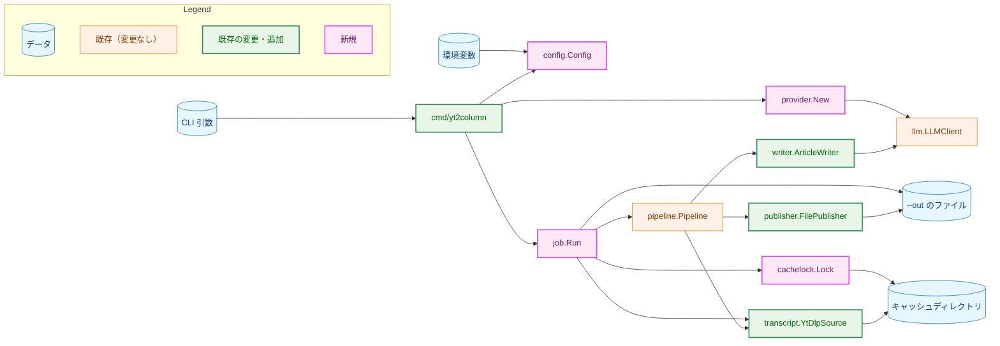
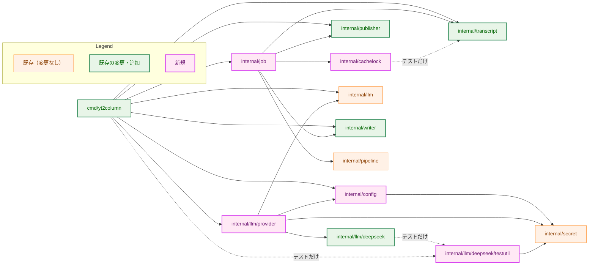
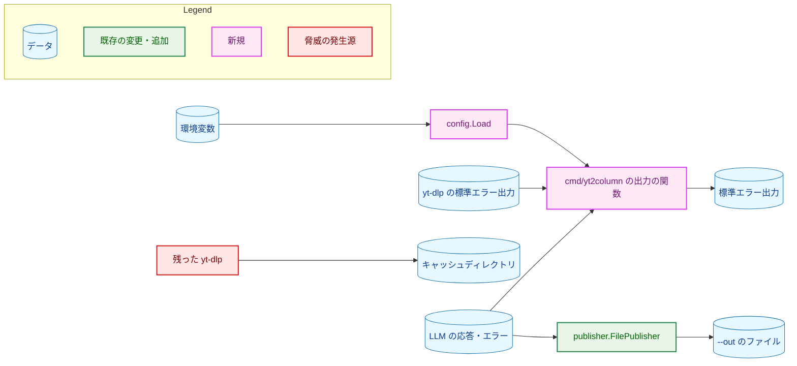
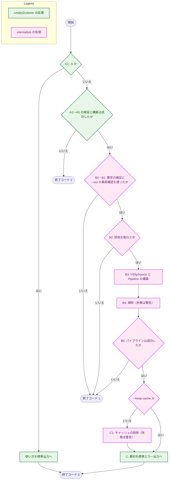
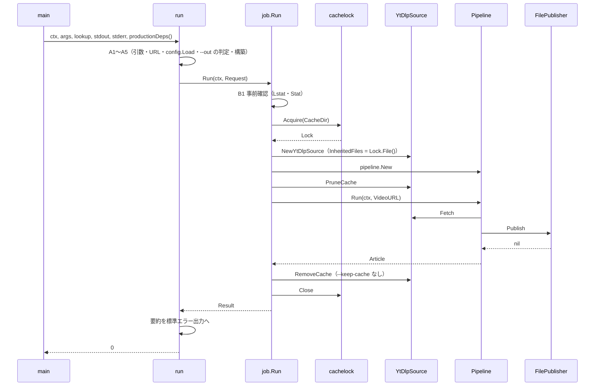
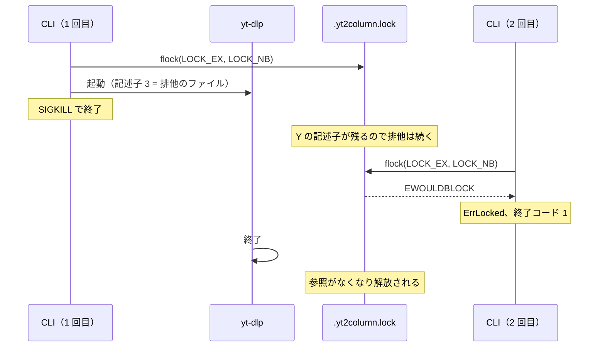

# アーキテクチャ設計書：CLI の組み立て（設定の読み込み・FilePublisher・プロバイダの選択）

## Document Status

| Item | Value |
|---|---|
| Status | `draft` |
| Created | 2026-10-05 |
| Review date | 2026-10-05 |
| Reviewer | isseis |
| Comments | 2026-10-06 決定の変更: `internal/cachelock` に、`ErrLocked` だけの契約（排他のファイルのパスはメッセージにのみ記載）に代えて、`Path` を保持する公開の `*LockedError` を加えた。公開インターフェースの変更のため、ステータスを `draft` に戻し再承認を求める。要件レベルの決定は変更していない。 2026-10-05 編集上の修正（決定の変更なし）: §8 の 1 に `test_organization.md` の例外と `TestFakesCarryBuildTag` の改修を、§8 の 9 に `package_reference.md` を各手順で更新することを書き加えた。3.11・3.12 の内容は変わらず、行う手順の位置だけを明記した（実装計画の作成時の指摘による）。 2026-10-06 編集上の修正（決定の変更なし）: 依存関係の図に、すでに存在していた `internal/llm/provider` から `secret` への依存の辺を書き加えた。設計の内容は変わっていない。 |

本書は [01_requirements.md](01_requirements.md)（以下、要件書）の設計である。既存のコードに関する記述は、コミット `274b18b` のソースで確かめた。`file:line` はこのコミットの行番号を指す。

本書では、パイプラインの 3 つの処理（字幕の取得・記事の生成・投稿）を「段階」、CLI の 1 回の実行の中の処理の順序を「手順」と呼んで区別する。F-NNN・AC-NN は要件書の項番、H-NN は [design_handoff.md](design_handoff.md) の項目（対応は 3.13）、I-NN は [implementation_handoff.md](implementation_handoff.md) の項目を指す。

## 1. 設計の全体像 (Design Overview)

### 1.1. 設計原則

-   **CLI の本体と、実行の進め方を分ける。** `cmd/yt2column` は、引数と設定の検証、標準出力・標準エラー出力、終了コードだけを持つ。実行の進め方（事前確認 → 排他 → 掃除（`PruneCache`） → パイプライン → キャッシュの削除）は新しいパッケージ `internal/job` に置き、プロバイダの選択は `internal/llm/provider` に置く。将来の localhost サーバ（#43）などからも同じ進め方を使えるようにするためである（[CLAUDE.md](../../../CLAUDE.md)「Core logic stays out of cmd/」）。
-   **終了コードは手順で決める。** エラーの文字列から終了コードを推し量らない（[CLAUDE.md](../../../CLAUDE.md)「Declare, don't infer」）。`cmd/yt2column` が副作用の前に行う検証の失敗は `2`、`job.Run` が返したエラーは `1` とする。
-   **秘密情報を読むのは `internal/config` だけ。** 他のパッケージは `config.Config` から `secret.Secret` を受け取る。
-   **上書きしないことは原子的な操作で保証する。** `--out` の事前確認は費用のかかる処理を避けるための best effort であり、保証は `FilePublisher` のハードリンクによる作成（3.5）が担う。
-   **同時の書き込みは検出ではなく排他で防ぐ。** 排他は `flock` で取り、そのファイル記述子を `yt-dlp` に引き継ぐ。CLI が SIGKILL で終了しても、`yt-dlp` が終了するまで排他が続く（H-02）。
-   **CLI が標準エラー出力に書く文字列は、1 つの関数で無害化する。** 秘密情報の伏せ字化 → 制御文字のエスケープの順に処理する（3.8）。この関数を通らない書き込み（Go のランタイムのパニック出力など）と、それが秘密情報を含まない理由も 3.8 に挙げる。
-   **既存の段階の変更は最小にする。** 必要な変更は 3.10 に理由とともに挙げる。既存の設計書の方針の例外も 3.10 に書く。

### 1.2. 概念モデル

矢印 A → B は「A が B を使う（呼び出す、または読み書きする）」を表す。



`job.Run` から `--out のファイル` への矢印は事前確認（3.6）、`job.Run` から `transcript.YtDlpSource` への矢印は掃除とキャッシュの削除を表す。

### 1.3. 既存コードとの関係

| 既存の部品 | 本タスクでの使い方 | 根拠 |
|---|---|---|
| `transcript.YtDlpSource`（`Fetch`・`RemoveCache`・`PruneCache`） | `job.Run` が構築して使う。`Options` に子プロセスへ引き継ぐファイルを足し、取り消し時にプロセスグループごと止める（3.10） | `internal/transcript/ytdlp.go:13-18`・`:50`・`:78`・`:103`、`exec.go:79-89` |
| `transcript` の動画 URL の検証 | 非公開の `validateVideoURL` を公開して CLI からも呼ぶ（3.10） | `internal/transcript/video_id.go:16` |
| `deepseek.New` | `provider.New` から呼ぶ。前後に空白のあるモデル名の番兵を公開する（3.10） | `internal/llm/deepseek/deepseek.go:53-61`、`errors.go` |
| `writer.New` | `--system-prompt`・`--user-prompt` を `writer.Options` に渡す | `internal/writer/writer.go:35-38`・`:51` |
| `writer` の表示用の文字列の検査 | `writer.Article` の公開メソッドから使い、`FilePublisher` と共有する（3.5・3.10） | `internal/writer/output.go:101-123` |
| `pipeline.New`・`Run` | そのまま使う。`Run` がエラーを返さなければ投稿は完了している（`Publish` の後に `context` を確かめない） | `internal/pipeline/pipeline.go:77`・`:88-116` |
| `secret.Secret` | 設定の API キーと Webhook URL を保持する | `internal/secret/secret.go` |
| `integrationSettingsFrom`（DeepSeek の統合テストの実行条件） | 共有のテスト用パッケージに移して、本タスクの統合テストからも使う（H-01、3.11） | `internal/llm/deepseek/integration_env_test.go:78-116` |

## 2. システム構成 (System Structure)

### 2.1. パッケージ構成

矢印 A → B は「A が B を import する」を表す。本タスクで加わる import だけを示す。



点線は、`test` または `integration` のビルドタグでだけビルドされるファイルからの import を表す。

### 2.2. コンポーネント配置

| パッケージ | ファイル | 責務 |
|---|---|---|
| `cmd/yt2column`（変更） | `main.go` | シグナルを購読した `context`、引数、`os.LookupEnv`、標準出力・標準エラー出力を `run` に渡し、戻り値で終了する |
| | `run.go`（新規） | 引数の解析、副作用の前の検証、段階の構築、`job.Run` の呼び出し、終了コードの決定 |
| | `outpath.go`（新規） | `--out` がキャッシュディレクトリの中かどうかの判定 |
| | `output.go`（新規） | 標準エラー出力に書く文字列の伏せ字化とエスケープ |
| `internal/config`（新規） | `config.go`・`cachedir.go` | 環境変数の読み込みと検証、キャッシュディレクトリの既定値 |
| `internal/llm/provider`（新規） | `provider.go` | 設定のプロバイダに応じた `LLMClient` の構築 |
| `internal/job`（新規） | `job.go` | 1 回の実行の進め方（事前確認・排他・掃除・パイプライン・キャッシュの削除） |
| `internal/cachelock`（新規） | `cachelock.go` | キャッシュディレクトリの作成と、`flock` による排他 |
| `internal/publisher`（変更） | `file.go`（新規） | `FilePublisher` |
| `internal/writer`（変更） | `article.go`（新規） | `Article.CheckPublishable`：投稿先が共通に使う検査 |
| `internal/transcript`（変更） | `video_id.go`・`ytdlp.go`・`exec.go` | 動画 URL の検証の公開、子プロセスへ引き継ぐファイル、プロセスグループの停止 |
| | `test_helpers_cache_seed.go`（新規。`test` または `integration` のタグ） | 有効なキャッシュを置く公開関数（統合テストと既存のテストが共有） |
| `internal/llm/deepseek`（変更） | `errors.go`・`deepseek.go` | 前後に空白のあるモデル名の番兵の公開 |
| | `test_helpers_endpoint.go`（新規。`test` のタグ） | ループバックの送信先で構築する公開関数（AC-10 のため） |
| `internal/llm/deepseek/testutil`（新規。`test` または `integration` のタグ） | `integration.go` | 実 DeepSeek API を呼ぶ統合テストの実行条件の判定 |

## 3. コンポーネント設計 (Component Design)

### 3.1. `internal/config`（F-001・F-002）

```go
// Provider is the LLM provider. The zero value is ProviderUnset, which no
// factory accepts.
type Provider int

const (
	ProviderUnset Provider = iota
	ProviderDeepSeek
)

// Config is the validated configuration. Its fields are unexported, so a
// non-zero Config can only come from Load.
type Config struct{ /* unexported */ }

func (c Config) Provider() Provider
func (c Config) Model() string
func (c Config) DeepSeekAPIKey() secret.Secret
func (c Config) SlackWebhookURL() (secret.Secret, bool) // false when unset
func (c Config) CacheDir() string                        // absolute
func (c Config) YtDlpPath() string                       // empty means "yt-dlp" on PATH
func (c Config) HTTP2DebugEnabled() bool                 // GODEBUG has http2debug=1 or 2

// LookupFunc has the signature of os.LookupEnv.
type LookupFunc func(name string) (value string, ok bool)

// Load reads and validates every variable and reports all invalid ones.
func Load(lookup LookupFunc) (Config, error)

var (
	ErrMissing = errors.New("environment variable is unset or empty")
	ErrInvalid = errors.New("environment variable has an invalid value")
)

// VarError names the rejected variable and a fixed reason. It never holds
// the value.
type VarError struct {
	Name   string
	Reason string
	Err    error // ErrMissing or ErrInvalid
}

func (e *VarError) Error() string // "<Name>: <Reason>"
func (e *VarError) Unwrap() error // Err
```

-   `Load` は、変数ごとに検証し、拒否した変数ごとに `*VarError` を作って `errors.Join` でまとめて返す（AC-07）。`Reason` は固定の文字列であり、値から組み立てない（AC-06）。
-   `Config` のフィールドは非公開とし、ゼロ値のほかは `Load` の検証を通った値しか作れないようにする（[CLAUDE.md](../../../CLAUDE.md)「Enforce invariants with the type」）。Webhook URL の有無は `SlackWebhookURL` の 2 つ目の戻り値で表し、別のフィールドで持たない。`Config` を `fmt`・`slog`・JSON で出力しても、`secret.Secret` が伏せ字になる（`internal/secret/secret.go:22-27`）ので秘密情報は現れない（AC-08）。
-   `YT2COLUMN_LLM_PROVIDER` は `deepseek` とのバイト列の完全一致だけを受理する。
-   `DeepSeekAPIKey` は、プロバイダが `deepseek` のとき必ず値を持つ。
-   **`GODEBUG` の HTTP/2 の記録（F-001・F-008）。** `Load` は `GODEBUG` が `http2debug=1` または `http2debug=2` を含むかどうかを、`Config.HTTP2DebugEnabled() bool` として返す。拒否はしない。Go の HTTP/2 の Transport は、この設定で `Authorization` ヘッダー（API キー）を値ごと標準エラー出力に書く（[security.md](../../dev/security.md) §2）。この出力は 3.8 の関数を通らない。要件書は、利用者がこの設定を明示的に指定した場合はデバッグを優先したものとみなし、この出力を AC-38 の対象外とする。`cmd/yt2column` は、真の場合に LLM API を呼ぶ前（手順 A3 の直後）に警告を書く（AC-51）。

#### `YT2COLUMN_CACHE_DIR` の既定値

要件書 F-001 は、プロセスの環境変数を直接読む `os.UserCacheDir` を呼ばず、`Load` が受け取った環境から同じ規則で決めることを求める。対象の OS（要件書 4.4）について、次の規則とする。

| OS（`runtime.GOOS`） | 既定値 |
|---|---|
| `darwin` | `$HOME/Library/Caches/yt2column` |
| その他の Unix | `XDG_CACHE_HOME` が空でなければ `$XDG_CACHE_HOME/yt2column`、未設定か空なら `$HOME/.cache/yt2column` |
| それ以外 | なし |

-   `XDG_CACHE_HOME` の空を未設定と同じに扱うのは、`os.UserCacheDir` と同じである。
-   **`os.UserCacheDir` との違い:** `os.UserCacheDir` は、相対パスの `HOME` をそのまま使う（相対パスの `XDG_CACHE_HOME` はエラーにする）。本設計は、決めた既定値にも `YT2COLUMN_CACHE_DIR` と同じ絶対パスの検査を適用し、相対パスになる場合は既定値を決められないものとする。相対パスのキャッシュディレクトリは、カレントディレクトリによって掃除と削除の対象が変わるためである。
-   既定値を決められない場合は、`YT2COLUMN_CACHE_DIR` の `ErrMissing` として報告する（F-001）。`Reason` には、`HOME` または `XDG_CACHE_HOME` から決められなかったことを固定の文言で書き、本当の原因が分かるようにする。

#### 環境変数を読む場所の検査（F-002・AC-09）

-   **対象の関数:** 呼び出し元が名前を選んだ環境変数の値を、呼び出し元に返す標準ライブラリの関数（`os.Getenv`・`os.LookupEnv`・`os.Environ`・`os.ExpandEnv`・`syscall.Getenv`・`syscall.Environ` など）とする。`os.ExpandEnv` のように、展開の結果として値を返すものを含む（要件書 F-002「内部で環境変数を読むものを含む」）。具体的な一覧は [implementation_handoff.md](implementation_handoff.md) I-01。
-   **対象にしない関数:** 標準ライブラリが自身の動作のために、決まった名前の変数（秘密情報ではない）を内部で読むもの（`exec.LookPath` の `PATH`、`os.TempDir`・`os.CreateTemp` の `TMPDIR`、`os.Getwd` の `PWD`、`net/http` の既定の Transport の proxy の変数など）は対象にしない。これらは呼び出し元に変数の値を返さず、秘密情報の変数を読むことがないためである。要件書 F-002 の目的（秘密情報を読む場所を限る）はこの区別で満たせる。
-   **テストのコード:** 名前が `_test.go` で終わるファイルと、ビルドの制約（`//go:build` の行）が `test` または `integration` のタグなしでは満たされないファイルを「テストのコード」とし、検査の対象外にする（制約は `go/build/constraint` で評価する）（要件書 F-002「テスト以外の Go のコード」）。`internal/transcript/test_helpers.go:291-306` の `os.LookupEnv`、`internal/llm/deepseek/testutil` の変数名の文字列はこれに当たる。
-   **既存のコード:** 上の基準で、コミット `274b18b` の本番のコードが対象の関数を参照するのは `internal/transcript/ytdlp.go:205`（`os.Environ`。許可した場所）だけである。`internal/mergepr` は `exec.CommandContext` で親の環境を子プロセスに引き継ぐ（`runner.go:19`）が、Go のコードが値を読むわけではないので対象外である。
-   `cmd/yt2column` での参照は、`main.go` が `os.LookupEnv` を `run` に渡す 1 か所だけにする。

### 3.2. `internal/llm/provider`（F-003）

```go
// LLMTimeout bounds one LLM call.
const LLMTimeout = 15 * time.Minute

// New builds the LLMClient for cfg.Provider().
func New(cfg config.Config) (llm.LLMClient, error)
```

-   `New` は `cfg.Provider()` の `switch` で分岐する。`ProviderDeepSeek` なら `deepseek.Options{APIKey, Model, Timeout: LLMTimeout}` で DeepSeek のアダプタを構築する。`default`（`ProviderUnset` と範囲外の値）は非公開の番兵 `errUnknownProvider` を返し、`LLMClient` を返さない（AC-11）。
-   `New` は、アダプタの構築関数を引数で受け取る非公開の関数 `newClient` に、本番の構築関数 `deepseek.New` を渡すだけにする。差し替えられるパッケージの変数は置かない。パッケージの中のテストは `newClient` に別の構築関数を渡す。
-   アダプタの構築のエラーは `%w` で包み、`deepseek.ErrPaddedModel`（3.10）を `errors.Is` で判別できる（AC-12）。
-   **AC-10 の確かめ方:** テストは `newClient` に、`deepseek` が `test` のタグで公開する `NewForLoopbackTest`（3.10）を呼ぶ構築関数を渡す。`httptest` のサーバが受け取った要求のモデル名と `Authorization` ヘッダーが、設定の値であることを確かめる。これは 3.10 の「方針の例外 E1」に当たる。
-   `ProviderUnset` と範囲外の値は、`config.Load` が返す `Config` には現れない。`Config` のフィールドが非公開なので、テストは `provider` パッケージの中で、プロバイダを直接与える非公開の関数を通して AC-11 を確かめる。
-   プロバイダを追加するときは、`Provider` の列挙値、`config.Load` の検証、`New` の分岐、アダプタのパッケージを足す（要件書 4.5）。`cmd/yt2column` と `internal/job` は変わらない。

### 3.3. 固定のタイムアウト（要件書 2.3）

| 対象 | 値 | 置き場所 | 理由 |
|---|---|---|---|
| `yt-dlp` の 1 回の実行 | 5 分 | `internal/job` | 既存の統合テストは 1 回の取得に 3 分の上限を設けて成功している（`internal/transcript/integration_test.go` の `integrationFetchTimeout`）。HTTP 429 の後の再試行などの余裕を足した |
| LLM の 1 回の呼び出し | 15 分 | `internal/llm/provider` | DeepSeek の API は推論の開始まで最大 10 分要求を保持しうる。生成の 5 分を足した（既存の DeepSeek の統合テストの `integrationGenerateTimeout` と同じ根拠。`integration_env_test.go:30-34`） |

タイムアウトで失敗した場合、エラーのメッセージは、どのタイムアウト（`yt-dlp` か LLM か）が何分の設定で切れたかを示す。`cmd/yt2column` は、`pipeline.StageError` の段階と `errors.Is(err, context.DeadlineExceeded)` からこの文言を選ぶ。

### 3.4. `internal/job`（F-006・F-007）

```go
// Request is one run. Writer and Publisher are built by the caller.
type Request struct {
	VideoURL  string // already validated by transcript.ValidateVideoURL
	OutPath   string // checked before the lock; never written by Run
	CacheDir  string
	YtDlpPath string
	Refresh   bool
	KeepCache bool
	Writer    writer.ArticleWriter
	Publisher publisher.Publisher
}

// Result describes a published run.
type Result struct {
	Article  writer.Article
	Warnings []error // prune and cache-removal failures
}

// YtDlpTimeout bounds one yt-dlp run.
const YtDlpTimeout = 5 * time.Minute

// Run executes one run. A nil error means the article was published.
func Run(ctx context.Context, req Request) (Result, error)
```

`Run` は次の手順で進める。

| 手順 | 内容 | 失敗時 |
|---|---|---|
| B0 | `Request` の検証（`CacheDir`・`VideoURL`・`OutPath` が空でない、`Writer`・`Publisher` が nil でも typed nil でもない。`pipeline` と同じ `nilcheck.IsNil` で判定する） | エラー |
| B1 | `OutPath` の事前確認（3.6） | エラー（`pipeline.StageError`、段階は投稿） |
| — | `ctx` が終わっていれば中断 | `ctx` のエラー |
| B2 | `cachelock.Acquire(CacheDir)`（3.7） | エラー |
| B3 | `transcript.NewYtDlpSource`（引き継ぐファイル = 排他のファイル、`ForceRefresh` = `Refresh`、タイムアウト 5 分）と `pipeline.New` | エラー |
| — | `ctx` が終わっていれば中断 | `ctx` のエラー |
| B4 | `PruneCache`。失敗は `Warnings` に足す | なし |
| B5 | `Pipeline.Run` | エラー |
| C1 | `KeepCache` でなければ `RemoveCache(VideoURL)`。失敗は `Warnings` に足す | なし |
| — | 排他を閉じて、`Result` を返す | — |

-   B3 が排他の取得の後なのは、`YtDlpSource` に排他のファイルを渡すためである。これは、構築の失敗を排他の前に終了コード `2` で報告するという要件書 F-005 の規則に対し、構築の一部を排他の後に置く例外である。B3 の構築が失敗する条件は、`NewYtDlpSource` では `CacheDir` が空か `Timeout` が正でない場合（`ytdlp.go:33-43`）、`pipeline.New` では段階が nil の場合（`pipeline.go:77-83`・`:119-127`）だけである。B0 がこれらを排他の前に確かめ、`Timeout` は `job` の定数なので、B3 の構築は失敗しない。万一失敗した場合はエラーとして返し、終了コードは `1` になる。B2 の後のどの失敗でも、`Run` は排他を閉じてから戻る。
-   `Run` がエラーを返さないことは、投稿が完了したことを意味する。B5 の `Pipeline.Run` は `Publish` の後に `context` を確かめない（`pipeline.go:112-115`）ので、B5 が成功した時点で投稿は完了している。C1 以降にシグナルを受けても、`RemoveCache` が `context` のエラーで失敗して `Warnings` に入るだけで、`Run` はエラーを返さない（F-006）。
-   B5 の前にシグナルを受けた場合は、`ctx` のエラー、または `ctx` のエラーを包んだ `pipeline.StageError` を返す。キャッシュは削除しない。
-   キャッシュの内容が不正な場合（`transcript.ErrParseSubtitles`・`ErrParseInfo`）は、`Pipeline.Run` のエラーをそのまま返す。`--refresh` の案内は、文言を出す `cmd/yt2column` が添える（3.8）。
-   B5 の `Fetch` は、`yt-dlp` の終了を `cmd.Run` で待つ（`exec.go:79-89`）。取り消し時にはプロセスグループごと止める（3.10）。したがって `Run` が戻る時点で、`Run` が起動した `yt-dlp` と、同じプロセスグループに残った子孫は終了している。子孫が自分で新しいセッションやプロセスグループを作った場合と、CLI 自身が SIGKILL で終了した場合（3.7）は除く。
-   **`cmd/` に置かない理由:** 実行の進め方は、引数や終了コードに依存しない処理であり、CLI 以外（#43 の localhost サーバなど）からも同じものを使える。`Writer` と `Publisher` を呼び出し元から受け取るのは、投稿先を選ぶのが呼び出し元だからである（#7 で Slack を加えるときも `Run` は変わらない）。

### 3.5. `FilePublisher` と `Article.CheckPublishable`（F-004）

```go
// internal/writer

var ErrInvalidArticle = errors.New("invalid article")

// CheckPublishable reports whether a publisher may output a. It never puts a
// field value in the error.
func (a Article) CheckPublishable() error
```

```go
// internal/publisher

// FilePublisher writes an article to one local file and never overwrites.
type FilePublisher struct{ /* unexported */ }

var _ Publisher = (*FilePublisher)(nil)

// NewFilePublisher returns a publisher for path. An empty path is an error.
func NewFilePublisher(path string) (*FilePublisher, error)

// Publish checks the article and creates path with its content.
func (p *FilePublisher) Publish(ctx context.Context, article writer.Article) error

var (
	ErrOutputExists = errors.New("output path already exists")
	ErrNoHardLink   = errors.New("cannot create a hard link in the output directory")
)

// KeptFileError reports that the complete article was left in a temporary
// file because linking it to the output path failed.
type KeptFileError struct {
	TempPath string
	Err      error
}

func (e *KeptFileError) Error() string
func (e *KeptFileError) Unwrap() error
```

**検査（`CheckPublishable`）。** 要件書 F-004 の拒否の条件を `writer` パッケージに置き、`FilePublisher` と将来の Slack の投稿先（#7）が共有する。`writer` の既存の表示用の文字列の検査（`output.go:113-123` の `checkDisplayString`。空白だけの値と、制御文字を含む値を拒否する）は `ErrMalformedOutput`（LLM の出力の拒否）を包む。そこで、番兵を包まずに理由だけを返す内部の関数に分ける。既存の呼び出し元はその理由を `ErrMalformedOutput` で、`CheckPublishable` は `ErrInvalidArticle` で包む。`ModelVersion` は空を受理するので、空でない場合だけこの検査を適用する。規則は次のとおりとする。

| フィールド | 拒否する条件 |
|---|---|
| `Title` | 空、空白文字だけ、制御文字（Cc）を含む |
| `Model` | 空、空白文字だけ、制御文字を含む |
| `ModelVersion` | 空でなく、制御文字を含む（空は受理） |
| `Body` | 空、空白文字だけ、`\n`・`\t` 以外の制御文字を含む |
| `SourceURL` | 空 |

`Title` と `Model` の制御文字の拒否は、要件書 F-004 の条件（`Title` の `\n`・`\r`）より広い。ファイルを `cat` などで表示するときに端末を操作されない、という F-004 の `Body` の規則の目的を、見出しとモデルの行にも当てはめるためである。実物の `ArticleWriter` はこれらを既に拒否する（`output.go:101-123`）ので、実際の実行の振る舞いは変わらない。エラーは `ErrInvalidArticle` を包み、どのフィールドがどの条件で拒否されたかを固定の文言で示す。

**書式。** ファイルの内容は次のとおりとし、`Article.Body` で終わる（AC-13）。ラベルは英語の固定文字列である（[CLAUDE.md](../../../CLAUDE.md)「Go comments, identifiers, and string literals are English」）。

```text
# <Title>

- Model: <Model>
- Model version: <ModelVersion、空なら (none)>

<Body>
```

区切りの空行は常に書く。`writer` が返す `Body` は先頭が改行で始まる場合があり、その場合は空行が 2 つ続くが、Markdown の表示は変わらない。

**作成の手段。** 上書きしないことと、途中まで書いたファイルを出力先に残さないことを、次の組み合わせで満たす。

1.  `ctx` が終わっていれば、何も作らずに `ctx` のエラーを返す（AC-17）。
2.  出力先と同じディレクトリに一時ファイル（名前は `.` で始まり `.yt2column-` を含む）を作り、内容を書き込んで `Sync` する。書き込みの途中で `ctx` が終わるか、書き込みに失敗したら、一時ファイルを削除してエラーを返す（AC-46）。
3.  一時ファイルのパーミッションを `0o644` にする。記事は公開動画から作る秘密でない文書である。umask は反映しない（Go の標準ライブラリには、プロセス全体の umask を変えずに読む手段がないため）。README にこのパーミッションを書く。
4.  `os.Link`（`link(2)`）で、一時ファイルに出力先の名前を付ける。`link(2)` は、出力先の名前に何か（通常のファイル、ディレクトリ、存在しない先を指すシンボリックリンクを含む）が既にあれば `EEXIST` で失敗し、シンボリックリンクをたどらない。存在の確認と作成が 1 つのシステムコールで行われるので、確認と作成の間に別のものが作られても上書きしない（AC-14）。
5.  **リンクに成功したら:** 出力先のディレクトリを `Sync` し、一時ファイルの名前を削除する。どちらの失敗も無視し、`Publish` は `nil` を返す。リンクの成功の後は `ctx` を確かめない。出力先に記事があるのに投稿の失敗（終了コード `1`）を報告すると、要件書の AC-44 (f) に反するためである。
6.  **リンクに失敗したら:** 原因にかかわらず一時ファイルを残し、`*KeptFileError` を返す。原因が `EEXIST` なら `ErrOutputExists` を、`EPERM`・`ENOTSUP`・`EOPNOTSUPP`・`EXDEV`・`EMLINK`（ハードリンクを作れないファイルシステムが返すもの）なら `ErrNoHardLink` を包む。それ以外（`EACCES`・`ENOSPC`・`EROFS` など）は元のエラーを包む。完成した記事は LLM API の料金をかけて作ったものなので、捨てずに一時ファイルとして残し、そのパスを利用者に示す。

出力先の名前に現れるのは、すべてを書き終えて `Sync` したファイルだけである。上の 1〜6 のどこで失敗しても、出力先の名前には何も作られない（AC-15・AC-17・AC-46）。

> **なぜ `O_CREATE|O_EXCL` で出力先を直接作らないか:** 直接作ると、書き込みの途中でプロセスが SIGKILL で終了した場合に、途中まで書いたファイルが出力先に残る。失敗時に削除する方法も、削除の前に終了すれば残る。ハードリンクなら、出力先の名前は完成したファイルにしか付かない。

### 3.6. `--out` の検証と事前確認（F-005・F-006・H-03）

**キャッシュディレクトリの中かどうか（`cmd/yt2column`、終了コード `2`）。** 設定を読み込んだ直後に、`--out` がキャッシュディレクトリそのもの、またはその中を指すかを判定する。判定は「中ではないと確かめられない場合は中とみなす」（fail closed）とし、次の性質を満たす。

-   `--out` は、カレントディレクトリを基準に、カーネルと同じ順序（シンボリックリンクを解決してから `..` を適用する）で解決する。字面の上で `..` を先に取り除かない。字面の整理は、`..` の手前のシンボリックリンクをたどったときの位置と食い違うためである。
-   存在する部分は、ファイルの同一性（`os.SameFile`）でキャッシュディレクトリと比べる。大文字と小文字を区別しないファイルシステム（macOS の既定）で綴りの大小だけが違うパスや、バインドマウントなどの別名も同じディレクトリと判定する。
-   存在しない部分（キャッシュディレクトリがまだない場合を含む）は、名前を大文字と小文字を区別せずに比べる。区別するファイルシステムでは、綴りの大小だけが違う別のディレクトリを「中」と誤判定しうるが、利用者が `--out` を変えれば済み、安全側に倒れる。
-   キャッシュディレクトリの側も同じ規則で解決する（途中にシンボリックリンクがある場合、まだ存在しない場合を含む）。
-   存在しない部分の後の `..` のように、カーネルなら `ENOENT` になる位置まで解決できない場合も、判定の途中の `Lstat` などがエラーになった場合（権限の不足など）も、「中」とみなす。
-   **安全側に倒すことによる誤判定:** キャッシュディレクトリがまだ存在しないときに、`<キャッシュディレクトリ>/../article.md` のように、キャッシュディレクトリを経由して外へ出るパスを指定すると、実際には外を指していても「中」と判定して拒否する。存在しない部分の後の `..` は解決できないためである。キャッシュディレクトリが存在すれば、シンボリックリンクを解決してから `..` を適用するので、正しく「外」と判定する。利用者は `..` を含まないパスを指定すれば避けられる。

> **残る制約:** 判定の後で、`--out` の途中のディレクトリをキャッシュディレクトリへのシンボリックリンクに置き換えると、判定をすり抜ける。キャッシュディレクトリは利用者だけが書き込める前提であり（[cache_consistency.md](../../dev/cache_consistency.md) P2）、利用者自身がこの置き換えを行う場合は対象外とする。

**事前確認（`internal/job` の B1、終了コード `1`、H-03）。** 排他の取得の前に、次を確かめる。どちらもファイルを開かず、作らない。

| 確認 | 結果 | 扱い |
|---|---|---|
| `--out` に `os.Lstat`（シンボリックリンクをたどらない） | 成功（何かが存在する） | `publisher.ErrOutputExists` を包んだ `pipeline.StageError`（段階は投稿）で失敗（AC-50） |
| | `fs.ErrNotExist` | 次の確認へ |
| | その他のエラー | 存在すると決めつけず、次の確認へ（best effort） |
| `--out` の親に `os.Stat` | ディレクトリでない、または存在しない | 投稿の段階の失敗（`FilePublisher` が必ず失敗する条件を、費用のかかる処理の前に報告する。要件書 F-006・AC-52） |
| | その他のエラー | 先へ進む |

上書きしないことの保証は、`FilePublisher` の `link(2)` が担う。事前確認とはコードを共有しない。事前確認は `Lstat`・`Stat` による判定であり、`FilePublisher` は `link(2)` の結果で決めるので、共有できる部分がないためである。

### 3.7. `internal/cachelock`（F-007・H-02）

```go
// Lock is an exclusive flock(2) lock on a file in the cache directory.
type Lock struct{ /* unexported */ }

// Acquire creates dir with mode 0o700 when it is missing and takes the lock
// without waiting.
func Acquire(dir string) (*Lock, error)

// File returns the locked file so a child process can inherit the lock.
func (l *Lock) File() *os.File

// Close releases this process's reference to the lock.
func (l *Lock) Close() error

var ErrLocked = errors.New("another run holds the cache directory lock")

// LockedError reports that another run holds the lock and carries the lock
// file path.
type LockedError struct {
	Path string
	Err  error // ErrLocked
}

func (e *LockedError) Error() string
func (e *LockedError) Unwrap() error
```

-   `Acquire` は、キャッシュディレクトリを `0o700` で作り（既存のディレクトリのパーミッションは変えない）、その中の固定の名前 `.yt2column.lock` を開いて、待たずに `flock` の排他を取る。
-   排他のファイルは、シンボリックリンクをたどらず、通常のファイルでなければ拒否し、新しく作る場合は `0o600` とする（[security.md](../../dev/security.md) §5）。読み取り専用で開く（`flock` は読み取り専用の記述子でも排他を取れる）。名前付きパイプなどが置かれていても、開くときに待ち続けないようにする。
-   `flock` が `EWOULDBLOCK` で失敗したら、`ErrLocked` を包んだ `*LockedError` を返す（AC-34・AC-49）。`*LockedError` は排他のファイルのパスを `Path` として保持し（`errors.AsType` で取得できる）、メッセージでは、そのパス、前の実行が起動した `yt-dlp` が残っている可能性とその確かめ方（`lsof <パス>` など）、終了を待つか止めてから再実行すればよいことを示す（F-007）。それ以外の失敗は `ErrLocked` を包まずに返す（AC-47）。
-   排他のファイルは削除しない。残っていても、`flock` を保持するプロセスがなければ次の `Acquire` は成功する（AC-36）。削除すると、削除と作成の間に別のプロセスが別の inode に排他を取る競合が生じる。
-   **掃除と削除の対象にならないこと（AC-37）:** 掃除の候補は、名前が `<11 文字の動画 ID>.<a|b|current|current.tmp>` に完全に一致するものだけである（`internal/transcript/cache.go:403-415` の `pruneCandidateID`）。`.yt2column.lock` は `.` の前が空なので動画 ID の検証に通らず、候補にならない。`RemoveCache` は、検証済みの動画 ID から組み立てた名前だけを扱う（`ytdlp.go:78-98`）。この性質は、`internal/cachelock` のテストが、排他のファイルを置いたキャッシュディレクトリで `PruneCache` を呼んで確かめる（2.1 の点線）。
-   **`internal/transcript` に置かない理由:** 排他は 1 回の実行全体（掃除・字幕の取得・記事の生成・投稿・キャッシュの削除）にかかる。`transcript` は、同じキャッシュディレクトリに対する操作を直列にすることを呼び出し元に求めている（[cache_consistency.md](../../dev/cache_consistency.md) P1、`ytdlp.go:100-102`）ので、排他は呼び出し元の部品とする。

#### 排他を `yt-dlp` に引き継ぐ（H-02）

-   `flock` の排他は、開いたファイル記述（open file description）に結び付き、それを参照するすべての記述子が閉じるまで解放されない（macOS・Linux とも。`flock(2)`）。`job.Run` は `Lock.File()` を `transcript.Options` の引き継ぐファイル（3.10）として渡し、`yt-dlp` は記述子 3 としてこのファイルを受け取る。
-   CLI が SIGKILL で終了すると、CLI の記述子は閉じるが、`yt-dlp` の記述子が残るので排他は続く。次の実行は `ErrLocked` で終了する（AC-49）。`yt-dlp` が終了すると解放される。
-   `fcntl` のレコードロック（POSIX ロック）は使わない。プロセスに結び付き、子プロセスに引き継がれず、同じプロセスの別の記述子を閉じただけで解放されるためである。`flock` は開くたびに別のファイル記述になるので、同じプロセスの中のテストで 2 つ目の `Acquire` が `ErrLocked` になる（AC-34 のユニットテストが書ける）。
-   Go の `os.OpenFile` は記述子に close-on-exec を付け、`exec.Cmd.ExtraFiles` に渡したファイルだけが子プロセスに渡る。`yt-dlp` 以外のプロセスに排他が漏れることはない。
-   `yt-dlp` が起動する子プロセス（`deno`・`ffmpeg` など）が記述子 3 を引き継ぐかは、`yt-dlp` の実装による。Python の `subprocess` は既定で `close_fds=True` なので引き継がないと考えられる。引き継いでも、排他が長く保持されるだけで安全側に倒れる。SIGINT・SIGTERM の場合はプロセスグループごと止めるので、子孫が排他を保持し続けることもない（3.10）。実装時に、実際の `yt-dlp` の子プロセスの記述子を確かめる（8 章）。
-   CLI が SIGKILL で終了した後に残った `yt-dlp` には、タイムアウトがかからない（タイムアウトは CLI の `context` による）。ネットワークで止まったまま終了しない場合、利用者が止めるまで後の実行は `ErrLocked` で失敗し続ける。メッセージの案内で対処する（F-007）。残るリスクとして受け入れる。

> **なぜ `golang.org/x/sys/unix` を使わないか:** 外部のモジュールは追加しない（要件書 §5）。`syscall.Flock` は darwin と linux の標準ライブラリにある。パッケージは `//go:build unix` にする（要件書 4.4）。

### 3.8. `cmd/yt2column`（F-005・F-008）

```go
// deps are the constructors run uses. main passes productionDeps().
type deps struct {
	newLLMClient func(config.Config) (llm.LLMClient, error)
	newWriter    func(llm.LLMClient, writer.Options) (writer.ArticleWriter, error)
	newPublisher func(path string) (publisher.Publisher, error)
}

// productionDeps returns the real constructors. main and the integration
// test both use it, so the test runs the same assembly as the CLI.
func productionDeps() deps

// run executes one CLI invocation and returns the process exit code.
func run(ctx context.Context, args []string, lookup config.LookupFunc,
	stdout, stderr io.Writer, d deps) int
```

-   **`main`:** `signal.NotifyContext` で SIGINT・SIGTERM を購読した `context` を作り、`run` に渡して、戻り値で `os.Exit` する。`context` が終わったら購読を止めて既定の扱いに戻す。2 回目のシグナルはプロセスを既定の扱いで終了させ（終了状態はシグナルによる終了になり、`1` ではない）、`run` が止まったままでも利用者が止められる。
-   **SIGHUP:** 起動時に SIGHUP が無視されていない場合（`signal.Ignored` が偽）に限り、SIGHUP も同じく購読する。端末や ssh の接続が切れたときも `yt-dlp` を止めてから終了するためである。`nohup` などで無視された状態で起動した場合は購読しない。購読すると Go は無視の設定を上書きし、`nohup` の意味がなくなるためである。
-   **`deps`:** 本番の値は `provider.New`・`writer.New`・`publisher.NewFilePublisher` である。ユニットテストは、fake の `LLMClient`（AC-22・AC-38）、fake の `ArticleWriter`（AC-39 の成功の経路）、fake の `Publisher`（AC-31 の投稿中の中断、AC-39 の成功の経路）を返すものに差し替える。`productionDeps` はビルドタグのない `run.go` に置くので、統合テストからも使える。
-   **出力:** 標準出力には `-h`・`--help` の使い方だけを書く（AC-44 (b)）。`flag.FlagSet` の出力先は `io.Discard` にし、解析の誤りは `run` が標準エラー出力に書く。

`run` は次の手順で処理する。A1〜A5 は副作用を持たない（3.9）。

| 手順 | 内容 | 失敗時 |
|---|---|---|
| A1 | 引数の解析（`flag.FlagSet`、`ContinueOnError`）。`-h`・`--help` は使い方を標準出力に書いて `0` | `2` |
| A2 | 位置引数がちょうど 1 つか。動画 URL を `transcript.ValidateVideoURL` で検証 | `2` |
| A3 | `config.Load`。`HTTP2DebugEnabled` が真なら警告を書く | `2` |
| A4 | `--out` がキャッシュディレクトリの中か（3.6） | `2` |
| A5 | `d.newLLMClient`、`d.newWriter`、`d.newPublisher` | `2` |
| B | `job.Run`。`Warnings` は警告として書く | エラーなら `1` |
| C | 要約（出力先のパス、`Model`、`ModelVersion`）を標準エラー出力に書く | `0` |

`writer.New` はテンプレートの上書きファイルを読むだけで書き込まない（`writer.go:51-65`）。したがって終了コード `2` の経路では、排他のファイルもキャッシュディレクトリも変わらない（AC-20・AC-44 (e)）。

#### 実行経路の一覧との対応

| 要件書の経路 | 手順 | 終了コード |
|---|---|---|
| 成功 | C | `0` |
| `-h`・`--help` | A1 | `0` |
| 引数の誤り | A1・A2・A4 | `2` |
| 環境変数の誤り | A3 | `2` |
| `LLMClient` の構築の失敗 | A5 | `2` |
| テンプレートの構築の失敗 | A5 | `2` |
| 字幕の取得・記事の生成・投稿の失敗 | B（B5） | `1` |
| `--out` が既存（事前確認） | B（B1） | `1` |
| 掃除または削除の失敗による警告 | B（B4・C1） | `0` |
| キャッシュディレクトリの作成または排他の取得の失敗 | B（B2） | `1` |
| 同時実行の検出 | B（B2） | `1` |
| 実行中の SIGINT・SIGTERM | B | `1` |

#### 標準エラー出力の無害化

標準エラー出力に書く文字列は、すべて `output.go` の 1 つの関数を通す。この関数は、組み立て終えた 1 行ごとに次の順に処理する。

1.  **伏せ字化:** `DEEPSEEK_API_KEY` と（設定されていれば）`SLACK_WEBHOOK_URL` の値と、それぞれの末尾 8 文字を、固定の印に置き換える（AC-38）。値が 8 文字以下なら値そのものだけを置き換える。
2.  **エスケープ:** 印字できない文字（`strconv.IsPrint` が偽の文字。制御文字、`U+202E` などの書式文字を含む）、不正な UTF-8 のバイト、バックスラッシュを、`strconv.Quote` と同じ形式でエスケープする（AC-39）。バックスラッシュもエスケープするのは、もとの文字列にある `\x1b` という 4 文字と、エスケープした ESC を見分けるためである。

-   伏せ字化をエスケープより先に行うのは、エスケープで値の見た目が変わると、伏せ字化で見つけられなくなるためである。
-   信頼できない文字列（`yt-dlp` の標準エラー出力、LLM のエラーのメッセージ、`Model`・`ModelVersion` など）の改行は、他の制御文字と同じくエスケープし（`\n` と書く）、1 つのメッセージを 1 行で書く。要件書 AC-39 は、改行がそのままの形で現れないことを求める。偽の行を始める改行も、エスケープされるので本物の行と見分けられる。複数行の `yt-dlp` の出力は 1 行に潰れて読みにくくなるが、AC-39 を優先する。
-   CLI 自身が組み立てる複数の項目（`config.Load` が `errors.Join` で返す各 `VarError`、複数の警告）は、`errors.Join` などで連結した文字列のまま無害化せず、項目ごとに別の行として書く。各項目の文字列は CLI の固定の文言と変数名だけからなり、改行を含まない。
-   `Model`・`ModelVersion`・出力先のパス・エラーのメッセージは、いずれも同じ関数を通す。
-   **この関数を通らない書き込み:** Go のランタイムのパニックの出力、SIGQUIT によるゴルーチンの一覧、`GODEBUG` による標準ライブラリの記録は、標準エラー出力に直接書かれる。パニックとゴルーチンの一覧はスタックトレースであり、秘密情報は `secret.Secret`（クロージャに閉じ込めた値）として持つので値は表示されない。`GODEBUG` の HTTP/2 の記録は API キーを含みうるが、要件書 F-008 の例外であり、手順 A3 の直後に警告する（3.1・AC-51）。
-   **`--out` のファイルに秘密情報が入らない理由:** ファイルの内容は `Article` から作る。`Article` は LLM の生成テキストと検証済みの動画 ID から作られ（[0004 の 02_architecture.md](../0004_article_writer/02_architecture.md) §3.7・§3.9）、API キーと Webhook URL は LLM に送らない（[security.md](../../dev/security.md) §4。API キーは `Authorization` ヘッダーだけに入る）。
-   **書き込めない標準エラー出力:** 標準エラー出力が閉じたパイプの場合、書き込みで SIGPIPE を受けてプロセスが終了しうる。要約（手順 C）の書き込みで起きると、投稿は完了しているのに終了状態が `0` でなくなる。利用者の環境の問題として受け入れる。

#### メッセージの形

-   エラーは `yt2column: <手順の説明>: <エラー>` の形で書く。パイプラインの段階の失敗は段階の名前を含む（AC-23）。事前確認（B1）の失敗も、段階は投稿として書く。
-   使い方の誤り（終了コード `2`）は、`yt2column -h` で使い方を見られることを添える。
-   設定の誤りは、`VarError` ごとに 1 行にする。
-   キャッシュの内容が不正な場合（`errors.Is` で `transcript.ErrParseSubtitles` または `ErrParseInfo`）は、`--refresh` で再実行すれば回復できることを添える（AC-48）。
-   `publisher.KeptFileError` は、記事を残した一時ファイルのパスを添える。
-   タイムアウトは、どのタイムアウトが何分の設定で切れたかを添える（3.3）。

### 3.9. 副作用の契約

| 手順 | ファイルシステム | `yt-dlp` | LLM API | `--out` |
|---|---|---|---|---|
| A1〜A5（終了コード `2` の経路） | 読むだけ（テンプレートの上書きファイル、`--out` の判定） | 起動しない | 呼ばない | 作らない |
| B1 | `Lstat`・`Stat` だけ | 起動しない | 呼ばない | 作らない |
| B2 | キャッシュディレクトリの作成、排他のファイルの作成 | 起動しない | 呼ばない | 作らない |
| B4 | dangling なエントリの削除 | 起動しない | 呼ばない | 作らない |
| B5 | キャッシュの読み書き、`--out` のディレクトリの一時ファイルと出力先の作成 | キャッシュがない、または `--refresh` のとき起動 | 1 回 | 成功時だけ作る |
| C1 | その動画のキャッシュの削除 | 起動しない | 呼ばない | 変えない |

`--refresh` は B5 の `Fetch` がキャッシュを読まずに `yt-dlp` を起動するかどうかだけを変える。`--keep-cache` は C1 を飛ばすだけである。どちらも他の手順の副作用を変えない。

### 3.10. 既存パッケージの変更と、既存の方針の例外（要件書 §5）

| パッケージ | 変更 | 理由 | 影響する既存のテスト |
|---|---|---|---|
| `internal/transcript` | `validateVideoURL` を `ValidateVideoURL(rawURL string) (videoID, normalizedURL string, err error)` として公開する。内容は変えない | 終了コード `2` の誤りを `yt-dlp` の起動前に検出するため、CLI が `YtDlpSource` と同じ規則で検証する（F-005）。規則を複製しない | `video_id_test.go`（関数名の変更だけ） |
| `internal/transcript` | `Options` に `InheritedFiles []*os.File` を足し、`commandExecutor.Run` の引数に加えて `exec.Cmd.ExtraFiles` に渡す | 排他を `yt-dlp` に引き継ぐ（H-02）。`transcript` は排他の意味を知らず、「子プロセスに引き継ぐファイル」として扱う | `exec_test.go` の `osExecutor.Run` の呼び出し、`test_helpers.go` の `fakeCommandExecutor`（引数の追加だけ） |
| `internal/transcript` | `osExecutor.Run` で、`yt-dlp` を新しいプロセスグループで起動し、`context` の終了時にはグループ全体に SIGKILL を送る（`exec.Cmd.SysProcAttr` と `exec.Cmd.Cancel`。既存の取り消しと同じく SIGKILL とする） | `exec.CommandContext` の既定の取り消しは直接の子プロセスだけを止める（`exec.go:80`）。`YT2COLUMN_YTDLP_PATH` がラッパーのスクリプトや PyInstaller の単一ファイル版の場合、本物の `yt-dlp` が残って排他を保持し続け、AC-45 を満たせない | `exec_test.go`（取り消しのテストを追加） |
| `internal/transcript` | `test_helpers_cache_seed.go`（`test` または `integration` のタグ）に、有効なキャッシュを置く公開関数 `SeedCacheForTest(dir, videoID string, subtitles, info []byte) error` を足す。`-tags integration` だけのビルドでも使えるよう、`test` のタグのファイルの補助（`placeSlot` など）は使わず、本番のキャッシュの書き込みの関数（`prepareWriteSlot`・`persistSlot`・`commitCache`。`cache.go:211`・`:238`・`:272`）で置く。既存の `placeRealCache`（`test_helpers.go:169-176`）はこれを呼ぶ | 統合テスト（F-009）が、キャッシュの配置の規則を複製せずにキャッシュを置くため | `test_helpers.go`（`placeRealCache` の中身の置き換え） |
| `internal/llm/deepseek` | `errPaddedModel` を `ErrPaddedModel` として公開する | AC-12（例外 E2） | なし（`errPaddedModel` を参照するテストはない） |
| `internal/llm/deepseek` | `test_helpers_endpoint.go`（`test` のタグ）に `NewForLoopbackTest(t testing.TB, opts Options, endpoint string) llm.LLMClient` を足す。既存の `validateLoopbackEndpoint` で送信先を検査し、ループバック以外なら `t.Fatal` する | AC-10（例外 E1） | なし |
| `internal/llm/deepseek` | `integration_env_test.go` の判定と、`makefile_test.go` の `make` の実行の補助を `internal/llm/deepseek/testutil` へ移す（3.11） | H-01、新しいターゲットのテストとの共有 | `deepseek_test.go:765-790` の判定のテスト、`makefile_test.go` |
| `internal/writer` | `Article.CheckPublishable` と `ErrInvalidArticle` を足す。`checkDisplayString` を、番兵を包まない内部の関数に分ける | 投稿先の検査を共有する（3.5） | `output_test.go`（`ErrMalformedOutput` の判別は変わらないことを確かめる） |

`internal/transcript` の変更は、キャッシュの読み書きの順序に触れない。[cache_consistency.md](../../dev/cache_consistency.md) §7 のチェックリストの対象（`cache.go`・`ytdlp.go` の書き込み・削除の順序）は変わらない。

**プロセスグループで起動することの影響。** 端末の Ctrl-C（SIGINT）は、端末のフォアグラウンドのプロセスグループに届く。`yt-dlp` を別のグループにすると、Ctrl-C は CLI にだけ届き、`yt-dlp` は CLI の取り消しで止まる。`yt-dlp` が CLI より先に SIGINT で終了して、利用者に「中断」ではなく `yt-dlp` の失敗とスタックトレースが見えてしまう事態を避けられる。CLI が SIGKILL で終了した場合、残った `yt-dlp` には端末の SIGINT・SIGHUP も届かないが、排他を保持し続けるだけで安全側に倒れる（3.7）。

#### 既存の設計書の方針の例外

-   **E1（ループバックの送信先の公開）:** [0003 の 02_architecture.md](../0003_deepseek_llm_client/02_architecture.md) の §1.1 の原則 5、§3.1（送信先の項）、H-06 への対応、ファイルの表の `test_helpers.go` の行、§3.9 の決定の記録は、送信先を差し替えるテスト用の関数を非公開にし、「`-tags test` のビルドでも他のパッケージ（#6 やパイプラインのテスト）からは呼べない」とする。本設計は、ループバックの送信先で構築する関数を `test` のタグで公開する。理由は、要件書 AC-10 が「構築したクライアントがテスト用の送信先へ設定のモデル名と API キーで要求を送ることで確認する」と求めるためである。失われる保証は、「他のパッケージの `test` のビルドからは、クライアントをループバックへ向けられない」ことである。本番のビルドには含まれず、送信先はループバックに限るので、API キーが外部のホストへ送られる経路は増えない。この「非公開であること」を確かめる既存のテストはない。
-   **E2（構築の番兵の公開）:** 0003 の §3.1 は「構築のエラーは非公開の静的エラーをラップして作る。公開の番兵は定義しない。呼び出し元（#6）が種類で分岐する必要はない」とする。本設計は `ErrPaddedModel` だけを公開する。要件書 AC-12 が、前後の空白を理由に拒否したことを `errors.Is` で判別することを求めるためである。他の構築のエラーは非公開のままとする。これを確かめる既存のテストはない。

### 3.11. 統合テスト（F-009・H-01）

**実行条件の判定の共有（H-01）。** `internal/llm/deepseek/integration_env_test.go` の `integrationSettingsFrom` を、`internal/llm/deepseek/testutil`（`package deepseektestutil`）へ移す。

```go
// MissingKeyAction is what the test does when the opt-in is set but the test
// API key is not.
type MissingKeyAction int

const (
	MissingKeyFail MissingKeyAction = iota
	MissingKeySkip
)

// IntegrationOptions names the opt-in variable, the make target shown in
// the skip reason, and the missing-key action.
type IntegrationOptions struct {
	OptInEnv   string
	MakeTarget string
	MissingKey MissingKeyAction
}

// IntegrationAction is what the integration test does. The zero value skips.
type IntegrationAction int

const (
	ActionSkip IntegrationAction = iota
	ActionFail
	ActionRun
)

// IntegrationSettings is the outcome of reading the environment.
type IntegrationSettings struct {
	Action IntegrationAction
	Reason string // never contains the API key
	APIKey secret.Secret
	Model  string
}

// SettingsFrom decides whether an integration test that calls the real
// DeepSeek API runs.
func SettingsFrom(getenv func(string) string, opts IntegrationOptions) IntegrationSettings
```

-   判定の順序と内容は既存のものと同じである（オプトインが `1` でなければスキップ、テスト用のキーがなければ `MissingKey` に従う、モデル名がなければ失敗、`GODEBUG` が `http2debug=1`・`http2debug=2` を含めば失敗）。
-   **キーがない場合を選べるようにする理由:** 既存の DeepSeek の統合テストは、テスト用のキーがない場合にスキップすることを、0003 の要件（[0003 の 01_requirements.md](../0003_deepseek_llm_client/01_requirements.md) F-006・AC-23）として承認済みである。本タスクの AC-40 は失敗を求める。どちらも承認済みの要件なので、片方に揃えずに呼び出し側が選ぶ。既存のテストは `MissingKeySkip` を渡して振る舞いを変えない。
-   ゼロ値は、`IntegrationAction` が「スキップ」、`MissingKeyAction` が「失敗」である。前者は「実行するかどうか」で、実行しないのが料金の発生しない側である。後者は「キーがないときにどう報告するか」で、スキップは成功と見分けにくいので、失敗が安全側である。どちらの場合も料金の発生する呼び出しはしない。
-   `getenv` を `config.LookupFunc` にしないのは、統合テストの判定がプロセスの環境変数を読む（`os.Getenv`）ことを前提とし、空と未設定を区別しないという既存の判定の振る舞いを変えないためである。
-   ビルドタグは、テスト用パッケージの規則（[test_organization.md](../../dev/developer_guide/test_organization.md) の `//go:build test`）と異なり `test || integration` とする。統合テストは `-tags integration` だけでビルドされる（`Makefile` の `test-integration-deepseek`）ため、`test` のタグだけでは統合テストから使えない。既存の `integration_env_test.go` と同じ理由である。
-   この例外は、規則と、規則を確かめるテストを同じ変更で更新して明文化する。
    -   `test_organization.md` に、「統合テストからも使う補助（`testutil/` のファイルと `test_helpers_*.go`）は `//go:build test || integration` とする」という例外を足す。
    -   既存の `TestFakesCarryBuildTag`（`internal/pipeline/pipeline_test.go:514-534`）は、`../*/testutil/*.go` だけを数え、件数を 8 に固定している。`internal/llm/deepseek/testutil` のように 1 段深い `testutil/` は対象にならず、例外の行も黙って通り抜ける。このテストを、`internal` の下のすべての `testutil/` を数え、1 行目が `//go:build test` か `//go:build test || integration` のどちらかであることを確かめる形に改める。件数の固定は新しい件数に合わせる。
-   オプトインの変数は、本タスク専用の `YT2COLUMN_CLI_INTEGRATION` とする。`make` のターゲットと 1 対 1 に対応させるためである。

**テストの組み立て。** `cmd/yt2column/integration_test.go`（`integration` のタグ）に置く。

-   一時ディレクトリをキャッシュディレクトリとし、`testdata/2tcCWM-sRBw.ja.json3` と `testdata/2tcCWM-sRBw.info.json` を `transcript.SeedCacheForTest` で有効なキャッシュとして置く。
-   `YT2COLUMN_YTDLP_PATH` には、起動されたら印のファイルを作って失敗するスクリプト（トリップワイヤ）を指定する。
-   `run` に与える環境は、テストが組み立てた `config.LookupFunc` とする。`DEEPSEEK_API_KEY` には `SettingsFrom` が返したテスト用のキーを入れる。プロセスの環境変数は変更しない。`productionDeps()` を渡し、`run` を `--out <一時ディレクトリのファイル> https://www.youtube.com/watch?v=2tcCWM-sRBw` で呼ぶ（F-009 の「CLI と同じ組み立て」）。
-   `make test-integration-cli` を追加する。`YT2COLUMN_CLI_INTEGRATION=1` と、未定義のときだけ `deepseek-flash` にする `YT2COLUMN_MODEL` を、このターゲットのレシピにだけエクスポートする。`go test` の `-timeout` は 20 分とする（LLM の 1 回の呼び出しの 15 分に余裕を足す）。
-   新しいターゲットの引数、`-timeout` が `provider.LLMTimeout` より長いこと、オプトインがこのターゲットにだけエクスポートされること、2 つのターゲットが互いのオプトインをエクスポートしないことを確かめるテストは、`cmd/yt2column/makefile_test.go` に置く。`internal/llm/deepseek` のテストからは `provider` を import できない（`provider` が `deepseek` を import するので循環する）ためである。`make` を偽のコマンドで実行する既存の補助（`internal/llm/deepseek/makefile_test.go:59` の `runMakeTarget` と、その子プロセスの環境の allowlist）は、`internal/llm/deepseek/testutil` に移して両方から使う。移した補助は、リポジトリの根のパス、記録する環境変数の名前の一覧、モデル名の変数の名前を引数で受け取る。補助が参照していた定数（オプトインやモデル名の変数名）は `deepseektestutil` が公開し、既存の `deepseek` のテストもそれを使う。
-   `Makefile` は、新しいターゲットを `.PHONY` に足し、`go vet -tags integration` の行の上のコメントに新しいターゲットを加える。既存の `TestMakeOptInExportedToDeepSeekTargetOnly` は、新しいオプトインの変数も対象に含める。
-   LLM API の呼び出しが 1 回であることの確かめ方は、実装計画で決める（[implementation_handoff.md](implementation_handoff.md) I-04）。

### 3.12. コンポーネント責務表

| ファイル | 新規・変更 | 責務 | 関係する要件 |
|---|---|---|---|
| `cmd/yt2column/main.go` | 変更 | シグナルの購読、プロセスの境界を `run` に渡す | F-005・F-006 |
| `cmd/yt2column/run.go` | 新規 | 引数の解析、副作用の前の検証、段階の構築、`job.Run`、終了コード、`productionDeps` | F-005 |
| `cmd/yt2column/outpath.go` | 新規 | `--out` がキャッシュディレクトリの中かの判定 | F-005 |
| `cmd/yt2column/output.go` | 新規 | 伏せ字化とエスケープ | F-008 |
| `cmd/yt2column/integration_test.go` | 新規 | 統合テスト | F-009 |
| `internal/config/config.go`・`cachedir.go` | 新規 | `Load`・`Config`・`Provider`・番兵、キャッシュディレクトリの既定値 | F-001 |
| `internal/config/envaccess_test.go` | 新規 | 環境変数を読む場所の検査 | F-002 |
| `internal/llm/provider/provider.go` | 新規 | `New`・`LLMTimeout` | F-003 |
| `internal/job/job.go` | 新規 | 実行の進め方 | F-006・F-007 |
| `internal/cachelock/cachelock.go` | 新規 | キャッシュディレクトリの作成と排他 | F-007 |
| `internal/publisher/file.go` | 新規 | `FilePublisher` | F-004 |
| `internal/writer/article.go` | 新規 | `Article.CheckPublishable`・`ErrInvalidArticle` | F-004 |
| `internal/transcript/video_id.go`・`ytdlp.go`・`exec.go` | 変更 | `ValidateVideoURL`、引き継ぐファイル、プロセスグループの停止 | F-005・F-006・F-007 |
| `internal/transcript/test_helpers_cache_seed.go` | 新規 | `SeedCacheForTest` | F-009 |
| `internal/transcript/test_helpers.go`・`exec_test.go`・`video_id_test.go` | 変更 | 上の変更への追従 | — |
| `internal/llm/deepseek/errors.go`・`deepseek.go` | 変更 | `ErrPaddedModel` の公開 | F-003 |
| `internal/llm/deepseek/test_helpers_endpoint.go` | 新規 | `NewForLoopbackTest` | F-003 |
| `internal/llm/deepseek/integration_env_test.go`・`integration_test.go`・`deepseek_test.go`・`makefile_test.go` | 変更 | 実行条件の判定と `make` の実行の補助の移動への追従 | F-009 |
| `cmd/yt2column/makefile_test.go` | 新規 | `test-integration-cli` のターゲットのテスト | F-009 |
| `internal/llm/deepseek/testutil/integration.go`・`make.go` | 新規 | 統合テストの実行条件、`make` を偽のコマンドで実行する補助 | F-009 |
| `internal/pipeline/pipeline_test.go`・`docs/dev/developer_guide/test_organization.md` | 変更 | `testutil/` のビルドタグの規則の例外と、それを確かめるテスト（入れ子の `testutil/` も数える） | F-009 |
| `Makefile` | 変更 | `test-integration-cli`、`.PHONY`、`go vet -tags integration` の行のコメント | F-009 |
| `README.md`・`docs/dev/project_overview.md`・`docs/dev/developer_guide/package_reference.md`・`docs/dev/security.md` | 変更 | 文書（README には、出力先のディレクトリにハードリンクを作れる必要があることも書く） | F-010 |

### 3.13. design_handoff の各項目への対応

| 項目 | 対応 |
|---|---|
| H-01 | 実行条件の判定を `internal/llm/deepseek/testutil` に移し、キーがない場合の扱いを列挙値 `MissingKeyAction` で受け取る。既存の DeepSeek の統合テストは `MissingKeySkip` で振る舞いを変えない（0003 の要件のため揃えない）。オプトインの変数は本タスク専用の `YT2COLUMN_CLI_INTEGRATION`（3.11） |
| H-02 | `flock` の排他のファイルを `exec.Cmd.ExtraFiles` で `yt-dlp` に引き継ぐ。`transcript.Options.InheritedFiles` を足す。`fcntl` のロックは使わない。`yt-dlp` の子プロセスへの引き継ぎは実装時に確かめる。SIGINT・SIGTERM ではプロセスグループごと止める（3.7・3.10） |
| H-03 | 事前確認は `os.Lstat` で存在だけを見る。`fs.ErrNotExist` 以外のエラーでは早期に拒否しない。あわせて親ディレクトリの存在を `os.Stat` で確かめる。`FilePublisher` の `link(2)` による確認とはコードを共有しない（3.6） |

## 4. エラーハンドリング設計 (Error Handling Design)

### 4.1. エラー型

| パッケージ | エラー | 意味 | 判別 |
|---|---|---|---|
| `internal/config` | `ErrMissing`・`ErrInvalid`（`*VarError` が包む） | 未設定または空 / 値が不正 | `errors.Is`。両方を `errors.Join` で返しうる（AC-07） |
| `internal/writer` | `ErrInvalidArticle` | 投稿できない `Article` | `errors.Is` |
| `internal/publisher` | `ErrOutputExists` | 出力先に既に何かがある | `errors.Is`（事前確認も同じ番兵を包む） |
| | `ErrNoHardLink` | ハードリンクを作れない | `errors.Is` |
| | `*KeptFileError` | 記事を一時ファイルに残した | `errors.AsType` |
| `internal/cachelock` | `ErrLocked` | 別の実行が排他を保持している | `errors.Is`。`*LockedError` が排他のファイルのパスを `Path` として保持する（`errors.AsType`）。その他の失敗はこれを包まない（AC-47） |
| `internal/llm/deepseek` | `ErrPaddedModel`（公開する） | モデル名の前後に空白がある | `errors.Is`（AC-12） |
| `internal/llm/provider` | `errUnknownProvider`（非公開） | 構築の仕方を定めていないプロバイダの値 | パッケージの中のテスト（AC-11） |

既存の番兵（`transcript.ErrParseSubtitles`・`ErrParseInfo`・`ErrNoSubtitles`・`ErrYtDlpExec`、`writer.ErrInvalidTemplate`、`llm` と `deepseek` の番兵、`pipeline.StageError`）はそのまま使う。メッセージの形は 3.8 にまとめた。

### 4.2. 失敗時の扱いの原則

-   **安全側に倒す:** `--out` がキャッシュディレクトリの中かの判定は、確かめられなければ「中」とする（3.6）。排他の取得の `EWOULDBLOCK` 以外の失敗も実行を止める（3.7）。
-   **早期の拒否は best effort:** `--out` の事前確認は、確かめられなければ先へ進む。保証は `FilePublisher` が担う（3.6）。
-   **警告にとどめるもの:** 掃除とキャッシュの削除の失敗（3.4）、`FilePublisher` のリンク成功後の後始末の失敗（3.5）。

## 5. セキュリティ考慮事項 (Security Considerations)

### 5.1. 脅威モデル

矢印 A → B は「A から B へデータが流れる」を表す。



| ID | 脅威 | 対策 | AC |
|---|---|---|---|
| T1 | 秘密情報がエラー・警告・要約に出る | 秘密情報を読むのは `internal/config` だけ。標準エラー出力は伏せ字化の関数を必ず通す。利用者が `GODEBUG` で HTTP/2 の記録を指定した場合は警告する（要件書 F-008 の例外。3.1・3.8） | AC-06・AC-08・AC-09・AC-38 |
| T2 | 信頼できない文字列の制御文字で端末が操作される | エスケープ（3.8）。`--out` のファイルは制御文字を含む `Article` を書き出さない（3.5） | AC-16・AC-39 |
| T3 | 既存のファイルの上書き、途中まで書いたファイルの残留 | `link(2)` による作成（3.5）、事前確認（3.6） | AC-14・AC-46・AC-50 |
| T4 | 掃除による利用者のファイルの削除 | `--out` がキャッシュディレクトリの中なら終了コード `2`。判定は安全側に倒す（3.6） | AC-20 |
| T5 | 同時の書き込みによるキャッシュの破損（SIGKILL の後に残った `yt-dlp` を含む） | `flock` の排他と、その `yt-dlp` への引き継ぎ（3.7） | AC-34・AC-49 |
| T6 | 秘密情報の `yt-dlp` への引き継ぎ | 既存の allowlist を変えない（`exec.go:41-60` の `allowedEnvVars`）。引き継ぐファイルは排他のファイルだけ | — |
| T7 | 統合テストでの料金の発生と API キーの出力 | オプトインの値 `1` の完全一致、テスト専用のキー、`GODEBUG` の検査（3.11） | AC-40・AC-41 |

### 5.2. 残るリスク

-   **排他のファイルへの他の利用者の干渉:** キャッシュディレクトリが他の利用者にも書き込める場合、他の利用者が排他のファイルを置いて実行を妨げうる。キャッシュディレクトリは利用者だけが書き込める前提である（[cache_consistency.md](../../dev/cache_consistency.md) P2、[security.md](../../dev/security.md) §5）。
-   **ネットワークファイルシステム:** NFS などでは `flock` の意味が異なりうる。キャッシュのその他の保証と同じく対象外とする（[cache_consistency.md](../../dev/cache_consistency.md) P3）。
-   **`--out` の判定の後のシンボリックリンクの置き換え:** 3.6 の「残る制約」のとおり。
-   **ハードリンクを作れない出力先:** FAT 系のファイルシステムや一部のネットワークファイルシステムでは投稿が失敗する。記事は一時ファイルとして残る（3.5）。
-   **SIGKILL の後に残った `yt-dlp`:** タイムアウトがなく、止まったままなら利用者が止めるまで後の実行は失敗する（3.7）。

### 5.3. 対象クライアント環境の検証

本タスクは Slack を使わない（要件書 2.3）。対象クライアント環境（Slack の `markdown` ブロック）で新しい機能を使わないので、検証は N/A である。

## 6. 処理フロー詳細 (Processing Flow Details)

### 6.1. `run` と `job.Run` のフロー

矢印は処理の順序を表す。



### 6.2. 成功時の呼び出しの順序

矢印は呼び出しと戻り値を表す。



### 6.3. SIGKILL の後に `yt-dlp` が残る場合

矢印は呼び出しと戻り値を表す。



## 7. テスト戦略 (Test Strategy)

### 7.1. ユニットテスト

-   `internal/config`: `LookupFunc` で環境を与え、受理・既定値・拒否・エラーの集約・メッセージに値が出ないことを確かめる（AC-01〜AC-08）。キャッシュディレクトリの既定値は、OS を引数で受け取る非公開の関数で、`runtime.GOOS` に依存せずに確かめる。環境変数を読む場所の検査（AC-09、I-01）。
-   `internal/llm/provider`: AC-10〜AC-12。
-   `internal/writer`: `CheckPublishable`。
-   `internal/publisher`: `FilePublisher`（AC-13〜AC-18・AC-46）。書き込みの途中での失敗の起こし方は I-03。
-   `internal/cachelock`: 排他の取得、`ErrLocked`、その他の失敗、排他のファイルが掃除で残ること（AC-34・AC-35・AC-37・AC-47）。
-   `internal/job`: fake の `ArticleWriter`・`Publisher`、偽の `yt-dlp`（スクリプト）、一時ディレクトリのキャッシュで、手順の順序と副作用を確かめる（AC-24〜AC-31・AC-48・AC-50）。
-   `cmd/yt2column`: `run` を差し替えた `deps` で実行し、終了コード・標準出力・標準エラー出力・キャッシュ・`--out` を確かめる（AC-19〜AC-23・AC-38・AC-39・AC-44）。本番の `deepseek.New` を使うのは AC-20 のモデル名の前後の空白の確認だけで、構築で失敗して要求を送らない。万一の回帰で実際の送信先へ要求が出ないよう、`deepseek` のテストと同じく `TestMain` で到達できない proxy を設定する。
-   `internal/transcript`: 引き継ぐファイルが子プロセスに渡ること、取り消しでプロセスグループ全体が止まること。

### 7.2. 別プロセスで CLI を起動するテスト

-   シグナルと SIGKILL のテスト（AC-36・AC-45・AC-49）は、CLI を別のプロセスとして起動する。組み立て方は I-02。実 `yt-dlp` も実 API も使わないので、`make test` で実行する。

### 7.3. 統合テスト

-   `cmd/yt2column/integration_test.go`（3.11。AC-40〜AC-42）。

### 7.4. セキュリティテスト

-   AC-38：秘密情報の値と末尾 8 文字が、実行経路の一覧のすべての経路で出力に現れない。
-   AC-39：制御文字のエスケープ。
-   AC-09：環境変数を読む場所。
-   AC-14・AC-50：既存のパスを上書きしない。
-   AC-20：`--out` がキャッシュディレクトリの中なら拒否する（シンボリックリンク、`..`、大文字と小文字だけが違う綴り、キャッシュディレクトリがない場合）。

### 7.5. 受け入れ基準と設計要素の対応

| AC | 設計要素 |
|---|---|
| AC-01〜AC-08 | 3.1 |
| AC-09 | 3.1（I-01） |
| AC-10〜AC-12 | 3.2・3.10 |
| AC-13〜AC-18・AC-46 | 3.5 |
| AC-19〜AC-23・AC-44 | 3.8 |
| AC-24〜AC-31 | 3.4 |
| AC-32・AC-33 | 実装計画の手動確認 |
| AC-34〜AC-37・AC-47・AC-49 | 3.7 |
| AC-38・AC-39・AC-51 | 3.1・3.8 |
| AC-40〜AC-42 | 3.11 |
| AC-43 | 3.12 の文書の更新 |
| AC-45 | 3.8（シグナル）・3.10（プロセスグループ） |
| AC-48 | 3.4・3.8（`--refresh` の案内） |
| AC-50・AC-52 | 3.6 |

移動・削除するテスト（`deepseek_test.go` の判定のテスト）は、移動の前後で `go tool cover -func` の結果が関数ごとに変わらないことを確かめる（[CLAUDE.md](../../../CLAUDE.md)「Deleting a test is a claim that must be checked」）。

## 8. 実装優先順位 (Implementation Priorities)

1.  既存パッケージの変更（3.10）：`ValidateVideoURL`、`ErrPaddedModel`、`NewForLoopbackTest`、`InheritedFiles` とプロセスグループの停止、`SeedCacheForTest`、`CheckPublishable`。`SeedCacheForTest` が `//go:build test || integration` を初めて使うので、3.11 の `test_organization.md` の例外と `TestFakesCarryBuildTag` の改修もここで行う。
2.  `internal/config`。
3.  `internal/llm/provider`。
4.  `internal/publisher` の `FilePublisher`。
5.  `internal/cachelock`。実際の `yt-dlp` が起動する子プロセスが記述子 3 を引き継ぐかを確かめ、結果を実装計画に記録する（3.7）。
6.  `internal/job`。
7.  `cmd/yt2column`。
8.  `internal/llm/deepseek/testutil` への移動と統合テスト、`make test-integration-cli`。
9.  文書（F-010）と手動確認（AC-32・AC-33）。`package_reference.md` の各パッケージの行は、同書の規則（パッケージを追加・変更するコミットで更新する）に従い、1〜8 の各手順で更新する。

## 9. 将来の拡張性 (Future Extensibility)

-   **Slack の投稿先（#7）:** `Publisher` を実装し、`Article.CheckPublishable` を使う。`cmd/yt2column` の手順 A5 で投稿先を選び、`job.Request.Publisher` に渡す。`config.Config` は既に検証済みの Webhook URL を返す。`--dry-run` を設ける場合は、3.9 の表に列を足して、止める副作用を定める。
-   **localhost サーバ（#43）:** `config.Load`、`provider.New`、`job.Run` をそのまま使い、引数と終了コードの代わりに HTTP の要求と応答を扱う部品を足す。
-   **他のプロバイダ（#9・#15）:** 3.2 の手順で追加する。
-   **thinking モードの切り替え（#11）:** 設定の項目と `deepseek.Options` の項目を足し、`provider.New` で渡す。
