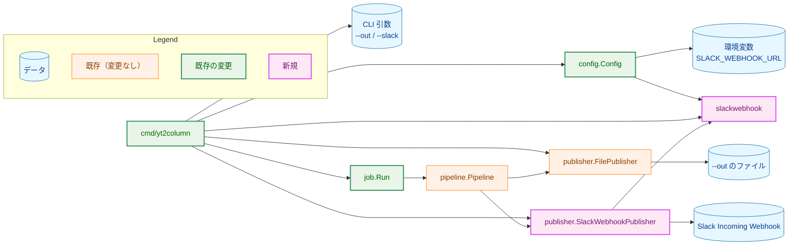
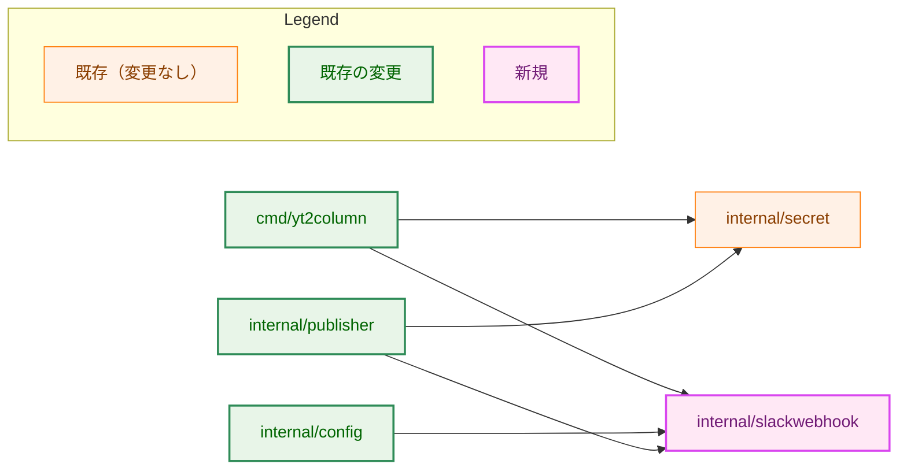
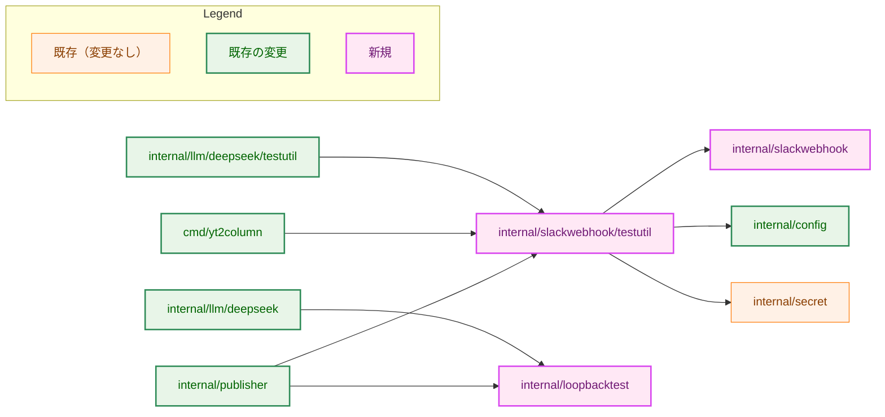
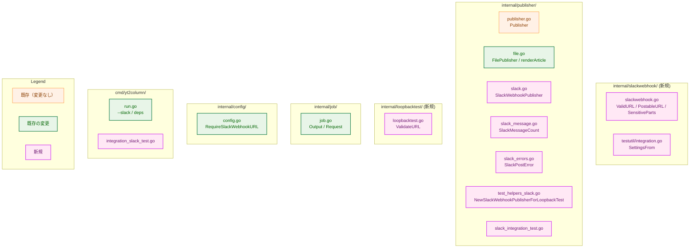
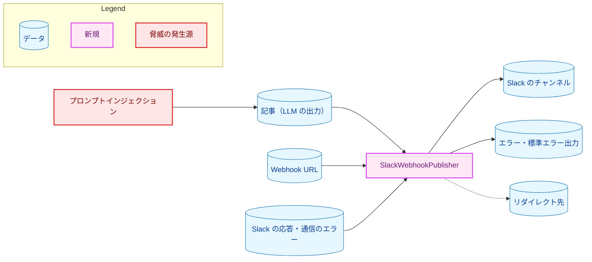
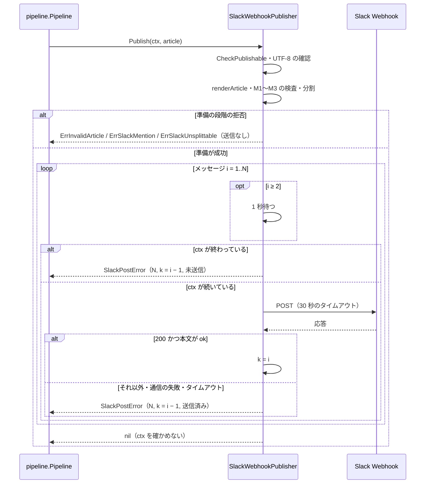
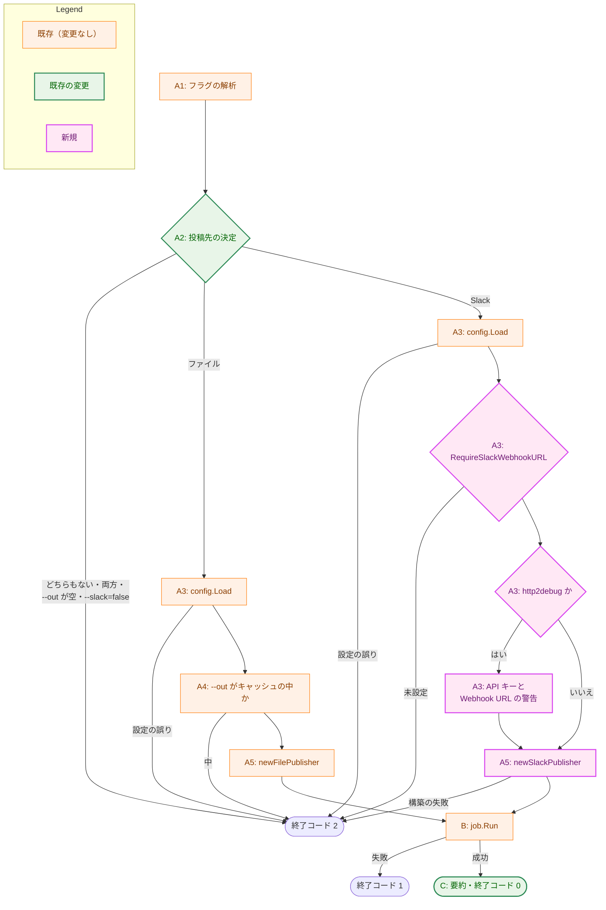

# アーキテクチャ設計書：Slack Webhook への投稿（SlackWebhookPublisher）

## Document Status

| Item | Value |
|---|---|
| Status | `draft` |
| Created | 2026-10-07 |
| Review date | - |
| Reviewer | - |
| Comments | - |

本書は [01_requirements.md](01_requirements.md)（以下、要件書）の設計である。既存のコードに関する記述は、コミット `1457754` のソースで確かめた。`file:line` はこのコミットの行番号を指す。

F-NNN・AC-NN は要件書の項番、H-NN は [design_handoff.md](design_handoff.md) の項目（対応は 3.15）を指す。本書では、要件書の用語に従い、Slack への 1 回の `POST` で送る内容を「メッセージ」、`Title`・モデル・`Body` を並べた文字列を「投稿する文字列」、分割投稿の各メッセージに付ける `(2/3)` のような表示を「分割の位置の表示」と呼ぶ。エラーの `Error()` が返す文字列は「エラーの文言」と呼び、メッセージと区別する。文字数の上限と比べる量は「単位」で数える（3.5）。

## 1. 設計の全体像 (Design Overview)

### 1.1. 設計原則

-   **Slack に固有のことは `internal/publisher` の Slack 用のファイルに閉じ込める。** ペイロードの形、文字数の数え方、分割、応答の判定、メンションの記法の検出は、すべて `SlackWebhookPublisher` とその補助の関数に置く。`internal/job` は「ローカルの事前確認が要る投稿先か」だけを知り、Slack を知らない。`cmd/yt2column` は投稿先を選び、結果を報告する。
-   **公式文書で確かめられないことは、安全な側に倒し、残るリスクを明記する。** 文字数の数え方と、`markdown` ブロックがメンションを解釈するかどうかは、公式文書に記載がない（3.1）。数え方は、本書で列挙した数え方のどれよりも小さくならない量にする（3.5）。メンションは、本書で列挙した記法と、それを作りうる変形を含む記事を、送る前に拒否する（3.4）。列挙の外に残るリスクは 5.2 に書く。
-   **送る前にすべてを確定させる。** 記事の検査、メンションの記法の検出、分割は、最初のメッセージを送る前に終える。送信を始めた後に失敗する原因は、通信と Slack の応答だけにする（F-003・F-006）。
-   **Webhook URL は、エラーにも構造体の表示にも入れない。** `*url.Error` を返さない。応答の本文は、Slack のエラーの識別子の形のときだけエラーに含める。通信のエラーの文言は、Webhook URL の一部を含む場合に差し替える（4.2）。`SlackWebhookPublisher` の構造体は Webhook URL を `secret.Secret` としてだけ保持する（3.3）。
-   **投稿先の選択は型で表す。** `job.Request` は、投稿先の種類とそれに属する値（出力のパスと `Publisher`）を 1 つにまとめた `job.Output` を持つ。`OutPath` が空かどうかで振る舞いを推し量らない（[CLAUDE.md](../../../CLAUDE.md)「Declare, don't infer」。H-04）。
-   **検証の規則は 1 か所に置く。** Webhook URL の形式の規則を新しい小さなパッケージ `internal/slackwebhook` に置き、`internal/config`・`SlackWebhookPublisher`・統合テストの判定・CLI の伏せ字化から使う（H-03）。

### 1.2. 概念モデル

**図1 概念モデル。** 矢印 A → B は「A が B を使う（呼び出す、または読み書きする）」を表す。



`cmd/yt2column` は `--out` と `--slack` のどちらか一方から投稿先を 1 つ選び、その `Publisher` だけを構築して `job.Output` に包み、`job.Run` に渡す。`pipeline.Pipeline` は渡された `Publisher` の `Publish` を呼ぶだけであり、変更しない。`cmd/yt2column` から `slackwebhook` への矢印は、標準エラー出力の伏せ字化に使う Webhook URL の部分の取得（3.10）を表す。

### 1.3. 既存コードとの関係

| 既存の部品 | 本タスクでの使い方 | 根拠 |
|---|---|---|
| `publisher.Publisher` | `SlackWebhookPublisher` が実装する。interface は変えない | `internal/publisher/publisher.go:14-16` |
| `renderArticle`（`FilePublisher` の出力の書式） | 投稿する文字列の組み立てに同じ関数を使う（3.4）。関数の内容は変えず、コメントの「file content」を投稿先に共通の書式である旨に直す | `internal/publisher/file.go:178-185` |
| `writer.Article.CheckPublishable` | 投稿の前に呼ぶ。拒否は `writer.ErrInvalidArticle` を包む | `internal/writer/article.go:13-39` |
| `config.validSlackWebhook` | 規則を `internal/slackwebhook` に移し、`config` はそれを呼ぶ。受理する値は変えない（3.2） | `internal/config/config.go:273-278` |
| `config.Config.SlackWebhookURL` | 変えない。CLI の伏せ字化（`configuredSecrets`）が引き続き使う。`--slack` の必須の判定には新しいメソッドを使う（3.9） | `internal/config/config.go:117-123` |
| `config.hasHTTP2Debug` | 判定の本体を公開し、Slack の統合テストの判定からも使う（3.9・3.12） | `internal/config/config.go:286-290` |
| DeepSeek アダプタの HTTP の扱い（リダイレクトを `http.ErrUseLastResponse` で止める、タイムアウトを `context.WithTimeoutCause` で与える、上限 + 1 バイトまで読む） | 同じ考え方を `SlackWebhookPublisher` で使う。コードは共有しない（3.6） | `internal/llm/deepseek/deepseek.go:74-80`・`:112-117`、`response.go:40-50` |
| `deepseek.validateLoopbackEndpoint`（テスト用） | テスト用の共有パッケージ `internal/loopbacktest` に移し、DeepSeek と Slack のテスト用の構築の両方から使う（3.3） | `internal/llm/deepseek/test_helpers.go:42-73`、`test_helpers_endpoint.go:18` |
| `job.Run` の `OutPath` の事前確認 | 投稿先がファイルの場合だけ行う（3.8） | `internal/job/job.go:60-62`・`:120-121`・`:137-162` |
| `cmd/yt2column` の標準エラー出力の無害化（`stderrWriter`・`sanitize`・`configuredSecrets`） | そのまま使う。`configuredSecrets` に Webhook URL のパスなどを加える（3.10） | `cmd/yt2column/run.go:113-121`・`:277-288`、`output.go:34-45` |
| `deepseektestutil.SettingsFrom`・`RunMakeTarget` | CLI の Slack の統合テストの DeepSeek の側の判定と、`make` のターゲットのテストに使う（3.12） | `internal/llm/deepseek/testutil/integration.go:86-127`、`make.go:43`・`:78` |
| `pipeline.Pipeline.Run` | 変更しない。`Publish` のエラーを `StageError{Stage: StagePublish}` で包み、`Publish` の後に `context` を確かめない | `internal/pipeline/pipeline.go:112-115` |

## 2. システム構成 (System Structure)

### 2.1. パッケージ構成

パッケージの依存は、本番のビルドの import（図2-1）と、テスト用のビルド（`test` または `integration` のタグ）だけの import（図2-2）に分けて示す。どちらの図も、矢印 A → B は「A が B を import する」を表し、本タスクで加わる import だけを示す。

**図2-1 本番のビルドの依存。**



**図2-2 テスト用のビルドだけの依存。** 本番のビルドの依存（図2-1）は省く。



-   `internal/slackwebhook` は標準ライブラリだけに依存するリーフパッケージである。`internal/config` から `internal/publisher` への依存を作らずに、規則を両方で共有できる（H-03）。
-   `internal/slackwebhook/testutil` は統合テストの実行条件の判定と、判定が読む環境変数の名前の定数を持つ（3.12）。`internal/publisher` を import しないので、`internal/publisher` のパッケージ内の統合テストから import しても循環しない。既存の `internal/publisher/testutil` は `internal/publisher` を import するので、判定はそこに置かない。
-   `internal/llm/deepseek/testutil` から `internal/slackwebhook/testutil` への import は、`make` のターゲットのテストが記録する変数の一覧（`recordedEnv`）に Slack のオプトインの変数の名前を加えるためである（3.12）。
-   `internal/job` は新たな import を持たない（`job.Output` は既存の `publisher.Publisher` だけを使う。3.8）。

### 2.2. コンポーネント配置

**図3 主なファイルの配置。** 矢印は使わない。色で新規と変更を区別する。変更するファイルの全体は 3.14 の表に示す。



### 2.3. データの流れ

投稿の段階のデータの流れ（記事の検査 → 投稿する文字列 → メンションの検査 → 分割 → 順次の送信）は、6.1 のシーケンス図に示す。CLI の手順の分岐は 6.2 に示す。

## 3. コンポーネント設計 (Component Design)

### 3.1. Slack の公式文書で確かめた値（H-01）

確認日はいずれも 2026-10-07 である。

| 事項 | 公式文書の記載 | 本設計の扱い | 出典 |
|---|---|---|---|
| `markdown` ブロックの文字数の上限 | 「The cumulative limit for all `markdown` blocks in a single payload is 12,000 characters.」つまり、1 つのペイロードのすべての `markdown` ブロックの合計の上限である | 1 つのメッセージに `markdown` ブロックを 1 つだけ入れ、そのテキストを 12,000 単位以内にする（3.5） | [Markdown block](https://docs.slack.dev/reference/block-kit/blocks/markdown-block) |
| 文字数の数え方 | 記載なし（「characters」とだけある） | 3.5 で列挙した数え方のどれよりも小さくならない量で数える | 同上 |
| `markdown` ブロックのメンションの解釈、HTML の文字参照の扱い | 記載なし。対応する書式の一覧（太字、リンク、リスト、見出し、コードブロック、表など）に、メンションも文字参照もない。バックスラッシュによるエスケープには対応する | メンションの記法と、それを作りうる変形（バックスラッシュのエスケープ、文字参照、見た目の似た文字、表示されない文字）を含む記事を拒否する（3.4） | 同上 |
| 従来の mrkdwn（トップレベルの `text` などの書式）の特殊な記法 | `<@U012AB3CD>` がユーザーへのメンション、`<!here>`・`<!channel>`・`<!everyone>` が特別なメンション、`<!subteam^ID>` がユーザーグループへのメンション。`&`・`<`・`>` は制御文字であり、記法として使わない場合は `&amp;`・`&lt;`・`&gt;` に変える。`link_names` を `1` にすると、平文の名前もメンションに変わる | 3.4 の拒否の対象と、3.5 の数え方の根拠にする | [Formatting message text](https://docs.slack.dev/messaging/formatting-message-text) |
| Incoming Webhook の成功の応答 | 「HTTP 200」で、本文は平文の `ok` | ステータス `200` かつ本文がちょうど `ok` のときだけ成功とする（3.6） | [Sending messages using incoming webhooks](https://docs.slack.dev/messaging/sending-messages-using-incoming-webhooks) |
| Incoming Webhook の主なエラーの応答 | `400`: `invalid_payload`。`403`: `action_prohibited`・`posting_to_general_channel_denied`。`404`: `no_service`・`no_service_id`・`user_not_found`・`channel_not_found`。ほかに `channel_is_archived`・`invalid_token`・`no_active_hooks`・`no_team`・`no_text`・`team_disabled` など | いずれも英小文字・数字・`_` からなる短い識別子なので、その形の本文だけをエラーに含める（3.6・4.2） | 同上 |
| トップレベルの `text` | `no_text` は「the text attribute was missing from the payload」とされる。ブロックだけのペイロードが受理されるかは記載がない | 記事の内容を含まない固定の文字列を `text` として常に送る（3.4） | 同上 |
| レート制限 | Incoming Webhook は「1 per second」で「Short bursts >1 allowed」。超えると `429 Too Many Requests` と `Retry-After` を返す | 続けて送るメッセージの間を 1 秒あける（3.6）。`429` は失敗とし、リトライしない（要件書 2.3） | [Rate limits](https://docs.slack.dev/apis/web-api/rate-limits) |

**対象クライアント環境での検証。** 対象クライアント環境は Slack（Incoming Webhook の `markdown` ブロック）である。公式文書で確かめられなかったのは、文字数の数え方、`markdown` ブロックのメンションの解釈、ブロックと併せた `text` の要否の 3 点である。本設計は、`text` の要否には Slack の振る舞いに依存しない手段（常に送る）を選んだ。数え方とメンションは、本書で列挙した解釈と変形のすべてに対処できる手段を選び、その外に残るリスクを 5.2 に記した。実際の表示（見出し・リスト・リンク・日本語、分割の位置の表示）、上限ちょうどのメッセージの受理、通知が起きないことは、統合テスト（3.12）と実装計画書の手動確認（F-009・AC-22・AC-33）で確かめる。

### 3.2. `internal/slackwebhook`（F-001・H-03）

```go
// Package slackwebhook holds the rules a Slack Incoming Webhook URL must meet
// and names the parts of a URL that must never appear in output. It is shared
// by internal/config, internal/publisher, cmd/yt2column, and the integration
// tests, so each rule is written once.
package slackwebhook

// ValidURL reports whether value is a Slack Incoming Webhook URL: it starts
// with "https://hooks.slack.com/", has at least one more character, and
// contains no whitespace. internal/config accepts SLACK_WEBHOOK_URL by it.
func ValidURL(value string) bool

// PostableURL reports whether value meets ValidURL and, in addition, consists
// of printable ASCII (0x21-0x7E) only and is parsed by net/url. Every URL a
// publisher posts to must meet it.
func PostableURL(value string) bool

// SensitiveParts returns the strings derived from a webhook URL that must
// never appear in an error or a log: the URL and its path, each both as given
// and as net/url escapes it, and the last path segment.
func SensitiveParts(value string) []string
```

-   `ValidURL` の規則は、現在の `config.validSlackWebhook`（`config.go:273-278`）と同じである。`config.validSlackWebhook` を削除し、`loadSlackWebhook`（`config.go:216-233`）はこの関数を呼ぶ。`SLACK_WEBHOOK_URL` に受理される値は変わらない。
-   **`PostableURL` を別に設ける理由。** `https://hooks.slack.com/%zz` のような値は `ValidURL` を満たすが、`net/url` の解析で失敗し、そのエラーは URL 全体を含む。また、ASCII 以外の文字を含む URL は、`net/url` がエラーの文言に書くときにパーセントエンコードされるので、元の値と比べても見つからない。投稿に使う URL を印字可能な ASCII に限り、解析できることを求めれば、どちらも起こらない。この追加の規則を `config` に入れると、`--out` を指定した実行でも、設定されているが解析できない `SLACK_WEBHOOK_URL` があれば終了コード `2` になる。これは、`--out` の振る舞いを変えないという要件書 5 章の制約に反する。そこで、`config` は従来の規則のまま受理し、投稿に使う時点（`SlackWebhookPublisher` の構築と、統合テストの判定）で `PostableURL` を求める。Slack が発行する Webhook URL は ASCII の英数字と `/` だけからなるので、実際の値が拒否されることはない。
-   `SensitiveParts` は、`SlackWebhookPublisher` のエラーの文言の差し替え（4.2）と、CLI の伏せ字化（3.10）の両方が使う。どの部分を秘密情報とみなすかを 1 か所で決めるためである。
-   **型ではなく関数で共有する理由。** H-03 の候補 (a)（検証済みの URL の型）は、要件書 F-001 が構築の引数を `secret.Secret` と定めているので採らない。不変条件は、`SlackWebhookPublisher` の非公開のフィールドと必須のコンストラクタで保証する（3.3）。
-   **新しいパッケージにする理由。** 規則を `internal/config` に置いて公開すると、`internal/publisher` が環境変数を読むパッケージに依存する。`internal/publisher` に置くと、`internal/config` が `writer`・`llm` などに推移的に依存する。どちらも責務の向きに合わないので、標準ライブラリだけに依存するリーフパッケージに置く。

### 3.3. `SlackWebhookPublisher` の構築（F-001）

```go
// SlackWebhookPublisher posts an article to a Slack Incoming Webhook as one or
// more messages, each with a single markdown block. It holds the webhook URL
// only as a secret.Secret, so printing the struct never shows the URL. Its
// fields are set once by the constructor and never mutated afterwards.
type SlackWebhookPublisher struct {
	// unexported: the webhook URL (secret.Secret), the per-message timeout,
	// the interval between messages, and the *http.Client.
}

var _ Publisher = (*SlackWebhookPublisher)(nil)

// NewSlackWebhookPublisher validates webhookURL with slackwebhook.PostableURL
// and returns a publisher with the production timeout and interval. It never
// reads environment variables and never touches the network. A rejection
// never holds the URL or any part of it.
func NewSlackWebhookPublisher(webhookURL secret.Secret) (*SlackWebhookPublisher, error)
```

| 定数 | 値 | 理由 |
|---|---|---|
| メッセージ 1 つの送信のタイムアウト | 30 秒 | 送信と応答の本文の読み取りの全体を覆う。LLM の呼び出し（最大 15 分）に比べて十分に短く、遅い回線でも誤って打ち切らない長さとする |
| メッセージの間隔 | 1 秒 | Incoming Webhook のレート制限（3.1） |
| 応答の本文の上限 | 1,024 バイト | Slack のエラーの理由は短い識別子である（3.1） |
| 1 つのメッセージの上限 | 12,000 単位 | 3.1・3.5 |
| 分割の数の上限 | 10 | 3.5 |

-   構築の拒否は 2 種類である。ゼロ値の `secret.Secret`（`Reveal` がエラーを返す。`secret.go:40-45`）と、`slackwebhook.PostableURL` に合わない値である。どちらも非公開の固定のエラー（`errZeroWebhookURL`・`errInvalidWebhookURL`）を返し、値を含めない（AC-02・AC-03）。
-   構造体は Webhook URL を `secret.Secret` としてだけ持ち、解析した URL や `SensitiveParts` の結果をフィールドに保持しない。それらは `Publish` の呼び出しのたびに `secret.Secret` から求める（求め直すコストは LLM の呼び出しに比べて無視できる）。これにより、`fmt` の `%+v`・`%#v` や `log/slog` で構造体を出力しても、Webhook URL は `[REDACTED]` としか出ない（`secret.go:47-73`）。
-   構築は `http.Client` を作るだけで、接続しない（AC-01）。`http.Client` の `CheckRedirect` は `http.ErrUseLastResponse` を返す（3.6）。`Transport` は既定の `http.DefaultTransport` を使う（プロキシの環境変数を含め、DeepSeek アダプタと同じ扱い）。

**テスト用の構築（`test` のタグだけ）。**

```go
// SlackTestOptions sets the timing of a test publisher. Timeout must be
// positive; Interval may be zero, which sends the messages without waiting.
type SlackTestOptions struct {
	Timeout  time.Duration
	Interval time.Duration
}

// NewSlackWebhookPublisherForLoopbackTest builds a publisher that posts to
// endpoint, which must be a loopback URL (loopbacktest.ValidateURL); any other
// endpoint, or a non-positive Timeout, fails t. It does not apply
// slackwebhook.PostableURL. Built only with the test tag.
func NewSlackWebhookPublisherForLoopbackTest(t testing.TB, endpoint string, opts SlackTestOptions) *SlackWebhookPublisher
```

```go
// Package loopbacktest checks that a test endpoint is a loopback URL, so a
// test helper that redirects a client cannot be pointed at an external host.
// Built only with the test tag.
package loopbacktest

// ValidateURL returns an error unless endpoint is an absolute URL whose host
// is a loopback IP address.
func ValidateURL(endpoint string) error
```

-   `deepseek.NewForLoopbackTest`（`internal/llm/deepseek/test_helpers_endpoint.go:16-33`）と同じ考え方で、規則を迂回する範囲をループバックアドレスに限る。`cmd/yt2column` のテストからも呼べるように公開する。
-   ループバックの判定は、`deepseek` のテスト用の補助 `validateLoopbackEndpoint` とその静的エラー（`internal/llm/deepseek/test_helpers.go:42-73`）を `internal/loopbacktest` に移して共有する。呼び出し元の `test_helpers_endpoint.go:18` は `loopbacktest.ValidateURL` を呼ぶ。直接のテスト（`deepseek_test.go:172-185`）は `internal/loopbacktest` のテストに移す。
-   分割の上限値（12,000 単位・10）はテストでも変えない。AC-08〜AC-11 は、上限を超える長さの記事を組み立てて確かめる（7.1）。

### 3.4. 投稿する文字列とペイロード（F-002・F-006・H-02）

**投稿する文字列。** `renderArticle(article)`（`file.go:178-185`）の戻り値をそのまま使う。すなわち `# <Title>`、空行、`- Model: <Model>`、`- Model version: <ModelVersion または (none)>`、空行、`Body` の順であり、`Body` で終わる（AC-04）。`FilePublisher` の出力と同じ書式なので、ファイルと Slack で記事の見え方がそろい、書式を 2 か所に書かずに済む。変換は行わないので、要件書 F-002 の「変換した後の文字列」は生じない。

**記事の拒否（UTF-8）。** `CheckPublishable` の後に、`Title`・`Body`・`SourceURL`・`Model`・`ModelVersion` がいずれも正しい UTF-8 であることを確かめる。正しくなければ、`writer.ErrInvalidArticle` を包んだエラーで、送る前に拒否する。`CheckPublishable` は UTF-8 の正しさを確かめない（`article.go:13-39`）。一方、`encoding/json` は不正なバイトを黙って U+FFFD に置き換える。このため、ここで確かめなければ、Slack が受け取るテキストが投稿する文字列と一致せず、単位の数え方（3.5）も成り立たない。`CheckPublishable` に加えずに `SlackWebhookPublisher` で確かめるのは、`FilePublisher` の振る舞いを変えないためである（要件書 5 章）。

**メンションの記法の拒否（F-006）。** 投稿する文字列が次のいずれかに当たる場合、1 つのメッセージも送らずに `ErrSlackMention` を返す。対象は投稿する文字列の全体（`Title`・`Model`・`ModelVersion`・`Body`）であり、コードスパンやコードブロックの中も区別しない。

M1・M2 は、投稿する文字列そのものではなく、次の 3 つの変換をした「検査用の文字列」に対して判定する。いずれも、Markdown の表示や Slack の処理で、見かけ上は記法でない並びが記法に変わりうる変形を戻すためのものである。変換は V2 → V3 → V1 の順に行う。V1 を先に行うと、`<\` U+200B `!channel>` や `＜\!channel>` のように、V2・V3 の後で初めてバックスラッシュのエスケープの形になる並びを戻せないためである。

| 変換 | 内容 | 戻す変形の例 |
|---|---|---|
| V1 | ASCII の句読点の直前のバックスラッシュを除く（CommonMark のバックスラッシュのエスケープ） | `<\!channel>`・`\@here` |
| V2 | Unicode の一般カテゴリ Cf（書式文字。U+200B・U+2060・U+00AD・U+FEFF・双方向の制御文字など）を除く | `@` U+200B `here` |
| V3 | 見た目の似た文字を ASCII の文字に置き換える: `＠`（U+FF20）・`﹫`（U+FE6B）→ `@`、`＜`（U+FF1C）・`﹤`（U+FE64）→ `<`、`！`（U+FF01）・`﹗`（U+FE57）→ `!` | `＠here`・`＜!channel>` |

| 規則 | 拒否する並び | 判定の対象 | 例 |
|---|---|---|---|
| M1 | `<` の直後に `!` または `@` | 検査用の文字列 | `<!channel>`・`<!here>`・`<!everyone>`・`<!subteam^S123>`・`<@U123>`・`<@W123>`・`<!here\|here>` |
| M2 | 語の先頭の `@`（文字列の先頭、または直前が Unicode の文字・数字・`_` 以外）の直後に、Unicode の文字・数字、または `_` | 検査用の文字列 | `@channel`・`@here`・`@everyone`・`@Channel`・`@user_name`・`@開発チーム`・`＠here` |
| M3 | 文字参照の始まり: `&#`、または `&` の直後に ASCII の英字が 1 つ以上続いて `;` で終わる並び | 投稿する文字列 | `&#64;here`・`&#x40;channel`・`&commat;everyone`・`&#60;!channel&#62;`・`&lt;!channel&gt;` |

-   **拒否を選んだ理由（H-02 の候補 (a)）。** 3.1 のとおり、`markdown` ブロックがメンションを解釈するかどうか、文字参照をどう表示するかは公式文書に記載がない。変換（候補 (b)）は、変換した形が通知にならず、かつ表示が変わらないことを、実際の Slack で確かめなければ安全と言えない。ペイロードのオプション（候補 (c)、`link_names` など）は従来の mrkdwn の解析を制御するもので、`markdown` ブロックに効くという記載はない。拒否すれば、本書が列挙した記法と変形を Slack がどう解釈しても、通知は起きない（[CLAUDE.md](../../../CLAUDE.md)「Reject, don't normalize」）。V1〜V3 は判定のためだけの変換であり、送る文字列は変えない。
-   **M2 を `channel`・`here`・`everyone` に限らない理由。** Slack の従来の mrkdwn では、`link_names` を有効にすると平文の名前がユーザーやユーザーグループへのメンションになる（3.1）。`markdown` ブロックで同じことが起きないとは確かめられないので、名前の形をした `@` の並びをすべて拒否する。直前が文字・数字・`_` の `@`（`user@example.com` など）を除くのは、従来の mrkdwn でも語の途中の `@` はメンションにならないためである。
-   **M3 で文字参照をすべて拒否する理由。** CommonMark は本文の文字参照を文字に戻して表示する。`&#64;here` は表示では `@here` になり、Slack が表示された文字列から記法を解釈すると通知になりうる。文字参照を戻した後の文字列を判定する方法もあるが、LLM が書くコラムに文字参照が現れることはまれであり、すべて拒否するほうが単純で漏れがない。
-   **拒否による影響。** M2 は、YouTube のハンドル（`@channelname`）、プログラミングの注釈（`@Override`）、`@` で始まる単価の表記（`@3,000円`）を含む記事も拒否する。M3 は `&amp;` などを含む記事を拒否する。拒否は LLM の呼び出しの後に起こり、その記事は保存されない。どれだけの記事が拒否されるかは測っていない（5.2）。誤って通知を起こす害（外部の第三者がチャンネルの全員に通知を送れる）は、記事を投稿できない不便より重いと判断した。CLI は、拒否の理由と、`--out` を指定すれば生成された記事をファイルで確かめられることを示す（3.10）。README にもこの制限を書く（3.13）。
-   **`Model`・`ModelVersion` も対象にする理由と制約。** どちらもプロバイダの応答から来る値であり、LLM の出力と同じく信頼できない。現在のプロバイダ（DeepSeek）のモデル名は `@` を含まない。`@` を含むモデル名を使うプロバイダを加える場合は、M2 によってすべての記事が拒否されるので、その時点で対象を見直す（9 章）。
-   **拒否しないもの。** `<` の直後が `!`・`@` 以外（自動リンク `<https://…>` など）。出典のリンク（`writer` が付ける `<https://www.youtube.com/watch?v=…>`。`internal/writer/output.go:145-147`）はこれに当たる。`#` のチャンネルへのリンク（`<#C123>`）は通知を起こさないので対象外である。
-   **既存の検査との関係。** `writer` の生の HTML の検査（`internal/writer/markdown.go:237-260`）は、`Body` のコードスパンの外にある `<!` を拒否するが、`<@`、コードスパンの中、`Title` は対象外である。`CheckPublishable` も記法を検査しない。また `SlackWebhookPublisher` は `writer` 以外から作られた `Article` も受け取りうる。したがって `SlackWebhookPublisher` は既存の検査に頼らず、自分で M1〜M3 を検査する。
-   エラーの文言は、当たった規則（M1〜M3）と、投稿する文字列での行と列の番号だけを示し、記事の内容を含めない。

**ペイロード。** 1 つのメッセージのペイロードは次の形で、`encoding/json` で符号化する。

```go
// slackPayload is the JSON body of one message.
type slackPayload struct {
	Text   string          `json:"text"`
	Blocks []markdownBlock `json:"blocks"`
}

// markdownBlock is a Block Kit markdown block.
type markdownBlock struct {
	Type string `json:"type"` // always "markdown"
	Text string `json:"text"`
}
```

-   `blocks` は `markdown` ブロックを 1 つだけ持ち、そのテキストはメッセージのテキスト（分割の位置の表示を含む。3.5）である。
-   トップレベルの `text` は、記事の内容を含まない固定の文字列（`yt2column article`、分割した場合はその後に分割の位置の表示）とする。`text` を省くと `no_text` で拒否されうる（3.1）。記事の `Title` を入れると、`text` は従来の mrkdwn として解析されるので、F-006 の対象が増え、長さの上限も別に考える必要が生じる。固定の文字列なら、どちらも生じない。プッシュ通知の文面は記事の題名にならないが、記事自体は `markdown` ブロックで表示される。
-   `encoding/json` は `"`・`\`・`<`・`>`・`&`・U+2028・U+2029 をエスケープするので、記事の内容にかかわらずペイロードの構造は変わらず、Slack が復号する `text` はメッセージのテキストと一致する（AC-06）。UTF-8 の正しさは、上の記事の拒否で確かめてある。

### 3.5. 分割（F-003）

**単位（文字数の数え方）。** 投稿する文字列の各コードポイントを次の量で数え、その合計を「単位」と呼ぶ。

| コードポイント | 単位 | 根拠 |
|---|---|---|
| `&`・`<`・`>`・`"` | 6 | `encoding/json` の `\u0026` などの長さ（6）が、HTML の文字参照（`&amp;` の 5、`&lt;`・`&gt;` の 4、`&quot;` の 6）以上である |
| `'` | 5 | HTML の文字参照 `&#39;` の長さ |
| `\`・改行・タブ | 2 | JSON のエスケープ（`\\`・`\n`・`\t`）の長さ |
| U+2028・U+2029 | 6 | `encoding/json` の `\u2028`・`\u2029` の長さ |
| それ以外 | UTF-8 のバイト数（1〜4） | — |

-   **何に対して安全側か。** どのコードポイントでも、上の量は、UTF-8 のバイト数、UTF-16 の符号単位の数、コードポイントの数（1）のそれぞれ以上である。さらに、`&`・`<`・`>`・`"`・`'` を HTML の文字参照に変えた後の長さと、Go の `encoding/json` で符号化した後の長さ以上である。したがって、Slack がコードポイント・UTF-16 の符号単位・UTF-8 のバイト数のいずれかで数える場合も、文字参照への変換の前または後の長さや、JSON の文字列としての長さで数える場合も、単位はそれ以上になる。書記素クラスタで数える場合も、コードポイントの数以下なので同様である。Slack が Markdown を内部の形式に変えてから数える場合など、この列挙の外の数え方は保証しない（5.2）。
-   **兼ね合い。** 日本語の文字は 3 単位なので、1 つのメッセージに入る日本語はおよそ 4,000 字である（H-01 の「およそ 3 分の 1」）。LLM が生成するコラムの長さ（数千字）なら、分割の数は 1〜3 程度に収まる。UTF-16 で数えれば分割の数は減るが、Slack の数え方を確かめられない以上、上限を超えて拒否される危険を避けることを優先する。上限を超えたメッセージが拒否された場合、それより前のメッセージは投稿済みで残り、分割投稿は途中で失敗する（`SlackPostError`。4.1）。

**分割の規則。**

-   投稿する文字列の全体が 12,000 単位以内なら、1 つのメッセージで送り、分割の位置の表示を付けない（AC-07・AC-10）。
-   超える場合は、投稿する文字列を先頭から順に断片に区切る。各断片は「12,000 単位 − 分割の位置の表示の最大の長さ」以内とする。分割の位置の表示は、`(k/N)`（k は何番目のメッセージか、N はメッセージの総数）の後に空行（`\n\n`）を続けたものであり、断片の前に付ける。最大の長さは、分割の数の上限 10 のときの `(10/10)\n\n` の 11 単位（改行は 2 単位）とする。
-   区切る位置は、断片が上限に収まる範囲にある改行の直後のうち、前側の断片が空白文字だけにならないものを候補とし、その中で最も後ろの位置とする（改行は前の断片の末尾に残る）。そのような改行がない場合に限り、収まる範囲の最後のコードポイントの境界で区切る（AC-08・AC-09）。空白文字は `unicode.IsSpace` が真の文字とする。
-   各断片から分割の位置の表示を除いて順に連結すると、投稿する文字列と一致する（文字を失わず、加えない）。
-   コードポイントの境界で区切っても空白文字だけの断片が残る場合（上限を超える長さの空白文字の連なりを含む記事）と、断片の数が 10 を超える場合は、1 つのメッセージも送らずに `ErrSlackUnsplittable` を返す（AC-11）。
-   **分割の数の上限を 10 とする理由。** 日本語でおよそ 40,000 字であり、コラムの長さの 10 倍近い。これを超える記事は LLM の異常な出力とみなす。10 のメッセージを 1 秒ずつあけて送っても 10 秒程度であり、LLM の呼び出しに比べて無視できる。
-   分割の位置の表示を各断片の先頭に置くのは、Slack の読み手が、メッセージの冒頭でそれが全体の何番目かを分かるようにするためである。

**メッセージの数の公開。** CLI が成功時にメッセージの数を表示する（F-007）ために、投稿と同じ準備（`CheckPublishable`・UTF-8 の確認・投稿する文字列の組み立て・メンションの検査・分割）だけを行い、数を返す関数を公開する。

```go
// SlackMessageCount returns how many messages Publish sends for article. It
// performs the same checks and split as Publish, touches no network, and
// returns the same pre-send errors.
func SlackMessageCount(article writer.Article) (int, error)
```

-   `Publish` と `SlackMessageCount` は同じ非公開の準備の関数を呼ぶ。準備は記事だけから決まり、上限値はパッケージの定数でテストでも変えない（3.3）ので、同じ記事に対する数は必ず一致する。上限値を構築ごとに変えられるようにする場合は、この関数をメソッドに変える必要がある。
-   `Publisher` interface に戻り値を足す案は、`FilePublisher`・`pipeline`・`job` とそのテストの変更が要るので採らない。

### 3.6. 送信と応答の検証（F-004）

`Publish` は、準備（3.4・3.5）を終えた後、メッセージを先頭から 1 つずつ送る。送信は次の規則に従う。順序は 6.1 の図に示す。

-   2 つ目以降のメッセージの前に、1 秒待つ。待つ間に `ctx` が終われば、送らずに中断する。
-   各メッセージを送る直前に `ctx` を確かめ、終わっていれば送らずに中断する（AC-17 の、キャンセル済みの `ctx` でリクエストを送らないこと）。
-   各メッセージの送信と応答の本文の読み取りは、`ctx` から `context.WithTimeoutCause` で作った 30 秒のタイムアウトの中で行う。DeepSeek アダプタと同じく `http.Client.Timeout` は使わない。タイムアウトを `context.DeadlineExceeded` として判別するためである（H-06）。
-   `POST`、`Content-Type: application/json` で送る。

| 応答 | 本文の読み方 | 結果 |
|---|---|---|
| `200` | 1,025 バイトまで読む | 1,024 バイトを超えたら `ErrSlackInvalidResponse`。ちょうど `ok` なら成功。それ以外（空、`OK`、`ok\n`、`{"ok":true}` など）は `ErrSlackInvalidResponse`（AC-13・AC-14） |
| `200` 以外（3xx・`429` を含む） | 1,025 バイトまで読む | `*SlackHTTPStatusError`（`ErrSlackHTTPStatus`）。ステータスコードと、本文が Slack のエラーの識別子の形の場合だけその本文を持つ（4.2。AC-12・AC-15・AC-20） |
| 応答なし（接続の失敗など） | — | `ErrSlackTransport`。ただしタイムアウトの `context` が終わっていれば、`context` のエラーを包む（AC-16・AC-17） |

-   **リダイレクト。** `CheckRedirect` が `http.ErrUseLastResponse` を返すので、3xx は通常の応答として返り、`Location` の送信先にはリクエストを送らない。`Referer` に Webhook URL が載ることもない（AC-15）。リダイレクトを止めるためのエラーを返さないので、そのエラーが `*url.Error` に包まれることもない（H-06）。
-   **本文の読み取りの失敗。** `200` で本文の途中で読み取りに失敗した場合は、`ErrSlackTransport`（または `context` のエラー）とする。`200` 以外で本文の読み取りに失敗した場合は、本文を持たない `*SlackHTTPStatusError` とする（ステータスで失敗は確定しているため）。
-   **自動でリトライしない。** `429` も他の失敗と同じく直ちに返す（要件書 2.3）。
-   **最後のメッセージの後。** 最後のメッセージの成功を確かめたら、`ctx` を確かめずに `nil` を返す。すべてのメッセージを投稿した後に受けたシグナルで、投稿が失敗にならないようにするためである（F-007。`FilePublisher` の `file.go:100-105` と同じ考え方）。
-   送信を始めた後の失敗は、すべて `*SlackPostError` で包んで返す（4.1）。準備の段階の失敗（`writer.ErrInvalidArticle`・`ErrSlackMention`・`ErrSlackUnsplittable`）は包まない（F-005）。`ctx` がはじめから終わっている場合は、準備を終えた後、最初のメッセージを送る直前の確認で中断するので、`*SlackPostError` で包まれる。このときの k（投稿を確かめたメッセージの数、`Posted`）は 0 であり、エラーはそのメッセージを送っていないことを示す（4.1）。

**既存の方針との違い（DeepSeek アダプタ）。** [0003 の 02_architecture.md](../0003_deepseek_llm_client/02_architecture.md) の 3.4 と H-07 への対応は、DeepSeek アダプタについて「`200` 以外の応答本文を読まない」と定めている。理由は、DeepSeek の `401` の応答本文が API キーの末尾 4 文字を含むことを確かめたためである。本設計は、要件書 F-005 が「HTTP ステータスによる失敗のエラーは応答の本文を含む」と定めているので、`200` 以外の本文を上限まで読む。ただし、エラーに含めるのは Slack のエラーの識別子の形（4.2）の本文だけであり、それ以外の本文は捨てる。この方針は DeepSeek アダプタに固有のもので、DeepSeek アダプタの振る舞いは変えないので、更新が必要な既存のテストはない。

### 3.7. `Publish` の全体

```go
// Publish checks article, rejects Slack mention syntax, splits it into
// messages, and posts them in order, waiting between messages. It sends
// nothing when a pre-send check fails. Once sending has started, every
// failure is a *SlackPostError that tells how many of the messages were
// confirmed posted.
func (p *SlackWebhookPublisher) Publish(ctx context.Context, article writer.Article) error
```

### 3.8. `internal/job`（F-007・H-04）

```go
// Output is where Run sends the article: the Publisher together with what Run
// needs to know about it. The zero value is rejected by Run, so an output that
// was never chosen cannot run.
type Output struct {
	// unexported: the kind (file or remote), the file path, the Publisher
}

// FileOutput is an output to a local file. Run pre-checks path before any side
// effect; p must write to path (the caller builds both from the same value).
func FileOutput(path string, p publisher.Publisher) Output

// RemoteOutput is an output that needs no local pre-check, such as a Webhook.
func RemoteOutput(p publisher.Publisher) Output

// Request is one run. Writer and the Output's Publisher are built by the
// caller.
type Request struct {
	VideoURL  string
	CacheDir  string
	YtDlpPath string
	Refresh   bool
	KeepCache bool
	Writer    writer.ArticleWriter
	Output    Output
}
```

-   `Request` の `OutPath` と `Publisher` のフィールドをなくし、`Output` にまとめる。出力のパスと `Publisher` は同じコンストラクタで束ねられるので、パスだけ、または `Publisher` だけを設定した `Request` は作れない。
-   `validateRequest`（`job.go:114-129`）は、`Output` の種類を `switch` で判定する。ファイルはパスが空でないことと `Publisher` が nil でないこと、リモートは `Publisher` が nil でないことを求める。`default`（ゼロ値）は `errInvalidRequest` で拒否する。
-   `OutPath` の事前確認（`job.go:60-62`）は、同じく `switch` でファイルの場合だけ行う。
-   それ以降の手順（排他、掃除、パイプライン、キャッシュの削除）は投稿先によらず変えない（F-007）。
-   **`job` が Slack を知らない理由。** `job` が投稿先について知る必要があるのは「ローカルの事前確認をするか」だけである。種類を Slack・Discord のように投稿先ごとに列挙すると、投稿先を加えるたびに `job` を変える必要がある。ファイルとリモートの 2 種類にすれば、新しいリモートの投稿先は `RemoteOutput` で渡せる（9 章）。
-   **残る約束。** `FileOutput` の `p` が `path` に書き込むことは、型では保証しない（`FilePublisher` を `job` の中で作ると、CLI のテストが偽の `Publisher` を差し込めなくなる）。この約束は現在もあり（`internal/job/test_helpers.go:40-41` の `newOutput`）、本設計はそれを 1 つのコンストラクタの引数の組に狭める。
-   **H-04 のもう 1 つの候補（`Publisher` の側の任意の interface で事前確認を表す）を採らない理由。** `precheckOutput` は `FilePublisher` とコードを共有しない、できる範囲での確認であり（`job.go:131-136` のコメント）、`publisher` に移すと `FilePublisher` の上書きしない保証と事前確認の責務が混ざる。

### 3.9. `internal/config` の変更（F-001・F-007）

```go
// RequireSlackWebhookURL returns the Webhook URL, or a *VarError naming
// SLACK_WEBHOOK_URL and wrapping ErrMissing when none is configured. The error
// never holds a value.
func (c Config) RequireSlackWebhookURL() (secret.Secret, error)

// HTTP2DebugEnabledIn reports whether a GODEBUG value turns on the Go HTTP/2
// transport's log ("http2debug=1" or "http2debug=2" as a substring).
func HTTP2DebugEnabledIn(godebug string) bool
```

-   **`RequireSlackWebhookURL` を足す理由。** `cmd/yt2column` が `--slack` で `SLACK_WEBHOOK_URL` が未設定であることを報告するには、変数の名前が要る。しかし、秘密の変数の名前を本番のコードに書けるのは `internal/config` だけである（`internal/config/envaccess_test.go:57-68` の `secretEnvNames` と `allowedEnvRefs`）。`config` が名前を持つ `VarError` を返し、CLI は既存の設定の誤りと同じ書式で表示する（`run.go:156-163`）。既存の `SlackWebhookURL`（`(secret.Secret, bool)` を返す）は、設定されていれば伏せ字にする用途（`configuredSecrets`）のために残す。
-   `HTTP2DebugEnabledIn` は、既存の `hasHTTP2Debug`（`config.go:286-290`）の判定の本体を公開したものである。`hasHTTP2Debug` はこれを呼ぶ。Slack の統合テストの判定（3.12）が、同じ判定を複製せずに使う。
-   `SLACK_WEBHOOK_URL` の検証を `slackwebhook.ValidURL` に替える（3.2）。受理する値は変わらない。`Load` の他の振る舞いも変えない（`--out` の場合も、設定されていれば検証する。F-007）。

### 3.10. `cmd/yt2column`（F-007）

**フラグ。** `cliOptions`（`run.go:67-73`）に `slack bool` を足し、`newFlagSet`（`run.go:78-88`）に `--slack` を加える。説明の文には環境変数の名前を書かない（`post the article to the Slack Incoming Webhook configured in the environment (see README)`）。名前を書くと、秘密の変数の名前を `internal/config` の外の本番のコードに書くことになり、`envaccess_test.go` の検査（`:57-68`）で失敗するためである。`--out` の説明から `(required)` を除き、使い方の文（`run.go:94`）に「`--out` と `--slack` のどちらか一方を指定する」ことを書く（AC-27）。

**投稿先の決定（0005 の手順 A2 の後半。手順の一覧は後の「手順の変更」の表）。** 各フラグが指定されたかどうかは、値ではなく `flag.FlagSet.Visit` で「フラグが現れたか」で判定し、直ちに投稿先を決める。以降の手順は投稿先の `switch` だけで分岐する。

| `--out` | `--slack` | 結果 |
|---|---|---|
| あり（値が空でない） | なし | ファイル |
| なし | あり（値が真） | Slack |
| なし | なし | 終了コード `2`（`one of --out or --slack is required`） |
| あり | あり | 終了コード `2`（`--out and --slack cannot be used together`） |
| あり（値が空） | なし | 終了コード `2`（`--out needs a path`） |
| — | あり（`--slack=false`） | 終了コード `2`（`--slack takes no value`） |

-   複数の行に当たる場合は、表の下の行ほど先に判定する。すなわち `--slack=false`、空の `--out`、両方の指定、どちらもない、の順に拒否を判定する（例: `--out "" --slack` は `--out needs a path`、`--out x --slack=false` は `--slack takes no value`）。
-   `--out ""` を「指定なし」とみなさずに拒否するのは、値の内容から投稿先を推し量らないためである。`--slack=false` を拒否するのは、「現れたか」と「値」のどちらで判定するかの曖昧さを残さないためである。現れたかだけで判定すると、`--slack=false` で投稿してしまう。
-   現在の `opts.out == ""` の判定（`run.go:150-152`）はこの表に置き換わる。

**手順の変更。** 0005 の手順 A1〜C（`run.go:123-219`）を次のとおり変える。いずれも `job.Run` より前の検証は終了コード `2` のままである。

| 手順 | ファイル | Slack |
|---|---|---|
| A2 | 投稿先の決定（上の表） | 同左 |
| A3 | 設定の読み込み（変更なし） | 設定の読み込みの後、`cfg.RequireSlackWebhookURL()`。エラーなら既存の設定の誤りと同じ書式で表示し、終了コード `2`（AC-24） |
| A3 の警告 | 既存の API キーの警告だけ | 既存の API キーの警告に加え、`warning: GODEBUG enables http2debug, so the Go HTTP/2 log may write the Slack Webhook URL path to standard error` を書く（AC-28）。どちらも LLM の呼び出しより前 |
| A4 | `--out` がキャッシュディレクトリの中なら終了コード `2`（変更なし） | 行わない |
| A5 | `d.newFilePublisher(opts.out)` | `d.newSlackPublisher(webhookURL)`。`PostableURL` に合わない値はここで終了コード `2`（`build the publisher: …`、値を含まない） |
| B | `job.Run`（`Output: job.FileOutput(opts.out, pub)`） | `job.Run`（`Output: job.RemoteOutput(pub)`） |
| C | 既存の要約（変更なし） | `posted the article to Slack in <N> messages (model: …, model version: …)`。N は `publisher.SlackMessageCount(result.Article)` で得る |

-   手順 C の `SlackMessageCount` は、本番では `Publish` が同じ記事で成功した後に呼ぶので、エラーにならない（3.5）。偽の `Publisher` を差し込んだテストでは、メンションを含む記事でも `Publish` が成功しうるので、エラーになりうる。その場合は数の代わりに `unknown` と書き、終了コードは `0` のままとする（投稿は成功しているため）。この分岐は偽の `Publisher` を使うユニットテストで確かめる。
-   `deps`（`run.go:39-43`）の `newPublisher func(path string) (publisher.Publisher, error)` を、`newFilePublisher func(path string) (publisher.Publisher, error)` と `newSlackPublisher func(secret.Secret) (publisher.Publisher, error)` の 2 つに分ける。`productionDeps` は後者に `publisher.NewSlackWebhookPublisher` を包む関数（構築の失敗で typed nil を返さない。`run.go:55-64` と同じ考え方）を設定する。ユニットテストは `NewSlackWebhookPublisherForLoopbackTest` で作った値を返す関数に差し替える。
-   **失敗の表示（`reportRunError`、`run.go:232-254`）に足すもの。** 1 行目（段階の失敗の行）は既存のとおり、`SlackPostError` のエラーの文言（N のうち k、4.2）を含む。
    -   `*publisher.SlackPostError` で `Posted ≥ 1` の場合: `<k> of <N> messages stay in the channel; running again generates a new article and posts all of it from the first message`（AC-25）。`Posted` が 0 の場合は、チャンネルに残るメッセージがないので出さない。
    -   `*publisher.SlackHTTPStatusError` のステータスが `403`・`404`・`410` の場合: `check that the Incoming Webhook still exists and its channel accepts posts; running again will not help until it does`。
    -   `errors.Is(err, context.DeadlineExceeded)` かつ段階が投稿の場合: `the Slack post timed out after the 30-second limit`。
    -   `errors.Is(err, publisher.ErrSlackMention)` の場合: `the article was not posted and was discarded; Slack could treat part of it as a mention. Run again to generate a new article, or use --out to inspect what is generated`。
    -   既存の `context.Canceled` の案内（キャッシュを削除しなかったこと）は、投稿の段階でもそのまま出る。
-   **伏せ字化の対象の追加。** `configuredSecrets`（`run.go:277-288`）は、`SLACK_WEBHOOK_URL` が設定されていれば、その値に加えて `slackwebhook.SensitiveParts` の各文字列も返す。既存の `sanitize` はそれぞれの末尾 8 文字も伏せる（`output.go:47-83`）。各部分も返すのは、URL 全体だけを伏せる現在の扱いでは、パスだけの断片が標準エラー出力に現れた場合に、末尾 8 文字以外が残るためである。`--out` の実行でも伏せる対象が増えるだけで、表示が変わるのは Webhook URL の一部を含む行だけである。
-   標準エラー出力のすべての行は、既存の `stderrWriter.line`（`run.go:118-121`）を通る。信頼できない文字列のエスケープも既存の仕組みに任せる（AC-26）。

**実行経路の一覧との対応（要件書 F-007 の表）。**

| 経路 | 決まる場所 | 終了コード |
|---|---|---|
| `--slack` での成功 | 手順 C | `0` |
| `--out` と `--slack` のどちらもない、または両方がある | 手順 A2 | `2` |
| `--slack` で `SLACK_WEBHOOK_URL` が未設定 | 手順 A3 | `2` |
| `--slack` での投稿の失敗（最初のメッセージ） | 手順 B（`SlackPostError`、k = 0） | `1` |
| `--slack` での分割投稿の途中での失敗 | 手順 B（`SlackPostError`、k ≥ 1） | `1` |
| `--slack` での投稿中の SIGINT・SIGTERM | 手順 B（`context.Canceled` を包む `SlackPostError`） | `1` |
| `--slack` で、すべての投稿の後に SIGINT・SIGTERM | 手順 C（キャッシュの削除の失敗は警告） | `0` |

### 3.11. 副作用の契約

`--out` と `--slack` は、投稿の段階の外部への副作用だけを変える。他の手順の副作用（排他、掃除、`yt-dlp`、LLM API、キャッシュの削除）は 0005 の 3.9 と同じである。

| 手順 | `--out <パス>` | `--slack` |
|---|---|---|
| A1〜A5（終了コード `2` の経路） | ファイルを作らない。Webhook に送らない | 同左。`SLACK_WEBHOOK_URL` を読むのは `config.Load` だけ |
| B1（事前確認） | `Lstat`・`Stat` だけ | 行わない |
| B5 の投稿の段階 | `--out` のディレクトリに一時ファイルと出力先を作る | Webhook に 1〜10 回 `POST` する。ファイルを作らない |
| 投稿の失敗の後 | 記事を一時ファイルとして残しうる（既存） | 記事を保存しない（要件書 2.3） |

`SlackWebhookPublisher` が外部に送るのは、Webhook URL への `POST` だけである。DNS の名前解決とプロキシへの接続は `net/http` の通常の振る舞いに従う。

### 3.12. 統合テスト（F-008・H-05）

| テスト | ファイル | オプトインの変数 | `make` のターゲット | 読む環境変数 |
|---|---|---|---|---|
| `SlackWebhookPublisher` の統合テスト | `internal/publisher/slack_integration_test.go`（`package publisher`） | `YT2COLUMN_SLACK_INTEGRATION` | `make test-integration-slack` | `YT2COLUMN_TEST_SLACK_WEBHOOK_URL` |
| CLI の Slack の統合テスト | `cmd/yt2column/integration_slack_test.go` | `YT2COLUMN_CLI_SLACK_INTEGRATION` | `make test-integration-cli-slack` | 上記に加えて `YT2COLUMN_TEST_DEEPSEEK_API_KEY`・`YT2COLUMN_MODEL` |

-   どちらのファイルも `//go:build integration` を持つ。各ターゲットは自分のオプトインの変数だけを値 `1` でエクスポートする（既存の `test-integration-deepseek`・`test-integration-cli` と同じ形）。
-   **CLI のテストを別のターゲットにする理由。** 既存の `make test-integration-cli` に加えると、そのターゲットの実行にテスト用の Webhook URL が必須になり、Slack を使わない開発者が DeepSeek の通しの確認をできなくなる。同じパッケージの 2 つのテストは、それぞれのオプトインの変数が値 `1` でなければスキップするので、互いのターゲットで実行されない。
-   **実行条件の判定。** 新しいパッケージ `internal/slackwebhook/testutil`（パッケージ名 `slackwebhooktestutil`、`//go:build test || integration`）に置く。

```go
// Environment variables read by the Slack integration tests. The production
// SLACK_WEBHOOK_URL is never read.
const (
	SlackOptInEnv    = "YT2COLUMN_SLACK_INTEGRATION"     // make test-integration-slack
	CLISlackOptInEnv = "YT2COLUMN_CLI_SLACK_INTEGRATION" // make test-integration-cli-slack
	WebhookURLEnv    = "YT2COLUMN_TEST_SLACK_WEBHOOK_URL"
)

// Options names the opt-in variable and the make target shown in the skip
// reason of one integration test.
type Options struct {
	OptInEnv   string
	MakeTarget string
}

// Action is what the test does. The zero value skips, so a decision that was
// never made posts nothing.
type Action int

const (
	ActionSkip Action = iota
	ActionFail
	ActionRun
)

// Settings is the outcome. Reason never holds the URL; WebhookURL is set only
// when Action is ActionRun.
type Settings struct {
	Action     Action
	Reason     string
	WebhookURL secret.Secret
}

// SettingsFrom decides whether an integration test that posts to the real
// test Webhook runs.
func SettingsFrom(getenv func(string) string, opts Options) Settings
```

判定は次の順で行う。

| 順 | 条件 | 結果 |
|---|---|---|
| 1 | オプトインの変数がちょうど `1` でない（未設定、空、`0`、`true` など） | スキップ |
| 2 | `YT2COLUMN_TEST_SLACK_WEBHOOK_URL` が空 | 失敗（本番の `SLACK_WEBHOOK_URL` は読まない） |
| 3 | `slackwebhook.PostableURL` に合わない | 失敗（値を含めない） |
| 4 | `GODEBUG` が `config.HTTP2DebugEnabledIn` で真 | 失敗 |
| 5 | それ以外 | 実行 |

-   **`deepseektestutil.SettingsFrom` と共有しない理由。** `SettingsFrom` は API キーとモデル名を読み、欠けたキーの扱いを選ぶ形であり（`integration.go:86-127`）、Webhook URL の判定とは読む変数も結果の型も異なる。`GODEBUG` の判定は `config` の公開した関数を使い、複製しない。`deepseektestutil` の既存の `GODEBUG` の判定（`integration.go:111-119`）は、失敗の理由に該当した設定を書く既存のテスト（`integration_settings_test.go` の `wantReason`）があるので、本タスクでは変えない。
-   **`internal/publisher/testutil` に置かない理由。** 既存の `internal/publisher/testutil` は `internal/publisher` を import する（`mocks.go`）。`make lint` は `test` と `integration` の両方のタグでビルドする（`Makefile` の `GOLINT`）ので、`package publisher` の統合テストがそれを import すると、import の循環になる。
-   **CLI の Slack の統合テスト。** `deepseektestutil.SettingsFrom`（`OptInEnv` は `CLISlackOptInEnv`、欠けたキーは失敗）と `slackwebhooktestutil.SettingsFrom` の両方が実行と判定した場合だけ実行する。判定の補助は既存の `gateCLIIntegration`（`cmd/yt2column/test_helpers_integration.go:30-41`）と同じ形で同じファイルに置く。既存の `TestIntegrationCLI`（`cmd/yt2column/integration_test.go:37-129`）と同じく、testdata の字幕でキャッシュを置き、`yt-dlp` の代わりにトリップワイヤ（起動されたことを記録する実行ファイル。0005 の用語集）を指定し、`productionDeps()` で `run` を呼ぶ。`run` に与える環境（`lookupFrom` の map）に、テスト用の Webhook URL を `SLACK_WEBHOOK_URL` という名前で入れる。プロセスの環境変数は変えない。テストのファイルは `integration` のタグを持つので、`envaccess_test.go` の秘密の変数の名前の検査の対象外である（`envaccess_test.go:279-299` の `isTestCode`）。
-   出力の検査は既存の `TestIntegrationCLI` と同じ考え方で、標準出力・標準エラー出力・テストの出力のどれにも、テスト用の Webhook URL とテスト用の API キー、およびそれぞれの末尾 8 文字（文字単位とバイト単位）が現れないことを、何かを出力する前に確かめる（AC-31）。
-   `SlackWebhookPublisher` の統合テストは、固定の `Article`（LLM を呼ばない。メンションの記法を含まない）を `NewSlackWebhookPublisher` で構築したものに投稿し、エラーがないことを確かめる。記事は 2 つ以上に分割される長さとし、1 つ目のメッセージを ASCII の文字だけで上限ちょうど（分割の位置の表示を含めて 12,000 単位）にする。ASCII の文字では単位と文字数が一致するので、Slack が上限ちょうどのメッセージを受理することをここで確かめられる。テスト用のチャンネルでの表示は手動確認（F-009）で見る。
-   `make` のターゲットのテストは、既存の `cmd/yt2column/makefile_test.go` と `internal/llm/deepseek/makefile_test.go` と同じく `deepseektestutil.RunMakeTarget` で行う。`deepseektestutil.recordedEnv`（`make.go:43`）に `slackwebhooktestutil` の 2 つのオプトインの変数の定数を加え、各ターゲットが自分のオプトインだけをエクスポートすることを確かめる（AC-29・AC-32）。`RunMakeTarget` を中立なパッケージに移す案は、既存の 2 つの `makefile_test.go` の変更が要るので採らず、`deepseektestutil` から `slackwebhooktestutil` への import（図2-2）で済ませる。

### 3.13. 文書（F-010）

| 文書 | 変更 |
|---|---|
| `README.md` | 冒頭の「Slack への投稿は未実装」の記述の更新、`--slack` の使い方、`--out` と `--slack` のどちらか一方が必須であること、`SLACK_WEBHOOK_URL` は `--slack` で必須であること、長い記事の分割、途中で失敗した場合の再実行では新しい記事が最初から投稿されること、メンションの記法・`@` で始まる語・文字参照を含む記事を拒否すること、`make test-integration-slack`・`make test-integration-cli-slack` の実行方法 |
| [project_overview.md](../../dev/project_overview.md) | 「前提・制約」の「上限値は実装時に Slack の公式ドキュメントで確認すること」（54 行目）を、12,000 文字（ペイロード内の `markdown` ブロックの合計）と出典、本ツールの数え方（3.5）に置き換える。「設定（環境変数）」の表（98 行目）の `SLACK_WEBHOOK_URL` に、`--slack` では必須であることを加える |
| [package_reference.md](../../dev/developer_guide/package_reference.md) | `internal/publisher` に `SlackWebhookPublisher` を、`internal/job` に `Output` を加える。`internal/slackwebhook`・`internal/slackwebhook/testutil`・`internal/loopbacktest` の行を加える |
| [security.md](../../dev/security.md) | §2: テスト用の Webhook URL の例外と統合テストの表への追加、`--slack` で `http2debug` を設定した場合に Webhook URL のパスが書かれうること。§3: リダイレクトに従わないこと、自動でリトライしないこと、応答の本文の上限。§6: メンションの記法を含む記事を拒否すること |

### 3.14. 既存パッケージの変更と、更新が必要な既存のテスト

| パッケージ・ファイル | 変更 | 理由 | 影響する既存のテスト |
|---|---|---|---|
| `internal/slackwebhook`（新規） | `ValidURL`・`PostableURL`・`SensitiveParts` | H-03（3.2） | なし |
| `internal/slackwebhook/testutil`（新規、`test \|\| integration` のタグ） | `SettingsFrom` と環境変数の名前の定数 | 3.12 | なし |
| `internal/config/config.go` | `validSlackWebhook` を削除して `slackwebhook.ValidURL` を呼ぶ。`RequireSlackWebhookURL`・`HTTP2DebugEnabledIn` を足す | 3.2・3.9 | なし（受理する値は変わらない） |
| `internal/publisher/slack.go`・`slack_message.go`・`slack_errors.go`（新規） | `SlackWebhookPublisher`・`SlackMessageCount`・エラー型 | F-001〜F-006 | なし |
| `internal/publisher/file.go` | `renderArticle` のコメントだけを直す（内容は変えない） | 3.4 | なし |
| `internal/publisher/test_helpers_slack.go`（新規、`test` のタグ） | `NewSlackWebhookPublisherForLoopbackTest` | 3.3 | なし |
| `internal/publisher/slack_integration_test.go`（新規、`integration` のタグ） | `SlackWebhookPublisher` の統合テスト | 3.12 | なし |
| `internal/loopbacktest`（新規、`test` のタグ） | `ValidateURL`（`deepseek` の `validateLoopbackEndpoint` とその静的エラーを移したもの） | 3.3（DRY） | なし |
| `internal/llm/deepseek/test_helpers.go`・`test_helpers_endpoint.go` | `validateLoopbackEndpoint`・`errTestEndpointNoHost`・`errTestEndpointNotLoopback` を削除し、`loopbacktest.ValidateURL` を呼ぶ | 同上 | `deepseek_test.go:172-185`（`validateLoopbackEndpoint` を直接呼ぶテスト。`internal/loopbacktest` のテストに移す） |
| `internal/llm/deepseek/testutil/make.go` | `recordedEnv` に Slack の 2 つのオプトインの変数を足す | 3.12 | `cmd/yt2column/makefile_test.go` の `TestMakeOptInsAreTargetSpecific`（新しい変数がエクスポートされないことの確認が加わる） |
| `internal/job/job.go` | `Output`・`FileOutput`・`RemoteOutput`。`Request` の `OutPath`・`Publisher` を `Output` に置き換え、`validateRequest`・事前確認を `switch` にする | 3.8 | `job_test.go` の `Request` を組み立てるすべての箇所（`job_test.go:176` ほか 30 か所程度）を `Output: FileOutput(outPath, pub)` に書き換える。`job_test.go:856` の `empty out path` の行は `FileOutput("", pub)` の拒否として残し、ゼロ値の `Output` と `RemoteOutput(nil)` の行を足す。`internal/job/test_helpers.go:40-49` の `newOutput` は `Output` を返す形に変えてよい |
| `cmd/yt2column/run.go` | `--slack`、投稿先の決定、`deps` の分割、手順の分岐、表示の追加、`configuredSecrets` の追加 | 3.10 | `run_test.go:357` の `no --out` の行（期待する文言が `one of --out or --slack is required` に変わる）、`run_test.go:474`・`:547`・`:647`・`:881` の `e.d.newPublisher` の差し替え（`newFilePublisher` への改名）、`internal/config/envaccess_test.go` の `TestEnvAccess`（`run.go` に秘密の変数の名前を書かないことの確認。3.10 のとおり書かないので通る） |
| `cmd/yt2column/integration_slack_test.go`（新規、`integration` のタグ） | CLI の Slack の統合テスト | 3.12 | なし |
| `cmd/yt2column/test_helpers_integration.go` | CLI の Slack の統合テストの判定の補助 | 3.12 | なし |
| `cmd/yt2column/docs_test.go` | `configDocRows`（`docs_test.go:28-35`）の `SLACK_WEBHOOK_URL` の行（README の `Optional (no value)`、概要の `値なし`）を新しい記述に合わせる | 3.13 | 同ファイル |
| `Makefile` | `test-integration-slack`・`test-integration-cli-slack` と、それぞれのタイムアウトの変数。`.PHONY` と `lint` のコメントの更新 | 3.12 | なし（新しいターゲットのテストを足す） |

#### 既存の設計書の方針・要件書の記述との違い

-   **E1（`job.Request.OutPath` をなくす）。** [0005 の 02_architecture.md](../0005_cli_assembly/02_architecture.md) の 3.4 の手順 B0 は、「`CacheDir`・`VideoURL`・`OutPath` が空でない」ことを `Request` の検証とし、`Request` が `OutPath` と `Publisher` を別のフィールドとして持つ。本設計は、両者を `job.Output` にまとめ、出力のパスはファイルの投稿先だけが持つ。理由は、`--slack` には出力のファイルがなく、要件書 F-007 が投稿先を 1 つだけ選ぶと定め、`OutPath` が空かどうかで振る舞いを推し量ることを避けるため（H-04）である。この方針を確かめる既存のテストは `job_test.go:856` の `empty out path` の行と、`run_test.go:357` の `no --out` の行であり、上の表のとおり更新する。
-   **E2（`200` 以外の応答の本文を読む）。** 3.6 の末尾に示した。DeepSeek アダプタの方針は変えない。
-   **E3（`--out ""` の文言）。** 現在、`--out ""` は `--out is required` で終了コード `2` になる（`run.go:150-152`）。本設計では `--out needs a path` になる。終了コードは変わらない。要件書 5 章の「`--out` を指定した場合の CLI の振る舞いは変更しない」に対し、誤りの文言だけを変える例外である。これを確かめる既存のテストはない（`run_test.go:357` は `--out` を指定しない行である）。
-   **要件書 3.2 の「通信の失敗」の記述との関係。** 要件書 3.2 は通信の失敗を「元の原因を包むが、Webhook URL を含まない」と書く。本設計は、原因のエラーの文言をエラーの文言に含めるが、原因を `%w` で包まない（4.1）。原因は `context` のエラーを含みうるので、`%w` で包むと 1 つの失敗が 2 つの分類に当たり、AC-35 の「相互に区別できる」を満たせないためである。本書は要件書の「包む」を「原因の文言を含む」の意味に読む。この読み方が要件書の意図と異なる場合は、要件書の記述を直す必要がある。

### 3.15. design_handoff の各項目への対応

| ID | 採った手段 |
|---|---|
| H-01 | 公式文書で確かめた値と出典・確認日を 3.1 に記した。上限は 12,000 文字（ペイロード内の `markdown` ブロックの合計）で、1 つのメッセージに `markdown` ブロックを 1 つだけ入れる。数え方は記載がないので、UTF-8 のバイト数を基本に、文字参照と JSON のエスケープの長さを上回る量で数える単位とした（3.5）。日本語でおよそ 4,000 字となる兼ね合いも 3.5 に示した。成功は `200` かつ本文 `ok`（3.6）。レート制限は 1 秒に 1 件で、メッセージの間を 1 秒あける（3.6）。トップレベルの `text` は固定の文字列で常に送る（3.4） |
| H-02 | 候補 (a)（拒否）を採った。公式文書に `markdown` ブロックのメンションの解釈の記載がなく、(b)・(c) は実際の Slack での確認なしには安全と言えないため（3.4）。拒否の対象は、検査用の文字列（V1〜V3）での `<` の直後の `!`・`@`（M1）と語の先頭の名前の形をした `@`（M2）、および文字参照（M3）。実際の Slack での確認は AC-22 の手動確認で行う |
| H-03 | 候補 (b)（関数の共有）を採り、新しいリーフパッケージ `internal/slackwebhook` に置いた（3.2）。候補 (a) を採らない理由も 3.2 に記した。`config` は従来の規則 `ValidURL` のまま受理し、投稿に使う時点で解析できることと印字可能な ASCII であることを加えた `PostableURL` を求める。テスト用のループバックの構築は `test` のタグに限り、ループバックの判定は `internal/loopbacktest` で `deepseek` と共有する（3.3） |
| H-04 | 投稿先の種類と値を束ねる `job.Output`（ゼロ値は拒否、種類はファイルとリモートの 2 つ）を `job.Request` に持たせ、`switch` で事前確認の有無を決める（3.8）。CLI はフラグが現れたかどうかから直ちに投稿先を決める（3.10） |
| H-05 | オプトインの変数とターゲットは、`YT2COLUMN_SLACK_INTEGRATION`／`make test-integration-slack` と、`YT2COLUMN_CLI_SLACK_INTEGRATION`／`make test-integration-cli-slack` とし、既存の `test-integration-cli` には加えない。判定は `slackwebhooktestutil.SettingsFrom` に置き、テスト用の Webhook URL の形式を本番と同じ `slackwebhook.PostableURL` で確かめる（3.12） |
| H-06 | `*url.Error` を返さない。`CheckRedirect` は `http.ErrUseLastResponse` を返し、エラーを作らない。タイムアウトは `context.WithTimeoutCause` で与え、`context` のエラーを `%w` で包む。通信のエラーは `*url.Error` の内側のエラー（`Err`）の文言だけを使い、`%w` で包まない。その文言が `SensitiveParts` のいずれか、または URL の末尾 8 文字を含む場合は固定の文言に差し替える（3.6・4.2） |
| H-07 | 番兵は `internal/publisher` に `ErrSlack…` の名前で置き、`internal/llm/deepseek` の同種の番兵とは共有しない（4.1）。`200` の本文は上限 + 1 バイトまで読み、上限を超えたことを検出してから `ok` と比べる（3.6）。上限は 1,024 バイト（3.3） |

## 4. エラーハンドリング設計 (Error Handling Design)

### 4.1. エラー型

```go
// Sentinels for SlackWebhookPublisher. Pre-send rejections are returned as
// they are; failures after sending started are wrapped in *SlackPostError.
var (
	ErrSlackHTTPStatus      = errors.New("slack: unexpected HTTP status")
	ErrSlackInvalidResponse = errors.New("slack: invalid response")
	ErrSlackTransport       = errors.New("slack: transport failure")
	ErrSlackUnsplittable    = errors.New("slack: the article cannot be split into messages")
	ErrSlackMention         = errors.New("slack: the article contains text Slack may treat as a mention")
)

// SlackHTTPStatusError reports a response whose status is not 200. Body is
// the response body only when it was read completely and has the shape of a
// Slack error code; otherwise it is empty (4.2).
type SlackHTTPStatusError struct {
	StatusCode int
	Body       string
}

func (e *SlackHTTPStatusError) Error() string // status code, and the body when present
func (e *SlackHTTPStatusError) Unwrap() error // ErrSlackHTTPStatus

// SlackPostError reports a failure after sending started: Posted of Total
// messages were confirmed posted and later messages were not sent. Sent
// tells whether a request for message Posted+1 was sent; when it was, that
// message may have been posted.
type SlackPostError struct {
	Total  int
	Posted int
	Sent   bool
	Err    error
}

func (e *SlackPostError) Error() string
func (e *SlackPostError) Unwrap() error // Err
```

| 失敗 | 返すエラー | `errors.Is`／`errors.AsType` で判別できるもの |
|---|---|---|
| 記事の拒否（F-002、UTF-8 の拒否を含む） | `CheckPublishable` のエラー、または `writer.ErrInvalidArticle` を包んだエラー | `writer.ErrInvalidArticle` |
| メンションの記法（F-006） | `ErrSlackMention` を包む | `ErrSlackMention` |
| 分割の拒否（F-003） | `ErrSlackUnsplittable` を包む | `ErrSlackUnsplittable` |
| `200` 以外 | `*SlackPostError` → `*SlackHTTPStatusError` | `*SlackPostError`、`*SlackHTTPStatusError`、`ErrSlackHTTPStatus` |
| `200` で本文が不正・上限超過 | `*SlackPostError` → `ErrSlackInvalidResponse` を包む | `*SlackPostError`、`ErrSlackInvalidResponse` |
| 通信の失敗 | `*SlackPostError` → `ErrSlackTransport` を包む（原因は `%w` で包まない） | `*SlackPostError`、`ErrSlackTransport` |
| タイムアウト・キャンセル | `*SlackPostError` → `context` のエラーを `%w` で包む | `*SlackPostError`、`context.DeadlineExceeded`／`context.Canceled` |

-   各失敗は上の分類のちょうど 1 つに当たる（AC-35）。通信の失敗の原因を `%w` で包まないのは、原因が `context` のエラーを含みうるので、包むと 2 つの分類に当たりうるためである（DeepSeek アダプタの `classifyFailure`、`deepseek.go:145-158` と同じ考え方。要件書 3.2 の記述との関係は 3.14）。タイムアウトかどうかは、原因ではなくタイムアウトの `context` の状態で判定する。
-   `ErrSlackMention`・`ErrSlackUnsplittable` は、`writer.ErrInvalidArticle` を包まない（要件書 3.2 の末尾）。
-   `SlackPostError` は、分割しない場合も `Total` = 1 で返す（F-005）。
-   **`deepseek` の番兵と共有しない理由。** `internal/publisher` が `internal/llm/deepseek` を import すると、投稿の段階が LLM のアダプタに依存する。共通の番兵を新しいパッケージに置くと、DeepSeek アダプタの既存のエラーの判別（`deepseek.ErrHTTPStatus` などを使う既存のテスト）を変える必要がある。呼び出し元が両者を同じ分類で扱う必要もないので、別に定義する。

### 4.2. エラーの文言

-   すべてのエラーの文言は `slack: ` で始まる（番兵の文言に含める）。
-   `SlackPostError.Error()` は、`Sent` が真なら `slack: posted <k> of <N> messages; message <k+1> failed and may have been posted; the remaining messages were not sent: <Err>`、偽なら `slack: posted <k> of <N> messages; message <k+1> and the rest were not sent: <Err>` の形とする。要求を送ったメッセージについては、投稿されていないとは断定しない（F-005）。
-   **応答の本文。** `SlackHTTPStatusError.Body` に入れるのは、本文を最後まで読めて（1,024 バイト以内で、読み取りのエラーがない）、かつ英小文字・数字・`_` だけからなる 1〜64 文字の場合だけである。Slack のエラーの理由（`invalid_payload`・`channel_is_archived` など。3.1）はこの形である。それ以外の本文は捨て、`Error()` は「本文は Slack のエラーの識別子の形でないので示さない」旨の固定の文言を書く。形を限ることで、途中で切れた本文や、Webhook URL の一部を含む本文がエラーに入ることはない。制御文字も入らないので、端末を操作される心配もない（AC-20・AC-26）。
-   **通信のエラーの文言。** `http.Client.Do` が返す `*url.Error` は使わず、その内側のエラー（`Err`）の文言だけを使う。その文言が `slackwebhook.SensitiveParts` のいずれか、または Webhook URL の末尾 8 文字（文字単位とバイト単位）を含む場合は、文言全体を固定の文言（`details withheld because they may contain the webhook URL`）に差し替える。部分的な伏せ字にしないのは、伏せ字の処理の誤りで一部が残る危険を避けるためである。内側のエラー（`net.OpError`・`net.DNSError`・TLS のエラーなど）は通常、接続先のホストとポートを含むがパスを含まないので、接続の拒否・名前解決の失敗・TLS の失敗を区別できる文言が残る。
-   これにより、返すエラーと `errors.Unwrap` でたどれるすべてのエラーは、Webhook URL もその一部も含まない（AC-19）。たどれるエラーは、`SlackPostError`、`SlackHTTPStatusError`、番兵、`fmt.Errorf` で作ったエラー、`context` のエラーだけであり、`*url.Error` や `net.OpError` は含まれない。
-   準備の段階のエラー（`ErrSlackMention`・`ErrSlackUnsplittable`・UTF-8 の拒否）は、規則と行・列の番号、分割の数などの数値だけを含め、記事の内容を含めない。

## 5. セキュリティ考慮事項 (Security Considerations)

### 5.1. 脅威モデル

**図4 脅威モデル。** 実線の矢印 A → B は「A から B へデータが流れる」を表す。点線の矢印は、本設計がデータを流さない経路を表す。



`problem` の色は、0005 の設計書の脅威モデルと同じく、脅威の発生源を表す。

| ID | 脅威 | 対策 | AC |
|---|---|---|---|
| T1 | 記事の記法でチャンネルの全員やユーザーに通知が飛ぶ | V1〜V3 の変換をした検査用の文字列での M1・M2 と、M3 の拒否（3.4）。`text` は固定の文字列（3.4） | AC-21・AC-22 |
| T2 | Webhook URL がエラー・ログに出る | `*url.Error` を返さない、応答の本文の形を限る、通信のエラーの文言の差し替え（4.2）、CLI の伏せ字化に URL の部分を加える（3.10） | AC-03・AC-19・AC-26 |
| T3 | Webhook URL が構造体の表示に出る | 構造体は URL を `secret.Secret` としてだけ持つ（3.3） | AC-19 |
| T4 | Webhook URL がリダイレクト先に送られる（`Referer` を含む） | リダイレクトに従わない（3.6） | AC-15 |
| T5 | Webhook URL が平文の HTTP で送られる | `https://hooks.slack.com/` で始まる値だけを受理する（3.2）。テスト用の構築はループバックに限る（3.3） | AC-03 |
| T6 | LLM の異常な出力による大量の投稿 | 分割の数の上限 10（3.5） | AC-11 |
| T7 | 応答しない、または巨大な応答を返す送信先で止まる | メッセージごとのタイムアウト 30 秒、本文の上限 1 KiB（3.6） | AC-14・AC-16 |
| T8 | 応答の本文の制御文字で端末が操作される | 本文の形を限る（4.2）。CLI の既存のエスケープ | AC-26 |
| T9 | 不正な UTF-8 が黙って置き換えられ、送った内容と数え方が食い違う | 送る前に拒否する（3.4） | AC-06・AC-10 |
| T10 | 統合テストで本番の Webhook に投稿する、URL を出力する | テスト専用の変数だけを読む、オプトインの完全一致、`GODEBUG` の検査（3.12） | AC-29・AC-31 |
| T11 | `GODEBUG` の HTTP/2 の記録が Webhook URL のパスを書く | 警告（3.10）。止めはしない（API キーの既存の扱いと同じ） | AC-28 |

### 5.2. 残るリスク

-   **列挙の外の変形によるメンション。** V1〜V3 と M1〜M3 は、本書で列挙した記法と変形のすべてを検出して拒否する。Slack がそれ以外の変換（たとえば、V3 に挙げていない見た目の似た文字の正規化や、Cf 以外の表示されない文字（U+3164 など）・結合文字の除去）をしてから記法を解釈する場合は検出しない。AC-22 の手動確認では、AC-21 の記法に加えて、V1〜V3 と M3 の例（`<\!channel>`・`＠here`・`&#64;here` など）が通知を起こすかを確かめる。これらは M1〜M3 で拒否されるので、確認は `markdown` ブロックを直接送る手段で行う。通知が起きる形が見つかった場合は、拒否の規則を広げる（設計の変更として扱う）。
-   **拒否により投稿できないこと。** M2・M3 が拒否する記事の割合は測っていない。拒否は LLM の呼び出しの後に起こり、費用が無駄になる。拒否が多い場合は、実際の Slack での確認の結果に基づいて M2 を狭める（9 章）。
-   **列挙の外の数え方。** Slack が 3.5 で列挙した以外の方法で数える場合、上限を超えたメッセージが拒否され、分割投稿が途中で失敗しうる（それまでのメッセージは残る）。統合テストで上限ちょうどの ASCII のメッセージの受理を確かめる（3.12）が、記号の多いメッセージで Slack が数える量は確かめられない。
-   **分割投稿の途中での失敗と再実行。** 要件書 2.3 のとおり、再開もリトライもしない。再実行すると新しい記事が最初から投稿され、チャンネルには途中までの古い記事が残る。CLI はその旨を表示する（3.10）。
-   **タイムアウトで失敗したメッセージが実は投稿されている場合。** k+1 番目が投稿されたかどうかは分からない。エラーは断定しない（4.2）。
-   **`GODEBUG` の HTTP/2 の記録。** 利用者が設定した場合、Webhook URL のパスが標準エラー出力に書かれうる。警告するだけで止めない。
-   **HTTP プロキシ。** `HTTPS_PROXY` が設定されている場合、プロキシは接続先のホスト名（`hooks.slack.com`）を知るが、TLS の中の URL のパスは知らない。プロキシの信頼は利用者の環境の責任とする（DeepSeek アダプタと同じ）。

### 5.3. 対象クライアント環境の検証

3.1 の末尾に記した。公式文書で確かめられなかった 3 点のうち、`text` の要否は Slack の振る舞いに依存しない手段を選んだ。数え方とメンションは列挙した解釈と変形のすべてに対処し、残るリスクを 5.2 に記した。上限ちょうどのメッセージの受理は統合テストで、表示と通知は手動確認（AC-22・AC-33）で確かめる。

## 6. 処理フロー詳細 (Processing Flow Details)

### 6.1. `Publish` の流れ

**図5 `Publish` のシーケンス。** 実線の矢印は呼び出しと送信、点線の矢印は戻り値と応答を表す。各 `alt` の失敗の側は、そこで `Publish` が戻ることを表す。



### 6.2. CLI の投稿先の分岐

**図6 CLI の手順の分岐。** 矢印は手順の順序を表す。



ファイルの経路の `http2debug` の警告（既存。API キーだけ）と、`newFilePublisher` の構築の失敗の経路は、図では省いた。

## 7. テスト戦略 (Test Strategy)

### 7.1. ユニットテスト

-   `internal/slackwebhook`: `ValidURL` の受理する値と、0005 の AC-05 の拒否する値。`PostableURL` が加えて拒否する値（解析できない値、ASCII 以外の文字）。`SensitiveParts` が返す部分。`internal/config` の既存の表のテストは振る舞いの確認として残す。
-   `internal/publisher`（`httptest` のサーバと `NewSlackWebhookPublisherForLoopbackTest`）:
    -   受け取ったリクエストの記録（メソッド、`Content-Type`、JSON の形、`markdown` ブロックのテキスト）から、連結と分割の位置の表示の除去で投稿する文字列に戻ることを確かめる。
    -   単位の数え方の境界: ちょうど 12,000 単位と 12,001 単位の記事（`&`・`<`・`"`・改行・日本語・U+10000 以上の文字を含む組み合わせ）。
    -   分割: 空白文字だけの断片を避ける改行の選択、コードポイントの境界での分割、空白文字の連なりと分割の数の超過の拒否。
    -   不正な UTF-8 を含む各フィールドの拒否（`writer.ErrInvalidArticle`、リクエスト 0）。
    -   応答の種類ごとの表（ステータス、本文、上限ちょうどと上限 + 1 バイト、識別子の形でない本文）。
    -   リダイレクト: 別の `httptest` のサーバを `Location` に指定し、そのサーバが何も受け取らないこと。
    -   タイムアウトとキャンセル: 応答しないサーバと短いタイムアウト、1 つ目の成功後にキャンセルするサーバ、待つ間のキャンセル（`Sent` が偽）。
    -   Webhook URL の不在: 特徴的な文字列をパスに含めて構築し、各失敗でエラーの連鎖のすべての `Error()` を調べる。応答の本文に URL のパスを返すサーバ（本文が捨てられること）と、構造体の `%+v`・`%#v` の出力も確かめる。
    -   メンション: AC-21 の各記法、`Title`・`Body`・`Model`・コードスパンの中、V1〜V3 と M3 の各例、拒否しない並び（`user@example.com`、自動リンク、`#`）。
    -   各テストは、[CLAUDE.md](../../../CLAUDE.md)「Every test must be able to fail for its stated reason」に従い、対象の処理を壊して失敗することを実装時に確かめる。
-   `internal/job`: `Output` のゼロ値の拒否、`FileOutput` の空のパスの拒否、`RemoteOutput(nil)` の拒否、`RemoteOutput` で事前確認をしないこと。
-   `cmd/yt2column`: 投稿先の決定の表（`--slack=false` を含む）、`SLACK_WEBHOOK_URL` の未設定、`http2debug` の警告の有無、成功と失敗の表示（`Posted` が 0 と 1 以上、`403`・`404`・`410`、メンションの拒否、`SlackMessageCount` のエラー）、終了コード、副作用のないこと（既存の `runEnv` の補助で、ループバックの `SlackWebhookPublisher` を使う）、`configuredSecrets` による URL のパスの伏せ字化。

### 7.2. 統合テスト

3.12 のとおり。どちらも `make test` と CI では実行しない。`make lint` は `go vet -tags integration ./...` でコンパイルする（`Makefile` の `lint` のターゲット）。

### 7.3. セキュリティテスト

-   AC-19・AC-26・AC-31 の Webhook URL の不在の確認（7.1・7.2）。
-   AC-15 のリダイレクトに従わないことの確認。
-   AC-21 のメンションの拒否と、AC-22 の実際の Slack での手動確認（5.2 の追加の形を含む）。

### 7.4. 受け入れ基準と設計要素の対応

| AC | 設計要素 | テストの観点 |
|---|---|---|
| AC-01 | `NewSlackWebhookPublisher`、テスト用の構築（3.3） | 構築だけではサーバがリクエストを受け取らない |
| AC-02 | ゼロ値の拒否（3.3） | ゼロ値の `secret.Secret` |
| AC-03 | `slackwebhook.PostableURL`（3.2）、値を含まないエラー | 0005 の AC-05 の値、エラーの文言 |
| AC-04 | `renderArticle`・ペイロード（3.4） | 連結と表示の除去、`ModelVersion` が空 |
| AC-05 | `CheckPublishable` の呼び出し（3.4） | `ErrInvalidArticle`、リクエスト 0 |
| AC-06 | `encoding/json` による符号化、UTF-8 の拒否（3.4） | `"`・`\`・`}`・`</script>`・U+2028 |
| AC-07 | 1 つのメッセージで送る規則（3.5） | 表示がない |
| AC-08 | 改行での分割、分割の位置の表示（3.5） | 3 つ以上、各 12,000 単位以内 |
| AC-09 | コードポイントの境界での分割（3.5） | 日本語と U+10000 以上の文字 |
| AC-10 | 単位と上限（3.5） | 12,000 単位と 12,001 単位 |
| AC-11 | `ErrSlackUnsplittable`（3.5・4.1） | 分割の数の超過、空白文字の連なり |
| AC-12 | `SlackHTTPStatusError`（3.6・4.1） | 各ステータス、2 つ目を送らない |
| AC-13 | `ErrSlackInvalidResponse`（3.6） | 空、`OK`、`ok\n`、`{"ok":true}` |
| AC-14 | 上限 + 1 バイトの読み取り（3.6） | 1,025 バイトの本文 |
| AC-15 | `http.ErrUseLastResponse`（3.6） | 301・302・307・308 |
| AC-16 | `context.WithTimeoutCause`（3.6） | テスト用の短いタイムアウト |
| AC-17 | 送信前の `ctx` の確認、`SlackPostError`（3.6・4.1） | キャンセル済み、1 つ目の後のキャンセル |
| AC-18 | `SlackPostError` の `Total`・`Posted`（4.1） | N = 3、k = 1 |
| AC-19 | 本文の形の限定、通信のエラーの差し替え、構造体の保持（3.3・4.2） | 6 つの失敗の条件 |
| AC-20 | `SlackHTTPStatusError.Body`（4.2） | `invalid_payload` |
| AC-21 | V1〜V3・M1〜M3（3.4） | 8 つの記法、`Title` と `Body` |
| AC-22 | 手動確認（3.1・5.2） | 実装計画書に記録 |
| AC-23 | CLI の Slack の経路（3.10） | 終了コード `0`、要約、キャッシュ |
| AC-24 | 手順 A2・A3（3.10） | 3 つの誤り、副作用なし |
| AC-25 | `reportRunError` の追加（3.10） | 3 つのうち 1 つ、再実行の案内、キャッシュが残る |
| AC-26 | 既存の `stderrWriter`、本文の形の限定（3.10・4.2） | 0005 の AC-44、応答の本文のエスケープ |
| AC-27 | `--slack` のフラグ（3.10） | `-h` の出力 |
| AC-28 | Webhook URL の警告（3.10） | `GODEBUG` の値ごと、`--out` では出ない |
| AC-29 | `slackwebhooktestutil.SettingsFrom`（3.12） | スキップと失敗の条件 |
| AC-30 | `SlackWebhookPublisher` の統合テスト（3.12） | 2 つ以上のメッセージ、上限ちょうどの 1 つ目 |
| AC-31 | CLI の Slack の統合テスト（3.12） | トリップワイヤ、キャッシュ、出力の検査 |
| AC-32 | ビルドタグと `make` のターゲット（3.12） | `RunMakeTarget` |
| AC-33 | 手動確認（3.1） | 実装計画書に記録 |
| AC-34 | 文書（3.13） | 静的な確認 |
| AC-35 | エラーの分類（4.1） | 各失敗が 1 つの分類だけに当たる |

## 8. 実装優先順位 (Implementation Priorities)

| フェーズ | 内容 | 依存 |
|---|---|---|
| 1 | `internal/slackwebhook` と `internal/config` の変更（3.2・3.9） | なし |
| 2 | `internal/loopbacktest` への移動と `deepseek` のテスト用の補助の変更（3.3） | なし |
| 3 | `SlackWebhookPublisher` の準備の段階（UTF-8 の確認、投稿する文字列、V1〜V3・M1〜M3、単位、分割、`SlackMessageCount`）とエラー型（3.4・3.5・4.1） | 1 |
| 4 | `SlackWebhookPublisher` の送信（3.6・3.7）とテスト用の構築 | 2・3 |
| 5 | `internal/job` の `Output`（3.8） | なし |
| 6 | `cmd/yt2column` の変更（3.10） | 1・4・5 |
| 7 | 統合テスト、`slackwebhooktestutil`、`Makefile`（3.12） | 4・6 |
| 8 | 文書（3.13）と手動確認（AC-22・AC-33） | 6・7 |

## 9. 将来の拡張性 (Future Extensibility)

-   **投稿先の追加（Discord など）。** `Publisher` を実装し、CLI のフラグと投稿先の `switch` に加え、`job.RemoteOutput` で渡す。`job`・`ArticleWriter`・パイプラインは変えない（要件書 4.5）。
-   **ブラウザ拡張と localhost サーバ（#43）。** `internal/job` と `SlackWebhookPublisher` は CLI に依存しないので、そのまま使える。投稿の失敗の通知（要件書 2.3 のスコープ外）は、`SlackPostError` の `Total`・`Posted` から組み立てられる。
-   **メンションの拒否の緩和。** 実際の Slack での確認で、`markdown` ブロックが平文の `@名前` や文字参照を解釈しないと分かった場合、M2・M3 を狭められる。`@` を含むモデル名を使うプロバイダを加える場合も、`Model`・`ModelVersion` を M2 の対象から外すかをその時点で決める。いずれも変更は `internal/publisher` の中に閉じる。
-   **使用量と費用の追記（#99）。** 投稿する文字列の組み立て（`renderArticle`）に項目を足す形になる。`FilePublisher` と共有しているので、両方の出力にそろって加わる。
