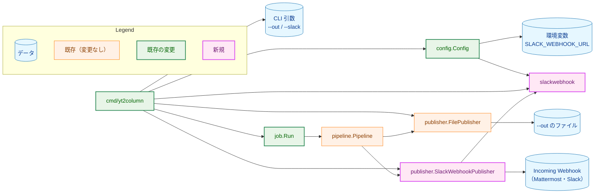
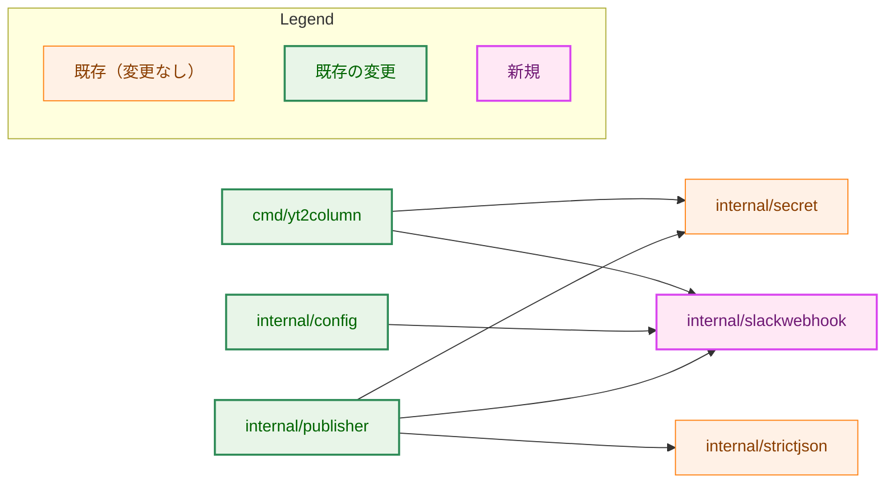
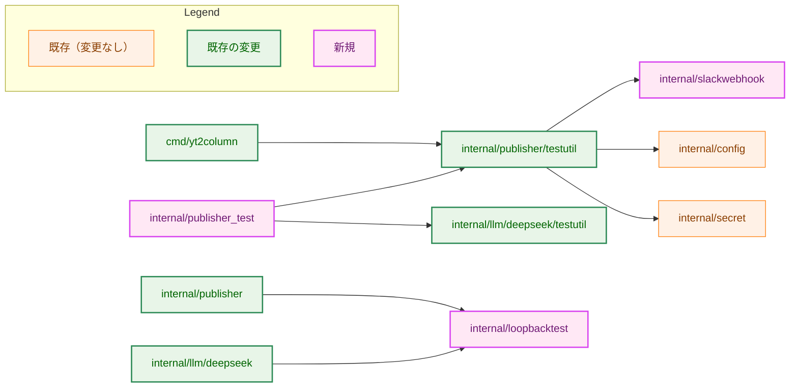
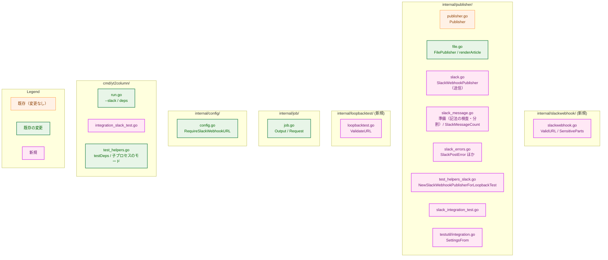
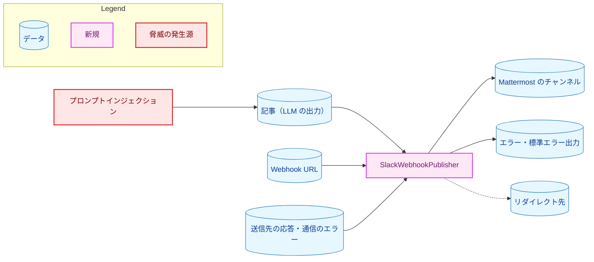
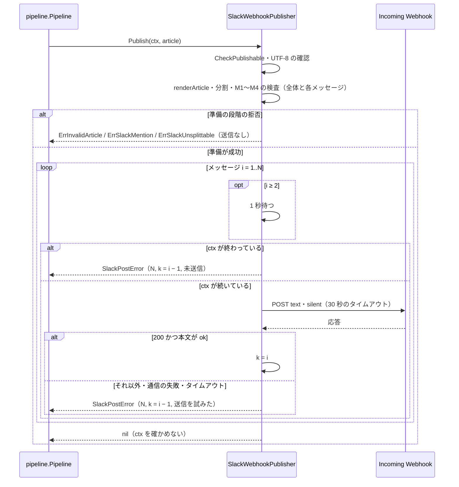
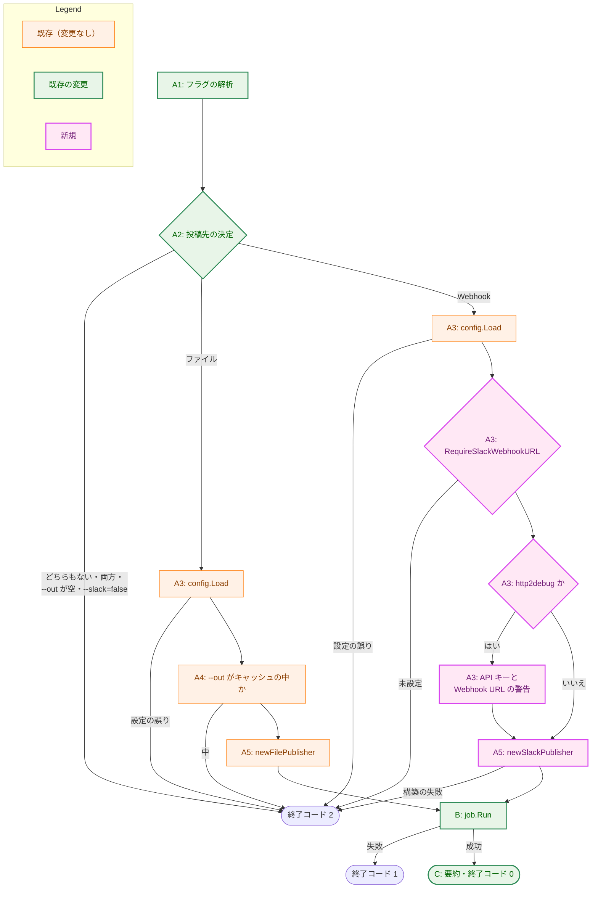

# アーキテクチャ設計書：Slack 互換の Webhook への投稿（SlackWebhookPublisher）

## Document Status

| Item | Value |
|---|---|
| Status | `approved` |
| Created | 2026-10-07 |
| Review date | 2026-10-07 |
| Reviewer | isseis |
| Comments | 編集上の修正（2026-10-07）: 実装計画の作成時に、3.14 の表へ、更新が必要な既存のテストとして `internal/pipeline/pipeline_test.go` の 2 つのガードのテストと、`run_test.go` の `newRunEnv` を書き加えた。いずれも 3.10・3.12・3.13 の決定に既存のテストを追従させるものであり、決定の変更はない。 編集上の修正（2026-10-07）: 実装計画のレビューで、3.12 の「分割する記事の 1 つ目のメッセージを上限ちょうどにする」は、3.5 の分割の規則（各断片は 16,383 − 9 コードポイント以内、1 つ目の分割の位置の表示は 7 コードポイント）では作れないことが分かった。3.12 と 7.4 の AC-30 の行を、上限ちょうどの受理を分割しない記事で確かめる形に直した。統合テストで確かめる事項（上限ちょうどのメッセージの受理と、2 つ以上のメッセージへの分割）は変わらず、決定の変更はない。 |

本書は [01_requirements.md](01_requirements.md)（以下、要件書）の設計である。既存のコードに関する記述は、コミット `1457754` のソースで確かめた。`file:line` はこのコミットの行番号を指す。Mattermost の振る舞いに関する記述は、3.1 に挙げた公式文書とサーバのソース（GitHub の `mattermost/mattermost` の `master` ブランチ、2026-10-07 に確認）で確かめた。

F-NNN・AC-NN は要件書の項番、H-NN は [design_handoff.md](design_handoff.md) の項目（対応は 3.15）を指す。本書では、要件書の用語に従い、Webhook への 1 回の `POST` で送る内容を「メッセージ」、`Title`・モデル・`Body` を並べた文字列を「投稿する文字列」、分割投稿の各メッセージに付ける `(2/3)` のような表示を「分割の位置の表示」と呼ぶ。「Webhook」とだけ書く場合は、Slack 互換の Incoming Webhook（Mattermost と Slack）を指す。エラーの `Error()` が返す文字列は「エラーの文言」と呼び、メッセージと区別する。`Publish` が投稿する文字列の検査と分割を終えるまでを「準備」と呼ぶ。

## 1. 設計の全体像 (Design Overview)

### 1.1. 設計原則

-   **Webhook に固有のことは `internal/publisher` の Webhook 用のファイルに閉じ込める。** ペイロードの形、文字数の数え方、分割、応答の判定、メンションの記法の検出は、すべて `SlackWebhookPublisher` とその補助の関数に置く。`internal/job` は「ローカルの事前確認が要る投稿先か」だけを知り、Webhook を知らない。`cmd/yt2column` は投稿先を選び、結果を報告する。
-   **Mattermost と Slack に共通の部分だけを送る。** ペイロードは `text` と `silent` だけとする（3.4）。Mattermost の振る舞いは公式文書とサーバのソースで確かめた値に合わせ（3.1）、Slack は best effort とする（要件書 2.2 の「対応の範囲」）。
-   **通知は 2 つの層で防ぎ、拒否の層を主とする。** すべてのメッセージに `silent` を指定し、さらにメンションの記法とそれを作りうる変形を含む記事を、送る前に拒否する（3.4。要件書 F-006）。`silent` は 2026-07-09 に Mattermost に加わったばかりであり（3.1）、それより前の版のサーバでは拒否の層だけが働く。そのため、拒否の規則は、Mattermost がメンションを見つける方法より広く取る（3.4）。
-   **送信先が書き換える記法は、送る前に拒否する。** Mattermost のサーバは、長さを比べる前に `<!channel>` や `<a|b>` などを書き換える（3.1）。これらを拒否すれば、サーバが数える長さと本ツールが数える長さが一致し、記事が黙って書き換えられることもない（3.5）。
-   **送る前にすべてを確定させる。** 記事の検査、メンションの記法の検出、分割は、最初のメッセージを送る前に終える。準備の後に失敗する原因は、通信と送信先の応答と `ctx` の終了だけにする（F-003・F-006）。
-   **Webhook URL は、エラーにも構造体の表示にも入れない。** `*url.Error` を返さない。応答の本文からは識別子の形の値だけを取り出し、Webhook URL の一部と一致するものは捨てる（4.2）。`SlackWebhookPublisher` の構造体は Webhook URL を `secret.Secret` としてだけ保持する（3.3）。
-   **投稿先の選択は型で表す。** `job.Request` は、投稿先の種類とそれに属する値（出力のパスと `Publisher`）を 1 つにまとめた `job.Output` を持つ。`OutPath` が空かどうかで振る舞いを推し量らない（[CLAUDE.md](../../../CLAUDE.md)「Declare, don't infer」。H-04）。
-   **検証の規則は 1 か所に置く。** Webhook URL の形式の規則と、秘密情報とみなす URL の部分を、新しい小さなパッケージ `internal/slackwebhook` に置き、`internal/config`・`SlackWebhookPublisher`・統合テストの判定・CLI の伏せ字化から使う（H-03）。

### 1.2. 概念モデル

**図1 概念モデル。** 矢印 A → B は「A が B を使う（呼び出す、または読み書きする）」を表す。



`cmd/yt2column` は `--out` と `--slack` のどちらか一方から投稿先を 1 つ選び、その `Publisher` だけを構築して `job.Output` に包み、`job.Run` に渡す。`pipeline.Pipeline` は渡された `Publisher` の `Publish` を呼ぶだけであり、変更しない。`cmd/yt2column` から `slackwebhook` への矢印は、標準エラー出力の伏せ字化に使う Webhook URL の部分の取得（3.10）を表す。

### 1.3. 既存コードとの関係

| 既存の部品 | 本タスクでの使い方 | 根拠 |
|---|---|---|
| `publisher.Publisher` | `SlackWebhookPublisher` が実装する。interface は変えない | `internal/publisher/publisher.go:14-16` |
| `renderArticle`（`FilePublisher` の出力の書式） | 投稿する文字列の組み立てに同じ関数を使う（3.4）。関数の内容は変えず、コメントの「file content」を投稿先に共通の書式である旨に直す | `internal/publisher/file.go:178-185` |
| `writer.Article.CheckPublishable` | 投稿の前に呼ぶ。拒否は `writer.ErrInvalidArticle` を包む | `internal/writer/article.go:13-39` |
| `config.validSlackWebhook` | 削除し、`internal/slackwebhook` の新しい規則に置き換える（3.2。要件書 F-001） | `internal/config/config.go:273-278` |
| `config.Config.SlackWebhookURL` | 変えない。CLI の伏せ字化（`configuredSecrets`）が引き続き使う。`--slack` の必須の判定には新しいメソッドを使う（3.9） | `internal/config/config.go:117-123` |
| `config.hasHTTP2Debug` | 判定の本体を公開し、Webhook の統合テストの判定からも使う（3.9・3.12） | `internal/config/config.go:286-290` |
| `internal/strictjson` | `200` 以外の応答の本文から、Mattermost のエラーの識別子を取り出すのに使う（4.2） | `internal/strictjson/strictjson.go:65`・`:83`・`:119` |
| DeepSeek アダプタの HTTP の扱い（リダイレクトを `http.ErrUseLastResponse` で止める、タイムアウトを `context.WithTimeoutCause` で与える、上限 + 1 バイトまで読む） | 同じ考え方を `SlackWebhookPublisher` で使う。コードは共有しない（3.6 に理由） | `internal/llm/deepseek/deepseek.go:74-80`・`:112-117`・`:145-158`、`response.go:40-50` |
| `deepseek.validateLoopbackEndpoint`（テスト用） | テスト用の共有パッケージ `internal/loopbacktest` に移し、DeepSeek と Webhook のテスト用の構築の両方から使う（3.3） | `internal/llm/deepseek/test_helpers.go:42-73`、`test_helpers_endpoint.go:18` |
| `job.Run` の `OutPath` の事前確認 | 投稿先がファイルの場合だけ行う（3.8） | `internal/job/job.go:60-62`・`:120-121`・`:137-162` |
| `cmd/yt2column` の標準エラー出力の無害化（`stderrWriter`・`sanitize`・`configuredSecrets`） | そのまま使う。`configuredSecrets` に Webhook URL の部分を加える（3.10） | `cmd/yt2column/run.go:113-121`・`:277-288`、`output.go:34-45` |
| `cmd/yt2column` のテストの組み立て（`testDeps`・子プロセスのモード） | Webhook の `Publisher` の既定を、送らずに失敗する代用品にする。シグナルの経路の子プロセスのモードを足す（3.10） | `cmd/yt2column/test_helpers.go:131-156` |
| `deepseektestutil.SettingsFrom`・`RunMakeTarget` | CLI の Webhook の統合テストにおける DeepSeek 側の判定と、`make` のターゲットのテストに使う。`RunMakeTarget` は記録する変数を呼び出し元から追加できるようにする（3.12） | `internal/llm/deepseek/testutil/integration.go:86-127`、`make.go:43`・`:81` |
| `pipeline.Pipeline.Run` | 変更しない。`Publish` のエラーを `StageError{Stage: StagePublish}` で包み、`Publish` の後に `context` を確かめない | `internal/pipeline/pipeline.go:112-115` |

## 2. システム構成 (System Structure)

### 2.1. パッケージ構成

パッケージの依存は、本番のビルドの import（図2-1）と、テスト用のビルド（`test` または `integration` のタグ）だけの import（図2-2）に分けて示す。どちらの図も、矢印 A → B は「A が B を import する」を表し、本タスクで加わる import だけを示す。

**図2-1 本番のビルドの依存。**



**図2-2 テスト用のビルドだけの依存。** 本番のビルドの依存（図2-1）は省く。`internal/publisher_test` は `internal/publisher` の外部テストのパッケージ（統合テストと `make` のターゲットのテスト）を表す。



-   `internal/slackwebhook` は標準ライブラリだけに依存するリーフパッケージである。`internal/config` から `internal/publisher` への依存を作らずに、規則を両方で共有できる（H-03）。
-   `internal/publisher` から `internal/strictjson` への import は、エラーの応答の JSON から識別子を取り出すためである（4.2）。`internal/strictjson` は `internal/publisher` を import しないので、循環しない。
-   統合テストの実行条件の判定は、既存の `internal/publisher/testutil` に、`test` と `integration` のどちらのタグでもビルドされるファイルとして加える（3.12）。`internal/publisher/testutil` は `internal/publisher` を import するので、`internal/publisher` の統合テストは外部テストのパッケージ（`package publisher_test`）に置き、循環を避ける。
-   `internal/job` は新たな import を持たない（`job.Output` は既存の `publisher.Publisher` だけを使う。3.8）。

### 2.2. コンポーネント配置

**図3 主なファイルの配置。** 矢印は使わない。色で新規と変更を区別する。変更するファイルの全体は 3.14 の表に示す。



### 2.3. データの流れ

投稿の段階のデータの流れ（記事の検査 → 投稿する文字列 → 分割 → メンションの検査 → 順次の送信）は、6.1 のシーケンス図に示す。CLI の手順の分岐は 6.2 に示す。

## 3. コンポーネント設計 (Component Design)

### 3.1. Mattermost と Slack の振る舞い（H-01）

確認日はいずれも 2026-10-07 である。サーバのソースのパスは、GitHub の `mattermost/mattermost` の `master` ブランチのものである。

**Mattermost（検証の対象）。**

| 事項 | 確認した内容 | 本設計の扱い | 出典 |
|---|---|---|---|
| ペイロード | `text`（Markdown として表示）、`channel`・`username`・`icon_url`・`attachments`・`props`・`priority`・`silent` など | `text` と `silent` だけを送る（3.4） | [Incoming Webhooks](https://docs.mattermost.com/developers/integrate/webhooks/incoming) |
| `silent` の効果 | 真にすると、投稿はチャンネルに表示されるが、デスクトップ・プッシュ・メールの通知を発生させない。加えて、未読の表示（未読のバッジと「New Messages」の区切り線）も付かない | すべてのメッセージに `silent: true` を付ける（3.4）。未読の表示が付かないことは 5.2 に記す | 同上、[PR #36771](https://github.com/mattermost/mattermost/pull/36771)（MM-68754） |
| `silent` に対応する版 | PR #36771 は 2026-07-09 にマージされた。どの版から含まれるかは確かめられなかった。それより前の版は、`encoding/json` の既定の動作でリクエストを読むので、`silent` を無視して通常どおり通知する | 拒否の層を主とする（1.1・3.4）。手動確認でサーバの版と `silent` の効果を記録する（AC-22） | 同上、`server/public/model/incoming_webhook.go` の `IncomingWebhookRequestFromJSON` |
| 長さを比べる前の書き換え | `ProcessSlackText` が `<!channel>`・`<!here>`・`<!all>` を `@channel`・`@here`・`@all` に、`<@ID>` を `@ユーザー名` に変える。続いて `CreateWebhookPost` が、`<` と `>` に囲まれ `\|` で区切られた並び（`<a\|b>`）を Markdown のリンク `[b](a)` に変える。HTML の文字参照は戻さない | M1・M4 で拒否する（3.4）。拒否するので、サーバが数える長さは本ツールが数える長さと一致する（3.5） | `server/channels/app/slack.go` の `ProcessSlackText`、`server/channels/app/webhook.go` の `CreateWebhookPost`（`linkWithTextRegex`） |
| 文字数の上限 | 公式文書は「posts up to 16383 characters」とする。サーバは `utf8.RuneCountInString(post.Message)` を `MaxPostSize()` と比べ、超える投稿を複数の投稿に分ける。`MaxPostSize()` は版とデータベースの列の大きさで決まり、現在の版では 16,383 より大きい | 上限は 16,383 コードポイントとし、コードポイントで数える（3.5） | 同上、`server/channels/app/webhook.go` の `splitWebhookPost` |
| メンションの検出 | `StandardMentionParser` が本文を語に分け、語の先頭の `:`・`.`・`-`・`_` を除いてから `@名前` を探す。文字・数字・`:`・`.`・`-`・`_`・`@` 以外の文字（表示されない書式文字やバックスラッシュを含む）は語の区切りになる | M2 は `@` の直前の文字を見ずに拒否する（3.4） | `server/channels/app/mention_parser_standard.go` |
| 成功の応答 | ステータス `200`、`Content-Type: text/plain`、本文 `ok` | ステータス `200` かつ本文がちょうど `ok` のときだけ成功とする（3.6） | 公式文書、`server/channels/web/webhook.go` の `incomingWebhook` |
| エラーの応答 | `model.AppError` の JSON。Web の層が失敗を包み直すので、`id` はほぼ常に `web.incoming_webhook.general.app_error`（読み取りの失敗は `web.incoming_webhook.decode.app_error`）であり、具体的な原因は `detailed_error` にしかない。`detailed_error` は開発者向けの設定が無効なら消される。`message` は Webhook のキー（`hook_id`）を含む。各 `AppError` は `request_id` を持ち、サーバのログと突き合わせられる | `id` と `request_id` のうち、決まった形で Webhook URL の一部と一致しない値だけを取り出す（4.2）。`message` は読まない | `server/channels/web/webhook.go`、`server/channels/web/handlers.go`、`server/i18n/en.json` |
| ステータスと原因 | `400`: 存在しない（削除された）Webhook、不正なペイロード。`403`: チャンネルのロック、権限の不足。`404`: チャンネルの削除など。`413`: ペイロードが大きすぎる。`501`: Webhook が無効 | CLI の案内はステータスで分け、Mattermost が原因を区別しないことを示す（3.10） | 同上 |
| レート制限 | Incoming Webhook のページに記載はない。サーバ全体のレート制限はサーバの設定による | 続けて送るメッセージの間を 1 秒あける（Slack の制限にも合う。3.6）。`429` は失敗とし、リトライしない（要件書 2.3） | 公式文書 |

**Slack（best effort）。** Slack の Incoming Webhook も `text` を受け付け、成功時にステータス `200` と本文 `ok` を返す（[Sending messages using incoming webhooks](https://docs.slack.dev/messaging/sending-messages-using-incoming-webhooks)）。ただし、Slack は `text` を mrkdwn として表示するので、見出しやリストは Markdown のとおりには表示されない。Slack には `silent` に当たる項目がないので、通知の抑止は拒否の層だけになる。Slack の Incoming Webhook のレート制限は 1 秒に 1 件（[Rate limits](https://docs.slack.dev/apis/web-api/rate-limits)）で、3.6 の間隔はこれに合う。Slack の `text` の文字数の上限は確かめていない（要件書 2.2）。16,383 コードポイントが Slack の上限を超えることを示す公式文書の記載は、見つからなかった（H-01）。エラーの応答は `invalid_payload` のような平文の識別子であり、4.2 の規則でエラーに含める。

**対象クライアント環境での検証。** 対象クライアント環境は Mattermost（Slack 互換の Incoming Webhook）である。上の値のうち、`silent` が含まれる最初の版だけは確かめられなかった。本設計は、`silent` が無視される場合にも働く拒否の層を主とする。実際のサーバでの `silent` の効果（通知と、未読数・メンション数・「New Messages」の表示）と、上限ちょうどのメッセージの受理は、統合テスト（3.12）と手動確認（AC-22・AC-33）で確かめる。

### 3.2. `internal/slackwebhook`（F-001・H-03）

```go
// Package slackwebhook holds the rule a Slack-compatible Incoming Webhook URL
// (Mattermost or Slack) must meet and names the parts of a URL that must never
// appear in output. It is shared by internal/config, internal/publisher,
// cmd/yt2column, and the integration tests, so each rule is written once.
package slackwebhook

// ValidURL reports whether value is an acceptable Webhook URL: net/url parses
// it (which rejects control characters), its scheme is "https", and its host
// is not empty.
func ValidURL(value string) bool

// SensitiveParts returns the strings derived from a webhook URL that must
// never appear in an error or a log: the URL, its path, its query, and its
// userinfo, each both as given and as net/url escapes it; the last path
// segment; and the last 8 characters of the URL, taken by character and by
// byte. Parts shorter than 8 bytes, other than those last 8 characters, are
// omitted, so a trivial path such as "/" never becomes a part.
func SensitiveParts(value string) []string
```

-   `ValidURL` は要件書 F-001 の規則（URL として解析できる、スキームが `https`、ホストが空でない）を実装する。現在の `config.validSlackWebhook`（`config.go:273-278`）を削除し、`loadSlackWebhook`（`config.go:216-233`）はこの関数を呼ぶ。`config.reasonSlackWebhook`（`config.go:53`）の文言は、新しい規則（`must be an https URL with a host`）に改める。
-   `SensitiveParts` は、`SlackWebhookPublisher` のエラーの理由と通信のエラーの文言の確認（4.2）と、CLI の伏せ字化（3.10）の両方が使う。どの部分を秘密情報とみなすかを 1 か所で決めるためである。`net/url` が書き出すときの形（パーセントエンコードされた形）も含めるので、ASCII 以外の文字を含む URL でも照合できる。8 バイトに満たない部分を除くのは、`https://host/a` のような URL で `a` が部分になり、CLI が標準エラー出力のすべての `a` を伏せてしまうことを避けるためである。末尾 8 文字は、既存の CLI の伏せ字化（`output.go:16-20` の `exposedTail`）と同じ考え方で含める。
-   **型ではなく関数で共有する理由。** H-03 の候補 (a)（検証済みの URL の型）は、要件書 F-001 が構築の引数を `secret.Secret` と定めているので採らない。不変条件は、`SlackWebhookPublisher` の非公開のフィールドと必須のコンストラクタで保証する（3.3）。
-   **新しいパッケージにする理由。** 規則を `internal/config` に置いて公開すると、`internal/publisher` が環境変数を読むパッケージに依存する。`internal/publisher` に置くと、`internal/config` が `writer`・`llm` などに推移的に依存する。どちらも責務の向きに合わないので、標準ライブラリだけに依存するリーフパッケージに置く。
-   パッケージの名前は、フラグと環境変数（`--slack`・`SLACK_WEBHOOK_URL`）の名前にそろえる。

### 3.3. `SlackWebhookPublisher` の構築（F-001）

```go
// SlackPostTimeout bounds the send and the response read of one message.
const SlackPostTimeout = 30 * time.Second

// SlackWebhookPublisher posts an article to a Slack-compatible Incoming
// Webhook (Mattermost is the verified target) as one or more messages. It
// holds the webhook URL only as a secret.Secret, so printing the struct never
// shows the URL. Its fields are set once by the constructor and never mutated
// afterwards. Publish on the zero value fails without sending.
type SlackWebhookPublisher struct {
	// unexported: the webhook URL (secret.Secret), the per-message timeout,
	// the interval between messages, and the *http.Client.
}

var _ Publisher = (*SlackWebhookPublisher)(nil)

// NewSlackWebhookPublisher validates webhookURL with slackwebhook.ValidURL
// and returns a publisher with the production timeout and interval. It never
// reads environment variables and never touches the network. A rejection
// never holds the URL or any part of it.
func NewSlackWebhookPublisher(webhookURL secret.Secret) (*SlackWebhookPublisher, error)
```

| 定数 | 値 | 理由 |
|---|---|---|
| メッセージ 1 つの送信のタイムアウト（`SlackPostTimeout`） | 30 秒 | 送信と応答の本文の読み取りの全体に適用する。LLM の呼び出し（最大 15 分）に比べて十分に短く、遅い回線でも誤って打ち切らない長さとする。CLI の案内が値を示すので公開する（既存の `job.YtDlpTimeout`・`provider.LLMTimeout` と同じ。`run.go:241-245`） |
| メッセージの間隔 | 1 秒 | Slack のレート制限に合わせ、Mattermost のサーバのレート制限にも余裕を持たせる（3.1） |
| 応答の本文の上限 | 8,192 バイト | Mattermost のエラーの応答（`AppError` の JSON）を読み切れる長さ（3.1） |
| 1 つのメッセージの上限 | 16,383 コードポイント | 3.1・3.5 |
| 分割の数の上限 | 10 | 3.5 |

-   構築の拒否は 2 種類である。ゼロ値の `secret.Secret`（`Reveal` がエラーを返す。`secret.go:40-45`）と、`slackwebhook.ValidURL` に合わない値である。どちらも非公開の固定のエラー（`errZeroWebhookURL`・`errInvalidWebhookURL`）を返し、値を含めない（AC-02・AC-03）。
-   構造体は Webhook URL を `secret.Secret` としてだけ持ち、解析した URL や `SensitiveParts` の結果をフィールドに保持しない。それらは `Publish` の呼び出しのたびに `secret.Secret` から求める（求め直す費用は LLM の呼び出しに比べて無視できる）。これにより、`fmt` の `%+v`・`%#v` や `log/slog` で構造体を出力しても、Webhook URL は `[REDACTED]` としか出ない（`secret.go:47-73`）。
-   次の 3 つの場合は、いずれも非公開の固定のエラーを返し、何も送らない。ゼロ値の構造体（パッケージの外からも作れる）に対して `Publish` を呼んだ場合、Webhook URL を取り出せない場合、`http.NewRequestWithContext` が失敗した場合（その `*url.Error` は URL を含む）である。
-   構築は `http.Client` を作るだけで、接続しない（AC-01）。`http.Client` の `CheckRedirect` は `http.ErrUseLastResponse` を返す（3.6）。`Transport` は既定の `http.DefaultTransport` を使う（プロキシの環境変数を含め、DeepSeek アダプタと同じ扱い）。

**テスト用の構築（`test` のタグだけ）。**

```go
// SlackTestOptions sets the timing of a test publisher. Timeout must be
// positive; Interval may be zero, which sends the messages without waiting.
type SlackTestOptions struct {
	Timeout  time.Duration
	Interval time.Duration
}

// NewSlackWebhookPublisherForLoopbackTest builds a publisher that posts to
// endpoint, which must be a loopback URL (loopbacktest.ValidateURL); any other
// endpoint, or a non-positive Timeout, fails t. It does not apply
// slackwebhook.ValidURL, so the endpoint may use http. Built only with the
// test tag.
func NewSlackWebhookPublisherForLoopbackTest(t testing.TB, opts SlackTestOptions, endpoint string) *SlackWebhookPublisher
```

```go
// Package loopbacktest checks that a test endpoint is a loopback URL, so a
// test helper that redirects a client cannot be pointed at an external host.
// Built only with the test tag.
package loopbacktest

// ValidateURL returns an error unless net/url parses endpoint, its host is
// not empty, and the host is a loopback IP address.
func ValidateURL(endpoint string) error
```

-   `deepseek.NewForLoopbackTest(t, opts, endpoint)`（`internal/llm/deepseek/test_helpers_endpoint.go:16-33`）と同じ考え方と引数の順で、規則を迂回する範囲をループバックアドレスに限る。`cmd/yt2column` のテストからも呼べるように公開する。
-   ループバックの判定は、`deepseek` のテスト用の補助 `validateLoopbackEndpoint` とその静的エラー（`internal/llm/deepseek/test_helpers.go:42-73`）を、振る舞いを変えずに `internal/loopbacktest` に移して共有する。呼び出し元の `test_helpers_endpoint.go:18` は `loopbacktest.ValidateURL` を呼ぶ。直接のテスト（`deepseek_test.go:172-185`）は `internal/loopbacktest` のテストに移す。
-   分割の上限値（16,383 コードポイント・10）はテストでも変えない。AC-08〜AC-11 は、上限を超える長さの記事を組み立てて確かめる（7.1）。

### 3.4. 投稿する文字列とペイロード（F-002・F-006・H-02）

**投稿する文字列。** `renderArticle(article)`（`file.go:178-185`）の戻り値をそのまま使う。すなわち `# <Title>`、空行、`- Model: <Model>`、`- Model version: <ModelVersion または (none)>`、空行、`Body` の順であり、`Body` で終わる（AC-04）。`FilePublisher` の出力と同じ書式なので、ファイルと Mattermost で記事の見え方がそろい、書式を 2 か所に書かずに済む。

**記事の拒否（UTF-8）。** `CheckPublishable` の後に、投稿する文字列に入る `Title`・`Body`・`Model`・`ModelVersion` がいずれも正しい UTF-8 であることを確かめる。正しくなければ、`writer.ErrInvalidArticle` を包んだエラーで、送る前に拒否する。`CheckPublishable` は UTF-8 の正しさを確かめない（`article.go:13-39`）。一方、`encoding/json` は不正なバイトを黙って U+FFFD に置き換える。このため、ここで確かめなければ、送信先が受け取るテキストが投稿する文字列と一致しない。`CheckPublishable` に加えずに `SlackWebhookPublisher` で確かめるのは、`FilePublisher` の振る舞いを変えないためである（要件書 5 章）。

**メンションの記法と、送信先が書き換える記法の拒否（F-006）。** 後掲の規則 M1〜M4 のいずれかに当たる場合、1 つのメッセージも送らずに `ErrSlackMention` を返す。判定は、投稿する文字列の全体と、分割した後の各メッセージのテキスト（分割の位置の表示を含む）の両方に対して、最初のメッセージを送る前に行う。V1〜V3 は文字をその場で除くか置き換えるだけで、`<`・`!`・`@`・`&` や、`@` の後ろに続く名前の文字を新たに作らない。分割の位置の表示は `<`・`&`・`@` を含まず、改行で終わる。断片の先頭のバックスラッシュの並びの前には `<` がない。したがって、各メッセージで見つかる並びは全体でも見つかる。それでも各メッセージを判定するのは、実際に送るテキストに記法がないことを直接確かめるためである。コードスパンやコードブロックの中も区別せず、判定の対象に含める。

M1・M2 は、次の表の V1〜V3 の 3 つの変換をした「検査用の文字列」に対して判定する。いずれも、Markdown の表示や送信先の処理で、見かけ上は記法でない並びが記法に変わりうる変形を戻すためのものである。変換は V2 → V3 → V1 の順に行う。V2・V3 の後で初めてバックスラッシュのエスケープの形になる並び（`<\` U+200B `!channel>`・`＜\!channel>`）を V1 で戻すためである。

| 変換 | 内容 | 戻す変形の例 |
|---|---|---|
| V1 | CommonMark のバックスラッシュのエスケープを先頭から順に解く。`\` と ASCII の句読点の組を、その句読点 1 文字に置き換え、組の直後から読み進める（`\\` は `\` になる） | `<\!channel>`・`\@here` |
| V2 | Unicode の一般カテゴリ Cf（書式文字。U+200B・U+2060・U+00AD・U+FEFF・双方向の制御文字など）を除く | `<` U+200B `!channel>` |
| V3 | 見た目の似た文字を ASCII の文字に置き換える: `＠`（U+FF20）・`﹫`（U+FE6B）→ `@`、`＜`（U+FF1C）・`﹤`（U+FE64）→ `<`、`！`（U+FF01）・`﹗`（U+FE57）→ `!` | `＠here`・`＜!channel>` |

| 規則 | 拒否する並び | 判定の対象 | 例 |
|---|---|---|---|
| M1 | `<` の直後に `!` または `@` | 検査用の文字列 | `<!channel>`・`<!here>`・`<!all>`・`<!everyone>`・`<!subteam^S123>`・`<@U123>` |
| M2 | `@` の直後に、Unicode の文字・数字、または `_`（`@` の直前の文字は見ない） | 検査用の文字列 | `@channel`・`@all`・`@here`・`@everyone`・`@Channel`・`@user_name`・`_@channel_`・`a\@here`・`user@example.com` |
| M3 | 文字参照の始まり: `&#`、または `&` の直後に ASCII の英字が 1 つ以上続いて `;` で終わる並び | 投稿する文字列 | `&#64;here`・`&#x40;channel`・`&commat;everyone`・`&lt;!channel&gt;` |
| M4 | Mattermost がリンクに書き換える並びを含む、より広い並び: `<` の後に、改行・`<`・`\|`・`>` 以外の文字が 1 つ以上、`\|`、改行・`>` 以外の文字が 1 つ以上、`>` と続く並び。サーバの正規表現（3.1）より狭くならないように、2 つ目の部分は `\|` も許す | 投稿する文字列 | `<https://example.com\|ここ>`・`Array<string\|number>`・`Map<K\|V\|W>` |

-   **M1 の根拠。** Mattermost は `<!channel>`・`<!here>`・`<!all>`・`<@ID>` をメンションに変える（3.1）。`<!everyone>`・`<!subteam^…>` は Mattermost では変わらないが、Slack ではメンションになる（要件書 F-006）。`<` の直後の `!`・`@` をすべて拒否すれば、両方の記法を 1 つの規則で拒否できる。
-   **M2 で `@` の直前を見ない理由。** Mattermost は語の先頭の `_` などを除いてからメンションを探し、書式文字やバックスラッシュを語の区切りとして扱う（3.1）。そのため `_@channel_`・`a` U+200B `@here`・`a\\@here` は通知になる。直前の文字で語の途中かどうかを判定すると、サーバの語の分け方を正確に写す必要があり、少しずれただけで見逃しになる。`silent` に対応しない版では拒否の層だけが通知を防ぐ（3.1）ので、直前の文字にかかわらず、名前の形の文字が続く `@` をすべて拒否する。メールアドレス（`user@example.com`）も拒否されるが、見逃しより安全である。
-   **V1〜V3 と M3 の理由。** Mattermost のサーバは文字参照を戻さず、見た目の似た文字を `@` とみなす根拠もない。それでも、Mattermost の画面での表示、Slack の処理（best effort）、将来のサーバの版の変更で、これらの変形が記法として扱われないとは確かめられない。拒否する記事が少し増えるだけで、検出の漏れを減らせるので含める。V1〜V3 は判定のためだけの変換であり、送る文字列は変えない。
-   **M4 の理由。** Mattermost は `<a|b>` を `[b](a)` に書き換えてから長さを比べる（3.1）。書き換えで 1 コードポイント増えるので、上限ちょうどのメッセージをサーバがさらに分け、分割の位置の表示と食い違う。また、記事の文字列（`Array<string|number>` など）が黙ってリンクに変わる。拒否すれば、どちらも起きない（[CLAUDE.md](../../../CLAUDE.md)「Reject, don't normalize」）。
-   **拒否による影響。** M2 は、YouTube のハンドル（`@channelname`）、メールアドレス、プログラミングの注釈（`@Override`）、`@` で始まる単価の表記（`@3,000円`）を含む記事も拒否する。M3 は `&amp;` などを、M4 は `<a|b>` の形を含む記事を拒否する。拒否は LLM の呼び出しの後に起こり、その記事は保存されない。どれだけの記事が拒否されるかは測っていない（5.2）。誤って通知を起こす害（外部の第三者がチャンネルの全員に通知を送れる）は、記事を投稿できない不便より重いと判断した。CLI は、拒否の理由と、`--out` を指定すれば生成された記事をファイルで確かめられることを示す（3.10）。README にもこの制限を書く（3.13）。
-   **`Model`・`ModelVersion` も対象にする理由と制約。** どちらもプロバイダの応答から来る値であり、LLM の出力と同じく信頼できない。`Makefile` の既定のモデル名（`YT2COLUMN_MODEL ?= deepseek-flash`）は `@` を含まない。`@` を含むモデル名を使うプロバイダを加える場合は、M2 によってすべての記事が拒否されるので、その時点で対象を見直す（9 章）。
-   **拒否しないもの。** `<` の直後が `!`・`@` 以外で、`|` を含まない並び（自動リンク `<https://…>` など）。出典のリンク（`writer` が付ける `<https://www.youtube.com/watch?v=…>`。`internal/writer/output.go:145-147`）はこれに当たる。`~` で始まるチャンネルへのリンク（Mattermost の `~town-square`）は通知を起こさないので対象外である。利用者が Mattermost に設定した通知のキーワード（`@` を付けない語）は、送る前に知りようがないので対象外であり、`silent` だけが防ぐ（5.2）。
-   **既存の検査との関係。** `writer` の生の HTML の検査（`internal/writer/markdown.go:237-260`）は、`Body` のコードスパンの外にある `<!` を拒否するが、`<@`、コードスパンの中、`Title` は対象外である。`CheckPublishable` も記法を検査しない。また `SlackWebhookPublisher` は `writer` 以外から作られた `Article` も受け取りうる。したがって `SlackWebhookPublisher` は既存の検査に頼らず、自分で M1〜M4 を検査する。
-   エラーの文言は、当たった規則（M1〜M4）と、投稿する文字列での行と列の番号だけを示し、記事の内容を含めない。

**ペイロード。** 1 つのメッセージのペイロードは次の形で、`encoding/json` で符号化する。

```go
// webhookPayload is the JSON body of one message. Only the members common to
// Mattermost and Slack are sent; silent is Mattermost's and is ignored by
// Slack and by Mattermost servers that predate it.
type webhookPayload struct {
	Text   string `json:"text"`
	Silent bool   `json:"silent"` // always true
}
```

-   `text` はメッセージのテキスト（分割の位置の表示を含む。3.5）であり、Mattermost は Markdown として表示する（3.1）。
-   `silent` は常に `true` とする（AC-21a）。メンションでない通常の投稿でも、通知は発生せず、未読の表示も付かなくなる（3.1・5.2）。
-   `blocks`・`attachments`・`props`・`channel`・`username`・`icon_url` は送らない（AC-04。要件書 2.3）。
-   `encoding/json` は `"`・`\`・`<`・`>`・`&`・U+2028・U+2029 をエスケープするので、記事の内容にかかわらずペイロードの構造は変わらず、送信先が復号する `text` はメッセージのテキストと一致する（AC-06）。UTF-8 の正しさは、上の記事の拒否で確かめてある。

### 3.5. 分割（F-003）

**数え方と上限。** 投稿する文字列とメッセージのテキストの長さは、Unicode のコードポイントの数で数え、1 つのメッセージを 16,383 コードポイント以内にする。

-   **Mattermost と一致する理由。** Mattermost のサーバは、投稿の本文のコードポイントの数（`utf8.RuneCountInString`）を `MaxPostSize()` と比べる（3.1）。比べる前にテキストを書き換えるのは、`ProcessSlackText`（`<!channel>`・`<!here>`・`<!all>`・`<@ID>`）と `<a|b>` のリンクへの書き換えだけであり、前者は M1、後者は M4 で拒否する（3.4）。したがって、サーバが数える長さは、本ツールが数える長さと一致する。要件書 F-003 の「Mattermost が数える値以上」を、等号で満たす。
-   **上限の値。** 公式文書の 16,383 文字を使う。現在の版の `MaxPostSize()` はこれより大きいので、余裕を持って収まる。データベースのスキーマが古いままの古い版のサーバでは、`MaxPostSize()` が 4,000 などの小さい値になりうる（5.2）。その場合、サーバは本ツールのメッセージをさらに分けて投稿し（3.1 の `splitWebhookPost`）、分割の位置の表示と実際の投稿の数が食い違う。統合テストで上限ちょうどのメッセージを送って確かめる（3.12）。
-   **Slack（best effort）。** Slack の `text` の上限は確かめていない（3.1）。
-   日本語の文字も 1 コードポイントなので、1 つのメッセージに入る日本語はおよそ 16,000 字である。LLM が生成するコラム（数千字）は、ほとんどの場合 1 つのメッセージに収まる。

**分割の規則。**

-   投稿する文字列の全体が 16,383 コードポイント以内なら、1 つのメッセージで送り、分割の位置の表示を付けない（AC-07・AC-10）。
-   超える場合は、投稿する文字列を先頭から順に断片に区切る。各断片は「16,383 − 分割の位置の表示の最大の長さ」コードポイント以内とする。分割の位置の表示は、`(k/N)`（k は何番目のメッセージか、N はメッセージの総数）の後に空行（`\n\n`）を続けたものであり、断片の前に付ける。最大の長さは、分割の数の上限 10 のときの `(10/10)\n\n` の 9 コードポイントとする。
-   区切る位置の候補は、断片が上限に収まる範囲にある改行の直後のうち、前側の断片が空白文字だけにならないものである。候補のうち最も後ろの位置で区切る（改行は前の断片の末尾に残る）。候補がない場合に限り、収まる範囲の最後のコードポイントの境界で区切る（AC-08・AC-09）。空白文字は `unicode.IsSpace` が真の文字とする。
-   各断片から分割の位置の表示を除いて順に連結すると、投稿する文字列と一致する（文字を失わず、加えない）。
-   コードポイントの境界で区切っても空白文字だけの断片が残る場合（上限を超える長さの空白文字の連なりを含む記事）と、断片の数が 10 を超える場合は、1 つのメッセージも送らずに `ErrSlackUnsplittable` を返す（AC-11）。
-   分割した後の各メッセージのテキストも、M1〜M4 で判定する（3.4）。
-   **分割の数の上限を 10 とする理由。** 10 メッセージは日本語でおよそ 160,000 字に当たり、コラムの長さの数十倍である。これを超える記事は LLM の異常な出力とみなす。10 メッセージを 1 秒ずつあけて送っても 10 秒程度であり、LLM の呼び出しに比べて無視できる。
-   分割の位置の表示を各断片の先頭に置くのは、読み手が、メッセージの冒頭で、それが全体の何番目か分かるようにするためである。

**メッセージの数の公開。** CLI が成功時にメッセージの数を表示する（F-007）ために、投稿と同じ準備（`CheckPublishable`・UTF-8 の確認・投稿する文字列の組み立て・分割・記法の検査）だけを行い、数を返す関数を公開する。

```go
// SlackMessageCount returns how many messages Publish sends for article. It
// performs the same preparation as Publish, touches no network, and returns
// the same pre-send errors.
func SlackMessageCount(article writer.Article) (int, error)
```

-   `Publish` と `SlackMessageCount` は同じ非公開の準備の関数を呼ぶ。準備は記事だけから決まり、上限値はパッケージの定数でテストでも変えない（3.3）ので、同じ記事に対する数は必ず一致する。上限値を構築ごとに変えられるようにする場合は、この関数をメソッドに変える必要がある。
-   `Publisher` interface に戻り値を足す案は、`FilePublisher`・`pipeline`・`job` とそのテストの変更が要るので採らない。

### 3.6. 送信と応答の検証（F-004）

`Publish` は、準備（3.4・3.5）を終えた後、メッセージを先頭から 1 つずつ送る。送信は次の規則に従う。順序は 6.1 の図に示す。

-   2 つ目以降のメッセージの前に、1 秒待つ。待つ間に `ctx` が終われば、送らずに中断する。
-   各メッセージを送る直前に `ctx` を確かめ、終わっていれば送らずに中断する（AC-17 の、キャンセル済みの `ctx` でリクエストを送らないこと）。
-   各メッセージの送信と応答の本文の読み取りは、`ctx` から `context.WithTimeoutCause` で作った `SlackPostTimeout` のタイムアウトの中で行う。DeepSeek アダプタと同じく `http.Client.Timeout` は使わない。タイムアウトを `context.DeadlineExceeded` として判別するためである（H-06）。エラーに包むのは、その `context` の `Err()`（`context.DeadlineExceeded` または `context.Canceled`）であり、`context.Cause` ではない（DeepSeek アダプタの `contextFailure`、`deepseek.go:160-174` と同じ）。
-   `POST`、`Content-Type: application/json` で送る。

| 応答 | 本文の読み方 | 結果 |
|---|---|---|
| `200` | 8,193 バイトまで読む | 8,192 バイトを超えたら `ErrSlackInvalidResponse`。ちょうど `ok` なら成功。それ以外（空、`OK`、`ok\n`、`{"ok":true}` など）は `ErrSlackInvalidResponse`（AC-13・AC-14） |
| `200` 以外（3xx・`429` を含む） | 8,193 バイトまで読む | `*SlackHTTPStatusError`（`ErrSlackHTTPStatus`）。ステータスコードと、本文から取り出した識別子（4.2）を持つ（AC-12・AC-15・AC-20） |
| 応答なし（接続の失敗など） | — | `ErrSlackTransport`。ただしタイムアウトの `context` が終わっていれば、`context` のエラーを包む（AC-16・AC-17） |

-   **リダイレクト。** `CheckRedirect` が `http.ErrUseLastResponse` を返すので、3xx は通常の応答として返り、`Location` の送信先にはリクエストを送らない。`Referer` に Webhook URL が載ることもない（AC-15）。リダイレクトを止めるためのエラーを返さないので、そのエラーが `*url.Error` に包まれることもない（H-06）。
-   **本文の読み取りの失敗。** `200` で本文の途中で読み取りに失敗した場合は、`ErrSlackTransport`（または `context` のエラー）とする。`200` 以外で本文の読み取りに失敗した場合は、識別子を持たない `*SlackHTTPStatusError` とする（ステータスで失敗は確定しているため）。
-   **自動でリトライしない。** `429` も他の失敗と同じく直ちに返す（要件書 2.3）。
-   **最後のメッセージの後。** 最後のメッセージの成功を確かめたら、`ctx` を確かめずに `nil` を返す。すべてのメッセージを投稿した後に受けたシグナルで、投稿が失敗にならないようにするためである（F-007。`FilePublisher` の `file.go:100-105` と同じ考え方）。
-   準備の後の失敗は、すべて `*SlackPostError` で包んで返す（4.1）。準備の段階の失敗（`writer.ErrInvalidArticle`・`ErrSlackMention`・`ErrSlackUnsplittable`）は包まない（F-005）。`ctx` がはじめから終わっている場合は、準備を終えた後、最初のメッセージを送る直前の確認で中断するので、`*SlackPostError` で包まれる。このときの k（投稿を確かめたメッセージの数、`Posted`）は 0 であり、エラーはそのメッセージを送っていないことを示す（4.1）。
-   **DeepSeek アダプタとコードを共有しない理由。** リダイレクトを止める設定、上限 + 1 バイトまでの読み取り、`context` を先に見る失敗の分類は、どちらも数行であり、返す番兵がパッケージごとに異なる（4.1）。共通の補助のためにパッケージを足すと、番兵を引数で受け取る形になり、数行の重複をなくす利点より、2 つのアダプタが同じパッケージに縛られる費用のほうが大きい。

**既存の方針との違い（DeepSeek アダプタ）。** [0003 の 02_architecture.md](../0003_deepseek_llm_client/02_architecture.md) の 3.4 と H-07 への対応は、DeepSeek アダプタについて「`200` 以外の応答本文を読まない」と定めている。理由は、DeepSeek の `401` の応答本文が API キーの末尾 4 文字を含むことを確かめたためである。Mattermost のエラーの応答も、`message` に Webhook のキーを含む（3.1）。本設計は、要件書 F-005 が「HTTP ステータスによる失敗のエラーは応答の本文から読み取ったエラーの理由を含む」と定めているので、`200` 以外の本文を上限まで読む。ただし、エラーに含めるのは `id` と `request_id` のうち、決まった形で Webhook URL の一部と一致しない値（4.2）だけであり、`message` を含むそれ以外の本文は捨てる。この方針は DeepSeek アダプタ固有のものであり、その振る舞いは変えないので、更新が必要な既存のテストはない。

### 3.7. `Publish` の全体

```go
// Publish checks article, rejects mention syntax and syntax the server would
// rewrite, splits it into messages, and posts them in order with silent set,
// waiting between messages. It sends nothing when a preparation check fails.
// After preparation, every failure is a *SlackPostError that tells how many
// of the messages were confirmed posted.
func (p *SlackWebhookPublisher) Publish(ctx context.Context, article writer.Article) error
```

### 3.8. `internal/job`（F-007・H-04）

```go
// Output is where Run sends the article: the Publisher together with what Run
// needs to know about it. The zero value is rejected by Run, so an output that
// was never chosen cannot run.
type Output struct {
	// unexported: the kind (file or remote), the file path, the Publisher
}

// FileOutput is an output to a local file. Run pre-checks path before any side
// effect; p must write to path (the caller builds both from the same value).
func FileOutput(path string, p publisher.Publisher) Output

// RemoteOutput is an output that needs no local pre-check, such as a Webhook.
// The kind is defined by that property, not by where the article goes.
func RemoteOutput(p publisher.Publisher) Output

// Request is one run. Writer and the Output's Publisher are built by the
// caller.
type Request struct {
	VideoURL  string
	CacheDir  string
	YtDlpPath string
	Refresh   bool
	KeepCache bool
	Writer    writer.ArticleWriter
	Output    Output
}
```

-   `Request` の `OutPath` と `Publisher` のフィールドをなくし、`Output` にまとめる。出力のパスと `Publisher` は同じコンストラクタで束ねられるので、パスだけ、または `Publisher` だけを設定した `Request` は作れない。
-   `validateRequest`（`job.go:114-129`）は、`Output` の種類を `switch` で判定する。ファイルはパスが空でないことと `Publisher` が nil でないこと、リモートは `Publisher` が nil でないことを求める。`default`（ゼロ値）は `errInvalidRequest` で拒否する。
-   `OutPath` の事前確認（`job.go:60-62`）は、同じく `switch` でファイルの場合だけ行う。
-   それ以降の手順（排他、掃除、パイプライン、キャッシュの削除）は投稿先によらず変えない（F-007）。
-   **`job` が Webhook を知らない理由。** `job` が投稿先について知る必要があるのは「ローカルの事前確認をするか」だけである。種類を投稿先ごとに列挙すると、投稿先を加えるたびに `job` を変える必要がある。ファイルとリモートの 2 種類にすれば、新しいリモートの投稿先は `RemoteOutput` で渡せる（9 章）。
-   **残る約束。** `FileOutput` の `p` が `path` に書き込むことは、型では保証しない（`FilePublisher` を `job` の中で作ると、CLI のテストが偽の `Publisher` を差し込めなくなる）。この約束は現在もあり（`internal/job/test_helpers.go:40-41` の `newOutput`）、本設計はそれを 1 つのコンストラクタの引数の組に狭める。
-   **H-04 のもう 1 つの候補（`Publisher` の側の、実装は必須でない interface で事前確認を表す）を採らない理由。** `precheckOutput` は `FilePublisher` とコードを共有しない、できる範囲での確認であり（`job.go:131-136` のコメント）、`publisher` に移すと `FilePublisher` の上書きしない保証と事前確認の責務が混ざる。

### 3.9. `internal/config` の変更（F-001・F-007）

```go
// RequireSlackWebhookURL returns the Webhook URL, or a *VarError naming
// SLACK_WEBHOOK_URL and wrapping ErrMissing when none is configured. The error
// never holds a value.
func (c Config) RequireSlackWebhookURL() (secret.Secret, error)

// HTTP2DebugEnabledIn reports whether a GODEBUG value turns on the Go HTTP/2
// transport's log ("http2debug=1" or "http2debug=2" as a substring).
func HTTP2DebugEnabledIn(godebug string) bool
```

-   **`RequireSlackWebhookURL` を足す理由。** `cmd/yt2column` が `--slack` で `SLACK_WEBHOOK_URL` が未設定であることを報告するには、変数の名前が要る。しかし、秘密の変数の名前を本番のコードに書けるのは `internal/config` だけである（`internal/config/envaccess_test.go:57-68` の `secretEnvNames` と `allowedEnvRefs`）。`config` が名前を持つ `VarError` を返し、CLI は既存の設定の誤りと同じ書式で表示する（`run.go:156-163`）。既存の `SlackWebhookURL`（`(secret.Secret, bool)` を返す）は、設定されていれば伏せ字にする用途（`configuredSecrets`）のために残す。
-   `HTTP2DebugEnabledIn` は、既存の `hasHTTP2Debug`（`config.go:286-290`）の判定の本体を公開したものである。`hasHTTP2Debug` はこれを呼ぶ。Webhook の統合テストの判定（3.12）が、同じ判定を複製せずに使う。
-   `SLACK_WEBHOOK_URL` の検証を `slackwebhook.ValidURL` に替える（3.2）。受理する値は要件書 F-001 のとおり広がり、Mattermost の URL や `https://hooks.slack.com.example/...` を受理する。一方、従来の規則が受理していた値のうち、`net/url` が解析できない値（`https://hooks.slack.com/services/%zz`、DEL を含む値など）は拒否されるようになる（3.14 の E4）。`Load` の他の振る舞いは変えない（`--out` の場合も、設定されていれば検証する。F-007）。

### 3.10. `cmd/yt2column`（F-007）

**フラグ。** `cliOptions`（`run.go:67-73`）に `slack bool` を足し、`newFlagSet`（`run.go:78-88`）に `--slack` を加える。説明の文は `post the article to the Slack-compatible Incoming Webhook (e.g. Mattermost) configured in the environment (see README)` とし、Mattermost に投稿できることを示す（AC-27）。環境変数の名前は書かない。書くと、秘密の変数の名前を `internal/config` の外の本番のコードに書くことになり、`envaccess_test.go` の検査（`:57-68`）で失敗するためである。`--out` の説明から `(required)` を除き、使い方の文（`run.go:94`）に「`--out` と `--slack` のどちらか一方を指定する」ことを書く。

**投稿先の決定（0005 の手順 A2 の後半。手順の一覧は後の「手順の変更」の表）。** 各フラグが指定されたかどうかは、値ではなく、`flag.FlagSet.Visit` による「フラグが現れたか」で判定し、直ちに投稿先を決める。以降の手順は投稿先の `switch` だけで分岐する。

| `--out` | `--slack` | 結果 |
|---|---|---|
| あり（値が空でない） | なし | ファイル |
| なし | あり（値が真） | Webhook |
| なし | なし | 終了コード `2`（`one of --out or --slack is required`） |
| あり | あり | 終了コード `2`（`--out and --slack cannot be used together`） |
| あり（値が空） | なし | 終了コード `2`（`--out needs a path`） |
| — | あり（`--slack=false`） | 終了コード `2`（`--slack=false is not accepted; omit --slack instead`） |

-   複数の行に当たる場合は、表の下の行ほど先に判定する。すなわち `--slack=false`、空の `--out`、両方の指定、どちらもない、の順に拒否を判定する（例: `--out "" --slack` は `--out needs a path`、`--out x --slack=false` は `--slack=false` の拒否）。
-   `--out ""` を「指定なし」とみなさずに拒否するのは、値の内容から投稿先を推し量らないためである。`--slack=false` を拒否するのは、「現れたか」と「値」のどちらで判定するかの曖昧さを残さないためである。現れたかだけで判定すると、`--slack=false` で投稿してしまう。
-   現在の `opts.out == ""` の判定（`run.go:150-152`）はこの表に置き換わる。

**手順の変更。** 0005 の手順 A1〜C（`run.go:123-219`）を次のとおり変える。いずれも `job.Run` より前の検証は終了コード `2` のままである。

| 手順 | ファイル | Webhook |
|---|---|---|
| A2 | 投稿先の決定（上の表） | 同左 |
| A3 | 設定の読み込み（変更なし） | 設定の読み込みの後、`cfg.RequireSlackWebhookURL()`。エラーなら既存の設定の誤りと同じ書式で表示し、終了コード `2`（AC-24） |
| A3 の警告 | 既存の API キーの警告だけ | 既存の API キーの警告に加え、`warning: GODEBUG enables http2debug, so the Go HTTP/2 log may write the Webhook URL path to standard error` を書く（AC-28）。どちらも LLM の呼び出しより前 |
| A4 | `--out` がキャッシュディレクトリの中なら終了コード `2`（変更なし） | 行わない |
| A5 | `d.newFilePublisher(opts.out)` | `d.newSlackPublisher(webhookURL)`。構築の失敗は終了コード `2`（`build the publisher: …`、値を含まない）。`config` と同じ規則なので、本番では起こらない |
| B | `job.Run`（`Output: job.FileOutput(opts.out, pub)`） | `job.Run`（`Output: job.RemoteOutput(pub)`） |
| C | 既存の要約（変更なし） | `posted the article to the webhook in <N> messages (model: …, model version: …)`。N は `publisher.SlackMessageCount(result.Article)` で得る |

-   手順 C の `SlackMessageCount` は、本番では `Publish` が同じ記事で成功した後に呼ぶので、エラーにならない（3.5）。成功する偽の `Publisher`（`publishertestutil.FakePublisher`）を使うプロセス内のテストでは、メンションを含む記事でも `Publish` が成功しうる。その場合は数の代わりに `unknown` と書き、終了コードは `0` のままとする（投稿は成功しているため）。
-   `deps`（`run.go:39-43`）の `newPublisher func(path string) (publisher.Publisher, error)` を、`newFilePublisher func(path string) (publisher.Publisher, error)` と `newSlackPublisher func(secret.Secret) (publisher.Publisher, error)` の 2 つに分ける。`productionDeps` は後者に `publisher.NewSlackWebhookPublisher` を包む関数（構築の失敗で typed nil を返さない。`run.go:55-64` と同じ考え方）を設定する。
-   **テストの組み立て。** `testDeps`（`cmd/yt2column/test_helpers.go:131-135`）は `productionDeps()` から始まるので、そのままでは `--slack` のテストが環境の `SLACK_WEBHOOK_URL` へ実際に送りうる。`testDeps` の `newSlackPublisher` の既定を、何も送らずにエラーを返す代用品にする（送らない側に倒す）。プロセス内のユニットテストは、`NewSlackWebhookPublisherForLoopbackTest` で作った値を返す関数に差し替える。シグナルの経路（AC-26 の「`--slack` での投稿中の SIGINT・SIGTERM」）は子プロセスで確かめる（`signal_test.go`）が、子プロセスには `testing.TB` がない。そこで、子プロセスのモード（`runChildMode`、`test_helpers.go:140-156`）に、次の 2 つを使うモードを足す。すぐに記事を返す偽の LLM と、`ctx` が終わるまで止まる偽の `Publisher` である。この `Publisher` は、待機の状態になったことを既存の `childReadyEnv` の仕組みで知らせ、`ctx` が終わると `&publisher.SlackPostError{Total: 1, Posted: 0, Attempted: true, Err: ctx.Err()}` を返す。実際の `SlackWebhookPublisher` と同じ形のエラーを返すので、シグナルの経路でも CLI の表示を確かめられる。
-   **失敗の表示（`reportRunError`、`run.go:232-254`）に足すもの。** 1 行目（段階の失敗の行）は既存のとおり、`SlackPostError` のエラーの文言（N のうち k、4.2）を含む。
    -   `*publisher.SlackPostError` で `Posted ≥ 1` の場合: `Attempted` が偽なら `<k> of <N> messages stay in the channel`、真なら `at least <k> of <N> messages stay in the channel (message <k+1> may also have been posted)` に続けて、`; running again generates a new article and posts all of it from the first message` を書く（AC-25）。`Posted` が 0 の場合は、チャンネルに残るメッセージがないので出さない。
    -   `*publisher.SlackHTTPStatusError` のステータスが `400`・`403`・`404`・`501` の場合: `the server rejected the post; Mattermost does not report which of these it was: the Incoming Webhook was deleted or disabled, its channel was deleted, locked, or does not accept posts, or the payload was invalid. Check the webhook settings and the server log (request ID: <id>)`。request ID がない場合はその部分を省く。
    -   `errors.Is(err, context.DeadlineExceeded)` かつ段階が投稿の場合: `the webhook post timed out after the <SlackPostTimeout> limit`。
    -   `errors.Is(err, publisher.ErrSlackMention)` の場合: `the article was not posted and was discarded; part of it could be treated as a mention or rewritten by the server. Run again to generate a new article, or use --out to inspect what is generated`。
    -   既存の `context.Canceled` の案内（キャッシュを削除しなかったこと）は、投稿の段階でもそのまま出る。
-   **伏せ字化の対象の追加。** `configuredSecrets`（`run.go:277-288`）は、`SLACK_WEBHOOK_URL` が設定されていれば、その値に加えて `slackwebhook.SensitiveParts` の各文字列も返す。各部分も返すのは、URL 全体だけを伏せる現在の扱いでは、パスだけの断片が標準エラー出力に現れた場合に、末尾 8 文字以外が残るためである。`SensitiveParts` は 8 バイトに満たない部分を返さない（3.2）ので、短い文字列が標準エラー出力の至るところで伏せられることはない。`--out` の実行でも伏せる対象が増えるだけで、表示が変わるのは Webhook URL の一部を含む行だけである。
-   標準エラー出力のすべての行は、既存の `stderrWriter.line`（`run.go:118-121`）を通る。信頼できない文字列のエスケープも既存の仕組みに任せる（AC-26）。

**実行経路の一覧との対応（要件書 F-007 の表）。**

| 経路 | 決まる場所 | 終了コード |
|---|---|---|
| `--slack` での成功 | 手順 C | `0` |
| `--out` と `--slack` のどちらもない、または両方がある | 手順 A2 | `2` |
| `--slack` で `SLACK_WEBHOOK_URL` が未設定 | 手順 A3 | `2` |
| `--slack` での準備の段階の拒否（記事の拒否、記法の拒否、分割の拒否。キャッシュは残り、記事は保存されない） | 手順 B（`StageError`、段階は投稿） | `1` |
| `--slack` での投稿の失敗（最初のメッセージ） | 手順 B（`SlackPostError`、k = 0） | `1` |
| `--slack` での分割投稿の途中での失敗 | 手順 B（`SlackPostError`、k ≥ 1） | `1` |
| `--slack` での投稿中の SIGINT・SIGTERM | 手順 B（`context.Canceled` を包む `SlackPostError`） | `1` |
| `--slack` で、すべての投稿の後に SIGINT・SIGTERM | 手順 C（キャッシュの削除の失敗は警告） | `0` |

### 3.11. 副作用の契約

`--out` と `--slack` は、投稿の段階の外部への副作用だけを変える。他の手順の副作用（排他、掃除、`yt-dlp`、LLM API、キャッシュの削除）は 0005 の 3.9 と同じである。

| 手順 | `--out <パス>` | `--slack` |
|---|---|---|
| A1〜A5（終了コード `2` の経路） | ファイルを作らない。Webhook に送らない | 同左。`SLACK_WEBHOOK_URL` を読むのは `config.Load` だけ |
| B1（事前確認） | `Lstat`・`Stat` だけ | 行わない |
| B5 の投稿の段階 | `--out` のディレクトリに一時ファイルと出力先を作る | Webhook に 0〜10 回 `POST` する（準備の段階の拒否では 0 回）。ファイルを作らない |
| 投稿の失敗の後 | 記事を一時ファイルとして残しうる（既存） | 記事を保存しない（要件書 2.3） |

`SlackWebhookPublisher` が外部に送るのは、Webhook URL への `POST` だけである。DNS の名前解決とプロキシへの接続は `net/http` の通常の振る舞いに従う。

### 3.12. 統合テスト（F-008・H-05）

| テスト | ファイル | オプトインの変数 | `make` のターゲット | 読む環境変数 |
|---|---|---|---|---|
| `SlackWebhookPublisher` の統合テスト | `internal/publisher/slack_integration_test.go`（`package publisher_test`） | `YT2COLUMN_SLACK_INTEGRATION` | `make test-integration-slack` | `YT2COLUMN_TEST_SLACK_WEBHOOK_URL` |
| CLI の Webhook の統合テスト | `cmd/yt2column/integration_slack_test.go` | `YT2COLUMN_CLI_SLACK_INTEGRATION` | `make test-integration-cli-slack` | 上記に加えて `YT2COLUMN_TEST_DEEPSEEK_API_KEY`・`YT2COLUMN_MODEL` |

-   どちらのテストも、Mattermost のテスト用のチャンネルの Webhook を使う（要件書 F-008）。Slack の Webhook では実行しない。名前に `slack` を含むのは、フラグと環境変数に合わせるためである。
-   どちらのファイルも `//go:build integration` を持つ。各ターゲットは自分のオプトインの変数だけを値 `1` でエクスポートする（既存の `test-integration-deepseek`・`test-integration-cli` と同じ形）。
-   **CLI のテストを別のターゲットにする理由。** 既存の `make test-integration-cli` に加えると、そのターゲットの実行にテスト用の Webhook URL が必須になり、Webhook を使わない開発者が DeepSeek の通しの確認をできなくなる。同じパッケージの 2 つのテストは、それぞれのオプトインの変数が値 `1` でなければスキップするので、互いのターゲットで実行されない。
-   **実行条件の判定。** 既存の `internal/publisher/testutil`（パッケージ名 `publishertestutil`）に、`//go:build test || integration` のファイル `integration.go` を加える。型と定数の名前は、`deepseektestutil` の同じ役割のもの（`IntegrationAction`・`IntegrationSettings`・`IntegrationOptions`・`OptInValue`。`internal/llm/deepseek/testutil/integration.go:29-78`）にそろえる。

```go
// Environment variables read by the webhook integration tests. The production
// SLACK_WEBHOOK_URL is never read.
const (
	SlackOptInEnv    = "YT2COLUMN_SLACK_INTEGRATION"     // make test-integration-slack
	CLISlackOptInEnv = "YT2COLUMN_CLI_SLACK_INTEGRATION" // make test-integration-cli-slack
	WebhookURLEnv    = "YT2COLUMN_TEST_SLACK_WEBHOOK_URL"
)

// IntegrationOptions names the opt-in variable and the make target shown in
// the skip reason of one integration test.
type IntegrationOptions struct {
	OptInEnv   string
	MakeTarget string
}

// IntegrationAction is what the test does. The zero value skips, so a
// decision that was never made posts nothing.
type IntegrationAction int

const (
	ActionSkip IntegrationAction = iota
	ActionFail
	ActionRun
)

// IntegrationSettings is the outcome. Reason never holds the URL; WebhookURL
// is set only when Action is ActionRun.
type IntegrationSettings struct {
	Action     IntegrationAction
	Reason     string
	WebhookURL secret.Secret
}

// SettingsFrom decides whether an integration test that posts to the real
// test Webhook runs.
func SettingsFrom(getenv func(string) string, opts IntegrationOptions) IntegrationSettings
```

判定は次の順で行う。

| 順 | 条件 | 結果 |
|---|---|---|
| 1 | オプトインの変数がちょうど `1` でない（未設定、空、`0`、`true` など） | スキップ |
| 2 | `YT2COLUMN_TEST_SLACK_WEBHOOK_URL` が空 | 失敗（本番の `SLACK_WEBHOOK_URL` は読まない） |
| 3 | `slackwebhook.ValidURL` に合わない | 失敗（値を含めない） |
| 4 | `GODEBUG` が `config.HTTP2DebugEnabledIn` で真 | 失敗 |
| 5 | それ以外 | 実行 |

-   **`deepseektestutil.SettingsFrom` を使わない理由。** `SettingsFrom` は API キーとモデル名を読み、欠けたキーの扱いを選ぶ形であり（`integration.go:86-127`）、Webhook URL の判定とは読む変数も結果の値も異なる。共通の型を新しいパッケージに移す案は、既存の DeepSeek と CLI の統合テストの変更が要るので採らず、名前をそろえるにとどめる。`GODEBUG` の判定は `config` の公開した関数を使い、複製しない。`deepseektestutil` の既存の `GODEBUG` の判定（`integration.go:111-119`）は、失敗の理由に該当した設定を書く既存のテスト（`integration_settings_test.go` の `wantReason`）があるので、本タスクでは変えない。
-   **統合テストを外部テストのパッケージに置く理由。** `internal/publisher/testutil` は `internal/publisher` を import する（`mocks.go`）。`make lint` は `test` と `integration` の両方のタグでビルドする（`Makefile` の `GOLINT`）ので、`package publisher` の統合テストがそれを import すると循環になる。統合テストは公開の `NewSlackWebhookPublisher` だけを使うので、`package publisher_test` に置ける。
-   **CLI の Webhook の統合テスト。** `deepseektestutil.SettingsFrom`（`OptInEnv` は `publishertestutil.CLISlackOptInEnv`、欠けたキーは失敗）と `publishertestutil.SettingsFrom` の両方が実行と判定した場合だけ実行する。判定の補助は既存の `gateCLIIntegration`（`cmd/yt2column/test_helpers_integration.go:30-41`）と同じ形で同じファイルに置く。既存の `TestIntegrationCLI`（`cmd/yt2column/integration_test.go:37-129`）と同じく、testdata の字幕でキャッシュを置き、`yt-dlp` の代わりにトリップワイヤ（起動されたことを記録する実行ファイル。0005 の用語集）を指定し、`productionDeps()` で `run` を呼ぶ。`run` に与える環境（`lookupFrom` の map）に、テスト用の Webhook URL を `SLACK_WEBHOOK_URL` という名前で入れる。プロセスの環境変数は変えない。テストのファイルは `integration` のタグを持つので、`envaccess_test.go` の秘密の変数の名前の検査の対象外である（`envaccess_test.go:279-299` の `isTestCode`）。
-   出力の検査は既存の `TestIntegrationCLI` と同じ考え方で、標準出力・標準エラー出力・テストの出力のどれにも、テスト用の Webhook URL とテスト用の API キー、およびそれぞれの末尾 8 文字（文字単位とバイト単位）が現れないことを、何かを出力する前に確かめる（AC-31）。
-   `SlackWebhookPublisher` の統合テストは、固定の `Article`（LLM を呼ばない。M1〜M4 に当たらない）を `NewSlackWebhookPublisher` で構築したものに投稿し、エラーがないことを確かめる。記事は 2 つとする。1 つは、投稿する文字列がちょうど 16,383 コードポイントで、分割されない記事である（上限ちょうどのメッセージの受理を確かめる）。もう 1 つは、2 つ以上に分割される記事である。分割する場合、各断片は分割の位置の表示の最大の長さを差し引いた長さ以内に収まり（3.5）、1 つ目のメッセージは上限ちょうどにならないので、上限ちょうどの確認には分割しない記事を使う。日本語と U+10000 以上の文字を含めて、サーバがコードポイントで数えることもここで確かめる。テスト用のチャンネルでの表示（メッセージの数が分割の数と一致し、サーバによる追加の分割が起きていないこと）は手動確認（F-009）で見る。
-   **`make` のターゲットのテスト。** 既存の `cmd/yt2column/makefile_test.go` と `internal/llm/deepseek/makefile_test.go` と同じく `deepseektestutil.RunMakeTarget` で行う。`RunMakeTarget`（`make.go:81`）に、記録する変数の名前を呼び出し元が追加する可変長の引数を足す。既存の呼び出し（`deepseek/makefile_test.go:31`・`cmd/yt2column/makefile_test.go:49`・`make.go:170`）は変えずに済む。Webhook のターゲットのテスト（`internal/publisher/makefile_test.go`）と、各ターゲットが自分のオプトインだけをエクスポートすることのテストには、`publishertestutil` の 2 つのオプトインの変数の名前を渡す（AC-29・AC-32）。`internal/publisher/makefile_test.go` は `publishertestutil` を import するので、統合テストと同じく `package publisher_test` に置く。`deepseektestutil` は Webhook のテストのパッケージに依存しない。

### 3.13. 文書（F-010）

| 文書 | 変更 |
|---|---|
| `README.md` | 要件書 F-010 の各項目。冒頭の「Slack publishing is not implemented yet」（5 行目・24 行目付近）の更新、設定の表（110 行目）の `SLACK_WEBHOOK_URL` の説明（Slack 互換の Incoming Webhook の URL。Mattermost を検証済み）。拒否される記事（`@` の後に名前の文字が続く語、メールアドレス、文字参照、`<a\|b>` の形）、`silent` による通知と未読の表示の抑止、`silent` に対応しない古い Mattermost では通知が起きうること、解析できない URL は拒否されるようになったこと（3.14 の E4）を含む |
| [project_overview.md](../../dev/project_overview.md) | 概要（3 行目）、`Publisher` の初期実装（46 行目）、「前提・制約」の `markdown` ブロックと上限値の記述（54 行目）、想定ディレクトリ構成のコメント（83 行目）、「設定（環境変数）」の表（98 行目）を、Slack 互換の Incoming Webhook（検証の対象は Mattermost、`text` と `silent`、上限は 16,383 コードポイント）と出典に改める。`SLACK_WEBHOOK_URL` に、`--slack` では必須であることと、Mattermost の URL を受理することを加える |
| [package_reference.md](../../dev/developer_guide/package_reference.md) | `internal/publisher` に `SlackWebhookPublisher` を、`internal/publisher/testutil` に統合テストの判定を、`internal/job` に `Output` を加える。`internal/config` の Webhook URL の規則の記述を改める。`internal/slackwebhook`・`internal/loopbacktest` の行を加える |
| [security.md](../../dev/security.md) | §2: テスト用の Webhook URL の例外と統合テストの表への追加、`--slack` で `http2debug` を設定した場合に Webhook URL のパスが書かれうること。§3: リダイレクトに従わないこと、自動でリトライしないこと、応答の本文の上限、エラーの応答の `message` を読まないこと。§6: `silent` とメンションの記法の拒否による通知の抑止 |

`cmd/yt2column/docs_test.go` の `configDocRows`（`docs_test.go:28-35`）の `SLACK_WEBHOOK_URL` の行（README の `Optional (no value)`、概要の `値なし`）は、README と概要の表の新しい記述に合わせて更新する。

### 3.14. 既存パッケージの変更と、更新が必要な既存のテスト

| パッケージ・ファイル | 変更 | 理由 | 影響する既存のテスト |
|---|---|---|---|
| `internal/slackwebhook`（新規、テストを含む） | `ValidURL`・`SensitiveParts` | H-03（3.2） | なし |
| `internal/config/config.go` | `validSlackWebhook` を削除して `slackwebhook.ValidURL` を呼ぶ。`reasonSlackWebhook` の文言を改める。`RequireSlackWebhookURL`・`HTTP2DebugEnabledIn` を足す | 3.2・3.9。要件書 F-001 | `config_test.go:170-178` の `SLACK_WEBHOOK_URL` の拒否の表（0005 の AC-05 の値）。`https://hooks.slack.com.example/services/x`・`https://HOOKS.SLACK.COM/services/x`・`https://hooks.slack.com/` は受理されるようになるので、受理の表に移す。AC-03 の値と、E4 で拒否されるようになる値を拒否の表に足す。`reasonSlackWebhook` の文言を比べるテストはない |
| `internal/publisher/slack.go`・`slack_message.go`・`slack_errors.go`（新規、テストを含む） | `SlackWebhookPublisher`・`SlackPostTimeout`・準備（記法の検査・分割）・`SlackMessageCount`・エラー型 | F-001〜F-006 | なし |
| `internal/publisher/file.go` | `renderArticle` のコメントだけを直す（内容は変えない） | 3.4 | なし |
| `internal/publisher/test_helpers_slack.go`（新規、`test` のタグ） | `NewSlackWebhookPublisherForLoopbackTest` | 3.3 | なし |
| `internal/publisher/slack_integration_test.go`（新規、`integration` のタグ、`package publisher_test`） | `SlackWebhookPublisher` の統合テスト | 3.12 | なし |
| `internal/publisher/testutil/integration.go`（新規、`test \|\| integration` のタグ） | `SettingsFrom` と環境変数の名前の定数 | 3.12 | なし |
| `internal/publisher/makefile_test.go`（新規、`test` のタグ、`package publisher_test`） | `make test-integration-slack` のテスト | 3.12 | なし |
| `internal/loopbacktest`（新規、`test` のタグ、テストを含む） | `ValidateURL`（`deepseek` の `validateLoopbackEndpoint` とその静的エラーを、振る舞いを変えずに移したもの） | 3.3（DRY） | なし |
| `internal/llm/deepseek/test_helpers.go`・`test_helpers_endpoint.go` | `validateLoopbackEndpoint`・`errTestEndpointNoHost`・`errTestEndpointNotLoopback` を削除し、`loopbacktest.ValidateURL` を呼ぶ | 同上 | `deepseek_test.go:172-185`（`validateLoopbackEndpoint` を直接呼ぶテスト。`internal/loopbacktest` のテストに移す） |
| `internal/llm/deepseek/testutil/make.go` | `RunMakeTarget` に、記録する変数の名前を追加する可変長の引数を足す | 3.12 | なし（既存の呼び出しは変えない） |
| `internal/job/job.go` | `Output`・`FileOutput`・`RemoteOutput`。`Request` の `OutPath`・`Publisher` を `Output` に置き換え、`validateRequest`・事前確認を `switch` にする | 3.8 | `job_test.go` の `Request` を組み立てるすべての箇所（`job_test.go:176` ほか 30 か所程度）を `Output: FileOutput(outPath, pub)` に書き換える。`job_test.go:856` の `empty out path` の行は `FileOutput("", pub)` の拒否として残し、ゼロ値の `Output` と `RemoteOutput(nil)` の行を足す。`internal/job/test_helpers.go:40-49` の `newOutput` は `Output` を返す形に変えてよい |
| `cmd/yt2column/run.go` | `--slack`、投稿先の決定、`deps` の分割、手順の分岐、表示の追加、`configuredSecrets` の追加 | 3.10 | `run_test.go:357` の `no --out` の行（期待する文言が `one of --out or --slack is required` に変わる）、`run_test.go:474`・`:547`・`:647`・`:881` の `e.d.newPublisher` の差し替え（`newFilePublisher` への改名）、`internal/config/envaccess_test.go` の `TestEnvAccessConfined`（`run.go` に秘密の変数の名前を書かないことの確認。3.10 のとおり書かないので通る）。`run_test.go` の `newRunEnv`（`run_test.go:95-129`）も `productionDeps()` から始まり、環境に `SLACK_WEBHOOK_URL` を持つので、`testDeps` と同じく `newSlackPublisher` の既定を送らない代用品にする（3.10） |
| `cmd/yt2column/test_helpers.go` | `testDeps` の `newSlackPublisher` の既定を送らない代用品にする。偽の LLM と止まる偽の `Publisher` を使う子プロセスのモードを足す | 3.10 | 子プロセスのモードを使う既存のテスト（`signal_test.go`）は変わらない |
| `cmd/yt2column/signal_test.go` | `--slack` での投稿中の SIGINT・SIGTERM のテストを足す | 3.10（AC-26） | なし |
| `cmd/yt2column/integration_slack_test.go`（新規、`integration` のタグ） | CLI の Webhook の統合テスト | 3.12 | なし |
| `cmd/yt2column/test_helpers_integration.go` | CLI の Webhook の統合テストの判定の補助 | 3.12 | なし |
| `cmd/yt2column/makefile_test.go` | `make test-integration-cli-slack` のテストを足し、オプトインがターゲットごとであることのテストに Webhook の変数を加える | 3.12 | `TestMakeOptInsAreTargetSpecific`（確認する変数が増える） |
| `cmd/yt2column/docs_test.go` | `configDocRows`（`docs_test.go:28-35`）の `SLACK_WEBHOOK_URL` の行を新しい記述に合わせる | 3.13 | 同ファイル |
| `Makefile` | `test-integration-slack`・`test-integration-cli-slack` と、それぞれのタイムアウトの変数。`.PHONY` と `lint` のコメントの更新 | 3.12 | なし（新しいターゲットのテストを足す） |
| `internal/pipeline/pipeline_test.go` | 変更しない本番のコードに対するガードのテストの追従 | 3.12・3.13 | `TestFakesCarryBuildTag`（`pipeline_test.go:541-542` が `testutil/` の `.go` の数を 13 に固定している。`internal/publisher/testutil` に加わるファイルの分だけ増やす）。`TestPackageReferenceListsPackages`（`pipeline_test.go:565-629`。`test` のタグだけでビルドされるファイルしかないパッケージを数えず、表にある行を「本番のコードがない」として失敗にする。3.13 で `internal/loopbacktest` の行を加えるので、`testutil/` 以外のテスト用のビルドだけのパッケージも行を求めるように改める） |

#### 既存の設計書の方針・要件書の記述との違い

-   **E1（`job.Request.OutPath` をなくす）。** [0005 の 02_architecture.md](../0005_cli_assembly/02_architecture.md) の 3.4 の手順 B0 は、「`CacheDir`・`VideoURL`・`OutPath` が空でない」ことを `Request` の検証とし、`Request` が `OutPath` と `Publisher` を別のフィールドとして持つ。本設計は、両者を `job.Output` にまとめ、出力のパスはファイルの投稿先だけが持つ。理由は 3 つある。`--slack` には出力のファイルがないこと、要件書 F-007 が投稿先を 1 つだけ選ぶと定めていること、`OutPath` が空かどうかで振る舞いを推し量るのを避けること（H-04）である。この方針を確かめる既存のテストは `job_test.go:856` の `empty out path` の行と、`run_test.go:357` の `no --out` の行であり、上の表のとおり更新する。
-   **E2（`200` 以外の応答の本文を読む）。** 3.6 の末尾に示した。DeepSeek アダプタの方針は変えない。
-   **E3（`--out ""` の文言）。** 現在、`--out ""` は `--out is required` で終了コード `2` になる（`run.go:150-152`）。本設計では `--out needs a path` になる。終了コードは変わらない。要件書 5 章の「`--out` を指定した場合の CLI の振る舞いは変更しない」に対し、誤りの文言だけを変える例外である。これを確かめる既存のテストはない（`run_test.go:357` は `--out` を指定しない行である）。
-   **E4（従来受理していた URL の一部を拒否する）。** 要件書 4.4 は「拒否していた値を受理するだけなので、これまで動いていた設定が動かなくなることはない」とする。しかし、要件書 F-001 の規則（URL として解析できる）は、従来の規則が受理していた値のうち `net/url` が解析できない値（`https://hooks.slack.com/services/%zz`、`https://hooks.slack.com/%`、DEL（U+007F）を含む値）を拒否する。そのような `SLACK_WEBHOOK_URL` を設定したまま `--out` で実行すると、終了コード `2` になる。これらの値は従来も投稿に使えない値であり、F-001 の規則に従う。README に記す（3.13）。要件書 4.4 の記述はこの点で事実と異なるので、編集上の訂正が要る。
-   **0005 の `SLACK_WEBHOOK_URL` の規則の置き換え。** 0005 の要件定義書と設計書が定めた `https://hooks.slack.com/` の規則は、要件書 F-001 が置き換えを定めている。設計上の例外ではないが、上の表のとおり `config_test.go` の更新が要る。
-   **要件書 3.2 の「通信の失敗」の記述との関係。** 要件書 3.2 は通信の失敗を「元の原因の内容を含むが、Webhook URL を含まない」と書く。本設計は、原因のエラーの文言をエラーの文言に含めるが、原因を `%w` で包まない（4.1）。原因は `context` のエラーを含みうるので、`%w` で包むと 1 つの失敗が 2 つの分類に当たり、AC-35 の「相互に区別できる」を満たせないためである。

### 3.15. design_handoff の各項目への対応

| ID | 採った手段 |
|---|---|
| H-01 | 公式文書とサーバのソースで確かめた値を、出典・確認日とともに 3.1 に記した。上限は 16,383 で、サーバと同じくコードポイントで数える（3.5）。サーバが長さを比べる前に書き換える記法は M1・M4 で拒否し、数える長さを一致させる。超える投稿はサーバが自動で分けるが、本ツールは自分で分割する。成功は `200` かつ本文 `ok`、エラーは `AppError` の JSON（3.6・4.2）。レート制限は公式文書に記載がないので、Slack に合わせて 1 秒の間隔をあける（3.6）。`silent` は 2026-07-09 にマージされた。含まれる最初の版は確かめられなかった。それより前の版は `silent` を無視するので、拒否の層を主とし、版は手動確認で記録する（3.1・5.2）。Slack の上限は確かめていない。16,383 が Slack の上限を超えることを示す記載は見つからなかった（3.1） |
| H-02 | 拒否の対象は、検査用の文字列（V1〜V3）での `<` の直後の `!`・`@`（M1）と、名前の文字が続く `@`（M2。直前の文字は見ない）、および文字参照（M3）と `<a\|b>` の形（M4）とした。判定は投稿する文字列の全体と分割した後の各メッセージの両方で行う。大文字と小文字は区別しない（M2 は `@` の後の文字の種類だけを見る）。エスケープ・文字参照・見た目の似た文字・表示されない文字の変形を含める。正当な記事への影響は 3.4 に記し、拒否を受け入れる（3.4・5.2） |
| H-03 | 候補 (b)（関数の共有）を採り、新しいリーフパッケージ `internal/slackwebhook` に置いた（3.2）。候補 (a) を採らない理由も 3.2 に記した。`config.validSlackWebhook` とそのテストは新しい規則に置き換える（3.14）。テスト用のループバックの構築は `test` のタグに限り、ループバックの判定は `internal/loopbacktest` で `deepseek` と共有する（3.3） |
| H-04 | 投稿先の種類と値を束ねる `job.Output`（ゼロ値は拒否、種類はファイルとリモートの 2 つ）を `job.Request` に持たせ、`switch` で事前確認の有無を決める（3.8）。CLI はフラグが現れたかどうかから直ちに投稿先を決める（3.10） |
| H-05 | オプトインの変数とターゲットは、`YT2COLUMN_SLACK_INTEGRATION`／`make test-integration-slack` と、`YT2COLUMN_CLI_SLACK_INTEGRATION`／`make test-integration-cli-slack` とし、既存の `test-integration-cli` には加えない。判定は `publishertestutil.SettingsFrom` に置き、テスト用の Webhook URL の形式を本番と同じ `slackwebhook.ValidURL` で確かめる（3.12） |
| H-06 | `*url.Error` を返さない。`CheckRedirect` は `http.ErrUseLastResponse` を返し、エラーを作らない。リクエストの組み立ての失敗は固定のエラーにする（3.3）。タイムアウトは `context.WithTimeoutCause` で与え、`context` の `Err()` を `%w` で包む。通信のエラーは `*url.Error` の内側のエラー（`Err`）の文言だけを使い、`%w` で包まない。その文言が `SensitiveParts` のいずれかを含む場合は固定の文言に差し替える。接続先のホストとポートは秘密ではないので残る（3.6・4.2） |
| H-07 | 番兵は `internal/publisher` に `ErrSlack…` の名前で置き、`internal/llm/deepseek` の同種の番兵とは共有しない（4.1）。`200` の本文は上限 + 1 バイトまで読み、上限を超えたことを検出してから `ok` と比べる（3.6）。上限は 8,192 バイト（3.3）。`200` 以外の本文からは、`AppError` の JSON の `id` と `request_id`、または平文の識別子のうち、決まった形で Webhook URL の一部と一致しない値だけを取り出す（4.2）。`message` は Webhook のキーを含むので読まない（3.1） |

## 4. エラーハンドリング設計 (Error Handling Design)

### 4.1. エラー型

```go
// Sentinels for SlackWebhookPublisher. Preparation rejections are returned as
// they are; failures after preparation are wrapped in *SlackPostError.
var (
	ErrSlackHTTPStatus      = errors.New("webhook: unexpected HTTP status")
	ErrSlackInvalidResponse = errors.New("webhook: invalid response")
	ErrSlackTransport       = errors.New("webhook: transport failure")
	ErrSlackUnsplittable    = errors.New("webhook: the article cannot be split into messages")
	ErrSlackMention         = errors.New("webhook: the article contains text that may be treated as a mention or rewritten by the server")
)

// SlackHTTPStatusError reports a response whose status is not 200. Reason and
// RequestID are identifiers read from the response body (4.2), each empty
// when the body did not carry one in an accepted shape.
type SlackHTTPStatusError struct {
	StatusCode int
	Reason     string
	RequestID  string
}

func (e *SlackHTTPStatusError) Error() string // status code, and the identifiers when present
func (e *SlackHTTPStatusError) Unwrap() error // ErrSlackHTTPStatus

// SlackPostError reports a failure after preparation: Posted of Total
// messages were confirmed posted and later messages were not sent. Attempted
// tells whether the HTTP client was called for message Posted+1; when it was,
// that message may have been posted.
type SlackPostError struct {
	Total     int
	Posted    int
	Attempted bool
	Err       error
}

func (e *SlackPostError) Error() string
func (e *SlackPostError) Unwrap() error // Err
```

| 失敗 | 返すエラー | `errors.Is`／`errors.AsType` で判別できるもの |
|---|---|---|
| 記事の拒否（F-002、UTF-8 の拒否を含む） | `CheckPublishable` のエラー、または `writer.ErrInvalidArticle` を包んだエラー | `writer.ErrInvalidArticle` |
| メンションの記法・送信先が書き換える記法（F-006） | `ErrSlackMention` を包む | `ErrSlackMention` |
| 分割の拒否（F-003） | `ErrSlackUnsplittable` を包む | `ErrSlackUnsplittable` |
| `200` 以外 | `*SlackPostError` → `*SlackHTTPStatusError` | `*SlackPostError`、`*SlackHTTPStatusError`、`ErrSlackHTTPStatus` |
| `200` で本文が不正・上限超過 | `*SlackPostError` → `ErrSlackInvalidResponse` を包む | `*SlackPostError`、`ErrSlackInvalidResponse` |
| 通信の失敗 | `*SlackPostError` → `ErrSlackTransport` を包む（原因は `%w` で包まない） | `*SlackPostError`、`ErrSlackTransport` |
| タイムアウト・キャンセル | `*SlackPostError` → `context` のエラーを `%w` で包む | `*SlackPostError`、`context.DeadlineExceeded`／`context.Canceled` |

-   各失敗は上の分類のちょうど 1 つに当たる（AC-35）。通信の失敗の原因を `%w` で包まないのは、原因が `context` のエラーを含みうるので、包むと 2 つの分類に当たりうるためである（DeepSeek アダプタの `classifyFailure`、`deepseek.go:145-158` と同じ考え方。要件書 3.2 の記述との関係は 3.14）。タイムアウトかどうかは、原因ではなくタイムアウトの `context` の状態で判定する。
-   `ErrSlackMention`・`ErrSlackUnsplittable` は、`writer.ErrInvalidArticle` を包まない（要件書 3.2 の末尾）。
-   `SlackPostError` は、分割しない場合も `Total` = 1 で返す（F-005）。`Attempted` は、接続の拒否のようにサーバに届かなかった場合も真になる。真のときは「投稿されたかもしれない」とだけ言い、断定しない。
-   番兵の文言は、Slack に限らない送信先を指すので `webhook: ` で始める。Go の名前は、フラグと環境変数に合わせて `Slack` を含める。
-   **`deepseek` の番兵と共有しない理由。** `internal/publisher` が `internal/llm/deepseek` を import すると、投稿の段階が LLM のアダプタに依存する。共通の番兵を新しいパッケージに置くと、DeepSeek アダプタの既存のエラーの判別（`deepseek.ErrHTTPStatus` などを使う既存のテスト）を変える必要がある。呼び出し元が両者を同じ分類で扱う必要もないので、別に定義する。

### 4.2. エラーの文言

-   すべてのエラーの文言は `webhook: ` で始まる（番兵の文言に含める）。
-   `SlackPostError.Error()` は、`Attempted` が真なら `webhook: posted <k> of <N> messages; message <k+1> failed and may have been posted; the remaining messages were not sent: <Err>`、偽なら `webhook: posted <k> of <N> messages; message <k+1> and the rest were not sent: <Err>` の形とする。リクエストを送ったメッセージについては、投稿されていないとは断定しない（F-005）。
-   **識別子の取り出し（`Reason`・`RequestID`）。** 本文を最後まで読めた場合（8,192 バイト以内で、読み取りのエラーがない）に限り、次の値だけを取り出す。
    -   本文が `strictjson.ParseObject` で JSON のオブジェクトとして読める場合: `id` の値が英小文字・数字・`.`・`_` だけからなる 1〜128 文字の文字列なら `Reason`、`request_id` の値が英小文字・数字だけからなる 26 文字の文字列なら `RequestID`（Mattermost の `AppError`。3.1）。`message`・`detailed_error` など他のメンバーは読まない。
    -   本文の全体が英小文字・数字・`_` だけからなる 1〜64 文字である場合: その本文を `Reason`（Slack の平文のエラー。best effort）。
    -   取り出した値が `slackwebhook.SensitiveParts` のいずれかを含む、またはいずれかに含まれる場合は、その値を捨てる。Mattermost の Webhook のキーは英小文字と数字の 26 文字であり、`id` や `request_id` の形に当てはまるためである。
-   取り出せなかった場合、`Error()` は「本文に識別子がないので示さない」旨の固定の文言を書く。形を限定することで、途中で切れた本文、制御文字を含む本文がエラーに入ることはなく、端末を操作される心配もない（AC-20・AC-26）。`Reason` は Mattermost では多くの場合 `web.incoming_webhook.general.app_error` であり、原因の特定には `RequestID` でサーバのログを引く（3.1・3.10）。
-   **通信のエラーの文言。** `http.Client.Do` が返す `*url.Error` は使わず、その内側のエラー（`Err`）の文言だけを使う。その文言が `slackwebhook.SensitiveParts` のいずれかを含む場合は、文言全体を固定の文言（`details withheld because they may contain the webhook URL`）に差し替える。部分的な伏せ字にしないのは、伏せ字の処理の誤りで一部が残る危険を避けるためである。内側のエラー（`net.OpError`・`net.DNSError`・TLS のエラーなど）は通常、接続先のホストとポートを含むがパスを含まないので、接続の拒否・名前解決の失敗・TLS の失敗を区別できる文言が残る。Mattermost のサーバのホストは秘密情報ではない。
-   これにより、返すエラーと `errors.Unwrap` でたどれるすべてのエラーは、Webhook URL のパスも末尾も含まない（AC-19）。たどれるエラーは、`SlackPostError`、`SlackHTTPStatusError`、番兵、`fmt.Errorf` で作ったエラー、`context` のエラー、3.3 の固定のエラーだけであり、`*url.Error` や `net.OpError` は含まれない。
-   準備の段階のエラー（`ErrSlackMention`・`ErrSlackUnsplittable`・UTF-8 の拒否）は、規則と行・列の番号、分割の数などの数値だけを含め、記事の内容を含めない。

## 5. セキュリティ考慮事項 (Security Considerations)

### 5.1. 脅威モデル

**図4 脅威モデル。** 実線の矢印 A → B は「A から B へデータが流れる」を表す。点線の矢印は、本設計がデータを流さない経路を表す。



`problem` の色は、0005 の設計書の脅威モデルと同じく、脅威の発生源を表す。

| ID | 脅威 | 対策 | AC |
|---|---|---|---|
| T1 | 記事の記法でチャンネルの全員やユーザーに通知が送られる | V1〜V3 の変換をした検査用の文字列での M1・M2、および M3・M4 の拒否を、全体と各メッセージで行う（3.4）。`silent: true`（3.4。対応する版のサーバだけ） | AC-21・AC-21a・AC-22 |
| T2 | 記事の文字列がサーバで黙って書き換えられ、長さの計算も狂う | M1・M4 の拒否（3.4・3.5） | AC-10 |
| T3 | Webhook URL がエラー・ログに出る | `*url.Error` を返さない、応答の本文から識別子だけを取り出し URL の一部と一致するものを捨てる、通信のエラーの文言の差し替え（4.2）、CLI の伏せ字化に URL の部分を加える（3.10） | AC-03・AC-19・AC-26 |
| T4 | Webhook URL が構造体の表示に出る | 構造体は URL を `secret.Secret` としてだけ持つ（3.3） | AC-19 |
| T5 | Webhook URL がリダイレクト先に送られる（`Referer` を含む） | リダイレクトに従わない（3.6） | AC-15 |
| T6 | Webhook URL が平文の HTTP で送られる | `https` の URL だけを受理する（3.2）。テスト用の構築はループバックに限る（3.3） | AC-03 |
| T7 | LLM の異常な出力による大量の投稿 | 分割の数の上限 10（3.5） | AC-11 |
| T8 | 応答しない、または巨大な応答を返す送信先で止まる | メッセージごとのタイムアウト 30 秒、本文の上限 8,192 バイト（3.6） | AC-14・AC-16 |
| T9 | 応答の本文の制御文字で端末が操作される | 識別子の形の値だけを取り出す（4.2）。CLI の既存のエスケープ | AC-26 |
| T10 | 不正な UTF-8 が黙って置き換えられ、送った内容と数え方が食い違う | 送る前に拒否する（3.4） | AC-06・AC-10 |
| T11 | 統合テストで本番の Webhook に投稿する、URL を出力する | テスト専用の変数だけを読む、オプトインの完全一致、`GODEBUG` の検査（3.12）。ユニットテストの既定の `newSlackPublisher` は送らない（3.10） | AC-29・AC-31 |
| T12 | `GODEBUG` の HTTP/2 の記録が Webhook URL のパスを書く | 警告（3.10）。止めはしない（API キーの既存の扱いと同じ） | AC-28 |

### 5.2. 残るリスク

-   **`silent` に対応しないサーバ。** `silent` は 2026-07-09 にマージされたばかりで（3.1）、それより前の版の Mattermost はこの項目を無視して通常どおり通知する。その場合、通知の抑止は拒否の層だけになる。また、利用者が Mattermost に設定した通知のキーワード（`@` を付けない語）を記事が含むと、その利用者に通知が届く。キーワードは利用者ごとに異なり、送る前に検出できないので、`silent` に対応する版でだけ防げる。AC-22 の手動確認で、本番のサーバの版と `silent` の効果を記録する。
-   **`silent` による未読の表示の抑止。** `silent` に対応する版では、投稿にチャンネルの未読の表示（未読のバッジと「New Messages」の区切り線）が付かない（3.1）。読み手が新しい記事に気づかないことがある。これは要件書 F-006 の手段（`silent` の指定）に伴う性質である。手動確認（AC-22）で、投稿の後に未読数・メンション数が増えるか、「New Messages」の表示が付くかを記録する。
-   **Slack での通知。** Slack には `silent` がないので、Slack に送った場合は拒否の層だけが働く。Slack は best effort である（要件書 2.2）。
-   **列挙の外の変形によるメンション。** V1〜V3 と M1〜M4 は、本書で列挙した記法と変形のすべてを検出して拒否する。送信先がそれ以外の変換（V3 に挙げていない見た目の似た文字の正規化など）をしてから記法を解釈する場合は検出しない。M2 は `@` の後の文字だけで判定するので、Mattermost の語の分け方の違いでは見逃さない。
-   **拒否により投稿できないこと。** M2・M3・M4 が拒否する記事の割合は測っていない。M2 はメールアドレスを含む記事も拒否する。拒否は LLM の呼び出しの後に起こり、費用が無駄になる。拒否が多い場合は、`silent` に対応する版であることを手動確認で確かめたうえで、M2 を狭めることを検討する（9 章）。
-   **サーバの上限が 16,383 より小さい場合。** データベースのスキーマが古いままの古い版のサーバでは `MaxPostSize()` が小さく、サーバが本ツールのメッセージをさらに分けて投稿する（3.5）。投稿は失敗しないが、分割の位置の表示と実際の投稿の数が食い違う。統合テストと手動確認で、テスト用のサーバで起きないことを確かめる。
-   **原因の分からない `400` などの失敗。** Mattermost は、削除された Webhook、無効な Webhook、チャンネルの問題、不正なペイロードを、応答の識別子では区別しない（3.1）。CLI は候補を示し、`request_id` でサーバのログを引けるようにする（3.10・4.2）。
-   **分割投稿の途中での失敗と再実行。** 要件書 2.3 のとおり、再開もリトライもしない。再実行すると新しい記事が最初から投稿され、チャンネルには途中までの古い記事が残る。CLI はその旨を表示する（3.10）。
-   **タイムアウトで失敗したメッセージが実は投稿されている場合。** k+1 番目が投稿されたかどうかは分からない。エラーと CLI の案内は断定しない（3.10・4.2）。
-   **`GODEBUG` の HTTP/2 の記録。** 利用者が設定した場合、Webhook URL のパスが標準エラー出力に書かれうる。警告するだけで止めない。
-   **HTTP プロキシ。** `HTTPS_PROXY` が設定されている場合、プロキシは接続先のホスト名を知るが、TLS の中の URL のパスは知らない。プロキシの信頼は利用者の環境の責任とする（DeepSeek アダプタと同じ）。

### 5.3. 対象クライアント環境の検証

3.1 の末尾に記した。Mattermost の値は公式文書とサーバのソースで確かめた。`silent` が含まれる最初の版だけは確かめられなかったので、拒否の層を主とし、手動確認（AC-22）で本番のサーバの版と `silent` の効果を記録する。上限ちょうどのメッセージの受理は統合テストで、表示は手動確認（AC-33）で確かめる。Slack は best effort であり、検証しない。

## 6. 処理フロー詳細 (Processing Flow Details)

### 6.1. `Publish` の流れ

**図5 `Publish` のシーケンス。** 実線の矢印は呼び出しと送信、点線の矢印は戻り値と応答を表す。各 `alt` の失敗の側は、そこで `Publish` が戻ることを表す。



### 6.2. CLI の投稿先の分岐

**図6 CLI の手順の分岐。** 矢印は手順の順序を表す。



ファイルの経路の `http2debug` の警告（既存。API キーだけ）と、`newFilePublisher` の構築の失敗の経路は、図では省いた。

## 7. テスト戦略 (Test Strategy)

### 7.1. ユニットテスト

-   `internal/slackwebhook`: `ValidURL` の受理する値（Mattermost と Slack の URL、0005 で拒否していた `https://hooks.slack.com.example/...` など）と、AC-03 の拒否する値、E4 で拒否されるようになる値。`SensitiveParts` が返す部分（ASCII 以外の文字を含む URL の符号化された形、userinfo と query、末尾 8 文字）と、8 バイトに満たない部分を返さないこと。
-   `internal/config`: `SLACK_WEBHOOK_URL` の受理と拒否の表を新しい規則に合わせる（AC-03・AC-03a）。
-   `internal/publisher`（`httptest` のサーバと `NewSlackWebhookPublisherForLoopbackTest`）:
    -   受け取ったリクエストの記録（メソッド、`Content-Type`、JSON の形、`text`、`silent`、`blocks`・`attachments` がないこと）から、連結と分割の位置の表示の除去で投稿する文字列に戻ることを確かめる。
    -   数え方の境界: ちょうど 16,383 コードポイントと 16,384 コードポイントの記事（日本語・U+10000 以上の文字を含む組み合わせ）。
    -   分割: 空白文字だけの断片を避ける改行の選択、コードポイントの境界での分割、空白文字の連なりと分割の数の超過の拒否。
    -   不正な UTF-8 を含む各フィールドの拒否（`writer.ErrInvalidArticle`、リクエスト 0）。
    -   応答の種類ごとの表（ステータス、本文、上限ちょうどと上限 + 1 バイト、`AppError` の JSON、識別子の形でない `id`、平文の識別子、識別子の形でない本文、Webhook のキーと同じ `id`・`request_id`）。
    -   リダイレクト: 別の `httptest` のサーバを `Location` に指定し、そのサーバが何も受け取らないこと。
    -   タイムアウトとキャンセル: 応答しないサーバと短いタイムアウト、1 つ目の成功後にキャンセルするサーバ、待つ間のキャンセル（`Attempted` が偽）。ゼロ値の構造体の `Publish` が何も送らないこと。
    -   Webhook URL が現れないこと: 特徴的な文字列をパスに含めて構築し、各失敗でエラーの連鎖のすべての `Error()` を調べる。応答の本文に URL のパスやキーを返すサーバ（取り出されないこと）と、構造体の `%+v`・`%#v` の出力も確かめる。
    -   記法: AC-21 の各記法、`Title`・`Body`・`Model`・コードスパンの中、Mattermost の語の分け方で通知になる形（`_@channel_`・`__@here`・`:_@all`・`a` と U+200B と `@here`・`a` と U+00AD と `@here`・`a\\@here`）、V1〜V3 と M3・M4 の各例（V2 → V3 → V1 の順でなければ見逃す並びと、`|` を 2 つ含む `<a|b|c>` を含む）、コードポイントの境界での分割で `@` が断片の先頭に来る記事、拒否しない並び（自動リンク、`~town-square`）。
    -   各テストは、[CLAUDE.md](../../../CLAUDE.md)「Every test must be able to fail for its stated reason」に従い、対象の処理を壊して失敗することを実装時に確かめる。
-   `internal/job`: `Output` のゼロ値の拒否、`FileOutput` の空のパスの拒否、`RemoteOutput(nil)` の拒否、`RemoteOutput` で事前確認をしないこと。
-   `cmd/yt2column`: 投稿先の決定の表（`--slack=false` を含む）、`SLACK_WEBHOOK_URL` の未設定、`http2debug` の警告の有無、成功と失敗の表示（`Posted` が 0 と 1 以上、`Attempted` の真偽、各ステータスの案内と request ID、メンションの拒否、`SlackMessageCount` のエラー）、準備の段階の拒否で終了コード `1` とキャッシュが残ること、終了コード、副作用のないこと（既存の `runEnv` の補助で、ループバックの `SlackWebhookPublisher` を使う）、`configuredSecrets` による URL のパスの伏せ字化、`testDeps` の既定の `newSlackPublisher` が送らないこと。子プロセスで `--slack` の投稿中に SIGINT・SIGTERM を送り、終了コード `1` と 0005 の AC-44 の各項目を確かめる（AC-26）。

### 7.2. 統合テスト

3.12 のとおり。どちらも Mattermost のテスト用のチャンネルの Webhook を使い、`make test` と CI では実行しない。`make lint` は `go vet -tags integration ./...` でコンパイルする（`Makefile` の `lint` のターゲット）。

### 7.3. セキュリティテスト

-   AC-19・AC-26・AC-31 の、Webhook URL が出力に現れないことの確認（7.1・7.2）。
-   AC-15 のリダイレクトに従わないことの確認。
-   AC-21・AC-21a の記法の拒否と `silent` の指定、AC-22 の実際の Mattermost での手動確認（版、通知、未読数・メンション数・「New Messages」の表示）。

### 7.4. 受け入れ基準と設計要素の対応

| AC | 設計要素 | テストの観点 |
|---|---|---|
| AC-01 | `NewSlackWebhookPublisher`、テスト用の構築（3.3） | Mattermost と Slack の URL、構築だけではサーバがリクエストを受け取らない |
| AC-02 | ゼロ値の拒否（3.3） | ゼロ値の `secret.Secret` |
| AC-03 | `slackwebhook.ValidURL`（3.2）、値を含まないエラー | AC-03 の 4 つの値、エラーの文言 |
| AC-03a | `config` の `ValidURL` の使用（3.9） | Mattermost の URL の受理と `Reveal` |
| AC-04 | `renderArticle`・ペイロード（3.4） | 連結と表示の除去、`blocks`・`attachments` がない、`ModelVersion` が空 |
| AC-05 | `CheckPublishable` の呼び出し（3.4） | `ErrInvalidArticle`、リクエスト 0 |
| AC-06 | `encoding/json` による符号化、UTF-8 の拒否（3.4） | `"`・`\`・`}`・`</script>`・U+2028 |
| AC-07 | 1 つのメッセージで送る規則（3.5） | 表示がない |
| AC-08 | 改行での分割、分割の位置の表示（3.5） | 3 つ以上、各 16,383 コードポイント以内 |
| AC-09 | コードポイントの境界での分割（3.5） | 日本語と U+10000 以上の文字 |
| AC-10 | コードポイントでの数え方と上限、書き換えられる記法の拒否（3.4・3.5） | 16,383 と 16,384 |
| AC-11 | `ErrSlackUnsplittable`（3.5・4.1） | 分割の数の超過、空白文字の連なり |
| AC-12 | `SlackHTTPStatusError`（3.6・4.1） | 各ステータス、2 つ目を送らない |
| AC-13 | `ErrSlackInvalidResponse`（3.6） | 空、`OK`、`ok\n`、`{"ok":true}` |
| AC-14 | 上限 + 1 バイトの読み取り（3.6） | 8,193 バイトの本文 |
| AC-15 | `http.ErrUseLastResponse`（3.6） | 301・302・307・308 |
| AC-16 | `context.WithTimeoutCause` と `Err()` の包み方（3.6） | テスト用の短いタイムアウト |
| AC-17 | 送信前の `ctx` の確認、`SlackPostError`（3.6・4.1） | キャンセル済み、1 つ目の後のキャンセル |
| AC-18 | `SlackPostError` の `Total`・`Posted`（4.1） | N = 3、k = 1 |
| AC-19 | 識別子の取り出し、通信のエラーの差し替え、構造体の保持、固定のエラー（3.3・4.2） | 6 つの失敗の条件、キーと同じ識別子 |
| AC-20 | `SlackHTTPStatusError.Reason`（4.2） | `AppError` の JSON の `id` |
| AC-21 | V1〜V3・M1〜M4（3.4） | 11 の記法、`Title` と `Body`、Mattermost の語の分け方で通知になる形 |
| AC-21a | `webhookPayload.Silent`（3.4） | すべてのペイロードで `silent` が `true` |
| AC-22 | 手動確認（3.1・5.2） | 実装計画書に記録（版、通知、未読数・メンション数・「New Messages」の表示） |
| AC-23 | CLI の Webhook の経路（3.10） | 終了コード `0`、要約、キャッシュ |
| AC-24 | 手順 A2・A3（3.10） | 3 つの誤り、副作用なし |
| AC-25 | `reportRunError` の追加（3.10） | 3 つのうち 1 つ、再実行の案内、キャッシュが残る |
| AC-26 | 既存の `stderrWriter`、識別子の取り出し、子プロセスのモード（3.10・4.2） | 0005 の AC-44、応答の本文のエスケープ、投稿中のシグナル |
| AC-27 | `--slack` のフラグ（3.10） | `-h` の出力、Mattermost の記載 |
| AC-28 | Webhook URL の警告（3.10） | `GODEBUG` の値ごと、`--out` では出ない |
| AC-29 | `publishertestutil.SettingsFrom`（3.12） | スキップと失敗の条件 |
| AC-30 | `SlackWebhookPublisher` の統合テスト（3.12） | 2 つ以上のメッセージ、上限ちょうどの分割しない記事 |
| AC-31 | CLI の Webhook の統合テスト（3.12） | トリップワイヤ、キャッシュ、出力の検査 |
| AC-32 | ビルドタグと `make` のターゲット（3.12） | `RunMakeTarget` |
| AC-33 | 手動確認（3.1） | 実装計画書に記録 |
| AC-34 | 文書（3.13） | 静的な確認 |
| AC-35 | エラーの分類（4.1） | 各失敗が 1 つの分類だけに当たる |

## 8. 実装優先順位 (Implementation Priorities)

| フェーズ | 内容 | 依存 |
|---|---|---|
| 1 | `internal/slackwebhook` と `internal/config` の変更（3.2・3.9） | なし |
| 2 | `internal/loopbacktest` への移動と `deepseek` のテスト用の補助の変更（3.3） | なし |
| 3 | `SlackWebhookPublisher` の準備の段階（UTF-8 の確認、投稿する文字列、分割、V1〜V3・M1〜M4、`SlackMessageCount`）とエラー型（3.4・3.5・4.1） | 1 |
| 4 | `SlackWebhookPublisher` の送信（3.6・3.7）とテスト用の構築 | 2・3 |
| 5 | `internal/job` の `Output`（3.8） | なし |
| 6 | `cmd/yt2column` の変更とテストの組み立て（3.10） | 1・4・5 |
| 7 | 統合テスト、`publishertestutil` の判定、`RunMakeTarget` の引数、`Makefile`（3.12） | 4・6 |
| 8 | 文書（3.13）と手動確認（AC-22・AC-33） | 6・7 |

## 9. 将来の拡張性 (Future Extensibility)

-   **Slack の正式な対応。** フラグ・環境変数・型の名前は変えずに済む（要件書 4.5）。Slack で Markdown を正しく表示するには `markdown` ブロックが要るが、Mattermost は `blocks` を表示しないので、送信先の種類を設定で明示し（URL のホストから推し量らない）、ペイロードを切り替える形になる。その種類は `SlackWebhookPublisher` の構築の引数で受け取り、`job` は変えない。
-   **投稿先の追加（Discord など）。** `Publisher` を実装し、CLI のフラグと投稿先の `switch` に加え、`job.RemoteOutput` で渡す。`job`・`ArticleWriter`・パイプラインは変えない（要件書 4.5）。
-   **ブラウザ拡張と localhost サーバ（#43）。** `internal/job` と `SlackWebhookPublisher` は CLI に依存しないので、そのまま使える。投稿の失敗の通知（要件書 2.3 のスコープ外）は、`SlackPostError` の `Total`・`Posted` から組み立てられる。
-   **メンションの拒否の緩和。** 本番のサーバが `silent` に対応する版であることを手動確認で確かめた場合、M2・M3 を狭めることを検討できる。ただし、Slack（best effort）と `silent` に対応しない版では拒否の層だけが通知を防ぐので、緩和は送信先の種類を設定で明示できるようになってからにする。`@` を含むモデル名を使うプロバイダを加える場合も、`Model`・`ModelVersion` を M2 の対象から外すかをその時点で決める。いずれも変更は `internal/publisher` の中に閉じる。
-   **使用量と費用の追記（#99）。** 投稿する文字列の組み立て（`renderArticle`）に項目を足す形になる。`FilePublisher` と共有しているので、両方の出力にそろって加わる。
