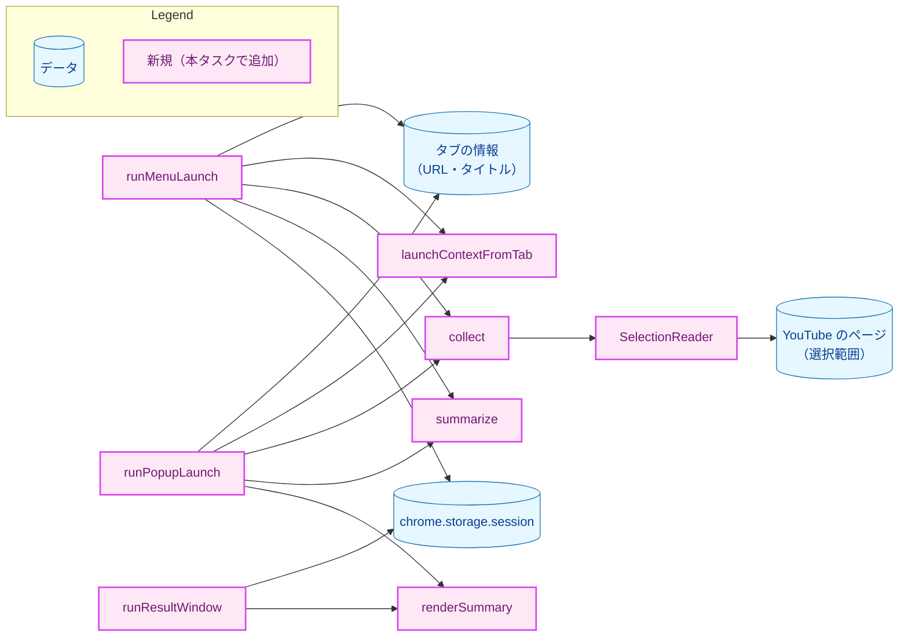
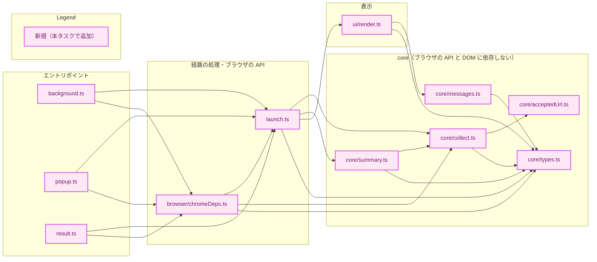
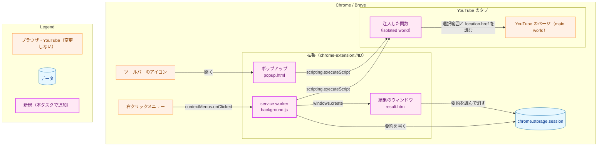
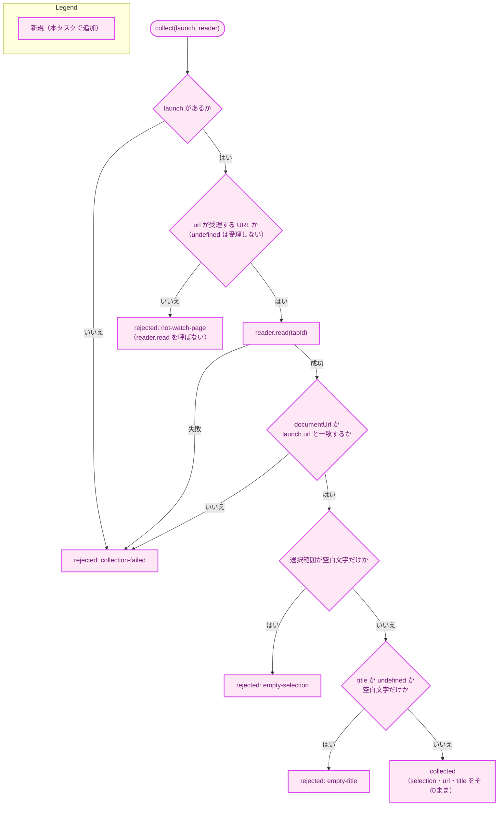
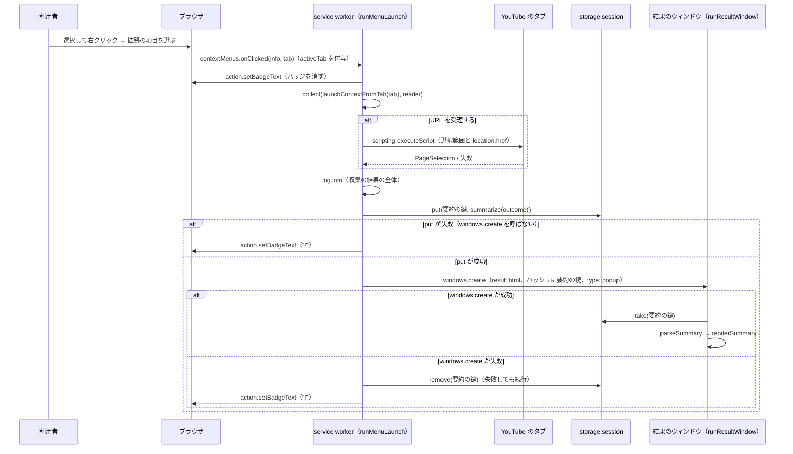
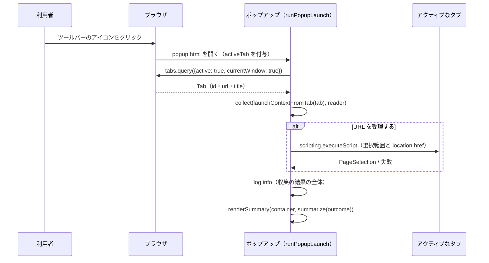
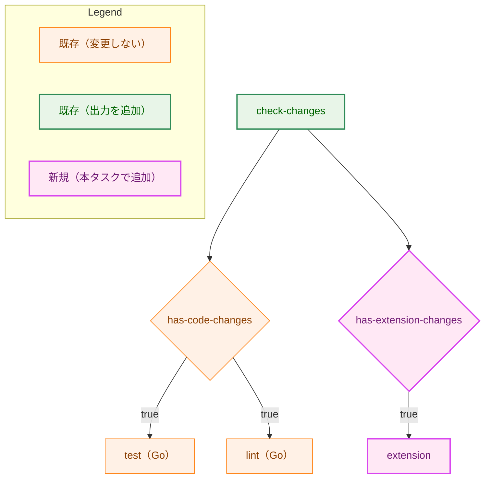
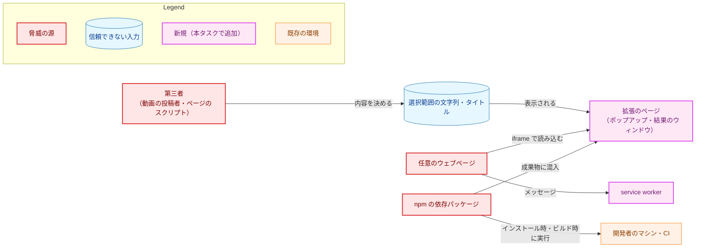
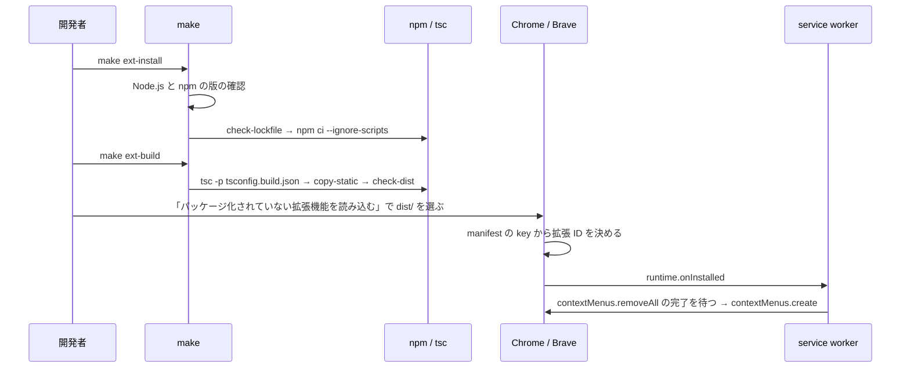

# アーキテクチャ設計書：ブラウザ拡張の開発環境と入力の収集

## Document Status

| Item | Value |
|---|---|
| Status | `approved` |
| Created | 2026-10-07 |
| Review date | 2026-10-07 |
| Reviewer | isseis |
| Comments | - |

本書は [01_requirements.md](01_requirements.md)（要件定義書。以下、要件書）の設計である。既存のファイルに関する記述は、コミット `426eb2e` のファイルで確かめた。`file:line` はこのコミットの行番号を指す。F-NNN・AC-NN は要件書の項番を指す。本タスクには `design_handoff.md` がない。実装レベルの懸念は [implementation_handoff.md](implementation_handoff.md) に置き、`03_implementation_plan.md` が扱う。

**3.12 の調査:** 3.12 の調査は完了している。拡張 ID の値、macOS の Chrome・Brave での観測、YouTube の動画ページの DOM を含む必要な項目を 3.12.4 に記録した。AC-24 が求める記録はこれで満たされている。

本書では次の用語を使う。

-   **拡張のディレクトリ:** 拡張のソース・設定・テストを置く `extension/`（2.1）。
-   **起動の経路:** 右クリックメニューからの起動（以下、**メニューの経路**）と、ツールバーのアイコンからの起動（以下、**ポップアップの経路**）。
-   **収集の結果:** 1 回の起動で得る、収集に成功した内容か拒否の理由のどちらか（3.2 の `CollectOutcome`）。
-   **表示用の要約（以下、要約）:** 収集の結果を表示のために短くしたもの（3.2 の `OutcomeSummary`）。
-   **結果のウィンドウ:** メニューの経路で表示用の要約を表示する、拡張のページを開いた小さなウィンドウ（3.6）。
-   **拡張のページ:** `chrome-extension://<拡張 ID>/` から読み込まれるページ。本タスクではポップアップと結果のウィンドウの 2 つ。
-   **経路の処理:** 各起動の経路で、タブの情報の取得から表示までを行う関数（3.6 の `runMenuLaunch`・`runPopupLaunch`・`runResultWindow`）。

## 1. 設計の全体像 (Design Overview)

### 1.1. 設計原則

-   **判定はブラウザの API から切り離す。** URL の判定、送る前の確認、拒否の理由と文言の対応、表示用の要約は、ブラウザの API も DOM も参照しない関数として `extension/src/core/` に置く。`core/` の型検査は `chrome` の型も DOM の型も含まない設定で行い、参照すると型検査で失敗する（3.8）。
-   **ブラウザの API は、経路の処理が受け取る依存の interface の向こうに置く。** 経路の処理（`launch.ts`）は、選択範囲の読み取り・アクティブなタブの取得・`storage.session`・ウィンドウを開くこと・ログを、引数の依存（3.6 の `MenuLaunchDeps` など）を通してだけ使う。実際の `chrome.*` を呼ぶのは `browser/chromeDeps.ts` とエントリポイントだけで、テストでは依存を fake に置き換える（要件書 4.5）。
-   **収集と確認は 1 つの関数に集める。** 2 つの起動の経路は、起動の時点のタブの情報を同じ関数で `LaunchContext`（3.2）にし、同じ `collect`（3.3）を呼ぶ。経路ごとに異なるのは、タブの情報をどこから得るかと、表示の手段だけである（AC-30）。
-   **拒否の理由は型で表す。** 理由は文字列の定数の和の型 `RejectionReason` とし、文言の対応は網羅性を型検査で確かめる `switch` で書く（[CLAUDE.md](../../../CLAUDE.md)「Declare, don't infer」）。
-   **確認を通った値であることを型で保証する。** `CollectedInput` は `collect` だけが作れる型とする（3.2）。#111 の送信は `CollectedInput` だけを受け取るので、確認を通っていない値を送れない（CLAUDE.md「Enforce invariants with the type, not with convention」）。
-   **収集した値は補正しない。** 選択範囲の文字列・URL・タイトルは、取得した値をそのまま `CollectedInput` に入れる。判定のために値を解析しても、解析した値で元の値を置き換えない（要件書 F-005・2.3）。
-   **読み取った文字列は DOM のテキストとしてだけ扱う。** 表示は `textContent` だけで行い、HTML を解釈する API を lint で禁止する。Manifest V3 の既定の Content Security Policy（以下、CSP）が、2 つ目の防御になる（3.7・5.）。
-   **実行時のコードは本リポジトリで書いたものだけにする。** バンドラを使わず、`tsc` が `src/` の各 `.ts` を 1 対 1 で `.js` に変換したものと、`static/` の固定のファイルだけを成果物にする。成果物を、ビルドの最後に検査する（3.9）。
-   **Go の手順の結果を変えない。** Go のソースとテストを変更しない。拡張のディレクトリを Go のツールの対象から外すために、`go.mod` に `ignore` の指示を 1 行加える（3.10）。

### 1.2. 概念モデル

矢印 A → B は「A が B を使う（呼び出す、または読み書きする）」を表す。



`collect` は起動の経路を知らない。ポップアップの経路は、`collect` が返した収集の結果を `summarize` で表示用の要約にし、その場で `renderSummary` で表示する。メニューの経路は、表示用の要約を `chrome.storage.session` に置き、結果のウィンドウがそれを読んで `renderSummary` で表示する。

### 1.3. 既存のコードとの関係

本タスクは Go のソースとテストを変更しない。拡張は Go のパイプライン（`internal/` と `cmd/`）を使わず、Go のパイプラインも拡張を使わない。本タスクの時点では、拡張と Go の CLI の間に通信はない（要件書 2.3）。

既存のファイルで変更するのは、`go.mod`（`ignore` の指示）、Makefile（ターゲットの追加と `fmt-all` の除外）、`.github/workflows/ci.yml`（ジョブと出力の追加）、`.gitignore`（行の追加）、`.pre-commit-config.yaml`（hook の追加）と、文書（README・CLAUDE.md・project_overview.md・security.md）である。変更の内容と、既存の振る舞いが変わらない理由は 3.10 に書く。

## 2. システム構成 (System Structure)

### 2.1. ディレクトリ構成

```
extension/
  .node-version          # Node.js の版（ちょうど 1 つの版。例: 24.x.y）
  .npmrc                 # ignore-scripts=true（5.2）
  package.json           # "type": "module"、packageManager（npm の版）、devDependencies、scripts
  package-lock.json      # lockfile
  tsconfig.json          # 型検査（src・test・scripts）
  tsconfig.core.json     # 型検査（src/core だけ。chrome と DOM の型を含まない）
  tsconfig.build.json    # ビルド（src だけ。dist へ出力）
  eslint.config.js
  .prettierrc.json
  .prettierignore
  static/
    manifest.json
    popup.html
    result.html
    style.css
  src/
    core/
      types.ts           # RejectionReason・LaunchContext・OutcomeSummary（3.2）
      acceptedUrl.ts     # isAcceptedWatchUrl（3.4）
      collect.ts         # collect・CollectedInput・CollectOutcome・SelectionReader（3.2・3.3）
      messages.ts        # rejectionMessage（3.5）
      summary.ts         # summarize・parseSummary（3.5）
    ui/
      render.ts          # renderSummary（3.7）
    browser/
      chromeDeps.ts      # 依存の interface の実装（chrome.* を呼ぶ）（3.6）
    launch.ts            # 経路の処理と依存の interface（3.6）
    background.ts        # service worker のエントリポイント
    popup.ts             # ポップアップのエントリポイント
    result.ts            # 結果のウィンドウのエントリポイント
  test/
    *.test.ts
  scripts/
    check-lockfile.ts    # lockfile の取得元の検査（5.2）
    copy-static.ts       # static の複製
    check-dist.ts        # 成果物の検査（3.9）
  dist/                  # ビルドの成果物（git の管理対象外）
  node_modules/          # 依存パッケージ（git の管理対象外）
```

ディレクトリの名前は `extension/` とする。リポジトリの最上位の `build/` は Go のバイナリの出力先で、`.gitignore:1` の `build/` はどの深さの `build` ディレクトリにも一致する。拡張の成果物を `build/` に置くと Go の出力と紛らわしいので、`dist/` とする。

エントリポイント（`background.ts`・`popup.ts`・`result.ts`）は、`chromeDeps.ts` で実際の依存を作り、経路の処理を呼ぶだけで、分岐を持たない。経路の処理が依存を引数で受け取るので、テストは経路の処理を fake の依存で実行する。エントリポイント自身はユニットテストしない（3.11）。

### 2.2. コンポーネントの依存関係

矢印 A → B は「A が B を import する（型だけの import を含む）」を表す。



`chromeDeps.ts` は `launch.ts` が定義する依存の interface を実装するので、`launch.ts` を（型として）import する。`ui/render.ts` は DOM を使うが `chrome` を参照せず、表示する先の要素を引数で受け取る。

### 2.3. 実行時の配置

矢印 A → B は「A が B を呼び出す、または B へデータを渡す」を表す。main world はページ自身のスクリプトが動く環境、isolated world は拡張が注入したスクリプトが動く、ページから分離された環境である。



注入する関数は、ブラウザの既定の isolated world で実行する。isolated world はページのスクリプトと JavaScript の大域の値を共有しないので、ページが `window.getSelection` を差し替えても、注入した関数が呼ぶものは変わらない。DOM（選択範囲）と `location` はページと共有する。

## 3. コンポーネント設計 (Component Design)

### 3.1. manifest（F-003・F-004・要件書 4.2・4.4）

`static/manifest.json` の主な項目を次のとおりとする。

| 項目 | 値 | 理由 |
|---|---|---|
| `manifest_version` | `3` | F-003 |
| `key` | 公開鍵（DER の SubjectPublicKeyInfo を base64 にしたもの） | 拡張 ID の固定（下記） |
| `minimum_chrome_version` | `"102"` | 使う API のうち最も新しい `chrome.storage.session` が Chrome 102 で加わったため（要件書 4.4） |
| `background` | `{"service_worker": "background.js", "type": "module"}` | service worker から `core/` のモジュールを静的な `import` で読むため |
| `action` | `{"default_popup": "popup.html"}` | ポップアップの経路（F-004） |
| `permissions` | `["activeTab", "contextMenus", "scripting", "storage"]` | 下表 |
| `host_permissions`・`optional_permissions`・`optional_host_permissions` | 宣言しない | 要件書 4.2 |
| `content_scripts` | 宣言しない | AC-12 |
| `content_security_policy` | 宣言しない（Manifest V3 の既定のまま） | AC-27 |
| `web_accessible_resources`・`externally_connectable` | 宣言しない | ウェブページから拡張のページを読み込ませたり、拡張へメッセージを送らせたりしないため（5.1） |
| `options_ui`・`commands` | 宣言しない | 共有トークンの設定画面は #111、キーボードショートカットはスコープ外（要件書 2.3） |

**要求する権限とその理由（AC-26）:**

| 権限 | 使う API | 必要な理由 | インストール時の警告 |
|---|---|---|---|
| `contextMenus` | `chrome.contextMenus.create`・`removeAll`・`onClicked` | 右クリックメニューに項目を加える（F-004） | なし |
| `activeTab` | （権限の付与だけ） | 利用者が起動したタブに限り、そのタブの URL・タイトルを読み、スクリプトを注入することを許す。起動の前と、起動したタブ以外には効かない（F-004） | なし |
| `scripting` | `chrome.scripting.executeScript` | 起動したタブに、選択範囲を読む関数を注入する（F-005）。注入できるタブは `activeTab` が許したものに限られる | なし |
| `storage` | `chrome.storage.session` | メニューの経路で、service worker から結果のウィンドウへ表示用の要約を渡す（3.6） | なし |

閲覧内容全般に及ぶ権限（`tabs`・`history`・`cookies`・`webRequest`・すべてのサイトへのホストの権限など）は要求しない。`chrome.tabs.query`・`chrome.windows.create`・`chrome.action.setBadgeText` は、追加の権限なしで呼べる。`tabs` の権限がなくても、`activeTab` が付与されたタブの `url`・`title` は `chrome.tabs.Tab` に入る。

**拡張 ID の固定（F-003）:** パッケージ化されていない拡張の ID は、manifest に `key` があればその公開鍵から決まり、読み込んだディレクトリのパスに依存しない。鍵は次の手順で作る。

1.  リポジトリの外の一時的なディレクトリで、RSA 2048 ビットの鍵の組を生成する。
2.  公開鍵を DER の SubjectPublicKeyInfo にして base64 にし、`key` に書く。
3.  秘密鍵を削除する。本タスクでは `.crx` へのパッケージ化もストアへの公開も行わない（要件書 2.3）ので、秘密鍵を使う場面がない。削除すると、同じ拡張 ID の `.crx` を後から作れなくなる。`.crx` が必要になったときは鍵を作り直し、拡張 ID も変わる。

拡張 ID は、公開鍵の DER の SHA-256 の先頭 16 バイトを 16 進の 32 文字にし、`0`〜`f` を `a`〜`p` に置き換えたものになる。ユニットテスト（3.11）は、manifest の `key` が RSA 2048 ビットの公開鍵（SubjectPublicKeyInfo）として解析できること、そこから計算した拡張 ID が記録した値と一致することを確かめる。秘密鍵（PKCS#8）を誤って `key` に貼り付けると、公開鍵としての解析で失敗する。base64 の PKCS#8 は PEM の見出しを持たないので、`PRIVATE KEY` の文字列の検索では見つからない。公開鍵としての解析を行うテストが、この検索の漏れを補う。

拡張 ID は秘密ではない。`key` はリポジトリで公開するので、誰でも同じ `key` で拡張を読み込めば同じ拡張 ID になり、同じ `Origin` を名乗れる。ブラウザの外のプロセスは任意の `Origin` を付けて送れる。したがって `Origin` は送り元の認証にならない（#109 への含意は 3.12.1）。

生成した鍵と拡張 ID の値は 3.12.1 に示す。同じ値を README・security.md に記す。

**右クリックメニューの項目（F-004）:** service worker の `chrome.runtime.onInstalled` で、`contextMenus.removeAll()` の完了を待ってから、固定の `id` で `contexts: ["selection"]`・`documentUrlPatterns: ["https://www.youtube.com/watch*"]` の項目を 1 つ作る。`create` の失敗（`runtime.lastError`）は `console.error` に記録する。項目の文言は英語で、実装で決める（例: `Use selection with yt2column`）。`documentUrlPatterns` は要件書 F-004 のとおり、要件書 3.2 の受理する URL より緩く、`/watch` で始まるパスのページ（`/watchlater` など）でも項目が表示される。収集の可否は `collect` が決める。

項目はブラウザが保持し、service worker の停止と再起動では消えない。拡張の無効化と再有効化、ブラウザの再起動の後に項目が残ることは、手動で確かめる（7.2）。残らない場合は、service worker のモジュールの最上位でも同じ登録を行う。

### 3.2. 型（F-005）

`core/types.ts` と `core/collect.ts` に置く型を示す。

```typescript
// core/types.ts

/** Why a launch did not produce a collectable input. Declared, never inferred from text. */
export type RejectionReason =
  | "not-watch-page"     // the URL is not an accepted watch-page URL (or is unavailable)
  | "collection-failed"  // the tab or its selection could not be read
  | "empty-selection"    // the selection is empty or whitespace only
  | "empty-title";       // the tab title is empty, whitespace only, or unavailable

/** What a launch path knows about the tab at the moment of the launch. */
export interface LaunchContext {
  readonly tabId: number;
  readonly url: string | undefined;
  readonly title: string | undefined;
}

/** Display-only digest of an outcome; what the result window receives. */
export type OutcomeSummary =
  | {
      readonly kind: "collected";
      readonly title: string;
      readonly titleTruncated: boolean;
      readonly url: string;
      readonly urlTruncated: boolean;
      readonly characterCount: number;
      readonly lineCount: number;
      readonly preview: string;
      readonly previewTruncated: boolean;
    }
  | { readonly kind: "rejected"; readonly reason: RejectionReason };
```

```typescript
// core/collect.ts

declare const collectedBrand: unique symbol;

/**
 * The collected input, exactly as obtained; nothing is trimmed or rewritten.
 * Only collect() creates values of this type.
 */
export interface CollectedInput {
  readonly selection: string;
  readonly url: string;
  readonly title: string;
  readonly [collectedBrand]: true;
}

export type CollectOutcome =
  | { readonly kind: "collected"; readonly input: CollectedInput }
  | { readonly kind: "rejected"; readonly reason: Exclude<RejectionReason, "collection-failed"> }
  | { readonly kind: "rejected"; readonly reason: "collection-failed"; readonly cause: unknown };
```

-   `LaunchContext` の `url`・`title` が `undefined` になりうるのは、`activeTab` が付与されないページ（`chrome://` のページなど）ではブラウザが値を入れないためである。`undefined` を空文字列などに置き換えずに `collect` へ渡し、`collect` が拒否の理由に対応させる（3.3）。
-   タブの情報そのものがない場合（右クリックメニューの `onClicked` の `tab` は省略されうる。ポップアップでアクティブなタブが見つからない場合もある）は、`LaunchContext` を作らず `undefined` を `collect` へ渡す（3.3・3.6）。
-   `CollectedInput` の目印の項目（`collectedBrand`）は型にだけ存在し、実行時の値を持たない。ほかのモジュールがオブジェクトのリテラルで `CollectedInput` を作れないのは、目印の記号を `collect.ts` の外へ公開しないためである。一方、`collect` 自身は型の表明（`as`）で `CollectedInput` を作る。型の表明は型検査では防げないので、`core/collect.ts` とテスト以外での `CollectedInput` への型の表明を lint（`no-restricted-syntax`）で禁止する。
-   `cause` は「収集の失敗」の原因を開発者向けのログに出すためだけに持つ。表示の文言は `reason` だけで決め、`cause` の内容で分岐しない。

### 3.3. `collect` と `SelectionReader`（F-005・AC-14〜AC-19）

```typescript
// core/collect.ts

/** What the injected function observed in the tab's top frame. */
export interface PageSelection {
  readonly text: string;         // window.getSelection().toString(), unmodified
  readonly documentUrl: string;  // location.href at the moment of reading
}

/** The only browser capability collect() needs. Faked in unit tests. */
export interface SelectionReader {
  /** Reads the selection of the tab's top frame. Rejects on any failure. */
  read(tabId: number): Promise<PageSelection>;
}

export function collect(
  launch: LaunchContext | undefined,
  reader: SelectionReader,
): Promise<CollectOutcome>;
```

矢印 A → B は「A の判定の後に B へ進む」を表す。`collect` は、次の順序で判定し、最初に当てはまったものを結果とする。



-   **判定の順序:** 要件書 F-005 の順序（対象外のページ → 収集の失敗 → 選択範囲が空 → タイトルが空）に従う。ただし、タブの情報がない場合（`launch` が `undefined`）は URL も確かめられないので、最初に「収集の失敗」とする。要件書 F-005 は「タブが閉じられた」を収集の失敗の例に挙げており、タブを読めないことは収集の失敗にあたる。この場合 `reader.read` は呼ばない。
-   **読み取りの時点の URL の照合:** `launch.url` は起動の時点のタブの情報で、`reader.read` が読むのは注入の時点の文書である。その間に YouTube がページ内の移動をすると、URL は動画 A のもの、選択範囲は別のページのもの、という組になりうる。これを防ぐため、注入した関数は選択範囲と同時に `location.href` を返し、`launch.url` と文字列として一致しなければ「収集の失敗」とする（安全側に倒す）。
-   **空白文字の定義:** Unicode の `White_Space` 属性を持つ文字とし、正規表現の `\p{White_Space}`（`u` フラグ）で判定する。JavaScript の `\s` は使わない。`\s` は `White_Space` ではない U+FEFF を含み、`White_Space` である U+0085 を含まないためである。改行と U+3000 はどちらの定義でも空白文字である（AC-16・AC-17）。
-   **補正しない:** 判定は元の文字列に対して行い、`trim` した値を作らない。`CollectedInput` には `PageSelection.text` と `LaunchContext` の `url`・`title` をそのまま入れる（AC-14）。
-   **例外を投げない:** `reader.read` の失敗（例外）は「収集の失敗」とし、`cause` に例外を入れる。`launch` が `undefined` の場合の `cause` は、`collect` が作る固定のメッセージの `Error` とする。`collect` が返すのは常に `CollectOutcome` で、呼び出し側に `try` を求めない（要件書 4.3）。
-   **注入の結果の形の検査:** 注入の結果が `PageSelection` の形（2 つの文字列）であることの検査は `SelectionReader` の実装（3.6）だけが行い、`collect` は行わない。`read` の戻り値の型が `PageSelection` なので、`collect` で同じ検査をしても、その分岐は型の上で到達できない。

URL とタイトルが同じ動画のものかは確かめない（要件書 F-005）。

### 3.4. 受理する URL の判定（要件書 3.2・AC-15）

```typescript
export function isAcceptedWatchUrl(url: string): boolean;
```

WHATWG URL の解析（`new URL(url)`）に成功し、解析の結果が要件書 3.2 の条件をすべて満たすときに `true` を返す。解析に失敗した場合は `false` とする。

| 要件書 3.2 の条件 | 確かめる値 |
|---|---|
| スキームが `https` | `protocol` が `https:` |
| ホストがちょうど `www.youtube.com` | `hostname` が `www.youtube.com` |
| ポートが空 | `port` が空文字列 |
| ユーザ名・パスワードを含まない | `username`・`password` がどちらも空文字列 |
| パスがちょうど `/watch` | `pathname` が `/watch` |
| `v` がちょうど 1 つで値が空でない | `searchParams.getAll("v")` の要素がちょうど 1 つで、空文字列でない |

WHATWG URL の解析は、ホストの大文字を小文字にし、既定のポート `:443` を空にし、パスの `.` を解決する。これらの変換後の値は、要件書 3.2 が「解析した URL」の値で判定すると定めているので、判定にだけ使う。収集する URL（`CollectedInput.url`）は解析前の文字列のままである。ホストの末尾の `.`（`www.youtube.com.`）は解析で残るので受理しない。`v` の値が動画 ID の形式に合うかは確かめない（要件書 3.2）。

### 3.5. 文言と表示用の要約（F-006・AC-21・AC-22・AC-31）

```typescript
// core/messages.ts
export interface RejectionMessage {
  /** One-sentence statement of why nothing was collected. */
  readonly text: string;
  /** Steps that let the user succeed next time; empty when none apply. */
  readonly steps: readonly string[];
}

export function rejectionMessage(reason: RejectionReason): RejectionMessage;

// core/summary.ts
export function summarize(outcome: CollectOutcome): OutcomeSummary;

/** Accepts only a value of exactly the OutcomeSummary shape; otherwise undefined. */
export function parseSummary(value: unknown): OutcomeSummary | undefined;
```

`rejectionMessage` は `RejectionReason` の各値に、互いに異なる英語の文言を対応させる。`switch` の `default` で `never` 型を受けて、理由を加えたのに文言を加え忘れた場合に型検査で失敗させる。操作の手順（`steps`）は次の 2 つの理由にだけ与え、残りは空とする。文言の正確な字句は実装で決める。

| 理由 | 文言の趣旨 | 操作の手順の趣旨 |
|---|---|---|
| `not-watch-page` | YouTube の動画ページではない | `https://www.youtube.com/watch?v=...` の動画ページを開く → 文字起こしパネルを開いて字幕を選択する → もう一度起動する |
| `empty-selection` | 選択された文字列がない | 概要欄の「文字起こしを表示」でパネルを開く → 字幕の行を選択する → もう一度起動する |
| `empty-title` | タブのタイトルが空 | なし |
| `collection-failed` | このタブから選択範囲を読めなかった（ページが切り替わった場合を含む） | なし |

ポップアップと結果のウィンドウは同じ `renderSummary`（3.7）で表示するので、操作の手順はどちらにも表示される。要件書 F-006 が手順を求めるのはポップアップだけだが、表示の関数を 1 つにすることを優先した。

`summarize` は、収集に成功した結果を次の値にする。

-   **`characterCount`:** 選択範囲の文字列のコードポイントの数。UTF-16 のコード単位の数（`length`）は使わない。サロゲートペアの文字を 2 と数えないためである。
-   **`lineCount`:** 選択範囲の文字列を `\r\n`・`\r`・`\n` のいずれかで区切った行の数。前後の空行も 1 行と数える。
-   **`preview`:** 選択範囲の文字列の、先頭の最大 200 コードポイント。改行はそのまま残す。
-   **`title`・`url`:** それぞれ先頭の最大 1,000 コードポイント。表示の領域を一定の大きさに収めるためと、`storage.session` に置く大きさを抑える（3.6）ためである。収集する値（`CollectedInput`）は短くしない。
-   **`titleTruncated`・`urlTruncated`・`previewTruncated`:** 対応する値を短くしたとき `true`。表示では末尾に省略の印を付ける。

どの値もコードポイントの境界で切り、サロゲートペアを分けない。

`parseSummary` は、結果のウィンドウが `storage.session` から読んだ値（型は `unknown`）を `OutcomeSummary` として扱う前に、項目の集合と型がちょうど `OutcomeSummary` の形であることを確かめる。形が違えば `undefined` を返し、補正しない（CLAUDE.md「Reject, don't normalize」）。

### 3.6. 経路の処理（F-004・F-006・AC-10・AC-11・AC-14・AC-20・AC-28〜AC-30）

```typescript
// launch.ts

export interface Logger {
  info(label: string, data: unknown): void;
  error(label: string, data: unknown): void;
}

/** Hands an OutcomeSummary from the service worker to the result window. */
export interface SummaryStore {
  put(key: string, summary: OutcomeSummary): Promise<void>;
  /** Returns the stored value and removes it; undefined when absent. */
  take(key: string): Promise<unknown>;
  /** Discards the stored value for key; used when the result window cannot be opened. */
  remove(key: string): Promise<void>;
}

export interface MenuLaunchDeps {
  readonly reader: SelectionReader;
  readonly store: SummaryStore;
  readonly newKey: () => string;
  openResultWindow(key: string): Promise<void>;
  /** Visible fallback when the result window cannot be shown (toolbar badge). */
  signalDisplayFailure(): Promise<void>;
  clearDisplayFailure(): Promise<void>;
  readonly log: Logger;
}

export interface PopupLaunchDeps {
  readonly reader: SelectionReader;
  activeTab(): Promise<chrome.tabs.Tab | undefined>;
  readonly log: Logger;
}

export interface ResultWindowDeps {
  readonly store: SummaryStore;
  readonly log: Logger;
}

/** Copies id, url and title verbatim; undefined when there is no tab or no tab id. */
export function launchContextFromTab(tab: chrome.tabs.Tab | undefined): LaunchContext | undefined;

/** Context-menu path. Never reads info.selectionText. Never throws. */
export function runMenuLaunch(
  info: chrome.contextMenus.OnClickData,
  tab: chrome.tabs.Tab | undefined,
  deps: MenuLaunchDeps,
): Promise<void>;

/** Popup path. Renders into container and returns the outcome (for #111's send button). */
export function runPopupLaunch(container: HTMLElement, deps: PopupLaunchDeps): Promise<CollectOutcome>;

/** Result window. Takes location.hash as is; renders the summary stored under its key, or a fixed notice. */
export function runResultWindow(container: HTMLElement, hash: string, deps: ResultWindowDeps): Promise<void>;
```

`launch.ts` は `chrome.*` の型（`chrome.tabs.Tab` など）を型として使うが、`chrome` の値を参照しない。`browser/chromeDeps.ts` は、これらの interface と `SelectionReader` の実装を作る関数を持ち、その中で `chrome.*` を呼ぶ。実装の関数は、`chrome.scripting` などの API のオブジェクトを引数で受け取り、テストで fake の API を渡せる形にする。

**`SelectionReader` の実装:** `chrome.scripting.executeScript` で、`target: {tabId}`（`frameIds` を指定せず、トップのフレームだけ）に、`{text: window.getSelection()?.toString(), documentUrl: location.href}` を返す関数を注入する。`executeScript` の `func` は関数のソースを文字列にしてページへ送るので、注入する関数は自分の外の変数や import した関数を参照できない（参照すると、ページの中で `ReferenceError` になり、毎回「収集の失敗」になる）。

そこで、注入する関数は `chromeDeps.ts` の中に、外の名前を参照しない 1 つの関数として書き、テストでその関数のソースが外の名前を参照しないことを確かめる（3.11）。`read` は、注入の結果の配列の最初の要素の `result` が、2 つの項目がともに文字列であるオブジェクトでない場合（`null`・`undefined` を含む）と、`executeScript` が例外を投げた場合（注入が許可されない、タブが閉じられたなど）に、例外を投げる。

右クリックメニューの `onClicked` が渡す `info.selectionText` は使わない。Chrome はこの値の改行を空白に置き換えることがあり（要件書 F-005）、行の区切りが失われるためである。`runMenuLaunch` は `info` を開発者向けのログ（`info.pageUrl`・`info.frameId`）にだけ使う。文字起こしパネルはトップのフレームの DOM にあると想定する。根拠は、`testdata/2tcCWM-sRBw.transcript_panel.html:1` のパネルの要素の `class` が `style-scope ytd-watch-flexy` であり、パネルが動画ページの本体の要素（`ytd-watch-flexy`）の中にあることを示している点である。この想定は AC-13 の手動の確認で確かめる。iframe の中の選択範囲は読まず、トップのフレームの選択範囲が空なら「選択範囲が空」になる。

Chromium 141（Linux）で、複数の `div` に分かれた要素を選択して、注入した関数で `getSelection().toString()` を読むと、要素の区切りが `\n` になった文字列が返った。

**シーケンス図の表記:** 本書のシーケンス図は、ノードを色で分類しないので Legend を置かない。実線の矢印 A → B は「A が B を呼び出す、または B へデータを渡す」を、点線は戻り値を表す。

**メニューの経路（`runMenuLaunch`）:**



-   要約の鍵は起動ごとに `crypto.randomUUID()` で作る。続けて 2 回起動しても、それぞれのウィンドウが自分の要約を読む。
-   `put` の完了を待ってから `windows.create` を呼ぶ。`put` が失敗したらウィンドウを開かない。
-   `storage.session` に置くのは表示用の要約だけで、選択範囲の全体は置かない。要約の大きさは、短くしたタイトル・URL（各 1,000 コードポイント）とプレビュー（200 コードポイント）で上限が決まり、収集した値の大きさによらない。最も小さい `storage.session` の容量（Chrome 111 以前の 1 MB）に対しても十分に小さい。
-   結果のウィンドウは要約を読んだら消す（`take`）。`windows.create` が失敗したら、同じ鍵の要約を `remove` で消す。失敗が続いても `storage.session` の容量（最も小さい場合で Chrome 111 以前の 1 MB）を消費し続けず、以後の `put` を妨げないためである。`storage.session` はメモリの中だけにあり、これ以外に残った要約もブラウザの終了で消える。`remove` に失敗した場合も、`storage.session` はブラウザの終了で消えるので、要約が残り続けることはない。
-   結果のウィンドウは、要約が見つからない場合（ハッシュがない、鍵がない）と、`parseSummary` が形の違いで拒否した場合に、そのことを示す固定の文言を表示する。
-   `put` または `windows.create` が失敗したときは、`log.error` に記録し、ツールバーのアイコンのバッジに `!` を表示する（`signalDisplayFailure`）。`windows.create` が失敗した場合は、あわせて同じ鍵の要約を `remove` で消す（`put` が失敗した場合は要約が置かれていないので消さない）。要約の削除に失敗した場合は、そのことを `log.error` に記録するが、バッジの表示は行う（削除の成否はバッジの表示を妨げない）。バッジは次のメニューの経路の起動の開始時に消す（`clearDisplayFailure`）。利用者が何も表示されずに終わることを避けるためである。
-   `runMenuLaunch` は例外を投げない。すべての失敗を捕まえて記録する。service worker のイベントの処理は例外で終わらず、次の起動に影響しない。収集の失敗（F-005）についてこれを求めるのは要件書 4.3 だが、表示の失敗（`put`・`windows.create`・`remove`）について例外を投げないことは要件ではなく本設計の方針とする。

ウィンドウを開く代わりに、通知（`notifications` の権限）やバッジだけを使う案は採らない。通知は OS の設定で表示されないことがあり（macOS は Chrome の通知の許可を別に求める）、バッジは数文字しか表示できず、どちらも要件書 F-006 のタイトル・URL・プレビューを示せない。`chrome.action.openPopup()` でポップアップを開く案は、Brave で動作するか確かめていないので採らない。

**ポップアップの経路（`runPopupLaunch`）:**



ポップアップはページのどの要素にもフォーカスを移さず、選択範囲を変更する API も呼ばないので、ページの選択範囲は残る（AC-28 で手動で確かめる）。ポップアップはどのページでも開く。`activeTab` が付与されないページ（`chrome://` のページなど）では `url` が `undefined` になり、「対象外のページ」になる（AC-29）。

**再読み込みしない動画の切り替え（AC-20）:** どちらの経路も、起動の時点で `chrome.tabs.Tab` を受け取り、それより前の値を持たない（service worker は起動をまたいで状態を持たない）。読み取りの時点で URL が変わっていれば「収集の失敗」になる（3.3）。メニューの項目の表示は、ブラウザが右クリックした時点のフレームの URL を `documentUrlPatterns` と照合して決める。`history.pushState` によるページ内の移動の後に、移った先の URL で照合されることは、Chrome と Brave で手動で確かめる（7.2 の AC-20）。

**開発者向けのログ（要件書 F-006）:** 両方の経路は、収集の結果の全体（選択範囲の文字列を含む。拒否の場合は理由と `cause`）を `log.info` に出す。`Logger` の実装は `console.info`・`console.error` で、最初の引数に固定のラベルを、2 番目の引数に記録する値を渡す。信頼できない文字列を最初の引数に置かない。最初の引数は書式の文字列として解釈され、`%c` などがコンソールの表示を変えうるためである。メニューの経路は service worker のコンソール（`chrome://extensions` の「service worker」のリンク）、ポップアップの経路はポップアップのコンソール（ポップアップを右クリック → 「検証」）に出る。どちらのコンソールも、起動の前に開いておく必要がある（README と 7.2 の AC-13 の手順に書く）。

### 3.7. 表示（F-006・AC-21〜AC-23・AC-31）

```typescript
/** Replaces the children of container with a text-only rendering of the summary. */
export function renderSummary(container: HTMLElement, summary: OutcomeSummary): void;
```

-   要素の作成は `container.ownerDocument.createElement`、文字列の設定は `textContent` だけで行う。HTML を解釈する API（`innerHTML`・`outerHTML`・`insertAdjacentHTML`・`document.write`・`document.writeln`・`DOMParser`・`Range.createContextualFragment`・`setHTMLUnsafe`・`Document.parseHTMLUnsafe`・`srcdoc`）は、`eslint.config.js` の `no-restricted-properties`・`no-restricted-syntax` で、拡張のソース全体（テストを含む）で禁止する。lint は `el["inner" + "HTML"]` のように実行時に組み立てた名前での参照を検出できない。これはレビューで防ぐ。
-   Manifest V3 の既定の CSP（`script-src 'self'`）は、インラインのイベントハンドラ（`onerror` など）とインラインのスクリプトを実行しない。表示の実装に誤りがあって要素が作られても、AC-23 の `onerror` は実行されない。これは lint とは独立した 2 つ目の防御である。
-   タイトルとプレビューは、`dir="auto"` を付けた要素に入れ、CSS の `unicode-bidi: plaintext` を当てる。信頼できない文字列に含まれる双方向の制御文字（U+202E など）が、周りのラベルやほかの値の表示の順序を変えないようにするためである。#111 でポップアップは送る前の確認の画面になるので、表示が偽装されないことが要る。
-   プレビューは CSS の `white-space: pre-wrap` を当てた要素に入れ、改行と前後の空白をそのまま見せる。
-   収集に成功した場合は、タイトル・URL・文字数・行数・プレビューを、ラベルとともに表示する。拒否した場合は、`rejectionMessage(reason)` の `text` と、`steps` があれば番号付きのリストを表示する。
-   URL はリンクにしない（`a` 要素を作らない）。表示の目的は確かめることで、移動ではないためである。

### 3.8. 開発環境（F-001・AC-01〜AC-06）

**Makefile と `package.json` の分担:** 前提条件の確認（Node.js と npm の版、`node_modules` の有無、lockfile の取得元）は Makefile に置く。ツールの呼び出し（`tsc`・`eslint`・`prettier`・`node --test` と `scripts/` の実行）は `package.json` の `scripts` に置き、Makefile は `npm run <script>` で呼ぶ。インストールの `npm ci` は npm のスクリプトではないので、Makefile から直接呼ぶ。

**Node.js と npm の版:** `extension/.node-version` に Node.js の版をちょうど 1 つ書く（実装の時点の Node.js 24 の LTS の最新の版。例: `24.x.y`）。npm の版は `package.json` の `packageManager`（例: `npm@11.x.y`）に、その Node.js に同梱の版を書く。Makefile の拡張のターゲットは、実行の前に、`node --version` の先頭の `v` を除いた値が `.node-version` と一致すること、`npm --version` が `packageManager` の版と一致することを確かめ、一致しなければ失敗する。CI は `actions/setup-node` の `node-version-file` に `.node-version` を渡す。

**インストール:** `make ext-install` は、`scripts/check-lockfile.ts`（5.2）を実行してから `npm ci --ignore-scripts --no-audit --no-fund` を実行する。`npm ci` は `package-lock.json` に従ってインストールし、`package.json` と食い違う場合は失敗する（AC-03）。`npm install` は lockfile を書き換えうるので、Makefile と CI から呼ばない。依存パッケージを加える・更新するときは、開発者が `npm install --ignore-scripts <pkg>` を手で実行し、更新した lockfile をコミットする（CLAUDE.md に書く）。`git pull` などで lockfile が変わった後は、`make ext-install` を実行し直す。CI は毎回まっさらな状態からインストールする。

**TypeScript の設定:** TypeScript は 5.8 以上とする（`erasableSyntaxOnly` が 5.8、`rewriteRelativeImportExtensions` が 5.7 で加わったため）。正確な版は lockfile で固定する。共通の設定を次のとおりとする。

-   `strict: true`、`noUncheckedIndexedAccess: true`、`exactOptionalPropertyTypes: true`。
-   `module: "nodenext"`、`moduleResolution: "nodenext"`。`package.json` の `"type": "module"` により、すべてのファイルを ES モジュールとして扱う。相対パスの import に拡張子を必須にするので、ブラウザが解決できる import だけが書ける。
-   `allowImportingTsExtensions: true` と `rewriteRelativeImportExtensions: true`。ソースの import は `./x.ts` と書き、出力では `./x.js` にする。テストを Node.js で直接実行するとき（下記）も同じ import がそのまま解決できる。
-   `erasableSyntaxOnly: true`（`enum`・`namespace`・コンストラクタの引数のプロパティなど、型の除去で消せない構文を禁止する）と `verbatimModuleSyntax: true`（型だけの import を `import type` と書かせる）。Node.js の型の除去は import をそのまま残すので、型だけを通常の import で読むと実行時に失敗する。これを型検査で防ぐ。
-   `target: "ES2022"`。ソースマップと型定義は出力しない。`importHelpers` は使わない（`tslib` を実行時に読み込まないため）。
-   `types` を明示する。`tsconfig.json`（src・test・scripts）は `lib: ["ES2022", "DOM"]`・`types: ["chrome", "node"]`、`tsconfig.build.json`（src）は `lib: ["ES2022", "DOM"]`・`types: ["chrome"]`、`tsconfig.core.json`（src/core）は `lib: ["ES2022"]`・`types: []` とする。`core/` の下のファイルが `chrome` や `document` を参照すると、`tsconfig.core.json` の型検査で失敗する（2.2）。
-   `tsconfig.build.json` は `noEmitOnError: true` とし、型検査のエラーがあればビルドが失敗する（AC-02）。

**依存パッケージ（すべて `devDependencies`）:** CLAUDE.md「Dependencies」（`CLAUDE.md:203`）は、Go のモジュールについて「標準ライブラリ以外のモジュールを許可しない」と定めている。要件書 F-001 はこの考え方を拡張にも適用し、npm の依存パッケージを開発用に限ったうえで、加えるものごとに理由を書くことを求めている。次の表がその理由である。Go のモジュールの方針は変えない。

| パッケージ | 用途 | 加える理由 |
|---|---|---|
| `typescript` | 型検査・ビルド | F-001 が求める TypeScript の型検査とビルドそのもの |
| `@types/chrome` | `chrome.*` の型 | 使う API の型を手で書くと、ブラウザの API との食い違いを型検査で見つけられない。型だけで、実行時のコードを含まない |
| `@types/node` | `node:test`・`node:assert`・`node:crypto` などの型 | テストと `scripts/` の型検査 |
| `eslint`・`@eslint/js`・`typescript-eslint` | lint | `eval`・`new Function`（AC-27）と HTML を解釈する API（3.7）を検出するため。TypeScript のソースを解析するには `typescript-eslint` が要る |
| `prettier` | フォーマットとその確認 | F-001 のフォーマットの確認。`--check` で確認できる |
| `jsdom`・`@types/jsdom` | テストの DOM | AC-23 で、表示した結果に要素が作られないことを、HTML の構文解析を持つ DOM で確かめるため（3.11） |

テストランナーは Node.js に組み込みの `node --test` を使い、パッケージを加えない。Node.js 24 は `.ts` のファイルの型を除去して直接実行できる（`erasableSyntaxOnly` の範囲の構文に限る）ので、テストのためのトランスパイラも要らない。バンドラ（esbuild・Vite など）は使わない。実行時に依存パッケージがないので、まとめる対象がなく、`tsc` の 1 対 1 の出力で足りるためである。

**Makefile のターゲット:** 既存のターゲットの名前と重ならないよう、`ext-` で始める。`ext-install` 以外のターゲットは、版の確認の後、`node_modules` がなければ「`make ext-install` を先に実行する」と表示して失敗する。依存パッケージを自動でインストールしない（ネットワークへのアクセスを利用者の明示の操作に限るため）。

| ターゲット | 内容（`npm run` で呼ぶスクリプトの中身） |
|---|---|
| `ext-install` | 版の確認 → `check-lockfile` → `npm ci --ignore-scripts --no-audit --no-fund` |
| `ext-typecheck` | `tsc --noEmit -p tsconfig.json` と `tsc --noEmit -p tsconfig.core.json` |
| `ext-lint` | `eslint .` |
| `ext-fmt-check` | `prettier --check .` |
| `ext-fmt` | `prettier --write .`（ファイルを書き換える。CI では使わない） |
| `ext-test` | `node --test`（`test/` の `*.test.ts`） |
| `ext-build` | `dist/` を消してから、`tsc -p tsconfig.build.json` → `scripts/copy-static.ts` → `scripts/check-dist.ts`（3.9） |
| `ext-check` | `ext-typecheck`・`ext-lint`・`ext-fmt-check`・`ext-test`・`ext-build` を順に実行する |

`static/` の複製は `cp` ではなく Node.js のスクリプト（`fs.cpSync`）で行う。`cp -R` はディレクトリの末尾の `/` の扱いが macOS と Linux で異なるためである（要件書 4.4）。

**git の管理対象外（AC-06）:** `.gitignore` に `extension/node_modules/`・`extension/dist/`・`*.pem` を加える。

**言語の規則:** ソースのコメント・識別子・文字列リテラルと、利用者に表示する文言は英語とする（要件書 F-001）。lint では検査せず、CLAUDE.md の規則とレビューで守る。

### 3.9. 成果物の検査（AC-04）

`scripts/check-dist.ts` は、ビルドの後に `dist/` が次をすべて満たすことを確かめ、満たさなければ違反を表示して失敗する。検出の手段は実装で決める。

-   **ファイルの集合:** `dist/` のファイルの集合が、`src/` の下の各 `.ts` に対応する同じ相対パスの `.js` と、`static/` の下の各ファイルの和にちょうど一致する。
-   **モジュールの指定:** `dist/` の `.js` のすべてのモジュールの指定（`import ... from`・`import "..."`・`export ... from` を含む）が相対パスで、指す先のファイルが `dist/` にある。動的な `import()` がない（拡張の service worker は動的な `import()` を受け付けないため。ソースでも lint で禁止する）。
-   **manifest と HTML の参照:** `manifest.json` の `background.service_worker`・`action.default_popup` と、`static/` の HTML の `<script src>`・`<link href>` が指すファイルが `dist/` にある。

バンドラを使わないので、依存パッケージのコードが成果物に入るのは、`dist/` に余分なファイルが加わる場合か、相対パスでないモジュールの指定がある場合だけである。どちらもこの検査で失敗する。参照の検査は、manifest や HTML の書き誤りを、ブラウザへの読み込みの前に見つけるためのものでもある。

### 3.10. 既存のファイルの変更と、Go の手順への影響（F-001・F-002・AC-05・AC-07）

| ファイル | 変更 | 既存の振る舞いが変わらない理由 |
|---|---|---|
| `go.mod` | `ignore ./extension` を加える | 下記 |
| `Makefile` | `ext-` で始まるターゲットを加え、`.PHONY`（`Makefile:49`）に加える。`fmt-all`（`Makefile:152`）の `find` に `-not -path './extension/*'` を加える | 既存のターゲットのレシピのうち、変えるのは `fmt-all` の探索の範囲だけで、拡張のディレクトリには本リポジトリの Go のファイルがない |
| `.github/workflows/ci.yml` | `check-changes` に出力 `has-extension-changes` を加え、新しいジョブ `extension` を加える | `has-code-changes` の判定（`ci.yml:35`）と、`test`・`lint` のジョブ（`ci.yml:45`・`ci.yml:66`）を変更しない |
| `.gitignore` | 3 行を加える | 既存の行を変更しない |
| `.pre-commit-config.yaml` | 固定済みの `pre-commit-hooks`（v5.0.0）の `detect-private-key` を加える | 既存の hook を変更しない |

**Go の手順が拡張のディレクトリを読まないこと（AC-05）:** Go のツールの `./...` のパターンは、`.` か `_` で始まる名前のディレクトリ、`testdata`、自分の `go.mod` を持つディレクトリ、`go.mod` の `ignore` の指示に挙げたディレクトリを除外し、`node_modules` は除外しない。3.8 の依存パッケージには Go のソースを含むものがある（lint の `eslint` が依存する `flatted` は `golang/pkg/flatted/flatted.go` を含む）。何もしなければ `extension/node_modules` の下の Go のパッケージが `./...` に含まれ、`./...` を使う次の手順の結果が変わる。

-   `make test`（`Makefile:68`）、`make test-ci`（`Makefile:72`。CI が使う）、`make lint`（`Makefile:134`。golangci-lint と `go vet`）。
-   CI の `lint` のジョブ（`ci.yml:66` 以降）の `golangci-lint-action`・`go vet`・`go mod tidy`。
-   `.pre-commit-config.yaml` の `go test`・`golangci-lint`・`go vet` の hook。

そこで、`go.mod` に `ignore ./extension` を加える。`ignore` の指示は Go 1.25 で加わり、本リポジトリは `go 1.26.5`（`go.mod:3`）である。リポジトリを複製した作業ディレクトリの `extension/node_modules/flatted/golang/pkg/flatted/` に Go のファイルを置いて確かめた。指示がないと `go list ./...` がそのパッケージを列挙し、指示を加えると列挙しなかった。`go vet ./...` は成功し、`go mod tidy` は指示を残した。

-   `make deadcode`（`Makefile:154`）と `make build`（`Makefile:53`）は `./cmd/yt2column` から辿れるパッケージだけを見るので、もともと拡張のディレクトリの影響を受けない。
-   `make fmt`（`Makefile:138`）は `git` の管理対象のファイルと、無視の対象でない未追跡のファイルだけを見るので、`.gitignore` の対象の `node_modules` を見ない。
-   `make fmt-all` は `./...` ではなく `find` を使うので、`ignore` の指示が効かない。上表のとおり、探索から `./extension/*` を除く。
-   Go の手順は Node.js を呼ばない。

`go.mod` と `fmt-all` の変更は、要件書 5. の「Go の既存の Makefile のターゲット・CI のジョブの振る舞いを変更しない」を守るための変更である。どちらも本リポジトリの Go のファイルの扱いを変えず、既存のテストが確かめている振る舞いもないので、更新が必要なテストはない。

**CI のジョブ（F-002・AC-07）:**

矢印 A → B は「A の結果により B が実行される」を表す。



-   `has-extension-changes` は、変更されたファイルに `^extension/`・`^Makefile$`・`^\.github/workflows/`・`^go\.mod$` のいずれかに一致するものがあるとき `true` とする。`go.mod` を加えるのは、`ignore` の指示の変更を拡張のジョブの Go の確認（下記）で確かめるためである。`has-code-changes` と同じ `git diff --name-only origin/main...HEAD` の結果を使う。
-   ジョブ `extension` は、チェックアウト → `actions/setup-node`（`node-version-file: extension/.node-version`、`cache: npm`、`cache-dependency-path: extension/package-lock.json`）の後に、`make ext-install`・`make ext-typecheck`・`make ext-lint`・`make ext-fmt-check`・`make ext-test`・`make ext-build` を別々のステップとして実行する。どのステップが失敗してもジョブが失敗する（AC-07）。npm のキャッシュは `~/.npm` のダウンロードの再利用だけで、`npm ci` は lockfile の integrity で検証するので、キャッシュが版を変えることはない。
-   ジョブ `extension` は、続けて `actions/setup-go` を行い、`go list ./...` の結果に `github.com/isseis/yt2column/extension/` で始まるパッケージがないことを確かめる。Go のジョブ（`test`・`lint`）は `npm ci` を実行しないので `node_modules` がなく、拡張の依存パッケージが Go の手順に入り込む事態を見られない。依存パッケージをインストールした状態で確かめられるのは、このジョブだけである。
-   ジョブ `extension` は、ワークフローの最上位の `permissions: contents: read`（`ci.yml:7`）を引き継ぎ、秘密情報を使わない。`pull_request` で実行する。
-   拡張のディレクトリの下だけを変更する PR でも、`has-code-changes` は `true` になり（`.md` でも `docs/` の下でもないため。`ci.yml:35`）、Go のジョブも実行される。Go のジョブの判定を変えないことを優先した。
-   Go のファイルだけを変更する PR では、ジョブ `extension` は実行されない。

### 3.11. テストの構成（AC-14〜AC-19・AC-22・AC-23・AC-26・AC-27・AC-30・AC-31）

テストは `node --test` で実行し、実際のブラウザを起動しない（要件書 5.）。経路の処理は fake の依存（`SelectionReader`・`SummaryStore` など）で、`chromeDeps.ts` の実装は fake の `chrome.scripting` などのオブジェクトで実行する。

| テストのファイル | 対象 | 主な AC |
|---|---|---|
| `test/acceptedUrl.test.ts` | `isAcceptedWatchUrl`。要件書 3.2 の受理しない URL の例のすべてと、受理する URL（`t`・`list`・フラグメント付きを含む） | AC-15 |
| `test/collect.test.ts` | `collect`。判定の順序、`launch` が `undefined`、空白文字の各種（U+0085 を含む。U+FEFF だけの選択範囲は受理する）、`read` の失敗、`documentUrl` の不一致、`title` が `undefined`、対象外のページで `read` が呼ばれないこと、前後の空白・空行が残ること | AC-14・AC-16〜AC-19 |
| `test/launch.test.ts`（収集） | `runMenuLaunch`・`runPopupLaunch`。同じ fake のタブと同じ fake の `SelectionReader` で、2 つの経路が同じ収集の結果（ログに出す値）と同じ表示用の要約になること。`runMenuLaunch` に、fake の選択範囲と異なる `info.selectionText` を渡しても、収集した値が fake の選択範囲になること。前後の空白・空行が経路を通っても残ること。`put` の失敗でウィンドウを開かずバッジを表示すること、`windows.create` の失敗でバッジを表示し同じ鍵の要約を `remove` で消すこと、どちらでも例外を投げないこと | AC-14・AC-30 |
| `test/launch.test.ts`（表示） | `runPopupLaunch` と `runResultWindow` を jsdom の要素で実行し、タイトルと選択範囲の `` が要素にならないこと。`runResultWindow` が要約を読んだ後に消すこと、ハッシュがないとき・要約がないとき・形が違うときに固定の文言を表示すること | AC-23 |
| `test/chromeDeps.test.ts` | `SelectionReader` の実装。fake の `executeScript` が、形の違う結果（`null`・文字列だけ・項目の欠け）を返すか例外を投げると、`read` が失敗すること。注入する関数のソースが外の名前を参照しないこと | AC-18 |
| `test/messages.test.ts` | `rejectionMessage`。4 つの理由の文言が互いに異なること、手順が `not-watch-page`・`empty-selection` にだけあること | AC-22・AC-31 |
| `test/summary.test.ts` | `summarize`（文字数・行数、前後の空行、`\r\n`、各値の切り詰めとサロゲートペア）と `parseSummary`（形の違う値を拒否すること） | AC-21 の表示の内容 |
| `test/render.test.ts` | `renderSummary` を jsdom の要素で実行する。タイトルと選択範囲に `` を含む要約で、`querySelector("img")` が `null` で、`textContent` に元の文字列が含まれること。拒否の場合に手順のリストが表示されること | AC-23・AC-31 |
| `test/checkLockfile.test.ts` | `scripts/check-lockfile.ts` の判定。`resolved` がレジストリ以外を指す lockfile を拒否し、レジストリだけの lockfile を受理すること | -（5.2） |
| `test/manifest.test.ts` | `static/manifest.json`。`permissions` が 3.1 の 4 つとちょうど一致すること。`host_permissions`・`optional_permissions`・`optional_host_permissions`・`content_scripts`・`content_security_policy`・`web_accessible_resources`・`externally_connectable` がないこと。`key` が RSA 2048 ビットの公開鍵として解析でき、そこから計算した拡張 ID が記録した値と一致すること | AC-08 の静的な部分・AC-09・AC-12・AC-26・AC-27 |

`chromeDeps.ts` のうち `SelectionReader` 以外の実装（`SummaryStore`・ウィンドウ・バッジ・アクティブなタブ）と、`background.ts` のメニューの項目の登録は、`chrome.*` を 1 回呼ぶだけの薄い部分なのでユニットテストせず、7.2 の手動の確認（AC-10・AC-11・AC-21）で確かめる。

AC-23 の「表示の手段のそれぞれで確かめる」は、ポップアップと結果のウィンドウのそれぞれの経路の処理（`runPopupLaunch`・`runResultWindow`）を jsdom で実行して確かめる。AC-27 の `eval`・`new Function` は、lint の `no-eval`・`no-implied-eval`・`no-new-func` で検出する。各テストと lint の規則が対象の誤りで失敗することは、実装のときに対象を壊して確かめる（7.1）。

### 3.12. #109 への入力の調査（F-007・AC-24）

本節の観測は、Chromium 141.0.7390.37（Playwright 同梱、Linux、headless）と macOS の Chrome 154.0.8037.98・Brave 1.96.61 で、パッケージ化されていない一時的な拡張と、`127.0.0.1` で待ち受ける一時的なサーバで行った。一時的な拡張とサーバはリポジトリに含めていない（要件書 F-007）。macOS の Chrome・Brave での観測は各節（3.12.1・3.12.2・3.12.3）に記す。

#### 3.12.1. 拡張 ID と `Origin` ヘッダ

**拡張 ID:** 2026-10-07 に 3.1 の手順で生成した（OpenSSL で RSA 2048 ビットの鍵の組を生成し、公開鍵を DER の SubjectPublicKeyInfo にした後、秘密鍵を削除した）。値は次のとおりである。

-   拡張 ID: `clfmbbcdpnjcefbdihdoahomaifbabkk`
-   `key`: `MIIBIjANBgkqhkiG9w0BAQEFAAOCAQ8AMIIBCgKCAQEAnU2b5FZCPsoONgwnZlFVL01Q4KeHUyrvB/8eTHAd5gPu4pGTjok+w4TkAOa8GVswtrSHZBivGzYiTHPlzO+9IfVS7EkFiPOJJo5cQoXc8KODqW2LXawvdIqUe7n5gUfM8xuNtkRW/ipQEkKY3t0SyEPZjTVECWxokr8ViY5rSFQ7GHgjGIf/QAPwvklr9QzovW8ZWOghnv2GLUbIu71ONgJ3UZOfwm5/qCbehMGG1kUBqdUuXPoz4BzEE8rf/LPfQF368xtnOF4tC6qrZbtdBXM8w7shVqRx77y/QZbrDBwpPdS2QCeSYGk3/5u3zmTwWrOfrctYXC712/EMoc88zQIDAQAB`

拡張 ID は、`key` を base64 から戻した DER の SHA-256 から 3.1 の計算で求めた。`Origin` ヘッダの値は `chrome-extension://clfmbbcdpnjcefbdihdoahomaifbabkk` になる（下記の観測で、拡張 ID の部分は読み込んだ拡張の ID と一致した）。

**`Origin` ヘッダの観測（Chromium 141）:** service worker と拡張のページ（ポップアップと同じ `chrome-extension://` のオリジンのページをタブで開いたもの）のそれぞれから、`fetch` で `http://127.0.0.1:<port>/` へ送った。

| 拡張の `host_permissions` | リクエスト | `Origin` ヘッダ | `Sec-Fetch-Site` | 応答を読めるか |
|---|---|---|---|---|
| `http://127.0.0.1/*` あり | `GET` | **付かない** | `none` | 読める |
| `http://127.0.0.1/*` あり | `POST`（`text/plain`・`application/json`） | `chrome-extension://<ID>` | `none` | 読める（preflight なし） |
| なし | `GET` | `chrome-extension://<ID>` | `cross-site` | 読めない（サーバが CORS の応答ヘッダを返さないため） |
| なし | `POST`（`text/plain`） | `chrome-extension://<ID>` | `cross-site` | 読めない。リクエストはサーバに届く |
| なし | `POST`（`application/json`） | `chrome-extension://<ID>` | `cross-site` | preflight（`OPTIONS`）だけが届き、本体は送られない |

service worker と拡張のページで結果は同じだった。

**macOS の Chrome・Brave での観測（Chrome 154.0.8037.98・Brave 1.96.61、2026-10-07）:** 3.1 の `key` を持ち `host_permissions` に `http://127.0.0.1/*` を宣言した一時的な拡張と、`key` も `host_permissions` も持たない一時的な拡張を読み込み、実際のポップアップと service worker から同じリクエストを送った。結果は上の表と同じだった。`key` を持つ拡張の `Origin` は `chrome-extension://clfmbbcdpnjcefbdihdoahomaifbabkk` で、3.1 の計算で求めた拡張 ID と一致した。拡張からのリクエストには許可の確認が出ず、確認を待たずにサーバに届いた。Brave でも、`key` を持つ拡張の `Origin` を含め、すべて Chrome と同じ結果だった。

**Local Network Access（macOS の Chrome 154・Brave 1.96）:** 公開のページ（`https://example.com`）の DevTools のコンソールから、`127.0.0.1` へ `POST`（`text/plain`、`mode: "no-cors"`）を送った。

-   Chrome は「このデバイス上の他のアプリやサービスにアクセスする」の許可の確認を表示し、利用者が答えるまでリクエストを送らなかった（サーバに届かなかった）。
-   「許可する」を選ぶと、リクエストはサーバに届いた。`Origin` は `https://example.com`、`Sec-Fetch-Site` は `cross-site` だった。ページが受け取った応答は `type: "opaque"`・`status: 0` で、ページは応答の中身を読めなかった。
-   Brave も許可の確認を表示し、許可の後にリクエストがサーバに届いた。届いたリクエストのヘッダは Chrome と同じだった。

#109 への含意は次のとおりである。

-   `Origin` で送り元を確かめるなら、`POST` に限る。`host_permissions` を持つ拡張の `GET` には `Origin` が付かない。
-   `Origin` がないリクエストを受理しない。
-   `host_permissions` がなくても、preflight が不要な `POST`（`text/plain` など）はサーバに届く。応答を読めないだけなので、サーバはリクエストを確かめる前に副作用を起こしてはならない。ウェブページからの同じ形のリクエストも届きうる。macOS の Chrome 154 と Brave 1.96 では、Local Network Access の許可の確認が、ウェブページからのリクエストを止める。利用者がそのサイトに許可を与えると、リクエストは届く。したがって、この確認だけに頼ってはならない。
-   `Origin` は送り元の認証にならない。拡張 ID は公開の `key` から決まり、同じ `key` を使えば誰でも同じ拡張 ID の拡張を読み込める。ブラウザの外のプロセスは任意の `Origin` を付けられる。`Origin` の確認で防げるのは、ブラウザが送るウェブページからのリクエストだけである。共有トークンは省略できない。

#### 3.12.2. チャンネル名・概要欄

リポジトリの `testdata/` の HTML の抜粋は文字起こしパネルの要素だけで、チャンネル名と概要欄を含まない（testdata/README.md「文字起こしパネルの HTML の抜粋」）。動画ページの DOM は、リポジトリの外のスナップショット（security.md §7 の `${YT2COLUMN_SNAPSHOT_DIR:-...}`）か、ブラウザの DevTools で確かめる（下記）。

**macOS の Chrome・Brave での観測（2026-10-07）:** 動画ページを DevTools のコンソールから調べた。どちらのブラウザでも、1 本目の動画は直接開き、2 本目へは関連動画のリンクからページ内で移動した。セレクタはいずれも `ytd-watch-metadata` の下の要素を指す。

-   Chrome 154.0.8037.98: YouTube にログインした状態で調べた。2 本目は、再読み込みの後にも調べた。
-   Brave 1.96.61: ログインしていない状態で調べた。2 本目は 1 本目と同じチャンネルの動画だった。

下表は両方のブラウザで共通の観測である。違いがあった項目は、ブラウザごとに書く。

| 項目 | 観測 |
|---|---|
| チャンネル名 | `ytd-channel-name a` と `#owner #channel-name #text` が、それぞれ 1 つの要素に一致し、どちらもチャンネル名の文字列だけを含んでいた。ページ内の移動の後は、移動先の動画のチャンネル名に変わった（Chrome で確認した。Brave では、移動先が同じチャンネルだったので確かめられていない） |
| 概要欄（折りたたまれた状態） | 表示されているのは先頭の一部（`#attributed-snippet-text`。2 本の動画で 36 文字と 144 文字）だけで、全文は DOM になかった。全文を入れる `#expanded yt-attributed-string` は空だった。概要欄の要素（`ytd-text-inline-expander`）には、ほかに表示されていない構造化された情報（言及された人物、文字起こしの節、チャンネルの情報カードなど）があり、その `textContent` は概要欄の文字列ではない |
| 概要欄（開いた後） | 「…もっと見る」で開くと、`#expanded yt-attributed-string` に全文（Chrome の 1 本目で 1049 文字、Brave の 1 本目で 402 文字）が入った。先頭の一部の要素はそのまま残った |
| 概要欄（ページ内の移動の後） | 移動先の動画の値に変わり、概要欄は折りたたまれた状態に戻った（`#expanded` は再び空になった） |
| `window.ytInitialPlayerResponse` | Chrome では、直接開いた直後でも `undefined` だった。Brave では値があった（`videoDetails.author` と `shortDescription`）。しかしページ内で移動した後、概要欄の要素の文字数が変わったのに、`shortDescription` の文字数は変わらなかった。移動の前の動画の値が残っていると考えられる。どちらのブラウザでも、チャンネル名・概要欄の取得には使えない |

#109 への含意は次のとおりである。

-   チャンネル名は、利用者が起動したときの DOM から読める。
-   概要欄の全文は、利用者が概要欄を開いていなければ DOM にない。読めるのは、開いていればその全文、開いていなければ先頭の一部である。拡張が全文を得るには、「…もっと見る」を押してページを操作する必要がある。ページを読むだけの本タスクの拡張とは異なる振る舞いになるので、行うかは #109 で決める。
-   どちらも本タスクの観測の時点の構造である。

どちらの値も、YouTube が独自に定義した要素（カスタム要素）の構造に依存する。この構造は公開の仕様ではなく、YouTube が予告なく変えうる。#109 は、チャンネル名と概要欄を必須の項目にしないことを前提に API を定義するのが安全である。本タスクは実装しない（要件書 F-007）。

#### 3.12.3. 共有トークンの受け渡し

受け渡しの方法は、利用者がサーバの起動時に表示されたトークンを、拡張のオプションページ（`options_ui`）に貼り付ける方法を候補とする。オプションページは拡張のページなので、ほかの拡張とウェブページは、その入力欄にも、拡張が保存した値にも触れられない。

保存先の候補を比べる。「注入した関数から」の欄は、Chromium 141 で、`scripting.executeScript` で注入した関数（isolated world）から読めるかを試した結果である。`local` と `session` の行は、macOS の Chrome 154.0.8037.98 と Brave 1.96.61 でも同じ結果だった（ポップアップから `https://example.com` のタブに注入した）。

| 保存先 | 永続性 | ほかの拡張・ウェブページ | 注入した関数から | 備考 |
|---|---|---|---|---|
| `chrome.storage.local` | ブラウザを再起動しても残る | 読めない（拡張ごとに分かれる。Chrome の拡張の仕様） | **読める**（確認済み） | プロファイルのディレクトリに暗号化されずに保存される |
| `chrome.storage.session` | メモリだけ。ブラウザの終了で消える | 読めない | 読めない（既定のアクセスの範囲。`Access to storage is not allowed from this context.` のエラーになった） | ブラウザを再起動するたびに貼り付け直す必要がある |
| `chrome.storage.sync` | Google アカウントに同期される | 読めない | 読める | トークンがブラウザの外へ出るので候補から外す |

-   本タスクの拡張が注入する関数は選択範囲と `location.href` だけを読み、`chrome.storage` を参照しない。注入した関数から `chrome.storage.local` を読めることが問題になるのは、ページの描画を担うプロセスが攻撃で乗っ取られた場合である。
-   `chrome.storage.local` のファイルは、同じ OS の利用者として動くほかのプロセスから読める。これは `.envrc` に置く秘密情報と同じ信頼の範囲である。
-   どちらを選ぶかは #109・#111 で決める。

#### 3.12.4. 調査の記録

| 項目 | 内容 |
|---|---|
| 拡張 ID | 3.12.1。README・security.md への記載は実装で行う（3.13） |
| `Origin` の観測（macOS） | 3.12.1 |
| Local Network Access | 3.12.1 |
| `storage` の観測（macOS） | 3.12.3 |
| チャンネル名 | 3.12.2 |
| 概要欄 | 3.12.2 |

### 3.13. コンポーネント責務表

| ファイル | 新規/変更 | 責務 |
|---|---|---|
| `extension/.node-version` | 新規 | Node.js の版の唯一の記述 |
| `extension/.npmrc` | 新規 | `ignore-scripts=true` |
| `extension/package.json`・`package-lock.json` | 新規 | `"type": "module"`、npm の版（`packageManager`）、開発用の依存パッケージ、npm のスクリプト・lockfile |
| `extension/tsconfig.json`・`tsconfig.core.json`・`tsconfig.build.json` | 新規 | 型検査の設定・`core/` の分離の型検査・ビルドの設定（3.8） |
| `extension/eslint.config.js` | 新規 | lint の規則（`eval` 系、HTML を解釈する API、動的な `import()`、`core/collect.ts` とテスト以外での `CollectedInput` への型の表明の禁止） |
| `extension/.prettierrc.json`・`.prettierignore` | 新規 | フォーマットの設定（`dist/`・`node_modules/`・`package-lock.json` を対象外にする） |
| `extension/static/manifest.json` | 新規 | 3.1 |
| `extension/static/popup.html`・`result.html`・`style.css` | 新規 | 拡張のページの骨格。スクリプトは `<script type="module" src>` で読み、インラインのスクリプトを書かない |
| `extension/src/core/types.ts` | 新規 | 3.2 の型 |
| `extension/src/core/acceptedUrl.ts` | 新規 | 受理する URL の判定（3.4） |
| `extension/src/core/collect.ts` | 新規 | `collect`・`CollectedInput`・`CollectOutcome`・`SelectionReader`（3.2・3.3） |
| `extension/src/core/messages.ts` | 新規 | 拒否の理由 → 文言・手順（3.5） |
| `extension/src/core/summary.ts` | 新規 | `summarize`・`parseSummary`（3.5） |
| `extension/src/ui/render.ts` | 新規 | テキストだけによる表示（3.7） |
| `extension/src/launch.ts` | 新規 | 経路の処理と依存の interface（3.6） |
| `extension/src/browser/chromeDeps.ts` | 新規 | 依存の interface の実装と注入する関数（3.6） |
| `extension/src/background.ts` | 新規 | メニューの項目の登録と、`onClicked` から `runMenuLaunch` を呼ぶこと |
| `extension/src/popup.ts`・`result.ts` | 新規 | `runPopupLaunch`・`runResultWindow` を呼ぶこと |
| `extension/scripts/check-lockfile.ts`・`copy-static.ts`・`check-dist.ts` | 新規 | lockfile の取得元の検査（5.2）・static の複製・成果物の検査（3.9） |
| `extension/test/*.test.ts` | 新規 | 3.11 |
| `go.mod` | 変更 | `ignore ./extension`（3.10） |
| `Makefile` | 変更 | `ext-` のターゲットの追加と `fmt-all` の除外（3.8・3.10） |
| `.github/workflows/ci.yml` | 変更 | `has-extension-changes` とジョブ `extension` の追加（3.10） |
| `.gitignore` | 変更 | 3.8 |
| `.pre-commit-config.yaml` | 変更 | `detect-private-key` の追加（3.10・5.1） |
| `README.md` | 変更 | F-008: 開発環境の用意（Node.js の版、`make ext-install`）、ビルド、Chrome と Brave への読み込み（開発者モード、「パッケージ化されていない拡張機能を読み込む」で `extension/dist` を選ぶ）、2 つの起動の手段の使い方、送信しないこと、コンソールの開き方、拡張 ID |
| `CLAUDE.md` | 変更 | F-008: `ext-` のターゲット、拡張の変更後に `make ext-check` を実行すること、言語の規則、依存パッケージの方針（開発用に限る、加えるときは理由を書く、`npm install --ignore-scripts` を手で実行して lockfile をコミットする） |
| `docs/dev/project_overview.md` | 変更 | F-008: 「言語: Go」に TypeScript の拡張を加える。「想定ディレクトリ構成」に `extension/` |
| `docs/dev/security.md` | 変更 | F-008: ブラウザ拡張の節。(1) 要求する権限とその理由（3.1）、(2) 起動するまでページを読まず、起動したタブだけを読むこと、(3) 読み取った文字列をテキストとして表示すること、(4) 秘密鍵を生成直後に削除しリポジトリに含めないこと、拡張 ID は秘密ではなく `Origin` は認証にならないこと、(5) 依存パッケージを lockfile で固定し、開発用に限り、インストール時のスクリプトを実行しないこと。拡張 ID の値 |

Go のソースとテスト（`*_test.go`）は変更しない。本タスクの変更で更新が必要になる既存のテストはない。

## 4. エラーハンドリング設計 (Error Handling Design)

### 4.1. エラーの表し方

拡張の中のエラーは、例外のクラスを定義せず、`CollectOutcome` の `rejected` と `RejectionReason`（3.2）で表す。

| 起きること | 表し方 | 利用者に示すもの | 開発者向けのログ |
|---|---|---|---|
| URL が受理する URL でない・取得できない | `not-watch-page` | 文言と手順 | `log.info` に結果 |
| タブの情報がない | `collection-failed`（`cause` は固定のメッセージの `Error`） | 文言 | `log.info` に結果と、メニューの経路では `info.pageUrl` |
| 注入の失敗・結果の形の違い | `collection-failed`（`cause` に例外） | 文言 | `log.info` に結果と `cause` |
| 読み取りの時点で URL が変わっていた | `collection-failed`（`cause` に 2 つの URL） | 文言 | `log.info` に結果と `cause` |
| 選択範囲が空白文字だけ | `empty-selection` | 文言と手順 | `log.info` に結果 |
| タイトルが空白文字だけ・取得できない | `empty-title` | 文言 | `log.info` に結果 |
| `storage.session` への書き込み・`windows.create` の失敗（メニューの経路） | 拒否の理由ではない（収集の後の表示の失敗） | ツールバーのアイコンのバッジ（`!`） | `log.error` |
| 結果のウィンドウで要約が見つからない・形が違う | 拒否の理由ではない | 固定の文言 | 形が違う場合は `log.error` |
| メニューの項目の登録の失敗 | 拒否の理由ではない | なし（項目が表示されない） | `console.error` |

### 4.2. 失敗時の扱いの原則

-   `collect` と経路の処理は例外を投げない（3.3・3.6）。service worker のイベントの処理は例外で終わらず、次の起動は前の起動の状態を使わないので、失敗の後も通常どおり動作する。収集の失敗（F-005）についてこれを求めるのは要件書 4.3 だが、表示の失敗（`put`・`windows.create`・`remove`）について例外を投げないことは要件ではなく本設計の方針とする。
-   拒否の理由の判定を、例外の種類やメッセージの文字列で行わない。`SelectionReader` のどの失敗も「収集の失敗」の 1 つにまとめる。
-   表示の文言は `RejectionReason` だけで決める。`cause` の内容（ブラウザのエラーメッセージ）は利用者に表示しない。ブラウザのエラーメッセージはタブの URL などを含みうるためで、開発者向けのログに限る。
-   判断に迷う場合は、収集しない側に倒す。読み取りの時点で URL が変わっていれば、選択範囲が正しい可能性があっても拒否する（3.3）。

## 5. セキュリティ考慮事項 (Security Considerations)

### 5.1. 脅威モデル

矢印 A → B は「A が B に影響を与えうる経路」を表す。



| 脅威 | 対策 |
|---|---|
| 選択範囲・タイトルに含まれるマークアップが、拡張のページで HTML として解釈され、拡張の権限でスクリプトが動く | 表示は `textContent` だけ（3.7）。HTML を解釈する API を lint で禁止。Manifest V3 の既定の CSP がインラインのスクリプトとイベントハンドラを実行しない。AC-23 のテスト |
| 信頼できない文字列の双方向の制御文字が、表示を偽装する | `dir="auto"` と `unicode-bidi: plaintext`（3.7） |
| 拡張のページで、文字列から生成したコードを実行する | `eval`・`new Function`・文字列を渡す `setTimeout` を lint で禁止（AC-27）。既定の CSP も `unsafe-eval` を許さない |
| 起動の前にページを読む・起動したタブ以外を読む | content script を宣言しない（AC-12）。ホストの権限を持たず、`activeTab` だけでタブにアクセスする。`activeTab` はブラウザが起動の操作のときに、そのタブに限って付与する |
| ページのスクリプトが、注入した関数の動作を変える | 注入した関数は isolated world で実行し、ページの JavaScript の値を共有しない（2.3）。結果の形が違えば「収集の失敗」にする |
| 起動から読み取りまでの間にページが切り替わり、別のページの選択範囲を動画の URL と組にする | 読み取りの時点の `location.href` を起動の時点の URL と照合する（3.3） |
| ページのスクリプトが選択範囲を書き換える | 防がない。選択範囲はもともと第三者が決められる信頼できない入力で、拡張は内容を確かめない（要件書 2.3）。書式の検証はサーバ（#107・#109）が行う |
| ウェブページが拡張にメッセージを送る・拡張のページを iframe で読み込む | `externally_connectable` と `web_accessible_resources` を宣言しない（3.1）。拡張は `runtime.onMessage` を使わない |
| 開発者向けのログで、信頼できない文字列が書式の文字列として解釈される | 信頼できない文字列を `console.*` の最初の引数にしない（3.6） |
| 依存パッケージのインストール時のスクリプトが、開発者のマシンや CI で任意のコードを実行する | `.npmrc` の `ignore-scripts=true` と、`npm ci` の `--ignore-scripts`（5.2） |
| lockfile の取得元が書き換えられ、レジストリ以外のパッケージをインストールする | `check-lockfile` が、lockfile のすべての取得元が `https://registry.npmjs.org/` の下であることを確かめる（5.2） |
| 依存パッケージの Go のソースが、Go の手順（`make test`・pre-commit の hook など）でビルド・実行される | `go.mod` の `ignore ./extension`（3.10）。CI の拡張のジョブで確かめる |
| 依存パッケージのコードが成果物に混入する | バンドラを使わず、成果物を検査する（3.9、AC-04） |
| 依存パッケージの版がすり替わる | `npm ci` で lockfile の版と integrity に従う（AC-03） |
| 秘密鍵がリポジトリに入る | 秘密鍵を生成直後に削除する。`key` が公開鍵として解析できることをテストで確かめる。pre-commit の `detect-private-key`（3.1・3.10、AC-09） |

### 5.2. 依存パッケージの扱い（要件書 4.2）

**インストール時のスクリプトを実行しない:** 3.8 の依存パッケージは、すべて JavaScript だけで動作し、ネイティブのバイナリをインストール時に用意する必要がない（インストール時にバイナリを取得する esbuild などを使わないのは、この理由もある）。インストール時のスクリプトは、依存パッケージが乗っ取られた場合に、開発者のマシンと CI で任意のコードを実行する経路になる。必要がないので実行しない。`.npmrc` の `ignore-scripts=true` は環境変数（`npm_config_ignore_scripts`）やコマンドの引数で上書きできるので、Makefile の `npm ci` には `--ignore-scripts` も明示する。インストール時のスクリプトが必要な依存パッケージを加えるときは、本書を更新して理由を記載する。

`ignore-scripts=true` でも、`npm run <script>` で明示したスクリプト（`package.json` の `scripts`）は実行される。npm の仕様では、`ignore-scripts` が止めるのは依存パッケージのライフサイクルのスクリプトと、`pre`・`post` の付くスクリプトである。3.8 の Makefile のターゲットはこれを前提とし、`pre`・`post` の付くスクリプトを使わない。

**lockfile の取得元:** `npm ci` は lockfile の `resolved` が指す場所からパッケージを取得し、`integrity` で検証する。lockfile の `resolved` と `integrity` をともに書き換えれば、レジストリ以外のパッケージがインストールされる。`scripts/check-lockfile.ts`（依存パッケージを使わず、Node.js だけで動く）は、`npm ci` の前に、lockfile のすべての `resolved` が `https://registry.npmjs.org/` で始まることを確かめる。

### 5.3. 残るリスク

-   **乗っ取られた開発用の依存パッケージ:** `typescript`・`eslint`・`prettier`・`jsdom` などは、`make ext-*` のたびに開発者のマシンと CI で実行される。乗っ取られた版が lockfile に入れば、インストール時のスクリプトを止めても、ビルド・lint・テストの時点で任意のコードが実行される。対策は、依存パッケージを 3.8 の最小限に限ること、lockfile の更新をレビューすること、CI のジョブが `contents: read` だけの権限で秘密情報を持たないこと（3.10）である。開発者のマシンでの実行は、Go の開発用のツール（`go run` で取得する golangci-lint など）と同じ信頼の範囲として受け入れる。
-   **YouTube のページの描画を担うプロセスの乗っ取り:** 注入した関数はそのプロセスの中で動く。乗っ取られた場合、注入した関数の結果は任意の文字列になりうるが、それは選択範囲の文字列（もともと信頼できない入力）と同じ扱いになる。拡張は本タスクではほかに何も渡さない。
-   **`activeTab` の付与が続く範囲:** Chrome のドキュメントは、`activeTab` の付与が、タブが別のページへ移動するか閉じられるまで続くとしている。ページ内の移動（`pushState`）で続くかは確かめていない。拡張は起動のときにしかタブを読まず、読み取りの時点の URL を照合する（3.3）ので、付与が続いても、起動していないときに読むことはない。
-   **拡張 ID の再利用:** 公開の `key` を使えば、誰でも同じ拡張 ID の拡張を読み込める（3.1）。本タスクの拡張は何も送らないので影響はない。#109 は `Origin` を認証として扱わない（3.12.1）。

### 5.4. 対象クライアント環境の検証

`_context.md` の対象クライアント環境（Slack の `markdown` ブロック）は、本タスクの拡張が Slack に送らないので該当しない。拡張が使うブラウザの API（`contextMenus`・`activeTab`・`scripting`・`storage.session`・`windows.create`・`action.setBadgeText`）は Chrome の拡張の API で、Brave は Chromium の拡張の API を提供する。Brave での動作は、AC-08・AC-10・AC-13・AC-28 などの手動の確認（7.2）で確かめる。3.12 の調査は macOS の Brave でも行い、3.12.1〜3.12.3 に記した。

## 6. 処理フロー詳細 (Processing Flow Details)

2 つの起動の経路の処理は 3.6 のシーケンス図、`collect` の判定の順序は 3.3 のフローチャートに示した。ここでは、拡張を用意して読み込むまでを示す。矢印の意味は 3.6 の「シーケンス図の表記」と同じである。



拡張を再読み込みすると `runtime.onInstalled` がもう一度呼ばれる。メニューの項目は、`removeAll` の完了を待ってから固定の `id` で作るので重複しない。`onClicked` のリスナーは service worker のモジュールの最上位で登録し、service worker が立ち上がるたびに登録されるようにする。

## 7. テスト戦略 (Test Strategy)

### 7.1. ユニットテスト

3.11 のとおり、`node --test` で、fake の依存と jsdom を使う。テストは合成した文字列だけを使い、YouTube のページの実データを加えない（要件書 5.）。各テストと lint の規則は、実装のときに対象の処理を壊して失敗することを確かめ、コミットのメッセージに書く（CLAUDE.md「Every test must be able to fail for its stated reason」）。

### 7.2. 統合テスト

ブラウザを起動する自動テストは設けない（要件書 5.）。代わりに、次の手動の確認を Chrome と Brave（macOS、作業時点の安定版）で行い、実装計画に結果を記録する。

| AC | 手動の確認 |
|---|---|
| AC-08 | `dist/` を 2 つの異なるディレクトリに複製して Chrome に読み込み、拡張 ID が記録した値と一致する。Brave でも同じ |
| AC-10・AC-11 | 動画ページで選択して右クリックすると項目が現れ、`https://example.com/` では現れない。拡張の無効化と再有効化、ブラウザの再起動の後も項目が現れる |
| AC-13 | service worker とポップアップのコンソールを先に開いてから、文字起こしパネルの複数の行を選択して起動し、コンソールの選択範囲の文字列が、DevTools の `window.getSelection().toString()` と一致し、時刻の行と本文の行が改行で区切られている |
| AC-20 | トップページからページ内のリンクで動画ページへ移り、メニューの項目が現れること、両方の経路で移った先の URL とタイトルが収集されること |
| AC-21・AC-22・AC-31 | 両方の経路で、成功と「対象外のページ」・「選択範囲が空」の表示を確かめる |
| AC-28・AC-29 | ポップアップの表示と、閉じた後に選択範囲が残ること。`https://example.com/` での表示 |

### 7.3. CI と開発環境の確認

-   AC-01・AC-06: `make ext-install` から `make ext-check` までが成功し、`git status` に `extension/node_modules`・`extension/dist` が現れない。
-   AC-02: 型の合わない代入を 1 つ加えると、`make ext-typecheck` と `make ext-build` が失敗する。
-   AC-03: `package.json` の依存パッケージの版の範囲を、lockfile の版を含まない範囲に変えると（例: lockfile が `5.9.2` のとき `^5.8.0` を `^6.0.0` にする）、`make ext-install`（`npm ci`）が失敗する。
-   AC-05: `make ext-install`・`make ext-build` の後と、`extension/` がない状態とで、`make test`・`make lint`・`make deadcode`・`make build` の結果が同じになる。CI の拡張のジョブの `go list ./...` の確認（3.10）でも確かめる。
-   AC-07: 本タスクの PR の CI の結果と、6 つのステップのそれぞれを失敗させる変更を 1 つずつ加えたコミットの CI の結果で確かめる。失敗させる変更は、AC-03 の版の範囲の変更（インストール）、AC-02 の型の合わない代入（型検査）、`eval` の追加（lint）、フォーマットの崩れ（フォーマットの確認）、失敗するアサーション（ユニットテスト）、`src/` のファイルへの相対パスでない import（例: `import "jsdom"`）の追加による `check-dist` の失敗（ビルド）とする。

### 7.4. セキュリティテスト

-   AC-23: 3.11 の `render.test.ts` と `launch.test.ts`（表示）。
-   AC-26・AC-27・AC-12: `manifest.test.ts` と lint。
-   AC-09: `manifest.test.ts` の公開鍵の解析、pre-commit の `detect-private-key`、`git grep -n "PRIVATE KEY"` が何も見つけないこと（静的な確認）。
-   AC-04: `check-dist`（ビルドの一部として毎回実行する）。

### 7.5. 受け入れ基準と設計の対応

| AC | 設計 | 確かめ方 |
|---|---|---|
| AC-01 | 3.8 | `make ext-check`（7.3） |
| AC-02 | 3.8 | 7.3 |
| AC-03 | 3.8（`npm ci`） | 7.3 |
| AC-04 | 3.9 | `check-dist` |
| AC-05 | 3.10 | 7.3 |
| AC-06 | 3.8 | 7.3 |
| AC-07 | 3.10 | 7.3 |
| AC-08 | 3.1 | `manifest.test.ts`（ID の計算）・手動（7.2） |
| AC-09 | 3.1 | 7.4 |
| AC-10・AC-11 | 3.1・3.6 | 手動（7.2） |
| AC-12 | 3.1 | `manifest.test.ts` |
| AC-13 | 3.6 | 手動（7.2） |
| AC-14 | 3.3・3.6 | `collect.test.ts`・`launch.test.ts` |
| AC-15 | 3.4 | `acceptedUrl.test.ts` |
| AC-16・AC-17・AC-19 | 3.3 | `collect.test.ts` |
| AC-18 | 3.3・3.6 | `collect.test.ts`・`chromeDeps.test.ts` |
| AC-20 | 3.6 | 手動（7.2） |
| AC-21 | 3.5・3.7 | `summary.test.ts`・手動（7.2） |
| AC-22 | 3.5 | `messages.test.ts`・手動（7.2） |
| AC-23 | 3.7 | `render.test.ts`・`launch.test.ts`（表示） |
| AC-24 | 3.12 | 本書（静的な確認。3.12.4 に記録） |
| AC-25 | 3.13 | 文書（静的な確認） |
| AC-26 | 3.1 | `manifest.test.ts` |
| AC-27 | 3.1・3.7 | `manifest.test.ts`・lint |
| AC-28・AC-29 | 3.6 | 手動（7.2） |
| AC-30 | 3.6 | `launch.test.ts` |
| AC-31 | 3.5・3.7 | `messages.test.ts`・`render.test.ts`・手動（7.2） |

## 8. 実装優先順位 (Implementation Priorities)

実装は次の順に進める。

1.  **開発環境:** `extension/` の設定のファイル、依存パッケージと lockfile、`scripts/`、Makefile の `ext-` のターゲット、`go.mod` の `ignore`、`fmt-all` の除外、`.gitignore`、`.pre-commit-config.yaml`、CI のジョブ。`core/` の 1 ファイルとテスト 1 つで、6 つのステップと Go の確認が通ることを確かめる（AC-01〜AC-07）。
2.  **manifest:** 3.12.1 に示した `key` を書いた `manifest.json` と `manifest.test.ts`（AC-08 の静的な部分・AC-09・AC-12・AC-26・AC-27）。
3.  **core:** `acceptedUrl.ts`・`collect.ts`・`messages.ts`・`summary.ts` とそのテスト（AC-14〜AC-19・AC-22・AC-31）。
4.  **表示と経路の処理:** `render.ts`・`launch.ts`・`chromeDeps.ts`・エントリポイント・HTML とそのテスト（AC-14・AC-18・AC-23・AC-30）。
5.  **手動の確認と文書:** Chrome と Brave での 7.2 の確認、README・CLAUDE.md・project_overview.md・security.md の更新（AC-25）。

## 9. 将来の拡張性 (Future Extensibility)

-   **送信（#111）:** 送信の関数は `CollectedInput` だけを受け取り、`collect` を通っていない値を送れない（3.2）。メニューの経路では、`runMenuLaunch` の中で、結果のウィンドウを開く代わりに送信と応答の表示を行う。ポップアップの経路では、`runPopupLaunch` が返す `CollectOutcome` を使って、共有の `renderSummary` の外に送信のボタンを加える。`collect`・`SelectionReader`・`CollectedInput`・`renderSummary` は変更しない（要件書 4.5）。送信に必要な `host_permissions` と共有トークンの保存先（3.12.3）は #111 で加え、3.1 の表を更新する。3.12.1 の観測のとおり、`host_permissions` を持つ拡張の `GET` には `Origin` が付かないので、送信は `POST` にする。
-   **送る大きさの上限（#109・#111）:** `collect` の後、送る前に確かめる。`collect` には加えない。表示用の要約は収集した値の全体を持たないので影響を受けない。
-   **チャンネル名・概要欄:** 収集する場合は、`SelectionReader` の注入する関数を広げるか別の読み取りの interface を加え、`CollectedInput` に省略可能な項目として加える。3.12.2 のとおり YouTube の DOM の構造に依存するので、取れない場合を拒否の理由にしない。
-   **ほかのブラウザ:** Firefox は Manifest V3 の service worker の扱いが異なるので、対応する場合はエントリポイントと manifest を分ける。`core/` はブラウザに依存しないので再利用できる。
