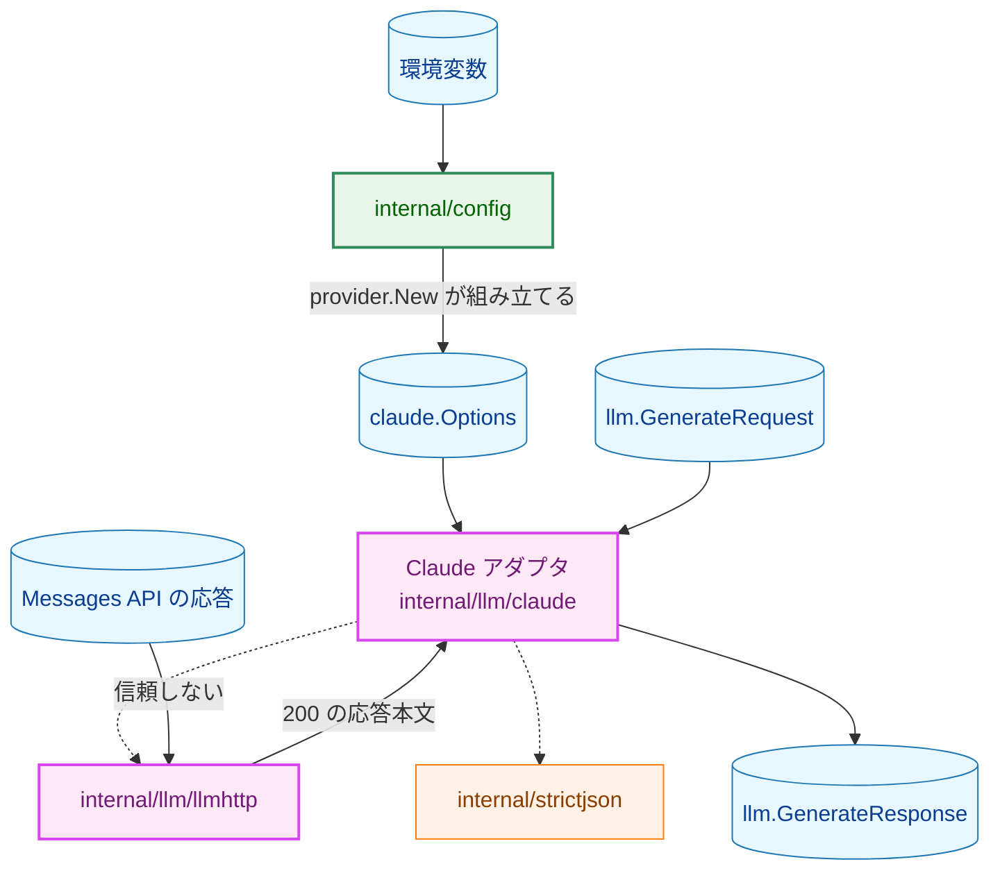
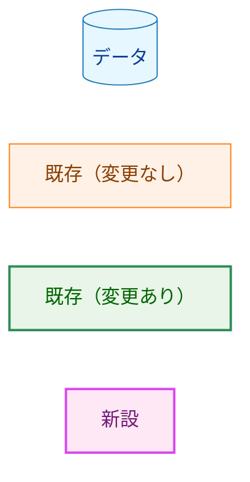
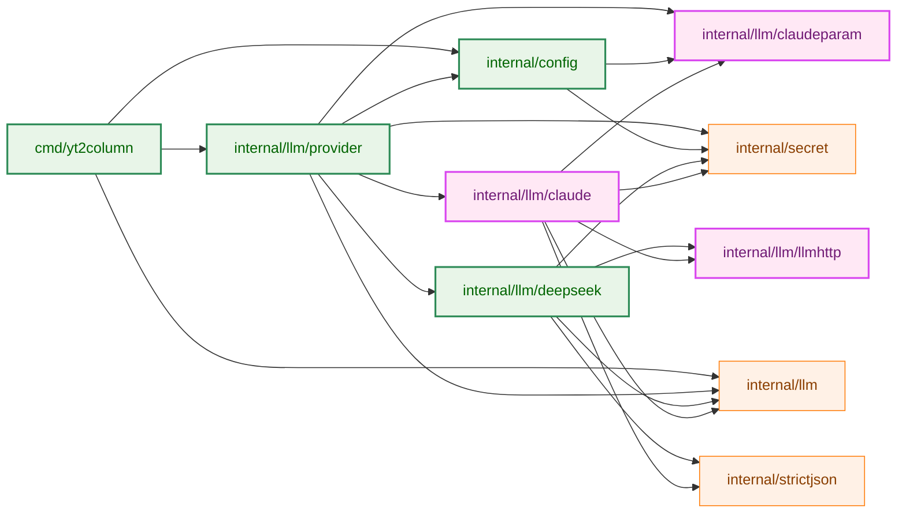
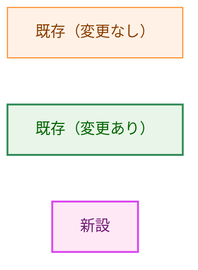
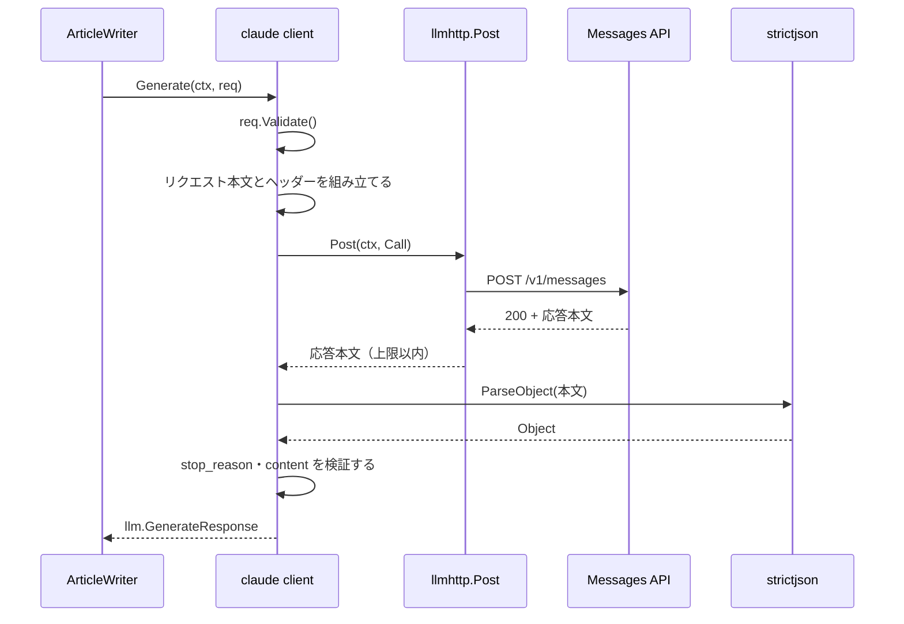
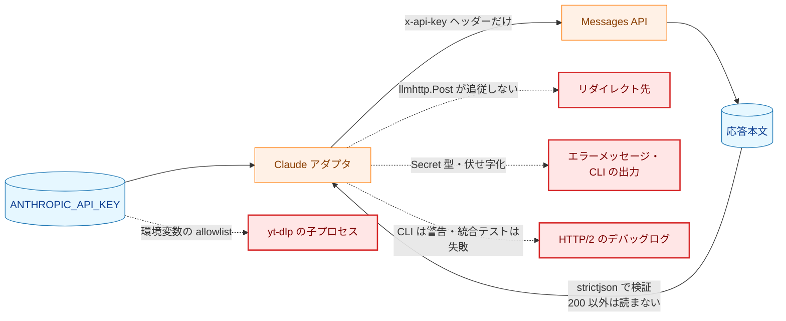
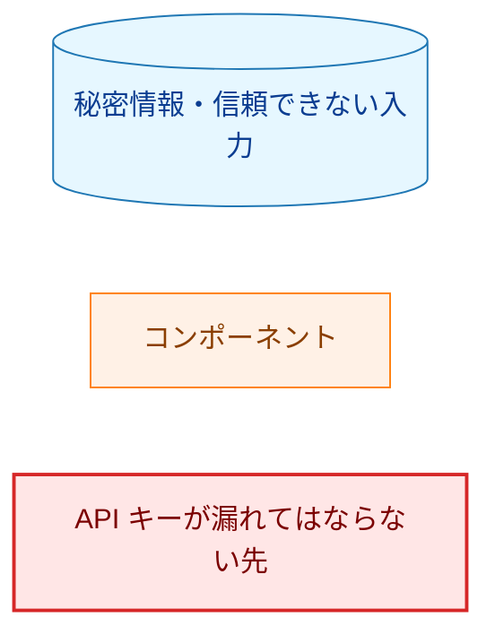
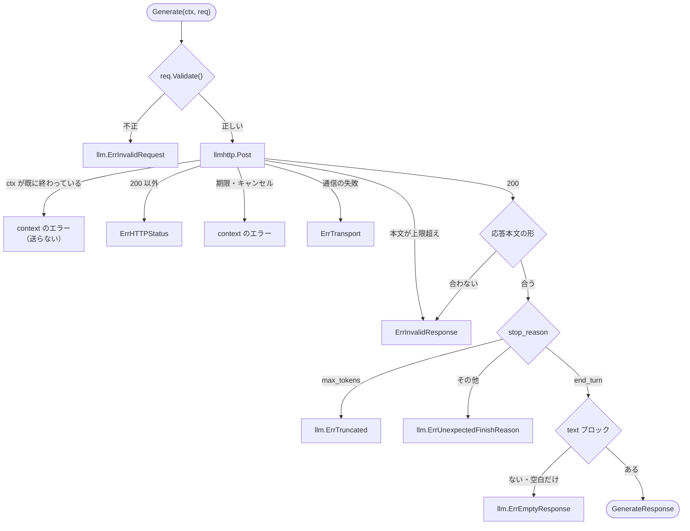

# アーキテクチャ設計書：Claude アダプタ（LLMClient 実装）

## Document Status

| Item | Value |
|---|---|
| Status | `draft` |
| Created | 2026-10-09 |
| Review date | - |
| Reviewer | - |
| Comments | 2026-10-10、要件定義書の改訂（選択したプロバイダに関係しない変数は検査しない。AC-45 の追加）に合わせ、§1.3・§3.2・§3.8・§7.1・§7.4 を改めた。同日、AC-44 の限定（呼び出し元のプロンプトを例外とする）に合わせ、§7.3 のワークスペース ID の検査を、ワークスペース ID を含まないプロンプトで行うこととした。 |

本書の既存コードへの言及は、HEAD `c45b750` で確認した。

## 1. 設計の全体像 (Design Overview)

### 1.1. 設計原則

1. **DeepSeek アダプタと同じ形で作り、HTTP 通信の手順は 1 か所に置く。** Claude アダプタ（`internal/llm/claude`）の構造は DeepSeek アダプタ（`internal/llm/deepseek`）と同じにする。`New` で構築し、非公開の型の値を `llm.LLMClient` として返す。送信先は固定し、テストだけが差し替える。

   リダイレクトに従わない送信、1 本の `context` による期限、応答本文のサイズの上限、通信の失敗の分類は、どちらのアダプタでも同じ振る舞いが必要である。これらは現在 DeepSeek アダプタの中にある（`internal/llm/deepseek/deepseek.go:74-81`・`:113-174`、`response.go:40-51`）。この手順を新設の `internal/llm/llmhttp` に移し、両方のアダプタから使う（§3.4、[design_handoff.md](design_handoff.md) H-01）。秘密情報の扱いに関わるコードを 2 か所に持たないためである。
2. **番兵はアダプタごとに持つ。** HTTP・JSON の形に依存する失敗の番兵（`ErrHTTPStatus`・`ErrInvalidResponse`・`ErrTransport`）は、`0003_deepseek_llm_client` の方針（同書 §1.1 の原則 7）のとおり、各アダプタのパッケージに置く。`llmhttp` はこれらを持たず、アダプタが渡した番兵で失敗を報告する（§3.4）。
3. **API の応答は信頼できない入力として境界で検証し、補正しない。** 応答本文の検証は、DeepSeek アダプタと同じく `internal/strictjson` の部品で行う。要件定義書 3.2 の受理する形に合わない応答は `ErrInvalidResponse` で拒否し、部分的な結果を返さない。
4. **effort とワークスペース ID は型で表し、定義は 1 か所に置く。** 2 つの値の型と、文字列から型への変換は、依存を持たない小さなパッケージ `internal/llm/claudeparam` に置き、アダプタと `internal/config` の両方から使う（§3.2、H-02）。「指定しない」はどちらの型でもゼロ値で表し、文字列の中身から推測しない（CLAUDE.md「Declare, don't infer」）。
5. **モデル名から挙動を推測しない。** アダプタは、モデル名を見て effort や thinking の扱いを変えない。モデルが受け付けない組み合わせは API が拒否し、HTTP ステータスのエラーとして報告する（要件定義書 F-001）。
6. **API キーは型と 1 つのファイルで守る。** API キーは `secret.Secret` のまま保持し、`Reveal()` を呼ぶのは `internal/llm/claude/request.go` の 2 か所（構築時の形の検査と、`x-api-key` ヘッダーの設定）だけとする。DeepSeek アダプタと同じ方針である。
7. **失敗はエラーメッセージだけで原因の見当がつくようにする。** アダプタはログを出さない。どの手順で何が起きたかを、秘密情報と応答本文の値を含めずにメッセージへ書く（§4.2）。

### 1.2. 概念モデル

矢印 A → B は「A の出力を B が受け取る」ことを、点線の矢印は「A が B を部品として使う」ことを表す。



**Legend**



### 1.3. 既存コードとの関係

| 既存のもの | 本設計での扱い |
|---|---|
| `internal/llm`（`LLMClient`・`GenerateRequest`・プロバイダ共通の番兵） | 変更しない。`GenerateRequest.Validate` と `ErrTruncated` などの番兵をそのまま使う |
| `internal/llm/deepseek` | 送信の手順を `internal/llm/llmhttp` の呼び出しに置き換える。番兵と `HTTPStatusError` は変えない。タイムアウトと通信の失敗のメッセージにだけ経過時間が加わる（§3.4）|
| `internal/strictjson` | 変更しない。応答本文の検証に使う |
| `internal/secret` | 変更しない。API キーを保持する |
| `internal/loopbacktest` | 変更しない。テスト用の構築で、送信先がループバックであることを確かめる |
| `internal/config` | `claude` プロバイダ、`ANTHROPIC_API_KEY`・`YT2COLUMN_CLAUDE_EFFORT`・`ANTHROPIC_WORKSPACE_ID` を加える（§3.2）|
| `internal/llm/provider` | プロバイダが `claude` のとき Claude アダプタを構築する（§3.3）|
| `cmd/yt2column` | 出力の伏せ字化の対象に Anthropic の API キーを加える（§5.2）|
| `internal/transcript`（yt-dlp の子プロセスの環境） | 変更しない。子に渡す環境変数は allowlist（`internal/transcript/exec.go:44`）で決まるため、`ANTHROPIC_API_KEY` は渡らない |
| `internal/llm/deepseek/testutil` の Make の検査の部品 | プロバイダによらない部分を `internal/maketestutil` に移す（§7.2）|

**選択したプロバイダに関係しない変数は検査しない。** 要件定義書 F-006 は、`YT2COLUMN_LLM_PROVIDER` で選んだプロバイダの変数だけを読んで検査し、他のプロバイダの変数は未設定・空・不正な値のいずれでも拒否しないと定める。そのため、DeepSeek を使っていて、他のツールのために `ANTHROPIC_API_KEY=`（空）などをエクスポートしている環境でも、更新後に止まらない（AC-26）。既存の `DEEPSEEK_API_KEY` の読み込みは、空の値をプロバイダによらず拒否している（`internal/config/config.go:199-221`）。この判定を「プロバイダが `deepseek` のときだけ」に改める（§3.2）。プロバイダが `deepseek` のときの振る舞いは変わらない（AC-27）。プロバイダが不正なときに `DEEPSEEK_API_KEY` の空の値を報告しなくなるが、この組み合わせを検査している既存のテストはない（`internal/config/config_test.go` の `TestLoadMissing`・`TestLoadEmpty`・`TestLoadInvalid` の行は、いずれもプロバイダが `deepseek` か、`DEEPSEEK_API_KEY` が空でない）。

### 1.4. 事前調査（実 API）

要件定義書 §5 と [design_handoff.md](design_handoff.md) H-11 は、本書の承認を求める前に実 API で調査し、結果を本節に記録することを求める。実 API を呼び料金が発生するため、人間の明示的な承認を得て、2026-10-09 に実施した。

**調査の手順。** リポジトリの外の一時ディレクトリで、`curl` を使って行った。

- `umask 077` の下で、`x-api-key`・`anthropic-version`・`anthropic-workspace-id` を書いたヘッダーファイルを作り、`curl -H @<file>` で渡した。API キーをコマンドラインに書かず、終了時にファイルを削除した。`curl` の `-v`・`--trace` は使わなかった。
- API キーは `YT2COLUMN_TEST_ANTHROPIC_API_KEY`、ワークスペース ID は `YT2COLUMN_TEST_ANTHROPIC_WORKSPACE_ID` から読んだ。
- 応答ヘッダーと応答本文を別々のファイルに、生のバイト列のまま保存した。ステータス・HTTP のバージョン・所要時間は `curl -w` で記録した。
- リクエスト本文は `model`・`max_tokens`・`system`・`messages`（user 1 件）・`output_config.effort` だけとし、本番の設計（§3.7）と同じにした。

**観測結果（短い固定のプロンプト）。** system `You are a concise assistant.` と短い英文の質問で行った。

| # | リクエスト | ステータス | 観測 |
|---|---|---|---|
| 1 | Haiku 5.5、`low`、`max_tokens` 1024 | `200` | `stop_reason` `end_turn`。`content` は `text` ブロック 1 つだけ（thinking ブロックなし）|
| 2 | Haiku 5.5、`low`、`max_tokens` 16 | `200` | `stop_reason` `max_tokens`。`content` は途中までの `text` ブロック 1 つ |
| 3 | 存在しないモデル名 | **`404`** | `not_found_error`。メッセージはモデル名を含む |
| 4 | 不正な API キー | `401` | `authentication_error`、メッセージは `invalid x-api-key` だけ。**送った API キーのどの部分も含まない** |
| 5 | effort `none` | `400` | `invalid_request_error`。メッセージは受け付ける 5 つの値を挙げる |
| 6 | Opus 5.5、`low` | `200` | `text` ブロック 1 つ（thinking ブロックなし）|
| 7 | Haiku 5.5、`max_tokens` 1 | `200` | `stop_reason` `max_tokens`、**`content` は空の配列** |
| 8 | Sonnet 5.5、`low` | `200` | `text` ブロック 1 つ |
| 9 | Sonnet 5.5、`high` | `200` | `text` ブロック 1 つ（`thinking_tokens` 0）|
| 10 | Opus 5.5、`high` | `200` | `content` は **`thinking` ブロック（`thinking` は空文字列、`signature` あり）と `text` ブロック**の 2 つ。`thinking_tokens` 14 |
| 11 | ワークスペースに紐付かないキーで、`anthropic-workspace-id` なし | `400` | `invalid_request_error`。キーがワークスペースに紐付いていないため `anthropic-workspace-id` ヘッダーが必要、というメッセージ |

- **応答本文の形。** トップレベルは `model`・`id`・`type`・`role`・`content`・`container`（`null`）・`stop_reason`・`stop_sequence`（`null`）・`stop_details`（`null`）・`usage`・`diagnostics`（`null`）だった。`model` はリクエストと同じ文字列だった。消費するメンバーはすべて期待する種類で、1 回ずつ現れた。`text` ブロックはどの応答でも高々 1 つだった。
- **thinking ブロック。** 推論過程の本文は既定で返らず、`thinking` は空文字列だった。`thinking` ブロックは `text` ブロックより前にあった。
- **エラー応答の形。** `{"type":"error","error":{"type":…,"message":…},"request_id":…}`。応答ヘッダーには `request-id` がある。
- **HTTP のバージョン。** すべて HTTP/2 だった。

**観測結果（記事の生成）。** 40 分前後（2389 秒）の動画の字幕と本番のテンプレートで組み立てたプロンプト（system 817 バイト、user 50,746 バイト、入力 16,577 トークン）を、`max_tokens` 64000 の非ストリーミングで送った。各組み合わせ 1 回ずつ、同じ日の同じネットワークから送った。字幕と生成した記事はリポジトリに保存せず、調査の後に削除した。

| モデル | effort | ステータス | 出力トークン（うち thinking） | 所要時間 | 応答本文 |
|---|---|---|---|---|---|
| Sonnet 5.5 | `high` | `200`（`end_turn`）| 3,537（834）| 33 秒 | 12,244 バイト |
| Sonnet 5.5 | `xhigh` | `200`（`end_turn`）| 5,500（2,900）| 46 秒 | 18,951 バイト |
| Sonnet 5.5 | `max` | `200`（**`max_tokens`**）| 64,000（64,000）| 442 秒 | 243,515 バイト |
| Opus 5.5 | `high` | `200`（`end_turn`）| 6,404（2,219）| 71 秒 | 21,748 バイト |
| Opus 5.5 | `xhigh` | `200`（`end_turn`）| 8,099（3,984）| 87 秒 | 26,676 バイト |
| Opus 5.5 | `max` | `200`（**`max_tokens`**）| 64,000（64,000）| 559 秒 | 245,601 バイト |

- `high`・`xhigh` では、どの応答も `thinking` ブロック（本文は空）と `text` ブロック 1 つだった。生成テキストは 2,845〜4,629 文字だった。
- **`max` では、どちらのモデルも 64,000 トークンをすべて推論過程に使い、`text` ブロックのないまま `max_tokens` で打ち切られた。** 応答本文が大きいのは `thinking` ブロックの `signature` が大きいためで、推論過程の本文は空だった。出力の速さは、Sonnet で約 145 トークン/秒、Opus で約 114 トークン/秒だった。
- すべての応答で、ヘッダーを受け取るまでの時間（time to first byte）が全体の所要時間とほぼ等しかった。非ストリーミングでは、生成が終わるまでサーバーから何も送られない。最長の 559 秒（約 9 分）の無通信でも、接続は切れなかった。

**保存したフィクスチャ。** 観測結果の表の #10 と #2 の応答本文を `testdata/claude_messages_end_turn.json`・`testdata/claude_messages_max_tokens.json` として保存した（AC-38）。保存前に、API キー（全体と末尾 8 文字）とワークスペース ID が含まれないことを確認した。[security.md](../../dev/security.md) §7 は、コミットする実データが取得者を特定しないことを求める。トップレベルの `id` と `thinking` ブロックの `signature` は、Anthropic の側で取得者の組織と結び付けられうるため、同じ長さ・同じ文字種の合成の値に置き換えた。どちらもアダプタが読まないメンバーで、AC-38 には存在だけが要る。置き換えは `testdata/README.md` に記した。生成テキストは固定のプロンプトに対するモデルの出力であり、第三者の著作物を含まない。それ以外の応答はコミットしない。

**調査で決まった事項。**

| 事項 | 結果 | 本設計への反映 |
|---|---|---|
| `text` ブロックの数 | どの応答でも高々 1 つ | 要件定義書 3.2 の「高々 1 つ」は見直さない |
| `thinking` ブロック | Opus の `high` 以上で現れ、本文は空 | 要件どおり無視する。AC-15・AC-38 のフィクスチャにする |
| `max_tokens` による打ち切り | 途中の `text` ブロック、または空の `content` | どちらも要件の検証順序で `llm.ErrTruncated` になる |
| `max_tokens` の最小値 | 1 を受け付ける | 統合テストの打ち切りは 16 で観測できたため、16 にする（§3.6、H-07）|
| 存在しないモデル名 | `404` | §4.2 の案内文に反映する |
| `401` の応答本文 | API キーを含まない | `200` 以外の応答本文を読まない方針は変えない（§3.5）|
| 記事の生成の出力トークン数・所要時間 | `high`・`xhigh` は最大 8,099 トークン・87 秒 | `max_tokens` の定数を 16,000 とし、タイムアウトは 15 分のままにする（§3.6、H-03・H-04）|
| effort `max` | 64,000 トークンでも記事が生成されない | 要件どおり受け付けるが、`llm.ErrTruncated` になる。エラーメッセージと README で effort を下げるよう案内する（§3.6・§4.2）|

---

## 2. システム構成 (System Structure)

### 2.1. パッケージ構成

矢印 A → B は「A が B を import する」ことを表す。本タスクに関係する import だけを描く。



**Legend**



`internal/llm/claudeparam` は標準ライブラリだけを import する。`internal/config` は、アダプタのパッケージ（`net/http` などを持つ）ではなくこのパッケージだけに依存する。

### 2.2. コンポーネント配置

| パッケージ | ファイル | 役割 |
|---|---|---|
| `internal/llm/claudeparam`（新設） | `claudeparam.go` | `Effort`・`WorkspaceID` の型と、文字列からの変換 |
| `internal/llm/claude`（新設） | `claude.go` | `Options`・`New`・`Generate` |
| | `request.go` | リクエスト本文とヘッダーの組み立て、API キーの `Reveal()` |
| | `response.go` | 応答本文の検証と `GenerateResponse` の組み立て |
| | `errors.go` | 番兵、`HTTPStatusError`、構築時のエラー、ステータスごとの案内文 |
| `internal/llm/llmhttp`（新設） | `llmhttp.go` | HTTP クライアントの構成、1 回の POST、通信の失敗の分類 |

### 2.3. データフロー（成功時）

実線の矢印は呼び出し、点線の矢印は戻り値を表す。`Generate` を呼ぶのは `ArticleWriter`（`internal/writer`）である。



---

## 3. コンポーネント設計 (Component Design)

### 3.1. `internal/llm/claude` の公開 API

```go
package claude

// Options configures the Claude adapter. APIKey, Model, Effort, and Timeout
// are required. The zero WorkspaceID sends no anthropic-workspace-id header.
type Options struct {
	APIKey      secret.Secret
	Model       string
	Effort      claudeparam.Effort
	WorkspaceID claudeparam.WorkspaceID
	Timeout     time.Duration
}

// New validates opts and returns an llm.LLMClient that sends to the
// production endpoint. It never reads environment variables.
func New(opts Options) (llm.LLMClient, error)
```

- `New` は、ゼロ値の API キー、空・前後に空白文字を含む・不正な UTF-8 のモデル名、`claudeparam.EffortUnset` と範囲外の `Effort`、0 以下のタイムアウトを拒否する（AC-02）。
- `New` が返す型は非公開で、`Generate` は `llm.LLMClient` の契約に従う。
- テスト用の構築（送信先をループバックの URL に差し替える）は、DeepSeek アダプタの `NewForLoopbackTest`（`internal/llm/deepseek/test_helpers_endpoint.go`）と同じ形で、`test` タグのファイルに置く（H-08）。

### 3.2. `internal/llm/claudeparam` と `internal/config` への追加

```go
package claudeparam

// Effort is the output_config.effort value. The zero value is EffortUnset.
type Effort int

const (
	EffortUnset Effort = iota
	EffortLow
	EffortMedium
	EffortHigh
	EffortXHigh
	EffortMax
)

// ParseEffort returns the Effort for one of "low", "medium", "high",
// "xhigh", "max". Any other string, including a differently cased or padded
// one, returns an error.
func ParseEffort(value string) (Effort, error)

// String returns the wire value; EffortUnset and unknown values return a
// fixed placeholder.
func (e Effort) String() string

// WorkspaceID is an Anthropic workspace ID. The zero value means none was
// specified; a non-zero value can only come from ParseWorkspaceID.
type WorkspaceID struct {
	value string
}

// ParseWorkspaceID accepts a non-empty string of printable ASCII characters
// other than space (0x21-0x7E). Any other string, the empty string included,
// returns an error.
func ParseWorkspaceID(value string) (WorkspaceID, error)

// Value returns the workspace ID and whether one was specified.
func (w WorkspaceID) Value() (string, bool)
```

- ワークスペース ID の「指定しない」は `WorkspaceID` のゼロ値で表す。空文字列は `ParseWorkspaceID` が拒否するため、「指定したが空」の値は型として作れない。アダプタの構築は、この型を受け取ることで AC-39 を満たす（構築の前に、空や不正な値は変換で拒否される）。`internal/config` も同じ変換を使うため、AC-42 の形の検査と AC-39 の検査は同じ規則になる。
- `WorkspaceID` を `secret.Secret` にしないのは、ワークスペース ID が認証情報ではないためである（要件定義書 §4.2）。

```go
package config

// The supported Provider values.
const (
	ProviderUnset Provider = iota
	ProviderDeepSeek
	ProviderClaude
)

// AnthropicAPIKey returns the Anthropic API key. It is non-zero when the
// provider is ProviderClaude.
func (c Config) AnthropicAPIKey() secret.Secret

// ClaudeEffort returns the effort. It is not claudeparam.EffortUnset when
// the provider is ProviderClaude.
func (c Config) ClaudeEffort() claudeparam.Effort

// AnthropicWorkspaceID returns the workspace ID. It is the zero value when
// ANTHROPIC_WORKSPACE_ID is unset or the provider is not ProviderClaude.
func (c Config) AnthropicWorkspaceID() claudeparam.WorkspaceID
```

| 変数 | 未設定 | 空 | 不正な値 | 正しい値 |
|---|---|---|---|---|
| `YT2COLUMN_LLM_PROVIDER` | `deepseek` | `ErrMissing` | `ErrInvalid`（`deepseek`・`claude` 以外）| そのプロバイダ |
| `DEEPSEEK_API_KEY`（`deepseek`）| `ErrMissing` | `ErrMissing` | なし | 保持 |
| `ANTHROPIC_API_KEY`（`claude`）| `ErrMissing` | `ErrMissing` | なし | 保持 |
| `YT2COLUMN_CLAUDE_EFFORT`（`claude`）| `ErrMissing` | `ErrMissing` | `ErrInvalid`（`ParseEffort` が拒否する値）| 保持 |
| `ANTHROPIC_WORKSPACE_ID`（`claude`）| 指定なし | `ErrMissing` | `ErrInvalid`（`ParseWorkspaceID` が拒否する値）| 保持 |

プロバイダ固有の変数の行は、括弧内のプロバイダが選ばれたときの扱いである。それ以外のプロバイダが選ばれたとき、およびプロバイダが不正なときは、その変数を読まない（どの値でも拒否せず、保持もしない。AC-26・AC-45）。

- 拒否は既存の `*VarError`（変数名と固定の理由だけを持つ）で返す。理由の文字列は定数で、拒否した値を含まない（AC-25・AC-42）。effort の理由は「対応する effort の値ではない」とだけ書き、5 つの値を並べない。値の一覧を `claudeparam` の外に持たないためである（要件定義書 §4.5）。
- 読み込みは既存の `Load` と同じく、すべての拒否を `errors.Join` でまとめて返す。プロバイダ固有の変数の読み込みは、`cfg.provider` が自分のプロバイダのときだけ変数を読む。`switch cfg.provider` で分け、`default`（他のプロバイダと、プロバイダが不正で `ProviderUnset` のままの場合）は何も読まない。
- `YT2COLUMN_LLM_PROVIDER` の理由の文字列（`internal/config/config.go:52`）は `must be exactly "deepseek" or "claude"` にする。
- 既存の `apiKeyEnv`・`loadAPIKey`（`internal/config/config.go:30`・`:199`）は DeepSeek 専用だが名前が一般的なため、`deepSeekAPIKeyEnv`・`loadDeepSeekAPIKey` に改め、Anthropic 用の `anthropicAPIKeyEnv`・`loadAnthropicAPIKey` と区別する。`internal/config/config_test.go` の該当箇所（`apiKeyEnv` の参照）も改名に合わせる。

### 3.3. `internal/llm/provider` の変更

`New(cfg config.Config)` の形は変えない。内部の `newClient` は、プロバイダ・設定・アダプタの構築関数の組を受け取る形に変える。

```go
// builders are the adapter constructors. Production passes deepseek.New and
// claude.New; a test passes a loopback constructor or a spy.
type builders struct {
	deepseek func(deepseek.Options) (llm.LLMClient, error)
	claude   func(claude.Options) (llm.LLMClient, error)
}

func newClient(provider config.Provider, cfg config.Config, build builders) (llm.LLMClient, error)
```

- `ProviderClaude` の分岐は、`cfg.AnthropicAPIKey()`・`cfg.Model()`・`cfg.ClaudeEffort()`・`cfg.AnthropicWorkspaceID()` と `LLMTimeout` から `claude.Options` を作る。`default` は既存どおり `errUnknownProvider` を返し、構築関数を呼ばない。
- `newClient` の呼び出しを変えるため、`internal/llm/provider/provider_test.go:132`・`:178` のテストを更新する。
- `LLMTimeout`（`internal/llm/provider/provider.go:19`、15 分）は両プロバイダで共有する（§3.6、H-04）。doc コメントの根拠に Claude の測定結果を加える。CLI のタイムアウトの案内（`cmd/yt2column/run.go:389`）は `LLMTimeout` を表示しており、変更しない。

### 3.4. `internal/llm/llmhttp`（HTTP 通信の手順）

DeepSeek アダプタの中にある次の手順を、振る舞いを変えずに移す。

- リダイレクトに従わない `http.Client` の構成（`internal/llm/deepseek/deepseek.go:74-81`）
- 送信の前に呼び出し元の `ctx` を確かめ、構築時のタイムアウトを `context.WithTimeoutCause` で重ね、送信から応答本文の読み取りまでを 1 つの期限で覆うこと（`deepseek.go:108-117`）
- `200` 以外の応答の本文を読まずに、アダプタのステータスのエラーを返すこと（`deepseek.go:133-137`）
- 応答本文を上限 + 1 バイトまで読み、超えたらアダプタの `ErrInvalidResponse` にすること（`response.go:40-51`）
- 送信と読み取りの失敗を、呼び出しの `context` の状態に応じて `context.DeadlineExceeded`・`context.Canceled`・アダプタの `ErrTransport` に分類すること（`deepseek.go:145-174`）

```go
package llmhttp

// MaxResponseBytes caps the response body an adapter reads.
const MaxResponseBytes = 8 << 20

// NewClient returns an http.Client that never follows a redirect and leaves
// Transport nil, so the proxy environment variables apply.
func NewClient() *http.Client

// Errors are the adapter's own error values. Post reports every failure with
// one of them, so each adapter keeps its sentinels.
type Errors struct {
	Transport       error
	InvalidResponse error
	Status          func(statusCode int) error
}

// Call describes one POST. NewRequest must build the request with the ctx it
// receives, which carries the call deadline.
type Call struct {
	Client     *http.Client
	Timeout    time.Duration
	NewRequest func(ctx context.Context) (*http.Request, error)
	Errors     Errors
}

// Post sends one request and returns the body of a 200 response, at most
// MaxResponseBytes long. It never follows a redirect, whatever Client is.
// A non-200 response returns Errors.Status(code) without reading the body; a
// timeout or cancellation returns an error matching context.DeadlineExceeded
// or context.Canceled; any other send or read failure wraps
// Errors.Transport; an oversized body wraps Errors.InvalidResponse.
func Post(ctx context.Context, call Call) ([]byte, error)
```

- **リダイレクトの防止を呼び出し側に頼らない。** `Post` は、渡された `Client` の設定によらず、リダイレクトに従わない（例えば、`Client` の写しにリダイレクトを追わない設定を加えてから送る）。`Client` が `nil` の場合も、同じ設定を加えた `Client` で送る。`x-api-key` は独自のヘッダーで、Go の `http.Client` はホストの異なるリダイレクトでも独自のヘッダーを転送するため、この保証が Claude では特に要る。
- **不完全な `Call` では送らない。** `Timeout` が 0 以下、`NewRequest` が `nil`、`Errors` のいずれかが `nil`、または `NewRequest` が返したリクエストの `Context()` が渡した `ctx` でない場合、`Post` は送らずにエラーを返す。最後の検査は、期限がリクエストに掛かっていることを保証するためである。
- **経過時間の記録。** タイムアウトと `Errors.Transport` のエラーのメッセージには、送信を始めてからの経過時間を加える（「接続できなかった（0 秒）」と「8 分後に切れた」を区別するため）。DeepSeek アダプタのメッセージにも加わる。これはメッセージの変更なので、振る舞いを変えない切り出しのコミットとは分け、その後の独立したコミットにする。DeepSeek のテストはメッセージの部分文字列だけを検査しており（`internal/llm/deepseek/deepseek_test.go:493`・`:514`・`:517`）、経過時間を加えても通る。
- **番兵はアダプタに残す。** `llmhttp` は番兵を持たない。DeepSeek アダプタの `ErrHTTPStatus`・`ErrInvalidResponse`・`ErrTransport`・`HTTPStatusError`（`internal/llm/deepseek/errors.go`）の値と `HTTPStatusError` のメッセージは変えない。Claude アダプタは同じ名前の番兵と型を自分のパッケージに持つ（§4.1）。`0003_deepseek_llm_client` の方針（HTTP・JSON の形に依存する失敗の番兵は各アダプタに置く。同書 §1.1 の原則 7）のとおりである。
- **DeepSeek アダプタのテストの前提。** DeepSeek アダプタのテストとテスト用のヘルパー（`test` タグ）は、次の非公開の名前を参照する。切り出しの後もこれらを残す。

| 名前 | 参照している場所 | 切り出し後 |
|---|---|---|
| `client` 型と `client.httpClient`（`*http.Client`）| `internal/llm/deepseek/deepseek_test.go:686`（`Transport` が `nil` であることの検査）| フィールドを残し、`llmhttp.NewClient()` の値を入れて `Post` に渡す |
| `client.endpoint` | `internal/llm/deepseek/test_helpers_endpoint.go:32`、`test_helpers.go` | 変えない |
| `errorPrefix` | `internal/llm/deepseek/test_helpers.go:182-186` | 変えない |
| `maxResponseBytes` | `internal/llm/deepseek/*_test.go` | `llmhttp.MaxResponseBytes` を指す定数として残す |
| `keyModel`・`keyChoices`・`maxReasonBytes` | `internal/llm/deepseek/response_test.go` | 変えない（`response.go` に残る）|

- **コミットの順序。** `llmhttp` への切り出しは、Claude アダプタの追加より前の独立したコミット（リファクタリング）にし、そのコミットで DeepSeek アダプタのテストが変更なしに通ることを確かめる（H-01）。

### 3.5. 応答本文の検証

検証の順序は要件定義書 F-003 のとおり、HTTP ステータス（`llmhttp.Post`）→ 応答本文の形 → `stop_reason` → 生成テキストとする。

- 応答本文の形は `strictjson.ParseObject` で検査し、トップレベルの `model`・`stop_reason`・`content` を `Collect` で取り出す。`content` の各要素は、まず `type` だけを取り出して文字列として読み、`switch` で分ける。`text` は `text` を取り出し、`thinking`・`redacted_thinking` はそれ以上読まない。`default` は `ErrInvalidResponse` で拒否する（H-05）。`text` の要素が 2 つ目なら拒否する。
- `strictjson.ParseObject` は、メンバーを取り出す前に、本文全体が正しい UTF-8 であることと、対になっていないサロゲートを含まないことを検査する（`internal/strictjson/strictjson.go:65-78`）。そのため、消費しない `thinking` ブロックの中の不正な文字列も拒否される（AC-36、H-05）。
- `200` 以外の応答の本文は読まない（`llmhttp.Post`）。調査では `401` の本文は API キーを含まなかったが、本文は信頼できない入力であり、端末に出さない方針（要件定義書 F-003）を変える理由はない。
- 応答本文にトップレベルの `error` メンバーがある場合は、DeepSeek アダプタと同じく、その存在だけを診断に加える（値は含めない）。

### 3.6. 固定する具体値

| 値 | 内容 | 根拠 |
|---|---|---|
| 送信先 | `https://api.anthropic.com/v1/messages` | 要件定義書 F-001 |
| `anthropic-version` | `2023-06-01` | 公開文書と調査（§1.4）で確認した現行の値（H-06）|
| `MaxOutputTokens` が 0 のときの `max_tokens` | 16,000 | §1.4 の `high`・`xhigh` の最大 8,099 トークンの約 2 倍。Anthropic は非ストリーミングの `max_tokens` の目安を約 16,000 としており、それを超えない（H-03）|
| 応答本文の上限 | 8 MiB（`llmhttp.MaxResponseBytes`）| DeepSeek アダプタと共有する。§1.4 の最大の応答本文は約 240 KB（`max` の打ち切り）（H-09）|
| LLM のタイムアウト | 15 分（`provider.LLMTimeout`、共有）| 下記（H-04）|
| タイムアウトの検出の猶予 | 2 秒 | AC-18 の「設計で固定した猶予時間」。DeepSeek アダプタと同じ値で、`llmhttp.Post` が同じ仕組みで期限を検出するため |
| 統合テストの既定のモデル・effort | `claude-haiku-5-5`・`low` | 料金を抑える組み合わせ。§1.4 の表の #1・#2 で正常な生成と打ち切りを観測した（H-07）|
| 統合テストの `MaxOutputTokens` | 正常な生成は 1,024、打ち切りは 16 | 正常な生成は §1.4 の表の #1 で十分だった値。利用者がモデルや effort を上書きしても、1 回の出力を 1,024 トークンに抑える。打ち切りは §1.4 の表の #2 で観測した値 |
| 統合テストの 1 回の `Generate` のタイムアウト | 5 分 | 出力が 1,024 トークン以下なら、§1.4 の速さで 10 秒程度で終わる |

**タイムアウト（15 分）の根拠と残るリスク。** 16,000 トークンの出力は、§1.4 で観測した速さ（Opus で約 114 トークン/秒）なら約 140 秒で、15 分より十分に短い。ただしこれは 1 回ずつの測定からの見積もりで、混雑時の速さは測っていない。非ストリーミングでは生成が終わるまで無通信が続き、§1.4 では 9 分の無通信でも切れなかったが、利用者のネットワーク（NAT やプロキシ）によっては途中で切断されうる。Go の HTTP/2 の既定の設定は死んだ接続を検出するための PING を送らないため、その場合は 15 分の期限まで待ってから失敗する。生成の料金は発生し、記事は投稿されない（`ErrTransport` かタイムアウト）。このリスクは受け入れ、メッセージに経過時間を含めて原因を見分けられるようにする（§3.4）。実際に問題になれば、要件定義書 §2.3 のとおりストリーミングを別の issue にする。

**effort `max` の扱い。** §1.4 では、`max` は 64,000 トークンをすべて推論過程に使い、記事を生成しなかった。`max_tokens` の定数を API の上限まで上げても生成できる保証はなく、非ストリーミングでは無通信の時間がさらに延びる。そのため定数は `high`・`xhigh` に合わせ、`max` を選んだ場合は要件どおり `llm.ErrTruncated` として報告する（記事は投稿されない）。エラーメッセージは、`text` ブロックがないまま打ち切られたことと、effort を下げるよう案内する（§4.2）。README の設定の説明にも「本用途では `max` は推論だけで上限に達する」と書く。

### 3.7. リクエスト本文とヘッダー

- 本文は非公開の構造体を JSON にして作る。構造体は `model`・`max_tokens`・`system`・`messages`・`output_config`（`effort` だけ）のフィールドしか持たないため、要件定義書 AC-07 にない値は送れない。`messages` は `role` が `user` の 1 件で、`content` は `UserPrompt` の文字列そのものである。
- ヘッダーは `Content-Type: application/json`・`x-api-key`・`anthropic-version` を常に、`anthropic-workspace-id` を `WorkspaceID` が指定されているときだけ設定する（AC-03・AC-40・AC-44）。`Authorization` と `anthropic-beta` は設定しない。
- API キーは構築時に、DeepSeek アダプタと同じく印字可能な ASCII（0x21-0x7E）だけからなることを確かめる。不正なキーはヘッダーに設定できず、送信の段階で `net/http` が拒否するためである。

### 3.8. コンポーネント責務表

| ファイル | 種別 | 責務・変更内容 | 更新が必要な既存テスト |
|---|---|---|---|
| `internal/llm/llmhttp/llmhttp.go` | 新設 | §3.4 | - |
| `internal/llm/llmhttp/llmhttp_test.go` | 新設 | `Post` の分類・上限・リダイレクト（`Post` 自身の保証）・期限・不完全な `Call` のテスト | - |
| `internal/llm/llmhttp/llmhttptest/*.go` | 新設 | テストサーバーとローカルのプロキシの部品（`test` タグ、§7.1）| - |
| `internal/llm/deepseek/deepseek.go`・`response.go` | 変更 | 送信の手順を `llmhttp.Post` に置き換える。`client.httpClient` は `llmhttp.NewClient()` の値にする | なし（変更せずに通ることを確かめる）|
| `internal/llm/claudeparam/claudeparam.go`・`claudeparam_test.go` | 新設 | §3.2 | - |
| `internal/llm/claude/claude.go`・`request.go`・`response.go`・`errors.go` | 新設 | §3.1・§3.5・§3.7・§4 | - |
| `internal/llm/claude/test_helpers.go`・`test_helpers_endpoint.go` | 新設 | テスト用の構築とフィクスチャの読み込み（§7.1）| - |
| `internal/llm/claude/claude_test.go`・`response_test.go` | 新設 | ユニットテスト（§7.1）| - |
| `internal/llm/claude/integration_test.go`・`integration_env_test.go`・`makefile_test.go` | 新設 | 統合テストとその実行条件、Make ターゲットの検査（§7.2）| - |
| `internal/llm/claude/testutil/integration.go`・`integration_settings_test.go` | 新設 | 統合テストを実行するかどうかの判定とそのテスト（§7.2）| - |
| `internal/maketestutil/make.go`・`make_test.go` | 新設（移動）| スタブの `GOTEST` で Make を実行する部品（§7.2）| `internal/llm/deepseek/testutil/make_test.go` の非公開の名前のテストを移す |
| `internal/llm/deepseek/testutil/make.go` | 変更 | `RunMakeTarget` などを `internal/maketestutil` の部品を呼ぶだけの薄いラッパーにする | なし（公開の形を変えない）|
| `cmd/yt2column/makefile_test.go` | 変更 | `TestMakeOptInsAreTargetSpecific`（`:61-90`）に `test-integration-claude` と `YT2COLUMN_CLAUDE_INTEGRATION` を加える。`YT2COLUMN_CLAUDE_INTEGRATION` は記録する変数にも加える（記録しなければ、他のターゲットがエクスポートしても検査が失敗しない）| 同ファイル |
| `internal/config/config.go` | 変更 | §3.2。`DEEPSEEK_API_KEY` の読み込みを、プロバイダが `deepseek` のときだけ変数を読む形に改める（§1.3）。http2debug のコメント（`:40-41`）の「`Authorization` ヘッダー」を、送るすべての API キーのヘッダーを指す表現に改める | `internal/config/config_test.go:173`（`claude` を不正な値として挙げている。`Claude`・`anthropic` に置き換える）、`apiKeyEnv` の参照（改名）|
| `internal/config/envaccess_test.go` | 変更 | 秘密情報の変数名の一覧（`:59`）に `ANTHROPIC_API_KEY` を加える | 同ファイル |
| `internal/llm/provider/provider.go` | 変更 | §3.3 | `internal/llm/provider/provider_test.go:132`・`:178` |
| `internal/llm/provider/provider_test.go` | 変更 | 本番の送信先に届かないことの検査（§7.1）を加える | 同ファイル |
| `cmd/yt2column/run.go` | 変更 | `configuredSecrets`（`:474-486`）に Anthropic の API キーを加える（§5.2）| なし（テストを加える）|
| `cmd/yt2column/docs_test.go` | 変更 | 設定の表の行（`:33-40`）に `ANTHROPIC_API_KEY`・`YT2COLUMN_CLAUDE_EFFORT`・`ANTHROPIC_WORKSPACE_ID` を加える | 同ファイル |
| `Makefile` | 変更 | `test-integration-claude` を加える | - |
| `testdata/claude_messages_end_turn.json`・`claude_messages_max_tokens.json`・`README.md` | 新設・変更 | §1.4 のフィクスチャと出典 | - |
| `README.md` | 変更 | 設定の表（プロバイダ固有の変数は選んだプロバイダのときだけ検査すること）、`max` の注意、統合テスト | - |
| `docs/dev/project_overview.md` | 変更 | 設定の表、パッケージ構成。設定の節に「選択したプロバイダに関係しない変数は読まず、検査しない」原則を加える（要件定義書 §5.1）| - |
| `docs/dev/security.md` | 変更 | §2 の統合テストの例外の表とキーの説明（テスト用のキーは利用上限を設けたワークスペースのものにする）、http2debug の説明（`x-api-key`）、§4 の送るデータ | - |
| `docs/dev/developer_guide/package_reference.md` | 変更 | 新設のパッケージ | - |
| `CLAUDE.md` | 変更 | Architecture Overview に `internal/llm/llmhttp`・`internal/llm/claude` を、秘密情報の変数名の例に `ANTHROPIC_API_KEY` を加える | - |
| `internal/llm/deepseek/testutil/integration.go` | 変更 | http2debug の説明（`:33-37`）を、キーの種類によらない表現に改める | なし |

### 3.9. design_handoff の各項目への対応

| ID | 対応 |
|---|---|
| H-01 | HTTP 通信の手順を `internal/llm/llmhttp` に切り出す。番兵は各アダプタに残し、`llmhttp.Post` はアダプタが渡した番兵で失敗を報告する。DeepSeek アダプタのテストが参照する非公開の名前を残し、テストを変えずに通す。切り出しは独立したコミットにする（§3.4）|
| H-02 | 案 (c) を採る。`Effort` とワークスペース ID の型を、標準ライブラリだけに依存する `internal/llm/claudeparam` に置き、アダプタと `internal/config` から使う。<br>案 (a)（アダプタのパッケージに置く）は、`internal/config` が `net/http` などを持つアダプタに依存し、設定の公開 API にアダプタの型が現れるため採らない。<br>案 (b)（`internal/config` に置き、`provider` が変換する）は、アダプタの構築時の検証が `internal/config` の型に依存するか、値の一覧を 2 か所に持つことになるため採らない。<br>ゼロ値 `EffortUnset` は `New` が拒否する（§3.1・§3.2）|
| H-03 | 記事の生成の出力トークン数を測り、`max_tokens` の定数を 16,000 にした（§1.4・§3.6）。`llm.GenerateRequest` の doc コメント（`internal/llm/llm.go:23-24`）は「0 は出力の上限をプロバイダの既定に任せる」で、アダプタの定数をその既定とする解釈と矛盾しないため変えない |
| H-04 | 非ストリーミングでの所要時間を測った（§1.4）。`high`・`xhigh` は 90 秒以内で、16,000 トークンの見積もりも約 140 秒である。ストリーミングは導入せず、`LLMTimeout` を共有する。無通信による切断のリスクは §3.6 に記録した |
| H-05 | `type` を先に読み、`switch` で分ける。`default` は拒否。本文全体の検査は `strictjson.ParseObject` が行う（§3.5）|
| H-06 | `2023-06-01` を定数にする。設定から変えられない（§3.6）|
| H-07 | 既定は `claude-haiku-5-5`・`low`、打ち切りの `MaxOutputTokens` は 16。`max_tokens` は 1 から受け付けることを確認した（§1.4・§3.6）|
| H-08 | DeepSeek アダプタと同じく、`test` タグのファイルにループバックの送信先だけを受け付けるテスト用の構築を置く。本番の `New` は常に固定の送信先を使う（§3.1）|
| H-09 | 上限は DeepSeek アダプタと共有する 8 MiB（`llmhttp.MaxResponseBytes`）。テストはこの定数を参照する（§3.6・§7.1）|
| H-10 | `http.Client` は `llmhttp.NewClient` で作り、`http.DefaultClient` を使わない。リダイレクトに従わないことは `Post` 自身が保証する。通信の失敗のエラーは、DeepSeek アダプタと同じく原因のエラーを `%v` で文字列にし、`%w` で連鎖させない。`*url.Error` の文字列は URL を含むが、API キーはヘッダーにあり URL に現れない（§3.4・§5.2）|
| H-11 | §1.4 に記録した |

---

## 4. エラーハンドリング設計 (Error Handling Design)

### 4.1. エラー型

| 番兵・型 | 定義する場所 | 意味 |
|---|---|---|
| `llm.ErrInvalidRequest` | `internal/llm`（既存）| 不正な `GenerateRequest` |
| `llm.ErrTruncated` | 同上 | `stop_reason` が `max_tokens` |
| `llm.ErrUnexpectedFinishReason` | 同上 | `stop_reason` が `end_turn`・`max_tokens` 以外（`refusal` を含む）|
| `llm.ErrEmptyResponse` | 同上 | `text` ブロックがない、または空白文字だけ |
| `claude.ErrHTTPStatus`・`*claude.HTTPStatusError` | `internal/llm/claude` | `200` 以外のステータス |
| `claude.ErrInvalidResponse` | 同上 | 受理する形に合わない応答本文、上限を超える応答本文 |
| `claude.ErrTransport` | 同上 | タイムアウトとキャンセル以外の通信の失敗 |

```go
package claude

// Sentinel errors for failures that depend on the HTTP and JSON shape of the
// Messages API.
var (
	ErrHTTPStatus      = errors.New("unexpected HTTP status")
	ErrInvalidResponse = errors.New("invalid response body")
	ErrTransport       = errors.New("transport failure")
)

// HTTPStatusError reports a response with a status other than 200. It holds
// only the status code; Error derives fixed guidance from it.
type HTTPStatusError struct {
	StatusCode int
}

func (e *HTTPStatusError) Error() string
func (e *HTTPStatusError) Unwrap() error // returns ErrHTTPStatus
```

- `claude.ErrHTTPStatus` と `deepseek.ErrHTTPStatus` は別の値である。プロバイダの名前で修飾した番兵は、そのプロバイダの失敗にだけ一致する。
- `HTTPStatusError` は DeepSeek アダプタと同じく、案内文をステータスコードから `Error()` の中で決める。案内文を値として持たないため、どこで作っても案内文が欠けない。
- 構築時の不正（ゼロ値の API キー、不正なモデル名・effort、0 以下のタイムアウト）は、非公開の静的なエラーで返す。要件は構築の失敗だけを求め、種類の判別を求めないためである（AC-02）。DeepSeek アダプタは前後に空白文字を含むモデル名を `ErrPaddedModel` として公開しているが（`internal/llm/deepseek/errors.go:21`。パッケージの外で使うのは `internal/llm/provider/provider_test.go:198` だけ）、Claude アダプタでは同じ番兵を公開しない。この番兵を使う本番のコードはない。ワークスペース ID の不正は `claudeparam.ParseWorkspaceID` が返し、構築には届かない（AC-39）。

### 4.2. エラーメッセージ設計パターン

- すべてのエラーメッセージは `claude: ` で始まる（DeepSeek アダプタの `deepseek: ` と同じ形）。
- 文字列の値（モデル名、`stop_reason`）は、引用符で囲み制御文字をエスケープしてから入れる（モデル名は `%q`、`stop_reason` は DeepSeek アダプタの `quoteReason` と同じく 64 バイトで切る）。モデル名は環境変数から来るため、端末の制御文字を含みうる。
- `HTTPStatusError` のメッセージは、ステータスコードと固定の案内文だけを持つ。案内文はアダプタの外の設定（環境変数の名前）に触れない。

| ステータス | 案内文の要旨 |
|---|---|
| `400` | モデル名・effort・`max_tokens`・プロンプトの長さ・ワークスペース ID の指定を確かめる（ワークスペースに紐付かないキーではワークスペース ID が要る）|
| `401` | API キーを確かめる |
| `402` | クレジットの残高・請求の設定を確かめる |
| `403` | キーの権限とワークスペースを確かめる |
| `404` | モデル名と、そのモデルを組織で使えるかを確かめる（§1.4 の表の #3）|
| `413` | リクエストが大きすぎる |
| `429` | レート制限。時間をおいて再実行する |
| `500`・`529` | API 側の問題・過負荷。時間をおいて再実行する |
| その他 | Anthropic の API の文書を参照する |

- `HTTPStatusError` を包むエラーには、モデル名・送った `max_tokens`・effort・ワークスペース ID を指定したかどうか（値ではない）を加える。いずれも秘密情報ではなく、設定の誤りを案内文と突き合わせるのに使う。CLI は、`400` のときにワークスペース ID の環境変数を案内するなど、変数名を含む案内を必要に応じて加えてよい。
- `llm.ErrTruncated`・`llm.ErrUnexpectedFinishReason` のメッセージには、`stop_reason`、送った `max_tokens`、effort、`text` ブロックがあったかどうか（真偽だけで、内容は含めない）を加える。`text` ブロックのないまま `max_tokens` で打ち切られた場合は、「出力の上限を推論だけで使い切った。effort を下げる」旨を加える（§3.6 の `max` の扱い）。
- `ErrInvalidResponse` のメッセージは、どのメンバーで失敗したかを示し、値は含めない。
- 応答ヘッダーの `request-id` はメッセージに含めない。要件定義書 3.2 は、ステータス以外の応答ヘッダーを消費しないと定めるためである。Anthropic への問い合わせに使える値がないという制約は残る（§9）。

### 4.3. サイドエフェクト契約

アダプタの外部への副作用は、`Generate` 1 回につき送信先への HTTP リクエスト 1 回だけである。次の場合は 1 回も送らない: `GenerateRequest` が不正、`ctx` が既に終わっている（キャンセルまたは期限切れ）、リクエストの組み立てに失敗した、`llmhttp.Call` が不完全。リトライ・リダイレクトの追従・ファイルの書き込み・ログの出力はしない。

---

## 5. セキュリティ考慮事項 (Security Considerations)

### 5.1. 脅威モデル

実線の矢印 A → B は「A から B へ値が流れる経路」を、点線の矢印は「塞いでいる経路」を表し、ラベルは塞ぐ手段または検証の手段を表す。



**Legend**



### 5.2. 秘密情報

- API キーは `secret.Secret` で保持し、`Reveal()` は `internal/llm/claude/request.go` の 2 か所だけで呼ぶ（§1.1）。
- **CLI の出力の伏せ字化。** CLI は、設定された秘密情報の値とその末尾 8 文字を、標準出力・標準エラー出力・`--out` のファイルに書く前に固定の印に置き換える。対象は `configuredSecrets`（`cmd/yt2column/run.go:474-486`）が返す一覧で、現在は DeepSeek の API キーと Webhook URL だけである。ここに `cfg.AnthropicAPIKey()` を加える。加えなければ、API が `x-api-key` の一部を応答に含めた場合などに、Anthropic のキーだけが伏せ字化されない。
- **秘密情報の変数名の検査。** 秘密情報の変数名は `internal/config` の外の本番コードに現れてはならず、`internal/config/envaccess_test.go:59` の一覧で検査している。`ANTHROPIC_API_KEY` をこの一覧に加える。ワークスペース ID は秘密情報ではないため加えない。
- **yt-dlp の子プロセス。** 子に渡す環境変数は allowlist（`internal/transcript/exec.go:44`）で決まり、`ANTHROPIC_API_KEY` は含まれない。変更は要らない。
- **HTTP/2 のデバッグログ。** `GODEBUG` が `http2debug` を有効にすると、Go の HTTP/2 のログが `x-api-key` を含むヘッダーを標準エラー出力に書く。CLI はこの場合に警告して続行し（`cmd/yt2column/run.go:303-306`、文言はキーの種類を問わない）、統合テストは失敗する（§7.2）。CLI が続行するのは既存の方針であり、本タスクでは変えない。利用者が自分で設定した場合に限られるリスクとして受け入れる。
- **統合テストのキー。** 統合テストはテスト専用の `YT2COLUMN_TEST_ANTHROPIC_API_KEY` だけを読み、`ANTHROPIC_API_KEY` を読まない（要件定義書 F-007）。[security.md](../../dev/security.md) §2 の統合テストの例外の表に Claude の統合テストを加え、テスト用のキーは利用上限を設けたワークスペースのものにするよう書く。

### 5.3. ネットワーク・送るデータ

- 送信先は固定の `https://api.anthropic.com/v1/messages` で、利用者の設定から変えられない。
- 送るのはプロンプトと、モデル名・effort・`max_tokens`・ワークスペース ID だけである（AC-04・AC-07・AC-44）。
- [security.md](../../dev/security.md) §4 に、Anthropic の API へ送るデータの扱い（API の入出力をモデルの学習に使うかどうか、保存期間）を、Anthropic の公開文書を確かめたうえで追記する。

### 5.4. 信頼できない応答と残余リスク

- 応答本文は要件定義書 3.2 の規則で検証し、`text` ブロックの文字列以外を記事に使わない。`text` の内容（Markdown）の扱いは、既存の `ArticleWriter` の後処理と公開先の処理に従う。
- `model` は信頼できない文字列だが、`GenerateResponse.Model` として記事のメタ情報に残る。DeepSeek アダプタと同じく、空でない文字列であることだけを確かめる。

### 5.5. 対象クライアント環境の検証

N/A。本タスクは公開先（Mattermost の Incoming Webhook）の機能を新たに使わない。

---

## 6. 処理フロー詳細 (Processing Flow Details)

### 6.1. `Generate` の全体フロー

矢印 A → B は処理の順序を表し、ラベルは分岐の条件を表す。この図は処理の手順だけを表すため、色分けと Legend を省く。



---

## 7. テスト戦略 (Test Strategy)

### 7.1. ユニットテスト

- **本番の送信先に届かないこと（AC-31）。** `internal/llm/claude` のテストは、DeepSeek アダプタと同じく `TestMain` でプロキシの環境変数を、接続を受け付けて捨てるだけのローカルのプロキシに向け、`NO_PROXY` を消す（`internal/llm/deepseek/deepseek_test.go` の `TestMain`）。本番の送信先に対して選ばれるプロキシが上記のローカルのプロキシであることと、本番の構築で作る `httpClient.Transport` が `nil` であることを検査する（`deepseek_test.go:668-697` と同じ形）。`internal/llm/provider` のテストにも同じ検査を加える。Claude の分岐を本番の `claude.New` で構築するテストがありうるためである。`llmhttp.NewClient` が `Transport` を `nil` にすることは `llmhttp` の契約とし（§3.4）、`llmhttp` のテストで固定する。
- `internal/llm/claude` は、`test` タグのテスト用の構築で送信先を `httptest` のサーバーに差し替えて、要件定義書 F-001〜F-005・3.2 の各 AC を検証する。
- **テストサーバーの部品。** 記録するサーバー、待ち続けるサーバー、本文の途中で接続を閉じるサーバー、ローカルのプロキシは、DeepSeek アダプタの `test_helpers.go` にある。これらを `test` タグの共有パッケージ `internal/llm/llmhttp/llmhttptest` として作り、`llmhttp`・`claude` のテストから使う（[implementation_handoff.md](implementation_handoff.md) I-02）。DeepSeek アダプタのテストを新しい部品に移すかどうかは本タスクの範囲外とし、DeepSeek の `test_helpers.go` は変えない。部品が 2 か所にある状態は、DeepSeek のテストの移行で解消する（§9）。
- 応答本文の検証は、§1.4 のフィクスチャを元に、メンバーを書き換えた入力で行う（AC-32〜AC-38、I-04）。上限のテストは `llmhttp.MaxResponseBytes` を参照する（AC-37）。
- `internal/llm/llmhttp` は、`Post` の分類（`200` 以外、期限、キャンセル、送信前に終わっている `ctx`、接続の失敗、本文の途中の切断、上限ちょうどと上限超え）、リダイレクト（リダイレクトに従う設定の `Client` を渡しても従わないこと）、不完全な `Call` で送らないことを検証する。
- `internal/llm/claudeparam` は、`ParseEffort` と `ParseWorkspaceID` の受理・拒否を検証する（AC-02・AC-25・AC-39・AC-42 の値の例）。
- `internal/config` は、§3.2 の表の各行を、`LookupFunc` で与えた環境で検証する（AC-23〜AC-27・AC-41・AC-42）。プロバイダが `deepseek` のときは Claude の 3 つの変数の未設定・空・不正・正しい値の各組み合わせで読み込みが成功し、構築が変わらないこと（AC-26）、プロバイダが不正なときはプロバイダのエラーだけが返ること（AC-26）、プロバイダが `claude` のときは `DEEPSEEK_API_KEY` の値で結果が変わらないこと（AC-45）を含める。
- `internal/llm/provider` は、Claude の分岐で、送られるリクエストのヘッダーと本文に設定の値が反映されることを、ループバックの構築で検証する（AC-23・AC-41）。
- `cmd/yt2column` は、`ANTHROPIC_API_KEY` の値と末尾 8 文字が出力に現れないことを検証する（§5.2）。

### 7.2. 統合テスト

- `//go:build integration` の `internal/llm/claude/integration_test.go` を、`make test-integration-claude` で実行する（I-03）。
- **実行の判定。** DeepSeek の統合テストと同じく、オプトインの変数 `YT2COLUMN_CLAUDE_INTEGRATION=1` を Make ターゲットがエクスポートし、テストはこれがなければスキップする。`go test -tags integration ./...` を直接実行したときに料金が発生しないためである。判定は `internal/llm/claude/testutil` の純粋な関数で行い、ユニットテストで検証する。判定の順序は、オプトイン → API キー（未設定ならスキップ）→ モデル名・effort（欠けている、または effort が不正なら失敗）→ ワークスペース ID（空・不正なら失敗、未設定なら指定なし）→ `GODEBUG` の `http2debug`（あれば失敗）とする。effort とワークスペース ID の検査には `claudeparam` を、`http2debug` の検査には既存の `config.HTTP2DebugEnabledIn` を使う。DeepSeek の判定（`internal/llm/deepseek/testutil/integration.go`）とは、検査する変数が異なるため関数を分ける。
- **Make ターゲット。** `YT2COLUMN_TEST_CLAUDE_MODEL ?= claude-haiku-5-5`・`YT2COLUMN_TEST_CLAUDE_EFFORT ?= low` を、このターゲットにだけエクスポートする。`-count=1`・`-timeout 15m`・`-v` を付け、実 API を使い料金が発生することを表示する。`-timeout` は、`Generate` 2 回分のタイムアウト（5 分 × 2）より長い。
- **Make ターゲットの検査の部品。** DeepSeek の `RunMakeTarget` は、記録する変数（`internal/llm/deepseek/testutil/make.go:43`）と子の環境に与える変数（モデル名だけ）が DeepSeek と CLI に固定されている。プロバイダによらない部分（スタブの `GOTEST` の作成、子の環境の allowlist、記録の読み取り、変数名の検査、`FirstLineIs`）を新設の `internal/maketestutil`（`test` タグ）に移す。移した部品は、子の環境に与える変数と記録する変数を呼び出し側が指定する形にする。`deepseektestutil.RunMakeTarget` と `CheckChargedTarget` は、この部品を呼ぶだけの薄いラッパーとして、公開の形を変えずに残す（`cmd/yt2column`・`internal/publisher` のテストはそのまま通る）。`internal/llm/testutil`（パッケージ名 `llmtestutil`）は LLM の段の代役のためのパッケージであり、Make の部品は置かない。Claude のターゲットの検査（既定値・表示・引数・オプトイン）は `internal/llm/claude/makefile_test.go` に置く。
- 統合テストは、短い固定のプロンプトで、正常な生成（`MaxOutputTokens` 1,024）と打ち切り（`MaxOutputTokens` 16）を確かめる（AC-30・§3.6）。`Model` に API キーが含まれないことを確かめてから、`Model` をエスケープしてログに出す（DeepSeek の統合テストと同じ）。

### 7.3. セキュリティテスト

- API キーが、エラー（`Error()`・`%v`・`%+v`・`%#v`）、アダプタの値の出力（`fmt`・`log/slog`・`encoding/json`）、リクエストの本文と URL に現れないこと（AC-03・AC-21・AC-22）。
- ワークスペース ID を含まないプロンプトで呼び出したとき、ワークスペース ID が `anthropic-workspace-id` ヘッダー以外に現れないこと（AC-44）。呼び出し元がプロンプトに同じ文字列を含めた場合は、その文字列を例外とする（AC-04）。
- リダイレクト先へリクエストを送らないこと（AC-09）。`llmhttp` のテストで、`Post` 自身の保証として検証する。
- `200` 以外の応答本文に埋め込んだ目印がエラーに現れないこと（AC-11）。
- ユニットテストが本番の送信先に届かないこと（§7.1）。

### 7.4. 受け入れ基準と設計要素の対応

| AC | 設計要素 |
|---|---|
| AC-01・AC-02 | §3.1 `New`、§3.2 `claudeparam.Effort` |
| AC-39 | §3.2 `claudeparam.ParseWorkspaceID`・`WorkspaceID`。空・不正なワークスペース ID は型の値として作れないため、構築には届かない。AC-39 の拒否は `ParseWorkspaceID` のテストで検証する |
| AC-03・AC-04・AC-06・AC-07・AC-40・AC-44 | §3.7 |
| AC-05 | §3.6（`max_tokens` の定数）・§3.7 |
| AC-08 | `llm.GenerateRequest.Validate`（既存）|
| AC-09・AC-11・AC-19・AC-20 | §3.4 `llmhttp.Post` |
| AC-18 | §3.4 `llmhttp.Post`、§3.6（猶予 2 秒）|
| AC-10・AC-12〜AC-16・AC-32〜AC-38 | §3.5 |
| AC-17 | §4.1 |
| AC-21・AC-22 | §5.2、§4.2 |
| AC-23〜AC-27・AC-41・AC-42・AC-45 | §1.3・§3.2・§3.3 |
| AC-28〜AC-30・AC-43 | §7.2 |
| AC-31 | §7.1 |

---

## 8. 実装優先順位 (Implementation Priorities)

1. `internal/llm/llmhttp` の切り出し（DeepSeek アダプタのテストが変更なしに通ること）。続けて、経過時間をメッセージに加える変更を別のコミットにする。
2. `internal/llm/claudeparam`。
3. `internal/llm/claude`（構築・リクエスト・応答の検証）とユニットテスト、テストサーバーの部品。
4. `internal/config`・`internal/llm/provider`・`cmd/yt2column` の変更。
5. `internal/maketestutil` への部品の移動、統合テストと Make ターゲット。
6. 文書（README・project_overview・security・package_reference・CLAUDE.md・testdata の README）。

## 9. 将来の拡張性 (Future Extensibility)

- Gemini アダプタ（#15）は公式 SDK を使う方針であり（[project_overview.md](../../dev/project_overview.md)）、SDK が HTTP 通信を持つため `llmhttp` を使わない見込みである。番兵を各アダプタに置く方針（§3.4）はこの場合にも合う。
- ストリーミングが必要になった場合（effort `max` を使う、または無通信による切断が実際に起きる）は、`llmhttp.Post` とは別の部品として加える。
- DeepSeek アダプタのテストを `llmhttptest` の部品に移すと、テストサーバーの部品の重複がなくなる。
- 生成に使った effort は設定にしか残らず、記事のメタ情報には `Model` だけが残る。評価で記事を比べるときに effort を記録したくなれば、`llm.GenerateResponse` の拡張を別の issue で検討する。
- 応答ヘッダーの `request-id` をエラーに含めると、Anthropic への問い合わせができる。要件定義書 3.2 の変更が要るため、必要になれば別の issue にする。

## 付録A: 決定履歴 (Decision History)

- **ワークスペース ID の追加（2026-10-09）。** 最初に承認した要件定義書にはワークスペース ID がなかった。事前調査（§1.4 の表の #11）で、ワークスペースに紐付かない API キーは `anthropic-workspace-id` ヘッダーがないと `400` になると分かり、要件定義書を改訂して再承認を得た（`git log -- docs/tasks/0009_claude_llm_client/01_requirements.md`）。
