# アーキテクチャ設計書：生成後の検証・推敲と字数の調整

## Document Status

| Item | Value |
|---|---|
| Status | `draft` |
| Created | 2026-10-10 |
| Review date | - |
| Reviewer | - |
| Comments | - |

本書の F-NNN・AC-NN は [01_requirements.md](01_requirements.md) の項番、H-NN は [design_handoff.md](design_handoff.md) の項目（対応は §3.11）を指す。既存のコードの行番号は、コミット `ce9ee27`（要件の承認のコミット。コードは `ef603fd` と同じ）で確かめたものである。

**用語。** 本書では、要件書に従い、生成の後に加える 2 つの処理を「段階」と呼ぶ（字数の調整の段階、検証・推敲の段階）。パイプラインの 3 つの処理（字幕の取得・記事の生成・投稿。`internal/pipeline` の `Stage`）は「パイプラインの段」と呼んで区別する。2 つの段階は、どちらもパイプラインの段「記事の生成」の中で動く。段階の間で受け渡すタイトルと本文の部分の組を「文面」、`"# " + タイトル + "\n" + 本文の部分` を連結した文字列を「文面の文字列」と呼ぶ（§3.2）。「記事」は `writer.Article` を指す。検証・推敲に渡す字幕・概要欄・動画タイトル・チャンネル名を「素材」と呼ぶ。字数を数える対象の「本文」は、本文の部分（出典のブロックを含まない）を指す。LLM の出力や作った文面が規則を満たすかを確かめることは「検査」と呼び、段階の名前の「検証・推敲」と区別する。

## 1. 設計の全体像 (Design Overview)

### 1.1. 設計原則

1. **2 つの段階は `ArticleWriter` の中に置く。** 要件は、段階の呼び出しを `ArticleWriter` の振る舞いとして定める（AC-01・AC-02）。段階は、テンプレートの読み込みと検査、プロンプトの展開、生成テキストの検査という `internal/writer` の既存の部品をそのまま使う。別のパッケージに置くと、これらを公開するか複製する必要が生じる。そのため新しいパッケージは作らず、`internal/writer` に段階ごとのファイルを足す（§2.1）。`internal/pipeline` と `internal/job` のパイプラインの段は 3 つのままである。
2. **段階を行うかどうかは、`writer.Options` に明示して渡す。** 段階の有無を、検証・推敲の `LLMClient` が nil かどうかで推測しない（CLAUDE.md「Declare, don't infer」）。`Options` のゼロ値は「段階を行わない」であり、既存の `writer.New(client, writer.Options{...})` の呼び出しは、段階を行わない構成のままなので、振る舞いが変わらない（AC-27）。
3. **段階の結果は、段階ごとの固定のフィールドで記事に残す。** 段階は 2 つで、順序は固定、各段階は最大 1 回である。この形をそのまま型にし、`writer.Article` に字数の調整のモデル（`Shorten`）と検証・推敲の結果（`Review`）をポインタのフィールドで加える。nil は「その段階で LLM を呼ばなかった」ことを表す。ポインタは比較できるので、`Article` は従来どおり `==` で比べられ、ゼロ値は `Article{}` のままである（AC-27。§3.1）。
4. **検証・推敲の LLM には記事を書き直させず、直した箇所の一覧だけを返させる。** 文面は `ArticleWriter` が一覧を当てはめて作る。そのため、検証・推敲の段階で変わる箇所は、一覧に載った箇所だけになる。一覧は、検証・推敲の段階による変更の完全な記録になる（F-003）。
5. **一覧は信頼できない入力として境界で検査し、補正しない。** 応答は `internal/strictjson` で JSON として厳密に検査し、未知のキー・重複したキー・末尾の内容・上限の超過を拒否する（§3.5、H-01）。当てはめの条件を満たさない一覧は、一部の項目だけ当てはめることをせず、全体を拒否する（CLAUDE.md「Reject, don't normalize」）。
6. **段階が作った文面も、生成した文面と同じ検査を通す。** 字数の調整の生成テキストも、一覧を当てはめて作った文面の文字列も、既存の生成テキストの検査（`internal/writer/output.go:44-86` の `checkResponse` の本文側の規則）を通す（AC-03）。
7. **テンプレートとそのデータ型は、型で対にする。** 3 組のテンプレートは、それぞれ専用のデータ型で検査し、同じデータ型でしか展開できない形にする（§3.4）。字数の調整のテンプレートに字幕が渡らないこと（AC-05）を、呼び出し側の注意ではなくコンパイラで保証するためである（CLAUDE.md「Enforce invariants with the type」）。
8. **段階の失敗は記事全体の失敗とする。** どの段階が失敗しても、前の段階の文面に戻して返さず、ゼロ値の `Article` とエラーを返す（F-006）。エラーのメッセージには失敗した段階の名前を書く。

### 1.2. 概念モデル

**図1 概念モデル**。矢印 A → B は「A の出力を B が入力として受け取る」を表す。ラベルは受け渡す値または条件を示す。ただし「検証・推敲」から「一覧の当てはめ」への矢印は、検証・推敲の段階が受け取った文面を、そのまま当てはめの対象として渡すことを表す。

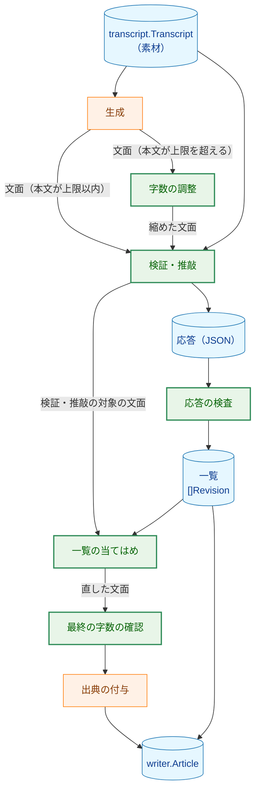

**Legend**

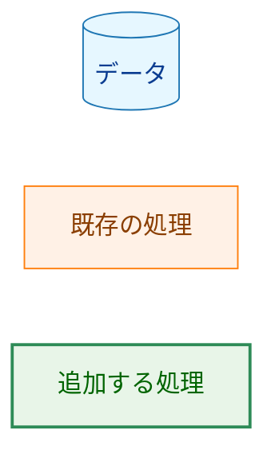

字数の調整には素材を渡さない（F-002）。検証・推敲には、文面と素材の両方を渡す（F-003）。段階を無効にした場合、その段階を飛ばして次へ進む。字数の調整を無効にした場合は、最終の字数の確認も行わない（F-005）。

### 1.3. 既存コードとの関係

| 既存のもの | 本設計での扱い |
|---|---|
| `writer.ArticleWriter`・`writer.New`（`internal/writer/writer.go:28-64`） | インタフェースは変えない。`Options` に 2 つの段階の設定を加え、`Write` の中で段階を呼ぶ（§3.1） |
| `writer.Article`（`writer.go:17-23`） | `Shorten`・`Review` のポインタのフィールドを加える。既存のフィールドの意味は変えない（`Model`・`ModelVersion` は生成のモデル）|
| 生成テキストの検査 `checkResponse`（`output.go:44-86`） | 本文側の規則を `checkGeneratedText` に取り出し、`checkResponse` はそれとモデル名の検査を順に呼ぶ形で残す（§3.6）。規則と検査の順序は変えない |
| テンプレートの読み込みと検査（`template.go:81-156`）、展開（`prompt.go:100-114`） | データ型を型引数に取る形に一般化する（§3.4）。現在は参照できるフィールドが `templateData` に固定されている（`template.go:315-324` の `checkField`）|
| `prompts` パッケージ（`prompts/prompts.go`） | 2 つの段階の既定のテンプレート 4 つを埋め込み、取り出す関数を加える |
| `internal/strictjson` | 宣言したキー以外を拒否する `Object.CollectOnly` と、真偽値を取り出す `Value.AsBool` を加える（§3.5.3、H-01）。既存の関数は変えない |
| `internal/config` | `YT2COLUMN_REVIEW_PROVIDER`・`YT2COLUMN_REVIEW_MODEL` を加える（§3.7）|
| `internal/llm/provider` | 検証・推敲の `LLMClient` を作る `NewReview` を加える（§3.7）|
| `internal/publisher` の `renderArticle`（`file.go:180-186`） | 段階のモデルの行を加える（§3.8）。`Shorten`・`Review` が nil なら出力は変わらない |
| `internal/publisher` の一時ファイルと `link(2)` による書き出し（`file.go:82-150`） | 書き出しの手順を内部の型に取り出し、一覧のファイルの書き出しにも使う（§3.8）|
| `internal/job` | 一覧のファイルの事前確認と、投稿の後の書き出しを行う（§3.9）|
| `cmd/yt2column` | フラグ、検証・推敲の `LLMClient` の構築、使い方の誤りの検査、要約と案内を加える（§3.9）|
| `internal/pipeline` | 変更しない。段階の失敗は、パイプラインの段「記事の生成」（`StageWrite`）の失敗として報告される |

**他のタスクの方針への例外。** 次の 3 つは、既存の設計書が定めた方針を、本タスクの要件に従って変える。

- **`Write` は `Generate` を 1 回だけ呼ぶ。** 方針の出典は、タスク 0004 の [02_architecture.md](../0004_article_writer/02_architecture.md) の図4（「`Generate` は 1 回だけ呼び、リトライしない（要件 F-003）」）と、同書のサイドエフェクト契約（「外部への影響は `LLMClient.Generate` の 1 回の呼び出しだけである」）である。本タスクでは、段階を有効にすると `Write` が生成・字数の調整・検証・推敲の LLM を合わせて最大 3 回呼ぶ（要件 F-001）。ただし、各段階の呼び出しは最大 1 回で、リトライはしない（この点は従来どおり）。それでも例外とするのは、0010 の要件が段階の追加そのものを求めているためである。`Options` のゼロ値では段階を行わず、`Article` は比較できるままなので、`Generate` が 1 回だけ呼ばれることやゼロ値の記事を確かめている既存のテスト（`internal/writer/writer_test.go`・`prompt_test.go`・`test_helpers.go:88`、`internal/job/job_test.go:184`・`:223`）は、変更せずに通る。CLI の統合テスト（`cmd/yt2column/integration_test.go:152` の `Generate` の回数が 1 であることの確認）は、`--no-shorten --no-review` を引数に加えて、段階を無効にした構成で実行する形に改める（§7.2）。
- **投稿する文字列の書式は、タイトル・モデル・モデルの版・本文で固定する。** 方針の出典は、タスク 0005 の [02_architecture.md](../0005_cli_assembly/02_architecture.md) §3.5（`--out` のファイルの書式）と、タスク 0006 の [02_architecture.md](../0006_slack_webhook_publisher/02_architecture.md) §3.4（`renderArticle` をファイルと Webhook で共有する）である。本タスクでは、段階のモデルの行を加える（AC-22）。`renderArticle` は共有されているので、追加の行はファイルと Webhook の両方の出力に加わる。0006 の §9 も、使用量の追記について同じ形を予告している。段階で LLM を呼ばなかった記事の出力は、従来と同じである（AC-19）。そのため、書式を確かめている既存のテスト（`internal/publisher/file_test.go`・`slack_message_test.go`、`internal/publisher/testutil/integration.go:166-170` の書式の写し）は、段階のない記事を使っている限り変更せずに通る。
- **プロバイダ固有の設定は、生成のプロバイダについてだけ読む。** 方針の出典は、タスク 0009 の [02_architecture.md](../0009_claude_llm_client/02_architecture.md) §3.2（プロバイダ固有の変数は「`cfg.provider` が自分のプロバイダのときだけ」読む）と §3.3（`newClient(provider, cfg, build)` が `cfg.Model()` を読む）である。0009 は承認済みで、まだ実装されていない。本タスクでは、生成と検証・推敲のどちらかが使うプロバイダの変数を読み、`newClient` はモデルを引数で受け取る（§3.7）。例外にするのは、要件 F-004 が、検証・推敲のプロバイダを生成と別に選べることと、プロバイダ固有の設定を共有することを求めているためである。0009 と本タスクのどちらを先に実装しても、§3.7 の形にそろえる。0009 の §3.3 が更新を予定している `internal/llm/provider/provider_test.go` の `newClient` のテスト（同書が引く 132 行目・178 行目）は、モデルを引数で渡す形に合わせる。

## 2. システム構成 (System Structure)

### 2.1. パッケージ構成

**図2 本設計で変更するパッケージと主な依存**。矢印 A → B は「A が B を import する」を表す。本設計に関わる import だけを示し、すべての import は示さない。ラベル「新規」の矢印は、本設計で加わる import である。

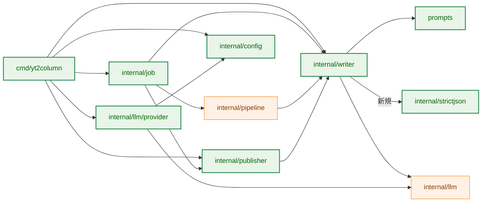

**Legend**

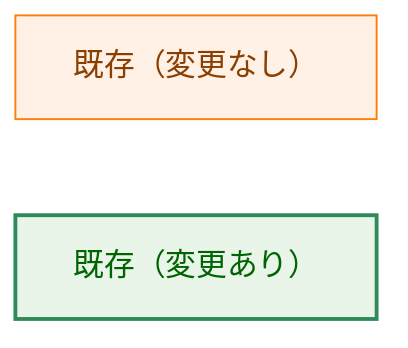

新しく加わる import は `internal/writer` → `internal/strictjson` だけである（検証・推敲の応答の検査に使う）。`internal/strictjson` は標準ライブラリにしか依存しないので、循環は生じない。

**図3 `internal/writer` の中のファイル構成**。

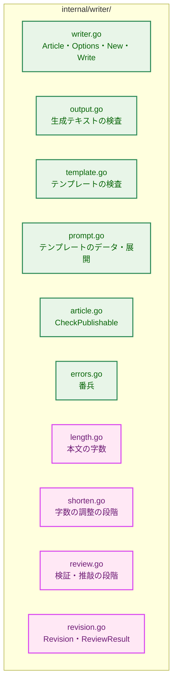

**Legend**

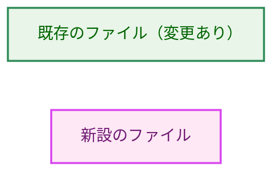

### 2.2. コンポーネント配置

| コンポーネント | 配置 | 責務 |
|---|---|---|
| 段階の順序の制御 | `internal/writer/writer.go`（`templateWriter.Write`） | 生成・字数の調整・検証・推敲・最終の字数の確認・出典の付与を、`Options` に従って順に呼ぶ |
| 本文の字数 | `internal/writer/length.go` | F-001 の数え方で本文の字数を数える。上限と目標の値を持つ |
| 字数の調整の段階 | `internal/writer/shorten.go` | プロンプトの展開、生成の `LLMClient` の呼び出し、生成テキストの検査 |
| 検証・推敲の段階 | `internal/writer/review.go` | プロンプトの展開、検証・推敲の `LLMClient` の呼び出し、応答の検査、当てはめ |
| 一覧の型 | `internal/writer/revision.go` | `Revision`・`ReviewResult` などの型と、その検査（`ReviewResult.Check`）|
| 既定のテンプレート | `prompts/` | 4 つのテンプレートを埋め込む |
| 検証・推敲のプロバイダとモデル | `internal/config`・`internal/llm/provider` | 環境変数の読み込みと、`LLMClient` の構築 |
| モデルの行・一覧のファイル | `internal/publisher` | 投稿する文字列にモデルの行を加える。一覧のファイルの組み立てと書き出し |
| 一覧のファイルの事前確認と書き出しの時機 | `internal/job` | 実行の前にパスを確かめ、投稿の成功の後に書き出す |
| フラグと案内 | `cmd/yt2column` | フラグの解析、組み合わせの検査、構築、要約と失敗の案内 |

### 2.3. データフロー（成功時）

**図4 `Write` の成功時のデータフロー（2 つの段階を有効にし、本文が上限を超えた場合）**。実線の矢印 `->>` は呼び出しを、点線の矢印 `-->>` は戻り値を表す。自分自身への矢印は `ArticleWriter` の内部の処理である。失敗時の分岐は §6.1 の図6 に示す。

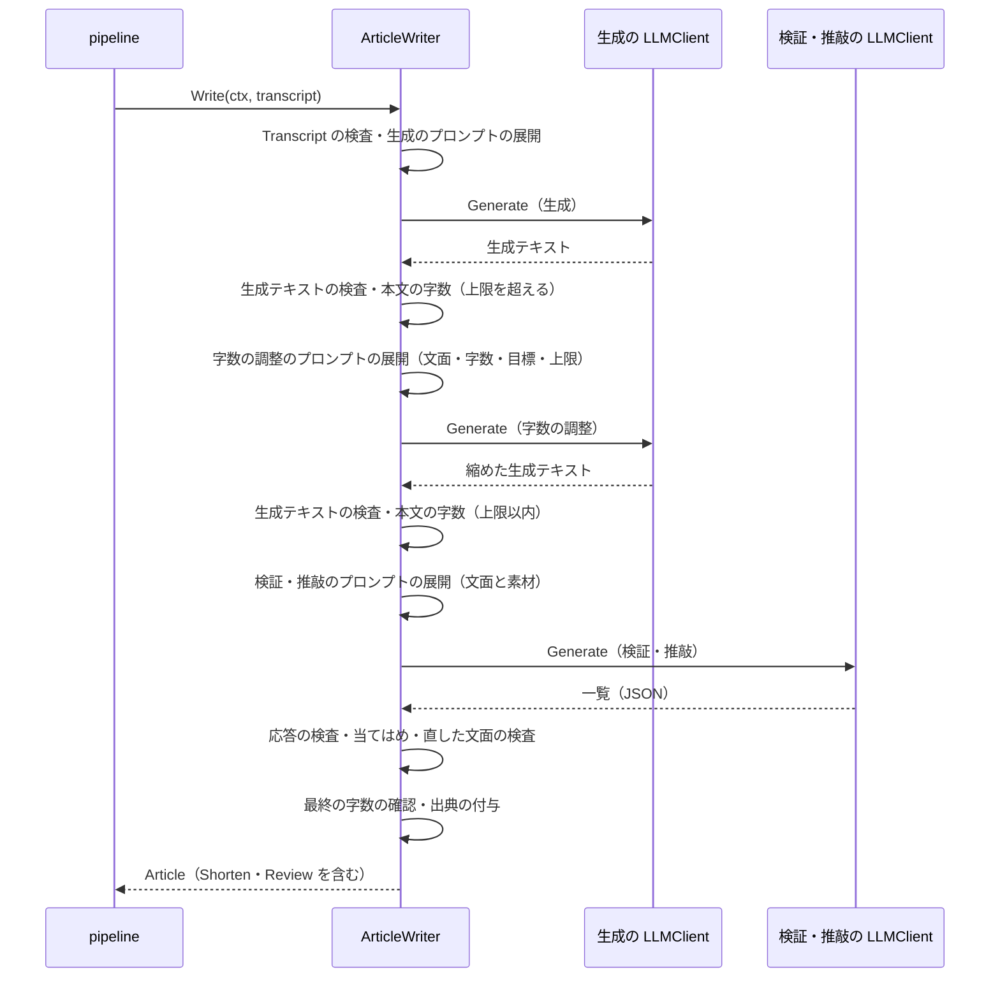

本文が上限以内なら、字数の調整の 3 つの手順（展開・`Generate`・検査）を飛ばす（AC-01）。

## 3. コンポーネント設計 (Component Design)

### 3.1. `writer.Options` と `writer.Article` の拡張

```go
package writer

// Options configures the ArticleWriter returned by New. The zero value
// generates the article only: neither post-generation step runs.
type Options struct {
	SystemTemplatePath string
	UserTemplatePath   string
	Shorten            ShortenOptions
	Review             ReviewOptions
}

// ShortenOptions configures the shorten step, which uses the generation
// LLMClient passed to New. Template paths follow the rule of
// Options.SystemTemplatePath: empty selects the embedded default.
type ShortenOptions struct {
	Enabled            bool
	SystemTemplatePath string
	UserTemplatePath   string
}

// ReviewOptions configures the review step. Client is required when Enabled
// is true and must be nil when it is false.
type ReviewOptions struct {
	Enabled            bool
	Client             llm.LLMClient
	SystemTemplatePath string
	UserTemplatePath   string
}

// Article is the generated column article. It stays comparable with ==:
// the step results are pointers, nil when the step called no LLM.
type Article struct {
	Title        string
	Body         string // Markdown
	SourceURL    string
	Model        string // the generation model
	ModelVersion string // opaque, provider-defined; empty when the provider reports none
	Shorten      *StepModel    // nil when the shorten step called no LLM
	Review       *ReviewResult // nil when the review step did not run
}

// StepModel is the model one step's LLM call reported.
type StepModel struct {
	Model        string
	ModelVersion string // empty when the provider reports none
}
```

`ReviewResult` と `Revision` は §3.5.2 に示す。

- **`New` の検査。** `New` は次の組み合わせを拒否する。エラーは番兵を持たない非公開のエラーで、CLI は使い方の誤りとして報告する。
  - `Review.Enabled` が真で `Client` が nil（型付きの nil を含む。既存の `nilcheck.IsNil` を使う）
  - `Review.Enabled` が偽で `Client` が nil でない
  - 段階が無効なのに、その段階のテンプレートのパスが空でない

  無効な段階の設定を黙って無視しないためである（CLAUDE.md「Reject, don't normalize」）。段階が有効なら、`New` はその段階のテンプレートを読み込んで検査する。無効な段階のテンプレートは読まない。
- **`Shorten` が nil でないのは、字数の調整の LLM を呼んだときだけである。** 字数の調整の段階を有効にしていても、本文が上限以内なら LLM を呼ばないので、`Shorten` は nil のままである（AC-22「呼ばなかった段階の行は書かない」）。
- **`Review` が nil でないのは、検証・推敲の段階を行ったときだけである。** 直す箇所がなければ、`Review.Revisions` は空である。検証・推敲を行ったかどうかを、一覧が空かどうかから推測しない。
- **ポインタにする理由。** `Article` の既存のテストは、ゼロ値との比較（`test_helpers.go:88` の `a != (Article{})` など、§1.3）に `==` を使っている。スライスのフィールド、またはスライスを含む構造体の値のフィールドを加えると、`Article` は比較できなくなり、これらのテストがコンパイルできなくなる（AC-27 に反する）。ポインタのフィールドは比較でき、ゼロ値は nil である。`Write` が返す `Article` の `Shorten`・`Review` は、その呼び出しの中で作った値を指し、他の記事と共有しない。投稿・書き出しの処理は記事を変更しない（既存の `Publisher` の方針）。
- **`CheckPublishable` の拡張。** `Shorten` と `Review` が nil でなければ、その `Model` が既存の表示用の文字列の規則（`output.go:120-129` の `displayStringProblem`）を満たすこと、`ModelVersion` が空か同じ規則を満たすことを確かめる。これらの値は投稿する文字列のモデルの行に入るので、生成の `Model` と同じく端末の制御文字を拒否する必要がある。`Review` が nil でなければ、`ReviewResult.Check`（§3.5.2）も呼ぶ。

### 3.2. 段階の順序

`templateWriter.Write` は次の順に進む。どこかで失敗したら以降へ進まず、ゼロ値の `Article` とエラーを返す。

1. 既存の生成（`writer.go:71-95`）。`Transcript` の検査、2 つのテンプレートの展開、`Generate`、生成テキストの検査。
2. 字数の調整（`Shorten.Enabled` のとき）。本文の字数が上限を超えていれば、字数の調整の段階を呼ぶ（§3.3）。上限以内なら何もしない。
3. 検証・推敲（`Review.Enabled` のとき）。字数の調整の後の文面について、検証・推敲の段階を呼ぶ（§3.5）。
4. 最終の字数の確認（`Shorten.Enabled` のとき）。この時点の本文の字数が上限を超えていれば `ErrTooLong` を返す（AC-07）。
5. 出典の付与と `Article` の組み立て（既存の `newArticle`、`output.go:133-141`）。`Shorten` と `Review` を加える。

各段階の `Generate` の直前に `ctx.Err()` を確かめ、キャンセルや期限切れなら、その段階の LLM を呼ばずにエラーを返す（AC-25）。既存の生成の前の確認（`writer.go:72-74`）と同じ形である。

段階の間で受け渡すのは文面、すなわちタイトル（`checkResponse` が返す、前後の空白を除いたタイトル）と本文の部分（タイトルの行の後の全体を `normalizeBody` に通したもの。出典のブロックは含まない）の組である。

### 3.3. 本文の字数と字数の調整の段階

**本文の字数**は、本文の部分のコードポイントの数から `\n` の数を引いたものとする（F-001）。本文の部分は `normalizeBody` を通しているので `\r` を含まない（`output.go:95-97`）。Markdown の記号と空白は数える。これは 0008 の `check_article.py` の数え方（同ファイル 111 行目の `len(body.replace("\r", "").replace("\n", ""))`）と同じである。上限は定数 `maxBodyChars = 4000` とし、字数が上限と等しければ上限以内とする（AC-04）。

**目標の字数**として、定数 `targetBodyChars = 3600` を別に持つ。字数の調整のテンプレートには上限と目標の両方を渡し、目標まで縮めるよう指示する。上限そのものを目標にしないのは、次の 2 つの理由による。

- LLM は字数を正確に数えられない。0008 では、4,000 字を上限と指示しても 4,743〜6,349 字の本文が返った（要件 §1）。
- 縮めた後の検証・推敲の段階で、言い換えにより本文が少し長くなりうる。最終の字数の確認（AC-07）で失敗しにくくするため、余裕を残す。

検査は上限（4,000）だけで行い、目標を下回ることは求めない。目標の値は評価（F-008）で見直す。

**字数の調整の段階**は、次のことを行う。

- 文面と字数から、字数の調整のテンプレートを展開する。テンプレートで参照できる値は §3.4 の `shortenTemplateData` だけで、字幕・概要欄・動画タイトル・チャンネル名は含まない（AC-05）。
- `New` に渡された生成の `LLMClient` の `Generate` を 1 回呼ぶ（AC-08）。`MaxOutputTokens` は生成と同じく 0（プロバイダの既定）とする。
- 生成テキストを、生成と同じ検査（§3.6 の `checkResponse`）に通す（AC-03）。
- 縮めた後の本文の字数がなお上限を超えていれば、`ErrTooLong` を返す（AC-06）。検証・推敲の段階は呼ばない。
- 成功したら、応答のモデル名とモデルの版を `Shorten` に記録する。

縮めた文面のタイトルは、LLM が返したものを使う。要件は字数の調整の生成テキストを生成と同じ形とし、タイトルの変更を禁じていないためである。

### 3.4. テンプレート

2 つの段階は、それぞれ system と user の 2 つのテンプレートを持つ。既定の文言は `prompts/` に置いて埋め込み、ファイルで上書きできる（F-005）。

| テンプレート | テンプレートの名前 | 既定のファイル | 上書きのフラグ | データ型 |
|---|---|---|---|---|
| 生成 | `system`・`user`（既存） | `prompts/system.tmpl`・`user.tmpl`（既存） | `--system-prompt`・`--user-prompt`（既存） | `templateData`（既存） |
| 字数の調整 | `shorten-system`・`shorten-user` | `prompts/shorten_system.tmpl`・`shorten_user.tmpl` | `--shorten-system-prompt`・`--shorten-user-prompt` | `shortenTemplateData` |
| 検証・推敲 | `review-system`・`review-user` | `prompts/review_system.tmpl`・`review_user.tmpl` | `--review-system-prompt`・`--review-user-prompt` | `reviewTemplateData` |

テンプレートの名前は、既存のテンプレートの名前と同じく、エラーのメッセージに現れる（`template.go:72-77` の `templateSource.String`、`text/template` 自身のエラー）。6 つの名前を分けるのは、規則に反する上書きファイルがどのフラグのものかを、メッセージから分かるようにするためである。

```go
package writer

// checkedTemplate is a template that passed the checks for data type T.
// It can only be built by parseTemplate[T] and only executed with a T, so a
// template checked against one data type is never executed with another.
type checkedTemplate[T any] struct {
	tmpl *template.Template
}

// shortenTemplateData is the only value passed to a shorten template.
type shortenTemplateData struct {
	ArticleTitle    string // the title of the text to shorten
	ArticleBody     string // its body part, without the source block
	BodyChars       int    // the body length counted as in F-001
	TargetBodyChars int    // targetBodyChars, 3600
	MaxBodyChars    int    // maxBodyChars, 4000
}

// reviewTemplateData is the only value passed to a review template. The
// material is the generation's templateData itself, so the review prompt
// embeds the same transcript string as the generation prompt.
type reviewTemplateData struct {
	templateData        // Title, ChannelName, Description, Transcript
	ArticleTitle string // the title of the text to review
	ArticleBody  string // its body part, without the source block
}
```

- **検査の規則は 3 組で同じにする（AC-23）。** 既存の検査（`parseTemplate`、`template.go:134-156`）を、データ型を型引数に取る `parseTemplate[T]` に改める。参照できるフィールドは型引数 `T` から取る（現在の `checkField` は `templateData` に固定。`template.go:315-324`）。サイズ・UTF-8・空白だけの内容・`define`/`block`・構文と関数の allowlist の規則は共有し、違うのは参照できるフィールドの集合だけである。展開は `checkedTemplate[T]` のメソッドとし、引数の型は `T` に限る。展開後の上限（1 MiB）と空白だけのプロンプトの拒否（`prompt.go:100-114`）は変えない。`template_test.go`・`prompt_test.go` の `parseTemplate`・`expand` の呼び出し（`template_test.go:404`・`:426` など）は、型引数を付ける形に機械的に改める。テストの期待は変えない。
- **データ型を分ける理由。** 3 組で 1 つの型を共有すると、生成のテンプレートが `.ArticleBody`（生成の時点では空）を参照できてしまい、字数の調整のテンプレートが `.Transcript` を参照して字幕を LLM に渡せてしまう（AC-05 に反する）。データ型を分ければ、構築時の検査がこれらの参照を拒否し、`checkedTemplate[T]` が別の型での展開をコンパイル時に防ぐ。
- **`reviewTemplateData` は `templateData` を埋め込む。** 埋め込んだ型のフィールドは外側の型から直接参照できるので、テンプレートからは `.Title`・`.ChannelName`・`.Description`・`.Transcript` として参照できる。埋め込みのフィールド名（`templateData`）は非公開なので、`.templateData` という参照は既存の規則（公開されたフィールドだけを認める）で拒否される。素材の値は、生成のプロンプトに使った `templateData` の値そのものを入れる。そのため、検証・推敲のプロンプトの字幕は、生成のプロンプトの字幕と同一の値になる（AC-09）。`.Title` は動画タイトル、`.ArticleTitle` は検証・推敲の対象のタイトルである。取り違えを防ぐため、`prompts/README.md` の表に両方を並べて書く。
- **数のフィールド。** `shortenTemplateData` の 3 つの数は、テンプレートで参照できる初めての数の値である。既存の規則は、構築時に関数に渡す値の型を確かめない（`prompts/README.md`「構築時の検査は、関数に渡す値の型を確かめない」）。そのため、`{{len .MaxBodyChars}}` のような型の合わない記述は、構築時ではなく展開時に `ErrInvalidTemplate` で失敗する。字数の調整のテンプレートの展開は生成の LLM を呼んだ後なので、この失敗は生成の呼び出しを無駄にする。既存の生成のテンプレートの `{{index .Title 100}}` と同じ種類の失敗であり、上書きファイルを書く利用者の誤りなので、新たな検査は設けない。埋め込まれた既定のテンプレートについては、テストで展開まで確かめる。
- **既定のテンプレートの区画。** 埋め込む文面と素材は、生成の user テンプレート（`prompts/user.tmpl`）と同じく見出しで区画を分け、区画の中の文章を指示として扱わないよう書く（要件 §4.2、[security.md](../../dev/security.md) §6）。検証・推敲の system テンプレートには、次のことを書く。
  - §3.5.3 の応答の形（JSON のキーと理由の種類の値）
  - F-003 の直す範囲の制限
  - 「直す前の記述」は、文面の中で 1 か所に決まるだけの長さを引用すること
  - 直した後の記述の長さを、直す前と大きく変えないこと

  具体的な文言は実装計画で決め、評価（F-008）で調整する。
- **埋め込みのテスト。** 既存のテスト（埋め込まれた既定のテンプレートが検査を通ること）を、4 つの新しいテンプレートにも広げる（AC-23 の後半）。
- `prompts/README.md` に、2 つの段階のテンプレートと、それぞれで参照できる値の表を加える。

### 3.5. 検証・推敲の段階と一覧

#### 3.5.1. 段階の処理

- 文面と素材から、検証・推敲のテンプレートを展開する（AC-09）。
- `ReviewOptions.Client` の `Generate` を 1 回呼ぶ。`MaxOutputTokens` は 0（プロバイダの既定）とする。
- 応答を §3.5.3 の規則で検査して一覧にし、応答のモデル名とモデルの版を `checkModelString`（`output.go:101-111`）で検査する。
- 一覧を §3.5.4 の規則で文面の文字列に当てはめ、結果を `checkGeneratedText` で検査する（AC-03）。
- 成功したら、`Review` にモデル名・モデルの版と一覧を記録する。一覧が空なら文面は変えない（AC-11）。

**応答の大きさの見込み。** 1 項目は 3 つの引用（直す前・直した後・根拠）を持つ。0008 の評価では、直すべき箇所は記事 1 本につき数か所だった（要件 §1）。10 項目でも出力は数千トークンであり、記事を書く生成の出力より小さい。`MaxOutputTokens` は生成と同じくプロバイダの既定に任せる（DeepSeek アダプタは 0 のとき `max_tokens` を送らない。`internal/llm/deepseek/request.go:38-49`）。打ち切られた応答は `llm.ErrTruncated` で失敗する（F-006）。評価では、打ち切りを失敗の種類の 1 つとして記録する（§5.4）。

#### 3.5.2. 一覧の型

```go
package writer

// ReviewResult is what the review step recorded.
type ReviewResult struct {
	Model     StepModel
	Revisions []Revision // in response order; empty when nothing was revised
}

// Check reports whether r could have come from an accepted review response:
// Model passes the display-string rules, there are at most maxRevisions
// revisions, and every revision has a known Action and Reason, a non-empty
// Before, an After that is non-empty exactly when Action is ActionReplace,
// an Evidence that is not whitespace only, and no character that the
// response rules of each value reject. It wraps ErrInvalidReview and never
// puts a field value in the error.
func (r ReviewResult) Check() error

// Revision is one entry of the review list.
type Revision struct {
	Before   string // verbatim quote of the reviewed text
	Action   RevisionAction
	After    string // the replacement; empty exactly when Action is ActionDelete
	Reason   RevisionReason
	Evidence string // the quoted source material
}

// RevisionAction is what a revision does. The zero value is ActionUnknown,
// which Check rejects.
type RevisionAction int

const (
	ActionUnknown RevisionAction = iota
	ActionReplace
	ActionDelete
)

// RevisionReason is the kind of problem a revision fixes. The zero value is
// ReasonUnknown, which Check rejects.
type RevisionReason int

const (
	ReasonUnknown        RevisionReason = iota
	ReasonUnsupported                   // "unsupported": no basis in the material
	ReasonMeaningChange                 // "meaning_change": a paraphrase or omission that changes the meaning
	ReasonSpeaker                       // "speaker": a wrong speaker attribution
	ReasonMisrecognition                // "misrecognition": a copied speech-recognition error
	ReasonUnintelligible                // "unintelligible": a sentence whose meaning cannot be made out
)

// WireValue returns the response value of r ("unsupported", ...) and true,
// or "" and false for ReasonUnknown and values outside the enumeration.
func (r RevisionReason) WireValue() (string, bool)
```

- **不変条件の検査は `ReviewResult.Check` に集める。** `Article` と `Revision` のフィールドは公開されており、`templateWriter` を通さずに作れる。そのため、一覧のファイルに端末の制御文字が入らないことを、値の作り手に頼らずに保証する。`Check` は、応答の解析が受理した一覧なら必ず通る条件だけを確かめ、`CheckPublishable`（§3.1）と一覧のファイルの書き出し（§3.8）の両方が呼ぶ。`templateWriter` が作る `ReviewResult` は解析の規則を通っているので、`Check` は実際の実行では必ず通る。`Check` は、テストや別の呼び出し元が作った値に対する防御である。
- **列挙の外の値は補正せず拒否する。** `RevisionReason.WireValue` は列挙の外の値について偽を返し、代わりの文字列を作らない。応答の値から `RevisionReason` への変換と `WireValue` は同じ対応表を使う（値の綴りを 1 か所に置く）。
- `ErrInvalidReview` は `internal/writer/errors.go` に加える番兵である（§4.1）。

#### 3.5.3. 応答の形と受理の規則（H-01）

応答は、次の形の JSON のオブジェクト 1 つだけからなる。

```json
{
  "revisions": [
    {"before": "…", "after": "…", "reason": "meaning_change", "evidence": "…"},
    {"before": "…", "delete": true, "reason": "unsupported", "evidence": "…"}
  ]
}
```

| 要素 | JSON での表し方 | 規則 |
|---|---|---|
| 一覧 | トップレベルのオブジェクトの `revisions`（配列） | トップレベルのオブジェクトのキーは `revisions` だけ。配列の要素はすべてオブジェクト。要素の数は 0 以上 `maxRevisions` 以下 |
| 直す前の記述 | `before`（文字列） | 必須。空でない。`\n`・`\r` を含まない |
| 直した後の記述 | `after`（文字列） | `after` と `delete` のうち、ちょうど一方を必ず持つ。`after` は空でない。`\n`・`\r` を含まない |
| 削ったことを示す印 | `delete`（真偽値） | 値は `true` だけを受理する。`false` は拒否する |
| 理由の種類 | `reason`（文字列） | `unsupported`・`meaning_change`・`speaker`・`misrecognition`・`unintelligible` のいずれかと完全に一致する。大文字小文字の違いや前後の空白は拒否する |
| 根拠の箇所 | `evidence`（文字列） | 必須。空白だけでない。`\r` を含まない（`\n` は認める） |

- **大きさの上限は、解析の前に検査する。** 検証・推敲の段階は、`strictjson.ParseObject` を呼ぶ前に、応答の長さが `maxTextBytes`（1 MiB、`output.go:14`）以下であることを確かめる。生成テキストの上限と同じ定数をそのまま使い、新しい定数は作らない。`ParseObject`（`internal/strictjson/strictjson.go:65-78`）自体は大きさを検査しない。応答は文面と字幕の引用を含みうるので、文面より小さい上限は置かない。
- **全体の規則。** 正しい UTF-8 であること、対になっていないサロゲートのエスケープを含まないこと、JSON の値 1 つで後に内容が続かないこと、トップレベルがオブジェクトであることは、`ParseObject` が既に検査する（`strictjson.go:65-78`）。
- **項目の数の上限。** `maxRevisions` は 256 とし、`AsArray`（`strictjson.go:203-230`）が配列を分けた後に、検証・推敲の段階が数を確かめる。`AsArray` 自身の上限（`maxArrayElements`、131,072）はこれより大きいが、応答全体が 1 MiB 以下なので、分割される要素の数とメモリは上限に収まる。256 は、直す箇所が記事 1 本につき数か所だった 0008 の評価（要件 §1）に対して十分に大きい。4,000 字の本文で 256 か所を超えて直す応答は、指示に従っていないとみなす。
- **未知のキーと重複したキーの拒否。** 既存の `Object.Collect`（`strictjson.go:83-95`）は、指定しなかったキー（その重複を含む）を無視する。これに代えて、`strictjson` に `Object.CollectOnly(keys ...string)` を加える。
  - `CollectOnly` は、指定したキーの重複に加えて、指定しなかったキーが 1 つでもあれば拒否する。
  - 指定したキーがすべて揃うことは求めない。`after` と `delete` のように、一方だけが現れるキーがあるためである。必須のキーは、既存の `Required`・`RequiredString` で確かめる。
  - トップレベルのオブジェクトと、一覧の各項目の検査に使う。
  - `Collect` の振る舞いは変えないので、既存の呼び出し元（`internal/transcript`・`internal/llm/deepseek`）に影響しない。

  H-01 の候補のうち「項目のメンバーの数と消費したキーの数を比べる」方法を採らないのは、`Object` のメンバーが非公開で数を取れないためである。数を公開すると、呼び出し元ごとに比べる処理を書くことになり、比べ忘れる余地が残る。拒否を `strictjson` の中で完結させれば、その余地がない。
- **キーをエラーに含めない。** `CollectOnly` のエラーは、破られた規則（未知のキーがある、キーが重複している）だけを示し、キーの文字列を含めない。キーは LLM が書いた値であり、長さにも上限がないためである。既存の `Collect` は重複したキーを `%q` で示すが（`strictjson.go:90`）、`CollectOnly` はこの形を取らない。
- **真偽値と、削除を表す形。** `strictjson` に `Value.AsBool` を加え、`true`・`false` 以外（`null`・文字列の `"true"`・数）を拒否する。削除を `delete: true` で表すのは、要件が「直した後の記述または削ったことを示す印」を 1 つの要素として定めるためである。他の形は次の理由で採らない。
  - `"after": ""` を削除とみなす形: 空の値に意味を持たせることになり、LLM が書き損じた空の値と、削除の指示を区別できない。
  - `"action": "delete"` を加える形: 項目の要素が 5 つになり、要件の 4 つの要素と合わない。
- **制御文字。** 4 つの文字列は、上の表の改行の規則に加えて、タブ以外の制御文字（Unicode の Cc）を含まない。ただし `evidence` の `\n` は認める。要件は改行だけを挙げるが、制御文字を含む本文は `CheckPublishable` が投稿の時点で拒否する（`internal/writer/article.go:30-34`）。そのため、検証・推敲の段階で拒否しても、最終的に受理される記事は変わらない。拒否を早めるのは、制御文字が一覧のファイル（§3.8）に入って、ファイルを表示する端末を操作することを防ぐためである。
- **拒否の番兵。** どの規則に反しても `ErrMalformedOutput` を包んだエラーを返し、部分的な一覧を返さない（AC-12）。エラーのメッセージは、破られた規則と項目の番号（`revisions[3]`）を示し、応答の値を含めない（§4.2）。既存の生成テキストの検査と同じ方針である（`output.go:39-43`）。
- **コードフェンスで囲んだ応答は拒否する。** LLM が JSON を `` ```json `` で囲んで返すことがある。囲みを取り除いて受理すると、囲みの外の文章を黙って捨てることになる（F-003「黙って修復、破棄、無視すれば受理できてしまう入力は、受理せず拒否する」）。テンプレートで JSON だけを返すよう指示し、拒否の頻度は評価で記録する（§5.4）。

#### 3.5.4. 当てはめの規則

当てはめの対象は文面の文字列（§3.2）である。出典のブロックは含まない。

1. **出現の数。** 各項目の `before` が文面の文字列の中に現れる回数は、重なり合う出現も数える（`before` が `ああ` なら、`あああ` には 2 回現れる）。出現が 0 回または 2 回以上の項目があれば、一覧全体を拒否する（AC-13）。位置はバイトの位置で扱う。正しい UTF-8 の文字列の中で正しい UTF-8 の文字列が一致する位置は、必ず文字の境界にある（UTF-8 の符号化の性質）ので、文字の途中で分けることはない。
2. **重なり。** 各項目の出現の範囲（開始の位置から `before` の長さの分）について、どの 2 つの範囲でも 1 バイトでも共有していれば、一覧全体を拒否する（AC-13）。範囲が接するだけ（一方の範囲の終わりと他方の範囲の始まりが同じ位置）なら重なりとしない。同じ `before` を持つ 2 つの項目は、範囲が一致するので重なりとして拒否される。
3. **置き換え。** 各範囲を、元の文面の文字列の上で `after` に置き換える（`ActionDelete` なら取り除く）。範囲は元の文面の文字列の上で決まるので、ある項目が入れた文字列を別の項目が探したり置き換えたりすることはなく、結果は項目の順序によらない（AC-10 の `甲乙` の例は `乙丙` になる）。
4. **見出し。** 当てはめる前と後の文面の文字列のそれぞれについて、`## ` で始まる行を出現順に並べたものを取り、2 つの列が数・文言・順序のすべてで一致しなければ一覧全体を拒否する（AC-14）。
   - 見出し行の中に `before` がある項目と、行頭を `## ` で始まる形に変える項目は、この規則で拒否される。
   - コードフェンスの中の `## ` で始まる行も、見出しとして数える。フェンスの判定を持ち込まずに要件の文言どおりに比べるためで、比べる行が増える分だけ拒否が厳しくなる側に倒れる。
   - 拒否のメッセージは、一致しなくなった最初の見出しの番号を示す。
5. **直した文面の検査。** 当てはめた後の文面の文字列を `checkGeneratedText` に通し、タイトルと本文の部分に分ける（AC-03）。タイトルの行の中の項目は受理し、置き換えた後のタイトルを使う（AC-14）。`before` が行頭の `# ` を含み、置き換えの結果、タイトルの行が `# ` で始まらなくなった場合などは、ここで拒否される。

改行を含む `before`・`after` は §3.5.3 の解析の時点で拒否されているので、当てはめは行の数と行の区切りを変えない。

**計算量。** 出現の数は「0 回・1 回・2 回以上」の区別だけが要るので、探索は項目ごとに文面の文字列の長さに比例する時間で終わる。項目は 256 以下、応答は 1 MiB 以下なので、`--no-shorten` で長い文面を検証・推敲する場合でも、LLM の呼び出し（数十秒）に比べて無視できる（CLAUDE.md「Performance」）。

### 3.6. 生成テキストの検査の分割

既存の `checkResponse`（`output.go:44-86`）は、生成テキストの規則（サイズ、UTF-8、タイトルの行、本文、Markdown）と、モデル名・モデルの版の規則を続けて検査する。前半を次の関数に取り出す。

- `checkGeneratedText(text string) (title, body string, err error)`: 生成テキストの規則。一覧を当てはめた文面の文字列に使う。

`checkResponse` は、`checkGeneratedText` と `checkModelString`（既存、`output.go:101-111`）を順に呼ぶ形で残し、生成と字数の調整の応答に使う。規則と検査の順序は変えないので、`checkResponse` を通して規則を確かめている既存の `output_test.go` は変更せずに通る。検証・推敲の段階は、応答のテキストが文面ではないので、`checkResponse` を使わず、応答の検査（§3.5.3）と `checkModelString` を使う。

### 3.7. 検証・推敲のプロバイダとモデルの設定

```go
package config

// ReviewProvider returns the provider of the review step. It equals
// Provider() when YT2COLUMN_REVIEW_PROVIDER is unset.
func (c Config) ReviewProvider() Provider

// ReviewModel returns the model name of the review step. It is non-empty.
// It equals Model() when both YT2COLUMN_REVIEW_PROVIDER and
// YT2COLUMN_REVIEW_MODEL are unset.
func (c Config) ReviewModel() string
```

```go
package provider

// New builds the generation LLMClient from cfg.Provider() and cfg.Model().
// Its signature is unchanged.
func New(cfg config.Config) (llm.LLMClient, error)

// NewReview builds the review LLMClient from cfg.ReviewProvider() and
// cfg.ReviewModel(). It never reads environment variables.
func NewReview(cfg config.Config) (llm.LLMClient, error)
```

| `YT2COLUMN_REVIEW_PROVIDER` | `YT2COLUMN_REVIEW_MODEL` | 検証・推敲のプロバイダ | 検証・推敲のモデル | 根拠 |
|---|---|---|---|---|
| 未設定 | 未設定 | 生成と同じ | `YT2COLUMN_MODEL` | AC-15 |
| 未設定 | 設定 | 生成と同じ | `YT2COLUMN_REVIEW_MODEL` | AC-18 |
| 正しい値 | 設定 | `YT2COLUMN_REVIEW_PROVIDER` | `YT2COLUMN_REVIEW_MODEL` | AC-16 |
| 正しい値 | 未設定 | — | — | `ErrMissing`（`YT2COLUMN_REVIEW_MODEL`）。AC-17 |
| 不正な値 | — | — | — | `ErrInvalid`。理由は固定の文字列で、値を含まない。AC-17 |
| 空 | — | — | — | `ErrMissing`（空の値はエラー。0009 の F-006） |
| — | 空 | — | — | `ErrMissing` |

- **値の解釈は生成と共有する。** `YT2COLUMN_REVIEW_PROVIDER` の受理する値と拒否の理由は、`YT2COLUMN_LLM_PROVIDER` と同じである（現在は `deepseek` だけ。`internal/config/config.go:173-187`）。文字列から `Provider` への変換を 1 つの関数にまとめ、両方の読み込みから使う。0009 で `claude` が加わると、両方で受理される。
- **プロバイダ固有の設定は、使うプロバイダのものをすべて読む。** あるプロバイダの固有の変数は、生成と検証・推敲のどちらかがそのプロバイダを使うときに読み、そのプロバイダの規則で検査する。
  - DeepSeek: `DEEPSEEK_API_KEY`（必須）
  - 0009 の後の Claude: `ANTHROPIC_API_KEY`（必須）・`YT2COLUMN_CLAUDE_EFFORT`（必須）・`ANTHROPIC_WORKSPACE_ID`（任意）

  どちらも使わないプロバイダの変数は読まず、検査もしない（0009 の F-006）。現在の `loadAPIKey`（`config.go:202-222`）は生成のプロバイダだけを見ているので、この形に改める（AC-16）。0009 の設計（同書 §3.2）の「`cfg.provider` が自分のプロバイダのときだけ読む」も、0009 を後に実装する場合は同じ形にする（§1.3 の例外）。
- **プロバイダ固有の設定は、生成と検証・推敲で共有する。** 要件 F-004 は「API キーなどのプロバイダ固有の設定は、プロバイダごとの既存の環境変数を共有する」と定める。そのため、生成と検証・推敲がどちらも Claude を使う場合、`YT2COLUMN_CLAUDE_EFFORT` の値は両方に使われる。検証・推敲専用の effort の変数は設けない。
- **読み込みの順序。** 検証・推敲のプロバイダとモデルは、生成のプロバイダとモデルの読み込みの後、プロバイダ固有の変数の読み込みの前に読む。既定の値に生成の設定を使い、プロバイダ固有の変数を読むかどうかの判定に検証・推敲のプロバイダを使うためである。拒否は既存の `Load` と同じく `errors.Join` でまとめる。
- **`--no-review` を指定しても、検証・推敲の設定は検査する。** `config.Load` はフラグを知らないためである。検証・推敲の変数を設定していなければ、従来と同じ設定で読み込みが通る（AC-19）。検証・推敲のプロバイダを生成と別にした環境では、`--no-review` を指定しても、そのプロバイダの固有の変数が必要である。README にこのことを書く。
- **内部の構築関数。** `New` と `NewReview` は、同じ内部の関数 `newClient(provider config.Provider, model string, cfg config.Config, build …)` を呼ぶ。プロバイダとモデルは引数で受け取り、プロバイダ固有の他の値は、プロバイダごとの既存の `Config` のアクセサから読む（DeepSeek は `cfg.DeepSeekAPIKey()`、0009 の後の Claude は `cfg.AnthropicAPIKey()`・`cfg.ClaudeEffort()`・`cfg.AnthropicWorkspaceID()`）。プロバイダ固有の値は、生成と検証・推敲のどちらかがそのプロバイダを使えば `Config` に保持される（前の項目）ので、検証・推敲専用のアクセサは要らない。現在の `newClient`（`internal/llm/provider/provider.go:37`）は、API キーとモデルを引数に取っている。これを上の形に改め、`provider_test.go` の `newClient` の呼び出しを合わせる。0009 の設計（同書 §3.3）の `newClient(provider, cfg, build)` は `cfg.Model()` を読むが、どちらを先に実装しても、モデルを引数で受け取る上の形にする（§1.3 の例外）。タイムアウトは既存の `LLMTimeout`（15 分）を共有する。
- **出力の伏せ字化。** CLI は、設定された秘密情報を標準エラー出力・ファイルに書く前に伏せる（`cmd/yt2column/run.go:474-486` の `configuredSecrets`）。検証・推敲のプロバイダだけが使う API キーも `Config` に保持されるので、`configuredSecrets` が返す一覧に入る。0009 の設計（同書 §5.2）が `cfg.AnthropicAPIKey()` を加える際も、生成のプロバイダによらず、保持されていれば加える。

### 3.8. 出力（`internal/publisher`）

**モデルの行（AC-22）。** `renderArticle`（`internal/publisher/file.go:180-186`）は、既存の 2 行の後に、字数の調整（`Shorten` が nil でないとき）と検証・推敲（`Review` が nil でないとき）のモデルの行を、この順に加える。

```text
# <Title>

- Model: <Model>
- Model version: <ModelVersion または (none)>
- Shorten model: <Shorten.Model>
- Shorten model version: <Shorten.ModelVersion または (none)>
- Review model: <Review.Model.Model>
- Review model version: <Review.Model.ModelVersion または (none)>

<Body>
```

- 生成の行の文言（`- Model:`）は変えない。段階で LLM を呼ばなかった記事の出力を、従来と同じにするためである（AC-19）。段階の行には段階の名前を前置して、どの段階のものか分かるようにする。
- Go の文字列リテラルは英語とする規則（CLAUDE.md「Go Idioms」）に従い、行の見出しは英語である。`(none)` への置き換えは、生成の行と段階の行で 1 つの関数を共有する。
- 投稿する文字列の検査（`internal/publisher/slack_message.go:25-50` の `prepareSlackMessages`）は、`renderArticle` の結果全体についてメンションの記法を探すので、段階のモデル名も自動的に対象になる。UTF-8 の確認（`slack_message.go:29`）の対象には、段階のモデル名とモデルの版を加える。
- **対象クライアント環境（Mattermost）。** 追加の行は、既存のモデルの行と同じ Markdown の箇条書きであり、Webhook の新しい機能（Block Kit の要素など）を使わない。既存の書式は 0006 で Mattermost での表示を確かめている。新たな確認は要らない。

**書き出しの手順の共有。** 一時ファイルへの書き出し、ディスクへの同期（fsync）、`link(2)` による上書きしない作成（`file.go:82-150`）を、非公開の型 `atomicFile` に取り出す。`atomicFile` は次のものを持つ。

- 出力先のパス
- 一時ファイルの名前の接頭辞
- テスト用の差し替え口（現在 `FilePublisher` のフィールドにある `wrapWriter` と `link`。`file.go:50-51`）

`FilePublisher` と、次の `ReviewLogWriter` の両方がこれを使う。`FilePublisher` の振る舞い（`link(2)` の失敗で一時ファイルを残し、`KeptFileError` を返す）は変えない。

**一覧のファイル（AC-20）。**

```go
package publisher

// ReviewLogWriter writes the review list of an article to one new file and
// never overwrites, with the same temporary-file-and-link(2) procedure as
// FilePublisher.
type ReviewLogWriter struct {
	// unexported: the atomicFile for the path
}

// NewReviewLogWriter returns a writer for path. An empty path is an error.
func NewReviewLogWriter(path string) (*ReviewLogWriter, error)

// Path returns the file path, for the caller's pre-check.
func (w *ReviewLogWriter) Path() string

// Write checks a with Article.CheckPublishable (which includes
// ReviewResult.Check), rejecting a nil Review, and creates the file. On any
// failure, the temporary file is removed.
func (w *ReviewLogWriter) Write(ctx context.Context, a writer.Article) error
```

- **失敗したら一時ファイルを残さない。** `FilePublisher` と違い、`link(2)` の失敗でも一時ファイルを消し、`KeptFileError` を返さない。`KeptFileError` の文言は「the article was kept in …」で固定されており（`file.go:75-77`）、一覧のファイルに使うと、残ったファイルを記事と取り違えさせる。一覧は記事の補助の記録であり、記事は投稿済みなので、残さないことを選ぶ。一時ファイルの接頭辞は `.yt2column-reviewlog-` とし、記事の一時ファイル（`.yt2column-`、`file.go:29`）とディスクの上で区別できるようにする。
- **書き出す前に `CheckPublishable` を呼ぶ。** ファイルに入るタイトル・URL・モデル名と一覧の値が規則を満たすことを、値の作り手に頼らず確かめる（§3.1・§3.5.2）。
- **ファイルの書式。** 見出しは英語の固定の文言とし（Go の文字列リテラルの規則）、値はそのまま埋め込む。

```text
# Review log

- Article: <Title>
- Source: <SourceURL>
- Review model: <Review.Model.Model>
- Review model version: <Review.Model.ModelVersion または (none)>
- Revisions: <件数>

## 1. <reason の値>

Before:

> <before>

After:

> <after>

Evidence:

> <evidence の 1 行目>
> <evidence の 2 行目>
```

- `ActionDelete` の項目は、`After:` とその引用の代わりに `Deleted.` の 1 行を書く。
- 一覧が空なら、`- Revisions: 0` の後に `No revisions.` の 1 行を書く（F-005）。
- 値は引用ブロック（各行の先頭に `> `）の中に置く。`evidence` は改行を含みうるので、行ごとに `> ` を前置する。値の中の `## ` などの Markdown の記号は引用ブロックの中にとどまり、ファイルの見出しの構造を壊さない。

### 3.9. 実行の手順（`internal/job`・`cmd/yt2column`）

**`internal/job`。**

```go
package job

// Request gains one field.
type Request struct {
	// ... existing fields ...
	// ReviewLog writes the review log after a successful publish. Nil writes
	// none. When it is set, Writer must run the review step; otherwise the
	// write fails after the publish.
	ReviewLog *publisher.ReviewLogWriter
}

// ReviewLogError reports that writing the review log failed after the
// article was published.
type ReviewLogError struct {
	Path string
	Err  error
}

func (e *ReviewLogError) Error() string
func (e *ReviewLogError) Unwrap() error
```

- **事前確認。** `ReviewLog` が nil でなければ、`ReviewLog.Path()` について、`--out` のファイルと同じ事前確認を、キャッシュの排他を取る前に行う。規則は `precheckFileOutput`（`internal/job/job.go:192-217`）と同じで、既に存在しないこと、親がディレクトリとして使えることを確かめる。現在の `precheckFileOutput` は、失敗を投稿の段（`StagePublish`）の `StageError` として返している。規則の判定と `StageError` で包む処理を分け、一覧のファイルの失敗は、パイプラインの段の名前を付けない固定の文言で包む。
- **書き出しの時機。** パイプラインが成功した（記事を投稿した）後に書き出す。キャッシュの削除は書き出しの前に行う。記事は投稿済みで、成功した実行と同じくキャッシュは要らないためである。再実行は新しい記事を作って投稿し直すことになり、避けるべき操作である。書き出しに失敗したら `*ReviewLogError` を返し、`Result.Article` には投稿した記事を、`Result.Warnings` にはキャッシュの削除の警告を入れて返す。パイプラインが失敗したら書き出さない（AC-20）。
- **`Run` の契約の変更。** 現在の `Run` の doc コメントは「nil のエラーは記事を投稿したことを意味する」と定める（`job.go:83-86`）。`*ReviewLogError` を返す場合は、エラーが nil でなくても記事は投稿済みである。doc コメントを「nil のエラーは記事を投稿し、指定された一覧のファイルも書いたことを意味する。`*ReviewLogError` は、記事を投稿した後に一覧のファイルの書き出しだけが失敗したことを意味する」に改める。
- **前提条件。** `ReviewLog` を設定するなら、`Writer` は検証・推敲を行うものでなければならない。`job` は `Writer` の構成を知らないので、この食い違いは投稿の後の `ReviewLogWriter.Write` の拒否（`Review` が nil）で初めて分かる。CLI は `--review-log` と `--no-review` の組み合わせを手順 A2（後述）で拒否する（AC-21）ので、CLI からはこの食い違いは起きない。`Request` の doc コメントに前提条件として書く。

**`cmd/yt2column`。**

| フラグ | 種類 | 意味 |
|---|---|---|
| `--no-shorten` | 真偽値 | 字数の調整と最終の字数の確認を行わない |
| `--no-review` | 真偽値 | 検証・推敲を行わない |
| `--review-log <path>` | 文字列 | 一覧のファイルを書き出す |
| `--shorten-system-prompt <path>`・`--shorten-user-prompt <path>` | 文字列 | 字数の調整のテンプレートの上書き |
| `--review-system-prompt <path>`・`--review-user-prompt <path>` | 文字列 | 検証・推敲のテンプレートの上書き |

以下の手順 A1〜A5（起動時の検査と構築）、B（`job.Run`）、C（要約）は、既存の `run`（`cmd/yt2column/run.go:163-256`）のコメントの手順の名前で、§6.2 の図7にも示す。

- **使い方の誤り（手順 A2、LLM の呼び出しの前）。** 次の場合は `exitUsage` で終わる。
  - `--review-log` と `--no-review` の両方を指定した（AC-21）。
  - `--review-log` の値が空（`--out` と同じ扱い。`run.go:276-277`）。
  - `--review-log` と `--out` を `filepath.Clean` で整えた結果が同じ。シンボリックリンクなどの別名で同じファイルを指す場合は検出できない。その場合は投稿の後の `link(2)` が既存のファイルがあるために失敗し、`ReviewLogError` になる（§5.4）。

  フラグを指定したかどうかは、既存の `chooseDestination`（`run.go:263-287`）と同じく `flag.FlagSet.Visit` で判定する。無効にした段階のテンプレートの上書きは、`writer.New` が拒否し（§3.1）、手順 A5 で使い方の誤りとして報告する。手順 A5 も LLM の呼び出しの前である。
- **キャッシュディレクトリの外（手順 A4）。** `--review-log` のパスにも、`--out` と同じ `outPathInsideCacheDir`（`cmd/yt2column/outpath.go:29`）を当てる。キャッシュの掃除で消されないようにするためである。
- **構築（手順 A5）。** `deps` に次の 2 つを加える。
  - `newReviewLLMClient func(config.Config) (llm.LLMClient, error)`。本番は `provider.NewReview` を渡す。検証・推敲を行う場合だけ呼ぶ。
  - `newReviewLogWriter func(path string) (*publisher.ReviewLogWriter, error)`。本番は `publisher.NewReviewLogWriter` を渡す。

  `writer.Options` に 2 つの段階の設定を渡す。`--no-shorten`・`--no-review` を指定しなければ、両方の段階を有効にする（F-005 の既定）。
- **要約（手順 C）。** 既存の要約の行（`run.go:336-355`）は変えない。段階で LLM を呼ばなかった場合、標準エラー出力は従来と同じである（AC-19）。それ以外の場合は次の行を加える。
  - 字数の調整の LLM を呼んだ場合: そのことを 1 行。
  - 検証・推敲を行った場合: 一覧の件数と、理由の種類ごとの件数を 1 行。
  - 一覧のファイルを書いた場合: そのパスを 1 行。
- **失敗の案内。** `reportRunError`（`run.go:377-400`）に次の案内を加える。
  - `*job.ReviewLogError`: 記事は書き出した（投稿した）が、一覧のファイルの書き出しに失敗したこと（AC-20）。再実行すると新しい記事を作って投稿し直してしまうので、再実行は不要であること。この場合、`run` は `reportRunError` の前に、`Result.Article` から手順 C の要約（記事の書き出し先・モデル・段階）を書く。`reportRunError` は `ReviewLogError` を `StageError` より先に判定し、「the run failed:」ではなく §4.2 の文言で報告する。終了コードは `exitFailure` である。
  - `StepError` の `Step` が `StepReview` で、`ErrMalformedOutput` を包む場合: `--no-review` を付けると、検証・推敲を行わずに記事を作れること。
  - `ErrTooLong`: `--no-shorten` を付けると、字数の上限を確かめずに記事を作れること。

  段階は `errors.AsType[*writer.StepError]` で取り出し、エラーのメッセージの文字列では判断しない（§4.1）。
- **タイムアウトの案内。** 既存の「the LLM call timed out after the 15-minute limit」（`run.go:388-389`）は、パイプラインの段「記事の生成」の期限切れに出る。2 つの段階の呼び出しも同じ段の中で同じ `LLMTimeout` に従うので、文言は正しいまま変えない。どの段階の呼び出しかは、エラーのメッセージの段階の名前で分かる（§4.2）。

### 3.10. 文書と評価のスクリプト

- `README.md`: フラグの表、設定の表、2 つの段階の説明を加える。また、更新の注意として次のことを書く。
  - 既定で 2 つの段階を行うので、LLM の呼び出しと費用が増えること。
  - 上限を超える記事が `ErrTooLong` で失敗しうること。
  - `--out` と Webhook の先頭のモデルの行が増えること。
  - `--no-shorten --no-review` で従来の振る舞いに戻ること。
  - 無人で実行する場合は、`--review-log` を付けて、検証・推敲が何を変えたかを残すとよいこと。
- `docs/dev/project_overview.md`: パイプラインの説明と設定の表（要件 §5）。
- `docs/dev/security.md`: §4（LLM に送るデータ）に、字数の調整と検証・推敲の段階が、生成した文面も LLM に送ること、検証・推敲のプロバイダを生成と別にすると送り先が増えることを加える。§6（信頼できないテキスト）に、検証・推敲の応答の境界（§3.5.3）と一覧のファイル（§3.8）を加える。
- `docs/dev/developer_guide/package_reference.md`: `internal/writer`（LLM を最大 3 回呼ぶこと、3 組のテンプレート）、`internal/strictjson`（`CollectOnly`・`AsBool`）、`internal/publisher`（`ReviewLogWriter`）の記述。
- `docs/tasks/0008_column_prompt/check_article.py`: `--out` の先頭の書式の正規表現を、段階のモデルの行を任意で受け付ける形にする（評価で使うため。AC-28）。

### 3.11. design_handoff の各項目への対応

| 項目 | 対応 |
|---|---|
| H-01 | 構文は JSON とし、トップレベルの `revisions` の配列で一覧を、項目のキー `before`・`after`／`delete`・`reason`・`evidence` で 4 つの要素を表す（§3.5.3）。上限は、応答全体が `maxTextBytes`（1 MiB。検証・推敲の段階が解析の前に確かめる）、項目の数が 256 である。不正な入力の検出は `internal/strictjson` を再利用する。不正な UTF-8・対になっていないサロゲート・末尾のデータは既存の `ParseObject` で、未知のキーとその重複は新設の `Object.CollectOnly` で、真偽値の型は新設の `Value.AsBool` で拒否する。「直す前の記述」の照合は一字一句の一致とする（§3.5.4）|

### 3.12. コンポーネント責務表

| ファイル | 変更 | 責務 | 更新が要る既存のテスト |
|---|---|---|---|
| `internal/writer/writer.go` | 変更 | `Options`・`Article`・`StepModel` の拡張、`New` の検査と段階のテンプレートの読み込み、`Write` の段階の順序 | なし（`Options{}` では段階を行わず、`Article` は比較できるまま）|
| `internal/writer/length.go` | 新設 | 本文の字数、`maxBodyChars`・`targetBodyChars` | — |
| `internal/writer/shorten.go` | 新設 | 字数の調整の段階 | — |
| `internal/writer/review.go` | 新設 | 検証・推敲の段階、応答の検査、当てはめ | — |
| `internal/writer/revision.go` | 新設 | `ReviewResult`・`Revision`・`RevisionAction`・`RevisionReason`、`ReviewResult.Check` | — |
| `internal/writer/output.go` | 変更 | `checkGeneratedText` の取り出し（§3.6）| なし |
| `internal/writer/template.go` | 変更 | `parseTemplate[T]`・`checkedTemplate[T]`、6 つのテンプレートの名前 | `template_test.go`: `parseTemplate` の呼び出しに型引数を付ける（期待は変えない）|
| `internal/writer/prompt.go` | 変更 | `shortenTemplateData`・`reviewTemplateData`、展開の一般化 | `prompt_test.go`: `expand` の呼び出しを改める（期待は変えない）|
| `internal/writer/article.go` | 変更 | `CheckPublishable` の段階の検査 | なし |
| `internal/writer/errors.go` | 変更 | `ErrTooLong`・`ErrInvalidReview`・`Step`・`StepError` の追加 | なし |
| `internal/writer/test_helpers.go` | 変更 | 段階のテスト用の文面と応答の部品 | — |
| `internal/llm/testutil/mocks.go` | 変更 | 呼び出しの順に別の応答を返す fake の追加（生成と字数の調整が同じ `LLMClient` を使うため）| なし |
| `prompts/prompts.go` | 変更 | 4 つのテンプレートの埋め込みと取り出し | なし |
| `prompts/shorten_system.tmpl`・`shorten_user.tmpl`・`review_system.tmpl`・`review_user.tmpl` | 新設 | 既定の文言 | — |
| `prompts/README.md` | 変更 | 段階のテンプレートと参照できる値 | — |
| `internal/strictjson/strictjson.go` | 変更 | `Object.CollectOnly`・`Value.AsBool` | なし |
| `internal/config/config.go` | 変更 | 検証・推敲の設定、プロバイダ固有の変数を読む条件 | `config_test.go`: 行を加える（既存の行の期待は変わらない）|
| `internal/llm/provider/provider.go` | 変更 | `NewReview`、`newClient` の引数の変更（§3.7）| `provider_test.go`: `newClient` の呼び出し（132 行目・178 行目）を、モデルと `cfg` を渡す形に改める（期待は変えない）|
| `internal/publisher/file.go` | 変更 | `renderArticle` の段階の行、`atomicFile` の取り出し | なし（段階のない記事の出力と `FilePublisher` の振る舞いは変わらない）|
| `internal/publisher/reviewlog.go` | 新設 | `ReviewLogWriter`、一覧のファイルの書式 | — |
| `internal/publisher/slack_message.go` | 変更 | UTF-8 の確認の対象に段階のモデルを加える | なし |
| `internal/job/job.go` | 変更 | `ReviewLog`、事前確認、書き出し、`ReviewLogError` | なし（`ReviewLog` が nil なら振る舞いは変わらない）|
| `cmd/yt2column/run.go` | 変更 | フラグ、組み合わせの検査、構築、要約、案内 | `run_test.go`・`signal_test.go`・`main_test.go`: `Write` まで進むテストの引数に `--no-shorten --no-review` を加える（既定で段階を行うため。AC-27）|
| `cmd/yt2column/test_helpers.go` | 変更 | `deps` の追加の fake | — |
| `cmd/yt2column/integration_test.go`・`integration_slack_test.go` | 変更 | 引数に `--no-shorten --no-review` を加える（`Generate` の回数 1 の確認を保つ）| 同左 |
| `cmd/yt2column/docs_test.go` | 変更 | `configDocRows` に 2 つの変数を加える | 同左 |
| `README.md`・`docs/dev/project_overview.md`・`docs/dev/security.md`・`docs/dev/developer_guide/package_reference.md` | 変更 | §3.10 | — |
| `docs/tasks/0008_column_prompt/check_article.py` | 変更 | §3.10 | — |
| `docs/tasks/0010_post_generation_review/02_evaluation.md` | 新設 | 評価の手順と記録（F-008）| — |

## 4. エラーハンドリング設計 (Error Handling Design)

### 4.1. エラー型

```go
package writer

// ErrTooLong reports that the body is over the length limit after the
// shorten step or after the review step.
var ErrTooLong = errors.New("article body exceeds the length limit")

// ErrInvalidReview is returned by ReviewResult.Check.
var ErrInvalidReview = errors.New("invalid review result")

// Step identifies a post-generation step in a StepError. The zero value is
// StepUnknown.
type Step int

const (
	StepUnknown Step = iota
	StepShorten
	StepReview
)

// String returns "shorten" or "review"; StepUnknown and values outside the
// enumeration return "unknown".
func (s Step) String() string

// StepError wraps every failure of a post-generation step. Error returns
// "<step> step: <original error>"; Unwrap returns the original error.
type StepError struct {
	Step Step
	Err  error
}

func (e *StepError) Error() string
func (e *StepError) Unwrap() error
```

- **失敗した段階は `StepError` で宣言する。** 字数の調整と検証・推敲の段階の失敗は、すべて `*StepError` で包む。生成の失敗は包まない。`ErrMalformedOutput` は生成・字数の調整・検証・推敲のどれからも返り、`ErrTooLong` は字数の調整の後と検証・推敲の後の両方から返る。そのため、どの段階で失敗したかを、エラーのメッセージの文字列から判断させない（CLAUDE.md「Declare, don't infer」）。CLI は `errors.AsType[*writer.StepError]` で段階を取り出し、案内を選ぶ（§3.9）。既存の `pipeline.StageError`（`internal/pipeline/pipeline.go:52-65`）と同じ形である。`StepUnknown` の `String` が `"unknown"` を返すのも、`pipeline.Stage` の既存の振る舞い（`pipeline.go:34-45`）に合わせたもので、メッセージの表示にだけ使い、分岐には使わない。

| 失敗 | 返すエラー | 根拠 |
|---|---|---|
| 字数の調整・検証・推敲のテンプレートの展開の失敗 | `ErrInvalidTemplate`（既存）| 生成と同じ |
| 字数の調整の生成テキストが検査で拒否される | `ErrMalformedOutput`（既存）| AC-03 |
| 検証・推敲の応答が受理の規則に反する | `ErrMalformedOutput` | AC-12 |
| 一覧が当てはめの条件に反する、または直した文面が検査で拒否される | `ErrMalformedOutput` | AC-03・AC-13・AC-14 |
| 字数の調整の後・検証・推敲の後の本文が上限を超える | `ErrTooLong` | AC-06・AC-07 |
| 段階の `LLMClient` の失敗 | `LLMClient` のエラーをそのまま `%w` で包む（`writer` の番兵では包まない）| AC-24、既存の方針（`writer.go:66-70`）|
| 段階に入る前のキャンセル | `ctx.Err()` を `%w` で包む | AC-25 |
| `ReviewResult.Check` の拒否 | `ErrInvalidReview`。`CheckPublishable` から返る場合は `ErrInvalidArticle` も包む | §3.5.2 |
| 一覧のファイルの書き出しの失敗 | `*job.ReviewLogError`（`publisher.ErrOutputExists`・`ErrInvalidReview` などを包む）| AC-20 |

`Write` が返す字数の調整と検証・推敲の段階の失敗は、上の表のどれであっても `*StepError` で包む（`ReviewResult.Check` と一覧のファイルの行は `Write` の外の失敗なので包まない）。`Write` は、どの失敗でもゼロ値の `Article` を返す。部分的な記事（前の段階の文面）は返さない（F-006）。

### 4.2. エラーメッセージ設計パターン

- **段階の名前を前置する。** 字数の調整の失敗は `shorten step: …`、検証・推敲の失敗は `review step: …` で始める。前置は `StepError.Error` が行う（§4.1）。既存の生成の失敗（`LLM generation failed: …`）はそのままにする。CLI はパイプラインの段の名前を前置して表示する（`run.go:378-380`）ので、利用者には `the write stage failed: review step: LLM generation failed: …` のように見える（AC-24）。テンプレートの展開の失敗（プロンプトが 1 MiB を超える場合を含む）にも段階の名前が付くので、どの段階のプロンプトが大きすぎたかが分かる。
- **`ErrTooLong` の文言** は、どの段階の後か、上限、数えた字数を含む（例: `shorten step: article body exceeds the length limit: 4312 characters, limit 4000`）。字数と上限は数値なので、記事の内容を漏らさない（AC-06）。
- **応答の値を含めない。** 検証・推敲の応答の拒否は、破られた規則と項目の番号（`revisions[3]: before appears 2 times` など）だけを示す。見出しの規則では、一致しなくなった最初の見出しの番号を示す。既存の生成テキストの検査と同じ方針である（`output.go:39-43`）。応答は信頼できない入力であり、値を標準エラー出力に出すと端末を操作されうるためである。`encoding/json` の構文の誤りのメッセージは入力の 1 文字を `%q` で引用することがあるが、エスケープされた 1 文字なので許す。
- **一覧のファイルの失敗** は、`the article was written to <path>, but writing the review log to <path> failed: …`（Webhook なら `posted`）の形にする（AC-20）。

### 4.3. サイドエフェクト契約

| フラグ・設定 | 抑止する外部への影響 | 許す外部への影響 |
|---|---|---|
| 既定（フラグなし） | なし | 生成の LLM の呼び出し 1 回、字数の調整の LLM の呼び出し最大 1 回（生成と同じプロバイダ）、検証・推敲の LLM の呼び出し 1 回（検証・推敲のプロバイダ）|
| `--no-shorten` | 字数の調整の LLM の呼び出し | 他は既定と同じ。最終の字数の確認も行わないので、上限を超える記事も投稿・書き出しされる |
| `--no-review` | 検証・推敲の LLM の呼び出しと、検証・推敲のプロバイダへの送信 | 他は既定と同じ。検証・推敲の `LLMClient` を構築しない |
| `--no-shorten --no-review` | 2 つの段階の LLM の呼び出し | 本タスクの前の CLI と同じ（AC-19）|
| `--review-log <path>` | なし | 投稿の成功の後に、`<path>` に新しいファイルを 1 つ作る（上書きしない）。失敗したら一時ファイルを残さない |

`writer.New` は、有効な段階のテンプレートの上書きファイルを読むだけで、LLM を呼ばない。`provider.NewReview` はネットワークに触れない（既存の `provider.New` と同じ）。

**所要時間。** LLM の 1 回の呼び出しの上限は 15 分（`LLMTimeout`）である。`yt-dlp` の 5 分と合わせると、1 回の実行の最悪の所要時間は、従来の約 20 分から約 50 分に延びる。その間、キャッシュディレクトリの排他（`internal/cachelock`）を保持し続けるので、同じキャッシュディレクトリを使う別の実行は、従来より長い間、排他の取得に失敗しうる。

## 5. セキュリティ考慮事項 (Security Considerations)

### 5.1. 脅威モデル

**図5 脅威モデル**。矢印 A → B は「A のデータが B に流れる」を表す。点線は信頼できないデータの流れを表す。

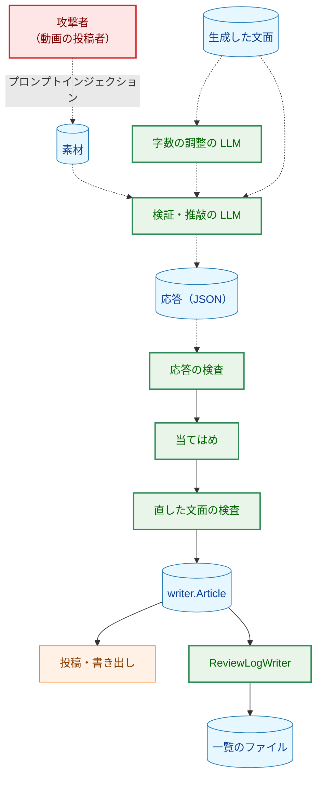

**Legend**

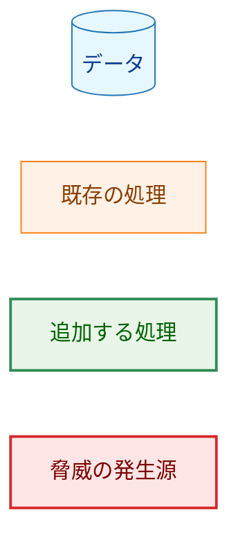

| 脅威 | 対策 |
|---|---|
| 素材に埋め込んだ指示で、検証・推敲の LLM が記事に任意の文章を入れる | 生成と同じく完全には防げない（[security.md](../../dev/security.md) §6 の前提）。変更は一覧の項目に限られ、各項目は改行を含めず、見出しを変えられない（§3.5.4）。直した文面は生成と同じ検査を通り、投稿の前に `CheckPublishable` とメンションの検査を通る。出典のブロックはコードが付ける（既存）。変更はすべて一覧に記録され、`--review-log` で確かめられる。標準エラー出力の要約にも、件数と理由の種類ごとの件数が出る（§3.9）。受け入れる残余のリスクは §5.4 に挙げる |
| 生成した文面に入り込んだ指示で、字数の調整の LLM が文面を書き換える | 字数の調整は文面全体を書き直すので、変更の範囲は一覧のように限られない。字数の調整の出力は生成と同じ検査を通り、続く検証・推敲の段階で素材と突き合わせられる（F-001 の段階の順序の理由）。字数の調整には素材を渡さないので、素材に埋め込んだ指示は直接は届かない |
| 巨大な応答や大量の項目で、メモリや時間を使い切らせる | 応答全体 1 MiB（解析の前に確かめる）、項目 256 の上限（§3.5.3）。当てはめの探索は、項目ごとに文面の長さに比例する時間で終わる（§3.5.4）|
| `encoding/json` が黙って修復する入力（不正な UTF-8、対になっていないサロゲート、重複したキー、末尾の内容）で、検査した値と実際に受理される値をずらす | `strictjson` の既存の検査と `CollectOnly` で拒否する（§3.5.3）|
| あいまいな「直す前の記述」で、意図と別の箇所を変えさせる | 出現がちょうど 1 回の項目だけを受理し、重なる項目を拒否する（§3.5.4）|
| 応答の値に制御文字を入れ、一覧のファイルや標準エラー出力を表示する端末を操作する | 4 つの文字列のタブ以外の制御文字を拒否する（§3.5.3）。一覧のファイルの書き出しの前にも `ReviewResult.Check` で確かめる（§3.8）。エラーのメッセージに応答の値を含めない（§4.2）|
| 検証・推敲のプロバイダの API キーを出力に漏らす | API キーは `Config` に `secret.Secret` で保持し、CLI の伏せ字化の対象に入る（§3.7）。一覧のファイルには、応答の値と記事のタイトル・URL・モデル名だけを書き、設定の値を書かない（要件 §4.2）|

### 5.2. 送るデータ

検証・推敲の段階は、字幕・概要欄・動画タイトル・チャンネル名と文面を、検証・推敲のプロバイダに送る。いずれも公開動画から得た値と、それから作った文面であり、生成で既に生成のプロバイダに送っている値と同じ種類である（[security.md](../../dev/security.md) §4）。検証・推敲のプロバイダを生成と別にすると、送り先のプロバイダが 1 つ増える。字数の調整の段階は、文面だけを生成のプロバイダに送る。security.md の §4 にこのことを加える（§3.10）。

### 5.3. 一覧のファイル

一覧のファイルは、`--out` のファイルと同じ手順で作り、既存のファイルを上書きしない（§3.8）。パスはキャッシュディレクトリの外に限る（§3.9）。ファイルには応答の値がそのまま入る。Markdown のビューアで開くと、値の中の生の HTML が解釈されうる。ローカルのファイルであり、評価者が読むためのものなので、残余のリスクとして受け入れる。

### 5.4. 残余のリスク

**構成と内容の変更のうち、当てはめの条件で検出できないもの。** 次の項目は、要件の当てはめの条件（AC-10・AC-14）を満たすので受理される。要件は、条件を満たす一覧を当てはめることを求めている（AC-10）。そのため、これらを拒否する規則は設けず、テンプレートの指示と評価（F-008 の「壊したこと」）で扱う。

- `## ` 以外の見出しを作る項目。`### `・`# ` の見出しのほか、行頭に 1〜3 個の空白を置いた見出し（`   ## x`。CommonMark では見出しになる）や、行全体を `---` に置き換えて前の行を Setext 形式の見出しにする項目も含む。
- 多くの記述を削る項目。256 項目までの削除で、本文を見出しと少しの文だけにできる。
- Markdown のリンクや画像（`[x](https://…)`・``）を入れる項目。Mattermost は画像を表示する。生成の出力にも同じことが起きうる点は、従来と同じである。
- 直した後の記述を、直す前より大きく長くする項目。`--no-shorten` では最終の字数の確認がないので、長さは制限されない。

**記事の投稿の後の失敗。** 一覧のファイルの書き出しは投稿の後に行う。そのため、ディスクの空きがないなどの理由で失敗すると、記事は投稿済みで、一覧は残らない。終了コードは 1 になる。標準エラー出力は、記事が投稿済みで、再実行は不要であることを示す（§3.9）。一覧のファイルを投稿の前に準備する形（投稿の前に一時ファイルを書き、投稿の後に `link(2)` だけを行う）は採らない。パイプラインの段「記事の生成」と「投稿」の間に処理を差し込むことになり、パイプラインの構造を変えるためである。また、`--review-log` と `--out` が別名で同じファイルを指す場合も、投稿の後に失敗する（§3.9）。

**応答の拒否による記事の失敗。** 次の場合、記事全体が失敗し、LLM の呼び出し 1〜3 回分の結果は捨てられる。

- JSON の形に従わない応答（コードフェンスや説明文を付けたもの）。
- 「直す前の記述」が 2 回以上現れる項目。たとえば、同じ誤認識の語が文面に何度も現れる場合。
- 縮めた本文が、検証・推敲の後で上限を超えた場合（AC-07）。
- 打ち切られた応答。

要件は、段階の繰り返しと、検証していない文面への後戻りを禁じている（要件 §2.3、F-006）。そのため、リトライも部分的な受理もしない。拒否した応答そのものは残さない。記事の生成に失敗した場合は一覧のファイルを書き出さない、と要件が定めている（AC-20）ためである。拒否の原因は、エラーのメッセージ（段階の名前、規則、項目の番号）で分かる。評価では、失敗を種類ごとに記録する。種類は、JSON の形、出現なし、複数の出現、重なり、見出し、字数の調整の後の `ErrTooLong`、検証・推敲の後の `ErrTooLong`、打ち切りである。多い種類には、テンプレートの文言と `targetBodyChars` の値で対処する。

**長い動画でのプロンプトの大きさ。** 検証・推敲のプロンプトは、生成のプロンプトの素材に文面を加えたものなので、生成のプロンプトより大きい。生成のプロンプトが 1 MiB の上限に収まっても、検証・推敲のプロンプトが上限を超えることがありうる。その場合は、生成の呼び出しの後に `ErrInvalidTemplate` で失敗し、メッセージに段階の名前が付く（§4.2）。LLM のコンテキストの上限を超える場合は、プロバイダのエラーになる。字数の調整を有効にしていれば、文面は 4,000 字程度なので、差は小さい。

## 6. 処理フロー詳細 (Processing Flow Details)

### 6.1. `Write` の全体フロー

**図6 `Write` の処理の流れ**。矢印は処理の順序を表す。ひし形は分岐である。「エラー」の終端は、すべてゼロ値の `Article` を返す。

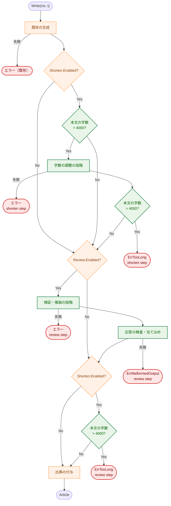

**Legend**

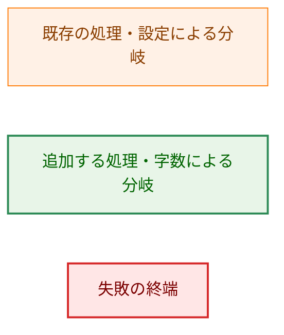

「既存の生成」は、`Transcript` の検査・展開・`Generate`・生成テキストの検査である。各段階は、`ctx` の確認・展開・`Generate`・検査の順に進む（§3.3・§3.5.1）。最終の字数の確認（`C3`）で `ErrTooLong` を返すのは、字数の調整を有効にしている場合だけである。検証・推敲を無効にしている場合、`C3` に届く本文は `C1` か `C2` で上限以内と確かめた本文なので、`C3` は必ず通る。

### 6.2. CLI の実行の手順

**図7 CLI の実行の手順（`--review-log` を指定した場合）**。実線の矢印 `->>` は呼び出しを、点線の矢印 `-->>` は戻り値を表す。

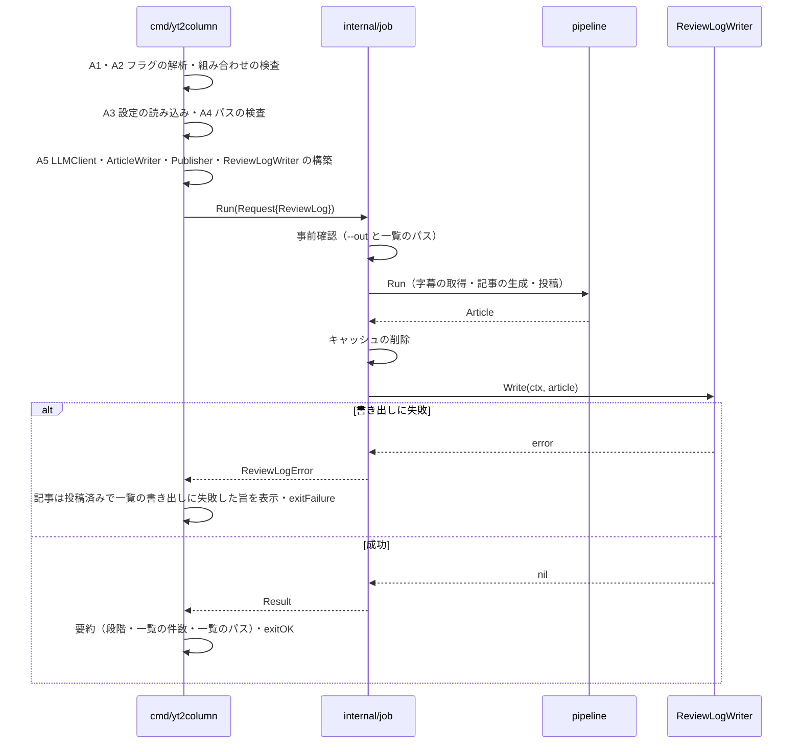

## 7. テスト戦略 (Test Strategy)

### 7.1. ユニットテスト

ユニットテストは LLM の API もネットワークも呼ばない（AC-26）。生成と字数の調整は同じ `LLMClient` を使うので、呼び出しの順に別の応答を返す fake を `internal/llm/testutil` に加える。この fake は、用意した応答の数を超えて呼ばれたらテストを失敗させる。検証・推敲には別の fake を渡す。

- **段階の順序（AC-01・AC-02・AC-08）。** 2 つの fake の呼び出しの記録から、呼び出しの回数と順序、検証・推敲に渡った文面が字数の調整の後のものであることを確かめる。
- **字数（AC-04）。** 4,000 字と 4,001 字の本文、タイトルの行・改行・出典のブロックを数えないこと、Markdown の記号を数えることを、本文の字数の関数と `Write` の両方で確かめる。改行の扱いを確かめる入力は、改行を数えると 4,001 字以上になり、数えなければ 4,000 字になるように組み立てる。
- **プロンプトの内容（AC-05・AC-09）。** 字数の調整のプロンプトに字幕の一意の印が含まれないこと、文面と上限が含まれることを確かめる。検証・推敲のプロンプトに 4 つの素材と文面の一意の印が含まれ、字幕が生成のプロンプトの字幕と一致することを確かめる。
- **応答の受理の規則（AC-12）。** §3.5.3 の各規則について、その規則だけに反する応答を表で並べる。AC-12 の例（一覧がない、要素が欠ける、未知のキー・重複したキー、理由の種類が不正、末尾の内容、大きさ・項目の数の超過）に加えて、次のものを含める。
  - `after` と `delete` の両方がある、どちらもない
  - `delete` が `false`
  - `null` の要素
  - コードフェンスで囲んだ応答
  - 制御文字を含む値

  境界では、上限ちょうどを受理し、1 つ超えを拒否することを確かめる。エラーのメッセージに、応答の値の一意の印が含まれないことも確かめる。
- **当てはめ（AC-10・AC-11・AC-13・AC-14）。** 次のことを確かめる。
  - AC-10 の `甲乙` の例と、項目の順序を入れ替えても結果が同じであること。
  - 重なり合う出現（`ああ` と `あああ`）を 2 回と数えること。この入力は、重ならない出現だけを数えると 1 回になり、受理されてしまうものである。
  - 範囲が接する 2 つの項目を受理し、1 文字重なる 2 つの項目を拒否すること。
  - タイトルの行の中の項目を受理し、見出しの中の項目と見出しを作る項目を拒否すること。
- **失敗の伝播（AC-03・AC-06・AC-07・AC-24・AC-25）。** 各段階の fake が `llm.ErrTruncated`・`llm.ErrEmptyResponse`・`context.DeadlineExceeded`・テスト用の番兵を返したとき、`errors.Is` で元の番兵を判定でき、`errors.AsType[*StepError]` で失敗した段階を取り出せることを確かめる。あわせて、`Article` がゼロ値であること、メッセージが段階の名前を含むことも確かめる。キャンセル済みの `ctx` では、その段階の fake が呼ばれないことを確かめる。
- **テンプレート（AC-23）。** 3 組のテンプレートについて、既存の検査の表（使えない構文の各行）を共通に当てる。字数の調整のテンプレートが `.Transcript` を参照すると構築時に拒否されること、生成のテンプレートが `.ArticleBody` を参照すると拒否されることを確かめる。埋め込まれた 4 つの既定のテンプレートが検査を通り、展開もできることを確かめる。規則に反する上書きファイルのエラーが、そのテンプレートの名前を含むことを確かめる。
- **`New` の検査。** `Review.Enabled` と `Client` の組み合わせ、無効な段階のテンプレートのパスを拒否することを確かめる。
- **`strictjson`。** `CollectOnly` が未知のキー・未知のキーの重複・指定したキーの重複を拒否し、エラーにキーを含めないこと、`AsBool` が `true`・`false` 以外を拒否することを確かめる。
- **`ReviewResult.Check`。** 列挙の外の値、空の `Before`、`Action` と `After` の食い違い、制御文字を、それぞれ拒否することを確かめる。
- **設定（AC-15〜AC-18）。** §3.7 の表の各行を `config.Load` のテストで確かめる。AC-16 の後半（プロバイダが生成と異なる場合の API キーの必須）は、受理するプロバイダが 2 つ以上になる 0009 の実装の後でなければ、その構成をテストで作れない。本タスクを先に実装する場合は、0009 の実装の後に加えるテストとして実装計画に記録する（§7.4・§8）。
- **出力（AC-19・AC-22）。** `renderArticle` が、段階で LLM を呼ばなかった記事では従来の書式と一致し、段階ごとの行を字数の調整・検証・推敲の順に書くことを確かめる。`CheckPublishable` が、制御文字を含む段階のモデル名と、`Check` を通らない `Review` を拒否することを確かめる。
- **一覧のファイル（AC-20）。** `ReviewLogWriter` の書式（空の一覧、削除の項目、改行を含む根拠）、既存のファイルを上書きしないこと、`link(2)` の失敗で一時ファイルを残さないことを、`atomicFile` の差し替え口を使って確かめる。

各テストは、対象の仕組みを壊すと失敗することを確かめてからコミットする（CLAUDE.md「Every test must be able to fail for its stated reason」）。

### 7.2. 統合テスト

- **CLI の組み立て（`cmd/yt2column`、fake の `LLMClient`）。** 次のことを確かめる。
  - 既定で 2 つの段階が呼ばれること。
  - `--no-review`・`--no-shorten` のそれぞれと、両方の組み合わせ（AC-19。両方を指定した出力を、本タスクの前の書式と比べる）。
  - `--review-log` の書き出しと、書き出しの失敗（AC-20）。失敗の出力に「article was kept」が含まれないこと。
  - `--review-log` と `--no-review` の組み合わせが、LLM を呼ばずに `exitUsage` で終わること（AC-21）。
  - `--out` のモデルの行（AC-22）。
  - 規則に反する上書きテンプレートで、LLM を呼ばずに終わること（AC-23）。
  - 検証・推敲の段階の `ErrMalformedOutput`（`StepError` の `Step` が `StepReview`）で `--no-review` の案内が出ること。生成の `ErrMalformedOutput`（`StepError` で包まれない）と、字数の調整の段階の `ErrMalformedOutput` では出ないこと。
  - `ReviewLogError` で、要約が失敗の文言より先に出て、§4.2 の文言で報告され、終了コードが 1 であること。
- **既存のテスト（AC-27）。** `Write` まで進む既存の CLI のテストは、引数に `--no-shorten --no-review` を加えて、段階を無効にした構成で実行する。テストの期待は変えない。`internal/writer` と `internal/job` の既存のテストは、`Options{}` を使い、`Article` を `==` で比べたまま変更しない。
- **実 API の統合テスト。** 既存の `TestIntegrationCLI`（`cmd/yt2column/integration_test.go`）は `--no-shorten --no-review` を加え、`Generate` が 1 回であることの確認を保つ。2 つの段階を実 API で通す確認は、評価（F-008）の実行で行う。実 API の応答の形は LLM によって揺れ、自動のテストにすると LLM の振る舞い次第でテストが失敗するためである。

### 7.3. セキュリティテスト

- §5.1 の各脅威に対応する入力（巨大な応答、項目の数の超過、重複したキー、不正な UTF-8、対になっていないサロゲート、制御文字、あいまいな「直す前の記述」）を、§7.1 の応答の受理の規則と当てはめのテストに含める。
- 検証・推敲のプロバイダの API キーが、エラー・標準エラー出力・一覧のファイルに出ないことを、既存の伏せ字化のテストの形で確かめる。0009 の実装の前は、生成と検証・推敲が同じ DeepSeek のキーを使う構成で確かめる。

### 7.4. 受け入れ基準と設計要素の対応

| AC | 設計要素 | 主なテスト |
|---|---|---|
| AC-01 | §3.2 | 段階の順序 |
| AC-02 | §3.2・§3.3 | 段階の順序 |
| AC-03 | §3.3・§3.5.4・§3.6 | 失敗の伝播 |
| AC-04 | §3.3 | 字数 |
| AC-05 | §3.3・§3.4 | プロンプトの内容、テンプレート |
| AC-06 | §3.3・§4.2 | 失敗の伝播 |
| AC-07 | §3.2 | 失敗の伝播 |
| AC-08 | §3.3 | 段階の順序 |
| AC-09 | §3.4・§3.5.1 | プロンプトの内容 |
| AC-10 | §3.5.2・§3.5.4 | 当てはめ |
| AC-11 | §3.5.1 | 当てはめ |
| AC-12 | §3.5.3 | 応答の受理の規則 |
| AC-13 | §3.5.4 | 当てはめ |
| AC-14 | §3.5.4 | 当てはめ |
| AC-15・AC-17・AC-18 | §3.7 | 設定 |
| AC-16 | §3.7 | 設定。後半は 0009 の実装の後に検証する（§7.1）|
| AC-19 | §3.8・§3.9・§4.3 | 出力、CLI の組み立て |
| AC-20 | §3.8・§3.9 | 一覧のファイル、CLI の組み立て |
| AC-21 | §3.9 | CLI の組み立て |
| AC-22 | §3.1・§3.8 | 出力、CLI の組み立て |
| AC-23 | §3.4 | テンプレート、CLI の組み立て |
| AC-24 | §4.1・§4.2 | 失敗の伝播 |
| AC-25 | §3.2 | 失敗の伝播 |
| AC-26 | §7.1 | すべてのユニットテスト |
| AC-27 | §1.3・§3.1・§7.2 | 既存のテスト |
| AC-28〜AC-30 | §8 のフェーズ 6 | 評価（`02_evaluation.md`）|

## 8. 実装優先順位 (Implementation Priorities)

1. **フェーズ 1: `internal/strictjson`。** `CollectOnly`・`AsBool` とそのテスト。他に依存しない。
2. **フェーズ 2: `internal/writer` の部品。** テンプレートの検査と展開の一般化、`checkGeneratedText` の取り出し、本文の字数、一覧の型と `Check`、応答の検査、当てはめ。既存のテストが通ることを確かめながら進める。
3. **フェーズ 3: `internal/writer` の段階と `prompts`。** `Options`・`Article` の拡張、字数の調整と検証・推敲の段階、`Write` の順序、`CheckPublishable`、4 つの既定のテンプレート。
4. **フェーズ 4: 設定と構築。** `internal/config` の検証・推敲の設定、`provider.NewReview`。0009 が先に実装されていれば、プロバイダ固有の変数を読む条件と `newClient` の引数を §3.7 の形に合わせ、AC-16 の後半のテストを加える。0009 がまだなら、AC-16 の後半のテストを 0009 の実装計画に引き継ぐ。
5. **フェーズ 5: 出力と CLI。** `renderArticle`、`atomicFile` と `ReviewLogWriter`、`internal/job`、`cmd/yt2column` のフラグ・構築・案内、既存の CLI のテストの引数、§3.10 の文書と `check_article.py`。
6. **フェーズ 6: 評価。** `02_evaluation.md` に手順を書き、0008 の 5 本の動画で評価する（F-008、AC-28〜AC-30）。失敗の種類（§5.4）も記録する。実 API の実行は、実行のたびに人が承認する（要件 §5）。

## 9. 将来の拡張性 (Future Extensibility)

- **生成の前の字幕の整形（要件 §2.3 のスコープ外）。** 評価で誤認識の写しが残ると分かった場合に、別の issue で扱う。追加するなら、`Write` の生成の前に段階を 1 つ加え、`Options` と `Article` にその段階のフィールドを足す形になる。
- **上位のモデルへの振り分け（#146）。** 検証・推敲の `LLMClient` は `Options` で受け取るので、振り分けを CLI 側で決めて渡す形で加えられる。
- **プロバイダの JSON モード。** DeepSeek や Claude には、JSON だけを返させるリクエストのパラメータがある。`llm.GenerateRequest` はプロバイダ固有のフィールドを持たない（`internal/llm/llm.go:25-29`）ので、本タスクでは使わない。評価で JSON の形に従わない応答が多いと分かった場合は、`GenerateRequest` にプロバイダ共通の「JSON を求める」指定を加え、各アダプタが対応するパラメータに写す形を検討する。
